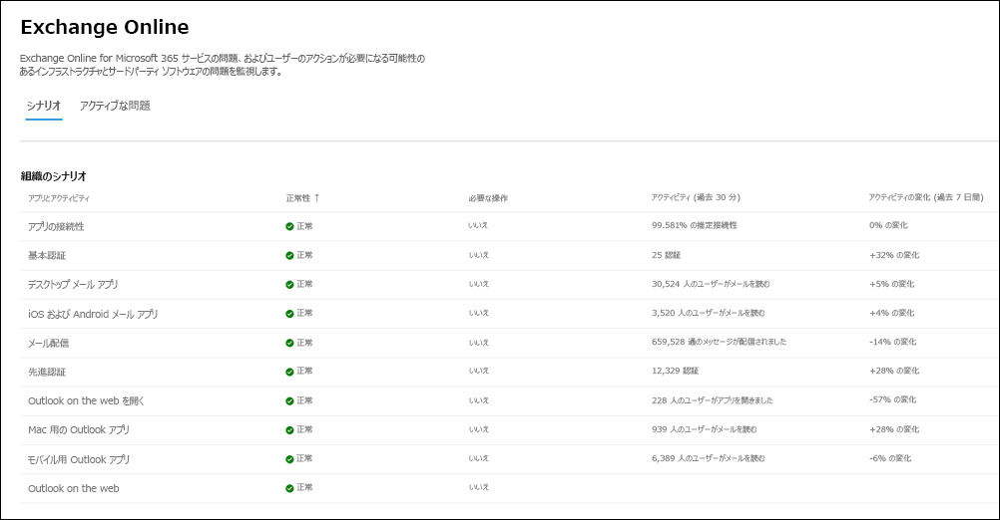

# Microsoft 365 の Exchange Online の監視

Exchange Online の監視は次の組織レベルのシナリオをサポートしています。

- **メール クライアント**: 次のメール クライアントの正常性をメールの読み取りアクティビティに基づいて表示できます。

  - Outlook デスクトップ
  - Outlook on the web
  - iOS と Android のネイティブのメール クライアント
  - iOS と Android の Outlook モバイル アプリ
  - Outlook Mac クライアント

   これらのクライアントについては、メールを読んでいるユーザーに基づいて過去 30 分間のアクティブ ユーザー数を表示すると共に、ダッシュボードのインシデントと勧告の数も表示できます。 このデータは、問題があるかどうかを確認するために、前の週の同じ間隔と比較されます。

   >[!Note]
   > アクティブ ユーザー数は、ユーザーがメールを読むときなど、1 つのアクティビティによって測定されます。 過去 30 分間のアクティビティだけを把握しています。

- **アプリ接続**: 推定接続は、組織のデバイスと Exchange Online 間の成功した合成接続の割合に基づいており、Microsoft の管理外の問題が含まれる場合があります。詳しくは、「[Microsoft 365 Connectivity Optics](microsoft-365-connectivity-optics.md)」を参照してください。

- **基本認証と先進認証**: Exchange Online サービスで正常に検証されたユーザー数。

- **メール フロー**: メッセージが Microsoft 365 ネットワークに到達後、遅延なくメールボックスに正常に配信されたメッセージの数。

- **Outlook for the Web を開く**: Outlook on the web に正常にサインインして起動したユーザーの数。
  
メイン ダッシュボードの Exchange Online の組織レベルのシナリオの例を次に示します。

これらのシナリオでは、主要な数値はメイン ダッシュボードの過去 30 分間です。 これらの各シナリオの詳細表示には、前の週と比較した 30 分の集計で、7 日間のほぼリアルタイムの傾向が示されます。

"自分の組織" というタグの付いたコミュニケーションに、 "問題の発生元" と表示されている、組織用に作成されたインシデントまたはアドバイザリが表示されます。 これらは、軽減策と解決に注意が必要な問題を含む、組織を個別に対象とした通知です。 潜在的な影響について組織に通知するために、サービス正常性で作成および伝達されるさまざまな種類の問題の詳細については、次の記事を参照してください。

- [メールボックス使用率のサービス アラート](microsoft-365-mailbox-utilization-service-alerts.md)

- [MRS ソース遅延のサービス アラート](microsoft-365-mrs-source-delays-service-alerts.md)

- [外部受信者への配信を保留しているメッセージのサービス アラート](microsoft-365-external-recipient-service-alerts.md)

## 優先アカウント監視シナリオ

Exchange Online の優先アカウント監視では、[優先アカウント](/microsoft-365/admin/setup/priority-accounts) を構成すると次のシナリオの正常性を確認できます。

- Exchange のライセンス

- メールボックス記憶域

- メッセージの制限

- フォルダーごとのサブフォルダー数

- フォルダー階層

- 回復可能なアイテム

Exchange のライセンスが付与されるシナリオでは、ライセンスの無効で優先アカウントがログインできなくなっていることを確認します。これは、テナント管理者でも対処することができます。

上記の残りの 5 つのシナリオでは、優先アカウントのメールボックスが [Exchange Online の制限](/office365/servicedescriptions/exchange-online-service-description/exchange-online-limits#mailbox-storage-limits) で説明された制限に近づいているか、または制限を越しているかを確認します。

これらのシナリオでは、優先アカウントに影響を与えるアクティブなアドバイザリとインシデントと解決済みのアドバイザリとインシデントを確認できます。 推奨事項といっしょに優先アカウント用の識別可能情報が、アドバイザリまたはインシデントの詳細に表示されます。 以下は、**正常性 > サービス正常性 > Exchange Online** のページの一例を示しています。

:::image type="content" source="../media/microsoft-365-exchange-monitoring/exchange-priority-accounts-example.png" alt-text="優先アカウントに影響を与えるアクティブなアドバイザリとインシデントと解決済みのアドバイザリとインシデントの例":::

影響を受けるアカウント ウィンドウの **状態** 列には、次の値が表示されます。

- 修正済み: 優先アカウントでアドバイザリまたはインシデントの原因となった問題に対処しました。問題はありません。 

- アクティブ: 優先アカウントでアドバイザリまたはインシデントの原因となっている問題に対処しています。問題は現在も存在します。 

- 遅延: 優先アカウントでアドバイザリまたはインシデントの原因となっている問題は 96 時間以内に対処されていないため、中断されています。問題は現在も存在します。 

次に例を示します。

:::image type="content" source="../media/microsoft-365-exchange-monitoring/exchange-status-column-example.png" alt-text="影響を受けるアカウント ウィンドウの状態列の例":::

アドバイザリまたはインシデントは、**アクティブ** 状態のアカウントがなくなると解消されます。

## よく寄せられる質問

### 1. 各クライアントのダッシュボードのアクティブ ユーザー数が少なく表示されます。 しかし、多くの有効なライセンスがユーザーにアサインされています。 これはどういうことですか?

監視に表示されるアクティブ ユーザー数は、機能が呼び出したアクティビティをユーザーが実行した 30 分間のウィンドウに基づいています。 これを使用数と混同しないように注意してください。 使用状況の数値を表示するには、Microsoft 365 管理センターでアクティビティ レポートを使用します (**レポート** > <a href="https://go.microsoft.com/fwlink/p/?linkid=2074756" target="_blank">**使用状況**</a>)。

### 2. アクティビティの傾向を示すシナリオのインストルメント化されたデータはどこにありますか?

データは Exchange Online サービスにインストルメント化されています。要求が Exchange Online に到達する前に障害が発生するか、Exchange Online に障害がある場合、アクティビティ信号の降下が確認できます。
