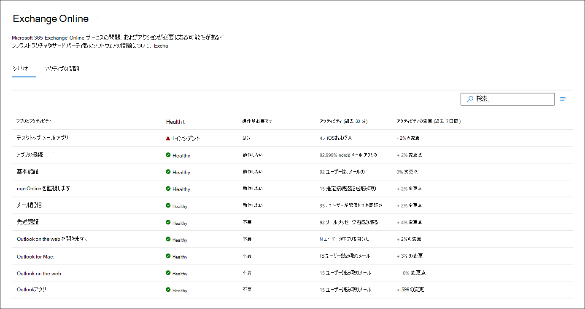
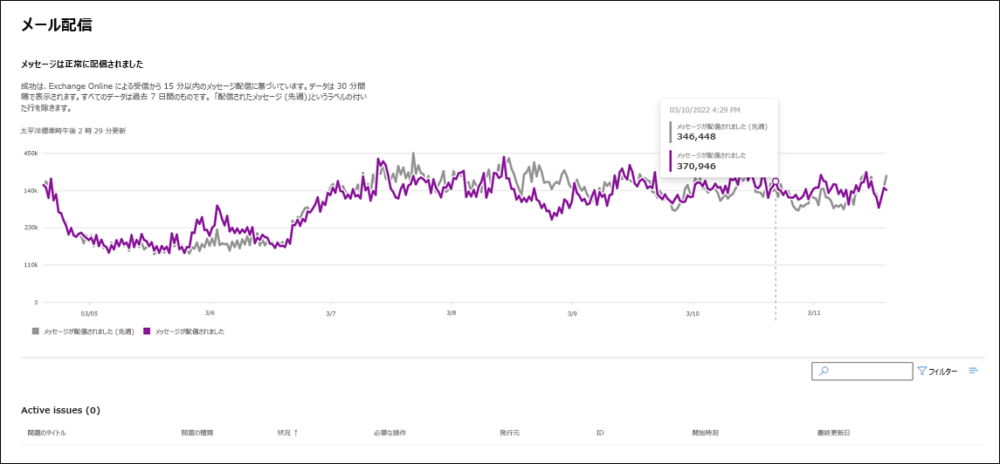
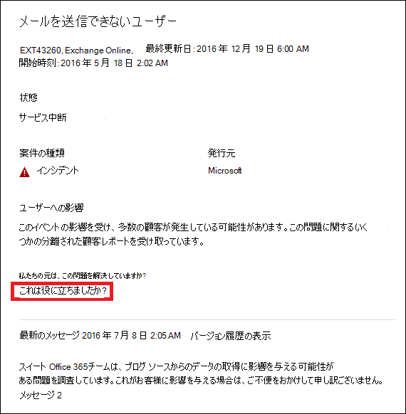

# Microsoft 365 の Exchange Online の監視

<a href="https://go.microsoft.com/fwlink/p/?linkid=2024339" target="_blank">Microsoft 365 管理センター</a> で Exchange Online の監視を使用して、組織の Microsoft 365 サブスクリプションの Exchange サービスの正常性を監視できます。 Exchange Online の監視は、以下のカテゴリに収集されたインシデントと勧告についての情報を提供します。

- **インフラストラクチャ**: 定期的な更新を提供し、問題を解決するために Microsoft が所有する Microsoft 365 のインフラストラクチャで問題が検出されます。 たとえば、Exchange または他の Microsoft 365 のクラウド インフラストラクチャの問題のため、ユーザーが Exchange Online にアクセスできない場合などです。
- **サードパーティのインフラストラクチャ**: 組織が依存関係にあるサードパーティのインフラストラクチャで問題が検出され、解決するには所属の組織によるアクションが必要です。 たとえば、ユーザー認証のトランザクションが、ユーザーが Exchange Online にアクセスできないようにするサードパーティのセキュリティ トークン サービス (STS) プロバイダーによって調整される場合などです。
- **顧客のインフラストラクチャ**: 組織のインフラストラクチャで問題が検出され、解決するには所属の組織によるアクションが必要です。 たとえば、組織によってホストされている STS プロバイダーから承認トークンを取得できないため、ユーザーが Exchange Online にアクセスできない場合などです。

以下は、組織のシナリオにおける Microsoft 365 管理センターの **[サービス正常性]** ページの例です。これは、**[正常性] > [サービス正常性]** と [優先アカウント](../admin/setup/priority-accounts.md) から利用できます。

![Microsoft 365 管理センターの [サービス正常性] ページ。](../media/microsoft-365-exchange-monitoring/service-health-dashboard-example.png)

**[組織の問題]** は、組織レベルの監視と優先アカウントの監視によって識別され、使用されます。

**[組織の問題]** の **[正常性]** の列の値は、組織のインフラストラクチャまたはサードパーティ製のソフトウェアが Exchange Online で組織のユーザーや優先アカウントのサービス正常性エクスペリエンスに影響を与えるかどうかを示します。 勧告やインシデントを解決するには、*ユーザー* のアクションが必要です。

**[Microsoft サービス正常性]** の **[正常性]** 列の値は、サービスが正常な状態にあるか、Microsoft が維持するクラウド サービスに基づいて勧告やインシデントがあるかどうかを示します。

以下は、Microsoft 365 管理センターの Exchange Online の監視ページで、組織レベルのシナリオと優先アカウントのシナリオの正常性の一例を示しています。これは、**[正常性] > [サービス正常性] > [Exchange Online]** から利用できます。

**Exchange Online** の監視ページで、Exchange Online サービスが正常な状態かどうか、関連するインシデントや勧告がないかどうかを確認できます。 Exchange Online の監視で、特定のメールのシナリオにおけるサービス正常性を確認し、リアルタイムに近い信号を表示して組織レベルのシナリオごとに影響を特定できます。 優先アカウントのシナリオの正常性も確認できます。

## 要件

このプレビューは、次の要件を満たしているお客様に対して有効になっています。

- 組織には Office 365 E3、Microsoft 365 E3、Office 365 E5、Microsoft 365 E5 の製品のいずれか 1 つまたは組み合わせから 5,000 個以上のライセンス数が必要です。

  たとえば、組織は Office 365 E3 のライセンスを 3,000 個と Microsoft 365 E5 のライセンスを 2,500 個持つことで、条件を満たす製品から合計 5,500 個のライセンスを持つことができます。

- 組織には、Microsoft Teams、OneDrive for Business、SharePoint Online、Exchange Online、および Office アプリを含む 1 つ以上のコア Microsoft 365 サービスに対して、少なくとも 50 人の月間アクティブ ユーザーが必要です。

- サービス正常性ダッシュボード レベルのアクセス許可のあるロールは、Exchange Online の監視にアクセスできます。 詳細については、「[Microsoft 365 サービス正常性を確認する方法](view-service-health.md)」を参照してください。

## 組織レベルのシナリオ

Exchange Online の監視は次のシナリオをサポートしています。

- **メール クライアント**: 次のメール クライアントの正常性をメールの読み取りアクティビティに基づいて表示できます。

  - Outlook デスクトップ
  - Outlook on the web
  - iOS と Android のネイティブのメール クライアント
  - iOS と Android の Outlook モバイル アプリ
  - Outlook Mac クライアント
  - Outlook on the web を開きます。

   これらのクライアントについては、メールを読んでいるユーザーに基づいて過去 30 分間のアクティブ ユーザー数を表示すると共に、ダッシュボードのインシデントと勧告の数も表示できます。 このデータは、問題があるかどうかを確認するために、前の週の同じ間隔と比較されます。

   >[!Note]
   > アクティブ ユーザー数は、ユーザーがメールを読むときなど、1 つのアクティビティによって測定されます。 過去 30 分間のアクティビティだけを把握しています。

- **アプリ接続**: 推定接続は、組織のデバイスと Exchange Online 間の成功した代理接続の割合に基づいており、Microsoft の管理外の問題が含まれる場合があります。 詳細については、「[Microsoft 365 接続光学](microsoft-365-connectivity-optics.md)」を参照してください。

- **基本認証と先進認証**: Exchange Online サービスで正常に検証されたユーザー数。

- **メール フロー**: メッセージが Microsoft 365 ネットワークに到達後、遅延なくメールボックスに正常に配信されたメッセージの数。

  

これらのシナリオでは、主要な数値はメイン ダッシュボードの過去 30 分間です。 これらの各シナリオの詳細表示には、前の週と比較した 30 分の集計で、7 日間のほぼリアルタイムの傾向が示されます。

## 優先アカウント監視シナリオ

Exchange Online の優先アカウント監視では、[優先アカウント](/microsoft-365/admin/setup/priority-accounts) を構成すると次のシナリオの正常性を確認できます。

- Exchange のライセンス

- メールボックス記憶域

- メッセージの制限

- フォルダーごとのサブフォルダー数

- フォルダー階層

- 回復可能なアイテム

Exchange のライセンスが付与されるシナリオでは、ライセンスの無効で優先アカウントがログインできなくなっていることを確認します。これは、テナント管理者でも対処することができます。

上記の残りの 5 つのシナリオでは、優先アカウントのメールボックスが [Exchange Online の制限](/office365/servicedescriptions/exchange-online-service-description/exchange-online-limits#mailbox-storage-limits) で説明された制限に近づいているか、または制限を越しているかを確認します。

これらのシナリオでは、優先アカウントに影響を与えるアクティブなアドバイザリとインシデントと解決済みのアドバイザリとインシデントを確認できます。 推奨事項といっしょに優先アカウント用の識別可能情報が、アドバイザリまたはインシデントの詳細に表示されます。 以下は、**正常性 > サービス正常性 > Exchange Online** のページの一例を示しています。

:::image type="content" source="../media/microsoft-365-exchange-monitoring/exchange-priority-accounts-example.png" alt-text="優先アカウントに影響を与えるアクティブなアドバイザリとインシデントと解決済みのアドバイザリとインシデントの例":::

影響を受けるアカウント ウィンドウの **状態** 列には、次の値が表示されます。

- 修正済み: 優先アカウントでアドバイザリまたはインシデントの原因となった問題に対処しました。 問題はありません。 

- アクティブ: 優先アカウントでアドバイザリまたはインシデントの原因となっている問題に対処しています。 問題があります。 

- 遅延: 優先アカウントでアドバイザリまたはインシデントの原因となっている問題は 96 時間以内に対処されていないため、中断されています。 問題があります。 

次に例を示します。

:::image type="content" source="../media/microsoft-365-exchange-monitoring/exchange-status-column-example.png" alt-text="影響を受けるアカウント ウィンドウの状態列の例":::

アドバイザリまたはインシデントは、**アクティブ** 状態のアカウントがなくなると解消されます。 

## フィードバックを送信する

フィードバックは 2 つの方法でお寄せいただけます。

- Microsoft 365 管理センターのすべてのページに表示されている **[フィードバックの送信]** オプションを使用します。

- 特定のインシデントや勧告の場合、**[この投稿は役に立ちましたか?]** のリンクを使用してフィードバックを送信します。

  

## よく寄せられる質問

#### 1. Microsoft 365 管理センターの [正常性] に [Exchange Online の監視] が表示されないのはなぜですか? 

まず、<a href="https://go.microsoft.com/fwlink/p/?linkid=2024339" target="_blank">Microsoft 365 管理センター</a>の **[ホーム]** ページで新しい管理センターが有効になっていることを確認してください。

次に、次の両方の要件を満たしていることを確認してください。

- 組織に Office 365 E3、Microsoft 365 E3、Office 365 E5、Microsoft 365 E5 の製品のいずれか 1 つまたは組み合わせから 5,000 個以上のライセンス数が必要です。

- 組織には、Microsoft Teams、OneDrive for Business、SharePoint Online、Exchange Online、および Office アプリを含む 1 つ以上のコア Microsoft 365 サービスに対して、少なくとも 50 人の月間アクティブ ユーザーが必要です。

組織のライセンス数が 5,000 ユーザーを下回り、コア サービスの月間アクティブ ユーザー数が 50 を下回る場合、この要件が満たされるまで Exchange Online の監視は有効になりません。

#### 2. 各クライアントのダッシュボードのアクティブ ユーザー数が少なく表示されます。 しかし、多くの有効なライセンスがユーザーにアサインされています。 これはどういうことですか?

監視に表示されるアクティブ ユーザー数は、機能が呼び出したアクティビティをユーザーが実行した 30 分間のウィンドウに基づいています。 これを使用数と混同しないように注意してください。 使用状況の数値を表示するには、Microsoft 365 管理センターでアクティビティ レポートを使用します (**レポート** > <a href="https://go.microsoft.com/fwlink/p/?linkid=2074756" target="_blank">**使用状況**</a>)。

#### 3. Teams や SharePoint などの他のサービスに対する他の監視シナリオは追加されますか?

Microsoft は、このエクスペリエンスを Microsoft 365 管理センターのサービス正常性ダッシュボード内に直接統合しています。 これにより、Microsoft は監視シナリオを他のサービスにも拡張できるようになります。お知らせするニュースがある場合は発表されます。

#### 4. このエクスペリエンスの一般提供予定について教えてください。

Microsoft は、Exchange Online の監視を Microsoft 365 管理センターの <a href="https://go.microsoft.com/fwlink/p/?linkid=842900" target="_blank">**[サービス正常性]** ダッシュボード</a>に直接統合しました。

新しくなった統合エクスペリエンスにより、Microsoft はユーザーからのフィードバックを収集し、一般提供の計画を定義する予定です。

#### 5. この機能は無料 (ライセンス付属) と有料 (追加コンテンツ) のどちらですか? 

これはプレビュー段階にある無料の機能で、質問 1 での要件を満たしたユーザーのみが利用できます。このコンテンツを受け取るための有料オプションはありません。

#### 6. フィードバックを送信するにはどうすればいいですか?

一般的なフィードバックについては、**Exchange Online** の監視ページの右下隅にある **[フィードバックの送信]** アイコンを使用してください。 

インシデントや勧告のフィードバックについては、**[この投稿は役に立ちましたか?]** リンクを使用します。

#### 7. アクティビティの傾向を示すシナリオのインストルメント化されたデータはどこにありますか?

データは Exchange Online サービスにインストルメント化されています。要求が Exchange Online に到達する前に障害が発生するか、Exchange Online に障害がある場合、アクティビティ信号の降下が確認できます。

#### 8. プライバシーに関する懸念はありますか?

監視はサービス メタデータに重点を置ており、ユーザー コンテンツは監視されません。

## 関連項目

- [Microsoft 365 サービス正常性を確認する方法](view-service-health.md) 

- [Exchange Online の制限](/office365/servicedescriptions/exchange-online-service-description/exchange-online-limits#mailbox-storage-limits)

- [優先アカウントを管理および監視する](/microsoft-365/admin/setup/priority-accounts)

- [Microsoft 365 での優先アカウント使用](https://techcommunity.microsoft.com/t5/microsoft-365-blog/using-priority-accounts-in-microsoft-365/ba-p/1873314)

- [Exchange Online 監視でのメールボックス使用率サービスのアラート](microsoft-365-mailbox-utilization-service-alerts.md)
