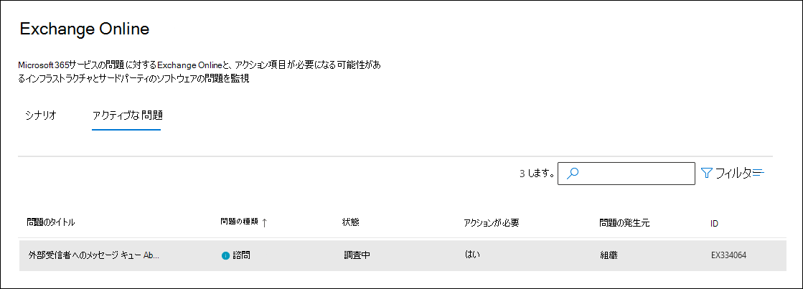
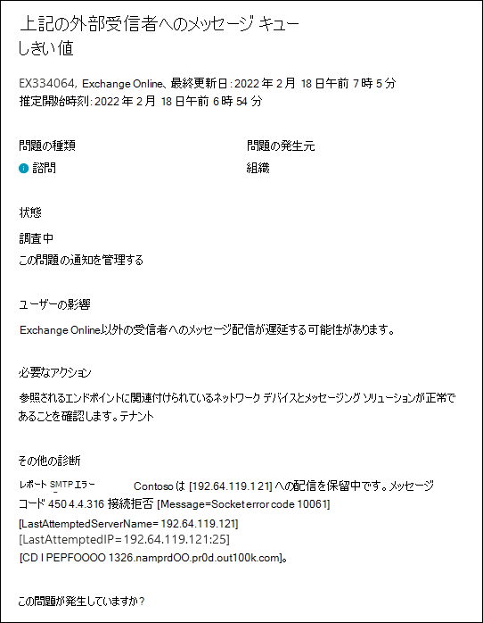

# Exchange Online監視で外部受信者への配信が保留されているメッセージに対するサービス アラート

サービス アラートは、Exchange Online外部の外部受信者へのメール キューの管理者に通知します。 これらのアラートには、Microsoft 以外の修復アクションが必要な場合がありますが、修復に必要な情報を提供できます。

これらのサービス アラートは、Microsoft 365 管理センターに表示されます。 これらのサービス アラートを表示するには、[**正常性** > サービス正常性 **]** に移動し <a href="https://go.microsoft.com/fwlink/p/?linkid=842900" target="_blank">**Exchange Online**</a> > [**アクティブな問題**] タブをクリックします。これらのサービス アラートの名前は、"しきい値を超える外部受信者へのメッセージ キュー" です。

サービス アラートをダブルクリックすると、次のようなポップアップ ページが表示されます。

## これらのサービス アラートは何を示していますか?

外部受信者への配信を保留しているメッセージのサービス アラートは、Exchange Onlineの外部の受信者宛てのメッセージが遅延する可能性があることを通知します。 メッセージのキューは、オンプレミス環境またはサードパーティのメッセージングまたはジャーナリング ソリューションによって発生する可能性があります。

外部受信者にメッセージをキューに登録する一般的な理由を次に示します。 ただし、これらのサービス アラートの原因となる問題は、これらの理由に限定されない可能性があります。

- DNS の変更

- 過剰な送信レート

- 空きディスク領域が少ないオンプレミスのメッセージ転送エージェント (MTA) またはジャーナリング ソリューション

- バックプレッシャの MTA

- ロード バランサーを含むネットワークの問題

- 証明書の問題

各サービス アラートには、問題を修復するための高度な推奨事項が含まれています。 また、サービス アラートは、アラート時にキューに登録されたメッセージの数、メッセージのキューに入れるドメイン、キューに置かれたメッセージのほとんどに関連付けられている SMTP エラー コードも示します。

これらのサービス アラートの根本原因を特定する方法の詳細については、[Exchange Onlineのメール フロー インテリジェンスに関するページを](../security/office-365-security/mail-flow-intelligence-in-office-365.md)参照してください。 この記事には、根本原因を修正するための推奨されるアクションも含まれています。

> [!NOTE]
> Microsoft では、サード パーティベンダーによって提供されるすべての SMTP エラー コードを考慮することはできません。 そのため、管理者は、組織で使用される MTA または履歴管理ソリューションに固有のエラー コードを調査することが必要になる場合があります。

## 詳細情報

組織がオンプレミスまたはExchange Online組織でメール フロー コネクタを最近作成または変更した場合は、次の記事を参照してください。

- [Exchange Online でコネクタを使用してメール フローを構成する](/exchange/mail-flow-best-practices/use-connectors-to-configure-mail-flow/use-connectors-to-configure-mail-flow)

- [メールをルーティングするコネクタの設定](/exchange/mail-flow-best-practices/use-connectors-to-configure-mail-flow/set-up-connectors-to-route-mail)

- [メール フローのベスト プラクティス](/exchange/mail-flow-best-practices/mail-flow-best-practices)

- [セキュリティとコンプライアンス センターのメッセージ追跡の分析情報](/microsoft-365/security/office-365-security/mail-flow-insights-v2)

- [メール フロー ダッシュボードの Queues 分析情報](/microsoft-365/security/office-365-security/mfi-queue-alerts-and-queues#queues-insight-in-the-mail-flow-dashboard)

- [Exchange Onlineで電子メール メッセージをトレースする](/exchange/monitoring/trace-an-email-message/trace-an-email-message)
