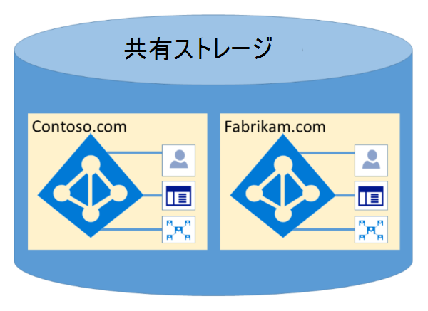

# Microsoft 365分離とアクセス制御 (Azure Active Directory

Azure Active Directory (Azure AD) は、論理的なデータ分離を通じて、高度に安全な方法で複数のテナントをホストするように設計されています。 Azure ADへのアクセスは、承認層によってゲートされます。 Azure ADは、テナント コンテナーを使用している顧客をセキュリティの境界として分離し、共同テナントがコンテンツにアクセスしたり侵害したりすることはできません。 Azure ADの承認層では、次の 3 つのチェックが実行されます。

- プリンシパルで Azure テナントへのアクセスが有効ADか。
- プリンシパルは、このテナント内のデータへのアクセスを有効にしていますか?
- このテナントのプリンシパルの役割は、要求されたデータ アクセスの種類に対して承認されていますか?

アプリケーション、ユーザー、サーバー、またはサービスは、適切な認証AD証明書なしで Azure サーバーにアクセスできません。 要求が適切な資格情報を伴う場合、要求は拒否されます。

事実上、Azure ADは、テナントが所有および管理するコンテナーに対するポリシーとアクセス許可を持つ、独自の保護されたコンテナー内で各テナントをホストします。
 

テナント コンテナーの概念は、ポータルから永続的な記憶域まで、すべてのレイヤーでディレクトリ サービスに深く根付きます。 複数の Azure AD テナント メタデータが同じ物理ディスクに格納されている場合でも、ディレクトリ サービスで定義されている内容以外のコンテナー間には関係が存在し、テナント管理者が指示します。 要求するアプリケーションまたはサービスから Azure ADストレージへの直接接続は、最初に承認層を介さずに行う必要があります。

次の例では、Contoso と Fabrikam の両方に個別の専用コンテナーが用意されています。また、これらのコンテナーは、サーバーやストレージなど、同じ基になるインフラストラクチャの一部を共有している場合でも、互いに分離され、承認とアクセス制御の層によってゲートされます。
 

また、Azure AD 内から実行できるアプリケーション コンポーネントは存在しません。また、あるテナントが別のテナントの整合性を強制的に侵害したり、別のテナントの暗号化キーにアクセスしたり、サーバーから生データを読み取りしたりできません。

既定では、Azure ADは、他のテナントの ID によって発行されるすべての操作を禁止します。 各テナントは、クレーム ベースのアクセス制御AD Azure サーバー内で論理的に分離されます。 ディレクトリ データの読み取りと書き込みはテナント コンテナーに対してスコープ設定され、内部抽象化層と役割ベースのアクセス制御 (RBAC) レイヤーによってゲートされ、テナントがセキュリティ境界として強制されます。 すべてのディレクトリ データ アクセス要求は、これらの層によって処理され、Microsoft 365内のすべてのアクセス要求は、上記のロジックによってポリシー化されます。

Azure ADには、北アメリカ、米国政府機関、EU、ドイツ、ワールドワイドパーティションがあります。 テナントは 1 つのパーティションに存在し、パーティションには複数のテナントを含めできます。 パーティション情報は、ユーザーから抽象化されます。 特定のパーティション (その中のすべてのテナントを含む) は、複数のデータセンターにレプリケートされます。 テナントのパーティションは、テナントのプロパティ (国コードなど) に基づいて選択されます。 各パーティション内のシークレットや他の機密情報は、専用のキーで暗号化されます。 キーは、新しいパーティションが作成されると自動的に生成されます。

Azure AD機能は、各ユーザー セッションに固有のインスタンスです。 さらに、Azure ADは暗号化テクノロジを使用して、ネットワーク レベルで共有システム リソースを分離し、許可されていない情報の転送や意図しない転送を防止します。
