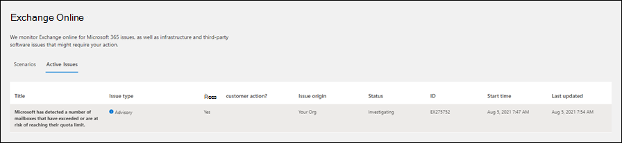

# <a name="service-alerts-for-mailbox-utilization-in-exchange-online-monitoring"></a>監視のメールボックス使用率に関するExchange Online通知

クォータに達または超過するリスクExchange Onlineメールボックスを通知する新しい Exchange Online サービス アラートがリリースされました。 これらのサービス通知は、管理者の介入が必要な可能性がある組織内のメールボックスの数を表示します。

これらのサービス通知は、サービス ウィンドウにMicrosoft 365 管理センター。 これらのサービス通知を表示するには、[**正常性** サービスの正常性] Exchange Online[アクティブな問題]  >  <a href="https://go.microsoft.com/fwlink/p/?linkid=842900" target="_blank"></a>  >  **タブをクリック** します。メールボックス使用率サービスアラートの例を次に示します。



記憶域クォータに近いメールボックス (メールボックス使用状況レポートと呼ばれる) の一覧を表示するには、次のスクリーンショットで強調表示されているリンクをクリックします。 このリンクは、サービスアラートに表示されます。


または、メールボックス使用状況レポートへの直接 URL はです <https://admin.microsoft.com/Adminportal/Home?source=applauncher#/reportsUsage/MailboxUsage> 。

## <a name="what-do-these-service-alerts-indicate"></a>これらのサービスアラートは何を示していますか?

メールボックス使用率に関するサービス アラートは、メールボックスストレージクォータに近いメールボックスの保留に関する通知を管理者に通知します。 メールボックスに配置できる保持の種類には、訴訟ホールド、電子情報開示ホールド、Microsoft 365 保持ポリシー (データを保持するように構成されている) が含まれます。 メールボックスが保留の場合、ユーザー (または自動化されたプロセス) はメールボックスからデータを完全に削除できません。 代わりに、管理者は、ユーザーのプライマリ メールボックスからアーカイブ メールボックスにデータを移動するために、Exchange Online (データ保持に関連する組織のコンプライアンス ポリシーとインライン) で MRM 保持ポリシーを構成する必要があります。 保持されていないメールボックスが重大または警告状態に達した場合、管理者はアーカイブ メールボックスを有効[](../compliance/enable-archive-mailboxes.md)にして自動拡張アーカイブを[](../compliance/enable-unlimited-archiving.md)有効にし、メールボックスに割り当てられたアーカイブ ポリシーの保持期間 (プライマリ メールボックスからアーカイブ メールボックスに電子メールを移動する) が十分に短い必要があります。 メールボックス使用率サービスの通知によって識別されるクォータの問題を解決するために何も行われなかった場合、ユーザーは電子メール メッセージまたは会議の招待を送受信できない可能性があります。

メールボックス使用率に関するサービス アラートには、クォータに近いメールボックスの数に関するテーブルが含まれています。 次のセクションでは、これらのテーブルの情報と、管理者がこれらのメールボックスがクォータを超えないようにするために実行できるアクションについて説明します。

> [!NOTE]
> サービス通知には、次のセクションで説明する表の列に表示されるメールボックス クォータ プロパティの説明が含まれます。

### <a name="mailboxes-on-hold-without-an-archive"></a>アーカイブのないメールボックスの保留

次の表に、クォータに近いがアーカイブ メールボックスが有効になっていない保留メールボックスの数を示します。 表の各列は、特定のクォータと、そのクォータに近いメールボックスの数を識別します。

| # Mailboxes ProhibitSendReceiveQuota (警告)| # Mailboxes ProhibitSendReceiveQuota (Critical)** |# Mailboxes RecoverableItemsQuota (警告)|# Mailboxes RecoverableItemsQuota (Critical)** |
|:--------------|:--------------|:------------------|:--------------- |
| 2             | 2             | 1                 | 0               |
||||

管理者がこれらのメールボックスに対して実行できるアクションは、アーカイブ メールボックスを有効にし、MRM アーカイブ ポリシー (アイテムをアーカイブ メールボックスに移動する Exchange Online の MRM 保持ポリシー) がメールボックスに適用され、アイテムがアーカイブ メールボックスに移動されるのを確認します。 詳細については、「メールボックスの [アーカイブポリシーと削除ポリシーを設定する」を参照してください](../compliance/set-up-an-archive-and-deletion-policy-for-mailboxes.md)。

アーカイブ メールボックスを有効にした後、回復可能なアイテム フォルダーのクォータを増やすることを検討することをお勧めします。 これにより、保留にされているメールボックスの回復可能なアイテム フォルダーのクォータを超えるのを防ぐのに役立ちます。 詳細については、「保留メールボックス [の回復可能なアイテムのクォータを増やす」を参照してください](../compliance/increase-the-recoverable-quota-for-mailboxes-on-hold.md)。

### <a name="mailboxes-on-hold-with-an-archive"></a>アーカイブを含む保留メールボックス

次の表に、クォータに近い、アーカイブ メールボックスが有効になっている保留メールボックスの数を示します。

|# Mailboxes ProhibitSendReceiveQuota (警告) |# Mailboxes ProhibitSendReceiveQuota (Critical) |# Mailboxes RecoverableItemsQuota (警告) |# Mailboxes RecoverableItemsQuota (Critical)** |
|:--------------|:--------------|:------------------|:--------------- |
| 1             | 1             | 6                  | 0               |
||||

管理者がこれらのメールボックスに対して実行できるアクションは、[回復可能なアイテム] フォルダーのクォータを増やします。 詳細については、「保留メールボックス [の回復可能なアイテムのクォータを増やす」を参照してください](../compliance/increase-the-recoverable-quota-for-mailboxes-on-hold.md)。

また、管理者は、アイテムをアーカイブ メールボックスに移動する MRM アーカイブ ポリシーもメールボックスに適用され、アーカイブ ポリシーの保持期間が短いので、アイテムがアーカイブに移動する前にプライマリ メールボックス内で長く保持されすぎなかねない必要があります。

> [!NOTE]
> MRM アーカイブ ポリシーは、プライマリ メールボックスの回復可能なアイテム フォルダーから、対応するアーカイブ メールボックスの回復可能なアイテム フォルダーにアイテムを移動します。 この機能は、メールボックスが回復可能なアイテムクォータのクォータを超えるのを防ぐのに役立ちます。

### <a name="mrm-retention-policies-in-your-organization"></a>組織内の MRM 保持ポリシー

メールボックス使用率のサービス アラートには、組織内の MRM 保持ポリシーに関する情報と、保持ポリシーであるメールボックスにアーカイブ メールボックスが含まれているかどうかに関する情報を含むテーブルが含まれている場合があります。 アイテム保持ポリシーの詳細については、「アイテム保持タグとアイテム保持ポリシー」を参照[Exchange Online。](/exchange/security-and-compliance/messaging-records-management/retention-tags-and-policies)

| RetentionPolicyGuid | MailboxType | HasMoveDumpsterToArchiveTag | HasMovePrimaryToArchiveTag | HasPersonalArchiveTag |  メールボックス |
|:--------------|:--------------|:---------------|:---------------|:---------------|:--------------- |
| 6c041498-1611-5011-a058-1156ce60890c | PrimaryWithArchive | True | False | True | 398 |
| 6c041498-1611-5011-a058-1156ce60890c | Primary | True | False | True | 10 |
| 749ceecc-d49d-4000-a9d5-594dbaea1e56 | PrimaryWithArchive | False | True | False | 7  |
| 269f6a85-1234-4648-8cde-59bbc7bc67d0 | PrimaryWithArchive | True | True | True | 1 |
| 13fb778d-e1cb-4c44-5768-ad4282906c1f | PrimaryWithArchive | True | True  | False | 1 |
|||||||

次の一覧では、前の表の各列について説明します。

- **RetentionPolicyGuid**: 組織内のメールボックスに割り当てられたアイテム保持ポリシーの GUID。 前の例では、同じ保持ポリシーに対して 2 つの個別の行があります。 最初の行は、ポリシーが割り当てられているアーカイブを持つメールボックスの数を示します。 2 行目は、同じポリシーが割り当てられているアーカイブのないメールボックスの数を示します。

   この列に記載されているアイテム保持ポリシーの詳細については、PowerShell で次のコマンド[Exchange Onlineします](/powershell/exchange/connect-to-exchange-online-powershell)。

   ```powershell
   Get-RetentionPolicy <GUID> | FL
   ```

   Name プロパティの **値** は、管理センターの [アイテム保持ポリシー] ページに表示される保持ポリシー Exchangeです。

- **MailboxType**: ポリシーが割り当てられているメールボックスの種類を指定します。 値には *、プライマリ* (アーカイブのないメールボックス) または *PrimaryWithArchive* (アーカイブのあるメールボックス) が含まれます。 この列の値が *Primary* の場合は、ポリシーが割り当てられているメールボックス ([メールボックス] 列は、これらのメールボックスの数を示す) のアーカイブを有効にする必要があります。  それ以外の場合、アイテムを移動するアーカイブがないので、アーカイブ ポリシーまたは個人用アーカイブ タグは機能しません。

- **HasMoveDumpsterToArchiveTag**: 保持ポリシーに、プライマリ メールボックスの回復可能なアイテム フォルダー (ダンプ *スターとも呼* ばれる) 内のアイテムをアーカイブ内の回復可能なアイテム フォルダーに移動するアイテム保持タグが含まれるかどうかを示します。 この種類の保持タグは管理者によって設定されます。回復可能なアイテム タグの保持期間が長すぎる場合は、保持期間を短縮すると、メールボックスが回復可能なアイテム フォルダーのクォータに近付くのを防ぐのに役立ちます。 たとえば、保持期間が 30 日に設定されている場合、保持期間を 3 日または 5 日に減らすことが役立つ場合があります。  詳細については、「保留メールボックス [の回復可能なアイテムのクォータを増やす」を参照してください](../compliance/increase-the-recoverable-quota-for-mailboxes-on-hold.md)。

- **HasMovePrimaryToArchiveTag**: 保持ポリシーに既定の "アーカイブへの移動" 保持タグ (アーカイブ ポリシーとも呼 *ばれる)* が含まれているかどうかを示します。 この場合、メッセージはプライマリ メールボックスの通常のフォルダーからアーカイブ メールボックスに移動されます。 この種類の保持タグは管理者によって設定されます。繰り返しますが、このタグの保持期間が短すぎると、ユーザーはプライマリ メールボックスのクォータに継続的に達する際に問題が発生する可能性があります。 アーカイブ ポリシーの保持期間を短縮すると、この問題の解決に役立つ場合があります。

- **HasPersonalArchiveTag**: アイテム保持ポリシーに個人用の "アーカイブへの移動" タグが含まれるかどうかを示します。 アイテム保持ポリシーに個人用の "アーカイブへの移動" タグが含まれる場合、ユーザーはメールボックス内のフォルダーとメッセージにこのタグを適用して、アイテムをアーカイブに移動できます。 ユーザーは、このタグが適用されたフォルダーにメッセージを移動する受信トレイ ルールを設定することもできます。 どちらの場合も、プライマリ メールボックスのクォータに達しないように、アイテムをアーカイブに移動するのに役立ちます。

- **メールボックス**: アイテム保持ポリシーが割り当てられているメールボックスの数 (アーカイブの持ち場所またはアーカイブがないメールボックスの数を示します **。MailboxType** 列に示されます)。

## <a name="how-often-will-i-see-these-service-alerts"></a>これらのサービス通知はどのくらいの頻度で表示されますか?

クォータの問題を解決するためのアクションを実行しない場合は、この種類のサービス アラートが 4 日ごとに表示される可能性があります。 後続のサービス通知には、クォータに近い他のメールボックスのメールボックス数が多くなる場合があります。 クォータの問題を解決するためのアクションを実行すると、クォータの問題を持つ別のメールボックスが特定された場合にのみ、このサービス アラートが発生します。

## <a name="more-information"></a>詳細

- アーカイブ メールボックスの問題のトラブルシューティングと解決の詳細については、「コンプライアンス[Microsoft 365を参照してください](/office365/troubleshoot/microsoft-365-compliance-welcome)。

- メールボックスに配置された保留リストの識別に関するガイダンスについては、「メールボックスに配置された保留の種類を識別する方法 [」を参照してください](../compliance/identify-a-hold-on-an-exchange-online-mailbox.md)。
