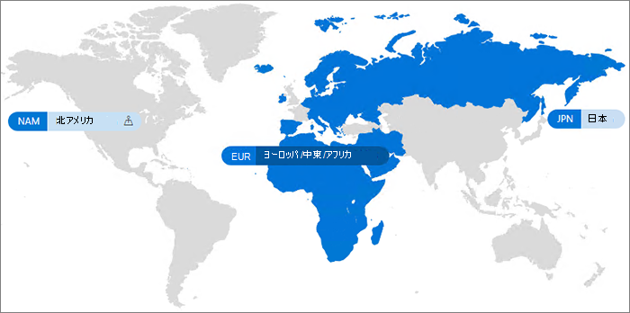

# Microsoft 365 Multi-Geo

Microsoft 365 Multi-Geo を使用すれば、組織はその組織の Microsoft 365 のプレゼンスを、その既存のテナント内の複数の地域または国に対して展開することができます。 Microsoft アカウント チームと連絡を取り、お客様の多国籍企業を Microsoft 365 Multi-Geo にサインアップしましょう。
  
Microsoft 365 Multi-Geo を使用すると、データ所在地に関連する要件を満たすために選択した地域の場所で保存データのプロビジョニングと保存を行うことができ、同時に、モダンな生産性向上エクスペリエンスを従業員に対してグローバルに展開することができます。

Microsoft 365 のMulti-Geo の導入ビデオについては、「[SharePoint Online と OneDrive を使用してデータの保存場所を制御する](https://www.youtube.com/watch?v=Do9U3JuROhk)」を参照してください。

## Multi-Geo アーキテクチャ

Multi-Geo 環境では、Microsoft 365 テナントは中央の場所 (Microsoft 365 サブスクリプションが最初にプロビジョニングされた場所) と 1 つ以上のサテライトの場所で構成されています。 複数地域テナント内では、地理的な場所、グループ、およびユーザー情報に関する情報が、Azure Active Directory (Azure AD) 内でマスター管理されます。 テナント情報が集中的にマスター管理され、個々の地理的な場所に同期されるので、その企業のすべてのユーザーが関わる共有とエクスペリエンスにグローバルな情報が含まれています。

Microsoft 365 Multi-Geo は、パフォーマンスの最適化を目的とした設計ではなく、データ所在地に関する要件を満たすように設計されていることにご注意ください。 Microsoft 365 のパフォーマンスを最適化する方法については、「[Microsoft 365 のネットワーク計画とパフォーマンス チューニング](https://support.office.com/article/e5f1228c-da3c-4654-bf16-d163daee8848)」を参照するか、サポート グループにお問い合わせください。

## 用語

Office 365 Multi-Geo の説明に使用される重要な用語を以下に示します。

- **中央の場所** のテナントが最初にプロビジョニングされた地域の場所です。
- **地域管理者** - 指定された 1 つ以上のサテライトの場所を管理できる管理者。
- **地域コード** - 特定の地域の場所を表す 3 文字のコード。
- **地域の場所** - Exchange メールボックス、OneDrive サイト、SharePoint サイトなど、データをホストする複数地域テナントで使用できる地理的な場所。
- **優先されるデータの場所 (PDL)** - 管理者が設定したユーザー プロパティであり、ユーザーの Exchange メールボックスと OneDrive がプロビジョニングされる地域の場所を示します。 PDL では、ユーザーによって作成された SharePoint サイトのプロビジョニング場所も決定されます。
- **サテライトの場所** - 地理機能に対応している Microsoft 365 ワークロード (SharePoint、OneDrive、Exchange) が複数地域テナントで有効になっている地域の場所。
- **テナント** - Microsoft 365 における組織の表現。通常、1 つ以上のドメインが関連付けられています (例: contoso.com)。

## ライセンス

Microsoft 365マルチジオは、テナント内に少なくとも 250 Microsoft 365 シートを持ち、複数地域を使用しているシートの 5% 以上を持つ Enterprise Agreement のお客様に対して、次の Microsoft 365 サブスクリプション プランのアドオンとして利用できます。 ユーザー サブスクリプション ライセンスは、複数地域サービス Enterprise Agreementと同じライセンス上にある必要があります。 詳細については、Microsoft アカウント チームにお問い合わせください。

- Microsoft 365 F1、F3、E3、または E5
- Office 365 F3、 E1、 E3、または E5
- Exchange Online プラン 1 またはプラン 2
- OneDrive for Business プラン 1 またはプラン 2
- SharePoint Online プラン 1 またはプラン 2

ライセンスがユーザーに割り当てられた後で削除された場合、Teamsのチャット データがキューに登録され、中央の場所に戻されます。 SharePointおよびExchangeデータは移動されません。

## Microsoft 365 Multi-Geo の利用可能地域

現在、Microsoft 365 Multi-Geo は次の地域と国で提供されています。

[!INCLUDE [Microsoft 365 Multi-Geo locations](../includes/microsoft-365-multi-geo-locations.md)]

## はじめに

以下の手順に従って複数地域を開始しましょう。

1. アカウント チームと協力して、_Microsoft 365 の複数地域機能_ をサービス プランに追加します。 必要なライセンス数の追加方法を説明いたします。 Multi-Geo 機能は、250 以上の Microsoft 365 サブスクリプションを使用している EA のお客様が利用できます。

   Microsoft 365 Multi-Geo の使用を開始するには、事前に Microsoft が複数地域サポート用に Exchange Online テナントを構成する必要があります。 この 1 回限りの構成プロセスは、*Microsoft 365 の複数地域機能* サービス プランを注文し、ライセンスがテナントに表示された後にトリガーされます。 テナントが各ワークロードの構成プロセスを完了すると[、Microsoft 365](https://support.office.com/article/38FB3333-BFCC-4340-A37B-DEDA509C2093)メッセージ センターでワークロード固有の通知を受け取り、Microsoft 365 Multi-Geo 機能の構成と使用を開始できます。 Multi-Geo サポート用にテナントを構成するために必要な時間は、テナントによって異なりますが、多くのテナントは機能ライセンスの受信後 1か月以内に終了します。  大型または複雑なテナントの場合は、構成プロセスの完了により多くの時間が必要になる場合があります。 必要な場合は、特定のテナントの詳細をお客様のアカウント チームにお問い合わせください。

2. 「[OneDrive for Business 複数地域の計画](plan-for-multi-geo.md)」を参照します。

3. [複数地域環境の管理](administering-a-multi-geo-environment.md)および[環境でのユーザー エクスペリエンス](multi-geo-user-experience.md)について確認します。

4. Microsoft 365 Multi-Geo のセットアップ準備ができたら、[複数地域用のテナントを構成します](multi-geo-tenant-configuration.md)。

5. [検索を設定します](configure-search-for-multi-geo.md)。

## 関連項目

[Exchange OnlineとOneDriveでの複数地域機能](https://Aka.ms/GoMultiGeo)

[OneDrive および SharePoint Online の複数地域機能](multi-geo-capabilities-in-onedrive-and-sharepoint-online-in-microsoft-365.md)

[Exchange Online の複数地域機能](multi-geo-capabilities-in-exchange-online.md)

[複数地域環境での Teams エクスペリエンス](/microsoftteams/teams-experience-o365odb-spo-multi-geo)