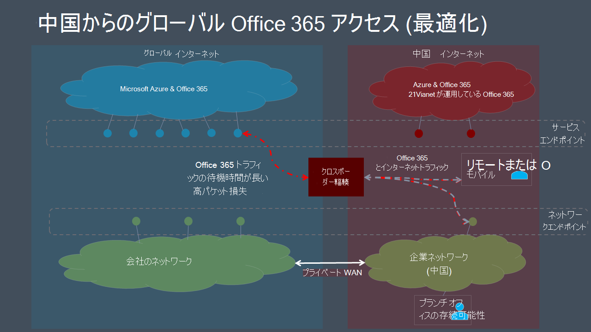

# Microsoft 365ユーザー向けグローバル テナントパフォーマンスの最適化

> [!IMPORTANT]
> このガイダンスは、中国に拠点を持つエンタープライズ ユーザーがMicrosoft 365テナントに接続する使用シナリオ **Microsoft 365です**。 このガイダンスは、21Vianet Office 365には適用されません。

グローバル Microsoft 365 テナントと中国での企業プレゼンスを持つ企業では、中国に拠点を置くユーザーの Microsoft 365 クライアントのパフォーマンスは、中国電話会社のインターネット アーキテクチャに固有の要因によって複雑になる可能性があります。

中国の ISP は、国境を越えたネットワークの混雑が高レベルになりやすい境界デバイスを経由するグローバルパブリック インターネットへのオフショア接続を規制しています。 この輻輳により、中国に入り出るすべてのインターネット トラフィックに対してパケット損失と遅延が発生します。

パケット損失と待機時間は、ネットワーク サービスのパフォーマンス、特に大規模なデータ交換が必要なサービス (大きなファイル転送など) や、ほぼリアルタイムのパフォーマンス (オーディオおよびビデオ アプリケーション) を必要とするサービスに有害です。

このトピックの目標は、中国の国境を越えたネットワークの輻輳がサービスに及ぼす影響を軽減するためのベスト プラクティスMicrosoft 365です。 このトピックでは、中国のキャリア内での複雑なルーティングによる高いパケット遅延の問題など、他の一般的なラストマイルのパフォーマンスの問題については説明します。

## 企業ネットワークのベスト プラクティス

グローバル なテナントとMicrosoft 365ユーザーを持つ多くの企業は、中国のオフィスの場所と世界中のオフショアの場所間の企業ネットワーク トラフィックを運ぶプライベート ネットワークを実装しています。 これらの企業は、このネットワーク インフラストラクチャを活用して、国境を越えたネットワークの混雑を回避し、Microsoft 365パフォーマンスを最適化できます。

> [!IMPORTANT]
> すべてのプライベート WAN 実装と同様に、ネットワーク構成が準拠していることを確認するために、国や地域の規制要件を常に確認する必要があります。

最初のステップとして、ネットワークの計画とパフォーマンスチューニングのベンチマーク ネットワーク ガイダンスに従って作業を行[Microsoft 365。](./network-planning-and-performance.md) 主な目標は、可能であれば中国のインターネットMicrosoft 365グローバル サービスにアクセスしないようにすることです。

- 既存のプライベート ネットワークを活用して、中国Microsoft 365外部のパブリック インターネットに送信する、中国のオフィス ネットワークとオフショアの場所間のネットワーク トラフィックを管理します。 中国以外のほぼすべての場所が明確な利点を提供します。 ネットワーク管理者は、Microsoft グローバル ネットワークとの低遅延相互接続領域で出力することで、さらに [最適化できます](/azure/networking/microsoft-global-network)。 香港、シンガポール、日本、韓国が例です。
- VPN 接続を使用して企業ネットワークにアクセスするユーザー デバイスを構成し、Microsoft 365のプライベート オフショア リンクを転送するトラフィックを許可します。 VPN クライアントがスプリット トンネリングを使用するように構成されていないか、またはユーザー デバイスがネットワーク トラフィックの分割トンネリングを無視するようにMicrosoft 365します。 メディア トラフィックとリアルタイム メディア トラフィックに対する VPN 接続Teamsの詳細については、このセクションを[参照してください](#optimizing-microsoft-teams-meetings-network-performance-for-users-in-china)。
- プライベートのオフショア リンクを通Microsoft 365トラフィックをルーティングするネットワークを構成します。 プライベート リンク上のトラフィックの量を最小限に抑える必要がある場合は、[最適化] カテゴリのエンドポイントのみをルーティングし、[許可]および[既定のエンドポイント] への要求でインターネットを中継できます。  これにより、高遅延とパケット損失に最も敏感な重要なサービスに最適化されたトラフィックを制限することで、パフォーマンスを向上し、帯域幅の消費を最小限に抑えます。
- 可能な場合は、TCP の代わりに UDP を使用して、ライブ メディア ストリーミング トラフィックを使用Teams。 UDP は、TCP よりも優れたライブ メディア ストリーミング パフォーマンスを提供します。

トラフィックを選択的にルーティングする方法については、「Microsoft 365エンドポイントの管理[」Office 365 を参照してください](managing-office-365-endpoints.md)。 すべての世界規模の URL と IP Office 365の一覧については、「Office 365 IP アドレスの範囲」[を参照してください](urls-and-ip-address-ranges.md)。

## ユーザーのベスト プラクティス

企業ネットワークに接続できない家庭、喫茶店、ホテル、ブランチ オフィスなどのリモートの場所からグローバル Microsoft 365 テナントに接続する中国のユーザーは、デバイスと Microsoft 365 間のトラフィックが中国の混雑したクロスボーダー ネットワーク回線を通過する必要があるため、ネットワークパフォーマンスが低下する可能性があります。

国境を越えたプライベート ネットワークや企業ネットワークへの VPN アクセスがオプションではない場合でも、中国に拠点を置くユーザーがこれらのベスト プラクティスに従うトレーニングを行って、ユーザーごとのパフォーマンスの問題を軽減できます。

- キャッシュをOfficeするリッチ クライアント (Outlook、Teams、OneDrive など) を利用し、Web ベースのクライアントを回避します。 Officeキャッシュ機能とオフライン アクセス機能を使用すると、ネットワークの輻輳と待機時間の影響を大幅に軽減できます。
- ユーザーがMicrosoft 365電話会議機能を使用して構成されている場合、Teamsユーザーは公衆交換電話網 (PSTN) を介して会議に参加できます。 詳細については、「電話会議」を参照[Office 365。](/microsoftteams/audio-conferencing-in-office-365)
- ネットワーク パフォーマンスの問題が発生した場合は、トラブルシューティングのために IT 部門に報告し、サービスの問題が疑われる場合は Microsoft 365 Microsoft サポートにエスカレートする必要があります。 一部の問題は、国境を越えたネットワークのパフォーマンスによって引き起こされるという問題ではありません。

## 中国のMicrosoft Teamsの会議ネットワークパフォーマンスの最適化

グローバル Microsoft 365 テナントと中国でのプレゼンスを持つ組織では、中国ベースのユーザーの Microsoft 365 クライアントのパフォーマンスは、中国のインターネット アーキテクチャに固有の要因によって複雑になる可能性があります。 多くの企業や学校は、このガイダンスに従って良い結果を報告しています。 ただし、この範囲は、IT ネットワークセットアップの制御下にあるユーザー ネットワークの場所 (たとえば、VPN 接続を使用するオフィスの場所やホーム/モバイル エンドポイント) に制限されます。 Microsoft Teams通話や会議は、ホーム オフィス、モバイルの場所、道路、喫茶店などの外部の場所からよく使用されます。 通話や会議はリアルタイムのメディア トラフィックに依存しますので、これらのエクスペリエンスTeamsネットワークの混雑に特に敏感です。

その結果、Microsoft は通信プロバイダーと提携し、中国の国内および公共インターネット接続と Microsoft 365 グローバル クラウドの Teams サービスと Skype サービス間の高品質で優先的なネットワーク パスを使用して、Teams および Skype for Business Online のリアルタイム メディア トラフィックを運ぶ。 この機能により、パケット損失などの主要な指標が 10 倍以上向上し、ユーザーエクスペリエンスに影響を与えました。

>[!IMPORTANT]
>現時点では、これらの機能強化は、大規模なブロードキャストや、Teams または Microsoft Stream を使用した "町役場" スタイルの会議などの Microsoft Live Events 会議への参加には対処していない。 ライブ イベント会議を表示するには、中国のユーザーがプライベート ネットワークまたは SDWAN/VPN ソリューションを使用する必要があります。 ただし、このエクスペリエンスはプロデューサーまたは発表者の定期的な Teams 会議として機能しますので、ネットワークの改善は、ライブ イベント会議を発表または作成しているユーザーにとって有益です。

### 組織のネットワークのベスト プラクティス (会議Teams)

国境を越えたネットワークの輻輳を回避するために、プライベート ネットワーク拡張機能を検討する前のガイダンスを考えると、これらのネットワークの改善を活用する方法を検討する必要があります。 組織のオフィス ネットワークには、次の 2 つの一般的なオプションがあります。

1. 新しい操作は行いません。 国境を越えた混雑を避けるために、プライベート ネットワーク バイパスに関する以前のガイダンスに従い続ける。 Teamsメディア トラフィックは、以前と同様に、そのセットアップを活用します。
2. 分割/ハイブリッド パターンを実装します。
   - 会議やリアルタイム メディア トラフィックの呼び出し以外の最適化Teams、前のガイダンスを使用します。
   - 会議Teamsをルーティングし、パブリック インターネットを通してリアルタイム メディア トラフィックを呼び出します。 リアルタイム メディア ネットワーク トラフィックの識別に関する詳細については、次の情報を参照してください。

高品質のTeamsを使用するパブリック インターネットを通してリアルタイムのメディア オーディオおよびビデオ トラフィックを送信すると、無料でプライベート ネットワークを通してそのトラフィックを送信する支払いよりもコストが大きな節約になる可能性があります。 ユーザーが SDWAN または VPN クライアントを使用している場合も同様の追加の利点があります。 組織によっては、一般的な方法として、より多くのデータをパブリック インターネット接続を通過することを好む場合があります。

同じオプションが SDWAN または VPN 構成に適用される場合があります。 たとえば、ユーザーは SDWAN または VPN を使用して Microsoft 365 トラフィックを企業ネットワークにルーティングし、そのネットワークのプライベート拡張を利用して国境を越えた混雑を回避しています。 これで、ユーザーの SDWAN または VPN を構成して、VPN ルーティングから会議Teams通話するトラフィックを除外できます。 この VPN 構成は、スプリット トンネリングと呼ばれます。 詳細[については、「VPN スプリット トンネリング」Office 365](/microsoft-365/enterprise/microsoft-365-vpn-implement-split-tunnel)を参照してください。

また、SDWAN または VPN を、リアルタイム トラフィックMicrosoft 365含むすべてのMicrosoft Teams使用できます。 Microsoft には、SDWAN または VPN ソリューションの使用に関する推奨事項はありません。

### 会議のホーム、モバイル、およびユーザー ネットワークTeams方法

中国のユーザーは、固定電話またはモバイル接続を使用して中国のパブリック インターネット サービスに接続するだけで、これらの改善を利用できます。 Teamsインターネット上のリアルタイムのメディア オーディオおよびビデオ トラフィックは、接続性と品質の向上から直接恩恵を受ける。

ただし、他の Microsoft 365 サービスからのデータ、およびチャットやファイルなど、Teams 内の他のトラフィックは、これらの改善の恩恵を直接受けるわけではありません。 組織のネットワーク外のユーザーは、このトラフィックのネットワーク パフォーマンスが低下する可能性があります。 この記事で説明したように、VPN または SDWAN を使用してこれらの影響を軽減できます。 また、ユーザーに Web クライアント上でリッチ デスクトップ クライアントを使用して、ネットワークの問題を軽減するためにアプリ内キャッシュをサポートすることもできます。

### リアルタイムTeamsネットワーク トラフィックの識別

ネットワーク デバイスまたは VPN/SDWAN セットアップを構成するには、リアルタイムのメディア オーディオおよびビデオ トラフィックTeamsのみを除外する必要があります。 トラフィックの詳細は、ID 11 の URL と IP アドレス範囲のOffice 365[一覧で確認できます](urls-and-ip-address-ranges.md#skype-for-business-online-and-microsoft-teams)。 他のすべてのネットワーク構成はそのまま残る必要があります。

Microsoft は、ネットワーク アーキテクチャと特性のMicrosoft 365可能な範囲を超えるクライアントのユーザー エクスペリエンスとパフォーマンスの向上に継続的に取り組み続け中です。 [ネットワーク[Office 365] Communityに](https://techcommunity.microsoft.com/t5/office-365-networking/bd-p/Office365Networking)アクセスして、会話を開始または参加し、リソースを検索し、機能の要求と提案を送信します。

## 関連項目

[Microsoft 365 のネットワーク計画とパフォーマンス チューニング](./network-planning-and-performance.md)

[Microsoft 365 ネットワーク接続の原則](microsoft-365-network-connectivity-principles.md)

[Office 365 エンドポイントの管理](managing-office-365-endpoints.md)

[Office 365 の URL および IP アドレスの範囲](urls-and-ip-address-ranges.md)

[Microsoft グローバル ネットワーク](/azure/networking/microsoft-global-network)
