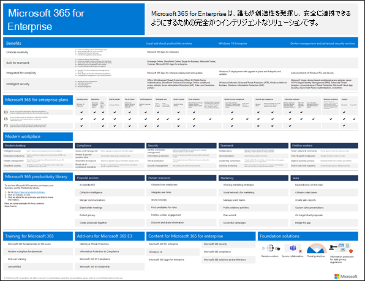
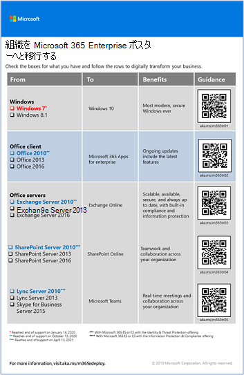
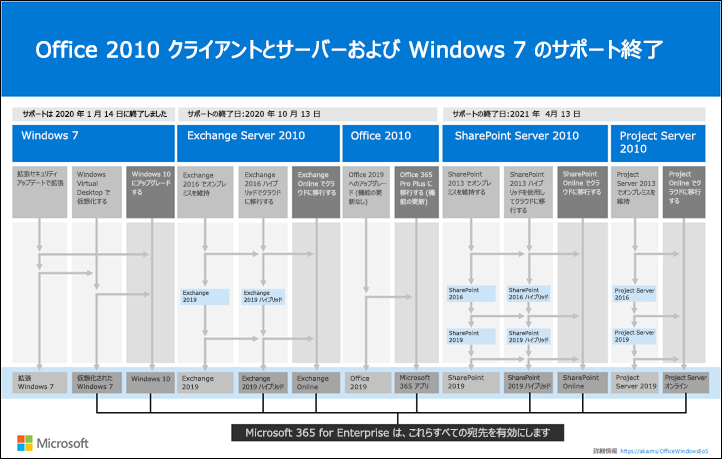
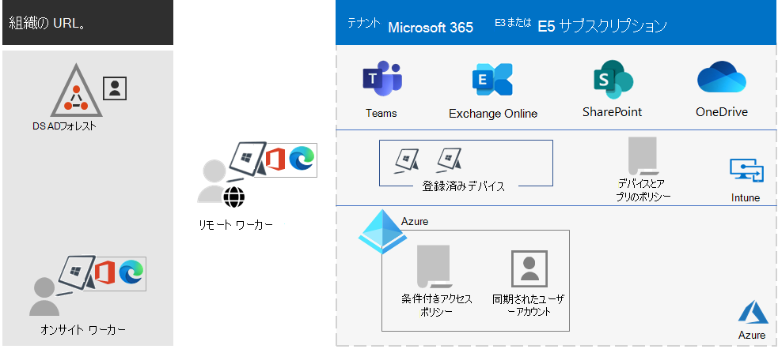
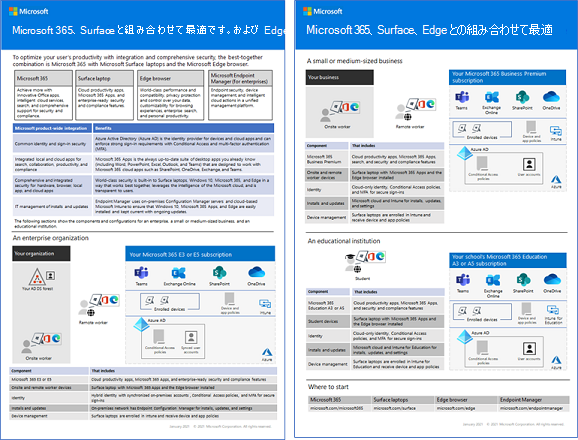

# Microsoft 365 for Enterprise の概要

Microsoft 365 for Enterprise は、誰もが創造性を発揮し、安全に連携できるようにするための完全かつインテリジェントなソリューションです。

大企業向けに設計された Microsoft 365 for Enterprise は、最先端のセキュリティ機能と生産性機能を必要とする中小規模企業にも使用できます。

## コンポーネント

Microsoft 365 for Enterprise は以下で構成されています。

|サービス|説明|
|---|---|
|ローカル アプリおよびクラウド ベースのアプリと生産性サービス|Microsoft 365 Apps for enterprise、お使いの PC と Mac 用の最新版の Office アプリ (Word、Excel、PowerPoint、Outlook など)、メール、ファイル ストレージと共同作業、会議、その他の一連のオンライン サービスが含まれています。|
|Windows 10 Enterprise|大規模と中規模の組織のニーズを満たします。これは、ユーザーにとって最も生産的かつ安全なバージョンの Windows です。IT プロフェッショナルに対しては、包括的な展開、デバイス、アプリの管理も提供します。|
|デバイス管理と高度なセキュリティ サービス|Microsoft Intune が含まれています。これは、クラウドベースのエンタープライズ モビリティ管理 サービスであり、組織のデータを保護しながら、従業員の生産性を高めるのに役立ちます。|
|||

## プラン

Microsoft 365 for Enterprise には 3 つのプランがあります。

|プラン名|機能|
|---|---|
|E3|Microsoft 365 の主要な製品と機能にアクセスして、安全に職場の生産性を高め、イノベーションを推進します。|
|E5|Microsoft 365 の最新の製品と機能にアクセスします。 これには、Defender for Office 365、セキュリティ ツール、および共同作業ツールが含まれます。 このプランには、E3 のすべての機能に加えて、高度なセキュリティ、音声、およびデータ分析ツールが含まれています。|
|F3|現場の最前線で働く従業員が最高の仕事をできるように、彼らが使え役に立つ専用のツールやリソースを通じて従業員とつながります。|
|||

Microsoft 365 E3 をお持ちの場合は、次のアドオンも入手できます。

- ID と脅威保護
- 情報保護とコンプライアンス
- [Microsoft 365 E5 Compliance](https://www.microsoft.com/microsoft-365/business/e5-compliance)
- Microsoft 365 E5 インサイダー リスク

Microsoft 365 E3の ユーザーは、これらのアドオンを使用して、Microsoft 365 E5 に含まれる追加機能のいくつかを利用できます。

詳細については、「[各プランの機能](https://www.microsoft.com/microsoft-365/compare-all-microsoft-365-plans)」をご覧ください。

## 全体像を把握する

[Microsoft 365 for Enterprise ポスター](../downloads/Microsoft365Enterprise.pdf)は、以下を表示するための中心的な場所です。

- Microsoft 365 for Enterprise の利点と、アプリとサービスがその価値の柱に対してどのように位置づけられるか。
- Microsoft 365 for Enterprise プランとそれらに含まれるコンポーネント
- Microsoft 365 for Enterprise が可能にするモダン ワークプレイスの主要コンポーネント
- [Microsoft 365 生産性ライブラリ](https://www.microsoft.com/microsoft-365/success/)およびいくつかの一般的な組織部門の代表的なシナリオ

[ポスターのコピーをダウンロード](https://github.com/MicrosoftDocs/microsoft-365-docs/raw/public/microsoft-365/downloads/Microsoft365Enterprise.pdf)できます。

## 組織全体の移行

組織全体を Microsoft 365 for Enterprise の製品とサービスに移行する方法をより良く理解するためには、[移行のポスター](https://download.microsoft.com/download/2/c/7/2c7bcc04-aae3-4604-9707-1ffff66b9851/transition-org-to-m365.pdf)をご覧ください。

この2ページのポスターをご覧になると、既存のインフラストラクチャを簡単にインベントリできます。 これを見ると、ガイダンスが見つかり、Microsoft 365 for enterprise の対応する製品またはサービスに移行するのに役立ちます。 Windows と Office の製品、その他のインフラストラクチャ、それから、デバイス管理、ID、情報および脅威保護などのセキュリティ要素が含まれます。

## Windows 7 および Office 2010 のクライアントとサーバーのサポート終了

[Windows 7](https://aka.ms/win7upgrade) は、**2020 年 1 月 14 日** にサポートが終了しました。

これらの製品は、**2020 年 10 月 13 日** にサポートが終了しました:

- [Office 2010](/DeployOffice/office-2010-end-support-roadmap)
- [Exchange Server 2010](exchange-2010-end-of-support.md)

[SharePoint Server 2010](upgrade-from-sharepoint-2010.md) は、**2021 年 4 月 13 日** にサポートが終了します。

これらの製品のアップグレード、移行、およびクラウドへの移行オプションを視覚的にまとめたものとしては、[サポート終了ポスター](../downloads/Office2010Windows7EndOfSupport.pdf)をご覧ください。

この 1 ページのポスターで、Windows 7 と Office 2010 のクライアントおよびサーバー製品がサポート終了に達してしまうことを防ぐさまざまな手段をすばやく理解できます。ここには、特に推奨される手段と、Microsoft 365 for Enterprise のサポートが含まれます。

[このポスターをダウンロード](https://github.com/MicrosoftDocs/microsoft-365-docs/raw/public/microsoft-365/downloads/Office2010Windows7EndOfSupport.pdf)して、レター形式、リーガル形式、またはタブロイド形式 (11 x 17) で印刷することもできます。

## 計画と展開

Microsoft 365 for Enterprise の製品、機能、コンポーネントの展開を計画するには、3 つの方法があります。

- FastTrack との提携

   Microsoft のエンジニアは FastTrack を使用して、自分のペースでクラウドに移行できます。 「[Microsoft 365 の FastTrack](https://fasttrack.microsoft.com/microsoft365)」を参照してください。

- Microsoft コンサルティング サービスまたは [Microsoft パートナー](https://partner.microsoft.com/)を使用する場合

   コンサルタントは、ご使用の現在のインフラストラクチャを分析し、Microsoft 365 for Enterprise のすべてのソフトウェアとサービスを組み込む計画の開発を支援できます。

- お客様自身による導入

   [ネットワーク ロードマップ](networking-roadmap-microsoft-365.md)から始めて、既存のインフラストラクチャと生産性ワークロードを構築または検証します。

架空ではあるものの代表的な多国籍企業が、どのようにして Microsoft 365 for Enterprise を展開したかについては、「[Contoso Corporation のケース スタディ](contoso-overview.md)」を参照してください。

## 追加の Microsoft 365 製品

- [Microsoft 365 Business Premium](../admin/index.yml)

  小規模および中規模の企業向けに、優れた生産性やコラボレーション機能と、ビジネス データを保護するためのデバイス管理およびセキュリティ ソリューションを統合します。

- [Microsoft 365 Education](/education)

  手ごろな価格の教育用に構築された単一ソリューションで、教育者が創造力を発揮し、チームワークを促進し、シンプルかつ安全な操作性を実現できるようにします。

- [Microsoft 365 政府機関向け](https://www.microsoft.com/microsoft-365/government)

  米国の公共部門の従業員が協力して安全に作業できるようにします。

## Surface および Edge ブラウザーの Best together

Microsoft 365 for Enterprise、Microsoft Surface デバイス、および Microsoft Edge ブラウザーの最適な組み合わせにより、ユーザーの統合された安全な生産性を最適化します。この製品間の統合により、次のものが提供されます。

- 共通の ID およびサインイン セキュリティ インフラストラクチャ。
- 検索、コラボレーション、生産性、コンプライアンスのための統合されたローカル アプリとクラウド アプリ。
- ハードウェア、ブラウザー、ローカル アプリ、クラウド アプリの包括的で統合されたセキュリティ。
- インストールと更新の IT 管理のための共通インフラストラクチャ。

これは、企業組織の例です。

中小企業および教育機関の詳細情報と構成例については、[Best together ポスター](https://download.microsoft.com/download/2/8/d/28db0cf9-2f5a-4f63-91e2-46ff5c4d3baf/microsoft-best-together-poster.pdf)をダウンロードしてください。

## Microsoft 365 のトレーニング

Microsoft 365 と、Microsoft 365の認定の詳細について学ぶには: [認定済Microsoft 365: 基本](/learn/paths/m365-fundamentals/)から始めることができます。

## 関連項目

[Microsoft 365 for Enterprise 製品ページ](https://www.microsoft.com/microsoft-365/enterprise)