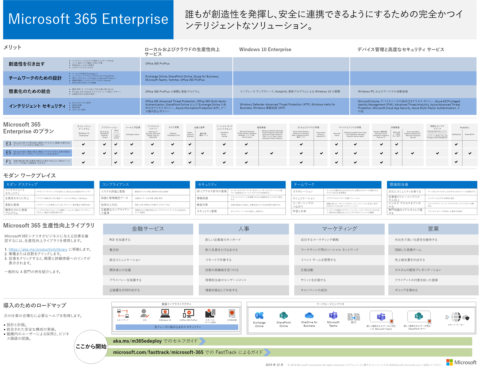
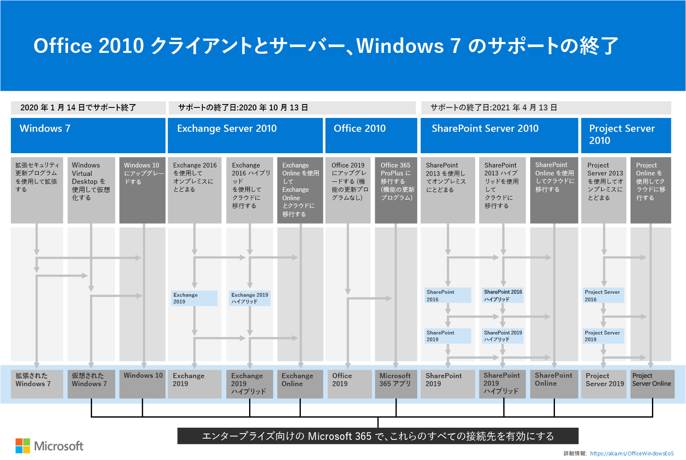

# Microsoft 365 for enterprise の概要Microsoft 365 for enterprise overview

Microsoft 365 for enterprise は、すべてのユーザーがクリエイティブな作業を行い、安全に共同作業を行えるようにする完全なインテリジェントソリューションです。Microsoft 365 for enterprise is a complete, intelligent solution that empowers everyone to be creative and work together securely. 

大規模な組織向けに設計されていますが、Microsoft 365 for enterprise は、高度なセキュリティと生産性の機能を必要とする中規模の中小企業にも使用できます。Although designed for large organizations, Microsoft 365 for enterprise can also be used for medium-sized and small businesses that need the most advanced security and productivity capabilities. 

## コンポーネントComponents

エンタープライズ向け Microsoft 365 は、次の要素で構成されています。Microsoft 365 for enterprise consists of:

|||
|:-------|:-----|
| ローカルおよびクラウドベースのアプリと生産性サービスLocal and cloud-based apps and productivity services | エンタープライズ向けの Microsoft 365 アプリ、PC と Mac 用の最新の Office アプリ (Word、Excel、PowerPoint、Outlook、その他)、電子メール用の最新のオンラインサービス、ファイルストレージとコラボレーション、会議などが含まれています。Includes both Microsoft 365 Apps for enterprise, the latest Office apps for your PC and Mac (such as Word, Excel, PowerPoint, Outlook, and others), and a full suite of online services for email, file storage and collaboration, meetings, and more. |
| Windows 10 EnterpriseWindows 10 Enterprise | 大規模および中規模の組織のニーズに対応しており、包括的な展開、デバイス、およびアプリの管理を使用して、最も生産性の高い、セキュリティで保護されたバージョンの Windows および IT プロフェッショナルをユーザーに提供します。Addresses the needs of both large and midsize organizations, providing users with the most productive and secure version of Windows and IT professionals with comprehensive deployment, device, and app management. |
| デバイス管理と高度なセキュリティサービスDevice management and advanced security services | Microsoft Intune が含まれています。これは、クラウドベースの enterprise mobility management (EMM) サービスであり、企業データを保護したまま、従業員の生産性を向上させるのに役立てることができます。Includes Microsoft Intune, which is a cloud-based enterprise mobility management (EMM) service that helps enable your workforce to be productive while keeping your corporate data protected. |
|||

## プランPlans

Microsoft 365 for enterprise は、3つのプランで利用できます。Microsoft 365 for enterprise is available in three plans.

|||
|:-------|:-----|
| E3E3 | Microsoft 365 内のコア製品と機能にアクセスして、職場の生産性を向上させ、技術革新を促進します。Access core products and features within Microsoft 365 to enhance workplace productivity and drive innovation, securely. |
| E5E5 | 高度な脅威保護、セキュリティ、コラボレーションツールなど、Microsoft 365 内の最新の製品と機能にアクセスします。Access the latest products and features within Microsoft 365, including advanced threat protection, security and collaboration tools.. E3's のすべての機能に加え、高度なセキュリティ、音声、およびデータ分析ツールが含まれています。Includes all of E3's capabilities plus advanced security, voice, and data analysis tools. |
| F1F1 | 自分が作成したツールやリソースを使用して、最高の仕事をすることができます。Connect with your Firstline Workers through purpose-built tools and resources that allow them to do their best work. |
|||

Microsoft 365 E3 がある場合は、次の[オファーリング](https://www.microsoft.com/microsoft-365/blog/2019/01/02/introducing-new-advanced-security-and-compliance-offerings-for-microsoft-365/)を取得することもできます。If you have Microsoft 365 E3, you can also get these [offerings](https://www.microsoft.com/microsoft-365/blog/2019/01/02/introducing-new-advanced-security-and-compliance-offerings-for-microsoft-365/):

- Identity & 脅威保護Identity & Threat Protection
- 情報保護 & コンプライアンスInformation Protection & Compliance

これらのオファーリングには、Microsoft 365 E5 に含まれている追加機能が含まれています。These offerings contain additional features that are included with Microsoft 365 E5.

詳細については、「[各プランの特徴と機能](https://www.microsoft.com/microsoft-365/compare-all-microsoft-365-plans)」を参照してください。For more information, see [Features and capabilities for each plan](https://www.microsoft.com/microsoft-365/compare-all-microsoft-365-plans).

## 大きな画像を取得するGet the big picture

[Microsoft 365 for enterprise ポスター](../media/m365-poster/Microsoft365Enterprise.pdf)は、次の情報を一元的に表示する場所です。The [Microsoft 365 for enterprise poster](../media/m365-poster/Microsoft365Enterprise.pdf) is a central location for you to view:

- Microsoft 365 for enterprise の利点と、アプリとサービスがその価値の柱にマップされる方法The benefits of Microsoft 365 for enterprise and how apps and services map to its value pillars
- エンタープライズプランのための Microsoft 365 とその中に含まれるコンポーネントMicrosoft 365 for enterprise plans and which components they contain 
- モダンワークプレースの主要なコンポーネントであり、Microsoft 365 for enterprise を使用すると、The key components of the Modern Workplace, which Microsoft 365 for enterprise enables
- 一般的な組織部門のための[Microsoft 365 プロダクティビティライブラリ](https://www.microsoft.com/microsoft-365/success/)と代表的なシナリオThe [Microsoft 365 Productivity Library](https://www.microsoft.com/microsoft-365/success/) and representative scenarios for some common organization departments
- Microsoft 365 for enterprise[展開ガイド](deploy-microsoft-365-enterprise.md)を強調した導入ロードマップThe adoption roadmap that highlights the Microsoft 365 for enterprise [Deployment Guide](deploy-microsoft-365-enterprise.md)

ポスターのコピーをダウンロードするには、[ここ](https://github.com/MicrosoftDocs/microsoft-365-docs/raw/public/microsoft-365/media/m365-poster/Microsoft365Enterprise.pdf)をクリックします。To download a copy of the poster, click [here](https://github.com/MicrosoftDocs/microsoft-365-docs/raw/public/microsoft-365/media/m365-poster/Microsoft365Enterprise.pdf).

## 組織全体の移行Transition your entire organization

組織全体を Microsoft 365 for enterprise の製品とサービスに移行する方法については、「[移行ポスター](../media/deploy-microsoft-365-enterprise/transition-org-to-m365.pdf)」を参照してください。To get a better picture of how to move your entire organization to the products and services in Microsoft 365 for enterprise, see the [transition poster](../media/deploy-microsoft-365-enterprise/transition-org-to-m365.pdf).

このポスター (見開き 2 ページ) で簡単に既存のインフラストラクチャのインベントリを作成し、Microsoft 365 Enterprise に対応する製品またはサービスに移行するためのガイダンスへとアクセスします。This two-page poster is a quick way to inventory your existing infrastructure and get to the guidance for moving to the corresponding product or service in Microsoft 365 for enterprise. Windows と Office の製品、その他のインフラストラクチャ、それから、デバイス管理、ID、情報および脅威保護などのセキュリティ要素が含まれます。It includes Windows and Office products and other infrastructure and security elements such as device management, identity, and information and threat protection.

[このポスターをダウンロード](https://github.com/MicrosoftDocs/microsoft-365-docs/raw/public/microsoft-365/media/deploy-microsoft-365-enterprise/transition-org-to-m365.pdf)して、レター形式、リーガル形式、またはタブロイド形式 (11 x 17) で印刷することもできます。You can also [download this poster](https://github.com/MicrosoftDocs/microsoft-365-docs/raw/public/microsoft-365/media/deploy-microsoft-365-enterprise/transition-org-to-m365.pdf) and print it in letter, legal, or tabloid (11 x 17) formats.

## Windows 7 および Office 2010 のクライアントとサーバーのサポート終了を回避するAvoid end of support for Windows 7 and Office 2010 clients and servers

[Windows 7](https://aka.ms/win7upgrade) **は、2020年1月14日**にサポート終了になりました。[Windows 7](https://aka.ms/win7upgrade) reached end of support on **January 14, 2020**.

次の製品は、 **2020 年10月 13**日のサポート終了までになります。The following products will reach end of support on **October 13, 2020**:

- [Office 2010Office 2010](https://docs.microsoft.com/DeployOffice/office-2010-end-support-roadmap)
- [Exchange Server 2010Exchange Server 2010](https://docs.microsoft.com/office365/enterprise/exchange-2010-end-of-support)

[SharePoint Server 2010](https://docs.microsoft.com/office365/enterprise/upgrade-from-sharepoint-2010)は **、2021年4月 13**日のサポート終了に到達します。[SharePoint Server 2010](https://docs.microsoft.com/office365/enterprise/upgrade-from-sharepoint-2010) will reach end of support on **April 13, 2021**.

これらの製品のアップグレード、移行、およびクラウドへの移行オプションを視覚的にまとめたものとしては、[サポート終了ポスター](../media/migration-microsoft-365-enterprise-workload/Office2010Windows7EndOfSupport.pdf)をご覧ください。For a visual summary of the upgrade, migrate, and move-to-the-cloud options for these products, see the [end of support poster](../media/migration-microsoft-365-enterprise-workload/Office2010Windows7EndOfSupport.pdf).

この1ページのポスターは、Microsoft 365 for enterprise で推奨されるパスとサポートを使用して、Windows 7 および Office 2010 のクライアントおよびサーバー製品のサポートが終了するのを防ぐための、さまざまなパスを簡単に理解する方法を示しています。This one-page poster is a quick way to understand the various paths you can take to prevent Windows 7 and Office 2010 client and server products from reaching end of support, with preferred paths and support in Microsoft 365 for enterprise highlighted.

[このポスターをダウンロード](https://github.com/MicrosoftDocs/microsoft-365-docs/raw/public/microsoft-365/media/migration-microsoft-365-enterprise-workload/Office2010Windows7EndOfSupport.pdf)して、レター形式、リーガル形式、またはタブロイド形式 (11 x 17) で印刷することもできます。You can also [download this poster](https://github.com/MicrosoftDocs/microsoft-365-docs/raw/public/microsoft-365/media/migration-microsoft-365-enterprise-workload/Office2010Windows7EndOfSupport.pdf) and print it in letter, legal, or tabloid (11 x 17) formats.

## 展開Deploy

エンタープライズ向けの Microsoft 365 の製品、機能、およびコンポーネントを展開するには、次の3つの方法があります。There are three ways to deploy the products, features, and components of Microsoft 365 for enterprise:

1. FastTrack とのパートナーシップIn partnership with FastTrack
  
   FastTrack では、Microsoft のエンジニアが自分のペースでクラウドに移行することができます。With FastTrack, Microsoft engineers help you move to the cloud at your own pace. 「[Microsoft 365 の FastTrack](https://fasttrack.microsoft.com/microsoft365)」を参照してください。See [FastTrack for Microsoft 365](https://fasttrack.microsoft.com/microsoft365).
  
2. Microsoft コンサルティングサービスまたは[microsoft パートナー](https://partner.microsoft.com/)と協力して提供されます。With the help of Microsoft Consulting Services or a [Microsoft partner](https://partner.microsoft.com/).

   コンサルタントは、現在のインフラストラクチャを分析し、Microsoft 365 for enterprise のすべてのソフトウェアとサービスを組み込むための計画を策定するのに役立ちます。Consultants can analyze your current infrastructure and help you develop a plan to incorporate all of the software and services of Microsoft 365 for enterprise.

3. 自分で行うDo it yourself

   「 [Microsoft 365 for enterprise 展開ガイド」](deploy-microsoft-365-enterprise.md)では、インフラストラクチャと生産性のワークロードを構築する手順について手順を追って説明します。The [Microsoft 365 for enterprise deployment guide](deploy-microsoft-365-enterprise.md) takes you step by step through building out the infrastructure and productivity workloads. 

展開の詳細については、「how to:」を参照してください。For more deployment information, see how:

- [お客様](deploy-microsoft-365-enterprise.md#how-customers-use-microsoft-365-for-enterprise)は、Microsoft 365 for enterprise を使用しています。[Customers](deploy-microsoft-365-enterprise.md#how-customers-use-microsoft-365-for-enterprise)  use Microsoft 365 for enterprise.
- [Microsoft](deploy-microsoft-365-enterprise.md#how-microsoft-uses-microsoft-365-for-enterprise)は microsoft 365 for enterprise を使用しています。[Microsoft](deploy-microsoft-365-enterprise.md#how-microsoft-uses-microsoft-365-for-enterprise) uses Microsoft 365 for enterprise.
- 架空の多国籍企業である[Contoso Corporation](contoso-overview.md)は、Microsoft 365 for enterprise を展開しました。[The Contoso Corporation](contoso-overview.md), a fictional but representative multinational organization, has deployed Microsoft 365 for enterprise.

## その他の Microsoft 365 ソリューションAdditional Microsoft 365 solutions

- [Microsoft 365 Business PremiumMicrosoft 365 Business Premium](https://docs.microsoft.com/microsoft-365/business/)
 
  小規模および中規模の企業 (SMB) 向けに、Office 365 の優れた生産性やコラボレーション機能と、ビジネス データを保護するためのデバイス管理およびセキュリティ ソリューションを統合します。Bring together the best-in-class productivity and collaboration capabilities of Office 365 with device management and security solutions to safeguard business data for small and midsize businesses (SMB).

- [Microsoft 365 EducationMicrosoft 365 Education](https://docs.microsoft.com/education)
 
  手ごろな価格の教育用に構築された単一ソリューションで、教育者が創造力を発揮し、チームワークを促進し、シンプルかつ安全な操作性を実現できるようにします。Empower educators to unlock creativity, promote teamwork, and provide a simple and safe experience in a single, affordable solution built for education.

- [Microsoft 365 GovernmentMicrosoft 365 Government](https://www.microsoft.com/microsoft-365/government)
 
  米国の公的部門の従業員が安全に共同作業できるようにします。Empower United States public sector employees to work together, securely.

## Microsoft 365 トレーニングMicrosoft 365 training

|||
|:-------|:-----|
| ご自分のトレーニングを受けて、Microsoft 365 認定に向けて作業を行います。Get yourself trained and work towards a Microsoft 365 certification.   最初に、 [Microsoft 365 の基本事項](https://docs.microsoft.com/learn/paths/m365-fundamentals/)についてご解説します。Start with [Microsoft 365 Fundamentals](https://docs.microsoft.com/learn/paths/m365-fundamentals/).
|||

## 次の手順Next step

自分で展開を行う場合は、[エンタープライズ展開の過程で Microsoft 365 を](deploy-microsoft-365-enterprise.md)開始します。If you're doing the deployment yourself, start your [Microsoft 365 for enterprise deployment journey](deploy-microsoft-365-enterprise.md).

## 関連項目See also

[Microsoft 365 for enterprise 製品ページMicrosoft 365 for enterprise product page](https://www.microsoft.com/microsoft-365/enterprise)
