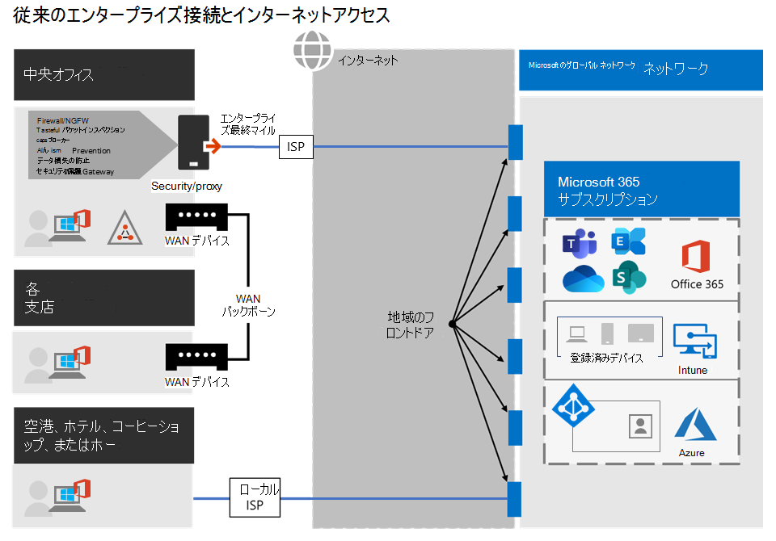
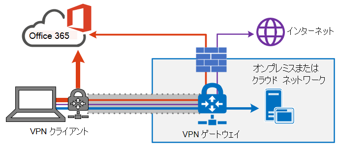
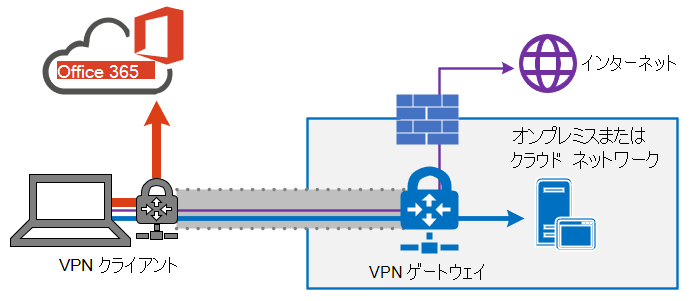
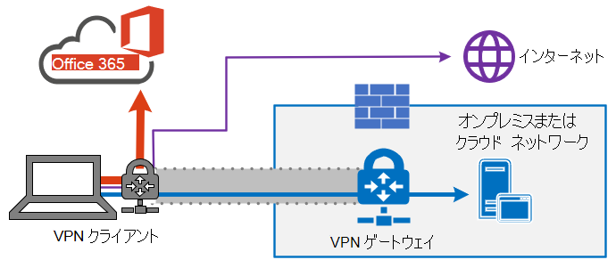
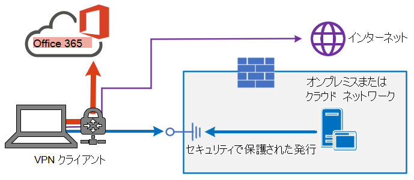

# <a name="implementing-vpn-split-tunneling-for-office-365"></a>Office 365 向け VPN スプリット トンネリングの実装

>[!NOTE]
>これは、リモート ユーザーを対象とした Office 365 の最適化について説明している一連のトピックの中の一つです。
>- リモート ユーザー向けの Office 365 接続を最適化するため、VPN スプリット トンネリングを使用する方法の概要については、「[概要: Office 365 向け VPN スプリット トンネリング](microsoft-365-vpn-split-tunnel.md)」を参照してください。
>- 中国のユーザー向けの Office 365 ワールドワイド テナント パフォーマンスの最適化については、「[中国ユーザー向けの Office 365 パフォーマンスの最適化](microsoft-365-networking-china.md)」を参照してください。

企業は何年もの間、VPN を使用してユーザーのリモート エクスペリエンスをサポートしてきました。 中心となる作業領域はオンプレミスにありましたが、企業のネットワーク上のデータセンターを通じてルーティングされるリモート クライアントからの VPN は、リモート ユーザーが企業のリソースにアクセスするための主要な方法でした。 接続を保護するため、企業は VPN パスに沿ってネットワーク セキュリティ ソリューションのレイヤを構築します。 このセキュリティは、内部インフラストラクチャを保護し、VPN にトラフィックをルーティングし、オンプレミスのインターネット境界を経由して外部 Web サイトのモバイル ブラウズを保護するために構築されました。 VPN、ネットワーク境界、および関連するセキュリティ インフラストラクチャは、通常、企業ネットワーク内から開始されるほとんどの接続で、そのほとんどが内部ネットワーク境界内にとどまる、定義されたトラフィック量に対して専用に構築され、スケーリングされました。

長い間、リモート ユーザー デバイスからのすべての接続がオンプレミス ネットワークにルーティングされる VPN モデル (いわゆる _強制トンネリング_) は、リモート ユーザーの同時接続規模を控えめにし、VPN を横断するトラフィック量を少なく済ませる限りは、ほぼ持続可能でした。  一部の企業は、アプリケーションが企業の境界内からパブリック SaaS クラウドに移行した後でも、VPN 強制トンネリングをそのまま使用し続けてきました。Office365 がその代表的な例です。

分散およびパフォーマンスに敏感なクラウド アプリケーションに接続するための強制トンネリングされた VPN の使用は最適とは言え、セキュリティの観点から現状を維持するために、一部の企業ではその悪影響が受け入れられた可能性があります。 このシナリオの例となる図を次に示します。



この問題は何年も前から増加し続け、多くのお客様がネットワーク トラフィック パターンの大幅な変化を報告しています。 オンプレミスに滞在するために使用されたトラフィックは、外部クラウド エンドポイントに接続されます。 Microsoft ユーザーの多くから、以前はネットワーク トラフィックの約 80 ％は内部ソース (上記の図の点線で示した部分) に送られるものだったという報告があります。 2020 年には、主要な作業領域をクラウドに移行したことにより、その割合は約 20 ％以下になりました。この傾向は他の企業でも珍しいことではありません。 クラウドへの移行の旅を進めていくほど、上記のモデルはますます扱いにくく、持続不可能になり、組織がすばやくクラウド ファーストの世界へ足を踏み入れることを妨げます。

世界的な COVID-19 禍により、この問題に対する即時の対応が必要とされています。 IT 企業には、社員の安全を確保するため、大規模な在宅勤務の生産性を援助しなければいけないというこれまでにない要求が生じています。 Microsoft Office 365は、お客様が需要を満たすのに役立つ十分な位置にありますが、自宅で作業するユーザーの同時実行性が高い場合、大量の Office 365 トラフィックが生成され、強制トンネル VPN とオンプレミス ネットワーク境界を経由してルーティングされると、急速な飽和状態が発生し、VPN インフラストラクチャが容量を使い果たします。 この新しい現実では、VPN を使用して Office 365 にアクセスするのはパフォーマンスの障害ではなく、Office 365 に影響を与えるだけでなく、運用するために VPN に依存する必要がある重要なビジネス操作に影響を与えるハードウォールです。

Microsoft は、お客様や幅広い業界と長年にわたって緊密に連携し、これらの問題に対して、当社のサービス内から効果的かつ最新のソリューションを提供し、より最適な業務の実現をサポートしています。 Office 365 サービスの「[接続の原則](./microsoft-365-network-connectivity-principles.md)」は、組織がセキュリティを維持し、接続を制御できるようにしつつ、リモート ユーザーに対して効率的に機能するように設計されています。 これらのソリューションは、限られた作業でも迅速に実装することができますが、上記の問題に大きなプラスの影響を与えます。

リモート ワーカーの接続を最適化するため Microsoft が推進している戦略として、従来のアプローチの問題を迅速に緩和し、簡単な数ステップで高いパフォーマンスを提供することを目指しています。 次の手順では、ボトルネックが発生した VPN サーバーをバイパスするいくつかの定義済みエンドポイントの従来の VPN アプローチを調整します。 同等、あるいはより優れたセキュリティ モデルを異なるレイヤに適用することで、企業ネットワークの出口ですべてのトラフィックを保護する必要がなくなります。 ほとんどの場合、これは数時間以内に効果的に実現でき、要件と時間が許す限りは、他の作業領域に対しても拡張性があります。

## <a name="common-vpn-scenarios"></a>一般的な VPN のシナリオ

以下のリストには、企業での環境で最も一般的な VPN のシナリオを表示しています。 ほとんどの企業は、従来モデル 1 (VPN 強制トンネリング) を運用しています。 このセクションでは、比較的少ない労力で達成できるモデル **2** に迅速かつ安全に移行するのに役立ち、ネットワーク パフォーマンスとユーザー エクスペリエンスに大きなメリットがあります。

| モデル | Description |
| --- | --- |
| [1. VPN 強制トンネリング](#1-vpn-forced-tunnel) | トラフィックの 100% は、オンプレミス、インターネット、およびすべての O365/M365 を含む VPN トンネルに入ります |
| [2. いくつかの例外を含む VPN 強制トンネリング](#2-vpn-forced-tunnel-with-a-small-number-of-trusted-exceptions) | VPN トンネルが既定で使用され (既定のルート ポイントが VPNに繋がっている)、直接のアクセスが許可される最も重要な除外シナリオはほとんど使用されない。 |
| [3. 広範囲な例外を含む VPN 強制トンネリング](#3-vpn-forced-tunnel-with-broad-exceptions) | VPN トンネルが既定で使用されているものの (既定のルートが VPN を指し示している)、直接アクセスが許可されている例外が広範囲にある (すべての Office 365、すべての Salesforce、すべての Zoom など) |
| [4. VPN 選択的トンネリング](#4-vpn-selective-tunnel) | VPN トンネルは、corpnet ベースのサービスにのみ使用されます。 既定のルート (インターネットとすべてのインターネット ベースのサービス) は直接行きます。 |
| [5. VPN なし](#5-no-vpn) | 従来の VPN の代わりに、すべてのコープネット サービスが最新のセキュリティ アプローチ (Zscaler ZPA、Azure Active Directory (Azure AD) プロキシ/MCAS など) を通じて公開される #2 のバリエーション。 |

### <a name="1-vpn-forced-tunnel"></a>1. VPN 強制トンネリング

これは、ほとんどの企業ユーザーにとっては最も一般的なスタート地点になります。 強制 VPN が使用されます。つまり、エンドポイントが企業ネットワーク内に存在するか存在しないかにかかわらず、トラフィックの 100% が企業ネットワークに送信されます。 外部 (インターネット) にバインドされたトラフィック (Office 365インターネットブラウズなど) は、プロキシなどのオンプレミスのセキュリティ機器からヘア ピン留めされます。 したがって、リモートで作業しているユーザーの 100% 近い現在の環境では、このモデルは VPN インフラストラクチャに大きな負荷を与え、すべての企業トラフィックのパフォーマンスを大幅に低下させる可能性が高く、企業が危機の時に効率的に運用する可能性があります。


### <a name="2-vpn-forced-tunnel-with-a-small-number-of-trusted-exceptions"></a>2. 少数の認可された例外を含む VPN 強制トンネル

このモデルは、VPN トンネルをバイパスし、この例の Office 365 サービスに直接移動するために非常に高い負荷と待機時間に敏感ないくつかの制御された定義されたエンドポイントを可能にし、企業が運用する方が大幅に効率的です。 これにより、オフロードされたサービスのパフォーマンスが大幅に向上し、VPN インフラストラクチャへの負荷も軽減され、リソースに対するより低いコンテンツで動作する必要がある要素も可能になります。 この記事では、単純で定義されたアクションを多数の肯定的な結果で迅速に実行できるので、移行の支援に集中しています。



### <a name="3-vpn-forced-tunnel-with-broad-exceptions"></a>3. 広範囲な例外を含む VPN 強制トンネリング

3 番目のモデルは、定義されたエンドポイントの小さなグループを直接送信するのではなく、モデル 2 の範囲を広げ、Office 365 や SalesForce などの信頼できるサービスに直接すべてのトラフィックを送信します。 これにより、企業の VPN インフラストラクチャの負荷がさらに軽減され、決められたサービスのパフォーマンスが向上します。 このモデルは、実現可能性の評価と実装に時間がかかる可能性が高いから、モデル 2 が正常に実施されると、後日繰り返し実行できる手順になる可能性があります。



### <a name="4-vpn-selective-tunnel"></a>4. VPN 選択的トンネリング

このモデルは、企業 IP アドレスを持つトラフィックのみが VPN トンネルに送信され、他の全ての既定のルートはインターネット パスになるため、3番目のモデルの逆になります。 このモデルでは、組織が[ゼロ トラスト](https://www.microsoft.com/security/zero-trust?rtc=1)への道を歩み、安全な実装ができる必要があります。 このモデルや、そこからの変化型は、企業ネットワークからクラウドに移行するサービスが増えるにつれて、既定のモデルとなることが求められてくるでしょう。 Microsoft では、このモデルを内部で使用しています。Microsoft の VPN スプリット トンネリングの実装の詳細については、「[VPN で実行: Microsoft がリモート ワークの従業員をどのように接続させているか](https://www.microsoft.com/itshowcase/blog/running-on-vpn-how-microsoft-is-keeping-its-remote-workforce-connected/?elevate-lv)」をご覧ください。



### <a name="5-no-vpn"></a>5. VPN なし

モデル番号 2 のより高度なバージョンで、内部サービスは Azure AD Proxy、MCAS、Zscaler ZPA などの最新のセキュリティ アプローチまたは SDWAN ソリューションを通じて公開されます。



## <a name="implement-vpn-split-tunneling"></a>スプリット トンネル VPN の実装

このセクションでは、VPN クライアント アーキテクチャを _VPN_ 強制トンネルから、信頼できる例外の数が少ないVPN 強制トンネルに移行するために必要な簡単な手順、共通 [VPN](#common-vpn-scenarios)シナリオの VPN スプリット トンネル モデル [#2](#2-vpn-forced-tunnel-with-a-small-number-of-trusted-exceptions)について説明します。

次の図は、推奨している VPN スプリット トンネリング ソリューションのしくみを示しています。


### <a name="1-identify-the-endpoints-to-optimize"></a>1. 最適化するエンドポイントを決める

「[Office 365 の URL と IP アドレスの範囲](urls-and-ip-address-ranges.md)」のトピックでは、Microsoft は最適化する必要のある主要なエンドポイントを明確に識別し、それらを「**最適化**」として分類しています。 現在、最適化する必要がある URL は 4 つ、IP サブネットは 20 個です。 この小さいエンドポイントのグループは、Teams のメディアなどの遅延の影響を受けやすいエンドポイントを含め、Office 365 のサービスへのトラフィック量の約70%〜80%を占めます。 基本的に、これは特別な管理が必要なトラフィックであり、従来のネットワーク パスや VPN インフラストラクチャに大なるプレッシャーをかかえるトラフィックです。

このカテゴリの URL には、次のような特性があります。

- Microsoft インフラストラクチャにホストされている Microsoft が所有および管理するエンドポイントである
- IP が提供されている
- 変化率が低く、数も少ないと予想される (現在 20 の IP サブネット)
- 帯域幅や遅延の影響を受けやすい
- 必要なセキュリティ要素をネットワーク上で、インラインではなくサービスで提供することができる
- Office 365 サービスへのトラフィック量の約 70 - 80% を対象としたアカウント

エンドポイントの管理とOffice 365方法の詳細については、「管理エンドポイントの管理」[を参照Office 365してください](managing-office-365-endpoints.md)。

#### <a name="optimize-urls"></a>URL を最適化する

現在の最適化 URL は次の表に記載されています。 ほとんどの状況では、エンドポイントがプロキシにではなく直接送信されるように設定されている[ブラウザ PAC ファイル](managing-office-365-endpoints.md#use-a-pac-file-for-direct-routing-of-vital-office-365-traffic)の URL エンドポイントのみを使用する必要があります。

| URL を最適化する | ポート/プロトコル | 用途 |
| --- | --- | --- |
| <https://outlook.office365.com> | TCP 443 | これは、Outlook が Exchange Online サーバーへの接続に使用する主要なURL の 1 つであり、帯域幅の使用数と接続数が大量になります。 クイック検索、その他のメールボックス 予定表、空き時間の検索、ルールと通知の管理、Exchange オンラインのアーカイブ、送信トレイからのメール送信などといったオンライン上の機能では、ネットワークの遅延を少なくしておく必要があります。 |
| <https://outlook.office.com> | TCP 443 | このURLは Outlook Online Web Access が Exchange Online のサーバーに接続するために使用され、ネットワーク遅延の影響を受けやすくなっています。 SharePoint Online での大きなファイルのアップロードとダウンロードには、特に接続性が必要です。 |
| https:// \<tenant\> .sharepoint.com | TCP 443 | これは、オンラインでの使用SharePointのプライマリ URL です。 |
| https:// \<tenant\> -my.sharepoint.com | TCP 443 | これは OneDrive for Business の標準 URL で、帯域幅の使用率が高く、OneDrive for Business Sync ツールからの接続数が多くなることがあります。 |
| Teams のメディア IP (URL なし) | UDP 3478、3479、3480、および3481 | Relay Discovery の割り当てとリアルタイム トラフィック (3478)、オーディオ (3479)、ビデオ (3480)、ビデオスクリーン共有 (3481)。 これらは、メディア トラフィック (通話、会議などSkype for Business Microsoft Teamsのエンドポイントです。 ほとんどのエンドポイントは、Microsoft Teams クライアントが発信を確立するときに提供されます(サービスのリストにある必要な IP 内に含まれています)。 メディアの品質を最適化するには、UDP プロトコルを使用する必要があります。   |

上記の例では、**テナント** をお使いの Office 365 のテナント名に置き換える必要があります。  たとえば、**contoso.onmicrosoft.com** では、_contoso.sharepoint.com_ および _constoso-my.sharepoint.com_ を使用します。

#### <a name="optimize-ip-address-ranges"></a>IP アドレスの範囲を最適化する

これらのエンドポイントが対応する IP アドレス範囲を記述する時点では、次のようになります。 [この例、Office 365 IP](microsoft-365-ip-web-service.md)および URL [](https://github.com/microsoft/Office365NetworkTools/tree/master/Scripts/Display%20URL-IPs-Ports%20per%20Category) Web サービス[、URL/IP](urls-and-ip-address-ranges.md)ページなどのスクリプトを使用して、構成を適用するときに更新プログラムを確認し、定期的にポリシーを設定してください。 

```
104.146.128.0/17
13.107.128.0/22
13.107.136.0/22
13.107.18.10/31
13.107.6.152/31
13.107.64.0/18
131.253.33.215/32
132.245.0.0/16
150.171.32.0/22
150.171.40.0/22
204.79.197.215/32
23.103.160.0/20
40.104.0.0/15
40.108.128.0/17
40.96.0.0/13
52.104.0.0/14
52.112.0.0/14
52.96.0.0/14
52.120.0.0/14
```

### <a name="2-optimize-access-to-these-endpoints-via-the-vpn"></a>2. VPN を介して、これらのエンドポイントへのアクセスを最適化する

こういった重要なエンドポイントを特定したら、それを VPN トンネルから逸らし、ユーザーのローカル インターネット接続を使用してサービスに直接接続できるようにする必要があります。  これを実現する方法は、使用する VPN 製品とマシンのプラットフォームによって異なりますが、ほとんどの VPN ソリューションでは、この手法を適用するポリシーを簡単に構成することができます。 VPN プラットフォーム固有のスプリット  トンネリングを行う方法については、「[一般 VPN プラットフォームの HOWTO ガイド](#howto-guides-for-common-vpn-platforms)」をご覧ください。

ソリューションを手動でテストしたい場合は、次の PowerShell の例を実行して、ルート テーブルからソリューションをエミュレートできます。 この例では、それぞれの Teams メディア IP サブネットのルートをルート テーブルに追加します。 Teams のメディアの前後でのパフォーマンスをテストをし、指定されたエンドポイントのルートの違いを観察できます。

#### <a name="example-add-teams-media-ip-subnets-into-the-route-table"></a>例: Teams メディア IP サブネットをルート テーブルに追加する

```powershell
$intIndex = "" # index of the interface connected to the internet
$gateway = "" # default gateway of that interface
$destPrefix = "52.120.0.0/14", "52.112.0.0/14", "13.107.64.0/18" # Teams Media endpoints
# Add routes to the route table
foreach ($prefix in $destPrefix) {New-NetRoute -DestinationPrefix $prefix -InterfaceIndex $intIndex -NextHop $gateway}
```

上記のスクリプトで、 _$intIndex_ は、インターネットに接続されたインターフェースの索引 (PowerShellで **get-netadapter** を実行して検索し、_ifIndex_ の値を探します) であり、 _$gateway_ はそのインターフェースの既定のゲートウェイです (コマンド プロンプトの **ipconfig** か、 **(Get-NetIPConfiguration | Foreach IPv4DefaultGateway).NextHop** を PowerShellで実行し検索します)。

ルートを追加したら、コマンド プロンプトまたは PowerShell で「**印刷のルーティング**」を実行して、ルート テーブルが正しいことを確認できます。  出力には、追加したルートが含まれ、インターフェースのインデックス (この例では _22_) とそのインターフェースのゲートウェイ (この例では _192.168.1.1_) が表示されます。


「最適化」カテゴリにある _すべての_ 現在の IP アドレス範囲のルートを追加するには、次のスクリプトの型を使用して、現在の最適化 IPの一連のサブネットの [Office 365 IP および URL Web サービス](microsoft-365-ip-web-service.md)にクエリを実行し、それをルート テーブルに追加します。

#### <a name="example-add-all-optimize-subnets-into-the-route-table"></a>例: すべての最適化サブネットをルート テーブルに追加する 

```powershell
$intIndex = "" # index of the interface connected to the internet
$gateway = "" # default gateway of that interface
# Query the web service for IPs in the Optimize category
$ep = Invoke-RestMethod ("https://endpoints.office.com/endpoints/worldwide?clientrequestid=" + ([GUID]::NewGuid()).Guid)
# Output only IPv4 Optimize IPs to $optimizeIps
$destPrefix = $ep | where {$_.category -eq "Optimize"} | Select-Object -ExpandProperty ips | Where-Object { $_ -like '*.*' }
# Add routes to the route table
foreach ($prefix in $destPrefix) {New-NetRoute -DestinationPrefix $prefix -InterfaceIndex $intIndex -NextHop $gateway}
```

うっかり誤ったパラメーターでルートを追加してしまった場合、あるいは単に変更を元に戻したい場合は、次のコマンドを使用して、追加したルートを削除できます。

```powershell
foreach ($prefix in $destPrefix) {Remove-NetRoute -DestinationPrefix $prefix -InterfaceIndex $intIndex -NextHop $gateway}
```

<!--- remmed until we add more reliable interface selection logic
#### Example script to add Teams Media subnets to the route table

```powershell
$adapter = get-netadapter | ? {$_.Status -eq "Up"}
$adapterIndex = $adapter.ifIndex
$gateway = (Get-NetIPConfiguration | Foreach IPv4DefaultGateway).NextHop

$destPrefix = "52.120.0.0/14", "52.112.0.0/14", "13.107.64.0/18"
foreach ($prefix in $destPrefix) {New-NetRoute -DestinationPrefix $prefix -InterfaceIndex $intIndex -NextHop $gateway}
```
-->

VPN クライアントの設定を行い、**最適化** IP へのトラフィックがこの方法でルーティングされるようにしてください。 これにより、トラフィックは、Office 365 サービスと接続エンドポイントを可能な限りユーザーに近い環境で提供する[Azure Front Door](https://azure.microsoft.com/blog/azure-front-door-service-is-now-generally-available/)などの Office 365 Service Front Door などのローカル Microsoft リソースを利用できます。 これにより、世界中のユーザーに高いパフォーマンス レベルを提供し [、Microsoft](https://azure.microsoft.com/blog/how-microsoft-builds-its-fast-and-reliable-global-network/)の世界クラスのグローバル ネットワークをフルに活用できます。これは、ユーザーの直接出力から数ミリ秒以内である可能性があります。

## <a name="configuring-and-securing-teams-media-traffic"></a>Teams メディア トラフィックの構成と保護

一部の管理者は、スプリット トンネリング モデルを使用した Teams での発信フローの動作方法と接続のセキュリティを保護する方法に関して詳細な情報が必要かもしれません。

### <a name="configuration"></a>構成

通話と会議の両方で、Teams メディアに対して必要なオプティマイズ IP サブネットが正しく配置されている限り、Teams が[GetBestRoute](/windows/win32/api/iphlpapi/nf-iphlpapi-getbestroute)関数を呼び出して、特定の宛先に使用するルートに対応するローカル インターフェイスを特定すると、上記の Microsoft IP ブロックの Microsoft 宛先に対してローカル インターフェイスが返されます。

一部の VPN クライアント ソフトウェアでは、URL に基づいてルーティング操作が可能です。 ただし、Teams のメディア トラフィックには URL が関連付けられていないため、このトラフィックのルーティングの制御は IP サブネットを使用して行う必要があります。

特定の状況では、Teams クライアントの設定とは関係なく、メディア トラフィックは正しいルートが設定されていても VPN トンネルを通過します。 このシナリオが発生した場合は、ファイアウォール ルールを使用して、VPN を使用Teams IP サブネットまたはポートの使用をブロックすれば十分です。

>[!IMPORTANT]
>すべての VPN シナリオTeams方法を使用してメディア トラフィックを確実にルーティングするには、ユーザーが Microsoft Teams クライアント バージョン **1.3.00.13565** 以上を実行している必要があります。 このバージョンには、クライアントが使用可能なネットワーク パスを検出する方法の改善が含まれています。

シグナリング トラフィックは HTTPS 経由で実行され、メディア トラフィックほど遅延に敏感ではなく、URL/IP データで許可としてマークされ、必要に応じて VPN クライアント経由で安全にルーティングできます。 

### <a name="security"></a>セキュリティ

スプリット トンネリングを避けるべきか考える上でよくある議論の 1 つは、安全性が低いことです。 たとえば、VPN トンネルを通過しないトラフィックは、VPN トンネルに適用される暗号化スキームの恩恵を受けないため、安全性が低下します。

これに対する主な反論は、機密性、認証、および RTP トラフィックに対する再生攻撃の保護を提供するリアルタイム転送プロトコル (RTP) のプロファイルである「_Secure Real-Time Transport Protocol (SRTP)_」によってメディアのトラフィックがすでに暗号化されていることです。  SRTP 自体は、ランダムに生成されたセッションキーに依存します。これは、TLS で保護された出力チャネルを介して交換されます。 これについては、[セキュリティガイド](/skypeforbusiness/optimizing-your-network/security-guide-for-skype-for-business-online)で詳しく説明していますが、重要な部分はメディアの暗号化です。

メディア トラフィックは SRTP を使用して暗号化されます。SRTP は、セキュリティ保護された乱数ジェネレータによって生成され、シグナル出力 TLS チャネルで交換されるセッションキーを使用します。 さらに、仲介サーバーとその内部の次ホップの間で双方向に流れるメディアも、SRTP を使用して暗号化されます。

Skype for Business Online は、_Traversal Using Relay around NAT (TURN)_ を介したメディア リレーへの安全なアクセスのためのユーザー名/パスワードを生成します。 メディア リレーは、TLS で保護された SIP チャネル上でユーザー名/パスワードを交換します。 VPN トンネルを使用してクライアントを企業ネットワークに接続する場合でも、トラフィックが企業ネットワークを離れてサービスに到達するときは、SRTP フォームでトラフィックを流す必要があります。

Teams が音声やセッション トラバーサル ユーティリティ for NAT _(STUN)_ 増幅攻撃などの一般的なセキュリティ上の懸念を軽減する方法については [、「5.1](/openspecs/office_protocols/ms-ice2/69525351-8c68-4864-b8a6-04bfbc87785c)Security Considerations for Implementers」を参照してください。

リモートワーク環境での最新のセキュリティ管理については、「[セキュリティ専門家と IT による、現代のユニークなリモート ワーク シナリオで最新のセキュリティ管理を実現するための代替的な方法 (Microsoft セキュリティ チーム ブログ)](https://www.microsoft.com/security/blog/2020/03/26/alternative-security-professionals-it-achieve-modern-security-controls-todays-unique-remote-work-scenarios/)」を参照してください。

## <a name="testing"></a>テスト

ポリシーを設定したら、予測どおりに機能していることを確認しましょう。 ローカル インターネット接続を使用するようにパスが正しく設定されているかどうかテストするには、いくつかの方法があります。

- 上記のように[Microsoft 365を](https://aka.ms/netonboard)含む接続テストを実行する接続テストを実行します。 また、このツールに VPN テストを追加し、さらに分析情報を提供する必要があります。

- 分割トンネル **のスコープ内** のエンドポイントへの単純な tracert には、次に示すパスが表示されます。

  ```powershell
  tracert worldaz.tr.teams.microsoft.com
  ```

  その後、ローカル ISP を経由してこのエンドポイントへのパスが表示され、スプリット トンネリング用に構成した Teams範囲の IP に解決する必要があります。

- Wireshark などのツールを使用してネットワーク キャプチャを取得します。  発信中に UDP でフィルタリングすると、 Teams の「**最適化**」範囲の IP アドレスに流れるトラフィックが表示されます。 VPN トンネルがこのトラフィックに使用されている場合、メディア トラフィックは追跡情報に表示されません。

### <a name="additional-support-logs"></a>追加のサポート ログ

トラブル シューティングのためにさらにデータが必要な場合、または Microsoft のサポートが必要な場合は、次の情報を集めておくと、解決策を迅速に見つけることができます。 Microsoft サポートの TSS Windows CMD ベースのユニバーサル **TroubleShooting スクリプト** ツールセットを使用すると、関連するログを簡単に収集できます。 ツールと使用手順は <https://aka.ms/TssTools.> をご参照ください。

## <a name="howto-guides-for-common-vpn-platforms"></a>一般 VPN プラットフォームのHOWTO ガイド

当項目では、この分野の最も一般的なパートナーが Office 365 トラフィックにスプリット トンネリングを実装する詳細なガイドへのリンクを示します。 ガイドは利用可能になり次第、追加する予定です。

- **Windows 10 VPN クライアント**: [ネイティブ Windows 10 VPN クライアントでリモートワーカーのための Office 365 のトラフィックを最適化する](/windows/security/identity-protection/vpn/vpn-office-365-optimization)
- **Cisco Anyconnect**：[ Anyconnect スプリット トンネリングを Office365 向けに最適化する](https://www.cisco.com/c/en/us/support/docs/security/anyconnect-secure-mobility-client/215343-optimize-anyconnect-split-tunnel-for-off.html)
- **Palo Alto GlobalProtect**: [VPN スプリット トンネリングで、 Office 365 のトラフィックを最適化する。アクセスルートは除外](https://live.paloaltonetworks.com/t5/Prisma-Access-Articles/GlobalProtect-Optimizing-Office-365-Traffic/ta-p/319669)
- **F5 ネットワーク BIG-IP APM**: [BIG IP APM を使用している場合に、VPN を介したリモートアクセスで Office 365 のトラフィックを最適化する](https://devcentral.f5.com/s/articles/SSL-VPN-Split-Tunneling-and-Office-365)
- **Citrix Gateway**: [Office365 向けのCitrix Gateway VPN スプリット トンネルの最適化](https://docs.citrix.com/en-us/citrix-gateway/13/optimizing-citrix-gateway-vpn-split-tunnel-for-office365.html)
- **Pulse Secure**: [VPN トンネリング: 分割トンネリングを構成して Office365 アプリケーションを除外する方法](https://kb.pulsesecure.net/articles/Pulse_Secure_Article/KB44417)
- **チェック ポイント VPN**:[アプリや他の SaaS アプリケーションTunnel分割Office 365構成する方法](https://supportcenter.checkpoint.com/supportcenter/portal?eventSubmit_doGoviewsolutiondetails=&solutionid=sk167000)

## <a name="faq"></a>よくあるご質問 (FAQ)

Microsoft Security Team は、セキュリティ 専門家と [IT](https://www.microsoft.com/security/blog/2020/03/26/alternative-security-professionals-it-achieve-modern-security-controls-todays-unique-remote-work-scenarios/)担当者が、今日の独自のリモート作業シナリオ (ブログ記事) で最新のセキュリティ制御を実現するための代替方法を公開しました。この記事では、セキュリティ専門家の重要な方法を概説し、IT は今日の独自のリモート作業シナリオで最新のセキュリティ制御を実現できます。 さらに、この件に関してお客様からよく寄せられる質問と回答を以下に示します。

### <a name="how-do-i-stop-users-accessing-other-tenants-i-do-not-trust-where-they-could-exfiltrate-data"></a>データを引き出される可能性がある、信頼していない他のテナントにユーザーがアクセスすることを防ぐにはどうすればいいですか？

[「テナントの制限」と呼ばれる機能](/azure/active-directory/manage-apps/tenant-restrictions)が回答になります。 認証トラフィックは、量が多くない、もしくは特に遅延の影響を受けにくいため、VPN ソリューションを介して、機能が設定されているオンプレミスのプロキシに送信できます。 信頼できるテナントの許可リストはここで管理され、クライアントが信頼されていないテナントにトークンを取得しようとすると、プロキシは要求を拒否します。 信頼されているテナントの場合、ユーザーが適切な資格情報とアクセス権限を持っていると、トークンを取得できます。

したがって、ユーザーは上記の Optimize マークされたエンドポイントに TCP/UDP 接続を行えますが、問題のテナントにアクセスするための有効なトークンがなくても、単にログインしてデータにアクセス/移動することはできません。

### <a name="does-this-model-allow-access-to-consumer-services-such-as-personal-onedrive-accounts"></a>このモデルでは、個人の OneDrive アカウントなど、コンシューマー サービスへのアクセスはできますか？

いいえ、できません。Office 365 のエンドポイントはコンシューマーサービス (例として Onedrive.live.com) と同じではないため、スプリット トンネリングではユーザーはコンシューマー サービスに直接アクセスできません。 コンシューマー エンドポイントへのトラフィックは引き続き VPN トンネルを使用し、既存のポリシーが引き続き適用されます。

### <a name="how-do-i-apply-dlp-and-protect-my-sensitive-data-when-the-traffic-no-longer-flows-through-my-on-premises-solution"></a>トラフィックがオンプレミスのソリューションを通過しなくなったときに、DLP を適用して機密データを保護するにはどうすればよいですか？

機密情報が不注意により漏洩することを防ぐため、Office 365 には豊富な[組み込みツール](../compliance/information-protection.md)のセットがあります。 Teams と SharePoint の組み込みの [ DLP 機能](../compliance/dlp-learn-about-dlp.md)を使用して、不適切に保存または共有された機密情報を検出できます。 リモート作業戦略の一部に独自デバイス (BYOD) ポリシーが含まれる場合は、アプリベースの条件付[](/azure/active-directory/conditional-access/app-based-conditional-access)きアクセスを使用して、機密データがユーザーの個人デバイスにダウンロードされるのを防ぐ

### <a name="how-do-i-evaluate-and-maintain-control-of-the-users-authentication-when-they-are-connecting-directly"></a>ユーザーが直接接続を行っている時に、ユーザーの認証制御を評価、維持するにはどうすればよいですか？

Q1 に記載されているテナント制限機能に加えて、「[条件付きアクセス ポリシー](/azure/active-directory/conditional-access/overview)」を適用して、認証リクエストのリスクを動的に評価し、適切な対応を行うことができます。 Microsoft は、今後「[ゼロ トラスト モデル](https://www.microsoft.com/security/zero-trust?rtc=1)」を実装することを推奨しており、そこからモバイル、クラウド ファーストの世界で Azure AD の条件付きアクセス ポリシーを使用して制御を維持することができます。 条件付きアクセス ポリシーを使用すると、次のようなさまざまな要因に基づいて、認証要求が成功したかどうかをリアルタイムで判断できます。

- デバイス、デバイスは既知/信頼済み/ドメインに参加しているか？
- IP アドレス – 認証要求は既知の企業 IP アドレスからのものか？ または信頼していない場所からのものか？
- アプリケーション – ユーザーはこのアプリケーションの使用を許可されているか？

次に、承認、MFA のトリガー、またはこれらのポリシーに基づく認証のブロックなどのポリシーをトリガーできます。

### <a name="how-do-i-protect-against-viruses-and-malware"></a>ウイルスやマルウェアからの保護はどうすればいいですか？

同じく、Office 365 は、サービス自体のさまざまな層にある「最適化」のマークのあるエンドポイントを保護します。これは[このドキュメントで概説されています](/office365/Enterprise/office-365-malware-and-ransomware-protection)。 上記のように、プロトコル/トラフィックを完全に理解していない可能性のあるデバイスに沿って実行するのではなく、サービス自体にこれらのセキュリティ要素を提供する方が非常に効率的です。 既定では、オンラインSharePointファイル[のアップロードで既知のマルウェアが](../security/office-365-security/virus-detection-in-spo.md)自動的にスキャンされます

上記のExchangeエンドポイントについては、Exchange Online Protection および Microsoft [](/office365/servicedescriptions/exchange-online-protection-service-description/exchange-online-protection-service-description) Defender for [Office 365](/office365/servicedescriptions/office-365-advanced-threat-protection-service-description)サービスへのトラフィックのセキュリティを提供する優れた仕事をします。

### <a name="can-i-send-more-than-just-the-optimize-traffic-direct"></a>「最適化」トラフィック以外にも直接送信は行えますか？

「**最適化**」マークの付いたエンドポイントが優先されます。これらのエンドポイントは、下位レベルでの作業に最大の利益をもたらすからです。 ただし、必要に応じて、サービスが機能し、必要に応じて使用できる IP アドレスがエンドポイントに提供される場合は、[マークされたエンドポイントを許可する] が必要です。

また、セキュリティ保護された Web ゲートウェイと呼ばれるクラウドベースのプロキシ/セキュリティソリューションを提供するさまざまなベンダーがいて、一般的な Web 閲覧用の中央セキュリティ、制御、および企業ポリシー アプリケーションを提供します。 これらのソリューションは、ユーザーに近いクラウドベースの場所から安全なインターネット アクセスを提供することで、ユーザーの近くで高可用性、パフォーマンス、プロビジョニングが可能な場合、クラウドの最初の世界でうまく機能します。 これにより、中央でのセキュリティ制御を可能にしつつ、VPN /企業ネットワークを介した全体的なブラウジング トラフィックの巻き戻しをする必要がなくなります。

ただし、このソリューションが導入されていても、「最適化」マーク済みの Office 365 トラフィックをサービスに直接送信することを強くお勧めします。

Azure Virtual Network への直接アクセスを許可する方法については [、「Azure VPN Gateway Point-to-site](/azure/vpn-gateway/work-remotely-support)を使用したリモート作業」を参照してください。

### <a name="why-is-port-80-required-is-traffic-sent-in-the-clear"></a>なぜポート 80 が必要なのですか？ トラフィックは平文で送信されていますか？

ポート 80 はポート 443 セッションへのリダイレクトなどにのみ使用され、顧客データは送信されないか、ポート 80 経由ではアクセスできません。 [暗号化](../compliance/encryption.md)では、Office 365 の転送中および保存中のデータの暗号化の概要と[](/microsoftteams/microsoft-teams-online-call-flows#types-of-traffic)、SRTP を使用してメディア トラフィックを保護する方法Teams示します。

### <a name="does-this-advice-apply-to-users-in-china-using-a-worldwide-instance-of-office-365"></a>この内容は、Office 365 のワールドワイド インスタンスを使用している中国のユーザーにも適用されますか？

**いいえ**、されません。  上記内容で 1 つ注意していただきたいことは、ワールドワイド Office 365 インスタンスに接続している PRC のユーザーです。 この地域ではクロスボーダー ネットワークの混雑が頻繁に発生するため、直接のインターネットの下りのパフォーマンスは変動する可能性があります。 当地域のほとんどのユーザーは、VPN を使用して企業ネットワークにトラフィックを取り込み、許可された MPLS 回線などを利用し、最適化されたパスを介して国外への送信を行っています。 これについては、[中国ユーザー向けのOffice 365 パフォーマンス最適化](microsoft-365-networking-china.md)の記事で詳しく説明しています。

### <a name="does-split-tunnel-configuration-work-for-teams-running-in-a-browser"></a>スプリット トンネル構成は、ブラウザーで実行Teamsに機能しますか?

はい、サポートされているブラウザーを介して実行します。これは、「クライアントを取得する」に[記載](/microsoftteams/get-clients#web-client)Microsoft Teams。

## <a name="related-topics"></a>関連項目

[概要: Office 365 の VPN スプリット トンネリング](microsoft-365-vpn-split-tunnel.md)

[中国ユーザー向けの Office 365 パフォーマンスの最適化](microsoft-365-networking-china.md)

[セキュリティ専門家と IT による、現代のユニークなリモート ワーク シナリオで最新のセキュリティ管理を実現するための代替的な方法 (Microsoft セキュリティ チーム ブログ)](https://www.microsoft.com/security/blog/2020/03/26/alternative-security-professionals-it-achieve-modern-security-controls-todays-unique-remote-work-scenarios/)

[Microsoft での VPN のパフォーマンス強化: Windows 10 の VPN プロファイルを使用して自動接続を許可する](https://www.microsoft.com/itshowcase/enhancing-remote-access-in-windows-10-with-an-automatic-vpn-profile)

[VPN で実行: Microsoft がリモート ワークの従業員をどのように接続させているか](https://www.microsoft.com/itshowcase/blog/running-on-vpn-how-microsoft-is-keeping-its-remote-workforce-connected/?elevate-lv)

[Office 365 ネットワーク接続の原則](microsoft-365-network-connectivity-principles.md)

[Office 365 のネットワーク接続の評価](assessing-network-connectivity.md)

[Office 365 のネットワークとパフォーマンスのチューニング](network-planning-and-performance.md)
