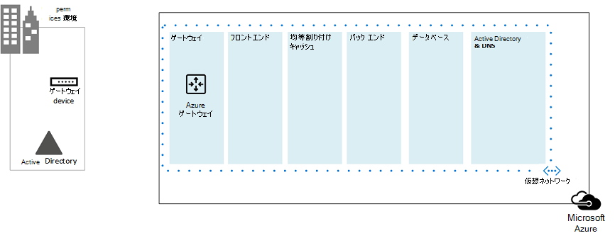
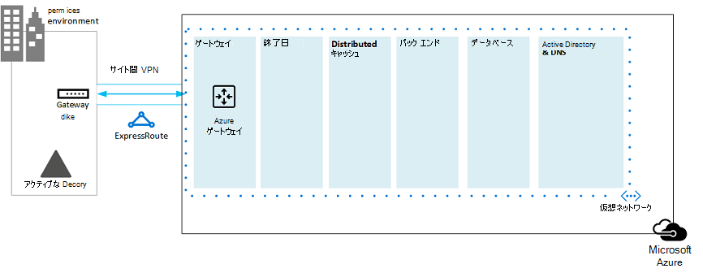
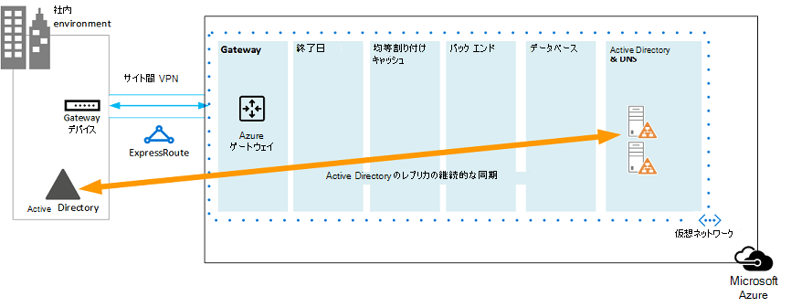
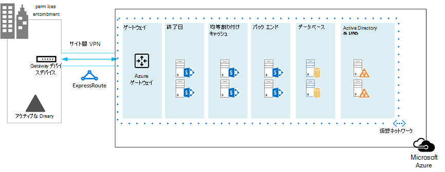
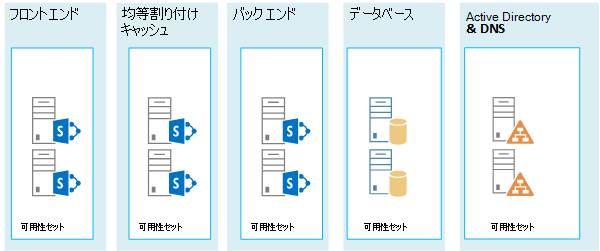
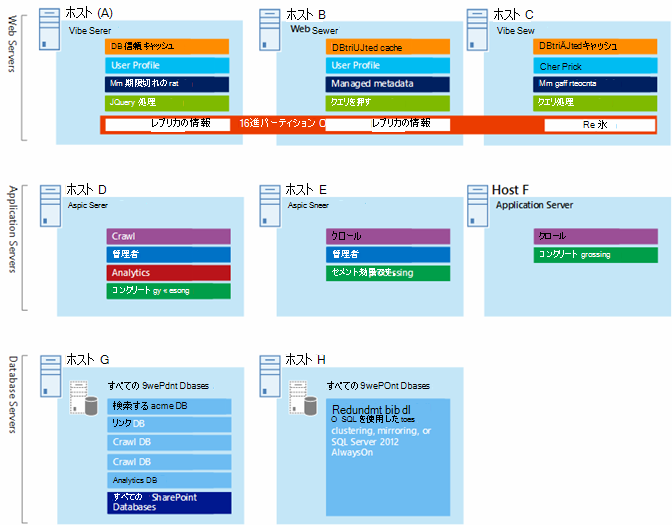

# SharePoint 2013 用の Microsoft Azure アーキテクチャ

Azure は SharePoint Server 2013 ソリューションをホストするための優れた環境です。 ほとんどの場合、Microsoft 365をお勧めしますが、Azure でホストされているSharePoint サーバー ファームは、特定のソリューションに適したオプションです。 この記事では、SharePoint ソリューションが Azure プラットフォームに適合するように設計する方法について説明します。 次の 2 つのソリューションが例として使用されています。
  
- [Microsoft Azure での SharePoint Server 2013 の障害復旧](sharepoint-server-2013-disaster-recovery-in-microsoft-azure.md)
    
- [SharePoint Server 2013 を使用した Microsoft Azure のインターネット サイト](internet-sites-in-microsoft-azure-using-sharepoint-server-2013.md)
    
## 推奨されている Azure インフラストラクチャ サービスの SharePoint ソリューション

Azure インフラストラクチャ サービスは、SharePoint ソリューションをホストするための非常に魅力的な選択肢です。このプラットフォームでは、いくつかのソリューションが他のものと比べてより適していると言えます。以下の表では、推奨されているソリューションが示されています。
  
|**解決方法**|**Azure でそのソリューションが推奨されている理由**|
|:-----|:-----|
|開発環境とテスト環境    |これらの環境を簡単に作成して管理できます。    |
|Azure に対するオンプレミス SharePoint ファームの障害復旧    |**ホストされているセカンダリ データセンター** 別の地域にあるセカンダリ データセンターに投資するのではなく、Azure を使用します。   **低コストの障害復旧環境** オンプレミスの障害復旧環境よりも維持するリソースが少なく、費用も低く抑えられます。リソースの数は、コールド スタンバイ、ウォーム スタンバイ、ホット スタンバイのどの障害復旧環境を選択するかに応じて異なります。  **より柔軟なプラットフォーム** 障害時には、負荷要件を満たすためにご使用の復旧 SharePoint ファームを簡単にスケールアウトできます。それらのリソースが不要になった場合にはスケールインします。  「[Microsoft Azure での SharePoint Server 2013 の障害復旧](sharepoint-server-2013-disaster-recovery-in-microsoft-azure.md)」をご覧ください。    |
|Microsoft 365では利用できない機能とスケールを使用するインターネットに接続するサイト    |**作業の重点** インフラストラクチャの構築ではなく、魅力的なサイトの構築のほうに集中できます。   **Azure でのサイズの柔軟性を活用** 必要に応じて新しいサーバーを追加してファームのサイズを変更し、必要なリソースに対してのみ支払いを行います。動的なマシンの割り当てはサポートされていません (自動スケール)。  **Azure Active Directory (AD) の使用** ユーザー アカウントに関して Azure AD を活用します。   詳細レポートと Web 分析 **の追加Microsoft 365では使用できないSharePoint機能を追加** します。   「[SharePoint Server 2013 を使用した Microsoft Azure のインターネット サイト](internet-sites-in-microsoft-azure-using-sharepoint-server-2013.md)」をご覧ください。    |
|Microsoft 365環境またはオンプレミス環境をサポートするアプリ ファーム    |**アプリのビルド、テスト、ホスト** Azure で、オンプレミス環境とクラウド環境の両方をサポートできます。   **このロールのホスト** オンプレミス環境用の新しいハードウェアを購入する代わりに、Azure で行います。   |
   
イントラネットとコラボレーションのソリューション、およびワークロードに関しては、以下の選択肢を考慮してください。
  
- Microsoft 365がビジネス要件を満たしているか、ソリューションに含めることができるかを判断します。 Microsoft 365には、常に最新の豊富な機能セットが用意されています。
    
- Microsoft 365すべてのビジネス要件を満たしていない場合は、Microsoft Consulting Services (MCS) からオンプレミスで SharePoint 2013 の標準実装を検討してください。 標準のアーキテクチャは、カスタマイズされたアーキテクチャよりもソリューションの実装が迅速かつ安価で、なおかつ簡単です。 
    
- 標準実装がビジネス要件を満たさない場合には、カスタマイズされたオンプレミスのソリューションを考慮します。
    
- ビジネス要件でクラウド プラットフォームを使用することが重要な場合には、Azure インフラストラクチャ サービスでホストされている SharePoint 2013 の標準実装、またはカスタマイズ実装を考慮してください。SharePoint ソリューションは、Microsoft のネイティブ以外の他のパブリック クラウド プラットフォームよりも Azure での方が、より簡単にサポートできます。
    
## Azure 環境を設計する前に

この記事では SharePoint トポロジの例が使用されていますが、こうした設計概念は任意の SharePoint ファーム トポロジで使用できます。Azure 環境を設計する前に、SharePoint ファームを設計するための次のトポロジ、アーキテクチャ、キャパシティ、およびパフォーマンスに関するガイダンスを使用してください。
  
- [SharePoint 2013 の IT 担当者向けアーキテクチャ設計](/SharePoint/technical-reference/technical-diagrams)
    
- [Plan for performance and capacity management in SharePoint Server 2013](/SharePoint/administration/performance-planning-in-sharepoint-server-2013)
    
## Active Directory ドメインの種類の決定

各 SharePoint Server ファームは、ファーム セットアップ用の管理アカウントを提供する点で Active Directory に依存しています。この時点では、Azure には SharePoint ソリューション用の 2 つの選択肢があります。それらについて、以下の表で説明します。
  
|**オプション**|**説明**|
|:-----|:-----|
|専用ドメイン    |Azure に対して専用で独立した Active Directory ドメインを展開し、SharePoint ファームをサポートできます。一般のインターネット サイトに適しています。    |
|クロスプレミス接続を使用したオンプレミス ドメインの拡張    |クロスプレミス接続を使用してオンプレミス ドメインを拡張すると、ユーザーは SharePoint ファームに、オンプレミスでホストされているのと同じようにイントラネットを介してアクセスします。オンプレミスの Active Directory と DNS 実装の利点を生かすことができます。    オンプレミスのファームとの間でフェールオーバーするために Azure で障害復旧環境を構築するには、クロスプレミス接続が必要になります。    |
   
この記事には、クロスプレミス接続を使用してオンプレミス ドメインを拡張するための設計概念も記されています。ご使用のソリューションで専用ドメインを使用する場合には、クロスプレミス接続は不要です。
  
## 仮想ネットワークの設計

最初に、仮想マシンを配置するサブネットを含む仮想ネットワークが Azure で必要になります。仮想ネットワークには、プライベート IP アドレス空間が必要です。その一部をサブネットに割り当てます。
  
クロスプレミス接続を使用して Azure にオンプレミス ネットワークを拡張する場合は (このことは障害回復環境で必要となります)、オンプレミス環境と他の Azure 仮想ネットワークを含む組織ネットワークの他のどの場所にも使用されていないプライベート アドレス空間を選択する必要があります。 
  
**図 1:Azure での仮想ネットワークを使用したオンプレミス環境**

  
この図では次のようになっています。
  
- Azure 内の仮想ネットワークは、オンプレミス環境と横並びに示されています。2 つの環境は、クロスプレミス接続 (サイト間 VPN 接続または ExpressRoute である場合もあります) によってまだ接続されていません。
    
- この時点では、仮想ネットワークにはサブネットのみが含まれており、他のアーキテクチャ要素は含まれていません。1 つのサブネットが Azure ゲートウェイをホストし、他のサブネットは SharePoint ファームの層をホストします。その 1 つは Active Directory と DNS 用に追加されたものです。
    
## クロスプレミス接続の追加

次の展開手順では、クロスプレミス接続を作成します (ご利用のソリューションに該当する場合)。クロスプレミス接続の場合、Azure ゲートウェイを配置する別のゲートウェイ サブネットを作成して、それにアドレス スペースを割り当てる必要があります。 
  
クロスプレミス接続を計画する場合は、Azure ゲートウェイと、オンプレミス ゲートウェイ デバイスへの接続を定義して作成します。
  
**図 2:オンプレミス環境と Azure 間でサイト間接続を提供するための Azure ゲートウェイとオンプレミス ゲートウェイ デバイスの使用**

  
この図では次のようになっています。
  
- 前述の図に加えられた点として、オンプレミス環境がクロスプレミス接続 (サイト間 VPN 接続または ExpressRoute である場合もあります) を介して Azure 仮想ネットワークに接続されています。
    
- Azure ゲートウェイはゲートウェイ サブネット上に配置します。
    
- オンプレミス環境には、ルーターまたは VPN サーバーなどのゲートウェイ デバイスが含まれます。
    
クロスプレミス仮想ネットワークの計画と作成に関する詳細については、「[オンプレミス ネットワークを Microsoft Azure 仮想ネットワークに接続する](connect-an-on-premises-network-to-a-microsoft-azure-virtual-network.md)」をご参照ください。
  
## Active Directory Domain Services (AD DS) と DNS を追加する

Azure における障害復旧の場合、Windows Server AD と DNS をハイブリッド シナリオで展開します。このとき、Windows Server AD は、オンプレミスと Azure 仮想マシンの両方に展開されます。
  
**図 3: Active Directory ドメインのハイブリッド構成**

  
この図は前の図に基づいて作成されていて、Windows Server AD と DNS のサブネットには 2 つの仮想マシンが追加されています。これらの仮想マシンは、レプリカのドメイン コントローラーと DNS サーバーです。これらは、オンプレミス Windows Server AD 環境の拡張となります。 
  
次の表に、Azure におけるこうした仮想マシンに関して推奨されている構成を示します。これらを、ご使用の環境を設計するための開始点として使用してください。Azure 環境がオンプレミス環境と通信しない専用ドメインの場合であってもこれは当てはまります。
  
|**アイテム**|**構成**|
|:-----|:-----|
|Azure での仮想マシンのサイズ    |標準層の A1 または A2 サイズ    |
|オペレーティング システム    |Windows Server 2012 R2    |
|Active Directory ロール    |グローバル カタログ サーバーとして指定された AD DS ドメイン コントローラー。この構成により、クロスプレミス接続を使用する出口トラフィックが減少します。    変更率の高いマルチドメイン環境の場合 (一般的ではありません)、オンプレミスのドメイン コントローラーが、Azure 内のグローバル カタログ サーバーと同期しないように構成して、レプリケーション トラフィックを削減します。    |
|DNS ロール    |ドメイン コントローラーで DNS サーバー サービスをインストールして構成します。    |
|データ ディスク    |Active Directory データベース、ログ、SYSVOL を追加の Azure データ ディスクに配置します。オペレーティング システム ディスク、または Azure によって提供される一時ディスクには配置しないでください。    |
|IP アドレス    |静的 IP アドレスを使用して仮想ネットワークを構成し、ドメイン コントローラーの構成後にこれらのアドレスを仮想ネットワーク内の仮想マシンに割り当てます。    |
   
> [!IMPORTANT]
> Active Directory を Azure で展開する前に、「[Azure の仮想マシンでの Windows Server Active Directory のデプロイ ガイドライン](/windows-server/identity/ad-ds/introduction-to-active-directory-domain-services-ad-ds-virtualization-level-100)」をご覧ください。ご使用のソリューションで別のアーキテクチャまたは構成設定が必要かどうかを判断するのに役立ちます。 
  
## SharePoint ファームの追加

該当するサブネット上の層に SharePoint ファームの仮想マシンを配置します。
  
**図 4: SharePoint 仮想マシンの配置**

  
この図は前の図に基づいて作成されていて、それぞれの層で SharePoint ファーム サーバー ロールが追加されています。
  
- SQL Server を実行する 2 つのデータベース仮想マシンによってデータベース層が作成されます。
    
- それぞれのロール (フロント エンド サーバー、分散キャッシュ サーバー、バック エンド サーバー) ごとに、SharePoint Server 2013 を実行する 2 つの仮想マシンが含まれています。
    
## 可用性セットと障害ドメイン用のサーバー ロールの設計と調整

障害ドメインは、ロール インスタンスを実行するハードウェアをグループ化したものです。同じ障害ドメイン内の仮想マシンは、Azure インフラストラクチャによって同時に更新できます。そうしないと、同じラックを共有しているために、同時に障害が発生する可能性があります。同じ障害ドメインに 2 つの仮想マシンが含まれるというリスクを回避するため、仮想マシンを可用性セットとして構成できます。これにより、各仮想マシンが確実に異なる障害ドメインに配置されます。3 つの仮想マシンが可用性セットとして構成されると、Azure により、同じ障害ドメインに最大で 2 つの仮想マシンしか含まれないようになります。
  
SharePoint ファーム用に Azure アーキテクチャを設計する場合、可用性セットの一部となるように同じサーバー ロールを構成します。これにより、ご使用のそれぞれの仮想マシンが複数の障害ドメインに分散されます。
  
**図 5: SharePoint ファーム層の高可用性を確保するための Azure 可用性セットの使用**

  
この図は、Azure インフラストラクチャ内の可用性セットの構成を示しています。次の各ロールが、それぞれの可用性セットで共有されています。
  
- Active Directory と DNS
    
- データベース
    
- バック エンド
    
- 分散キャッシュ
    
- フロント エンド
    
SharePoint ファームを Azure プラットフォームで調整しなければならない場合があります。すべてのコンポーネントで高可用性を確保するには、サーバー ロールがすべて同じ構成になっていることを確認してください。
  
次の例は、キャパシティとパフォーマンスに関する特定の目標を達成するための標準インターネット サイト アーキテクチャを示しています。この例では次のアーキテクチャ モデルが使用されています。[SharePoint Server 2013 のインターネット サイト検索アーキテクチャ](https://go.microsoft.com/fwlink/p/?LinkId=261519)
  
**図 6: 3 層ファームにおけるキャパシティとパフォーマンスの目標に関する計画例**

  
この図では次のようになっています。
  
- 3 層ファームは、Web サーバー、アプリケーション サーバー、データベース サーバーで表されます。
    
- 3 つの Web サーバーは複数のコンポーネントを含んでおり、同一に構成されています。
    
- 2 つのデータベース サーバーは同一に構成されています。
    
- 3 つのアプリケーション サーバーの構成は同一ではありません。これらのサーバー ロールに関しては、Azure で可用性セット用に調整が必要です。
    
アプリケーション サーバー層について詳しく見てみましょう。
  
**図 7: 調整前のアプリケーション サーバー層**

  
この図では次のようになっています。
  
- 3 つのサーバーがアプリケーション層に含まれています。
    
- 最初のサーバーには 4 つのコンポーネントが含まれています。
    
- 2　番目のサーバーには、3 つのコンポーネントが含まれています。
    
- 3 番目のサーバーには、2 つのコンポーネントが含まれています。
    
対象ファームのパフォーマンスとキャパシティの目標のために必要なコンポーネント数を決定します。Azure でこのアーキテクチャを採用するには、3 つすべてのサーバーで 4 つのコンポーネントのレプリカを作成します。これにより、パフォーマンスとキャパシティに関して必要とされる以上にコンポーネント数が増えます。これは、これら 3 つの仮想マシンが 1 つの可用性セットに割り当てられる場合に、この設計で Azure プラットフォームの 4 つすべてのコンポーネントの高可用性を確保するためのトレードオフとなります。
  
**図 8: 調整後のアプリケーション サーバー層**

  
この図は、同じ 4 つのコンポーネントを含み、同一に構成されている 3 つのアプリケーション サーバーすべてを示しています。
  
SharePoint ファームの各層に可用性セットを追加すると、実装作業が完了します。
  
**図 9:Azure インフラストラクチャ サービスに実装された SharePoint ファーム**

  
この図は、Azure インフラストラクチャ サービスに実装された、各層内のサーバー用の障害ドメインを提供する可用性セットを備えた SharePoint ファームを示しています。
  
## 関連項目

[Microsoft 365 ソリューションおよびアーキテクチャ センター](../solutions/index.yml)
  
[SharePoint Server 2013 を使用した Microsoft Azure のインターネット サイト](internet-sites-in-microsoft-azure-using-sharepoint-server-2013.md)
  
[Microsoft Azure での SharePoint Server 2013 の障害復旧](sharepoint-server-2013-disaster-recovery-in-microsoft-azure.md)