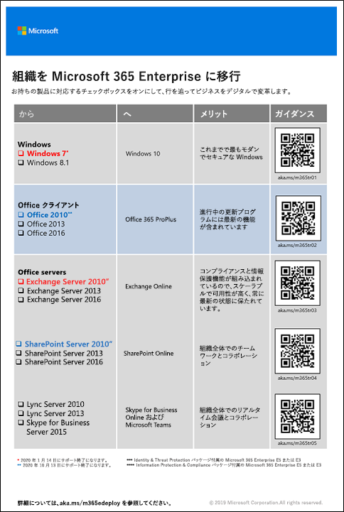

# Microsoft 365 Enterprise への移行

ほとんどの企業では、オペレーティング システム、クライアント ソフトウェア、サーバー ソフトウェアの複数のリリースを使った異種混合環境使用しています。Microsoft 365 Enterprise には、IT インフラストラクチャのこれらのキー コンポーネントの最も安全なバージョンと共に、クラウド テクノロジを活用するために設計されている生産性機能がそろっています。

製品の Microsoft 365 Enterprise の統合スイートのビジネス価値を最大化するには、次のソフトウェアのリリースを移行するための戦略を計画および導入してください。

- コンピューターにインストールされている Office クライアントから Office 365 ProPlus
- サーバーにインストールされている Office サーバーから Office 365 の同等のサービス
- デバイス上の Windows 7 および Windows 8.1 から Windows 10 Enterprise

>[!Note]
>Windows 7 は、2020 年 1 月 14 日にサポート終了になります。 詳細については、[こちら](https://support.microsoft.com/help/4057281/windows-7-support-will-end-on-january-14-2020)をクリックしてください。
>

時経つうちにこれらすべての移行が完了すれば、組織内のチームワークと創造性を引き出す安全で統合された[最新の職場](https://www.microsoft.com/microsoft-365/blog/2018/04/27/making-it-simpler-with-a-modern-workplace/)環境に組織を近づけることができます。これはすべて Microsoft 365 Enterprise によって成し遂げることができます。 

特定の Office 365 ワークロード向けのユーザーとデータの移行に関する情報:

- ユーザーのメールボックスを Exchange Server から Exchange Online へ: [Exchange Online ワークロード](exchangeonline-workload.md)を参照してください。
- SharePoint データを SharePoint Server から SharePoint Online へ: [SharePoint Online ワークロード](sharepoint-online-onedrive-workload.md)を参照してください。
- Skype for Business Online から Microsoft Teams へ: [Microsoft Teams ワークロード](teams-workload.md)を参照してください。

## Microsoft Office クライアント製品の移行

大小問わず多くの組織では、Word、Excel、PowerPoint など、Office クライアント製品の古いバージョンの組み合わせを使っている可能性があります。これらの古いバージョンには以下の特徴があります。

- 最新のセキュリティ更新プログラムおよびサポート修正プログラムで[更新](https://support.office.com/article/install-office-updates-2ab296f3-7f03-43a2-8e50-46de917611c5)できますが、プロセスを手動で行う必要があったり、組織全体にまで行き渡らなかったりする可能性があります。
- Microsoft クラウド テクノロジを活用しビジネスをデジタルに変換するうえで、最適ではありません。
 
Microsoft 365 Enterprise には、Microsoft 365 Enterprise ライセンスで利用でき、Microsoft クラウドからインストールおよび更新される Office クライアント製品のバージョンである Office 365 ProPlus が含まれています。詳細については、「[エンタープライズでの Office 365 ProPlus について](https://docs.microsoft.com/deployoffice/about-office-365-proplus-in-the-enterprise)」を参照してください。

### Office 2007

Office 2007 リリースの Office のバージョンは、サポート期間が過ぎています。詳細については、「[Office 2007 のサポート終了ロードマップ](https://docs.microsoft.com/deployoffice/office-2007-end-support-roadmap)」を参照してください。

Office 2007 を実行しているコンピューターを Office 2010、Office 2013、または Office 2016 にアップグレードするのではなく、以下を行うことを検討してください。

1. ユーザー用に Microsoft 365 ライセンスを取得して割り当てる。
2. ユーザーのコンピューターから Office 2007 をアンインストールする。
3. Office 365 ProPlus を個別にまたは IT ロールアウトと合わせてインストールする。詳細については、「[フェーズ 4: Office 365 ProPlus](office365proplus-infrastructure.md)」を参照してください。

Office 365 ProPlus は更新プログラムを自動的にインストールし、Office 365 のクラウドベースのサービスを活用して強化されたセキュリティと生産性を実現できます。

### Office 2010

Office 2010 リリースの Office のバージョンは、サポートが 2020 年 10 月 13 日に終了します。詳細については、「[Office 2010 のサポート終了ロードマップ](https://docs.microsoft.com/deployoffice/office-2010-end-support-roadmap)」を参照してください。

Office 2010 を実行しているコンピューターを Office 2013 または Office 2016 (両方とも手動で更新する必要があります) にアップグレードするのではなく、以下を行うことを検討してください。 

1. ユーザー用に Microsoft 365 ライセンスを取得して割り当てる。
2. ユーザーのコンピューターから Office 2010 をアンインストールする。
3. Office 365 ProPlus を個別にまたは IT ロールアウトと合わせてインストールする。詳細については、「[フェーズ 4: Office 365 ProPlus](office365proplus-infrastructure.md)」を参照してください。

Office 365 ProPlus は更新プログラムを自動的にインストールし、Office 365 のクラウドベースのサービスを活用して強化されたセキュリティと生産性を実現できます。

### Office 2013 および Office 2016

Office の Office 2013 および Office 2016 バージョンのサポート終了ロードマップはまだ決まっていません。ただし、Office 2010 のように、[更新プログラムをインストールする](https://support.office.com/article/install-office-updates-2ab296f3-7f03-43a2-8e50-46de917611c5)必要があるため、組織の規模によっては全体に行き渡らない可能性があります。Office 2013 または Office 2016 の最新の更新プログラムでコンピューターを更新し続けたり、Office 2013 から Office 2016 にコンピューターを更新したりするのではなく、以下を行うことを検討してください。

1. ユーザー用に Microsoft 365 ライセンスを取得して割り当てる。
2. ユーザーのコンピューターから Office 2013 または Office 2016 をアンインストールする。
3. Office 365 ProPlus を個別にまたは IT ロールアウトと合わせてインストールする。詳細については、「[フェーズ 4: Office 365 ProPlus](office365proplus-infrastructure.md)」を参照してください。

Office 365 ProPlus は更新プログラムを自動的にインストールし、Office 365 のクラウドベースのサービスを活用して強化されたセキュリティと生産性を実現できます。

## Microsoft Office サーバー製品の移行

大小問わず多くの組織では、Exchange Server や SharePoint Server などの Office サーバー製品の古いバージョンの組み合わせを使っている可能性があります。これらの古いバージョンには以下の特徴があります。

- 最新のセキュリティ更新プログラムとサポート修正プログラムで更新する必要があります。場合によっては、これらの更新プログラムは毎月リリースされます。
- Microsoft クラウド テクノロジを活用しビジネスをデジタルに変換するうえで、最適ではありません。
- Microsoft Teams などの新しい生産性向上アプリケーションは含まれません。
- Exchange Advanced Threat Protection などの最新のセキュリティ機能は含まれません。

Microsoft 365 Enterprise には、オンプレミス バージョン Office サーバー ソフトウェアと同じいくつかのツール (Web ブラウザーや Outlook クライアントなど) を使用する、クラウドベース バージョンの Office サーバー サービスを含む Office 365 が含まれます。これらのサービスは IT 部門の手を煩わさずに継続的に更新されるため、オンプレミス サーバーを維持および更新するためにかかる時間を節約できます。これらのサービスには、Office サーバー ソフトウェアにはない拡張機能もあります。 

### Office Server 2007

Office 2007 リリースのサーバー製品については、サポート期間が過ぎています。詳細については、次の記事を参照してください。

- [Exchange 2007 のサポート終了ロードマップ](https://docs.microsoft.com/office365/enterprise/exchange-2007-end-of-support)
- [SharePoint Server 2007 のサポート終了ロードマップ](https://docs.microsoft.com/office365/enterprise/sharepoint-2007-end-of-support)
- [Project Server 2007 のサポート終了ロードマップ](https://docs.microsoft.com/office365/enterprise/project-server-2007-end-of-support)
- [Office Communications Server のサポート終了ロードマップ](https://docs.microsoft.com/skypeforbusiness/plan-your-deployment/upgrade)
- [PerformancePoint Server 2007 のサポート終了ロードマップ](https://docs.microsoft.com/office365/enterprise/pps-2007-end-of-support)

Office 2007 リリースのサーバー製品を Office 2010、Office 2013、または Office 2016 リリースのサーバー製品にアップグレードするのではなく、以下を行うことを検討してください。

1. Office 2007 サーバー上のデータを Office 365 に移行する。これをサポートするために、Microsoft パートナーを採用してください。
2. 新しい機能と作業プロセスをユーザーに展開する。
3. Office 2007 サーバー製品を実行しているオンプレミス サーバーが必要なくなった場合は使用を停止する。

### Office Server 2010

Office 2010 リリースのサーバー製品については、次のものに関してサポートの終了日が決まっています。

- [Exchange Server 2010](https://docs.microsoft.com/office365/enterprise/exchange-2010-end-of-support)
- [SharePoint Server 2010](https://docs.microsoft.com/office365/enterprise/upgrade-from-sharepoint-2010)

Office 2010 リリースのこれらのサーバー製品を Office 2013 または Office 2016 リリースのサーバー製品にアップグレードするのではなく、以下を行うことを検討してください。

1. Office 2010 サーバー上のデータを Office 365 に移行する。これをサポートするために、「[FastTrack for Microsoft 365](https://fasttrack.microsoft.com/microsoft365)」を参照するか、Microsoft パートナーを採用してください。
2. 新しい機能と作業プロセスをユーザーに展開する。
3. Office 2010 サーバー製品を実行しているオンプレミス サーバーが必要なくなった場合は使用を停止する。

### Office Server 2013

Office 2013 リリースのサーバー製品については、サポートの終了日は決まっていません。Office 2013 リリースのサーバー製品を Office 2016 リリースにアップグレードするのではなく、以下を行うことを検討してください。

1. Office 2013 サーバー上のデータを Office 365 に移行する。これをサポートするために、「[FastTrack for Microsoft 365](https://fasttrack.microsoft.com/microsoft365)」を参照するか、Microsoft パートナーを採用してください。
2. 新しい機能と作業プロセスをユーザーに展開する。
3. Office 2013 サーバー製品を実行しているオンプレミス サーバーが必要なくなった場合は使用を停止する。

### Office Server 2016

Office 2016 リリースのサーバー製品については、サポートの終了日は決まっていません。ビジネスをデジタルに変革するクラウドベースのサービスおよび拡張機能を活用するには、以下を行うことを検討してください。

1. Office 2016 サーバー上のデータを Office 365 に移行する。これをサポートするために、「[FastTrack for Microsoft 365](https://fasttrack.microsoft.com/microsoft365)」を参照するか、Microsoft パートナーを採用してください。
2. 新しい機能と作業プロセスをユーザーに展開する。
3. Office 2016 サーバー製品を実行しているオンプレミス サーバーが必要なくなった場合は使用を停止する。

## Microsoft Windows の移行

Windows 7 または Windows 8.1 を実行しているデバイスを移行するには、[一括アップグレード](https://docs.microsoft.com/microsoft-365/enterprise/windows10-deploy-inplaceupgrade)を実行することができます。 

その他の方法については、「[Windows 10 展開シナリオ](https://docs.microsoft.com/windows/deployment/windows-10-deployment-scenarios)」を参照してください。[Windows 10 の展開を計画](https://aka.ms/planforwin10deployment)することもできます。

## Microsoft での Microsoft 365 Enterprise の活用方法

Microsoft の IT 担当者がどのように会社のデータを Microsoft 365 Enterprise に移行しているかについては、以下のリソースで確認することができます。 

- [Microsoft Office 365 ProPlus の展開と更新](https://www.microsoft.com/itshowcase/Article/Content/757/Deploying-and-updating-Microsoft-Office-365-ProPlus)
- [Microsoft では 150,000 のメールボックスを Exchange Online に移行](https://www.microsoft.com/itshowcase/Article/Content/577/Microsoft-migrates-150000-mailboxes-to-Exchange-Online)
- [SharePoint からクラウドへ: Microsoft が実施した移行方法](https://www.microsoft.com/itshowcase/Article/Content/691/SharePoint-to-the-cloud-Learn-how-Microsoft-ran-its-own-migration)
- [Microsoft における、Windows 10 のインプレース アップグレードとしての展開方法](https://www.microsoft.com/itshowcase/Article/Content/668/Deploying-Windows-10-at-Microsoft-as-an-inplace-upgrade)
- [Windows 10 の展開: Microsoft の IT 担当者からのヒント](https://www.microsoft.com/itshowcase/Article/Content/951/Windows-10-deployment-tips-and-tricks-from-Microsoft-IT) (ビデオ)

## 組織全体の移行

組織全体を Microsoft 365 Enterprise に移行する方法をより良く理解するためには、[移行のポスター](https://github.com/MicrosoftDocs/microsoft-365-docs/raw/public/microsoft-365/enterprise/media/deploy-microsoft-365-enterprise/transitionorgtom365.pdf)をダウンロードしてください。

この見開きポスター (2 ページ) で簡単に既存のインフラストラクチャのインベントリを確認して、Microsoft 365 Enterprise で対応する製品またはサービスに移行するためのガイダンスにアクセスできます。 この記事に記載されている製品、その他のインフラストラクチャ、それから、デバイス管理、ID、情報および脅威保護などのセキュリティ要素が含まれます。

このポスターは、レター形式、リーガル形式、またはタブロイド形式 (11 x 17) で印刷できます。

## 結果

お客様の組織では Microsoft Office、Office サーバー、Windows の古いバージョンが Microsoft 365 Enterprise に移行されます。
