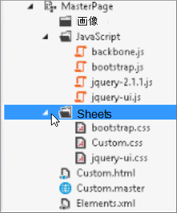
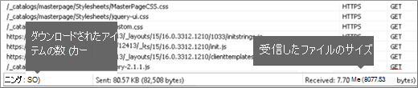
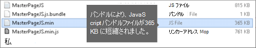

# SharePoint Online での縮小とバンドル

この記事では、Web Essentials で縮小とバンドルの手法を使用して HTTP 要求の数を減らし、SharePoint Online でページを読み込むのにかかる時間を短縮する方法について説明します。
  
Web サイトをカスタマイズすると、カスタマイズをサポートするために、サーバーに大量の追加ファイルを追加する可能性があります。 JavaScript、CSS、イメージを追加すると、サーバーへの HTTP 要求の数が増え、Web ページの表示にかかる時間が長くなります。 同じ種類の複数のファイルがある場合は、これらのファイルをバンドルして、これらのファイルのダウンロードを高速化できます。
  
JavaScript ファイルと CSS ファイルの場合は、縮小というアプローチを使用することもできます。ここでは、必要のない空白文字やその他の文字を削除することで、ファイルの合計サイズを縮小できます。
  
## Web Essentials を使用した JavaScript ファイルと CSS ファイルの縮小とバンドル

Web Essentials などのサード パーティ製ソフトウェアを使用して、CSS ファイルと JavaScript ファイルをバンドルできます。
  
> [!IMPORTANT]
> Web Essentials は、サードパーティのオープンソースのコミュニティ ベースのプロジェクトです。 このソフトウェアは、Visual Studio 2012 およびVisual Studio 2013の拡張機能であり、Microsoft ではサポートされていません。 Web Essentials をダウンロードするには、Web Essentials の Web サイトを [https://vswebessentials.com/download](https://go.microsoft.com/fwlink/p/?LinkId=525629)参照してください。
  
Web Essentials には、次の 2 つの形式のバンドルが用意されています。
  
- .bundle: CSS ファイルと JavaScript ファイルの場合
- .sprite: イメージの場合 (Visual Studio 2013でのみ使用できます)

カスタム マスター ページ内で参照されるいくつかのブランド要素を持つ既存の機能がある場合は、Web Essentials を使用できます。
  

  
### Web Essentials で TE000127218 と CSS バンドルを作成するには
  
1. Visual Studioのソリューション エクスプローラーで、バンドルに含めるファイルを選択します。
2. 選択したファイルを右クリックし、コンテキスト メニューから **[Web Essentials** **Create JavaScript bundle file] (Web** Essentials \> Create JavaScript バンドル ファイル) を選択します。 例:

    
  
## JavaScript ファイルと CSS ファイルをバンドルした結果を表示する

JavaScript と CSS バンドルを作成すると、Web Essentials は、JavaScript ファイルと CSS ファイル、およびその他の構成情報を識別するレシピ ファイルと呼ばれる XML ファイルを作成します。
  

  
さらに、バンドル レシピで minify フラグが true に設定されている場合、ファイルのサイズが小さくなり、まとめてバンドルされます。 つまり、マスター ページで参照できる新しい縮小バージョンの JavaScript ファイルが作成されました。
  

  
Web サイトからページを読み込むと、Internet Explorer 11 などの Web ブラウザーの開発者ツールを使用して、サーバーに送信された要求の数と各ファイルの読み込みにかかった時間を確認できます。
  
次の図は、縮小前に JavaScript ファイルと CSS ファイルを読み込む結果です。
  

  
CSS ファイルと JavaScript ファイルをバンドルした後、要求の数は 74 に減少し、各ファイルは個別にダウンロードするために元のファイルよりわずかに長く済みました。
  

  
バンドル後、JavaScript バンドル ファイルは 815 KB から 365 KB に大幅に削減されます。
  

  
## 画像スプライトを作成して画像をバンドルする

JavaScript ファイルと CSS ファイルをバンドルする方法と同様に、多くの小さなアイコンやその他の一般的な画像を大きなスプライト シートに結合し、CSS を使用して個々の画像を表示できます。 ユーザーの Web ブラウザーは、個々の画像をダウンロードする代わりに、スプライト シートを 1 回ダウンロードし、ローカル コンピューターにキャッシュします。 これにより、Web サーバーへのダウンロード数とラウンド トリップ数を減らすことで、ページ読み込みのパフォーマンスが向上します。
  
### Web Essentials でイメージ スプライトを作成するには**
  
1. Visual Studioのソリューション エクスプローラーで、バンドルに含めるファイルを選択します。
2. 選択したファイルを右クリックし、コンテキスト メニューから **[Web Essentials** Create image sprite] (Web Essentials \> **Create image sprite** ) を選択します。 例:

    
  
3. スプライト ファイルを保存する場所を選択します。 .sprite ファイルは、スプライト内の設定とファイルを記述する XML ファイルです。 次の図は、スプライト PNG ファイルとそれに対応する .sprite XML ファイルの例を示しています。

    
  
    
