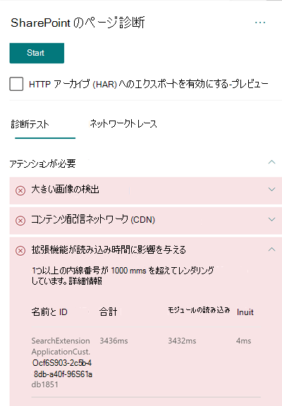

# SharePoint Online のモダン サイト ページでユーザー設定の拡張機能のパフォーマンスを最適化する

この記事では、ユーザー設定の拡張機能がユーザーに発生する可能性のある待ち時間や、一般的な問題の解決方法を判断する方法について説明します。

## SharePoint 用ページ診断ツールを使用してユーザー設定の拡張機能を分析する

SharePoint 用ページ診断ツールは、新しい Microsoft Edge (https://www.microsoft.com/edge) と Chrome のブラウザー拡張機能であり、SharePoint Online の最新ポータルと従来の発行サイト ページの両方を分析します。 このツールでは、定義されている一連のパフォーマンス条件に対するページのパフォーマンスを示す分析済みの各ページのレポートが作成されます。 SharePoint 用ページ診断ツールのインストール方法と詳細については、「[SharePoint Online 用ページ診断ツールを使用する](page-diagnostics-for-spo.md)」を参照してください。

>[!NOTE]
>ページ診断ツールは SharePoint Online でのみ機能し、SharePoint システム ページでは使用できません。

SharePoint のサイト ページを SharePoint 用ページ診断ツールを使用して分析すると、ベースライン メトリックを超えているユーザー設定の拡張機能に関する情報が、_[診断テスト]_ ウィンドウ内の [**拡張機能が読み込み時間に影響を与えています**] および/または [**使用されている機能拡張が多すぎます**] という結果に表示されます。 

考えられる結果は次のとおりです。

- **要注意** (赤): _ユーザー設定の_ 拡張機能で、読み込み時間が **1** 秒を超えるもの。 合計読み込み時間がテスト結果に表示される際は、モジュールの読み込みおよび初期化に分けて表示されます。 さらに、ページで使用されている拡張機能が多すぎる場合は、ページの読み込み時間に影響する可能性があります。ページで **7** つ以上の拡張機能が使用されている場合は、これが強調表示されます。
- **改善の機会** (黄) **5** 個以上の拡張機能が使用されている場合、[要確認] としてこのセクションで強調表示され、7 個以上の拡張機能が使用されると、[確認が必要です] として強調表示されます。
- **操作不要** (緑): 読み込み時間が 1 秒を超える拡張機能はありません。

拡張機能がページの読み込み時間に影響を与える場合、またはページに拡張機能が多すぎる場合、結果は結果の **[** 注意が必要] セクションに表示されます。 結果をクリックすると、読み込みに時間がかかっている拡張機能または多すぎるとして強調表示された拡張機能を確認します。 今後の SharePoint 用ページ診断ツールの更新プログラムでは分析ルールが更新される可能性があるため、常に最新バージョンのツールを使用するようにしてください。

結果に含まれる情報は次のとおりです。

- **[名前と ID]** には、ページで拡張機能を見つけるのに役立つ識別情報が表示されます。
- **合計は** 、モジュールの読み込みと初期化に対する拡張の合計時間を示します。 これは、ページ上で最初から最後まで、拡張機能が実行する合計相対時間です。
- **モジュールの読** み込みでは、拡張機能 JavaScript ファイルと CSS ファイルのダウンロード、評価、読み込みに必要な時間が表示されます。 その後、Init プロセスが開始されます。
- **Init は** 、拡張機能がデータを初期化するために必要な時間を示します。

  これは非同期呼び出しであり、init 時間は、返される約束が解決された場合の onInit 関数の時間の計算です。

この情報は、デザイナーと開発者が問題のトラブルシューティングを行えるように提供されています。 この情報は、設計開発チームに提供するようにします。

## 拡張機能の概要

SharePoint Framework (SPFx) 拡張機能は、SharePoint のユーザー エクスペリエンスを拡張するために使用されます。 SharePoint Framework 拡張機能を使用すると、通知領域、ツールバー、リスト データ ビューなど、SharePoint エクスペリエンスのより多くのファセットをカスタマイズできます。

拡張機能は、必要な作業を行うために CPU やネットワーク リソースを消費するので、SharePoint ページのパフォーマンスに悪い影響を与える可能性があります。

拡張機能には次の 4 種類があります。

- **アプリケーション カスタマイザー** は、ページにスクリプトを追加したり、既知の HTML 要素のプレースホルダーにアクセスしてカスタム レンダリングで拡張したりします。
- **フィールド カスタマイザー** は、変更したビューをリスト内のフィールドのデータに提供します。
- **コマンド セット** は、SharePoint コマンド表面を拡張して新しいアクションを追加し、動作を実装するために使用できるクライアント側のコードを提供します。
- **検索クエリ修飾子 (プレビューのみ)** は、検索クエリが実行される直前に呼び出されます。

## 拡張機能のパフォーマンスの問題を修復する

**[Extensions are impacting load time]** (拡張機能がページの読み込み時間に影響を与えています) という結果に表示されるパフォーマンスの問題を特定して修復するには、このセクションのガイダンスに従ってください。

>[!NOTE]
>アプリケーション カスタマイザーは、ページのライフサイクルの中で初期の段階で実行される場合があり、そのページの他の拡張機能のパフォーマンスに影響を与える可能性があります。

ページ診断ツールの監査結果は、パフォーマンスへの潜在的な影響を特定するため、拡張機能を実行する 2 つの段階が表示されます。

- **モジュールの読み込み** は、拡張機能の読み込みにかかる時間です。これは拡張機能の大きさの影響を受けるため、必要なライブラリのみを拡張機能にまとめたり、より軽いライブラリを選択したりすることをお勧めします。
- **初期化** は、拡張機能を初期化する時間です。拡張機能の開発者は、初期化の段階で拡張機能が不要な作業を行っていないか、またはコマンドを実行しすぎていないかを検討する必要があります。

ページ作成者は、監査結果を利用して、ページに含まれる拡張機能が多すぎないかどうかを確認することもできます。拡張機能が多すぎると、ページのパフォーマンスに悪影響を与えます。

- **拡張機能の大きさと依存関係**
  - 静的リソースの最適なダウンロードを行うには、Office 365 CDN を使用する必要があります。 _js/css_ ファイルの配信元として、パブリックの CDN 配信元が推奨されています。 Office 365 CDN の使用に関する詳細については、「[SharePoint Online での Office 365 コンテンツ配信ネットワーク (CDN) の使用](use-microsoft-365-cdn-with-spo.md)」を参照してください。
  - SharePoint Framework (SPFx) に付属する _React_ や _Fabric imports_ などのフレームワークを再利用してください。 詳細については、「[SharePoint Framework の概要](/sharepoint/dev/spfx/sharepoint-framework-overview)」を参照してください。
  - 最新バージョンの SharePoint Framework を使用するようにし、新しいバージョンがリリースされた場合にはアップグレードしてください。
- **データの取得/キャッシュ**
  - 表示するデータを取得するのに拡張機能が追加のサーバー呼び出しに依存している場合は、それらのサーバー API が高速で、(_localStorage_ や _IndexDB_ (大規模なセットの場合) などを使用する) クライアント側キャッシュが実装されていることを確認してください。
  - 重要なデータを表示するために複数の呼び出しが必要な場合は、サーバーへの呼び出しのバッチ処理または複数の要求を 1 つの呼び出しに統合する他の方法を検討してください。
  - または、データの一部の要素で低速の API が要求され、これらの要素が初期レンダリングには重要でない場合、これらを重要なデータのレンダリング後に実行される別の呼び出しに切り離します。
  - 複数のパーツが同じデータを使用している場合、共通データ層を使用して呼び出しの重複を防ぎます。
- **レンダリング時間**
  - 不必要な大きなアセットのダウンロードを防ぐために、画像やビデオなどのメディアのソースは、コンテナー、デバイス、およびネットワークの制限に合わせてサイズを設定する必要があります。 コンテンツの依存関係の詳細については、「[SharePoint Online での Office 365 コンテンツ配信ネットワーク (CDN) の使用](use-microsoft-365-cdn-with-spo.md)」を参照してください。
  - 再フロー、複雑な CSS ルール、複雑なアニメーションにつながる API 呼び出しを行わないようにします。 詳細については、「[Minimizing browser reflow
(ブラウザーの再フローを最小化する)](https://developers.google.com/speed/docs/insights/browser-reflow)」を参照してください。
  - 連結されている長時間実行タスクを使用しないようにします。 代わりに、長時間実行タスクは個別のキューに分割します。 詳細については、「[Optimize JavaScript Execution (JavaScript の実行を最適化する)](https://developers.google.com/web/fundamentals/performance/rendering/optimize-javascript-execution)」を参照してください。
  - フレームの飛びや途切れ (_ジャンク_ とも呼ばれます) を防ぐために、メディアの非同期的なレンダリング用に、対応するスペースを予約します。
  - レンダリンで使用される機能が特定のブラウザーでサポートされていない場合は、ポリフィルを読み込むか、依存コードの実行を除外します。 その機能が重要ではない場合は、メモリ リークが発生しないようにイベント ハンドラーなどのリソースを解放します。

パフォーマンスの問題を修復するためにページを変更する前に、分析結果に表示されるページ読み込み時間をメモしてください。 修正後にツールをもう一度実行して新しい結果がベースライン基準内にあるかどうかを確認し、新しいページ読み込み時間をチェックして改善されたかどうかを確認します。

>[!NOTE]
>ページ読み込み時間は、ネットワーク負荷、時間帯、その他の一時的な状態など、さまざまな要素によって異なります。 結果を平均化するために、変更の前後に数回に渡ってページ読み込み時間をテストする必要があります。

## 関連トピック

[SharePoint Online のパフォーマンスをチューニングする](tune-sharepoint-online-performance.md)

[Office 365 のパフォーマンスをチューニングする](tune-microsoft-365-performance.md)

[SharePoint のモダン エクスペリエンスにおけるパフォーマンス](/sharepoint/modern-experience-performance)

[コンテンツ配信ネットワーク](content-delivery-networks.md)

[SharePoint Online での Office 365 コンテンツ配信ネットワーク (CDN) の使用](use-microsoft-365-cdn-with-spo.md)