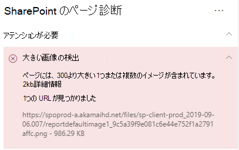

# SharePoint Online のモダン サイト ページで画像を最適化する

この記事では SharePoint Online のモダン サイト ページで画像を最適化する方法について説明します。

クラシック発行サイトで画像を最適化する方法の詳細については、「[SharePoint Online の画像の最適化](image-optimization-for-sharepoint-online.md)」を参照してください。

>[!NOTE]
>Sharepoint Online の最新ポータルでのパフォーマンスの詳細については、「[SharePoint のモダン エクスペリエンスにおけるパフォーマンス](/sharepoint/modern-experience-performance)」を参照してください。

## SharePoint 用ページ診断ツールを使用して画像の最適化を分析する

SharePoint 用ページ診断ツールは、新しい Microsoft Edge (https://www.microsoft.com/edge)) と Chrome のブラウザー拡張機能であり、SharePoint Online の最新ポータルと従来の発行サイト ページの両方を分析します。 このツールでは、定義されている一連のパフォーマンス条件に対するページのパフォーマンスを示す分析済みの各ページのレポートが作成されます。 SharePoint 用ページ診断ツールのインストール方法と詳細については、「[SharePoint Online 用ページ診断ツールを使用する](page-diagnostics-for-spo.md)」を参照してください。

>[!NOTE]
>ページ診断ツールは SharePoint Online でのみ機能し、SharePoint システム ページでは使用できません。

SharePoint のモダン サイトを SharePoint 用ページ診断ツールを使用して分析すると、サイズの大きな画像に関する情報が [_診断テスト_] ウィンドウに表示されます。

考えられる結果は次のとおりです。

- **注意が必要です** (赤): このページには大きさが 300KB 以上の画像が **1 つ以上** 含まれています
- **対処は不要です** (緑): このページには大きさが 300KB 以上の画像は含まれていません

結果の [**注意が必要です**] セクションに [**大きな画像が検出されました**] という結果が表示された場合は、結果をクリックすると追加の詳細が表示されます。

## 大きな画像に関する問題を修復する

大きさが 300KB 以上の画像がページに含まれている場合は、[**大きな画像が検出されました**] という結果を選択してサイズが大きすぎる画像を確認します。 SharePoint Online のモダン ページでは、画像の表示とサイズはブラウザー ウィンドウのサイズとクライアント モニターの解像度に応じて自動的に決定されます。 画像は、SharePoint Online にアップロードする前に、 Web での使用のために必ず最適化する必要があります。 サイズが非常に大きい画像のサイズと解像度が自動的に縮小されます。これにより、予期しない表示特性が発生する可能性があります。

パフォーマンスの問題を修復するためにページを修正する前に、分析結果のページ読み込み時間をメモしてください。 修正後にツールをもう一度実行して新しい結果がベースライン基準内にあるかどうかを確認し、新しいページ読み込み時間をチェックして改善されたかどうかを確認します。

>[!NOTE]
>ページ読み込み時間は、ネットワーク負荷、時間帯、その他の一時的な状態など、さまざまな要素によって異なります。 結果を平均化するために、変更の前後に数回に渡ってページ読み込み時間をテストする必要があります。

## 関連トピック

[SharePoint Online のパフォーマンスをチューニングする](tune-sharepoint-online-performance.md)

[Office 365 のパフォーマンスをチューニングする](tune-microsoft-365-performance.md)

[SharePoint のモダン エクスペリエンスにおけるパフォーマンス](/sharepoint/modern-experience-performance)

[コンテンツ配信ネットワーク](content-delivery-networks.md)

[SharePoint Online での Office 365 コンテンツ配信ネットワーク (CDN) の使用](use-microsoft-365-cdn-with-spo.md)