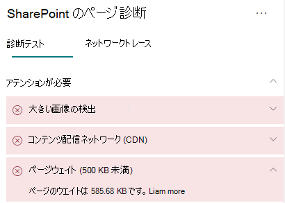

# SharePoint Online の最新のサイト ページでページのウエイトを最適化する

SharePoint Online の最新のサイト ページには、ページのコンテンツをレンダリングするのに必要なシリアル番号が含まれています。これには、ナビゲーション バーやコマンド バーと、ページの枠組みを構成するその他の HTML コードの下のコンテンツ領域にある画像、テキスト、オブジェクトが含まれます。 ページのウエイトはこの HTML コードの測定値であり、ページの読み込み時間が最適になるように制限する必要があります。

この記事では、最新のサイト ページでページのウエイトを減らす方法について説明します。

>[!NOTE]
>Sharepoint Online の最新ポータルでのパフォーマンスの詳細については、「[SharePoint のモダン エクスペリエンスにおけるパフォーマンス](/sharepoint/modern-experience-performance)」を参照してください。

## SharePoint 用ページ診断ツールを使用してページのウエイトを分析する

SharePoint 用ページ診断ツールは、新しい Microsoft Edge (https://www.microsoft.com/edge)) と Chrome のブラウザー拡張機能であり、SharePoint Online の最新ポータルと従来の発行サイト ページの両方を分析します。 このツールでは、定義されている一連のパフォーマンス条件に対するページのパフォーマンスを示す分析済みの各ページのレポートが作成されます。 SharePoint 用ページ診断ツールのインストール方法と詳細については、「[SharePoint Online 用ページ診断ツールを使用する](page-diagnostics-for-spo.md)」を参照してください。

>[!NOTE]
>ページ診断ツールは SharePoint Online でのみ機能し、SharePoint システム ページでは使用できません。

SharePoint のサイト ページを SharePoint 用ページ診断ツールを使用して分析すると、[_診断テスト_] ウィンドウの [**500 KB 未満のページのウエイト**] 結果にページに関する情報が表示されます。 結果は、ページのウエイトがベースライン値を下回る場合は緑色で、ページのウエイトが基準値を超える場合は赤色で表示されます。

考えられる結果は次のとおりです。

- **要注意** (赤): ページのウエイトが 500 KB を超えています
- **操作は不要** (緑): ページのウエイトが 500 KB を下回っています

[**500 KB 未満のページのウエイト**] の結果が [**要注意**] セクションに表示された場合、結果をクリックして詳細を確認できます。

## ページのウエイトの問題を修復する

ページのウエイトが 500 KB を超える場合は、Web パーツの数を減らし、適度にページのコンテンツを制限することで、ページの読み込み時間全体を改善できます。

ページのウエイトを減らすための一般的なガイダンスは以下のとおりです。

- ページのコンテンツを妥当な量まで制限し、関連するコンテンツには複数のページを使用します。
- 大きなプロパティ バッグがある Web パーツの使用を最小限に抑えます。
- 可能な場合は、非対話型ロールアップ ビューを使用します。
- 画像のサイズを最適化するには、画像のサイズを適度に変更し、圧縮された画像形式を使用して、CDN からダウンロードできるようにします。

ページのウエイトを制限に関する追加のガイダンスについては、次の記事を参照してください。

- [SharePoint でページ パフォーマンスを最適化する](/sharepoint/dev/general-development/optimize-page-performance-in-sharepoint)

ページの変更を行ってパフォーマンスの問題を修復する前に、分析結果のページの読み込み時間をメモします。 修正後にツールをもう一度実行して新しい結果がベースライン基準内にあるかどうかを確認し、新しいページ読み込み時間をチェックして改善されたかどうかを確認します。

>[!NOTE]
>ページ読み込み時間は、ネットワーク負荷、時間帯、その他の一時的な状態など、さまざまな要素によって異なります。 結果を平均化するために、変更の前後に数回に渡ってページ読み込み時間をテストする必要があります。

## 関連トピック

[SharePoint Online のパフォーマンスをチューニングする](tune-sharepoint-online-performance.md)

[Office 365 のパフォーマンスをチューニングする](tune-microsoft-365-performance.md)

[SharePoint のモダン エクスペリエンスにおけるパフォーマンス](/sharepoint/modern-experience-performance)

[コンテンツ配信ネットワーク](content-delivery-networks.md)

[SharePoint Online での Office 365 コンテンツ配信ネットワーク (CDN) の使用](use-microsoft-365-cdn-with-spo.md)