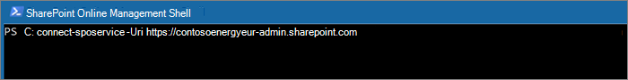

# <a name="move-a-sharepoint-site-to-a-different-geo-location"></a>別の地域の場所に SharePoint サイトを移動する

SharePoint サイトの地域移動を使って、SharePoint サイトを複数の地域環境内にある別の地域の場所へ移動させることができます。

次のサイトの種類は地域のジオ位置情報間を移動することができます。

- Microsoft Teams に関連付けられているサイトを含む、Microsoft 365 グループ接続サイト
- Microsoft 365 グループ関連付けのないモダン サイト
- 従来の SharePoint サイト
- コミュニケーション サイト

ジオ位置情報間でサイトを移動するには、全体管理者または SharePoint 管理者である必要があります。

SharePoint サイトの geo 移動には、サイトの内容に応じて約 4 ~ 6 時間の読み取り専用ウィンドウがあります。

## <a name="best-practices"></a>ベスト プラクティス

- その手順に慣れるために、テスト サイトで SharePoint サイトを移動してみてください。
- スケジュールまたは移動を実行する前に、サイトを移動できるかどうかを検証します。
- 可能であれば、地域間の移動スケジュールはユーザーへの影響を減らすために営業時間外に移動します。
- サイトの移動前に影響を受けるユーザーに通知します。

## <a name="communicating-to-your-users"></a>ユーザーへの連絡

ジオ位置情報間で SharePoint サイトを移動する場合は、想定される動作をサイトのユーザー (一般的にサイトの編集権限がある全てのユーザー) に通知することが重要です。 これにより、ユーザーの混乱やヘルプデスクへの問い合わせを減らすことができます。 移動する前に、次の情報をサイトのユーザーへメールで連絡してください。

- 移動開始予定時刻と予定所要時間
- サイトの移動先となるジオ位置情報と、新しい位置情報にアクセスするための URL
- 移動中はファイルを閉じ、編集を加えないこと。
- 移動してもファイルのアクセス許可と共有設定は変更されないこと。
- 複数の地域環境でのユーザー エクスペリエンスから予想されること

移動が正常に終了した時点で、作業を再開できることを伝える電子メールをユーザーに送信してください。

## <a name="scheduling-sharepoint-site-moves"></a>SharePoint サイトのスケジュール設定に移動します

SharePoint サイトの移動を事前にスケジュールすることができます (この記事の後半でご説明します)。 次のように移動をスケジュールします:

- 一度に最大 4,000 件の移動をスケジュールすることができます。
- 移動開始後はスケジュールを追加でき、常時最大 4,000 件の保留中の移動をキューに置いておけます。
- 移動できる SharePoint サイトの最大サイズは 1 テラバイト (1 TB) です。

SharePoint サイトの地域移動を後でスケジュール設定するには、移動開始時に次のいずれかのパラメーターを含みます:

- `PreferredMoveBeginDate` -移動は、この指定時刻に開始されると見込まれます。
- `PreferredMoveEndDate` -移動は、ベストエフォート方式でこの指定時刻に完了すると見込まれます。

両方のパラメーターの時間を協定世界時 (UTC) で指定してください。

## <a name="moving-the-site"></a>サイトの移動

SharePoint サイトの地域移動は　サイトがあるジオ位置情報でSharePoint の管理 URLから接続し、実行する必要があります。

たとえば、サイト URL が次の `https://contosohealthcare.sharepoint.com/sites/Turbines`場所にある SharePoint 管理者 URL に `https://contosohealthcare-admin.sharepoint.com`接続します。

```powershell
Connect-SPOService -Url https://contosohealthcare-admin.sharepoint.com
```



### <a name="validating-the-environment"></a>環境の検証

サイトの移動をスケジュールする前に、サイトが移動できるか検証することをお勧めします。

サイトの移動はサポートしていません:

- Business Connectivity Services
- InfoPath フォーム
- Information Rights Management (IRM) テンプレートの適用

すべてのジオ位置情報に互換性があることを確認するために、 `Get-SPOGeoMoveCrossCompatibilityStatus`を実行します。 すべてのジオ位置情報と、その環境が移動先のジオ位置情報と互換性があるかどうかを表示します。

サイトでの検証のみのチェックを実行するには、`-ValidationOnly` パラメーターで`Start-SPOSiteContentMove`を使い、サイトが移動できるか検証します。 例:

```PowerShell
Start-SPOSiteContentMove -SourceSiteUrl <SourceSiteUrl> -ValidationOnly -DestinationDataLocation <DestinationLocation>
```

サイトが移動準備完了の場合、*正常に完了*　と返ってきます。ブロックされている状態がある場合は、*失敗* と返ってきます。

### <a name="start-a-sharepoint-site-geo-move-for-a-site-with-no-associated-microsoft-365-group"></a>Microsoft 365 グループが関連付けられていないサイトの SharePoint サイト geo 移動を開始する

既定値では、サイトの最初のURL は移動先のジオ位置情報の URL に変更されます。 例:

`https://Contoso.sharepoint.com/sites/projectx` から `https://ContosoEUR.sharepoint.com/sites/projectx`

Microsoft 365 グループの関連付けが存在しないサイトの場合は、パラメーターを使用してサイトの名前を `-DestinationUrl` 変更することもできます。 例:

<https://Contoso.sharepoint.com/sites/projectx> から `https://ContosoEUR.sharepoint.com/sites/projecty`

サイトの移動を開始するには、次のコマンドを実行します:

```powershell
Start-SPOSiteContentMove -SourceSiteUrl <siteURL> -DestinationDataLocation <DestinationDataLocation> -DestinationUrl <DestinationSiteURL>
```


### <a name="start-a-sharepoint-site-geo-move-for-a-microsoft-365-group-connected-site"></a>Microsoft 365 グループ接続サイトの SharePoint サイト geo 移動を開始する

Microsoft 365 グループ接続サイトを移動するには、グローバル管理者または SharePoint 管理者が最初に Microsoft 365 グループの優先データの場所 (PDL) 属性を変更する必要があります。

Microsoft 365 グループの PDL を設定するには、

```PowerShell
Set-SPOUnifiedGroup -PreferredDataLocation <PDL> -GroupAlias <GroupAlias>
Get-SPOUnifiedGroup -GroupAlias <GroupAlias>
```

PDL を更新したら、サイトの移動を開始できます。

```PowerShell
Start-SPOUnifiedGroupMove -GroupAlias <GroupAlias> -DestinationDataLocation <DestinationDataLocation>
```

## <a name="cancel-a-sharepoint-site-geo-move"></a>SharePoint サイトジオへの移動をキャンセルする

その移動が実行されていない、または`Stop-SPOSiteContentMove`コマンドレットを使って完了した場合、SharePoint サイトの地域移動を停止できます。

## <a name="determining-the-status-of-a-sharepoint-site-geo-move"></a>SharePoint サイトの地域移動の状況を確認する

次のコマンドレットを使用して接続している地域外でのサイトの移動状況を確認することができます。

- [Get-SPOSiteContentMoveState](/powershell/module/sharepoint-online/get-spositecontentmovestate) (グループ接続以外のサイト)
- [Get-SPOUnifiedGroupMoveState](/powershell/module/sharepoint-online/get-spounifiedgroupmovestate) (グループ接続サイト)

`-SourceSiteUrl` パラメーターを使用して、移動状況を確認したいサイトを指定します。

移動状況については、次に示す表で説明します。

****

|状態|説明|
|---|---|
|トリガーの準備|移動は開始されていません。|
|スケジュール済み|移動がキューにあり、まだ開始されていません。|
|InProgress (n/4)|この移動は、検証 (1/4)、バックアップ (2/4)、復元 (3/4)、クリーンアップ (4/4) のいずれかの状態で進行中です。|
|Success|移動は正常に完了しています。|
|Failed|移動は失敗しました。|
|

移動に関する追加情報を確認する `-Verbose` オプションを適用することもできます。

## <a name="user-experience"></a>ユーザー エクスペリエンス

サイトが別のジオ位置情報へ移動した場合は、サイトユーザーに最小限の中断があることを通知する必要があります。 移動中は簡単な読み取り専用状態になることに加えて、既存のリンクとアクセス許可は移動の完了後に引き続き想定通りに操作できるようになります。

### <a name="site"></a>サイト

移動の進行中、サイトは読み取り専用に設定されます。 移動の完了後に、ブックマークまたは他のリンクをクリックすると、新しいジオ位置情報の新しいサイトがユーザーに指定されます。

### <a name="permissions"></a>アクセス許可

サイトへのアクセス許可を持つユーザーは、移動中および移動完了後のサイトに引き続きアクセスすることができます。

### <a name="sync-app"></a>アプリの同期

同期アプリは、サイトの移動が完了すると、同期を自動的に検出し、シームレスに新しいサイトの場所に転送します。 ユーザーはもう一度サインインまたはその他のアクションをする必要はありません。 (バージョン 17.3.6943.0625 以降の同期アプリが必要です。

移動の進行中にユーザーがファイルを更新した場合、同期アプリは、移動の進行中にファイルのアップロードが保留中であることを通知します。

### <a name="sharing-links"></a>共有リンク

SharePoint サイトの地域移動の完了時に、移動されたファイルの既存の共有リンクは、新しいジオ位置情報に自動的にリダイレクトされるようになります。

### <a name="most-recently-used-files-in-office-mru"></a>最近使用された Office のファイル (MRU)

MRU サービスは、移動が完了するとサイトとコンテンツの URL が更新されます。 Word、Excel、PowerPoint に適用されます。

### <a name="onenote-experience"></a>OneNote エクスペリエンス

OneNote win32 クライアントと UWP (ユニバーサル) アプリは、サイトの移動完了後に新しいサイトの場所を自動的に検出し、シームレスにノートブックを同期します。 ユーザーはもう一度サインインまたはその他のアクションをする必要はありません。 サイトの移動が進行中にノートブックの同期が失敗する時だけ、ユーザーにインジケーターで表示されます。 このエクスペリエンスは、次の OneNote クライアント バージョンで使用できます:

- OneNote win32: バージョン 16.0.8326.2096 (以降)
- OneNote UWP: バージョン 16.0.8431.1006 (以降)
- OneNote モバイル アプリ: バージョン 16.0.8431.1011 (以降)

### <a name="teams-applicable-to-microsoft-365-group-connected-sites"></a>Teams (Microsoft 365 グループ接続サイトに適用)

SharePoint サイト geo の移動が完了すると、ユーザーは Teams アプリ上の Microsoft 365 グループ サイト ファイルにアクセスできるようになります。 さらに、地域移動前にサイトからチーム チャット経由で共有したファイルは、移動が完了後に引き続き操作できるようになります。

SharePoint サイト geo の移動では、ある地域から別の地域へのプライベート チャネルの移動はサポートされていません。 プライベート チャネルは元の geo に残ります。
  

### <a name="sharepoint-mobile-app-iosandroid"></a>iOS/Android 用 SharePoint モバイル アプリ

SharePoint モバイル アプリは、地域間で互換性があり、サイトの新しいジオ位置情報を検出することができます。

### <a name="sharepoint-workflows"></a>SharePoint ワークフロー

SharePoint 2013 ワークフローは、サイトの移動後に再発行する必要があります。 SharePoint 2010 ワークフローは、正常に動作し続ける必要があります。

### <a name="apps"></a>アプリ

アプリを使用してサイトを移動する場合は、アプリとその接続が移行先の地域の場所で利用できない可能性があるため、サイトの新しい地域の場所にアプリを再確立する必要があります。

### <a name="flow"></a>Flow

ほとんどの場合、フローは、SharePoint サイトの geo 移動後も引き続き機能します。 移動が完了したらテストすることをお勧めします。

### <a name="power-apps"></a>Power Apps

Power Apps は、移行先の場所に再作成する必要があります。

### <a name="data-movement-between-geo-locations"></a>ジオ位置情報間のデータ移動

SharePoint にサイトとそのファイルに関連付けられているメタデータが保存されている場合は、コンテンツの Azure Blob ストレージを使用します。 その元のジオ位置情報から移動先のジオ位置情報へ移動後、サービスも関連付けられている Blob ストレージへ移動します。 BLOB ストレージは約40日で移動を完了します。
