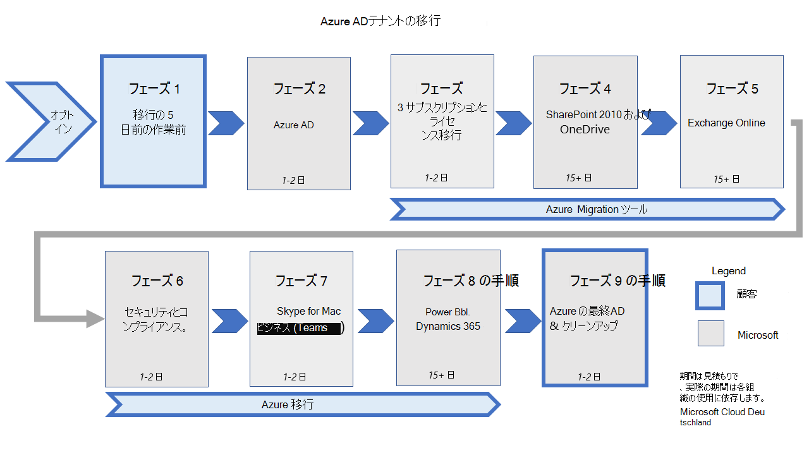

# <a name="migration-phases-actions-and-impacts-for-the-migration-from-microsoft-cloud-deutschland"></a>移行フェーズアクションと Microsoft Cloud Deutschland からの移行に対する影響

Microsoft Cloud Deutschland (MCD) から Microsoft の Office 365 Global サービスの地域 "ドイツ" へのテナント移行は、一連のフェーズと、ワークロードごとに構成されたアクションとして実行されます。 この図は、新しいドイツのデータセンターへの移行の 10 フェーズを示しています。

[ ](../media/ms-cloud-germany-migration-opt-in/migration-organization.png#lightbox)

移行プロセスは、組織の全体的な規模と複雑さによって、何週間にも渡って完了します。 移行が進行中の間、ユーザーと管理者は、このドキュメントで詳しく説明されている変更点を使用して、サービスを引き続き利用できます。 グラフィックとテーブルは、移行中のフェーズと手順を定義します。

> [!NOTE]
> Azure サービスの移行は、このドキュメントの一部ではありません。 その情報については [、「Azure Germany の移行ガイダンス」を参照してください](/azure/germany/germany-migration-main)。

<br>

****

|Step(s)|期間|責任ある当事者|説明|
|---|---|---|---|
|Opt-In|時間|顧客|組織に移行を選択します。|
|プレワーク|Days|顧客|ユーザー、ワークステーション、およびネットワークを移行用に準備するために必要な作業を完了します。|
|Azure Active Directory (Azure AD)|1~ 2 日|Microsoft|Azure AD組織を世界中に移行します。|
|Azure|週|顧客|新しい世界中の Azure サブスクリプションを作成し [、Azure サービスを移行します](/azure/azure-resource-manager/management/move-resource-group-and-subscription)。|
|サブスクリプション&ライセンス移行|1~ 2 日|Microsoft|世界中のサブスクリプションを購入し、Microsoft Cloud Deutschland サブスクリプションをキャンセルし、ユーザー ライセンスを移行します。|
|SharePoint および OneDrive|15 日以上|Microsoft|コンテンツSharePoint移行OneDrive for Businessし、URL を保持 sharepoint.de します。|
|Exchange Online|15 日以上|Microsoft|コンテンツExchange Online移行し、世界中の URL に移行します。|
|セキュリティとコンプライアンス|1~ 2 日|Microsoft|コンプライアンス ポリシー&コンテンツに対するセキュリティの移行。|
|Skype for Business|1~ 2 日|Microsoft|Skype for BusinessからMicrosoft Teams。|
|Power BI & Dynamics 365|15 日以上|Microsoft|ユーザー Power BI Dynamics 365 コンテンツを移行します。|
|Azure の最終AD|1~ 2 日|Microsoft|テナントを世界中に切り替えます。|
|Clean-Up|1~ 2 日|顧客|Active Directory フェデレーション サービス (AD FS) 証明書利用者信頼、Azure AD Connect、および Office クライアントの再起動など、Microsoft Cloud Deutschland への従来の接続をクリーンアップします。|
|エンドポイントが無効|30 日間|Microsoft|Azure AD の最終決定から 30 日後、Microsoft Cloud Deutschland Azure AD サービスは移行された組織のエンドポイント アクセスを停止します。 認証などのエンドポイント要求は、Microsoft Cloud Deutschland サービスに対してこの時点から順方向に失敗します。 Microsoft Cloud Deutschland の Office 365 サービスにリンクされているインスタンスで Azure ワークロードを実行しているお客様は、後で最終移行フェーズに移行されます。|
|

フェーズとそのアクションにより、重要なデータとエクスペリエンスがグローバル サービスのOffice 365されます。 テナントが移行キューに追加されると、各ワークロードは、バックエンド サービスで実行される一連の手順として完了します。 一部のワークロードでは、管理者 (またはユーザー) によるアクションが必要な場合や、移行が実行および説明されているフェーズの使用状況に影響を与える場合があります。「移行の整理方法」を [参照してください。](ms-cloud-germany-transition.md#how-is-the-migration-organized)

次のセクションには、移行のさまざまなフェーズを進むワークロードのアクションと効果が含まれています。 表を確認し、組織に適用できるアクションまたは効果を決定します。 必要に応じて、それぞれのフェーズで手順を実行する準備ができているか確認します。 必要な手順を完了できないと、サービスが停止し、サービスへの移行がOffice 365があります。

## <a name="phase-opt-in"></a>フェーズ: Opt-In

**適用** 対象 : Microsoft Cloud Deutschland (MCD) でホストされている Office 365 テナントを持つすべてのお客様は、同意なしに MCD でホストされている Office 365 テナントを移行できません。

<br>

****

|Step(s)|説明|影響|
|---|---|---|
|**顧客タスク**: 移行に対する同意の付与|お客様は、移行に関する同意を付与し、Microsoft がグローバル サービス インスタンスへのデータとサービスの移行を移行し、Office 365調整する権利を取得します。 次の 2 つの方法があります。 <ol><li>テナントOffice 365は、Microsoft が駆動する移行にオプトインします。</li><li>お客様は、2020 年 5 月 1 日Office 365 MCD テナントのサブスクリプションを更新しました。 Microsoft は、毎月移行の権利をこれらのお客様に通知し、30 日待って顧客にキャンセルの機会を与え、その後直接オプトインします。</li></ol>|<ul><li>テナントは移行に同意済みとしてマークされ、管理センターには確認が表示されます。</li><li>受信確認は、テナント Office 365に投稿されます。 サービス構成は、Microsoft Cloud Deutschland エンドポイントから続行されます。</li></ul>
|**テナント管理者**: メッセージの監視|テナント管理者は、この時点Office 365移行フェーズの状態に関する更新プログラムをメッセージ センターで監視する必要があります。|顧客は必要なタスクを時間内に実行できます。
|

## <a name="phase-1-before-the-migration-starts"></a>フェーズ 1: 移行を開始する前に

すべての顧客に適用される移行準備手順をよく理解 [してください](ms-cloud-germany-transition-add-pre-work.md)。

所有する 1 つ以上の DNS 名前空間に _msoid_ という DNS CNAME を設定した場合は、最新のフェーズ 8 の終了まで CNAME を削除する必要があります。 フェーズ 8 の終了前にいつでも CNAME _msoid_ を削除できます。 DNS の [事前作業を参照してください](ms-cloud-germany-transition-add-pre-work.md#dns-entries-for-custom-domains)。

Microsoft Cloud Deutschland インスタンスで Office 365 および Azure にシングル サインオンを使用している場合は、Azure サブスクリプションの移行を準備してスケジュールする必要があります。 このファイルの事前作業[を理解Microsoft Azure。](ms-cloud-germany-transition-add-pre-work.md#microsoft-azure)

### <a name="azure-ad-connect-with-ad-fs-federation"></a>Azure AD Connect FS フェデレーションAD関連付け

**適用対象**: FS フェデレーションを使用ADユーザー

**適用時**: フェーズ 2 が開始される前

Active Directory フェデレーション サービス (AD FS) を使用している場合は、フェーズ 2 の開始前に、Office 365 Global サービスの証明書利用者信頼を追加する前と後に[、ADFS](ms-cloud-germany-transition-add-adfs.md)構成をバックアップしてください。

## <a name="phase-2-azure-ad-migration"></a>フェーズ 2: Azure AD移行

このフェーズでは、Azure Active Directory新しいデータセンター領域に移行され、アクティブになります。 古い Azure ADエンドポイントは引き続き使用できます。

### <a name="exchange-online-hybrid---modify-authserver-on-premises"></a>Exchange Onlineハイブリッド - オンプレミスの AuthServer の変更

**適用対象:** オンプレミスのサーバーでアクティブExchangeハイブリッド構成Exchange使用しているすべてのお客様

**適用時**: フェーズ 2 の終了後

Azure の移行が完了した後、認証のために、オンプレミスの AuthServer がグローバル セキュリティ トークン サービス (STS) をAD必要があります。
これにより、ハイブリッドオンプレミス環境をターゲットとする移行状態のユーザーからの Exchange 可用性要求に対する認証要求が、オンプレミス サービスにアクセスするために認証されます。 同様に、これにより、オンプレミスからグローバル サービス エンドポイントへのOffice 365認証が保証されます。
Azure AD移行 (フェーズ 2) が完了したら、オンプレミス Exchange (ハイブリッド) トポロジの管理者は、Office 365 Global サービスの新しい認証サービス エンドポイントを追加する必要があります。

PowerShell からこのExchangeを使用して、組織のテナント ID を Azure portal on `<TenantID>` the Azure Active Directory で見つけたものに置き換Azure Active Directory。

```powershell
New-AuthServer GlobalMicrosoftSts -AuthMetadataUrl https://accounts.accesscontrol.windows.net/<TenantID>/metadata/json/1
```

このタスクを完了できないと、Microsoft Cloud Deutschland から Office 365 サービスに移行されたメールボックス ユーザーの情報をハイブリッド空き時間要求で提供できない場合があります。

## <a name="phase-3-subscription-transfer"></a>フェーズ 3: サブスクリプションの転送

**適用対象**: Microsoft Cloud Deutschland (MCD) でホストOffice 365テナントを持つすべてのお客様

<br>

****

|Step(s)|説明|影響|
|---|---|---|
|サブスクリプションが転送される|Microsoft Cloud Deutschland サブスクリプションは、対応するグローバル サービス サブスクリプションOffice 365移行されます。 <ul><li>そのサブスクリプションOffice 365提供されるグローバル サービスは、Microsoft (オファー マッピングとも呼ばれる)_によって定義されます_。</li><li> グローバル Office 365サービス サブスクリプションは、転送された Microsoft Cloud Deutschland サブスクリプションOffice 365グローバル インスタンスで購入されます。</li><li>従来の Microsoft Cloud Deutschland サブスクリプションは、Office 365サービス テナントから削除されます。</li></ul>|<ul><li>既存のサブスクリプションへの変更は、このフェーズ中にブロックされます (たとえば、新しいサブスクリプション購入やシート 数の変更はありません)。</li><li>ライセンス割り当ての変更はブロックされます。</li><li>サブスクリプションの移行が完了すると、Office 365 サービスと Microsoft Cloud Deutschland サブスクリプションの両方が Office 365 Admin ポータルに表示され、Microsoft Cloud Deutschland サブスクリプションの状態はプロビジョニング解除されます。</li><li>Microsoft Cloud Deutschland サブスクリプションまたは SKU GUID に依存している顧客プロセスは壊れ、Office 365 サービスを提供して修正する必要があります。</li><li>Office 365 サービスの新しいサブスクリプションは、新しい用語 (毎月/四半期/年) で購入され、お客様は Microsoft Cloud Deutschland サブスクリプションの未使用残高に対して日割り払い払いを受け取る予定です。</li></ul>|
|ライセンスが再割り当てされる|Microsoft Cloud Deutschland ライセンスが割り当てられているユーザーには、グローバル インスタンスのライセンスOffice 365割り当てられます。|<ul><li>ユーザーは、新しいサービス サブスクリプションに関連付Office 365割り当てされます。 すべてのユーザーのユーザー ライセンスが新しい機能に自動的に割り当てられます。</li><li>サービスによって提供される機能 (サービス プラン) の数は、Office 365 Microsoft Cloud Deutschland オファーよりも大きくなる場合があります。 サービスのユーザー ライセンスOffice 365同様の Microsoft Cloud Deutschland 機能 (サービス プラン) に割り当てられます。</li></ul>|
|**管理タスク** 機能を無効にする|管理者は、必要に応じて、これらの機能を無効にする明示的なアクションを実行する必要があります。|<ul><li>ユーザーがポータルに新しい不明なサービスを表示する</li><li>テナント管理者が無効にしない限り、追加の機能 (Microsoft Planner や Power Automate など) を使用できます。</li></ul> <p> ユーザーのライセンスに割り当てられているサービス プランを無効にする方法については、「ユーザー ライセンスを割り当てながら、Microsoft 365 サービスへのアクセスを無効にする」を[参照してください](disable-access-to-services-while-assigning-user-licenses.md)。</li></ul>|
|**管理タスク**|Microsoft Cloud Deutschland サブスクリプションまたは SKU GUID に依存している顧客プロセスを、サービスの提供とOffice 365変更する|顧客プロセスは引き続き機能します。|
|

**適用対象**: Microsoft パートナー ポータルを使用Office 365パートナー

フェーズ 2 とフェーズ 3 の間、パートナー ポータルにアクセスできない場合があります。 この間、パートナーはパートナー ポータルでテナントの情報にアクセスできない場合があります。 移行ごとに異なるので、アクセシビリティ内の期間は数時間である可能性があります。

クラウド ソリューション プロバイダーの追加情報は、パートナー テナントの移行 [で利用できます](ms-cloud-germany-transition-add-csp.md#partner-tenant-migration)。

## <a name="phase-4-sharepoint-online"></a>フェーズ 4: SharePoint Online

**適用対象**: オンラインを使用SharePointユーザー

引き SharePoint続き 2013 年 2013 年のワークフローを使用している場合は、SharePoint 2013 ワークフローを SharePoint 移行中に制限します。

<br>

****

|Step(s)|説明|影響|
|---|---|---|
|SharePointとOneDrive移行|SharePointオンラインおよびOneDrive for Businessは、このフェーズで Microsoft Cloud Deutschland Office 365グローバル サービスに移行されます。 <ul><li>既存の Microsoft Cloud Deutschland URL は保持されます (たとえば `contoso.sharepoint.de` )。</li><li>既存のサイトは保持されます。</li><li>Microsoft Cloud Deutschland または Office 365 Global Services インスタンスのセキュリティ トークン サービス (STS) によって発行されたクライアント側認証トークンは、移行中に有効です。</li></ul>|<ul><li>移行中の 2 つの短い期間、コンテンツは読み取り専用になります。 この間、このページで "コンテンツを編集できない" バナーが表示SharePoint。</li><li>検索インデックスは保持されません。再構築には最大 10 日かかる場合があります。</li><li>SharePointオンラインおよびOneDrive for Businessコンテンツは、移行中に 2 つの短い期間読み取り専用になります。 この間、ユーザーには「コンテンツを編集できない」バナーが簡単に表示されます。</li><li>SharePoint Online の移行が完了すると、インデックスの再構築中に SharePoint Online および OneDrive for Business コンテンツの検索結果が使用できなくなる可能性があります。 この期間中、検索クエリで完全な結果が返されない場合があります。 オンライン ニュースなどの検索インデックスに依存する機能は、SharePointインデックスの再作成中に影響を受ける可能性があります。</li><li>SharePoint 2013 ワークフローは移行中に壊れ、移行後に再発行する必要があります。</li></ul>|
|**SPO 管理者**: 2013 SharePointを再発行する|オンラインSharePoint管理者は、移行後SharePoint 2013 ワークフローを再発行します。|これは必須のアクションです。 そうしない場合、ユーザーの混乱、ヘルプ デスクの呼び出し、生産性の低下が発生する可能性があります。|
|**PowerShell ユーザー**: 新しいモジュールに更新する|SharePoint Online PowerShell モジュールのすべてのユーザーは、SharePoint Online の移行が完了した後、module/Microsoft.SharePointOnline.CSOM をバージョン 16.0.20717.12000 以上に更新する必要があります。 完了はメッセージ センターで伝達されます。|SharePointPowerShell またはクライアント側のオブジェクト モデルを介してオンラインでエラーが発生しなくなりました。|
|

その他の考慮事項:

- 組織で引き続き 2010 SharePoint使用している場合、2021 年 12 月 31 日以降は機能しなくなりました。 SharePoint 2013 ワークフローは引き続きサポートされます。ただし、2020 年 11 月 1 日から新しいテナントでは既定でオフになっています。 オンライン サービスへの移行SharePoint、サポートされている他のソリューションに移動Power Automate勧めします。
- SharePoint Online インスタンスがまだ移行されていない Microsoft Cloud Deutschland のお客様は、SharePoint Online PowerShell モジュール/Microsoft.SharePointOnline.CSOM バージョン 16.0.20616.12000 以下に滞在する必要があります。 それ以外の場合、powerShell SharePointクライアント側のオブジェクト モデルを使用してオンラインに接続できない場合があります。
- このフェーズでは、URL の背後にある IP SharePointが変更されます。 Office 365 グローバル サービスに移行すると、保持されているテナント URL (およびなど) のアドレスがワールドワイド Microsoft 365 URL と IP アドレス範囲 (SharePoint Online および `contoso.sharepoint.de` `contoso-my.sharepoint.de` [OneDrive for Business) に変更](/microsoft-365/enterprise/urls-and-ip-address-ranges#sharepoint-online-and-onedrive-for-business)されます。
- サービスSharePointサービスOneDrive移行中、Officeが期待通り動作しない場合があります。
- カスタム検索構成が適用されている場合は、移行が完了した後に検索構成をインポートします。 [オンライン] の移行前の手順で説明したように、移行前に検索構成[をエクスポートするSharePointがあります](ms-cloud-germany-transition-add-pre-work.md#sharepoint-online)。

> [!NOTE]
> 電子情報開示を使用している場合は、電子情報開示の移行エクスペリエンスを [認識してください](ms-cloud-germany-transition-add-scc.md)。

## <a name="phase-5-exchange-online"></a>フェーズ 5: Exchange Online

フェーズ 5 から始まると、Exchange Onlineは Microsoft Cloud Deutschland からグローバル サービスOffice 365移動されます。

グローバル Office 365領域は既定として設定されています。これにより、内部負荷分散サービスは、メールボックスをサービス内の適切な既定の領域に再配布Office 365します。 この移行では、どちらの側 (MCD またはグローバル サービス) のユーザーも同じ組織内にいて、いずれかの URL エンドポイントを使用できます。

新しい地域 "ドイツ" が組織のセットアップに追加されます。 Exchange Onlineは、移行組織に新しい go-local ドイツ語地域を追加します。

- ユーザーとサービスを従来の MCD URL ( ) から新しいサービス OFFICE 365 URL ( ) に `https://outlook.office.de` 移行します `https://outlook.office365.com` 。
- 新Exchange Onlineデータセンター地域Outlookサービス (Outlook Web Access および Exchange 管理センター) は、このフェーズから利用できます。以前は利用できません。
- ユーザーは移行中に従来の MCD URL を通じてサービスに引き続きアクセスすることができますが、移行が完了すると、従来の URL の使用を停止する必要があります。
- ユーザーは、オンライン機能 (予定表、メールOfficeユーザー) Officeワールドワイド ポータルの使用に移行する必要があります。 サービスにまだ移行されていないサービスへのナビゲーションOffice 365移行されるまでは機能しません。
- この制限は、"My Account" などのバックグラウンド サービスにも適用されます。 グローバル サービスのアカウントは、フェーズ 9 の完了後に利用できます。 この場合、ユーザーは MCD ポータルを使用してアカウント設定を管理する必要があります。
- 移行Outlook Web Appパブリック フォルダー エクスペリエンスは提供しない場合があります。

フェーズ 5 の間にユーザーの写真を変更する場合は[、「PowerShell - Exchange Onlineフェーズ 5 Set-UserPhoto」を参照してください](#exchange-online-powershell)。

### <a name="dns-record-for-autodiscover-in-exchange-online"></a>DNS Record for Autodiscover in Exchange Online

**適用対象:** カスタム ドメインExchange Onlineを使用しているユーザー

現在 Microsoft Cloud Deutschland を指している自動検出の顧客管理 DNS 設定は、Exchange Online フェーズ (フェーズ 5) の完了時に Office 365 Global エンドポイントを参照するために更新する必要があります。

CNAME を指す既存の DNS エントリは、autodiscover-outlook.office.de をポイントするために更新する **autodiscover.outlook.com。**

移行フェーズ **9** の完了時にこれらの DNS 更新プログラムを実行しないお客様は、移行が完了するとサービスの問題が発生する可能性があります。

> [!NOTE]
> 自動検出エントリのカスタム ドメインの管理センターの検証エラーは無視できます。 サービスは、CNAME レコードが新しいレコードに変更された場合にのみ autodiscover.outlook.com。

### <a name="exchange-online-powershell"></a>Exchange Online PowerShell

**PowerShell を使用Exchange Online** 管理者Exchange Online適用されます。

移行フェーズ中に、PowerShell コマンドレット **New-MigrationEndpoint、Set-MigrationEndpoint、** および **Test-MigrationsServerAvailability** を使用すると、エラー (プロキシでエラー) が発生する可能性があります。  これは、調停メールボックスが世界中に移行されたが、管理者メールボックスが移行または逆の場合に発生します。 これを解決するには、テナント PowerShell セッションの作成中に **、ConnectionUri** のルーティング ヒントとして調停メールボックスを使用します。 次に例を示します。

```powershell
New-PSSession
    -ConfigurationName Microsoft.Exchange
    -ConnectionUri "https://outlook.office365.com/powershell-liveid?email=Migration.8f3e7716-2011-43e4-96b1-aba62d229136@<tenant>.onmicrosoft.de"
    -Credential $UserCredential
    -Authentication Basic
    -AllowRedirection
```

PowerShell コマンドレット **Set-UserPhoto** を使用すると、ユーザー メールボックスが移行されたが管理者メールボックスが移行されていない場合、またはその逆の場合はエラーが発生します。 このような場合、管理者は、テナント PowerShell セッションの作成中に写真を変更する必要があるユーザーの電子メール ID を `ConnectionUri` 渡す必要があります。

```powershell
-ConnectionUri "https://outlook.office.de/powershell-liveid?email=<user_email>"
```

ここで `<user_email>` 、ユーザー メールボックスの電子メール ID のプレースホルダーを指定します。

その他の考慮事項:

- 他Outlook Web Appの共有メールボックスにアクセスするユーザー (たとえば、MCD 環境のユーザーがグローバル環境の共有メールボックスにアクセスする場合) は、2 回目の認証を求めるメッセージが表示されます。 ユーザーは、最初に自分のメールボックスを認証してアクセスし、次に共有メールボックスを `outlook.office.de` 開く必要があります `outlook.office365.com` 。 他のサービスでホストされている共有リソースにアクセスする場合は、2 回目の認証が必要です。
- 既存の Microsoft Cloud Deutschland のお客様または移行中のユーザーの場合、ファイル **>** Info > アカウントを使用して共有メールボックスを Outlook に追加すると、予定表のアクセス許可の表示が失敗する場合があります (Outlook クライアントが Rest API を使用しようと試みる)。 `https://outlook.office.de/api/v2.0/Me/Calendars` 予定表のアクセス許可を表示するアカウントを追加する場合は[、「Outlook](https://support.microsoft.com/office/user-experience-changes-for-sharing-a-calendar-in-outlook-5978620a-fe6c-422a-93b2-8f80e488fdec)で予定表を共有するためのユーザー エクスペリエンスの変更」の説明に従ってレジストリ キーを追加して、このアクションが成功するようにすることができます。 このレジストリ キーは、グループ ポリシーを使用して組織全体に展開できます。
- アクティブな Exchange ハイブリッド構成を使用しているすべてのお客様は、メールボックスをオンプレミス Exchange Server から Exchange Online に移動することはできません。Microsoft Cloud Deutschland にも、ドイツの新しいデータセンター地域にも移動できません。 お客様は、フェーズ 5 より前に継続的なメールボックスの移動が完了し、このフェーズが完了した後に再開される必要があります。
- 実行中の PowerShell コマンドレットは、Microsoft Cloud Deutschland から Exchangeサービスへの移行中に、Office 365 `Test-MigrationServerAvailabiilty` 機能しない可能性があります。 ただし、移行が完了すると正しく動作します。
- クライアントがメールボックスの移行後に資格情報または承認に関する問題にぶつかった場合は、Exchange コントロール パネル (ECP) を使用して、移行エンドポイントでオンプレミス管理者資格情報を再入力します。 `Set-MigrationEndpoint -Identity <endpointName> -Credential $(Get-Credential)`
- デバイスにレガシ プロトコル (POP3/IMAP4/SMTP) を使用しているすべてのユーザーが、Exchange Online の移行前の手順で説明したように、Exchange メールボックスが新しいドイツのデータセンター地域に移動された[](ms-cloud-germany-transition-add-pre-work.md#exchange-online)後、クライアント内のエンドポイントを変更する準備ができているか確認します。
- メールボックスSkype for Business後Outlook Web App会議のスケジュール設定は使用できなくなります。 必要に応じて、ユーザーは代わりにOutlook必要があります。

移行および Exchange Online リソースの移行後の組織の違いの詳細については、「新しいドイツのデータセンター地域の Office 365 サービスへの移行中のカスタマー エクスペリエンス」の情報を[確認](ms-cloud-germany-transition-experience.md)してください。

## <a name="phase-6-exchange-online-protection--security-and-compliance"></a>フェーズ 6: Exchange Online Protection / セキュリティとコンプライアンス

**適用対象:** アプリを使用しているExchange Online

バック エンド Exchange Online Protection (EOP) 機能は、新しい地域 "ドイツ" にコピーされます。 Exchange Onlineホストからテナントへのルーティングを有効Office 365、テナントの履歴の詳細は移行中です。これには、セキュリティおよびコンプライアンス機能のバック エンド サービスも含まれます。

このExchange Online機能のみを使用しているお客様 (ハイブリッド以外) は、この段階で注意を払う必要があります。

### <a name="exchange-online-hybrid-deployments"></a>Exchange Onlineハイブリッド展開

**適用対象:** オンプレミスのサーバーでアクティブExchangeハイブリッド構成Exchange使用しているすべてのお客様

移行手順 [5 がExchange](ms-cloud-germany-transition-add-pre-work.md#exchange-online-hybrid-customers)前に、事前作業が適用 **済みである必要があります**。 Exchange Onlineハイブリッド顧客は、「Office 365 ドイツ」モードで最新バージョンの Exchange ハイブリッド構成ウィザード (HCW) を実行して、Office 365 グローバル サービスへの移行用のオンプレミス構成を準備する必要があります。

**管理アクション:**

- 移行フェーズ 6 の開始と移行フェーズ 9 の完了 (メッセージ センター通知が公開されている場合) の間に、Office 365 Worldwide 設定を使用して HCW を再度実行して、オンプレミス システムを Office 365 Global サービスに接続する必要があります。 フェーズ 9 [移行の完了] より前にこのタスクを完了できなかった場合、オンプレミスの展開と移行の間でメールの NDRs がルーティングExchange可能性Office 365。
- オンボーディングメールボックスまたはオフボード メールボックスの移動を停止または削除します。オンプレミスとオンプレミスの間でメールボックスExchange移動Exchange Online。  これにより、メールボックスの移動要求がエラーと一緒に失敗しない。 そうしない場合は、サービスまたはクライアントのOfficeがあります。
- HCW Send-Connectorsによって作成され、Exchange Online を対象とするコネクタ以外に作成された追加の Send-Connectors は、HCW の実行が実行された直後にこのフェーズで更新する必要があります。それ以外の場合は動作を停止します。 これらの送信コネクタの TLS ドメインを更新する必要があります。 <br> TLS ドメインを更新するには、次の PowerShell コマンドを使用して、Exchange Serverします。

```powershell
Set-SendConnector -Identity <SendConnectorName> -TlsDomain "mail.protection.outlook.com"
```

## <a name="phase-7-skype-for-business-online---transition-to-microsoft-teams"></a>フェーズ 7: Skype for Business - オンラインへのMicrosoft Teams

**適用対象:** オンラインを使用Skype for Businessユーザー

オンライン移行[の移行前の手順Skype for Business確認](ms-cloud-germany-transition-add-pre-work.md#skype-for-business-online)し、すべての手順を完了してください。
このフェーズでは、Skype for Businessに移行Microsoft Teams。 既存Skype for Business顧客は、ヨーロッパの Office 365 Global サービスに移行され、Office 365 サービスの地域 "ドイツ" の Microsoft Teams に移行されます。

- ユーザーは移行日にログインしてSkype for Businessを行う必要があります。
- ポリシー構成が移行されます。
- ユーザーはユーザーにTeamsされ、移行後にユーザーにSkype for Businessアクセスできなくなりました。
- ユーザーには、デスクトップ クライアントMicrosoft Teamsがインストールされている必要があります。 インストールは、Skype for Business インフラストラクチャのポリシーを介して 10 日間に行われますが、失敗した場合でも、ユーザーはクライアントをダウンロードするか、サポートされているブラウザーに接続する必要があります。
- 連絡先と会議は、連絡先にMicrosoft Teams。
- ユーザーは、顧客の DNS エントリが完了するまでではなく、Skype for Business サービスから Office 365 サービスへのタイム サービス移行の間に、Skype for Business にサインインできない。
- 連絡先と既存の会議は、引き続き会議のSkype for Businessされます。

バニティ ドメインが構成されている場合Skype for Business DNS エントリを更新する必要があります。 詳細については、「[ドメイン」を参照しMicrosoft 365 管理センター](https://admin.microsoft.com/Adminportal/Home#/Domains) DNS 構成に変更を適用してください。

移行フェーズ 9 が完了した後Skype for Business PowerShell を使用してオンラインに接続する必要がある場合は、次の PowerShell コードを使用して接続します。

```powershell
Import-Module MicrosoftTeams
$userCredential = Get-Credential
Connect-MicrosoftTeams -Credential $userCredential
```

### <a name="known-limitations-until-finalizing-azure-ad-migration"></a>Azure の移行を完了するまでの既知AD制限
Microsoft Teams Azure の機能を活用AD。 Azure ADの移行は完了していないが、一部の機能Microsoft Teams利用できない場合があります。 フェーズ 9 の後、Azure AD移行が完了すると、次の機能が完全に利用できます。

- アプリは、管理センター Microsoft Teamsできません。
- 新しいチームは、Microsoft Teams管理者がユーザーが新しいチームを作成するためのアクセス許可を制限Teams場合にのみ、クライアントに作成できます。 新しいチームは、管理センター Microsoft Teams作成できません。
- Web バージョンのMicrosoft Teams使用できません。

## <a name="phase-8-dynamics-365"></a>フェーズ 8: Dynamics 365

**適用対象:** Microsoft Dynamics 365 を使用しているすべてのお客様

[Microsoft Dynamics 365](ms-cloud-germany-transition-add-pre-work.md#dynamics-365)のインストール手順の事前作業について理解している必要があります。

Dynamics 365 をお持ちのお客様は、組織の Dynamics 組織を個別に移行するために追加の契約が必要です。

<br>

****

|Step(s)|説明|影響|
|---|---|---|
|Microsoft Dynamics リソース|Microsoft Dynamics をお持ちのお客様は、Microsoft Dynamics 365 をグローバル サービス インスタンスFastTrack移行するために Microsoft Engineering または Microsoft Office 365が関与します。\*|<ul><li>移行後、管理者は組織を検証します。</li><li>管理者は、必要に応じてワークフローを変更します。</li><li>管理者は、必要に応じて AdminOnly モードをクリアします。</li><li>管理者は、必要に応じて _サンドボックスから組織_ の種類を変更します。</li><li>インスタンス (org) にアクセスする新しい URL をエンド ユーザーに通知します。</li><li>新しいエンドポイント URL への受信接続を更新します。</li><li>移行中は、ユーザーが Dynamics サービスを利用できません。</li><li>ユーザーは、各組織の移行後に組織の正常性と機能を検証する必要があります。</li></ul>|
|

\* (i) Microsoft Dynamics 365 をお持ちのお客様は、提供される移行プロセスで定義されているこの移行シナリオでアクションを実行する必要があります。 (ii) お客様がアクションを実行できなかった場合、Microsoft は移行を完了できません。 (iii) お客様の不作為により Microsoft が移行を完了できない場合、お客様のサブスクリプションは 2021 年 10 月 29 日に期限切れになります。

## <a name="phase-8-power-bi"></a>フェーズ 8: Power BI

**適用対象:** Microsoft Power BI (PBI) を使用しているすべてのお客様

<br>

****

|Step(s)|説明|影響|
|---|---|---|
|リソースのPower BI移行|Microsoft Power BI (PBI) をお持ちのお客様は、既存の PBI 移行ツールを手動でトリガーして Power BI を Office 365 Global services インスタンスに移行した後、Microsoft Engineering または Microsoft FastTrack が関与します。\*\*|<ul><li>次のPower BI _は_ 移行されません。また、アイテムを再作成する必要<</li><li>リアルタイム データセット (ストリーミング データセットやプッシュ データセットなど)。</li><li>Power BIオンプレミスのデータ ゲートウェイ構成とデータ ソースを使用します。</li><li>リアルタイム データセットの上に構築されたレポートは、移行後に使用できないので、再作成する必要があります。</li><li>Power BIユーザーは、移行中にサービスを利用できません。 サービスが利用できない時間は 24 時間を超えてはならない。</li><li>ユーザーは、移行後にデータ ソースとオンプレミス のデータ ゲートウェイを Power BIする必要があります。  そうするまで、ユーザーは、これらのデータ ソースを使用して、スケジュールされた更新を実行したり、これらのデータ ソースに対して直接クエリを実行したりすることはできません。</li><li>容量とプレミアム ワークスペースは移行できません。 移行前にすべての容量を削除し、移行後に再作成する必要があります。 ワークスペースを必要に応じて容量に戻します。</li></ul>|
|

\*\*(i) Microsoft Power BIのお客様は、提供される移行プロセスで定義されているこの移行シナリオでアクションを実行する必要があります。 (ii) お客様がアクションを実行できなかった場合、Microsoft は移行を完了できません。 (iii) お客様の不作為により Microsoft が移行を完了できない場合、お客様のサブスクリプションは 2021 年 10 月 29 日に期限切れになります。

## <a name="phase-9-office-apps"></a>フェーズ 9: Office アプリ

**適用対象:** デスクトップ アプリケーションをOfficeしているすべてのお客様 (Word、Excel、PowerPoint、Outlook、OneDrive ..)

このフェーズでは、すべてのクライアント アプリケーションと Office Online がクライアント カットオーバーを実行しています。 Azure ADサービスと関連するエンドポイントをポイントOffice 365テナント スコープを終了します。

Office 365 "ドイツ" に移行するテナントでは、すべてのユーザーが Office 365 からサインアウトし、Office デスクトップ アプリケーション (Word、Excel、PowerPoint、Outlook など) および OneDrive for Business デスクトップ アプリケーションに戻る必要があります。テナントの移行がフェーズ 9 に達した後のクライアント。 サインアウトしてサインインすると、Officeサービスは、グローバル Azure AD サービスから新しい認証トークンをADできます。

Office デスクトップ アプリケーションがアプリケーションからサインアウトしてサインインした後で動作しない場合は、影響を受けるコンピューターで[Office Client Cutover Tool (OCCT)](https://github.com/microsoft/OCCT)を実行して問題を解決することを強く推奨します。

Office クライアント カットオーバー ツール[(OCCT)](https://github.com/microsoft/OCCT)が Windows クライアントに事前に展開およびスケジュールされている場合は、サインアウト/サインイン手順は必要ありません。

最新のアプリケーションを使用して、最適なユーザー エクスペリエンスOfficeできます。 企業は、月次チャネルの使用Enterprise必要があります。

モバイル デバイスの手順の事前 [作業が完了済みである必要](ms-cloud-germany-transition-add-pre-work.md#mobile-device-management) があります。

その他の考慮事項:

- Office クライアントが変更を受け取るのを有効にするには、すべての Office アプリを閉じてからサインイン (またはクライアントの再起動とサインインを強制する) をユーザーに通知します。
- カットオーバーから 72 時間以内に、Office アプリの再アクティブ化を求める Office バナーが表示される可能性があるユーザーとヘルプ デスク スタッフに通知します。
- 個人用Office上のすべてのアプリケーションを閉じ、ユーザーはサインアウトしてからもう一度サインインする必要があります。 [黄色のライセンス認証] バーでサインインして、サービスに対して再Office 365します。
- 共有コンピューターでは、個人用のコンピューターに似たアクションが必要であり、特別な手順は必要とします。
- モバイル デバイスでは、ユーザーはアプリからサインアウトして閉じてから、もう一度サインインする必要があります。

## <a name="phase-9-line-of-business-apps"></a>フェーズ 9: Line-of-business アプリ

**適用対象:** アプリに接続されている一行のアプリを使用しているすべてのOffice 365

Line-of-business アプリがある場合は、業務行アプリの手順の事前作業 [が完了済みである必要](ms-cloud-germany-transition-add-pre-work.md#line-of-business-apps) があります。

## <a name="phase-9--10-azure-ad-finalization"></a>フェーズ 9 & 10: Azure ADファイナライゼーション

**適用対象:** すべてのお客様

移行のOffice 365 (フェーズ 9: Azure AD Finalization) が完了すると、すべてのサービスが世界中に移行されます。 Microsoft Cloud Deutschland エンドポイントに対して、アプリケーションまたはユーザーがテナントのリソースにアクセスする必要はありません。 最終処理が完了した 30 日後に自動的に、Microsoft Cloud Deutschland Azure AD サービスは移行されたテナントのエンドポイント アクセスを停止します。 認証などのエンドポイント要求は、Microsoft Cloud Deutschland サービスに対してこの時点から順方向に失敗します。

Microsoft Azureは、テナントが世界中への移行を完了するとすぐに Azure 移行プレイブックに記載されている手順に従って[Azure](/azure/germany/germany-migration-main)ワークロードを移行する必要があります (フェーズ 9)。

<br>

****

|Step(s)|説明|影響|
|---|---|---|
|ユーザー エンドポイントの更新|すべてのユーザーが適切な Microsoft ワールドワイド エンドポイントを使用してサービスにアクセスする|移行が完了した 30 日後、Microsoft Cloud Deutschland エンドポイントは要求の尊重を停止します。クライアントまたはアプリケーション のトラフィックは失敗します。|
|Azure ADアプリケーション エンドポイントを更新する|アプリケーションの認証、Azure Active Directory (Azure AD) Graph、MS Graph エンドポイントを Microsoft Worldwide サービスのエンドポイントに更新する必要があります。|移行が完了した 30 日後、Microsoft Cloud Deutschland エンドポイントは要求の尊重を停止します。クライアントまたはアプリケーション のトラフィックは失敗します。|
|Azure ワークロードの移行|Azure サービスのお客様は、Azure サービスの新しいワールドワイド サブスクリプションをプロビジョニングし、Azure 移行プレイブックごとに移行 [を実行する必要があります](/azure/germany/germany-migration-main)。|ワールドワイド サービス (フェーズ 10) に完全に移行すると、お客様は Microsoft Cloud Deutschland Azure portal に存在する Azure ワークロードにアクセスできなくなりました。|
|

**適用対象:** Azure ユーザーが登録済みADまたは参加しているデバイスをお持ちのお客様

フェーズ 9 が完了したら、Azure AD が登録され、参加しているデバイスは、新しいドイツのデータセンター領域の移行済み Azure AD インスタンスに接続する必要があります。
Azure ADに再参加していないデバイスは、フェーズ 10 の終わりに動作しなくなる可能性があります。 詳細な手順と詳細については、デバイスに関する [追加情報を参照してください](ms-cloud-germany-transition-add-devices.md)。

### <a name="azure-ad-connect"></a>Azure AD Connect

**適用対象:** すべてのお客様が Azure AD接続と ID を同期する

<br>

****

|Step(s)|説明|影響|
|---|---|---|
|Azure の更新AD Connect。|Azure サーバーへの切りADが完了すると、組織は Office 365 サービスを完全に使用し、Microsoft Cloud Deutschland に接続されなくなりました。 この時点で、お客様はデルタ同期プロセスが完了した後、レジストリ パスの文字列値を `AzureInstance` 3 (Microsoft Cloud Deutschland) から 0 に変更する必要があります `Computer\HKEY_LOCAL_MACHINE\SOFTWARE\Microsoft\Azure AD Connect` 。|レジストリ キーの `AzureInstance` 値を変更します。 そうしない場合、Microsoft Cloud Deutschland エンドポイントが使用できなくなった後、オブジェクトが同期されません。|
|

## <a name="post-migration"></a>移行後

移行後のアクティビティの記事を [必ず読んで](ms-cloud-germany-transition-add-experience.md) 、それを実行してください。
