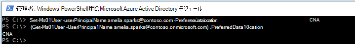

# Microsoft 365 Multi-Geo テナントの構成Microsoft 365 Multi-Geo tenant configuration

Microsoft 365 Multi-Geo 用にテナントを構成する前に、必ず「[Microsoft 365 Multi-Geo のプラン](plan-for-multi-geo.md)」をお読みください。Before you configure your tenant for Microsoft 365 Multi-Geo, be sure you have read [Plan for Microsoft 365 Multi-Geo](plan-for-multi-geo.md). この記事の手順を実行するには、サテライトの場所として有効にする地理的位置のリストと、それらの場所用にプロビジョニングするテスト ユーザーが必要です。To follow the steps in this article, you'll need a list of the geo locations that you want to enable as satellite locations, and the test users that you want to provision for those locations.

## Microsoft 365 プランの複数地域機能をテナントに追加するAdd the Multi-Geo Capabilities in your Microsoft 365 plan to your tenant

Microsoft 365 Multi-Geo を使用するには、_Microsoft 365 の複数地域機能_ プランが必要です。To use Microsoft 365 Multi-Geo, you need the _Multi-Geo Capabilities in Microsoft 365_ plan. アカウント チームと連携して、このプランをテナントに追加してください。Work with your account team to add this plan to your tenant. アカウント チームが適切なライセンス スペシャリストと連絡を取り、テナントを構成します。Your account team will connect you with the appropriate licensing specialist and get your tenant configured.

_Microsoft 365 の複数地域機能_ プランは、ユーザー レベルのサービス プランである点にご注意ください。サテライトの場所でホストするユーザーごとにライセンスが必要です。サテライトの場所にユーザーを追加するたびに、さらにライセンスを追加できます。Note that the _Multi-Geo Capabilities in Microsoft 365_ plan are a user-level service plan. You need a license for each user that you want to host in a satellite location. You can add more licenses over time as you add users in satellite locations.

テナントが _Office 365 の複数地域機能_ プランでプロビジョニングされると、OneDrive と SharePoint 管理センターで [**地理的位置**] タブが使用できるようになります。Once your tenant has been provisioned with the  _Multi-Geo Capabilities in Microsoft 365_ plan, the **Geo locations** tab will become available in the OneDrive and SharePoint admin centers.

## サテライトの場所をテナントに追加するAdd satellite locations to your tenant

データを保存する地理的位置ごとにサテライトの場所を追加する必要があります。You must add a satellite location for each geo location where you want to store data. 以下の表に、使用可能な地理的位置を示します。Available geo locations are shown in the following table:

[!INCLUDE [Microsoft 365 Multi-Geo locations](../includes/microsoft-365-multi-geo-locations.md)]

![SharePoint 管理センターの [地域の場所] ページのスクリーン ショット](../media/sharepoint-multi-geo-admin-center.png)

サテライトの場所を追加する方法To add a satellite location

1. SharePoint 管理センターを開きます。Open the SharePoint admin center.

2. **[地理的位置]** タブを開きます。Navigate to the **Geo locations** tab.

3. **[場所を追加します]** をクリックします。Click **Add location**.

4. 追加する場所を選択して、**[次へ]** をクリックします。Select the location that you want to add, and then click **Next**.

5. 地域の場所で使用するドメインを入力して、**[追加]** をクリックします。Type the domain that you want to use with the geo location, and then click **Add**.

6. **[閉じる]** をクリックします。Click **Close**.

テナントのサイズに応じて、プロビジョニングには最大 72 時間かかることがあります。サテライトの場所のプロビジョニングが完了すると、電子メールの確認通知が送信されます。OneDrive 管理センターの **[地理的位置]** タブにある地図上に、新しい地域の場所が青色で表示されているときには、その地域の場所にユーザーの優先されるデータの場所を設定する作業に進めます。Provisioning may take from a few hours up to 72 hours, depending on the size of your tenant. Once provisioning of a satellite location has completed, you will receive an email confirmation. When the new geo location appears in blue on the map on the **Geo locations** tab in the OneDrive admin center, you can proceed to set users' preferred data location to that geo location. 

> [!IMPORTANT]
> 新しいサテライトの場所は、既定の設定でセットアップされます。そのサテライトの場所は、この設定を使用して、ローカルのコンプライアンス ニーズに適合するように構成できます。Your new satellite location will be set up with default settings. This will allow you to configure that satellite location as appropriate for your local compliance needs.

## ユーザーの優先されるデータの場所の設定Setting users' preferred data location
 

必要なサテライトの場所を使用可能にすると、適切な優先されるデータの場所を使用するように、ユーザー アカウントを更新できます。ユーザーが中央の場所から移動しない場合でも、すべてのユーザーに対して優先されるデータの場所を設定するようにしてください。Once you enable the needed satellite locations, you can update your user accounts to use the appropriate preferred data location. We recommend that you set a preferred data location for every user, even if that user is staying in the central location.

> [!IMPORTANT]
> ユーザーの優先されるデータの場所がサテライトの場所または中央の場所として構成されていない場所に設定されている場合、OneDrive および SharePoint サイトとグループ メールボックスをプロビジョニングするときに、システムは既定で中央の場所に設定します。If a user's preferred data location is set to a location that has not been configured as a satellite location or the central location, the system will default to the central location when provisioning OneDrive and SharePoint sites and Group mailboxes.

> [!TIP]
> 組織の広範囲に Multi-Geo をロール アウトする前に、テスト ユーザーまたは少数のユーザーのグループでのテストを開始するようにしてください。We recommend that you begin validations with a test user or small group of users before rolling out multi-geo to your broader organization.

Azure Active Directory (Azure AD) には、クラウドのみのユーザーと同期ユーザーの 2 種類のユーザー オブジェクトがあります。In Azure Active Directory (Azure AD) there are two types of user objects: cloud only users and synchronized users. ユーザーの種類に適した指示に従ってください。Please follow the appropriate instructions for your type of user.

### Azure AD Connect を使用してユーザーの優先されるデータの場所を同期するSynchronize user's Preferred Data Location using Azure AD Connect 

会社のユーザーがオンプレミスの Active Directory システムから Azure AD に同期されている場合、彼らの PreferredDataLocation を AD に入力し、Azure AD に同期させる必要があります。If your company's users are synchronized from an on-premises Active Directory system to Azure AD, their PreferredDataLocation must be populated in AD and synchronized to Azure AD.

「[Azure Active Directory Connect 同期: Microsoft 365 リソースの優先されるデータの場所を構成する](/azure/active-directory/hybrid/how-to-connect-sync-feature-preferreddatalocation)」のプロセスに従って、オンプレミス Active Directory ドメイン サービス (AD DS) から Azure AD への優先されるデータの場所の同期を構成します。Follow the process in [Azure Active Directory Connect sync: Configure preferred data location for Microsoft 365 resources](/azure/active-directory/hybrid/how-to-connect-sync-feature-preferreddatalocation) to configure Preferred Data Location sync from your on-premises Active Directory Domain Services (AD DS) to Azure AD.

標準のユーザー作成フローの一部として、ユーザーの優先されるデータの場所の設定を含めることをお勧めします。We recommend that you include setting the user's Preferred Data Location as a part of your standard user creation workflow.

> [!IMPORTANT]
> OneDrive がプロビジョニングされていない新規ユーザーの場合、ユーザーが OneDrive for Business にログインする前に、ユーザーの PDL が Azure AD に同期されてから少なくとも 24 時間待ち、変更が反映されるようにします。For new users with no OneDrive provisioned, wait at least 24 hours after a user's PDL is synchronized to Azure AD for the changes to propagate before the user logs in to OneDrive for Business. (ユーザーが OneDrive for Business をプロビジョニングするために、ログインする前に優先されるデータの場所を設定しておくと、ユーザーの新しい OneDrive が正しい場所にプロビジョニングされるようになります。)(Setting the preferred data location before the user logs in to provision their OneDrive for Business ensures that the user's new OneDrive will be provisioned in the correct location.)

### クラウド専用ユーザーの優先されるデータの場所を設定するSetting Preferred Data Location for cloud only users 

社内のユーザーがオンプレミスの Active Directory システムから Azure AD に同期されていない場合、つまり、ユーザーが Microsoft 365 または Azure AD で作成されている場合は、Windows PowerShell 用 Microsoft Azure Active Directory モジュールを使用して PDL を設定する必要があります。If your company's users are not synchronized from an on-premises Active Directory system to Azure AD, meaning they are created in Microsoft 365 or Azure AD, then the PDL must be set using the Microsoft Azure Active Directory Module for Windows PowerShell.

このセクションの手順では、[Windows PowerShell モジュール用 Microsoft Azure Active Directory モジュール](https://www.powershellgallery.com/packages/MSOnline/1.1.166.0)が必要です。The procedures in this section require the [Microsoft Azure Active Directory Module for Windows PowerShell Module](https://www.powershellgallery.com/packages/MSOnline/1.1.166.0). このモジュールをすでにインストールしている場合は、必ず最新バージョンに更新してください。If you already have this module installed, please ensure you update to the latest version.

1.  テナントの一連のグローバル管理者の資格情報を使用して、[接続してサインイン](/powershell/connect-to-microsoft-365-powershell.md#connect-with-the-microsoft-azure-active-directory-module-for-windows-powershell)します。[Connect and sign in](/powershell/connect-to-microsoft-365-powershell.md#connect-with-the-microsoft-azure-active-directory-module-for-windows-powershell) with a set of global administrator credentials for your tenant.

2.  [Set-MsolUser](https://docs.microsoft.com/powershell/msonline/v1/set-msoluser) コマンドレットを使用して、ユーザーごとに優先されるデータの場所を設定します。次に、例を示します。Use the [Set-MsolUser](https://docs.microsoft.com/powershell/msonline/v1/set-msoluser) cmdlet to set the preferred data location for each of your users. For example:

    `Set-MsolUser -userprincipalName Robyn.Buckley@Contoso.com -PreferredDatalocation EUR`

    Get-MsolUser コマンドレットを使用すると、優先されるデータの場所が適切に更新されたことを確認できます。You can check to confirm that the preferred data location was updated properly by using the Get-MsolUser cmdlet. For example:

    `(Get-MsolUser -userprincipalName Robyn.Buckley@Contoso.com).PreferredDatalocation`

標準のユーザー作成フローの一部として、ユーザーの優先されるデータの場所の設定を含めることをお勧めします。We recommend that you include setting the user's Preferred Data Location as a part of your standard user creation workflow.

> [!IMPORTANT]
> OneDrive がプロビジョニングされていない新規ユーザーの場合、ユーザーが OneDrive にログインする前に、ユーザーの PDL が 設定されてから少なくとも 24 時間待ち、変更が反映されるようにします。For new users with no OneDrive provisioned, wait at least 24 hours after a user's PDL is set for the changes to propagate before the user logs in to OneDrive. (ユーザーが OneDrive for Business をプロビジョニングするために、ログインする前に優先されるデータの場所を設定すると、新しい OneDrive が正しい場所にプロビジョニングされるようになります。)(Setting the preferred data location before the user logs in to provision their OneDrive for Business ensures that the user's new OneDrive will be provisioned in the correct location.)

## OneDrive のプロビジョニングと PDL の効果OneDrive Provisioning and the effect of PDL

テナントに ユーザーの OneDrive サイトが既に作成されている場合は、そのユーザーの PDL を設定しても既存の OneDrive は自動的に移動されません。If the user already has a OneDrive site created in the tenant, setting their PDL will not automatically move their existing OneDrive. ユーザーの OneDrive を移動するには [、「OneDrive for Business 地域移動」を参照してください](move-onedrive-between-geo-locations.md)。To move a user's OneDrive, see [OneDrive for Business Geo Move](move-onedrive-between-geo-locations.md).

> [!NOTE]
> PLD が変更され、MailboxRegion がメールボックス データベースの地域の場所コードと一致しなくなった場合、Exchange Online はユーザーのメールボックスを自動的に再配置します。Exchange Online automatically relocates the user's mailbox if the PLD changes and the MailboxRegion no longer matches the Mailbox Database Geo Location code. 詳細については、「複数地域環境での Exchange Online メールボックスの管理 [」を参照してください](https://docs.microsoft.com/microsoft-365/enterprise/administering-exchange-online-multi-geo)。For more information, see [Administering Exchange Online mailboxes in a multi-geo environment](https://docs.microsoft.com/microsoft-365/enterprise/administering-exchange-online-multi-geo).

テナント内に OneDrive サイトを持っていないユーザーの場合、ユーザーの PDL が会社のサテライトの場所のいずれかと一致すれば、ユーザーの OneDrive は PDL 値に基づいてプロビジョニングされます。If the user does not have a OneDrive site within the tenant, OneDrive will be provisioned for them in accordance to their PDL value, assuming the PDL for the user matches one of the company's satellite locations.

## 複数地域検索の構成Configuring Multi-Geo search

複数地域テナントには、検索クエリでテナント内のあらゆる場所からの結果が得られるようになる、集約検索機能が備わります。Your multi-geo tenant will have aggregate search capabilities allowing a search query to return results from anywhere within the tenant.

既定では、それらのエントリ ポイントからの検索は、それぞれの検索インデックスが関連する地域の場所に配置されていたとしても、集約された結果を返します。By default, searches from these entry points will return aggregate results, even though each search index is located within its relevant geo location:

- OneDrive for BusinessOneDrive for Business

- DelveDelve

- SharePoint HomeSharePoint Home

- 検索センターSearch Center

さらに、Multi-Geo 検索機能は、SharePoint 検索 API を使用するカスタムの検索アプリケーション用に構成することもできます。Additionally, multi-geo search capabilities can be configured for your custom search applications that use the SharePoint search API.

手順と制限事項や相違点などについては、「[OneDrive for Business 複数地域の検索の構成](configure-search-for-multi-geo.md)」を参照してください。Please review [Configure Search for OneDrive for Business Multi-Geo](configure-search-for-multi-geo.md) for instructions including any limitations and differences.

## Microsoft 365 Multi-Geo の構成を検証するValidating the Microsoft 365 Multi-Geo configuration

以下は、Microsoft 365 Multi-Geo を会社で広く展開する前に、検証のプランに含めることができる基本的なユース ケースです。Below are some basic use cases you may wish to include in your validation plan before broadly rolling out Microsoft 365 Multi-Geo to your company. これらのテストと会社に関連するその他のユース ケースを完了すると、最初のパイロット グループへのユーザーの追加を開始できます。Once you have completed these tests and any additional use cases that are relevant to your company, you may choose to move on to adding the users in your initial pilot group.

**OneDrive for Business****OneDrive for Business**

Microsoft 365 アプリ起動ツールから OneDrive を選択し、ユーザーの PDL に基づいて、ユーザーの適切な地理的位置に自動的に誘導されることを確認します。Select OneDrive from the Microsoft 365 app launcher and confirm that you are automatically directed to the appropriate geo location for the user, based on the user's PDL. OneDrive for Business により、その場所でプロビジョニングが開始されるはずです。OneDrive for Business should now begin provisioning at that location. プロビジョニングが完了したら、ドキュメントのアップロードやダウンロードを試してください。Once provisioned, try uploading and downloading some documents.

**OneDrive モバイル アプリ****OneDrive Mobile App**

OneDrive モバイル アプリにテスト用アカウントの資格情報でログインします。Log into your OneDrive mobile App with your test account credentials. OneDrive for Business のファイルを表示できることと、それらのファイルをモバイル デバイスから操作できることを確認します。Confirm that you can see your OneDrive for Business files and can interact with them from your mobile device.

**OneDrive 同期クライアント****OneDrive sync client**

ログイン時に、OneDrive 同期クライアントが OneDrive for Business 地域の場所を自動的に検出することを確認します。同期クライアントのダウンロードが必要な場合は、OneDrive ライブラリで **[同期]** をクリックしてください。Confirm that the OneDrive sync client automatically detects your OneDrive for Business geo location upon login. If you need to download the sync client, you can click **Sync** in the OneDrive library.

**Office アプリケーション****Office applications**

Word などの Office アプリケーションからのログインで OneDrive for Business にアクセスできることを確認します。Office アプリケーションを開いて、[OneDrive – <TenantName>] を選択します。Office によって、OneDrive の場所が検出され、開くことができるファイルが表示されます。Confirm that you can access OneDrive for Business by logging in from an Office application, such as Word. Open the Office application and select "OneDrive – <TenantName>". Office will detect your OneDrive location and show you the files that you can open.

**共有****Sharing**

OneDrive ファイルを共有してみます。地域の場所に関係なく、ユーザー選択にすべての SharePoint Online ユーザーが表示されていることを確認します。Try sharing OneDrive files. Confirm that the people picker shows you all your SharePoint online users regardless of their geo location.
