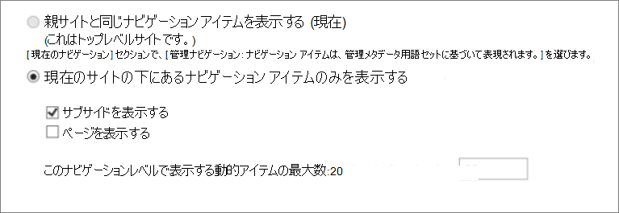
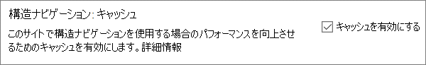
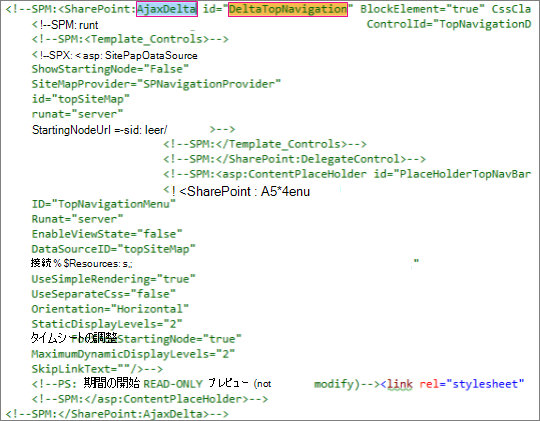

# <a name="navigation-options-for-sharepoint-online"></a>SharePoint Online のナビゲーション オプション

この記事では、SharePoint Publishing が有効化されている SharePoint Online サイトのナビゲーション オプションについて説明します。 ナビゲーションの選択と構成は、SharePoint Online のサイトのパフォーマンスとスケーラビリティに大きく影響します。 SharePoint発行サイト テンプレートは、一元化されたポータルで必要な場合にのみ使用し、発行機能は特定のサイトでのみ有効にする必要があります。また、不適切に使用した場合のパフォーマンスに影響を与える可能性があるため、絶対に必要な場合にのみ使用してください。

>[!NOTE]
>メガ メニュー、カスケード ナビゲーション、ハブ ナビゲーションなどの最新のSharePoint ナビゲーション オプションを使用している場合、この記事はサイトには適用されません。 最新のSharePoint サイト アーキテクチャでは、よりフラット化されたサイト階層とハブ アンド スポーク モデルが活用されています。 これにより、SharePoint発行機能を使用する必要のない多くのシナリオを実現できます。

## <a name="overview-of-navigation-options"></a>ナビゲーション オプションの概要

ナビゲーション プロバイダーの構成はサイト全体のパフォーマンスに大きな影響を与える可能性があるため、SharePoint サイトの要件を満たすように効果的に対応できるナビゲーション プロバイダーと構成を慎重に選択する必要があります。 2 つの既成のナビゲーション プロバイダーの他、ナビゲーションのカスタム実装が提供されています。

サイトの構造ナビゲーション **キャッシュを有効にした場合**、最初のオプションである [**構造ナビゲーション**](#using-structural-navigation-in-sharepoint-online)は、クラシック SharePoint サイトのSharePoint Online で推奨されるナビゲーション オプションです。 このナビゲーション プロバイダーは、現在のサイトの下にナビゲーション項目を表示し、必要に応じて現在のサイトとその兄弟を表示します。 セキュリティ トリミングやサイト構造の列挙などの追加機能が提供されます。 キャッシュが無効になっていると、パフォーマンスとスケーラビリティに悪影響が生じ、調整の対象になる可能性があります。

2 番目のオプションである [**Managed (Metadata) ナビゲーション**](#using-managed-navigation-and-metadata-in-sharepoint-online)は、Managed Metadata 用語セットを使用したナビゲーション項目を表します。 必要でない限り、セキュリティ トリミングを無効にすることをお勧めします。 セキュリティ トリミングは既定によるセキュリティ保護としてこのナビゲーション プロバイダーで有効化されていますが、多くのサイトでは、サイトのすべてのユーザーに対して一貫性のあるナビゲーション要素を提供しているため、セキュリティ トリミングのオーバーヘッドは必要ありません。 推奨されているセキュリティトリミングを無効にする構成にした場合、このナビゲーション プロバイダーではサイト構造を列挙する必要がなく、パフォーマンスへの影響を許容範囲に抑えながら高い拡張性が提供されます。

既成のナビゲーション プロバイダーに加えて、多くのお客様が代替のカスタム ナビゲーション実装を正常に実装しています。 この記事の [「検索ドリブン クライアント側スクリプト」を](#using-search-driven-client-side-scripting) 参照してください。
  
## <a name="pros-and-cons-of-sharepoint-online-navigation-options"></a>SharePoint Online ナビゲーション オプションの長所と短所

次の表は、各オプションの長所と短所をまとめたものです。

|構造ナビゲーション  |管理ナビゲーション  |検索型ナビゲーション  |カスタム ナビゲーション プロバイダー  |
|---------|---------|---------|---------|
|長所:<br/><br/>メンテナンスしやすい<br/>セキュリティ トリミングが行われる<br/>コンテンツが変更されると、24 時間以内に自動的に更新されます<br/>     |長所:<br/><br/>メンテナンスしやすい<br/>|長所:<br/><br/>セキュリティ トリミングが行われる<br/>サイトが追加されると自動的に更新される<br/>読み込み時間が短く、ナビゲーション構造がローカルにキャッシュされている<br/>|長所:<br/><br/>使用可能なオプションの選択肢が広い<br/>キャッシュが正常に使用された場合、高速の読み込み<br/>多くのオプションが、応答性の高いページ デザインで適正に動作する<br/>|
|短所:<br/><br/>**キャッシュが無効になっている場合のパフォーマンスに影響します**<br/>調整の対象<br/>|短所:<br/><br/>サイト構造を反映するように自動的に更新されない<br/>**セキュリティ トリミングが有効になっている場合** 、またはナビゲーション構造が複雑な場合、パフォーマンスに影響します<br/>|短所:<br/><br/>サイトの順序を簡単に変更できない<br/>マスター ページのカスタマイズが必要 (技術的なスキルが必要)<br/>|短所:<br/><br/>カスタム開発が必要<br/>外部データ ソース / 格納されたキャッシュが必要 (例: Azure)<br/>|

サイトに最適なオプションは、サイトの要件と技術的な能力に依存しています。 コンテンツが変更されたときに自動的に更新される簡単に構成できるナビゲーション プロバイダーが必要な場合は、 [キャッシュを有効にした](https://support.office.com/article/structural-navigation-and-performance-f163053f-8eca-4b9c-b973-36b395093b43) 構造ナビゲーションが適しています。

>[!NOTE]
>モダン SharePoint サイトと同じ原則を適用して、サイト構造全体をフラットな非階層構造にすることで、パフォーマンスが向上し、最新のSharePoint サイトへの移行が簡単になります。 つまり、何百ものサイト (サブ web) を含む 1 つのサイト コレクションを持つ代わりに、サブサイト (サブ web) が非常に少ない多くのサイト コレクションを作成することをお勧めします。

## <a name="analyzing-navigation-performance-in-sharepoint-online"></a>SharePoint Online でのナビゲーション パフォーマンスの分析

[SharePoint 用のページ診断ツール](./page-diagnostics-for-spo.md)は、Microsoft Edge ブラウザーと Chrome ブラウザー用のブラウザー拡張機能であり、SharePoint Online モダン ポータルとクラシック発行サイト ページの両方を分析します。 このツールは、SharePoint Online でのみ機能し、SharePoint システム ページでは使用できません。

このツールは、定義済みのルール セットに対してページがどのように実行されるかを示す分析済みページごとにレポートを生成し、テストの結果が基準値から外れたときに詳細情報を表示します。 SharePoint Online の管理者とデザイナーは、このツールを使用してパフォーマンスの問題をトラブルシューティングし、発行前に新しいページが最適化されるようにすることができます。

**SPRequestDuration** は特に、SharePointがページを処理するのに要する時間です。 重いナビゲーション (ナビゲーションにページを含む)、複雑なサイト階層、その他の構成とトポロジのオプションはすべて、時間の長い時間に大きく貢献する可能性があります。

## <a name="using-structural-navigation-in-sharepoint-online"></a>SharePoint Online で構造ナビゲーションを使用する

これは既定で使用される既定のナビゲーションであり、最も簡単なソリューションです。 カスタマイズの必要がなく、非技術者のユーザーでもアイテムの追加、アイテムの非表示、ナビゲーションの管理を [設定] ページから簡単に実行できます。 [キャッシュを有効に](https://support.office.com/article/structural-navigation-and-performance-f163053f-8eca-4b9c-b973-36b395093b43)することをお勧めします。そうしないと、パフォーマンスのトレードオフが高くなります。

### <a name="how-to-implement-structural-navigation-caching"></a>構造ナビゲーション キャッシュを実装する方法

**[サイト 設定** > **Look と** **FeelNavigation** > ] で、グローバル ナビゲーションまたは現在のナビゲーションで構造ナビゲーションが選択されているかどうかを検証できます。 **[ページの表示]** を選択すると、パフォーマンスに悪影響が生じます。



キャッシュは、サイト コレクション レベルとサイト レベルで有効または無効にすることができ、既定では両方に対して有効になっています。 サイト コレクション レベルで有効にするには、[**サイト 設定** > **Site コレクション管理** > **サイト コレクション ナビゲーション**] で、[**キャッシュを有効にする**] チェック ボックスをオンにします。


サイト レベルで有効にするには、[**サイト 設定** > **Navigation**] で、[**キャッシュを有効にする**] チェック ボックスをオンにします。



## <a name="using-managed-navigation-and-metadata-in-sharepoint-online"></a>SharePoint Online で管理ナビゲーションおよび管理されたメタデータを使用する

別の既成のオプションとして管理ナビゲーションがあり、このオプションを使用して構造ナビゲーションの機能のほとんどを再現できます。 管理されたメタデータの構成では、セキュリティ トリミングは有効にも無効にもできます。 構成でセキュリティ トリミングが無効化されている場合、管理ナビゲーションは、一定数のサーバー呼び出しを使用してすべてのナビゲーション リンクを読み込むので、比較的効率的です。 ただし、セキュリティ トリミングを有効にすると、管理ナビゲーションのパフォーマンス上の利点の一部が無効になります。

セキュリティ トリミングを有効にする必要がある場合は、次のことをお勧めします。

- すべてのフレンドリ URL リンクを単純なリンクに更新する
- 必要なセキュリティ トリミング ノードをフレンドリ URL として追加する
- ナビゲーション 項目の数を 100 以下、深さ 3 レベル以下に制限する

多くのサイトではセキュリティ トリミングは必要ありません。これは、サイトのすべてのユーザーのナビゲーション構造が多くの場合共通であるためです。 セキュリティ トリミングが無効になっていて、アクセス権を持たないユーザーもいるナビゲーションにリンクが追加された場合、リンクは表示されますが、アクセスが拒否されたというメッセージが表示されます。 コンテンツへの偶発的なアクセスが発生する危険はありません。

### <a name="how-to-implement-managed-navigation-and-the-results"></a>管理ナビゲーションと結果を実装する方法

マネージド ナビゲーションの詳細については、docs.microsoft.com に関するいくつかの記事があります。 たとえば、「[SharePoint Server での管理ナビゲーションの概要」を参照してください](/sharepoint/administration/overview-of-managed-navigation)。

マネージド ナビゲーションを実装するために、サイトのナビゲーション構造に対応する URL で用語を設定します。 管理ナビゲーションは多くの場合、手動で監督することにより構造ナビゲーションと置き換えられます。 次に例を示します。

)

## <a name="using-search-driven-client-side-scripting"></a>検索型のクライアント側スクリプトを使用する

カスタム ナビゲーション実装の一般的なクラスの 1 つとして、ナビゲーション ノードのローカル キャッシュを格納するクライアント レンダリングによるデザイン パターンがあります。

これらのナビゲーション プロバイダーには、いくつかの大きな利点があります。

- これらのナビゲーション プロバイダーは通常、応答性の高いページ デザインに適しています。
- リソース コストをかけずにレンダリングできるため、拡張性が高く、高性能です (また、タイムアウト後にバックグラウンドでの更新が可能です)。
- これらのナビゲーション プロバイダーは、単純な静的構成からさまざまな動的データ プロバイダーまでを含む、さまざまな方法を使用してナビゲーション データを取得できます。

データ プロバイダーの例として、ナビゲーション ノードの列挙とセキュリティ トリミングの効率的な処理が可能な **検索型ナビゲーション** を使用する方法があります。

**カスタム ナビゲーション プロバイダー** を構築するための一般的なオプションは他にもあります。 カスタム ナビゲーション プロバイダーを構築する方法に関するより詳細なガイダンスついては、「[SharePoint Online ポータル用のナビゲーション ソリューション](/sharepoint/dev/solution-guidance/portal-navigation)」を参照してください。

検索を使用すると、継続的クロールによってバックグラウンドでビルドされたインデックスを活用できます。 検索結果が検索インデックスから取り込まれ、結果はセキュリティ トリミングされます。 通常、セキュリティ トリミングが必要な場合は、既成のナビゲーション プロバイダーより高速です。 構造ナビゲーションで検索を使用すると、特に複雑なサイト構造がある場合は、ページの読み込み時間が大幅に短縮します。 管理ナビゲーションに対するこの方法の主な利点は、セキュリティ トリミングの恩恵を受けられることです。

このアプローチには、カスタム マスター ページの作成、既成のナビゲーション コードのカスタム HTML への置き換えなどが含まれます。 ファイル `seattle.html` のナビゲーション コードを置き換えるには、次の例に示す手順を実行します。 この例では、`seattle.html`ファイルを開き、`id="DeltaTopNavigation"` という要素全体をカスタム HTML コードで置き換えます。

### <a name="example-replace-the-out-of-the-box-navigation-code-in-a-master-page"></a>例: マスター ページの既成のナビゲーション コードを置き換える

1. [サイト設定] ページに移動します。
2. [**マスター ページ**] をクリックして、マスター ページ ギャラリーを開きます。
3. ここから、ライブラリ内を移動してファイル `seattle.master` をダウンロードできます。
4. テキスト エディターでコードを編集し、次のスクリーン ショットにあるコード ブロックを削除します。<br/><br/>
5. タグ `<SharePoint:AjaxDelta id="DeltaTopNavigation">` と `<\SharePoint:AjaxDelta>` の間のコードを削除し、次のスニペットに置き換えます。<br/>

```javascript
<div id="loading">
  <!--Replace with path to loading image.-->
  <div style="background-image: url(''); height: 22px; width: 22px; ">
  </div>
</div>
<!-- Main Content-->
<div id="navContainer" style="display:none">
    <div data-bind="foreach: hierarchy" class="noindex ms-core-listMenu-horizontalBox">
        <a class="dynamic menu-item ms-core-listMenu-item ms-displayInline ms-navedit-linkNode" data-bind="attr: { href: item.Url, title: item.Title }">
            <span class="menu-item-text" data-bind="text: item.Title">
            </span>
        </a>
        <ul id="menu" data-bind="foreach: $data.children" style="padding-left:20px">
            <li class="static dynamic-children level1">
                <a class="static dynamic-children menu-item ms-core-listMenu-item ms-displayInline ms-navedit-linkNode" data-bind="attr: { href: item.Url, title: item.Title }">

                 <!-- ko if: children.length > 0-->
                    <span aria-haspopup="true" class="additional-background ms-navedit-flyoutArrow dynamic-children">
                        <span class="menu-item-text" data-bind="text: item.Title">
                        </span>
                    </span>
                <!-- /ko -->
                <!-- ko if: children.length == 0-->
                    <span aria-haspopup="true" class="ms-navedit-flyoutArrow dynamic-children">
                        <span class="menu-item-text" data-bind="text: item.Title">
                        </span>
                    </span>
                <!-- /ko -->
                </a>

                <!-- ko if: children.length > 0-->
                <ul id="menu"  data-bind="foreach: children;" class="dynamic  level2" >
                    <li class="dynamic level2">
                        <a class="dynamic menu-item ms-core-listMenu-item ms-displayInline  ms-navedit-linkNode" data-bind="attr: { href: item.Url, title: item.Title }">

          <!-- ko if: children.length > 0-->
          <span aria-haspopup="true" class="additional-background ms-navedit-flyoutArrow dynamic-children">
           <span class="menu-item-text" data-bind="text: item.Title">
           </span>
          </span>
           <!-- /ko -->
          <!-- ko if: children.length == 0-->
          <span aria-haspopup="true" class="ms-navedit-flyoutArrow dynamic-children">
           <span class="menu-item-text" data-bind="text: item.Title">
           </span>
          </span>
          <!-- /ko -->
                        </a>
          <!-- ko if: children.length > 0-->
         <ul id="menu" data-bind="foreach: children;" class="dynamic level3" >
          <li class="dynamic level3">
           <a class="dynamic menu-item ms-core-listMenu-item ms-displayInline ms-navedit-linkNode" data-bind="attr: { href: item.Url, title: item.Title }">
            <span class="menu-item-text" data-bind="text: item.Title">
            </span>
           </a>
          </li>
         </ul>
           <!-- /ko -->
                    </li>
                </ul>
                <!-- /ko -->
            </li>
        </ul>
    </div>
</div>
```

<br/>
6. 冒頭の読み込みイメージのアンカー タグの URL を、サイト コレクションの読み込みイメージへのリンクに置き換えます。 変更を加えたら、ファイルの名前を変更し、マスター ページ ギャラリーにアップロードします。 これにより、新しい .master ファイルが生成されます。<br/>
7. この HTML は、JavaScript のコードから返される検索結果によって入力される基本的なマークアップです。 次のスニペットに示すように、コードを編集して var root = "サイト コレクション URL" の値を変更する必要があります。<br/>

```javascript
var root = "https://spperformance.sharepoint.com/sites/NavigationBySearch";
```

<br/>
8. 結果は self.nodes 配列に割り当てられ、linq.js を使用してオブジェクトから階層が構築され、出力が配列 self.hierarchy に割り当てられます。 この配列は、HTML にバインドされているオブジェクトです。 これは、toggleView() 関数でセルフ オブジェクトを ko.applyBindings() 関数に渡すことにより実行されます。<br/>続いて、階層の配列が次の HTML にバインドされます。<br/>

```javascript
<div data-bind="foreach: hierarchy" class="noindex ms-core-listMenu-horizontalBox">
```

サブサイトのドロップダウン メニューを処理するために`mouseenter` および `mouseexit` のイベント ハンドラーがトップレベルのナビゲーションに追加されます。これは、`addEventsToElements()` 関数で実行されます。 

この複雑なナビゲーションの例では、ローカル キャッシュがない新しいページの読み込みにおいて、管理ナビゲーションのアプローチと似た結果を得るため、サーバーで費やした時間がベンチマークの構造ナビゲーションから短縮されたことを示しています。

### <a name="about-the-javascript-file"></a>JavaScript ファイルについて

>[!NOTE]
>カスタム JavaScript を使用している場合は、パブリック CDNが有効になっていて、ファイルがCDN場所にあることを確認します。

JavaScript ファイルの全体は次のとおりです。

```javascript
//Models and Namespaces
var SPOCustom = SPOCustom || {};
SPOCustom.Models = SPOCustom.Models || {}
SPOCustom.Models.NavigationNode = function () {

    this.Url = ko.observable("");
    this.Title = ko.observable("");
    this.Parent = ko.observable("");

};

var root = "https://spperformance.sharepoint.com/sites/NavigationBySearch";
var baseUrl = root + "/_api/search/query?querytext=";
var query = baseUrl + "'contentClass=\"STS_Web\"+path:" + root + "'&trimduplicates=false&rowlimit=300";

var baseRequest = {
    url: "",
    type: ""
};


//Parses a local object from JSON search result.
function getNavigationFromDto(dto) {
    var item = new SPOCustom.Models.NavigationNode();
    if (dto != undefined) {

        var webTemplate = getSearchResultsValue(dto.Cells.results, 'WebTemplate');

        if (webTemplate != "APP") {
            item.Title(getSearchResultsValue(dto.Cells.results, 'Title')); //Key = Title
            item.Url(getSearchResultsValue(dto.Cells.results, 'Path')); //Key = Path
            item.Parent(getSearchResultsValue(dto.Cells.results, 'ParentLink')); //Key = ParentLink
        }

    }
    return item;
}

function getSearchResultsValue(results, key) {

    for (i = 0; i < results.length; i++) {
        if (results[i].Key == key) {
            return results[i].Value;
        }
    }
    return null;
}

//Parse a local object from the serialized cache.
function getNavigationFromCache(dto) {
    var item = new SPOCustom.Models.NavigationNode();

    if (dto != undefined) {

        item.Title(dto.Title);
        item.Url(dto.Url);
        item.Parent(dto.Parent);
    }

    return item;
}

/* create a new OData request for JSON response */
function getRequest(endpoint) {
    var request = baseRequest;
    request.type = "GET";
    request.url = endpoint;
    request.headers = { ACCEPT: "application/json;odata=verbose" };
    return request;
};

/* Navigation Module*/
function NavigationViewModel() {
    "use strict";
    var self = this;
    self.nodes = ko.observableArray([]);
    self.hierarchy = ko.observableArray([]);;
    self.loadNavigatioNodes = function () {
        //Check local storage for cached navigation datasource.
        var fromStorage = localStorage["nodesCache"];
        if (false) {
            var cachedNodes = JSON.parse(localStorage["nodesCache"]);

            if (cachedNodes && timeStamp) {
                //Check for cache expiration. Currently set to 3 hrs.
                var now = new Date();
                var diff = now.getTime() - timeStamp;
                if (Math.round(diff / (1000 * 60 * 60)) < 3) {

                    //return from cache.
                    var cacheResults = [];
                    $.each(cachedNodes, function (i, item) {
                        var nodeitem = getNavigationFromCache(item, true);
                        cacheResults.push(nodeitem);
                    });

                    self.buildHierarchy(cacheResults);
                    self.toggleView();
                    addEventsToElements();
                    return;
                }
            }
        }
        //No cache hit, REST call required.
        self.queryRemoteInterface();
    };

    //Executes a REST call and builds the navigation hierarchy.
    self.queryRemoteInterface = function () {
        var oDataRequest = getRequest(query);
        $.ajax(oDataRequest).done(function (data) {
            var results = [];
            $.each(data.d.query.PrimaryQueryResult.RelevantResults.Table.Rows.results, function (i, item) {

                if (i == 0) {
                    //Add root element.
                    var rootItem = new SPOCustom.Models.NavigationNode();
                    rootItem.Title("Root");
                    rootItem.Url(root);
                    rootItem.Parent(null);
                    results.push(rootItem);
                }
                var navItem = getNavigationFromDto(item);
                results.push(navItem);
            });
            //Add to local cache
            localStorage["nodesCache"] = ko.toJSON(results);

            localStorage["nodesCachedAt"] = new Date().getTime();
            self.nodes(results);
            if (self.nodes().length > 0) {
                var unsortedArray = self.nodes();
                var sortedArray = unsortedArray.sort(self.sortObjectsInArray);

                self.buildHierarchy(sortedArray);
                self.toggleView();
                addEventsToElements();
            }
        }).fail(function () {
            //Handle error here!!
            $("#loading").hide();
            $("#error").show();
        });
    };
    self.toggleView = function () {
        var navContainer = document.getElementById("navContainer");
        ko.applyBindings(self, navContainer);
        $("#loading").hide();
        $("#navContainer").show();

    };
    //Uses linq.js to build the navigation tree.
    self.buildHierarchy = function (enumerable) {
        self.hierarchy(Enumerable.From(enumerable).ByHierarchy(function (d) {
            return d.Parent() == null;
        }, function (parent, child) {
            if (parent.Url() == null || child.Parent() == null)
                return false;
            return parent.Url().toUpperCase() == child.Parent().toUpperCase();
        }).ToArray());

        self.sortChildren(self.hierarchy()[0]);
    };


    self.sortChildren = function (parent) {

        // sjip processing if no children
        if (!parent || !parent.children || parent.children.length === 0) {
            return;
        }

        parent.children = parent.children.sort(self.sortObjectsInArray2);

        for (var i = 0; i < parent.children.length; i++) {
            var elem = parent.children[i];

            if (elem.children && elem.children.length > 0) {
                self.sortChildren(elem);
            }
        }
    };

    // ByHierarchy method breaks the sorting in chrome and firefox
    // we need to resort  as ascending
    self.sortObjectsInArray2 = function (a, b) {
        if (a.item.Title() > b.item.Title())
            return 1;
        if (a.item.Title() < b.item.Title())
            return -1;
        return 0;
    };


    self.sortObjectsInArray = function (a, b) {
        if (a.Title() > b.Title())
            return -1;
        if (a.Title() < b.Title())
            return 1;
        return 0;
    }
}

//Loads the navigation on load and binds the event handlers for mouse interaction.
function InitCustomNav() {
    var viewModel = new NavigationViewModel();
    viewModel.loadNavigatioNodes();
}

function addEventsToElements() {
    //events.
      $("li.level1").mouseover(function () {
          var position = $(this).position();
          $(this).find("ul.level2").css({ width: 100, left: position.left + 10, top: 50 });
      })
   .mouseout(function () {
     $(this).find("ul.level2").css({  left: -99999, top: 0 });
   
    });
   
     $("li.level2").mouseover(function () {
          var position = $(this).position();
          console.log(JSON.stringify(position));
          $(this).find("ul.level3").css({ width: 100, left: position.left + 95, top:  position.top});
      })
   .mouseout(function () {
     $(this).find("ul.level3").css({  left: -99999, top: 0 });
    });
} _spBodyOnLoadFunctionNames.push("InitCustomNav");

```

上記の `jQuery $(document).ready` 関数のコードの概要を説明するために `viewModel object` が作成され、次にそのオブジェクトに対する `loadNavigationNodes()` 関数が呼び出されています。 この関数は、クライアント ブラウザーの HTML5 ローカル ストレージに格納されている以前に作成されたナビゲーション階層を読み込むか、`queryRemoteInterface()` 関数を呼び出します。

`QueryRemoteInterface()` は、スクリプトの前の方で定義されているクエリ パラメーターを使用する `getRequest()` 関数を使用して要求を作成し、次にサーバーからのデータを返します。 このデータは基本的に、さまざまなプロパティを持つデータ転送オブジェクトとして表されるサイト コレクション内のすべてのサイトの配列です。

その後、このデータは、解析されて既に定義されている `SPO.Models.NavigationNode` オブジェクトになります。このオブジェクトは、`Knockout.js` を使用して観測可能なプロパティを作成します。このプロパティは、上で定義した HTML に値をバインディングするデータによって使用されます。

オブジェクトは結果の配列に格納されます。 この配列は、Knockout によって解析されて JSON になり、将来ページを読み込む際のパフォーマンス向上のため、ローカル ブラウザー ストレージに格納されます。

### <a name="benefits-of-this-approach"></a>このアプローチの利点

[このアプローチ](#example-replace-the-out-of-the-box-navigation-code-in-a-master-page)の主な利点の 1 つは、ナビゲーションが、HTML5 のローカルの記憶域を使用して、ユーザーによる次回のページの読み込みのため、ローカルに格納されることです。 構造ナビゲーション用に検索 API を使用することで、パフォーマンスが大きく向上します。ただし、この機能の実行とカスタマイズには技術的な能力が必要になります。

[実装の例](#example-replace-the-out-of-the-box-navigation-code-in-a-master-page)では、サイトは既成の構造ナビゲーションと同じ順序 (アルファベット順) に並べられています。 これとは異なる順序を使用する場合は、開発とメンテナンスがより複雑になります。 また、このアプローチでは、サポートされているマスター ページから逸脱する必要があります。 カスタム マスター ページの管理が行われない場合、サイトは Microsoft がマスター ページに対して加える更新と改善を利用できません。

[上記のコード](#about-the-javascript-file)には次のような依存関係があります。

- jQuery - https://jquery.com/
- KnockoutJS - https://knockoutjs.com/
- Linq.js - https://linqjs.codeplex.com/、または github.com/neuecc/linq.js

LinqJS の現在のバージョンには、上記のコードで使用されている ByHierarchy メソッドが含まれておらず、ナビゲーション コードが機能しなくなります。 これを解決するには、Linq.js ファイルの `Flatten: function ()` の行の前に次のメソッドを追加します。

```javascript
ByHierarchy: function(firstLevel, connectBy, orderBy, ascending, parent) {
     ascending = ascending == undefined ? true : ascending;
     var orderMethod = ascending == true ? 'OrderBy' : 'OrderByDescending';
     var source = this;
     firstLevel = Utils.CreateLambda(firstLevel);
     connectBy = Utils.CreateLambda(connectBy);
     orderBy = Utils.CreateLambda(orderBy);

     //Initiate or increase level
     var level = parent === undefined ? 1 : parent.level + 1;

    return new Enumerable(function() {
         var enumerator;
         var index = 0;

        var createLevel = function() {
                 var obj = {
                     item: enumerator.Current(),
                     level : level
                 };
                 obj.children = Enumerable.From(source).ByHierarchy(firstLevel, connectBy, orderBy, ascending, obj);
                 if (orderBy !== undefined) {
                     obj.children = obj.children[orderMethod](function(d) {
                         return orderBy(d.item); //unwrap the actual item for sort to work
                     });
                 }
                 obj.children = obj.children.ToArray();
                 Enumerable.From(obj.children).ForEach(function(child) {
                     child.getParent = function() {
                         return obj;
                     };
                 });
                 return obj;
             };

        return new IEnumerator(

        function() {
             enumerator = source.GetEnumerator();
         }, function() {
             while (enumerator.MoveNext()) {
                 var returnArr;
                 if (!parent) {
                     if (firstLevel(enumerator.Current(), index++)) {
                         return this.Yield(createLevel());
                     }

                } else {
                     if (connectBy(parent.item, enumerator.Current(), index++)) {
                         return this.Yield(createLevel());
                     }
                 }
             }
             return false;
         }, function() {
             Utils.Dispose(enumerator);
         })
     });
 },

```
  
## <a name="related-topics"></a>関連項目

[SharePoint Server の管理ナビゲーションの概要](/sharepoint/administration/overview-of-managed-navigation)

[構造ナビゲーション のキャッシュとパフォーマンス](https://support.office.com/article/structural-navigation-and-performance-f163053f-8eca-4b9c-b973-36b395093b43)