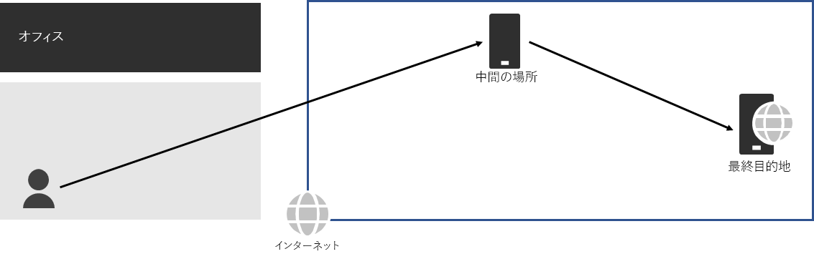
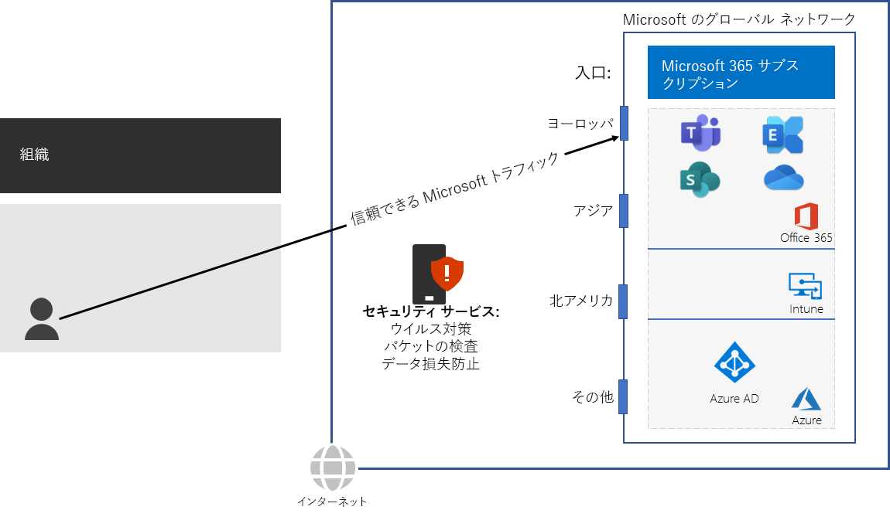

# 手順 3: ネットワーク ヘアピンを回避するStep 3: Avoid network hairpins

*この手順は必須であり、Microsoft 365 Enterprise のバージョン E3 および E5 の両方に適用されます。**This step is required and applies to both the E3 and E5 versions of Microsoft 365 Enterprise*

[ネットワーク ヘアピン](https://docs.microsoft.com/office365/enterprise/office-365-network-connectivity-principles#BKMK_P3)は、宛先に向けられたトラフィックが最初にオンプレミス セキュリティ スタック、クラウド アクセス ブローカー、クラウドベースの Web ゲートウェイなどの別の中間場所に向けられたときに発生します。A [network hairpin](https://docs.microsoft.com/office365/enterprise/office-365-network-connectivity-principles#BKMK_P3) happens when traffic bound for a destination is first directed to another intermediate location, such as an on-premises security stack, cloud access broker, or cloud-based web gateway. 次に例を示します。Here is an example.

ネットワーク ヘアピンは、ネットワーク サービス プロバイダーが原因でインターネット上のルーティングが不十分な場合にも発生する可能性があります。A network hairpin could also be caused by poor routing on the Internet due to network service providers. 

ヘアピンは待機時間を追加し、潜在的にトラフィックを地理的に離れた場所にリダイレクトできます。A hairpin adds latency and can potentially redirect traffic to a geographically distant location.

Microsoft 365 のクラウドベース サービスに対するトラフィックのパフォーマンスを最適化するには、ローカルのインターネット接続を提供する ISP と、その場所と近接した Microsoft のグローバル ネットワークの間に直接のピアリング関係があるかを確認します。そのような接続では、ヘアピンは生じません。To optimize performance for traffic to Microsoft 365 cloud-based services, check whether the ISP providing the local Internet connection has a direct peering relationship with the Microsoft Global Network in close proximity to that location. These connections do not have hairpins.

Microsoft 365 のトラフィックにクラウドベースのネットワークやセキュリティ サービスを使用している場合は、ヘアピンの影響を評価し、パフォーマンスに与える影響を理解する必要があります。次の点を確認します。If you use cloud-based network or security services for your Microsoft 365 traffic, ensure that the hairpinning effect is evaluated and its impact on performance is understood. Examine the following:

- 支店や Microsoft グローバル ネットワークのピアリング ポイントとの関係においてトラフィックの転送経路となるサービス プロバイダーの数および場所。The number and locations of your service providers through which the traffic is forwarded in relationship to your branch offices and Microsoft Global Network peering points 
- サービス プロバイダーと ISP や Microsoft とのネットワーク ピアリング関係の品質。The quality of the network peering relationship of the service provider with your ISP and Microsoft 
- サービス プロバイダーのインフラストラクチャ内で生じるバックホーリングがパフォーマンスに与える影響。The performance impact of backhauling in the service provider infrastructure

可能であれば、インターネット トラフィックを処理するサード パーティのクラウドやクラウドベース ネットワーク セキュリティ ベンダーを介したプロキシ処理やトンネリング処理を行うのではなく、信頼済みの Microsoft 365 トラフィックを直接送信するようにエッジ ルーターを構成します。Whenever possible, configure your edge routers to send trusted Microsoft 365 traffic directly, instead of proxying or tunneling through a third-party cloud or cloud-based network security vendor that processes your Internet traffic. 

中間チェックポイントとして、この手順の[終了条件](networking-exit-criteria.md#crit-networking-step3)を確認できます。As an interim checkpoint, you can see the [exit criteria](networking-exit-criteria.md#crit-networking-step3) for this step.

## 次の手順Next step

|||
|:-------|:-----|
||[トラフィック バイパスを構成するConfigure traffic bypass](networking-configure-proxies-firewalls.md)|
