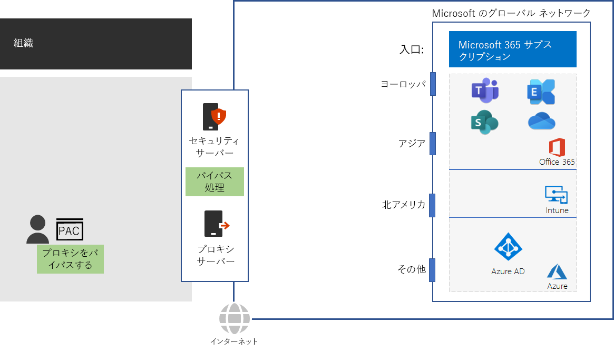

# 手順 4: トラフィック バイパスを構成するStep 4: Configure traffic bypass

*この手順は省略可能で、Microsoft 365 Enterprise のバージョン E3 および E5 の両方に適用されます**This step is optional and applies to both the E3 and E5 versions of Microsoft 365 Enterprise*

一般的なインターネット トラフィックにはリスクがあるため、標準的な組織のネットワークでは、プロキシ サーバー、SSL 中断/検査、パケット検査デバイス、およびデータ損失防止システムのようなエッジ デバイスを使用して、セキュリティを強化します。Because general Internet traffic can be risky, typical organization networks enforce security with edge devices such as proxy servers, SSL Break and Inspect, packet inspection devices, and data loss prevention systems. ネットワーク傍受デバイスに関する問題については、「[Office 365 トラフィックにサードパーティのネットワーク デバイスまたはソリューションを使用する](https://support.microsoft.com/help/2690045/using-third-party-network-devices-or-solutions-with-office-365)」を参照してください。Read about some of the issues with network interception devices at [Using third-party network devices or solutions on Office 365 traffic](https://support.microsoft.com/help/2690045/using-third-party-network-devices-or-solutions-with-office-365).

ただし、Microsoft 365 のクラウドベース サービスで使用する DNS ドメイン名と IP アドレスはよく知られている上に、トラフィックとサービスは多くのセキュリティ機能で保護されています。この種のセキュリティと保護は既に適用されているので、エッジ デバイスで同じことを行う必要はありません。Microsoft 365 のトラフィックが、中間地点や重複するセキュリティ処理を経由する設定では、パフォーマンスが大幅に低下します。However, the DNS domain names and IP addresses used by Microsoft 365 cloud-based services are well known. Additionally, the traffic and services themselves are protected with many security features. Because this security and protection is already in place, your edge devices don’t need to duplicate it. Intermediate destinations and duplicate security processing for Microsoft 365 traffic can dramatically decrease performance.

中間地点や重複するセキュリティ処理を排除する最初の手順として、Microsoft 365 のトラフィックを識別します。Microsoft では、次の種類の DNS ドメイン名と IP アドレス範囲 (エンドポイントと呼ばれる) を定義しています。The first step in eliminating intermediate destinations and duplicate security processing is to identify Microsoft 365 traffic. Microsoft has defined the following types of DNS domain names and IP address ranges, known as endpoints:

- **最適化**: すべての Office 365 サービスへの接続に必須で、Microsoft 365 の帯域幅、接続、データ量の 75% 以上に相当します。**Optimize** - Required for connectivity to every Office 365 service and represent over 75% of Microsoft 365 bandwidth, connections, and volume of data. これらのエンドポイントは、ネットワーク パフォーマンス、待機時間、可用性の影響を最も受けやすい Microsoft 365 シナリオに該当します。These endpoints represent Microsoft 365 scenarios that are the most sensitive to network performance, latency, and availability.
- **許可**: 特定の Microsoft 365 サービスや機能への接続に必須ですが、ネットワーク パフォーマンスや待機時間の影響は、最適化カテゴリのエンドポイントほど大きくありません。**Allow** - Required for connectivity to specific Microsoft 365 services and features but are not as sensitive to network performance and latency as those in the Optimize category.
 - **既定**: 最適化を必要としない Microsoft 365 サービスや依存関係を表します。**Default** - Represent Microsoft 365 services and dependencies that do not require any optimization. 標準カテゴリのエンドポイントは、通常のインターネット トラフィックとして扱うことができます。You can treat Default category endpoints as normal Internet traffic.

DNS ドメイン名と IP アドレスの範囲については、「[https://aka.ms/o365endpoints](https://aka.ms/o365endpoints)」を参照してください。You can find the DNS domain names and IP address ranges at [https://aka.ms/o365endpoints](https://aka.ms/o365endpoints).

Microsoft では、次の方法を推奨しています。Microsoft recommends that you:

- オンプレミスのコンピューターのインターネット ブラウザーで、プロキシ自動構成 (PAC) スクリプトを使用し、Microsoft 365 クラウドベース サービスの DNS ドメイン名用のプロキシ サーバーをバイパスします。Use Proxy Automatic Configuration (PAC) scripts on the Internet browsers of your on-premises computers to bypass your proxy servers for the DNS domain names of Microsoft 365 cloud-based services. 最新の Microsoft 365 PAC スクリプトについては、[Get-Pacfile の PowerShell スクリプト](https://docs.microsoft.com/office365/enterprise/managing-office-365-endpoints#use-a-pac-file-for-direct-routing-of-vital-office-365-traffic) を参照してください。For the latest Microsoft 365 PAC script, see the [Get-Pacfile PowerShell script](https://docs.microsoft.com/office365/enterprise/managing-office-365-endpoints#use-a-pac-file-for-direct-routing-of-vital-office-365-traffic).

- エッジ デバイスを分析して重複する処理を特定したら、それらのエッジ デバイスが "最適化" および "許可" エンドポイントにトラフィックを処理せずに転送するように構成します。これは、トラフィック バイパスと呼ばれます。Analyze your edge devices to determine the duplicate processing and then configure them to forward traffic to Optimize and Allow endpoints without processing. This is known as traffic bypass. 

ネットワーク インフラストラクチャでのそれらの推奨事項は次の通りです。Here are these recommendations in your network infrastructure.

エッジ デバイスには、ファイアウォール、SSL 中断/検査、パケット検査デバイス、およびデータ損失防止システムが含まれます。Edge devices include firewalls, SSL Break and Inspect, packet inspection devices, and data loss prevention systems. エッジ デバイスの構成を構成したり更新したりするには、スクリプトまたは REST 呼び出しを使用して、Office 365 エンドポイントの Web サービスからエンドポイントの構造化リストを利用します。To configure and update the configurations of edge devices, you can use a script or a REST call to consume a structured list of endpoints from the Office 365 Endpoints web service. 詳細については、「[Office 365 IP アドレスと URL の Web サービス](https://docs.microsoft.com/office365/enterprise/office-365-ip-web-service)」を参照してください。For more information, see [Office 365 IP Address and URL Web service](https://docs.microsoft.com/office365/enterprise/office-365-ip-web-service).

なお、バイパスするのは、Microsoft 365 で "最適化" および "許可" カテゴリに含まれるエンドポイントに対するトラフィックのための通常のプロキシとネットワーク セキュリティ処理のみです。他のすべての一般的なインターネット トラフィックは、プロキシ処理され、既存のネットワーク セキュリティ処理の対象になります。Note that you are only bypassing normal proxy and network security processing for traffic to Microsoft 365 Optimize and Allow categories endpoints. All other general Internet traffic will be proxied and be subject to your existing network security processing.

## VPN 接続を使用するリモート ワーカーのためにトラフィックを最適化するOptimizing traffic for remote workers that use VPN connections

リモート ワーカーが組織のイントラネット上のリソースにアクセスするには、一般的に仮想プライベート ネットワーク (VPN) 接続を使用します。Virtual private network (VPN) connections are commonly used by remote workers to access resources on an organization intranet. 従来の VPN 接続では、インターネット トラフィックを含むすべてのトラフィックが組織のイントラネットにルーティングされます。A conventional VPN connection routes ALL traffic, including Internet traffic, to the organization intranet. インターネット トラフィックは、組織のエッジ ネットワークとパケット処理デバイスにルーティングされます。The Internet traffic gets routed to the organization's edge network and packet processing devices. このトラフィックの移動と処理には遅延が発生しやすく、遅延によってパフォーマンスが大幅に低下し、リモート ワークの生産性に影響する可能性があります。This traffic is subject to travel and processing delays that can dramatically decrease performance and impact the productivity of your remote workers. 

スプリット トンネリングは、VPN 接続でトラフィックをイントラネットに送信するのではなく、指定したトラフィックをインターネット経由でルーティングする VPN 接続の機能です。Split tunneling is the capability of a VPN connection to route specified traffic over the Internet rather than sending it over the VPN connection to your intranet. リモート ワーカーが Teams、SharePoint Online、Exchange Online などの極めて重要な Microsoft 365 サービスに最適なパフォーマンスでアクセスできるようにするには、トラフィックを最適化カテゴリの Office 365 エンドポイントにインターネット経由で直接送信するように、スプリット トンネリング VPN 接続を構成します。For the best performance for remote workers to critical Microsoft 365 services such as Teams, SharePoint Online, and Exchange Online, configure your split tunneling VPN connections to send traffic to Optimize category Office 365 endpoints directly over the Internet. 

詳細については、[VPN スプリット トンネリングを使用してリモート ユーザーの Office 365 の接続を最適化する](https://docs.microsoft.com/office365/enterprise/office-365-vpn-split-tunnel)をご覧ください。For detailed information, see [Optimize Office 365 connectivity for remote users using VPN split tunnelling](https://docs.microsoft.com/office365/enterprise/office-365-vpn-split-tunnel).

中間チェックポイントとして、この手順の[終了条件](networking-exit-criteria.md#crit-networking-step4)を確認できます。As an interim checkpoint, you can see the [exit criteria](networking-exit-criteria.md#crit-networking-step4) for this step.

## 次の手順Next step

|||
|:-------|:-----|
||[クライアントと Office 365 サービスのパフォーマンスを最適化するOptimize client and Office 365 service performance](networking-optimize-tcp-performance.md) |

