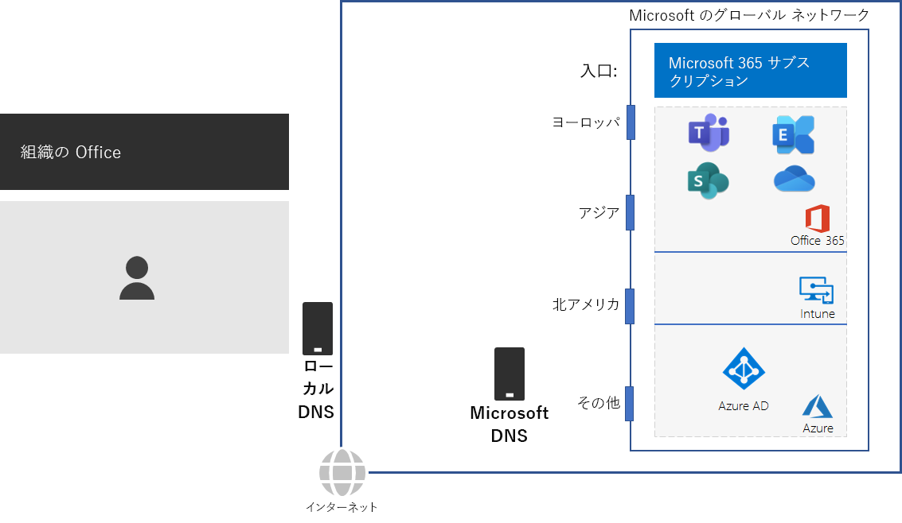
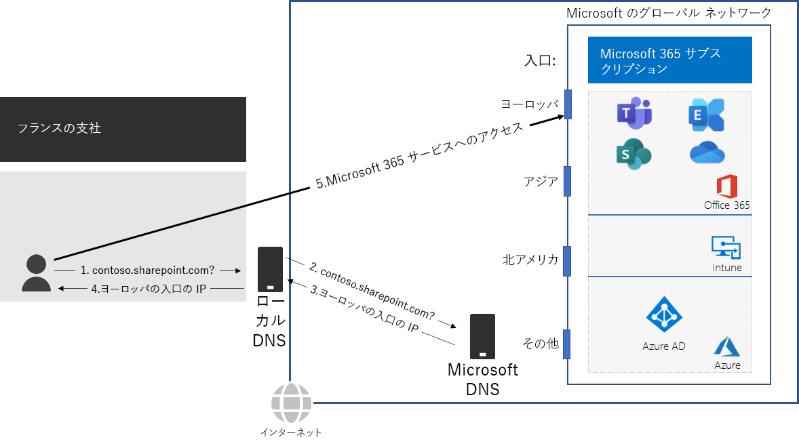

# 手順 2: オフィスごとにローカルのインターネット接続を構成するStep 2: Configure local Internet connections for each office

*この手順は必須であり、Microsoft 365 Enterprise のバージョン E3 および E5 の両方に適用されます。**This step is required and applies to both the E3 and E5 versions of Microsoft 365 Enterprise*

手順 2 では、オフィスごとにローカルのインターネット接続を構成し、ローカルの DNS サーバーを使用していることを確認します。どちらも、接続待機時間を削減し、オンプレミスのクライアント コンピューターが Microsoft 365 クラウドベース サービスの最寄りのエントリ ポイントに確実に接続するために必要な要素です。In Step 2, you ensure that each of your offices have local Internet connections and use local DNS servers. Both of these elements are required to reduce connection latency and ensure that on-premises client computers make connections to the nearest point of entry to Microsoft 365 cloud-based services.

大規模な組織の従来のネットワークの場合、インターネット トラフィックは、ネットワーク バックボーンを横断して中央インターネット接続に到達します。In traditional networks for large organizations, Internet traffic travels across the network backbone to a central Internet connection. グローバルに分散した、Office 365 や Microsoft 365 の Intune 製品を含む、サービスとしてのソフトウェア (SaaS) インフラストラクチャの場合、この方法ではパフォーマンスの最適化がうまくいきません。This does not work well for optimizing performance to a globally distributed Software-as-a-Service (SaaS) infrastructure, which includes the Office 365 and Intune products in Microsoft 365.

Microsoft のグローバル ネットワークには、地理的に分散された場所を用いた高可用性でスケーラブルなネットワーク エッジとなる *分散サービス フロント ドア* インフラストラクチャが含まれます。The Microsoft Global Network includes a *Distributed Service Front Door* infrastructure, a highly available and scalable network edge with geographically distributed locations. それは、フロント ドア サーバーでエンド ユーザー接続を終了させ、Microsoft のグローバル ネットワーク内でエンド ユーザー トラフィックを効率的にルーティングさせます。It terminates end user connections at a front door server and efficiently routes end user traffic within the Microsoft Global Network.

最高のパフォーマンスを目指す場合、オンプレミスのクライアントは、ネットワーク バックボーン全体や組織の中央インターネット接続に最も近いフロント ドアにトラフィックを送信するのではなく、地理的に最も近い場所のフロント ドアにアクセスする必要があります。For the best performance, on-premises clients should access a front door location that is geographically closest to them, rather than sending the traffic over a network backbone and to the front door that is closest to the organization’s central Internet connection.

次に例を示します。Here’s an example.

パリ支社のユーザーが SharePoint Online サイトにアクセスする場合:When a user in the Paris branch office wants to access a SharePoint Online site:

1. Contoso.sharepoint.com など、名前解決のために DNS クエリを送信します。It sends a DNS query to resolve a name, such as contoso.sharepoint.com. 
2. ISP によって提供される DNS サーバーでは、そのクエリを Microsoft DNS サーバーに転送します。The DNS server provided by the ISP forwards that query to a Microsoft DNS server.
3. Microsoft の DNS サーバーでは、転送された DNS クエリのソース IP アドレスからそのアドレスが割り当てられている世界の地域を特定します。Microsoft’s DNS servers match the source IP address of the forwarded DNS query to the region of the world assigned that address. Microsoft DNS サーバーでは、ヨーロッパで最も近い Microsoft ネットワーク フロント ドアの IP アドレスに応答します。The Microsoft DNS server responds with the IP address of the nearest Microsoft Network front door in Europe.
4. ISP の DNS サーバーでは、その IP アドレスをユーザーに送信します。The ISP DNS server sends that IP address to the user.
5. ユーザーは、ヨーロッパのフロント ドアを通過して SharePoint サーバーへの接続を開始します。The user initiates a connection to the SharePoint server through the Europe front door.

地理的に最も近いフロント ドアへとクライアント要求を方向づけるために、Microsoft の DNS サーバーでは、クライアントの最初の接続要求に対応した DNS クエリを使用します。To direct a client request to the geographically nearest front door, Microsoft’s DNS servers use the DNS queries corresponding the client’s initial connection request. そのため、次のようにしてネットワーク遅延を最小化します。Therefore, for the lowest network latency:

- 組織のすべてのオフィスに、[最適化](https://docs.microsoft.com/office365/enterprise/office-365-network-connectivity-principles#new-office-365-endpoint-categories)カテゴリのネットワーク トラフィック用のローカル インターネット接続が用意されている。All offices of your organization should have local Internet connections for [Optimize](https://docs.microsoft.com/office365/enterprise/office-365-network-connectivity-principles#new-office-365-endpoint-categories) category network traffic.
- 各ローカル インターネット接続で、その地点からの送信インターネット トラフィックに、地理的にローカルな DNS サーバーを使用している。Each local Internet connection should be using a regionally local DNS server for outbound Internet traffic from that location.

詳細については、「[ネットワーク接続のローカルの出口を提供する](https://docs.microsoft.com/office365/enterprise/office-365-network-connectivity-principles#egress-network-connections-locally)」を参照してください。For more information, see [Egress network connections locally](https://docs.microsoft.com/office365/enterprise/office-365-network-connectivity-principles#egress-network-connections-locally). 

Microsoft のグローバル ネットワークのエントリ ポイントまでの距離と、組織のネットワークが ISP に接続するポイントまでの距離をテストするには、[Office 365 ネットワーク オンボードツール](https://connectivity.office.com/)を使用します。To test how close you are to an entry point for Microsoft’s global network and how close you are to the point where your organization network connects to your ISP, use the [Office 365 Network Onboarding tool](https://connectivity.office.com/).

中間チェックポイントとして、この手順の[終了条件](networking-exit-criteria.md#crit-networking-step2)を確認できます。As an interim checkpoint, you can see the [exit criteria](networking-exit-criteria.md#crit-networking-step2) for this step.

## 次の手順Next step

|||
|:-------|:-----|
||[ネットワーク ヘアピンを回避するAvoid network hairpins](networking-avoid-network-hairpins.md)|
