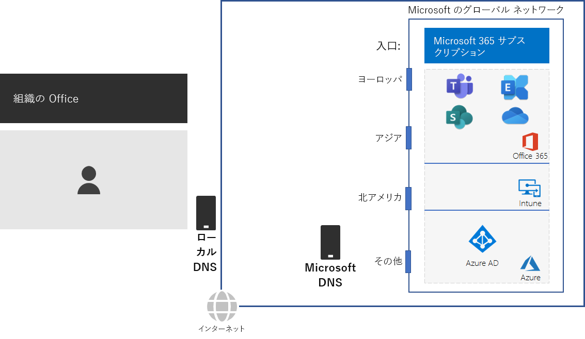
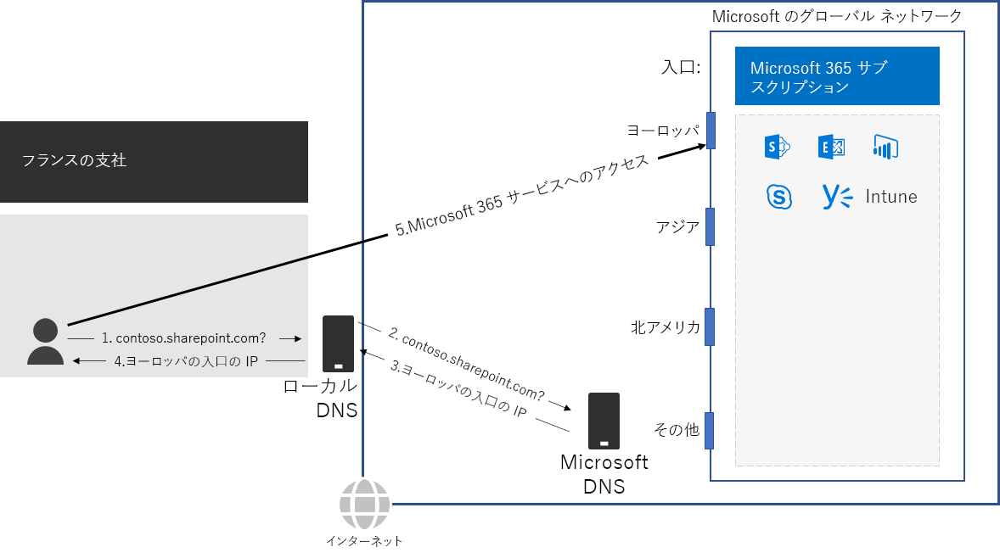

# 手順 2: オフィスごとにローカルのインターネット接続を構成する

*この手順は必須であり、Microsoft 365 Enterprise のバージョン E3 および E5 の両方に適用されます。*

手順 2 では、オフィスごとにローカルのインターネット接続を構成し、ローカルの DNS サーバーを使用していることを確認します。どちらも、接続待機時間を削減し、オンプレミスのクライアント コンピューターが Microsoft 365 クラウドベース サービスの最寄りのエントリ ポイントに確実に接続するために必要な要素です。

大規模な組織の従来のネットワークの場合、インターネット トラフィックは、ネットワーク バックボーンを横断して中央インターネット接続に到達します。 グローバルに分散した、Office 365 や Microsoft 365 の Intune 製品を含む、サービスとしてのソフトウェア (SaaS) インフラストラクチャの場合、この方法ではパフォーマンスの最適化がうまくいきません。

Microsoft のグローバル ネットワークには、地理的に分散された場所を用いた高可用性でスケーラブルなネットワーク エッジとなる *分散サービス フロント ドア* インフラストラクチャが含まれます。 それは、フロント ドア サーバーでエンド ユーザー接続を終了させ、Microsoft のグローバル ネットワーク内でエンド ユーザー トラフィックを効率的にルーティングさせます。

最高のパフォーマンスを目指す場合、オンプレミスのクライアントは、ネットワーク バックボーン全体や組織の中央インターネット接続に最も近いフロント ドアにトラフィックを送信するのではなく、地理的に最も近い場所のフロント ドアにアクセスする必要があります。

次に例を示します。

パリ支社のユーザーが SharePoint Online サイトにアクセスする場合:

1. Contoso.sharepoint.com など、名前解決のために DNS クエリを送信します。 
2. ISP によって提供される DNS サーバーでは、そのクエリを Microsoft DNS サーバーに転送します。
3. Microsoft の DNS サーバーでは、転送された DNS クエリのソース IP アドレスからそのアドレスが割り当てられている世界の地域を特定します。 Microsoft DNS サーバーでは、ヨーロッパで最も近い Microsoft ネットワーク フロント ドアの IP アドレスに応答します。
4. ISP の DNS サーバーでは、その IP アドレスをユーザーに送信します。
5. ユーザーは、ヨーロッパのフロント ドアを通過して SharePoint サーバーへの接続を開始します。

地理的に最も近いフロント ドアへとクライアント要求を方向づけるために、Microsoft の DNS サーバーでは、クライアントの最初の接続要求に対応した DNS クエリを使用します。 そのため、次のようにしてネットワーク遅延を最小化します。

- 組織のすべてのオフィスに、[最適化](https://docs.microsoft.com/office365/enterprise/office-365-network-connectivity-principles#new-office-365-endpoint-categories)カテゴリのネットワーク トラフィック用のローカル インターネット接続が用意されている。
- 各ローカル インターネット接続で、その地点からの送信インターネット トラフィックに、地理的にローカルな DNS サーバーを使用している。

詳細については、「[ネットワーク接続のローカルの出口を提供する](https://docs.microsoft.com/office365/enterprise/office-365-network-connectivity-principles#egress-network-connections-locally)」を参照してください。 

中間チェックポイントとして、この手順の[終了条件](networking-exit-criteria.md#crit-networking-step2)を確認できます。

## 次の手順

|||
|:-------|:-----|
||[ネットワーク ヘアピンを回避する](networking-avoid-network-hairpins.md)|
