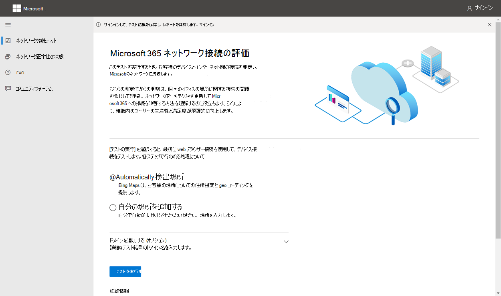
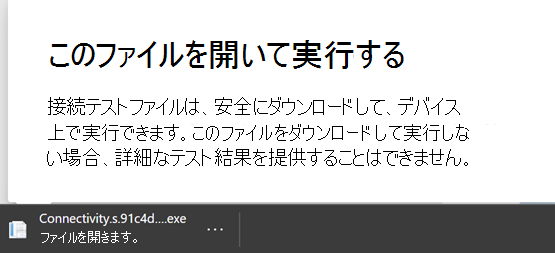
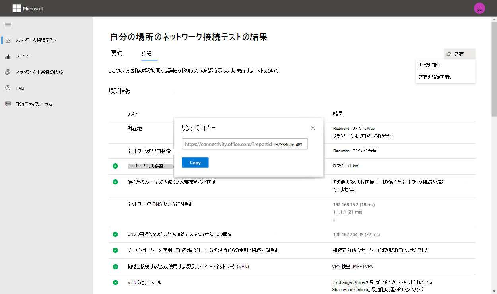
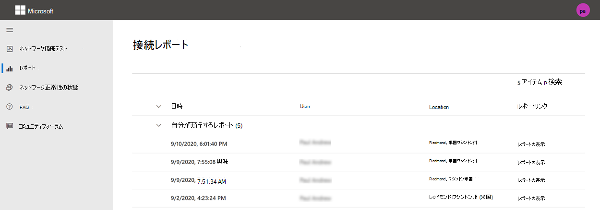
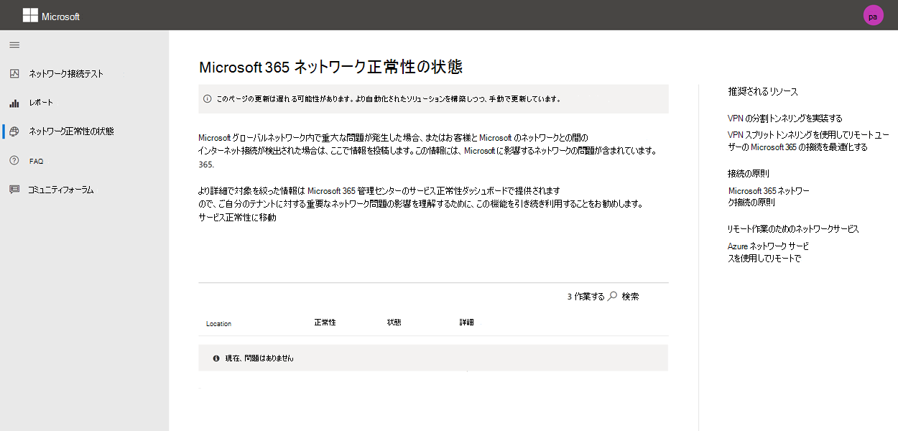

# Microsoft 365接続テスト ツール

ネットワークMicrosoft 365テスト ツールは、 に位置します<https://connectivity.office.com>。 このツールは、[正常性] の下の [ネットワーク評価] および [Microsoft 365 管理センターで利用できるネットワーク|**[接続]** メニュー。

> [!IMPORTANT]
> すべてのテスト レポートが管理者と共有され、サインイン中にテナントにアップロードされる場合は、Microsoft 365 テナントにサインインすることが重要です。

> [!div class="mx-imgBorder"]
> 

>[!NOTE]
>ネットワーク接続テスト ツールは、WW Commercial のテナントをサポートしますが、モデレート、GCC、DoD、中国GCCサポートされません。

Microsoft 365 管理 センターのネットワーク分析情報は、毎日集計される、Microsoft 365テナントの製品内の定期的な測定値に基づいて行います。 一方、ネットワーク接続テストMicrosoft 365ネットワーク分析情報は、ツールでローカルで実行されます。

製品内テストは制限され、ユーザーにローカルでテストを実行すると、より多くのデータが収集され、より深い分析情報が得られる。 Microsoft 365 管理センターのネットワーク分析情報は、特定のオフィスの場所にネットワーク上の問題が発生している場合に表示されます。 接続Microsoft 365テストは、その問題の根本原因を特定し、ターゲットを絞ったパフォーマンス向上アクションを提供するのに役立ちます。

これらの分析情報を一緒に使用して、Microsoft 365 管理 センターの各オフィスの場所でネットワーク品質の状態を評価し、Microsoft 365 接続テストに基づくテストの展開後に詳細を確認することをお勧めします。

## 各テスト ステップで何が起こるか

### Office場所の識別

[テストの実行] *ボタンをクリック* すると、実行中のテスト ページが表示され、オフィスの場所が特定されます。 市区町場、州、国別に場所を入力するか、検出を選択できます。 オフィスの場所を検出した場合、ツールは Web ブラウザーから緯度と経度を要求し、使用する前に精度を 300 メートルから 300 メートルに制限します。 ネットワークのパフォーマンスを測定するために、建物よりも正確に場所を特定する必要はありません。

### JavaScript テスト

オフィスの場所を特定した後、JavaScript で TCP 待機時間テストを実行し、サービスのフロント ドア サーバーで使用および推奨されるサービスに関するデータMicrosoft 365要求します。 これらのテストが完了すると、マップ上と詳細タブに表示され、次の手順の前に表示されます。

### 高度なテスト クライアント アプリケーションをダウンロードする

次に、高度なテスト クライアント アプリケーションのダウンロードを開始します。 クライアント アプリケーションを起動するには、ユーザーに依存し、.NET Core もインストールされている必要があります。

ネットワーク接続テストには、web <https://connectivity.office.com> サイトMicrosoft 365高度なネットワーク接続テストを実行するダウンロード可能Windowsクライアント アプリケーションの 2 つの部分があります。 ほとんどのテストでは、アプリケーションを実行する必要があります。 実行すると、結果が Web ページに読み込み戻されます。

Web ブラウザーのテストが完了した後、Web サイトから高度なクライアント テスト アプリケーションをダウンロードするように求めるメッセージが表示されます。 プロンプトが表示されたら、ファイルを開いて実行します。

> [!div class="mx-imgBorder"]
> 

### 高度なテスト クライアント アプリケーションを開始する

クライアント アプリケーションが起動すると、Web ページが更新され、この結果が表示されます。 テスト データは、Web ページへの受信を開始します。 新しいデータを受信する度にページが更新され、データが到着すると確認できます。

### 高度なテストが完了し、レポートのアップロードをテストする

テストが完了すると、Web ページと高度なテスト クライアントの両方にそれが表示されます。 ユーザーがサインインしている場合、テスト レポートは顧客のテナントにアップロードされます。

## テスト レポートの共有

テスト レポートでは、ユーザーアカウントへの認証Microsoft 365です。 管理者は、テスト レポートの共有方法を選択します。

### 管理者とレポートを共有する

テスト レポートが発生するときにサインインしている場合、レポートは管理者と共有されます。

### Microsoft アカウント チーム、サポート、その他の担当者との共有

テスト レポート (個人識別を除く) は、Microsoft の従業員と共有されます。 この共有は既定で有効になり、正常性サーバーで管理者が **無効|[ネットワーク接続]** ページ (Microsoft 365 管理センター)。

### 同じテナントにサインインする他のユーザー Microsoft 365する

レポートを共有するユーザーを選択できます。 選択できる状態は既定で有効になっていますが、管理者が無効にできます。

> [!div class="mx-imgBorder"]
> 

### ReportID リンクを使用しているユーザーとの共有

ReportID リンクへのアクセスを提供することで、テスト レポートを誰とでも共有できます。 このリンクは、サインインせずにテスト レポートを表示できるよう、誰かに送信できる URL を生成します。 この共有は既定で無効になっているので、管理者が有効にする必要があります。

> [!div class="mx-imgBorder"]
> 

## ネットワーク接続テストの結果

結果は、[概要] タブ **と [詳細] タブ****に表示** されます。 [概要] タブには、検出されたネットワーク境界のマップと、近くの他のユーザーとのネットワーク評価Microsoft 365表示されます。 また、テスト レポートの共有も可能です。 概要結果ビューの外観を次に示します。

> [!div class="mx-imgBorder"]
> 

詳細タブ出力の例を次に示します。 [詳細] タブに、結果が良好に比較された場合は、緑色の丸のチェック マークが表示されます。 結果がネットワークインサイトを示すしきい値を超えた場合、赤い三角形の感嘆符が表示されます。 次のセクションでは、各詳細タブの結果行について説明し、ネットワークインサイトに使用されるしきい値について説明します。

> [!div class="mx-imgBorder"]
> 

### 位置情報

このセクションには、場所に関連するテスト結果が表示されます。

#### お客様の場所

ユーザーの場所は、ユーザー Web ブラウザーから検出されます。 また、ユーザーの選択で入力できます。 これは、エンタープライズ ネットワーク境界の特定の部分へのネットワーク距離を識別するために使用されます。 この場所検出からの都市と他のネットワーク ポイントまでの距離だけがレポートに保存されます。

ユーザーのオフィスの場所がマップ ビューに表示されます。

#### ネットワーク出力の場所 (ネットワークが ISP に接続する場所)

サーバー側のネットワーク出力 IP アドレスを識別します。 場所データベースは、ネットワーク出力のおおよその場所を検索するために使用されます。 これらのデータベースは通常、IP アドレスの約 90% の精度を持っています。 ネットワーク出力 IP アドレスから見上げた場所が正確ではない場合は、誤った結果が発生します。 特定の IP アドレスに対してこのエラーが発生している場合は、パブリックアクセス可能なネットワーク IP アドレスの場所 Web サイトを使用して、実際の場所と比較できます。

#### ネットワークの出口からの距離

その場所からオフィスの場所までの距離を決定します。 これは、TCP 待機時間が 25 ミリ秒を超える可能性が高く、ユーザー エクスペリエンスに影響を与える可能性がある距離が **500** マイル (800 キロメートル) を超える場合のネットワーク分析情報として表示されます。

このマップには、エンタープライズ WAN の内部のネットワーク バックホールを示すユーザー オフィスの場所に関連するネットワーク出力場所が表示されます。

ユーザーのオフィスの場所からインターネットへのローカルおよび直接のネットワーク出力を実装して、ネットワーク接続Microsoft 365最適化します。 ローカル出力と直接出力の改善は、このネットワークインサイトに対処するための最良の方法です。

#### プロキシ サーバー情報

プロキシ サーバーがローカル コンピューター上で構成され、[最適化] カテゴリのネットワーク Microsoft 365を渡すかどうかを **特定** します。 ユーザーのオフィスの場所からプロキシ サーバーまでの距離を特定します。

距離は、ICMP ping によって最初にテストされます。 失敗した場合は、TCP ping でテストし、最後に IP アドレスの場所データベースでプロキシ サーバーの IP アドレスを確認します。 プロキシ サーバーがユーザーのオフィスの場所から **500 マイル (800** キロメートル) 以上離れた場合は、ネットワークインサイトが表示されます。

#### 組織への接続に使用する仮想プライベート ネットワーク (VPN)

このテストでは、VPN を使用してサーバーに接続Microsoft 365。 VPN がない場合、または VPN が推奨されるスプリット トンネル構成の VPN を使用している場合は、パス結果Microsoft 365。

#### VPN スプリット Tunnel

各 **オプティ** マイズ カテゴリ ルートは、Exchange Online、SharePointオンライン、Microsoft Teamsの各オプティマイズ カテゴリ ルートで、VPN でトンネリングされたのかテストされます。 分割されたワークロードは VPN を完全に回避します。 トンネル処理されたワークロードは VPN を通して送信されます。 選択的なトンネリングされたワークロードには、VPN を使用して送信されるルートと分割されたルートがあります。渡す結果は、すべてのワークロードが分割または選択的トンネリングされた場合に表示されます。

#### パフォーマンスの向上を実現する大都市圏の顧客

ユーザー のオフィスの場所と Exchange Online サービス間のネットワーク待機時間は、同Microsoft 365の顧客と比較されます。 同じメトロエリアの 10% 以上の顧客のパフォーマンスが向上した場合、ネットワークインサイトが表示されます。 つまり、ユーザーはユーザー インターフェイスのパフォーマンスMicrosoft 365向上します。

このネットワークインサイトは、都市内のすべてのユーザーが同じ通信インフラストラクチャにアクセスし、インターネット回線と Microsoft のネットワークに同じ近接性を持つという根拠に基づいて生成されます。

#### ネットワークで DNS 要求を行う時間

これは、テストを実行したクライアント コンピューターで構成された DNS サーバーを示しています。 DNS 再帰的リゾルバー サーバーである可能性があります。ただし、これは一般的ではありません。 DNS の結果をキャッシュし、キャッシュされていない DNS 要求を別の DNS サーバーに転送する DNS 転送サーバーである可能性が高い。

これは情報のみを提供し、ネットワークの洞察には貢献しない。

#### DNS 再帰リゾルバーへの接続距離および/または接続時間

使用されている DNS 再帰的リゾルバーは、特定の DNS 要求を行い、同じ要求を受信した IP アドレスを DNS ネーム サーバーに要求することで識別されます。 この IP アドレスは DNS 再帰的リゾルバーであり、場所を見つけるために IP アドレスの場所データベースで検索されます。 その後、ユーザーのオフィスの場所から DNS 再帰的リゾルバー サーバーの場所までの距離が計算されます。 これは、距離が **500 マイル (800 キロ** メートル) を超える場合のネットワーク分析情報として表示されます。

ネットワーク出力 IP アドレスから見上げた場所が正確ではない可能性があります。このテストでは誤った結果が発生します。 特定の IP アドレスに対してこのエラーが発生した場合に検証するには、パブリックアクセス可能なネットワーク IP アドレスの場所 Web サイトを使用できます。

このネットワークインサイトは、サービス フロント ドアの選択Exchange Online特に影響します。 この洞察に対処するには、ローカルおよび直接のネットワーク出力が前提条件であり、DNS 再帰的リゾルバーをそのネットワーク出力の近くに位置する必要があります。

### Exchange Online

このセクションでは、テストに関連するテスト結果をExchange Online。

#### Exchangeフロント ドアの場所

Outlook がこれを行うのと同じ方法で、Exchange サービス フロント ドアの使用が識別され、ユーザーの場所からユーザーの場所へのネットワーク TCP 待機時間が測定されます。 TCP 待機時間が表示され、サービス フロント Exchangeの使用時間が、現在の場所に最適なサービス フロント ドアの一覧と比較されます。 これは、サービス フロント ドアで最もExchangeの 1 つが使用されていない場合に、ネットワークインサイトとして表示されます。

最適な Exchange サービス フロント ドアの 1 つを使用しない場合は、企業のネットワーク出力の前にネットワーク バックホールが発生する可能性があります。その場合は、ローカルおよび直接のネットワーク出力をお勧めします。 また、リモート DNS 再帰的リゾルバー サーバーを使用した場合、DNS 再帰的リゾルバー サーバーをネットワーク出力に合わせて配置することをお勧めします。

サービス フロント ドアに対する TCP 待機時間 (ms) の潜在的なExchangeを計算します。 これは、テスト済みユーザーのオフィスの場所ネットワークの待機時間を確認し、ネットワークの待機時間を現在の場所からサービス フロント ドアのExchange差し引いて行います。 違いは、改善の潜在的な機会を表します。

#### おExchange最適なサービス フロント ドア

このリストには、お客様Exchangeに最適なサービス フロント ドアの場所が都市別に一覧表示されます。

#### クライアント DNS に記録されたサービス フロント ドア

これは、指定したサービス フロント ドア サーバー Exchange DNS 名と IP アドレスを示します。 情報のみを提供し、関連付けられたネットワークインサイトはありません。

### SharePoint Online

このセクションでは、オンラインとオンラインのテストに関連SharePoint結果をOneDrive。

#### サービス フロント ドアの場所

使用している SharePoint サービス フロント ドアは、OneDrive クライアントが行うのと同じ方法で識別され、ユーザーのオフィスの場所からその場所へのネットワーク TCP 待機時間を測定します。

#### ダウンロード速度

15Mb ファイルのダウンロード速度は、サービス フロント SharePointから測定します。 結果は 1 秒あたりのメガバイト単位で表示され、1 秒間にダウンロードできるサイズ ファイルを mb 単位SharePointまたはOneDrive **示します**。 この数は、1 秒あたりのメガビットの最小回線帯域幅の 10 分の 1 に似ている必要があります。 たとえば、100 mbps のインターネット接続がある場合は、1 秒あたり 10 メガバイト (10MBps) が予想されます。

#### バッファーの割り当て

15Mb のダウンロード中に、サービス フロント ドアに対する TCP SharePointを測定します。 これは読み込み時の待機時間であり、負荷がかからない場合の待機時間と比較されます。 負荷が下がった場合の待機時間の増加は、多くの場合、読み込まれている (または過大化された) コンシューマー ネットワーク デバイス バッファーに起因します。 ネットワークインサイトは、1,000 以上の任意のブロートに対して表示されます。

#### クライアント DNS に記録されたサービス フロント ドア

これは、指定したサービス フロント ドア サーバー SharePoint DNS 名と IP アドレスを示します。 情報のみを提供し、関連付けられたネットワークインサイトはありません。

### Microsoft Teams

このセクションでは、テストに関連するテスト結果をMicrosoft Teams。

#### メディア接続 (オーディオ、ビデオ、およびアプリケーション共有)

このテストでは、サービス フロント ドアMicrosoft Teams UDP 接続をテストします。 これをブロックすると、TCP Microsoft Teams機能する可能性がありますが、オーディオとビデオが損なわれる可能性があります。 これらの UDP ネットワーク測定値の詳細については、「Microsoft Teams Online のメディア品質とネットワーク接続のパフォーマンス」でもSkype for Business[してください](/skypeforbusiness/optimizing-your-network/media-quality-and-network-connectivity-performance)。

#### パケット損失

クライアントからサービス フロント ドアへの 10 秒間のテスト オーディオ呼び出しで測定Microsoft Teams UDP パケット損失を表示します。 これは、パスの **場合は 1.00% より** 低くする必要があります。

#### 遅延

**100ms** より低い UDP 待機時間を示します。

#### ジッター

**30ms** 未満の UDP ジッターを示します。

#### 接続

ユーザー オフィスの場所から必要なすべてのネットワーク エンドポイントへの HTTP 接続Microsoft 365します。 これらはで公開されています [https://aka.ms/o365ip](./urls-and-ip-address-ranges.md)。 ネットワークインサイトは、接続できない必要なネットワーク エンドポイントに対して表示されます。

プロキシ サーバー、ファイアウォール、またはエンタープライズ ネットワーク境界上の別のネットワーク セキュリティ デバイスによって接続がブロックされる場合があります。 TCP ポート 80 への接続は HTTP 要求でテストされ、TCP ポート 443 への接続は HTTPS 要求でテストされます。 応答がない場合、FQDN はエラーとしてマークされます。 HTTP 応答コード 407 がある場合、FQDN はエラーとしてマークされます。 HTTP 応答コード 403 がある場合は、応答の Server 属性を確認し、プロキシ サーバーのように見える場合は、これをエラーとしてマークします。 コマンド ライン ツールを使用して実行Windowsをシミュレートcurl.exe。

で定義されている最適化または許可カテゴリにあるMicrosoft 365ネットワーク エンドポイントで SSL 証明書をテストします[https://aka.ms/o365ip](./urls-and-ip-address-ranges.md)。 テストで Microsoft SSL 証明書が見つからない場合は、接続されている暗号化されたネットワークが仲介ネットワーク デバイスによって傍受されている必要があります。 ネットワークインサイトは、傍受された暗号化されたネットワーク エンドポイントに表示されます。

Microsoft によって提供されていない SSL 証明書が見つかった場合は、テストの FQDN と、使用中の SSL 証明書の所有者が表示されます。 この SSL 証明書の所有者は、プロキシ サーバー ベンダーである場合や、エンタープライズ自己署名証明書である場合があります。

#### ネットワーク パス

このセクションでは、Exchange Online サービス フロント ドア、SharePoint Online サービス フロント ドア、および Microsoft Teams サービス フロント ドアへの ICMP トレースルートの結果を示します。 情報のみを提供し、関連付けられたネットワークインサイトはありません。 3 つのトレース ルートが提供されています。 outlook.office365.com への _traceroute_、顧客への traceroute SharePoint フロントエンドまたは microsoft.sharepoint.com が提供されていない場合は _microsoft.sharepoint.com_、および traceroute to _world.tr.teams.microsoft.com。_

## 接続レポート

サインインすると、実行した以前のレポートを確認できます。 共有したり、リストから削除したりできます。

> [!div class="mx-imgBorder"]
> 

## ネットワーク正常性の状態

これは、Microsoft のグローバル ネットワークに関する重大な正常性の問題を示し、お客様のMicrosoft 365可能性があります。

> [!div class="mx-imgBorder"]
> 

## FAQ

よく寄せられる質問の一部に対する回答を次に示します。

### 高度なテスト クライアントを実行するために必要な情報

高度なテスト クライアントには、.NET Core 3.1 デスクトップ ランタイムが必要です。 高度なテスト クライアントをインストールせずに実行すると、 [.NET Core 3.1 インストーラー ページが表示されます](https://dotnet.microsoft.com/download/dotnet-core/3.1)。 SDK ではなくデスクトップ ランタイム、またはページの上位の ASP.NET Coreランタイムをインストールしてください。 .NET Core をインストールするには、コンピューターに対する管理者のアクセス許可が必要です。

高度なテスト クライアントは、SignalR を使用して Web ページと通信します。 このためには、TCP ポート 443 への接続が **開いている connectivity.service.signalr.net** 必要があります。 この URL は、クライアント アプリケーション <https://aka.ms/o365ip> のユーザーに対して接続が必要Microsoft 365公開されません。

### サービス フロント Microsoft 365とは何ですか?

Microsoft 365サービス フロント ドアは、Microsoft のグローバル ネットワーク上のエントリ ポイントであり、クライアントOfficeサービスがネットワーク接続を終了します。 ネットワーク接続を最適化Microsoft 365、都市または地下鉄の最も近いMicrosoft 365にネットワーク接続を終了してください。

> [!NOTE]
> Microsoft 365フロント ドアは、Azure マーケットプレースで利用可能な **Azure Front Door Service** 製品との直接的な関係はありません。

### サービス フロント ドアでMicrosoft 365は何ですか?

ベスト Microsoft 365 サービス フロント ドア (以前は最適なサービス フロント ドアと呼ばれる) は、一般に都市または地下鉄エリアでネットワーク出力に最も近いサービスです。 ネットワーク パフォーマンス Microsoft 365ツールを使用して、サービス フロント ドアと最適Microsoft 365サービス フロント ドアの場所を特定します。 使用しているフロント ドアが最適なドアの 1 つだとツールが判断した場合は、Microsoft のグローバル ネットワークへの接続性が高い必要があります。

### インターネットの出力場所とは何ですか?

インターネット出力場所は、ネットワーク トラフィックがエンタープライズ ネットワークから出てインターネットに接続する場所です。 これは、ネットワーク アドレス変換 (NAT) デバイスを持ち、通常はインターネット サービス プロバイダー (ISP) に接続する場所として識別されます。 場所とインターネットの出力場所との距離が長い場合は、WAN バックホールが重要な場合があります。

## 関連項目

[Microsoft 365 管理 センターのネットワーク接続](office-365-network-mac-perf-overview.md)

[Microsoft 365パフォーマンスに関する分析情報](office-365-network-mac-perf-insights.md)

[Microsoft 365ネットワーク評価](office-365-network-mac-perf-score.md)

[Microsoft 365接続ロケーション サービス](office-365-network-mac-location-services.md)
