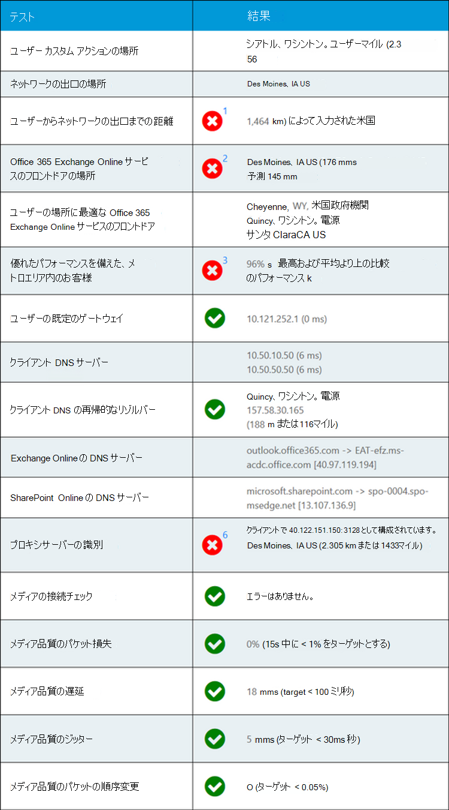

# Microsoft 365 の接続テスト (Microsoft 365 管理センター) (プレビュー)

Microsoft 365 の接続テストは、にあり <https://connectivity.office.com> ます。 このツールは、Microsoft 365 管理センターで利用可能なネットワーク insights およびネットワークスコア情報に対する adjunct ツールであり、正常性の下にあります。 **[ネットワークパフォーマンス** ] メニュー

>[!NOTE]
>オンボードツールは、世界各地の商用および GCC ではサポートされていますが、GCC High、DoD、ドイツ、中国のテナントはサポートしていません。

Microsoft 365 管理センターのネットワーク insights は、Microsoft 365 テナントの製品内の測定値に基づいています。 これに比べて、Microsoft 365 接続テストのネットワーク洞察は、ツールでローカルに実行されます。 製品内で実行できるテストは制限されており、ユーザーに対してローカルにテストを実行することにより、より深い洞察を得られるように収集できます。 次に、Microsoft 365 管理センターの network insights は、特定のオフィスの場所で Microsoft 365 を使用するためのネットワークの問題があることを示しています。 Microsoft 365 connectivity test は、この問題の根本的な原因を特定するのに役立ち、推奨されるネットワークパフォーマンスの向上アクションを導きます。

Microsoft 365 管理センターの各オフィスの場所についてネットワーク品質の状態を評価し、Microsoft 365 の接続テストに基づいてテストを展開した後は、より多くの情報を見つけられるようにすることをお勧めします。

>[!IMPORTANT]
>Network insights、Microsoft 365 Admin Center でのパフォーマンスに関する推奨事項と評価は現在プレビュー状態であり、機能プレビュープログラムに登録されている Microsoft 365 テナントに対してのみ使用できます。

## 高度なテストクライアントアプリケーション

Microsoft 365 の接続テストには2つの部分があります。 Web サイトがあり、 <https://connectivity.office.com> ダウンロード可能な Windows クライアントアプリケーションがあります。 ダウンロード可能なクライアントは、高度なネットワーク接続テストを実行し、ほとんどのテストでこれを実行する必要があります。

Web サイトからアドバンストクライアントテストを実行すると、実行時に結果が web ページに再び読み込まれます。

## ユーザーのオフィスの場所

ユーザーの office の場所がユーザーの web ブラウザーで検出されます。 これは、企業ネットワーク境界の特定の部分に対するネットワークの距離を特定するために使用されます。

ユーザーのオフィスの場所がマップビューに表示されます。

## ネットワークの出口位置への距離

サーバー側のネットワーク出口 IP アドレスを特定します。 場所データベースは、ネットワークの出口のおおよその場所を検索し、その場所からオフィスの場所までの距離を決定するために使用されます。 これは、距離が500マイル (800 km) を超える場合にネットワークの洞察として表示されます。

ネットワークの出口の場所がマップビューに表示され、エンタープライズ WAN 内部のネットワークバックを示す、ユーザーのオフィスの場所に接続されます。

ネットワーク出力 IP アドレスから検索された場所が正確でない可能性があるため、このテストからの結果が false になることがあります。 特定の IP アドレスに対してこのエラーが発生しているかどうかを検証するには、パブリックにアクセス可能なネットワーク IP アドレスの場所 web サイトを使用できます。

Microsoft 365 のネットワーク接続には、ユーザーのオフィスの場所からインターネットへのローカルおよび直接ネットワーク出口を実装することをお勧めします。 このネットワークの洞察に対処するための最善の方法は、ローカルおよび直接出口に対する機能強化です。

## Exchange Online サービスのフロントドア

使用中の Exchange Online サービスのフロントドアは、Outlook と同じ方法で識別され、ユーザーのオフィスの場所からのネットワーク TCP 遅延を測定します。 これらの両方が表示され、使用中の Exchange Online サービスのフロントドアが、現在の場所に対して推奨される最適なサービスフロントドアのリストと比較されます。 これは、最適でない Exchange Online サービスのフロントドアが使用されている場合のネットワークの洞察として表示されます。

Exchange Online サービスのフロントドアを使用していない場合は、企業ネットワークの出口の前にネットワークのバックアウトが原因で、ローカルと直接のネットワーク出口が推奨されることがあります。 また、リモート DNS の再帰リゾルバーサーバーを使用して、DNS の再帰リゾルバーサーバーをネットワークの出口に配置することが推奨される場合もあります。

Exchange Online サービスのフロントドアに対する TCP 遅延の向上の可能性を計算します。 これを行うには、テストされたユーザーのオフィスの場所のネットワーク待ち時間を調べ、現在の場所から closets Exchange Online サービスのフロントドアまで、ネットワークの待機時間を減算します。 違いは、改善につながる可能性がある機会を表します。

## エリア内の顧客の業績の比較

Exchange Online サービスのフロントドアに対するユーザーのオフィスの場所のネットワーク TCP 遅延が、同じメトロエリアにある他の Microsoft 365 ユーザーと比較されます。 同じメトロエリア内の10% 以上のお客様がパフォーマンスが優れている場合は、ネットワークの洞察が表示されます。

このネットワークの洞察は、1つの都市内のすべてのユーザーが同じ通信インフラストラクチャにアクセスできることと、インターネット回線および Microsoft のネットワークとの距離に応じて生成されます。

## [使用中の既定ゲートウェイ

[使用中の既定のゲートウェイ] は、テストクライアントが TCP/IP ネットワーク接続をルーティングするように構成したルーターです。

これは情報のみを対象として提供されており、ネットワークに関する洞察には影響しません。

## [使用する DNS サーバー]

これは、テストを実行したクライアントコンピューター上に構成された DNS サーバーを示しています。 DNS 再帰リゾルバーサーバーの場合もありますが、これは一般的ではありません。 Dns フォワーダーサーバーは、DNS の結果をキャッシュし、キャッシュされていない DNS 要求を別の DNS サーバーに転送する可能性が高くなります。

これは情報のみを対象として提供されており、ネットワークに関する洞察には影響しません。

## 識別された DNS 再帰リゾルバーサーバー

使用中の DNS 再帰リゾルバーは、特定の DNS 要求を作成し、同じ要求を受信した IP アドレスに対して DNS ネームサーバーに要求することで識別されます。 この IP アドレスは、DNS の再帰的なリゾルバーです。これは、IP アドレスの場所のデータベースで検索され、場所を見つけます。 その後、ユーザーのオフィスの場所から DNS の再帰的なリゾルバーサーバーの場所までの距離が計算されます。 これは、距離が500マイル (800 km) を超える場合にネットワークの洞察として表示されます。

ネットワーク出力 IP アドレスから検索された場所が正確でない可能性があるため、このテストからの結果が false になることがあります。 特定の IP アドレスに対してこのエラーが発生しているかどうかを検証するには、パブリックにアクセス可能なネットワーク IP アドレスの場所 web サイトを使用できます。

このネットワークの洞察は、Exchange Online サービスのフロントドアの選択に特に影響を与えます。 この洞察に対応するために、ローカルおよび直接ネットワークからの出口を指定する必要があります。その後、DNS 再帰リゾルバーは、そのネットワーク出口の近くに配置する必要があります。

## Exchange Online のフロントエンドサーバーと SharePoint Online のフロントエンドサーバーの DNS 参照

これらの2つの Microsoft 365 ワークロードのサービスフロントドアの DNS レコードを示します。 これらは情報のみに提供され、関連するネットワークの洞察はありません。

## プロキシサーバーの識別

ローカルコンピューターで構成されているプロキシサーバーを識別します。 最適化カテゴリの Microsoft 365 ネットワークトラフィックで、これらのいずれかが構成されているかどうかを確認します。 ユーザーのオフィスの場所からプロキシサーバーへの距離を特定します。 この距離は、最初に ICMP ping によってテストされ、失敗した場合は TCP ping を使用してテストを実行して失敗した場合は、IP アドレスの場所データベースでプロキシサーバーの IP アドレスを検索します。 プロキシサーバーが、ユーザーのオフィスの場所から500マイル (800 km) を超える場合は、ネットワークの洞察を示しています。

## メディア品質チェック

このテストでは、Skype for Business ネットワーク評価ツールをインストールして実行し、結果を解釈します。 このツールは、で見つけることができ [https://www.microsoft.com/download/details.aspx?id=53885](https://www.microsoft.com/download/details.aspx?id=53885) ます。

これらは、Microsoft Teams の音声およびビデオ通話および会議機能で使用される UDP プロトコルテストです。 Udp パケット損失、udp ネットワーク遅延、UDP ジッタ、および UDP パケットの再オーダーをテストします。 これらのいずれかが許容範囲を超えている場合は、ネットワークの洞察が表示されます。

## TCP 接続テスト

ユーザーのオフィスの場所から、必要なすべての Microsoft 365 ネットワークエンドポイントへの HTTP 接続をテストします。 これらは、で公開され [https://aka.ms/o365ip](https://aka.ms/o365ip) ます。 に接続できない必要なネットワークエンドポイントに対して、ネットワークの洞察が表示されます。

接続 ay は、プロキシサーバー、ファイアウォール、またはエンタープライズネットワーク境界またはクラウドプロキシとして使用されている別のネットワークセキュリティデバイスによってブロックされます。

## SSL 傍受テスト

「」で定義されている、「optimize or allow category」に記載されている必要な各 Microsoft 365 ネットワークエンドポイントで、SSL 証明書をテストし [https://aka.ms/o365ip](https://aka.ms/o365ip) ます。 いずれかのテストで Microsoft SSL 証明書が見つからない場合は、暗号化されたネットワークが仲介ネットワークデバイスによって傍受されている必要があります。 ネットワークの洞察は、傍受されたネットワークエンドポイントに表示されます。

Microsoft によって提供されていない SSL 証明書が見つかった場合は、テストの FQDN と使用中の SSL 証明書の所有者が表示されます。 この SSL 証明書の所有者は、プロキシサーバーのベンダーである場合もあれば、エンタープライズ自己署名証明書の場合もあります。

## ネットワークパスの診断

このセクションでは、Exchange Online サービスのフロントドア、SharePoint Online サービスのフロントドア、Microsoft Teams サービスのフロントドアに対する ICMP traceroute の結果を示します。 これは情報のみを対象として提供されており、関連するネットワークの洞察がありません。

## よくあるご質問 (FAQ)

ここでは、よく寄せられる質問の一部に対する回答を示します。

### このツールは、Microsoft によってリリースされ、サポートされていますか?

現時点では概念実証になっており、Microsoft がサポートする一般的な可用性リリース状態に達するまで定期的に更新プログラムを提供することを計画しています。 品質向上のためにフィードバックを提供してください。 このツールの一部として、より詳細な Office 365 ネットワークオンボードガイドを発行することを計画しています。このツールは、テスト結果によって組織用にカスタマイズされています。

### Microsoft 365 サービスのフロントドアとは

Microsoft 365 service のフロントドアは、Office クライアントとサービスがネットワーク接続を終了する Microsoft のグローバルネットワークにおけるエントリポイントです。 Microsoft 365 への最適なネットワーク接続のために、ネットワーク接続を都市またはメトロの最も近い Microsoft 365 フロントドアに終端することをお勧めします。

注: Microsoft 365 service のフロントドアは、Azure marketplace で利用可能な "Azure Front ドアサービス" 製品と直接関係していません。

### 最適な Microsoft 365 サービスのフロントドアとは何ですか。

最適な Microsoft 365 サービスのフロントドアは、一般に都市またはメトロエリアでのネットワーク出口に最も近いものです。 Microsoft 365 ネットワークパフォーマンスツールを使用して、使用中の Microsoft 365 サービスのフロントドアと最適なサービスフロントドアの場所を特定します。 使用中のフロントドアが最適であると判断した場合は、Microsoft のグローバルネットワークに最適な接続を行います。

### インターネット出口の場所とは

インターネット出口の場所は、ネットワークトラフィックがエンタープライズネットワークから出てインターネットに接続する場所です。 これは、ネットワークアドレス変換 (NAT) デバイスがあり、通常はインターネットサービスプロバイダー (ISP) を使用して接続する場所としても識別されます。 場所とインターネット出口の場所の間に長距離の距離がある場合は、WAN のバックアウトが非常に重要であることがわかります。

## 関連項目

[Microsoft 365 管理センター (プレビュー) でのネットワークパフォーマンスに関する推奨事項](office-365-network-mac-perf-overview.md)

[Microsoft 365 network performance insights (プレビュー)](office-365-network-mac-perf-insights.md)

[Microsoft 365 ネットワーク評価 (プレビュー)](office-365-network-mac-perf-score.md)

[Microsoft 365 ネットワーク接続ロケーションサービス (プレビュー)](office-365-network-mac-location-services.md)
