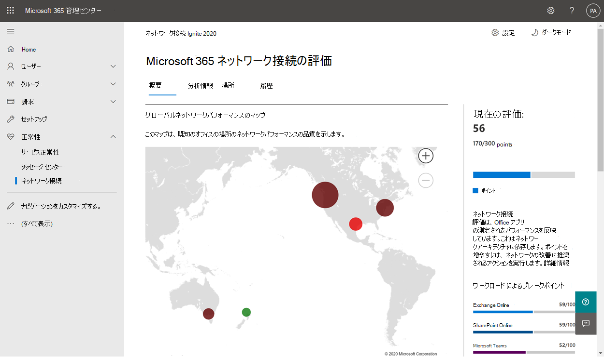
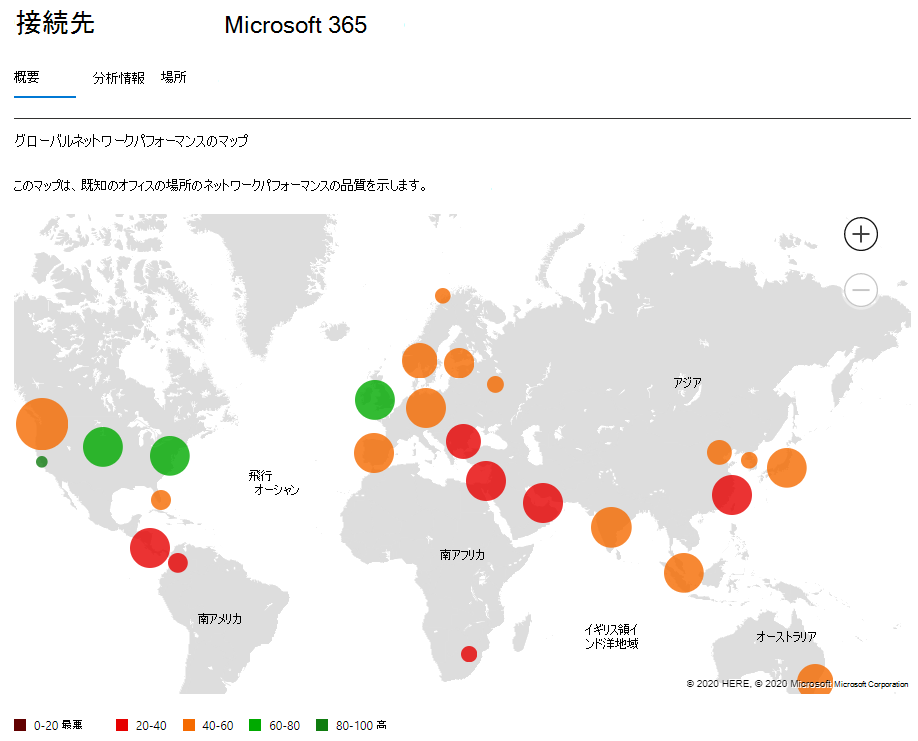
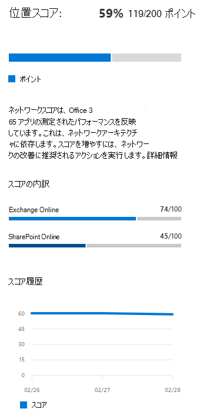
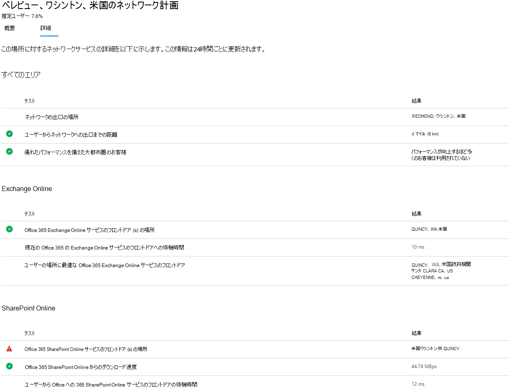

# Microsoft 365 管理 センターのネットワーク接続

このMicrosoft 365 管理センターには、Microsoft 365 テナントから収集され、テナントの管理ユーザーだけが表示できる集約されたネットワーク接続メトリックが含まれます。

> [!div class="mx-imgBorder"]
> 

**ネットワーク評価とネットワーク****分析情報** は、[正常性] の [Microsoft 365 管理 センター **] に表示|ネットワーク接続**。

> [!div class="mx-imgBorder"]
> ![[ネットワークパフォーマンス] ページ。](../media/m365-mac-perf/m365-mac-perf-page-nav.png)

>[!NOTE]
>管理センターのネットワーク接続は、WW Commercial および Germany のテナントをサポートしますが、モデレート、GCC、GCC、中国ではサポートされません。

最初にネットワーク パフォーマンス ページに移動する場合は、グローバル ネットワークパフォーマンスのマップ、テナント全体を対象にしたネットワーク評価、リモートで作業しているユーザーとオンサイトで作業しているユーザーの割合、および現在の問題の一覧を確認するために、場所を構成する必要があります。 概要ウィンドウからドリルダウンして、特定のネットワーク パフォーマンスの指標と問題を場所別に表示できます。 詳細については、「ネットワーク パフォーマンスの概要[」を参照 Microsoft 365 管理してください](#network-connectivity-overview-in-the-microsoft-365-admin-center)。

組織に代わって、この機能のパブリック プレビューに参加する必要があります。 通常、受け入れは直ちに行い、その後ネットワーク接続ページが表示されます。

ネットワーク接続ページにアクセスするには、組織の管理者である必要があります。Microsoft 365。 レポート リーダーの管理役割には、この情報への読み取りアクセス権があります。 ネットワーク接続の場所や他の要素を構成するには、管理者がサービス サポート管理者の役割などのサーバー管理者の役割の一部である必要があります。

## ネットワーク接続評価の前提条件が表示される

開始するには、場所のオプトイン設定をオンにし、Windows Location Services を使用してデバイスからデータを自動的に収集するか、位置情報リストに移動して場所データを追加またはアップロードするか、またはオフィスの場所から Microsoft 365 ネットワーク接続テストを実行します。 ネットワーク接続は組織全体で評価することができますが、特定のオフィスの場所に対してネットワーク設計の改善を行う必要があります。 これらの場所を決定すると、各オフィスの場所に対してネットワーク接続情報が提供されます。 オフィスの場所からネットワーク評価を取得するには、次の 3 つのオプションがあります。

### 1. 位置情報サービスWindows有効にする

このオプションでは、前提条件をサポートする各オフィスの場所で少なくとも 2 台のコンピューターが実行されている必要があります。 OneDriveバージョンWindows最新のバージョンで、各コンピューターにインストールする必要があります。 バージョンの詳細についてはOneDriveリリース ノートを参照OneDrive[してください](https://support.office.com/article/onedrive-release-notes-845dcf18-f921-435e-bf28-4e24b95e5fc0)。 ネットワーク測定値は、近い将来、他のOffice 365クライアント アプリケーションに追加される予定です。

WindowsLocation Service は、コンピューター上で同意する必要があります。 このテストは、アプリを実行し **、マップ** することでテストできます。 この機能は、1 台のコンピューターで有効に **できます設定 |プライバシー|[アプリ** による位置情報 _へのアクセスを許可する] 設定を有効にする_ 必要がある場所。 WindowsLocation Services の同意は、設定 _LetAppsAccessLocation_ を使用して MDM またはグループ ポリシーを使用して PC に展開できます。

このメソッドを使用して管理センターに場所を追加する必要は、都市の解決時に自動的に識別されます。 同じ都市内の複数のオフィスの場所は、位置情報サービスを使用Windows表示されません。 位置情報は、最も近い 300 メートルから 300 メートルに四捨五入され、より正確な位置情報にアクセスされません。

コンピューターには、イーサネット Wi-Fiネットワークを使用する必要があります。 イーサネット ケーブルを使用するコンピューターには、正確な位置情報が含めではありません。

測定サンプルとオフィスの場所は、これらの前提条件が満たされた 24 時間後に表示されます。

### 2. 場所を追加し、LAN サブネット情報を提供する

このオプションでは、位置情報サービスWindowsも、Wi-Fiも必要ありません。 このOneDriveのWindowsは、最新のバージョンで、その場所にある少なくとも 1 つのコンピューターにインストールされている必要があります。

場所ページに場所も追加するか、CSVファイルからインポートしてください。 追加する場所には、Office LAN サブネット情報が含まれる必要があります。 場所を追加または編集するダイアログで、複数の LAN サブネットと多数のパブリック出力 IP サブネットを指定できます。 LAN サブネットが必要であり、結果を表示するには、受信したネットワーク評価の LAN サブネット属性と一致する必要があります。 スーパー ネットはサポートされていないので、LAN サブネットは完全に一致する必要があります。

通常、LAN サブネットは RFC1918 で定義されているプライベート IP アドレス範囲で、LAN サブネットとしてのパブリック IP アドレスの使用が正しくない可能性があります。 このダイアログには、組織の最近のネットワーク評価テストで確認された LAN サブネットの候補が表示され、選択できます。

パブリック出力 IP アドレスを追加する場合、これらはセカンダリの差別化要因として使用され、同じ LAN サブネット IP アドレス範囲を使用する複数のサイトがある場合に使用されます。 テスト結果が表示されるのを確認するには、まずパブリック出力 IP アドレスの範囲を空白のままにする必要があります。 テスト結果が含まれている場合、テスト結果は LAN サブネット IP アドレス範囲とパブリック出力 IP アドレス範囲の両方と一致する必要があります。

このオプションを使用すると、都市内で複数のオフィスを定義できます。

クライアント コンピューターのすべてのテスト測定値には、入力したオフィスの場所の詳細と関連付ける LAN サブネット情報が含まれます。 測定サンプルとオフィスの場所は、これらの前提条件が満たされた 24 時間後に表示されます。

### 3. ネットワーク接続テスト ツールを使用してMicrosoft 365レポートを手動で収集する

このオプションでは、各場所で個人を識別する必要があります。 管理者のアクセス許可[を持Microsoft 365コンピューター](https://connectivity.office.com)でネットワーク接続テストWindowsを参照する必要があります。 Web サイトでは、結果を表示する組織Office 365アカウントにサインインする必要があります。 次に、[テストの実行 **] をクリックします**。 テスト中に、ダウンロードした Connectivity test EXE があります。 このファイルを開いて実行する必要があります。 テストが完了すると、テスト結果が管理センターにアップロードされます。

テスト レポートは、LAN サブネット情報と一緒に追加された場所にリンクされ、それ以外の場合は都市の場所にのみ表示されます。

測定サンプルとオフィスの場所は、テスト レポートが完了した 2 ~ 3 分後に表示されます。 詳細については、「ネットワーク接続[Microsoft 365テスト」を参照してください](office-365-network-mac-perf-onboarding-tool.md)。

> [!NOTE]
> 現時点では、Microsoft 365 管理センター で Microsoft 365 ネットワーク接続にオフィスの場所を追加する場合、LAN サブネットに IPv4 アドレスのみを指定できます。 EgressIP アドレスは IPv4 を使用する必要があります。

## この情報を使用する方法

**ネットワークの分析情報**、関連するパフォーマンスの推奨事項、ネットワーク評価は、オフィスの場所のネットワーク境界の設計に役立ちます。 各分析情報は、ユーザーがテナントにアクセスしている地理的な場所ごとに、特定の一般的なネットワークの問題のパフォーマンス特性に関する詳細を提供します。 **各ネットワーク インサイトの** パフォーマンスに関する推奨事項は、ネットワーク接続に関連するユーザー エクスペリエンスを向上させるために行う特定のネットワーク アーキテクチャ設計Microsoft 365提供します。 ネットワーク評価は、ネットワーク接続がユーザー エクスペリエンスに与える影響を示し、さまざまなユーザーの場所のネットワーク接続を比較できます。

**ネットワーク評価は、** 多くのネットワーク パフォーマンス 指標の集計を、0 ~ 100 のポイント値で表されるエンタープライズ ネットワーク正常性のスナップショットに集約します。 ネットワーク評価は、テナント全体と、ユーザーがテナントに接続する地理的な場所ごとに範囲が設定され、Microsoft 365 管理者は、企業のネットワーク正常性を即座に把握し、グローバルオフィスの場所に関する詳細なレポートをすばやくドリルダウンできます。

複数のオフィスの場所と非些細なネットワーク境界アーキテクチャを備える複雑な企業は、Microsoft 365 への初期オンボーディング中にこの情報を利用したり、使用状況の増加に関して発見されたネットワーク パフォーマンスの問題を修復したりすることができます。 これは、通常、ネットワーク接続を使用している小規模Microsoft 365、または単純で直接的なネットワーク接続を既に持っている企業では必要ありません。 ユーザー数が 500 人を超え、複数のオフィスの場所を持つ企業が最もメリットを得る見込みです。

>[!IMPORTANT]
>Microsoft 365 管理 センターのネットワーク分析情報、パフォーマンスの推奨事項、評価は現在プレビュー状態であり、機能プレビュー プログラムに登録されている Microsoft 365 テナントでのみ使用できます。

## Enterprise接続の課題

> [!div class="mx-imgBorder"]
> 

多くの企業では、ネットワーク境界の構成が時間の長い間に増え、主にほとんどの Web サイトが事前に知られていない、信頼されていない従業員のインターネット Web サイト アクセスに対応するように設計されています。 一般的で必要な焦点は、これらの未知の Web サイトからのマルウェアやフィッシング攻撃を避けることです。 このネットワーク構成戦略は、セキュリティ上役立ちますが、ユーザー のパフォーマンスとユーザー エクスペリエンスMicrosoft 365低下する可能性があります。

## これらの課題を解決する方法

企業は、接続の原則に従い、Office 365 Microsoft 365 管理センター ネットワーク接続機能を使用することで、一般的なユーザー エクスペリエンスを向上し、環境を保護できます。 ほとんどの場合、これらの一般的な原則に従って、エンド ユーザーの待機時間、サービスの信頼性、およびサービス全体のパフォーマンスに大きなプラスの影響を与Microsoft 365。

Microsoft では、大規模な企業のお客様向け Microsoft 365 に関するネットワーク パフォーマンスの問題を調査する必要が生じ、顧客のネットワーク境界インフラストラクチャに関連する根本原因が頻繁に発生する場合があります。 顧客ネットワーク境界の問題の一般的な根本原因が見つかった場合、それを識別する単純なテスト測定値を特定します。 特定の問題を識別する測定しきい値を持つテストは、任意の場所で同じ測定値をテストし、この根本原因が存在するかどうかを確認し、それを管理者とネットワークインサイトとして共有することができます。

一部のネットワークインサイトは、さらに調査が必要な問題を示しているに過言ではありません。 根本原因を修正するための特定の修復アクションを表示するのに十分なテストがあるネットワークインサイトは、推奨されるアクションとして **一覧表示されます**。 これらの推奨事項は、事前に設定されたしきい値を超える値を示すライブ 指標に基づいており、環境に固有の一般的なベスト プラクティスのアドバイスよりもずっと価値が高く、推奨される変更が行われた後の実際の改善点を示します。

## ネットワーク接続の概要 (Microsoft 365 管理 センター)

Microsoft には、デスクトップクライアントと web クライアントOfficeの既存のネットワーク測定値が含Microsoft 365。 これらの測定値は、ネットワーク アーキテクチャ設計の分析情報とネットワーク評価を提供するために使用され、Microsoft 365 管理センターの [ネットワーク接続] ページに表示されます。

既定では、ネットワーク測定値に関連付けられたおおよその位置情報は、クライアント デバイスが位置する都市を識別します。 各場所でのネットワーク評価は色で表示され、各場所のユーザーの相対数は円のサイズで表されます。

> [!div class="mx-imgBorder"]
> 

また、概要ページには、顧客のネットワーク評価が、すべてのオフィスの場所の加重平均として表示されます。

> [!div class="mx-imgBorder"]
> 

[場所] タブで、フィルター処理、並べ替え、および編集できる場所のテーブル ビュー **を表示** できます。特定の推奨事項がある場所には、潜在的な待機時間の改善が含まれる可能性があります。 これは、組織のユーザーの中央値の待機時間をその場所で取得し、同じ都市内のすべての組織の中央値の待機時間を差し引いて計算されます。

> [!div class="mx-imgBorder"]
> 

## リモート ワーカー評価とユーザー接続の指標

ネットワーク トラフィック ログをリモートユーザーまたはオンサイト ユーザーとして分類し、その割合を概要ウィンドウの [ユーザー接続の指標] セクションに表示します。 リモート ユーザーを持つ都市では、その場所のページを開く際に、場所固有のリモート ネットワーク評価スコアが表示されます。 場所の一覧には、オフィスの場所とリモートワーカー都市の両方が含め、フィルター処理と並べ替えが可能です。 リモート ワーカー評価スコアを提供します。ポイントの内訳は、Exchange、SharePoint、Teams。

ホーム ユーザー のネットワーク分析情報は、都市レベルで集計および報告され、リモート従業員が少なくとも 5 人の都市に限定されます。 自宅で働く個々の従業員を特定していません。

場所はオンサイトまたはリモートとして自動分類されます。ただし、オンサイトのすべての出力 IP アドレスを手動で入力して、100% の分類を確実に行うことができます。 このルートに移動する場合は、すべての出力 IP アドレスを追加した後、[場所] 設定 フライアウトで [すべてのオンサイトの出力 **IP** アドレスを手動で入力する] チェック ボックスをオンにする必要があります。 これが完了すると、オンサイトとしてマークした出力 IP アドレスからのすべてのネットワーク トラフィック ログは常にオフィスとして分類され、他のすべての出力 IP アドレスはリモートとして分類されます。

## 特定のオフィスの場所ネットワークのパフォーマンスの概要と分析情報

オフィスの場所を選択すると、そのオフィスの場所の測定値から識別されたネットワーク出力の詳細を示す場所固有の概要ページが開きます。

> [!div class="mx-imgBorder"]
> 

その場所にある組織のユーザーの境界ネットワークのマップは、次の要素の一部またはすべてと一緒に表示されます。

- **Office場所**- 見ているページのオフィスの場所
- **ネットワーク境界** - オフィスの場所からの接続の送信元 IP アドレスの場所。 これは、geo-IP の場所データベースの精度に依存します。
- **Exchange最適** なサービス フロント ドア - このオフィスの場所Exchangeユーザーが接続する必要Exchangeサービス フロント ドアの 1 つ
- **Exchange最適ではないフロント** ドア - ユーザー Exchange接続されているが、推奨されないサービス フロント ドア
- **SharePoint最適** なサービス フロント ドア - このオフィスの場所のユーザーが接続する必要SharePointサービス フロント ドアの 1 つ
- **SharePoint最適** ではないサービス フロント ドア - ユーザー SharePoint接続されているが、推奨されないサービス フロント ドア
- **DNS 再帰的リゾルバー サーバー** - 検出された DNS 再帰的リゾルバーの geo IP データベースからの場所 (使用可能な場合Exchange Online)
- **プロキシ サーバー** - 検出されたプロキシ サーバーの geo IP データベースからの場所 (使用可能な場合)

さらに、オフィスの場所の概要ページには、場所のネットワーク評価、ネットワーク評価履歴、この場所の評価と同じ都市の他の顧客との比較、およびネットワークのパフォーマンスと信頼性を向上させるために実施できる特定の洞察と推奨事項の一覧が表示されます。

同じ都市の顧客間の比較は、すべての顧客がネットワーク サービス プロバイダー、通信インフラストラクチャ、および近くの Microsoft ネットワーク プレゼンス ポイントに等しいアクセス権を持つという期待に基づいて行います。

場所名は、新しい場所を追加したり、場所のフライアウトで既存の場所を編集するときにカスタマイズできます。 これにより、場所名をいつでもカスタマイズできます。 また、場所のフライアウトに LAN サブネットを直接追加する場合は、選択できるソフトマッチ LAN サブネットのドロップダウン リストが表示されます。 特定のオフィス出力 IP アドレスの回線名も追加および編集できます。

[オフィスの場所] ページの [詳細] タブには、分析情報、推奨事項、およびネットワーク評価を考え出すのに使用された特定の測定結果が表示されます。 これは、ネットワーク エンジニアが推奨事項を検証し、環境内の制約や特定の要素を考慮するために提供されます。 また、収集したサンプルの推定ユーザー数は、そのオフィスの場所と、その都市のリモート ワーカーにも表示されます。

> [!div class="mx-imgBorder"]
> 

## ネットワーク評価データを Microsoft と共有する

既定では、組織のネットワーク評価とネットワーク分析情報は Microsoft の従業員と共有されます。 これには、スタッフからの個人データが含まれるのではなく、オフィスの場所の管理センターに表示される特定のネットワーク評価指標とネットワークインサイトだけが含まれます。 また、オフィスの所在地名や住所も含まれるので、話し合うオフィスの市区町会とサポート ID を伝える必要があります。 これをオフにすると、ネットワーク接続について説明している Microsoft エンジニアは、この情報を表示できません。 この設定を有効にすると、有効にした日から始まる将来のデータだけが共有されます。

## LAN サブネットオフィスの場所の CSV インポート

LAN サブネット のオフィス ID の場合は、事前に各場所を追加する必要があります。 [場所] タブで個々のオフィスの場所を追加する代わりに、CSV ファイルからインポートできます。 このデータは、通話品質ダッシュボードや Active Directory サイトとサービスなど、保存した他の場所から取得できる場合があります。

CSV ファイルでは、検出された都市の場所が userEntered 列に空白として表示され、手動で追加されたオフィスの場所は 1 と表示されます。

1. メインの [接続 _] ウィンドウMicrosoft 365、[_ 場所]**タブをクリック** します。

1. [場所] **ボックスの** 一覧の上にある [インポート] ボタンをクリックします。 [ **オフィスの場所のインポート]** フライアウトが表示されます。

   > [!div class="mx-imgBorder"]
   > 

1. [現在 **の場所をダウンロードする (.csv)** リンクをクリックして、現在の場所リストを CSV ファイルにエクスポートし、ローカル ハード ディスクに保存します。 これにより、場所を追加できる列見出しを含む正しい形式の CSV が提供されます。 既存のエクスポートされた場所はそのままにできます。更新された CSV をインポートすると、重複されません。 既存の場所のアドレスを変更する場合は、CSV をインポートするときに更新されます。 検出された都市の住所を変更することはできません。

1. CSV を開き、追加する場所ごとに新しい行に次のフィールドを入力して場所を追加します。 他のすべてのフィールドは空白のままにします。他のフィールドに入力した値は無視されます。

   1. **userEntered** (必須): 新しい LAN サブネット オフィスの場所が追加される場合は 1 である必要があります
   1. **名前** (必須): オフィスの場所の名前
   1. **アドレス** (必須): オフィスの物理アドレス
   1. **Latitude** (省略可能): 空白の場合、Bingの参照をマップする場所から設定されます。
   1. **経** 度 (省略可能): 空白の場合、Bingの参照をマップするデータから入力されます。
   1. **Egress IP アドレス範囲 1 ~ 5** (オプション): 各範囲に対して、回線名と有効な IPv4 CIDR アドレスのスペース区切りリストを入力します。 これらの値は、同じ LAN サブネット IP アドレスを使用する複数のオフィスの場所を区別するために使用されます。 EgressIP アドレス範囲はすべて /24 ネットワーク サイズで、/24 は入力に含まれません。
   1. **LanIps** (必須): このオフィスの場所で使用されている LAN サブネット範囲を一覧表示します。 LAN サブネットの IP には、ネットワーク サイズが /8 ~ /29 の間である CIDR ネットワーク サイズが含まれている必要があります。 複数の LAN サブネット範囲をコンマまたはセミコロンで区切ります。

1. オフィスの場所を追加してファイルを保存したら、完了したフィールドの横にある [参照] アップロードをクリックし、**保存** した CSV ファイルを選択します。

1. ファイルは自動的に検証されます。 検証エラーがある場合は、エラー メッセージが表示されます。インポート ファイルにいくつかの _エラーがあります。エラーを確認し、インポート ファイルを修正してから、もう一度やり直してください。_ [エラーの詳細 **を開く] リンクをクリック** して、特定のフィールド検証エラーの一覧を表示します。

   > [!div class="mx-imgBorder"]
   > 

1. ファイルにエラーがない場合は、[レポートの準備完了] という _メッセージが表示されます。追加する場所と更新する x の場所が見つかりました。_ [インポート] **ボタンを** クリックして CSV をアップロードします。

   > [!div class="mx-imgBorder"]
   > 

## よくあるご質問 (FAQ)

### サービス のフロント Microsoft 365とは何ですか?

Microsoft 365サービス フロント ドアは、Microsoft のグローバル ネットワーク上のエントリ ポイントであり、クライアントOfficeサービスがネットワーク接続を終了します。 ネットワーク接続を最適に行Microsoft 365、ネットワーク接続を最も近いネットワーク 接続Microsoft 365勧めします。

>[!NOTE]
>Microsoft 365フロント ドアは、Azure マーケットプレースで利用できる Azure Front Door Service 製品との直接的な関係はありません。

### サービス フロント ドアMicrosoft 365最適な機能は何ですか?

最適なMicrosoft 365サービス フロント ドアは、ネットワーク出力に最も近い 1 つで、通常は都市または地下鉄エリアにあります。 ネットワーク接続[Microsoft 365テスト](office-365-network-mac-perf-onboarding-tool.md)ツール (プレビュー) を使用して、サービス フロント ドアと最適なサービス フロント ドアMicrosoft 365使用している場所を特定します。 使用しているフロント ドアが最適と判断された場合は、Microsoft のグローバル ネットワークに最適に接続します。

### インターネットの出力場所とは何ですか?

インターネット出力の場所は、ネットワーク トラフィックがエンタープライズ ネットワークから出てインターネットに接続する場所です。 これは、ネットワーク アドレス変換 (NAT) デバイスを持ち、通常はインターネット サービス プロバイダー (ISP) に接続する場所として識別されます。 場所とインターネットの出力場所との距離が長い場合は、WAN バックホールが重要な可能性があります。

### この機能に必要なライセンス

ユーザーにアクセスできるライセンスが必要Microsoft 365 管理センター。

## 関連項目

[Microsoft 365分析情報 (プレビュー)](office-365-network-mac-perf-insights.md)

[Microsoft 365評価 (プレビュー)](office-365-network-mac-perf-score.md)

[Microsoft 365接続テスト ツール (プレビュー)](office-365-network-mac-perf-onboarding-tool.md)

[Microsoft 365ネットワーク接続位置情報サービス (プレビュー)](office-365-network-mac-location-services.md)
