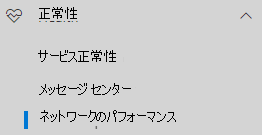

# Microsoft 365 管理センターでのネットワーク接続 (プレビュー)Network connectivity in the Microsoft 365 Admin Center (preview)

Microsoft 365 管理センターには、Microsoft 365 テナントから収集され、テナント内の管理者ユーザーのみが表示できる、集計したネットワーク接続メトリックが含まれることができるようになりました。The Microsoft 365 Admin Center now includesaggregated network connectivity metrics collected from your Microsoft 365 tenant and available to view only by administrative users in your tenant. **ネットワーク評価と\*\*\*\*ネットワーク分析情報は**、Microsoft 365 管理センターの正常性 | の下に**表示されます。[接続]。****Network assessments** and **network insights** are displayed in the Microsoft 365 Admin Center under **Health | Connectivity**.

最初にネットワーク接続ページに移動すると、グローバル ネットワーク パフォーマンスの地図、テナント全体を対象としたネットワーク評価、および現在の問題の一覧を示す概要ウィンドウが表示されます。When you first navigate to the network connectivity page, you will see an overview pane containing a map of global network performance, a network assessment scoped to the entire tenant, and a list of current issues. 概要からドリルダウンして、特定のネットワーク パフォーマンス メトリックと場所別の問題を表示できます。From the overview, you can drill down to view specific network performance metrics and issues by location. 詳細については [、Microsoft 365 管理センターのネットワーク パフォーマンスの概要を参照してください](#network-connectivity-overview-in-the-microsoft-365-admin-center)。For more information, see [Network performance overview in the Microsoft 365 Admin Center](#network-connectivity-overview-in-the-microsoft-365-admin-center).

## ネットワーク接続評価が表示される前提条件Pre-requisites for network connectivity assessments to appear

オフ場所からネットワーク評価を取得するには、3 つのオプションがあります。There are three options for getting network assessments from your office locations:

### 1. Windows 位置情報サービスを有効にする1. Enable Windows Location Services

このオプションでは、前提条件をサポートしている各オフケーションで少なくとも 2 台のコンピュータが実行されている必要があります。For this option you must have at least two computers running at each office location that support the pre-requisites. Windows バージョン 19.232 以降の OneDrive を各コンピューターにインストールする必要があります。OneDrive for Windows version 19.232 or above must be installed on each computer. OneDrive バージョンの詳細については [、OneDrive リリース ノートを参照してください](https://support.office.com/article/onedrive-release-notes-845dcf18-f921-435e-bf28-4e24b95e5fc0)。For more information on OneDrive versions, see the [OneDrive release notes](https://support.office.com/article/onedrive-release-notes-845dcf18-f921-435e-bf28-4e24b95e5fc0). ネットワーク測定は、他の Office 365 クライアント アプリケーションの将来的な方法で追加される予定です。Network measurements are planned to be added in other Office 365 client applications in the near future.

Windows Location Service は、コンピューター上で同意する必要があります。Windows Location Service must be consented on the machines. マップ アプリを実行し、自分を **確認** してこれをテストできます。You can test this by running the **Maps** app and locating yourself. [設定] の [プライバシーの場所] で **、[アプリ**に位置情報へのアクセスを許可する] を有効  ->  **Privacy**  ->  **Location**にする必要がある 1 つのコンピューターで有効にできます。It can be enabled on a single machine with **Settings** -> **Privacy** -> **Location** where the setting "Allow apps to access your location" must be enabled. Windows 位置情報サービスの同意は、MDM またはグループ ポリシーと _LetAppsAccessLocation_設定を使用して、PC に展開できます。Windows Location Services consent can be deployed to PCs using MDM or Group Policy with the setting _LetAppsAccessLocation_.

この方法を使用して管理センターで場所を追加する必要がなけら、この方法を使用して場所が市の解決度に自動的に特定されます。You do not need to add locations in the Admin Center with this method as they are automatically identified at the city resolution. Windows 位置情報サービスを使用して、市内に複数のオフ場所を表示することはできません。You cannot show multiple office locations within a city using Windows Location Services.

コンピューターにはイーラネット ケーブルではなく、Wi-Fi ネットワークが必要です。The machines should have Wi-Fi networking rather than an Ethernet cable. イーサネット キャブルを使用しているコンピューターに、正しい場所情報が表示されていない。Machines with an Ethernet cable do not have accurate location information.

測定サンプルとオフケーションがある場合は、前提条件の満たされた後、24 時間の開始が開始されます。Measurement samples and office locations should start to appear 24 hours after these pre-requisites have been met.

### 2. 場所を追加して LAN サブネット情報を提供する2. Add locations and provide LAN Subnet information

このオプションでは、Windows 位置情報サービスと Wi-Fi のどちらでも必要ありません。For this option neither Windows Location Services nor Wi-Fi are required. Windows バージョン 20.161.0811.0001 以降用 OneDrive が各コミュニターの場所にインストールされている必要があります。You need OneDrive for Windows version 20.161.0811.0001 or above installed on each commputer at the location.

また、管理センターのネットワーク接続ページに場所を追加したり、CSV ファイルからそれらの情報をインポートしたりする必要があります。You also need to add locations in the Admin Center network connectivity page or to import those from a CSV file. 追加する場所には、オフスに LAN サブネット情報を含める必要があります。The locations added must include your office LAN Subnet information.

場所を追加するので、市内で複数のオフが定義される場合があります。Because you are adding the locations, you can have multiple offices defined within a city.

測定サンプルとオフケーションがある場合は、前提条件の満たされた後、24 時間の開始が開始されます。Measurement samples and office locations should start to appear 24 hours after these pre-requisites have been met.

### 3. Microsoft 365 ネットワーク接続テスト ツールを使ってテスト レポートを手動で収集する3. Manually gather test reports with the Microsoft 365 network connectivity test tool

このオプションでは、それぞれの場所のユーザーを指定する必要があります。For this option you need to identify a person at each location. 管理者権限を持つ [Windows コンピューター上で Microsoft 365](https://connectivity.office.com) ネットワーク接続テストに対して、ブラウザーに要求します。Ask them to browser to [Microsoft 365 network connectivity test](https://connectivity.office.com) on a Windows machine that they have administrative permissions on. Web サイトでは、結果を表示するテナントと同じテナントで Office 365 アカウントにサインインする必要があります。On the web site, they need to sign-in to their Office 365 account on the same tenant that you want to see the results. 次に、[テストの実行] をクリックします。Then they click Run test. このテストでは、ダウンロードした接続テスト EXE を使用します。During the test there is a downloaded Connectivity test EXE. THey も開いて実行する必要があります。THey need to open and execute that also. テストが完了すると、テスト結果が Microsoft にアップロードされます。Once the tests are completed, the test result is uploaded to Microsoft.

テスト レポートが LAN サブネット情報と共に追加されている場合は場所にリンクされ、それ以外の場合には、市内のみに表示されます。Test reports are linked to a location if it was added with LAN Subnet information, otherwise they are shown at the city location only.

測定サンプルとオフバリメーションがある場所は、テスト結果が完了した後、2 ~ 3 分と表示されます。Measurement samples and office locations should start to appear 2-3 minutes after a test result is completed.

## この情報の使用方法How do I use this information?

**ネットワークの分析情報**、ネットワークの関連性に関する推奨事項、ネットワーク評価は、オフィスの場所のネットワーク境界の設計をサポートするためのものになります。**Network insights**, their related performance recommendations and network assessments are intended to help in designing network perimeters for your office locations. 各分析情報から、ユーザーがテナントにアクセスしている地理的な場所ごとに、特定の共通の問題のパフォーマンス特性について詳細が提供されます。Each insight provides details about the performance characteristics for a specific common issue for each geographic location where users are accessing your tenant. **各ネットワーク分析情報** に関するパフォーマンスに関する推奨事項は、Microsoft 365 ネットワーク接続に関連するユーザー エクスペリエンスを向上させるための個別のネットワーク アーキテクチャ設計の変更を提供します。**Performance recommendations** for each network insight offer specific network architecture design changes you can make to improve user experience related to Microsoft 365 network connectivity. ネットワーク評価は、ネットワーク接続がユーザー エクスペリエンスにどう影響するのかを示し、さまざまなユーザーの場所のネットワーク接続を比較できるようにします。The network assessment shows how network connectivity impacts user experience, allowing for comparison of different user location network connections.

**ネットワーク評価では** 、多くのネットワーク パフォーマンス メトリックが、0 ~ 100 のポイント値で表されるエンタープライズ ネットワークの正常性のスナップショットに集約されます。**Network assessments** distill an aggregate of many network performance metrics into a snapshot of your enterprise network health, represented by a points value from 0 - 100. ネットワーク評価の範囲は、テナント全体と、テナントに接続するユーザーの地理的な場所の両方に範囲指定され、Microsoft 365 管理者は、企業のネットワークの正常性のジェスチャをすばやく理解し、グローバル オフィスの場所の詳細レポートをすばやく詳しくドリルダウンするための簡単な方法を Microsoft 365 管理者に提供します。Network assessments are scoped to both the entire tenant and for each geographic location from which users connect to your tenant, providing Microsoft 365 administrators with an easy way to instantly grasp a gestalt of the enterprise's network health and quickly drill down into a detailed report for any global office location.

複数のオフウォールな場所と中心外なネットワーク境界アーキテクチャを持つ複雑な企業は、この情報を Microsoft 365 に初回オンボーディングする際、または使用状況の拡大で検出されたネットワーク パフォーマンスの問題を修復できます。Complex enterprises with multiple office locations and non-trivial network perimeter architectures can benefit from this information either during their initial onboarding to Microsoft 365 or to remediate network performance issues discovered with usage growth. これは、Microsoft 365 を使用する中小企業、または既に簡単で直接ネットワーク接続を持つ企業では必要ありません。This is usually not necessary for small businesses using Microsoft 365, or any enterprises who already have simple and direct network connectivity. ユーザー数が 500 を超える企業や複数のオフになっていない企業は、最大のメリットを得ると想想されます。Enterprises with over 500 users and multiple office locations are expected to benefit the most.

>[!IMPORTANT]
>ネットワーク インサイト、Microsoft 365 管理センターでのパフォーマンスに関する推奨事項および評価は現在プレビュー状態で、機能プレビュー プログラムに登録されている Microsoft 365 テナントでのみ利用できます。Network insights, performance recommendations and assessments in the Microsoft 365 Admin Center is currently in preview status, and is only available for Microsoft 365 tenants that have been enrolled in the feature preview program.

## エンタープライズ ネットワーク接続の問題Enterprise network connectivity challenges

多くの企業は、時間のかつて時間がかかっていないネットワーク境界構成を利用しています。また、従業員のインターネット Web サイト アクセスに、信頼されていない Web サイトのアクセスが含まれます。Many enterprises have network perimeter configurations which have grown over time and are primarily designed to accommodate employee Internet web site access where most web sites are not known in advance and are untrusted. 前後で必要なフォーカスは、これらの不明な Web サイトからのマルウェアや攻撃を防ぐことです。The prevailing and necessary focus is avoiding malware and fishing attacks from these unknown web sites. このネットワーク構成戦略は、セキュリティの目的とにかからず、Microsoft 365 のユーザー パフォーマンスとユーザー エクスペリエンスの低下につながる可能性があります。This network configuration strategy, while helpful for security purposes, can lead to degradation of Microsoft 365 user performance and user experience.

## 問題の解決方法How we can solve these challenges

企業は、Office 365 の接続原則に [従い、Microsoft 365 管理センターのネットワーク](https://aka.ms/pnc) 接続機能を使用して、一般的なユーザー エクスペリエンスを改善し、企業の環境を保護できます。Enterprises can improve general user experience and secure their environment by following [Office 365 connectivity principles](https://aka.ms/pnc) and by using the Microsoft 365 Admin Center network connectivity feature. ほとんどの場合、これらの一般的な原則に従うのは、エンド ユーザーの待機時間、サービスの信頼性、および Microsoft 365 の全体的なパフォーマンスに大きな影響を与えます。In most cases, following these general principles will have a significant positive impact on end user latency, service reliability and overall performance of Microsoft 365.

Microsoft では、大規模なエンタープライズお客様向けに Microsoft 365 を使用したネットワーク パフォーマンスの問題を調査するようにお寄せになることがあります。このような問題はお客様のネットワーク エグレス インフラストラクチャに関連する根本原因を頻繁に持つことがあります。Microsoft is sometimes asked to investigate network performance issues with Microsoft 365 for large enterprise customers, and these frequently have a root cause related to the customers network egress infrastructure. お客様のネットワーク境界の問題が発生する場合、それを識別する単純なテスト測定値の特定を考えました。When a common root cause of a customer network perimeter issue is found we seek to identify simple test measurements that identifies it. どこでも同じ測定値をテストして、この根本原因が存在するかどうかを確認し、管理者とネットワークの分析情報として共有できるため、特定の問題を識別する測定しきい値を持つテストは役立つ場合があります。A test with a measurement threshold that identifies a specific problem is valuable because we can test the same measurement at any location, tell whether this root cause is present there and share it as a network insight with the administrator.

一部のネットワーク インサイトは、詳細な調査が必要な問題を示しているにすかもしか示しません。Some network insights will merely indicate a problem that needs further investigation. 根本原因を修正するための特定の修復アクションを表示するための十分なテストが十分に用いられるネットワークの分析情報が、推奨される **アクションとして表示されます**。A network insight where we have enough tests to show a specific remediation action to correct the root cause is listed as a **recommended action**. これらの推奨事項は、事前に定義されたしきい値を超える実際の値を示しているもので、環境に固有であるため、一般的なベスト プラクティスアドよりもはるかに重要なもので、推奨される変更が行われた後は実際の改善が示されます。These recommendations, based on live metrics that reveal values that fall outside a predetermined threshold, are much more valuable than general best practice advice since they are specific to your environment and will show the actual improvement once the recommended changes have been made.

## Microsoft 365 管理センターのネットワーク接続の概要Network connectivity overview in the Microsoft 365 Admin Center

Microsoft では、Microsoft 365 の運用をサポートOffice、デスクトップおよび Web クライアントのいくつかのクライアントからネットワーク測定を行い、既存のネットワーク測定方法を用いました。Microsoft has existing network measurements from several Office desktop and web clients which support the operation of Microsoft 365. これらの測定値は、Microsoft 365 管理センターの [ネットワーク接続] ページに表示されるネットワーク アーキテクチャ設計の分析情報と **ネットワーク** 評価を提供するために使用されています。These measurements are now being used to provide network architecture design insights and a network assessment which are shown in the **Network connectivity** page in the Microsoft 365 Admin Center.

既定では、ネットワーク測定値に関連付けられているおおおける場所情報によって、クライアント デバイスが配置されている場所が特定されます。By default, approximate location information associated with the network measurements identify the city where client devices are located. 各場所のネットワーク評価は色で表示され、各場所のユーザーの相対的な数は円のサイズで表示されます。The network assessment at each location is shown with color and the relative number of users at each location is represented by the size of the circle.

概要ページには、すべてのオフオフイスの重み付き平均として顧客のネットワーク評価も表示されます。The overview page also shows the network assessment for the customer as a weighted average across all office locations.

## 特定のオフィス ネットワーク パフォーマンスの概要と分析情報Specific office location network performance summary and insights

オフ場所を選択すると、場所固有のサマリー ページが開き、そのオフ場所の測定によって識別されたネットワークのエグレスの詳細が表示されます。Selecting an office location opens a location-specific summary page showing details of the network egress that has been identified from measurements for that office location.

The office location summary page additionally shows the location's network assessment, network assessment history, a comparison of this location's assessment to other customers in same city, and a list of specific insights and recommendations that you take take take to improve network performance and reliability.The office location summary page additionally shows the location's network assessment, network assessment history, a comparison of this location's assessment to other customers in the same city, and a list of specific insights and recommendations that you can undertake to improve network performance and reliability. 特定の推奨事項を含む場所には、予想される待ち時間の改善が含まれます。Locations with specific recommendations may also include an estimated potential latency improvement.

同じ市の顧客を比較する場合は、すべてのお客様がネットワーク サービス プロバイダー、通信インフラストラクチャ、および、付けない Microsoft のネットワーク ポイントに等しいとの予測に基づき比較します。Comparisons between customers in the same city are based on the expectation that all customers have equal access to network service providers, telecommunications infrastructure, and nearby Microsoft network points of presence.

[Office Location] ページの [詳細] タブには、分析情報、推奨事項、ネットワーク評価を取得する場合に使用された具体的な測定結果が表示されます。The details tab on the office location page shows the specific measurement results that were used to come up with any insights, recommendations, and the network assessment. これは、ネットワーク エンジニアが環境内の制約または特性の中で推奨事項と要素を検証できるようにするために用意されています。This is provided so that network engineers can validate the recommendations and factor in any constraints or specifics in their environment.

## LAN サブネット オフイネットの場所の CSV インポートCSV Import for LAN Subnet office locations

LAN サブネット オフィスの識別では、各ロケーションを前もって追加する必要があります。For LAN subnet office identification, you need to add each locaiton in advance. [Locations] タブで個々のオフ場所 **を追加する** 代わりに、それらを CSV ファイルからインポートできます。Instead of adding individual office locations in the **Locations** tab you can import them from a CSV file. 通話品質ダッシュボード、Active Directory サイトとサービスなど、格納した他の場所からこのデータを取得できる場合があります。You may be able to obtain this data from other places you have stored it such as the Call Quality Dashboard or Active Directory Sites and Services

CSV ファイルでは、検出された市区町村の場所**City**にはラベルが付け、手動で追加したオフイパスの場所には「市区町村」というラベルが付**けされています**。In the CSV file a discovered city location is labeled **City**, and a manually added office location is labeled **Location**.

1. [Microsoft _365 に接続] のメイン ウィンドウで_ 、[場所] タブ **をクリック** します。In the main _Connectivity to Microsoft 365_ window, click the **Locations** tab.
1. 場所リストの **す** ぐ上の [インポート] ボタンをクリックします。Click the **Import** button just above the locations list. [Office **の場所のインポート** ] ポップアップが表示されます。The **Import office locations** flyout will appear.

   

1. 現在の **場所のダウンロード (.csv) のリンクをクリック** して、現在の場所の一覧を CSV ファイルにエクスポートし、ローカル ハード ディスクに保存します。Click the **Download current office locations (.csv)** link to export the current locations list to a CSV file, and save it to your local hard disk. これにより、正しい形式の CSV と、場所を追加できる列見出しが提供されます。This will provide you with a correctly formatted CSV with column headings to which you can add locations. エクスポートする既存の場所はそのままにすることができます。更新した CSV をインポートするときにこれらが重複していません。You can leave the existing exported locations as they are; they will not be duplicated when you import the updated CSV. 既存の場所のアドレスを変更する場合は、CSV をインポートするときに更新されます。If you wish to change the address of an existing location, it will be updated when you import the CSV. 検出された市の住所を変更できません。You cannot change the address of a discovered city.
1. CSV を開き、追加する場所ごとに次のフィールドに入力して場所を追加します。Open the CSV and add your locations by filling out the following fields on a new line for each location you want to add. その他のフィールドはすべて空白のままにします。他のフィールドに入力した値は無視されます。Leave all other fields blank; values you enter in other fields will be ignored.
   1. **住** 所:オフスの物理アドレス**Address** (required): The physical address of the office
   1. **ラテッド (** オプション): ブロードバウンドの場合は Bing マップの参照に追加**Latitude** (optional): Populated from Bing maps lookup if blank
   1. **後続語 (オプション** ): ブルースの場合は Bing マップの参照に含まれます**Longitude** (optional): Populated from Bing maps lookup if blank
   1. **出力 IP アドレス範囲 1 ~ 5** (オプション): 各範囲について、回線名の後にスペースで区切って有効な IPv4 または IPv6 CIDR アドレスを入力します。**Egress IP Address ranges 1-5** (optional): For each range, enter the circuit name followed by a space separated list of valid IPv4 or IPv6 CIDR addresses. これらの値は、同じ LAN サブネット IP アドレスを使用する複数のオフ場所を特定するために使用されます。These values are used to differentiate multiple office locations where you use the same LAN subnet IP Addresses.
   1. **LanIps** (必須): このオフイトの場所で使用されている LAN サブネット範囲の一覧を取得します。**LanIps** (required): List the LAN Subnet ranges in use at this office location.
1. オフウ場所を追加してファイルを保存したら、[完了 **した[** **完了] フィールド** の横にある [参照] をクリックし、保存された CSV ファイルを選択します。When you have added your office locations and saved the file, click the **Browse** button next to the **Upload the completed** field and select the saved CSV file.
1. ファイルは自動的に検証されます。The file will be automatically validated. 検証エラーがあると、インポート ファイルにエラー _がいくつかあることを示すエラー メッセージが表示されます。エラーを確認し、インポート ファイルを修正してから、再度実行してください。_If there are validation errors, you will see the error message _There are some errors in the import file. Review the errors, correct the import file, and then try again._ 特定のフィールド検証 **エラーのリストで、[** 開く] エラーの詳細をクリックします。Click the link **Open error details** for a list of specific field validation errors.

   

1. ファイルにエラーがない場合は、レポートの準備完了が完了 _したことを示すメッセージが表示されます。更新する X の場所を追加し、x の位置を検出します。_If there are no errors in the file, you will see the message _The report is ready. Found x locations to add and x locations to update._ [インポート **] ボタン** をクリックして CSV をアップロードします。Click the **Import** button to upload the CSV.

   

## よくあるご質問 (FAQ)FAQ

### Microsoft 365 サービス フロントドアとはWhat is a Microsoft 365 service front door?

Microsoft 365 サービス フロント ドアは、Microsoft のグローバル ネットワーク上のエントリ ポイントで、Office クライアントとサービスがネットワーク接続を終了します。The Microsoft 365 service front door is an entry point on Microsoft's global network where Office clients and services terminate their network connection. Microsoft 365 へのネットワーク接続を最適にするために、ネットワーク接続を Microsoft 365 フロント ドアーに終了することをお勧めします。For an optimal network connection to Microsoft 365, it is recommended that your network connection is terminated into the closest Microsoft 365 front door.

>[!NOTE]
>Microsoft 365 サービス フロント ドアには、Azure マーケットプレースで利用できる Azure フロント ドア サービスの製品と直接の関係がありません。Microsoft 365 service front door has no direct relationship to the Azure Front Door Service product available in the Azure marketplace.

### 最適な Microsoft 365 サービス フロントドアとは何ですか。What is an optimal Microsoft 365 service front door?

最適な Microsoft 365 サービス フロント ドアは、一般的には、市または大量の領域、ネットワークのエグレスに一般に近いものです。An optimal Microsoft 365 service front door is one that is closest to your network egress, generally in your city or metro area. Microsoft [365 接続テストを使用して](office-365-network-mac-perf-onboarding-tool.md) 、内部使用中の Microsoft 365 サービス フロント ドアと最適なサービス フロント ドアの場所を特定します。Use the [Microsoft 365 connectivity test](office-365-network-mac-perf-onboarding-tool.md) to determine location of your in-use Microsoft 365 service front door and optimal service front door. 使用中のフロント ドアが最適であると判断された場合、Microsoft のグローバル ネットワークに最適に接続できます。If the tool determines your in-use front door is optimal, then you are optimally connecting into Microsoft's global network.

### インターネット出込み場所とはWhat is an internet egress location?

インターネット出先の場所は、ネットワーク トラフィックがエンタープライズ ネットワークから外部ネットワークを終了し、インターネットに接続する場所です。The internet egress location is the location where your network traffic exits your enterprise network and connects to the Internet. これは、ネットワーク アドレス変換 (NAT) デバイスがある場所としても識別され、通常はインターネット サービス プロバイダー (ISP) と接続する場所として識別されます。This is also identified as the location where you have a Network Address Translation (NAT) device and usually where you connect with an Internet Service Provider (ISP). 場所とインターネットエグレスの場所との距離が長い場合は、これは大きな WAN バックハッシュを示している可能性があります。If you see a long distance between your location and your internet egress location, then this may indicate a significant WAN backhaul.

## 関連トピックRelated topics

[Microsoft 365 ネットワークの分析情報 (プレビュー)Microsoft 365 Network insights (preview)](office-365-network-mac-perf-insights.md)

[Microsoft 365 ネットワーク評価 (プレビュー)Microsoft 365 network assessment (preview)](office-365-network-mac-perf-score.md)

[M365 管理センターでの Microsoft 365 接続テスト (プレビュー)Microsoft 365 connectivity test in the M365 Admin Center (preview)](office-365-network-mac-perf-onboarding-tool.md)

[Microsoft 365 Network Connectivity Location Services (プレビュー)Microsoft 365 Network Connectivity Location Services (preview)](office-365-network-mac-location-services.md)
