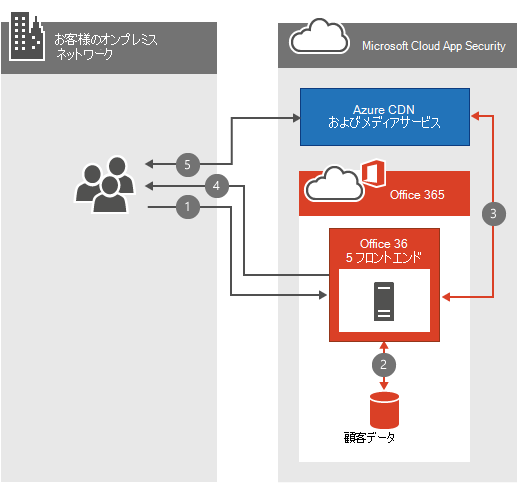

# Office 365 のビデオネットワークについてよく寄せられる質問Office 365 Video networking Frequently Asked Questions

Office 365 のビデオリポジトリおよびストリーミングサービスを使用すると、組織内のビデオを簡単に保存およびストリーミングすることができます。The Office 365 Video repository and streaming services make storing and streaming videos within your organization simple. [Office 365 ビデオについて](https://support.office.com/article/Find-help-about-Office-365-Video-b435f99a-f47e-4ebd-a946-f5c965844f50)多くの重要な情報があります。このネットワーク FAQ は、帯域幅の計画、暗号化、およびサービスが[コンテンツ配信ネットワーク](content-delivery-networks.md)(cdns) を活用する方法に関してよく寄せられる質問に回答するように設計されています。There's a lot of great [information about Office 365 Video](https://support.office.com/article/Find-help-about-Office-365-Video-b435f99a-f47e-4ebd-a946-f5c965844f50); this networking FAQ is designed to answer the most common questions around bandwidth planning, encryption, and how the service leverages [Content Delivery Networks](content-delivery-networks.md) (CDNs).
  
ビデオをアップロードまたは再生したときに何が起こるかを十分に理解していない場合は、このビデオをまとめたものとして、 [Office 365 のビデオにアップロードしたときにビデオファイル](https://www.youtube.com/watch?v=HXSZ0jYBKlM)がどうなるかを確認してください。If you don't already have a thorough understanding of what happens when a video is uploaded or played back, have a look at this video we put together, [What happens to a video file when uploaded to Office 365 Video](https://www.youtube.com/watch?v=HXSZ0jYBKlM).
  
## Office 365 のビデオ帯域幅の要件を教えてください。What are the Office 365 Video bandwidth requirements?

Office 365 にアップロードできる [サポートされているビデオ形式](https://support.office.com/article/dd1af01c-fd8e-4640-b17b-93ee02b9b817) は多数あります。There are a numerous [supported video formats](https://support.office.com/article/dd1af01c-fd8e-4640-b17b-93ee02b9b817) that can be uploaded to Office 365. 各ビデオファイルは、再生にさまざまなビデオ品質を持つ標準形式にエンコードされます。Each video file is then encoded to a standard format with several different video qualities for playback. Office 365 Video は、アダプティブビットレートのストリーミングを使用して、使用可能なネットワーク帯域幅とビデオプレーヤーのサイズに基づいて、最適なビデオ再生品質を選択します。Office 365 Video uses adaptive bitrate streaming to select the best video playback quality based on the available network bandwidth and size of the video player. これを行うために、player は最初に最小の再生品質を要求します。To do this, the player initially requests the lowest playback quality. その後、サービスは、2秒間のビデオセグメントをビデオプレーヤーに送信します。The service then begins sending 2-second video segments to the video player. プレーヤーは、各セグメントが配信される速度に基づいて、より高いまたは低い再生品質を要求できます。The player can then request higher or lower playback quality based on how quickly each segment is delivered.
  
アダプティブビットレートストリーミングでは、ビデオの再生が最小限に抑えられている間、バックグラウンドでこれらすべてが実行されます。The adaptive bitrate streaming does all this in the background while the video plays with the least amount of disruption or buffering. ビデオの再生中に、ビデオプレーヤーでは、視聴者が自動再生の品質を手動で上書きして、特定のビデオ再生品質を選択することができます。During video playback, the video player allows the viewer to manually override the automatic playback quality, to select a specific video playback quality.
  
ビデオ再生の各品質のネットワーク要件の概要を示すクイックテーブルを次に示します。Here's a quick table that outlines the network requirements for each of the video playback qualities. ビデオの再生に必要なユーザーあたりの最小帯域幅は802Kbps です。The minimum bandwidth per person needed to play a video is 802Kbps.
  
| 再生品質Playback Quality | ネットワークの速度Network Speed |
|:-----|:-----|
|288 p288p    |802Kbps802Kbps    |
|360p360p    |1.2 Mbps1.2 Mbps    |
|576p576p    |2.5 Mbps2.5 Mbps    |
|プログレッシブ720p    |3.8 Mbps3.8 Mbps    |

([トップに戻る](office-365-video-networking-faq.md))([Back to top](office-365-video-networking-faq.md))
  
## コンテンツ配信ネットワーク (CDNs) はどのようにビデオの再生をサポートしますか?How do Content Delivery Networks (CDNs) help video playback?

同じ地理的位置にある同じ組織の複数のユーザーが同じビデオをストリーミングしている場合、CDNs はその地域に近い場所にこれらのビデオのコピーを保存します。If several people from the same organization within the same geographic location are streaming the same video(s), CDNs will store a copy of these videos in a location closer to that geographic region. ビデオが保存されているか、最も近い場所にキャッシュされていると、各ユーザーは、その場所から離れた場所ではなく、最も近い場所からビデオをストリームします。With the video stored, or cached at the closest location, each person streams the video from the location closest to them instead of a location further away. Office 365 Video は、azure メディアサービスを使用して Azure CDNs にキャッシュされているものと、期間を管理します。Office 365 Video uses Azure Media Services to manage what is cached in the Azure CDNs, and for how long. Azure Media Services では、任意の [AZURE CDN の場所](https://azure.microsoft.com/documentation/articles/cdn-pop-locations/) を使用して、ビデオフラグメントとマニフェストを数日間キャッシュできます。Azure Media Services can use any of the [Azure CDN locations](https://azure.microsoft.com/documentation/articles/cdn-pop-locations/) to cache video fragments and manifests for a few days. 組織内のユーザーがキャッシュされたビデオを引き続き視聴する場合は、キャッシュに残ります。If people in your organization continue to watch the cached videos they'll stay in the cache. 何度もビデオにアクセスできない場合、ビデオは最終的にキャッシュから削除されます。If no one accesses the video for several days, the video will eventually drop be dropped from the cache. 次回、ユーザーがビデオを視聴しようとしたときに、それが最も近い CDN の場所で再びキャッシュされます。The next time someone attempts to watch the video it's once again cached at the nearest CDN location.
  
ビデオを視聴しようとしているすべてのユーザーは、ビデオの近くにある CDN の利点で、ビデオが近い場所にあることを示しています。Everyone who attempts to watch the video while the content is cached at a nearby CDN benefits from the video being closer, and in most cases less hops, away. これにより、ビデオの再生速度が向上します。ただし、ビデオを再生するためにネットワーク要件が変更されることはありません。This improves video playback speed; however, it doesn't change the network requirement to play the video.
  
> [!NOTE]
> 容量の制限に達しているなど、状況によっては、3日が経過する前にビデオが削除されることがあります。There are some circumstances, such as our capacity limit being reached, where the video may be removed before the three days has been reached.
  
([トップに戻る](office-365-video-networking-faq.md))([Back to top](office-365-video-networking-faq.md))
  
## 再生を高速化するためにビデオをローカルにキャッシュすることはできますか?Can I cache the videos locally for faster playback?

はい。Yes. Office 365 では、ローカル CDN またはキャッシュプロキシを使用して、アクセスを高速化するためにビデオやその他の Office 365 コンテンツをローカルネットワークに格納することはできません。Office 365 won't prevent you from using a local CDN or a caching proxy to bring video or other Office 365 content into your local network for faster access. ネットワークにローカルキャッシュソリューションを実装する方法はいくつかありますが、最も一般的な方法は、コンテンツをローカルにキャッシュするプロキシソリューションを使用する方法です。There are several ways to implement a local caching solution on your network, the most common method is to use a proxy solution that caches content locally. プロキシまたはプライベート CDN によってビデオフラグメントとマニフェストがキャッシュされた後、プロキシまたはプライベート CDN を経由してルーティングされるこれらのファイルへの要求は、インターネット上の場所から引き出されずにローカルキャッシュから取得されます。Once a proxy or private CDN has cached the video fragments and manifests, future requests for those files that route through the proxy or private CDN are pulled from the local cache and not pulled from an internet location. このようなソリューションを計画する際には、ネットワーク帯域幅、容量、ビデオ再生の同時実行を考慮します。Consider network bandwidth, capacity, and video playback concurrency during the planning of a solution like this.
  
([トップに戻る](office-365-video-networking-faq.md))([Back to top](office-365-video-networking-faq.md))
  
## ビデオを暗号化してセキュリティで保護する方法How videos are encrypted and secured?

Office 365 Video は、データのセキュリティを確保し、プライベートにすることが重要であることを認識しています。Office 365 Video knows how important it is to keep your data secure and private. [Microsoft Trust Center](https://products.office.com/business/office-365-trust-center-welcome) は、コンテンツのプライバシーとセキュリティに対するコミットメントについて説明します。[Microsoft Trust Center](https://products.office.com/business/office-365-trust-center-welcome) describes our commitment to the privacy and security of your content. ビデオの再生では、パフォーマンスを向上させるには速度が重要です。しかし、exchange のセキュリティやプライバシーをスピードアップすることはありません。With video playback, speed is important for a good experience; however, we don't compromise your security or privacy in exchange for speed. スピード、セキュリティ、プライバシーに対応する方法を次に示します。Here's how we accommodate speed, security and privacy.
  
組織内のユーザーが新しいビデオをアップロードすると、そのビデオはトランスコードされ、AES-128 暗号化によって暗号化され、Azure Media Services に格納されます。When you or someone in your organization uploads a new video, that video is transcoded, encrypted with AES-128 encryption, and stored in Azure Media Services. これは、送信中と保存中の両方のビデオが暗号化されることを意味します。This means the videos are encrypted both in transit and at rest.
  
組織内の誰かが新しいビデオを視聴しようとすると、次の手順に従います。When someone in your organization attempts to watch a new video, they follow these steps:
  
1. ビデオを表示する権限がある場合は、SharePoint Online にお問い合わせください。Ask SharePoint Online if they have permission to view the video.

2. SharePoint Online は、ファイルのアクセス許可を使用して、ユーザーがビデオを視聴できるかどうかを判断します。SharePoint Online uses the file permissions to determine if the person can watch the video.

3. 許可されている場合、SharePoint Online は、ビデオプレーヤーに提供するために Azure からトークンを取得します。If they're allowed, SharePoint Online retrieves a token from Azure to give to the video player.

4. その後、ビデオプレーヤーは、トークンを使用して Azure の復号化キーを要求します。The video player then uses the token to request the decryption key from Azure.

5. 復号キーが手元にある場合、ビデオプレーヤーはビデオをストリームできます。With the decryption key in hand, the video player is able to stream the video.

  
([トップに戻る](office-365-video-networking-faq.md))([Back to top](office-365-video-networking-faq.md))
  
## Office 365 ビデオを再生するための要件What are the requirements to playback Office 365 Video?

Office 365 のビデオサポートされているオペレーティングシステムと web ブラウザーは、 [office 365 のシステム要件](https://support.office.com/article/Office-365-system-requirements-719254c0-2671-4648-9c84-c6a3d4f3be45)である SharePoint Online の要件と同じです。Office 365 Video supported operating systems and web browsers are the same as the SharePoint Online requirements in [Office 365 system requirements](https://support.office.com/article/Office-365-system-requirements-719254c0-2671-4648-9c84-c6a3d4f3be45). 使用しているオペレーティングシステムと web ブラウザーの構成に応じて、ビデオプレーヤーの特定のニーズが決まります。Depending on which operating system and web browser configuration you have will determine the specific needs of the video player. [ビデオ再生の要件](https://support.office.com/article/ca1cc1a9-a615-46e1-b6a3-40dbd99939a6)の詳細については、以下を参照してください。Here's more information on [video playback requirements](https://support.office.com/article/ca1cc1a9-a615-46e1-b6a3-40dbd99939a6).
  
([トップに戻る](office-365-video-networking-faq.md))([Back to top](office-365-video-networking-faq.md))
  
## Office 365 ビデオをご利用いただけません。どこから始めるべきですか?I can't get Office 365 video to work, where should I start?

Office 365 ビデオへの接続のトラブルシューティングでは、ネットワーク、ISP、および Office 365 の構成に関するトラブルシューティングを行います。Troubleshooting connectivity to Office 365 Video involves troubleshooting your network, your ISP(s), and your configuration of Office 365. 最初に開始する場所は、サービス正常性ダッシュボードです。The first place to start is the service health dashboard. これにより、Office 365 のビデオで問題が発生しているかどうかがわかります。This will tell you of Office 365 Video is having a problem or not. すべてがすばらしいのであれば、次のような追加のリソースを参照してください。If everything looks great there, here's some additional resources to help you.
  
- [Office 365 のビデオに必要なネットワークエンドポイント](https://support.office.com/article/Office-365-URLs-and-IP-address-ranges-8548a211-3fe7-47cb-abb1-355ea5aa88a2)に接続できることを確認してください。Make sure you can connect to the [network endpoints required for Office 365 Video](https://support.office.com/article/Office-365-URLs-and-IP-address-ranges-8548a211-3fe7-47cb-abb1-355ea5aa88a2).

- [Office 365 ネットワークトラブルシューティングガイド](https://support.office.com/article/Office-365-performance-tuning-and-troubleshooting-Admin-and-IT-Pro-1492cb94-bd62-43e6-b8d0-2a61ed88ebae)を使用して、ネットワーク接続を確認します。Check your network connectivity using our [Office 365 network troubleshooting guide](https://support.office.com/article/Office-365-performance-tuning-and-troubleshooting-Admin-and-IT-Pro-1492cb94-bd62-43e6-b8d0-2a61ed88ebae).

- [低速のネットワークで Office 365 を使用するためのベストプラクティス](https://support.office.com/article/Best-practices-for-using-Office-365-on-a-slow-network-fd16c8d2-4799-4c39-8fd7-045f06640166)を参照してください。See our [best practices for using Office 365 on a slow network](https://support.office.com/article/Best-practices-for-using-Office-365-on-a-slow-network-fd16c8d2-4799-4c39-8fd7-045f06640166).

- [Office 365 のビデオ構成に関するヘルプを参照して](https://support.office.com/article/Find-help-about-Office-365-Video-b435f99a-f47e-4ebd-a946-f5c965844f50)ください。[Find help about Office 365 Video configuration](https://support.office.com/article/Find-help-about-Office-365-Video-b435f99a-f47e-4ebd-a946-f5c965844f50).

([トップに戻る](office-365-video-networking-faq.md))([Back to top](office-365-video-networking-faq.md))
  
## Office 365 のビデオリソースOffice 365 Video resources

Office 365 ビデオを正常に展開して使用するために役立つその他のリソースを以下に示します。Here's a few other resources to help you successfully deploy and use Office 365 Video:
  
[Office 365 のビデオ構成に関するヘルプを参照するFind help about Office 365 Video configuration](https://support.office.com/article/Find-help-about-Office-365-Video-b435f99a-f47e-4ebd-a946-f5c965844f50)
  
[Office 365 ビデオを利用するMeet Office 365 Video](https://support.office.com/article/Meet-Office-365-Video-ca1cc1a9-a615-46e1-b6a3-40dbd99939a6)
  
[Office 365 でチャネルを作成および管理するビデオCreate and manage a channel in Office 365 Video](https://support.office.com/article/Create-and-manage-a-channel-in-Office-365-Video-1fede4cc-13c0-435a-b585-e7fbf1c83bb2)
  
[Office 365 ビデオ ポータルを管理するManage your Office 365 Video portal](https://support.office.com/article/Manage-your-Office-365-Video-portal-c059465b-eba9-44e1-b8c7-8ff7793ff5da)
  
[Office 365 のビデオで使用できるビデオ形式Video formats that work in Office 365 Video](https://support.office.com/article/Video-formats-that-work-in-Office-365-Video-dd1af01c-fd8e-4640-b17b-93ee02b9b817)
  
([トップに戻る](office-365-video-networking-faq.md))([Back to top](office-365-video-networking-faq.md))
  
ここに戻る場合は、次の短いリンクをご利用ください: [https://aka.ms/video365networkfaq](https://aka.ms/video365networkfaq)Here's a short link you can use to come back: [https://aka.ms/video365networkfaq](https://aka.ms/video365networkfaq)
