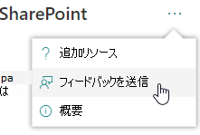
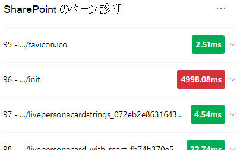
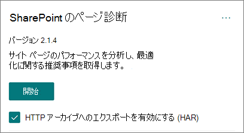
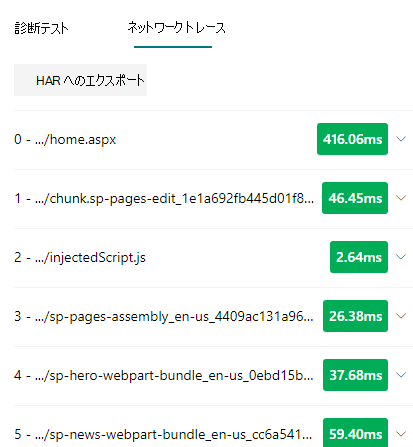
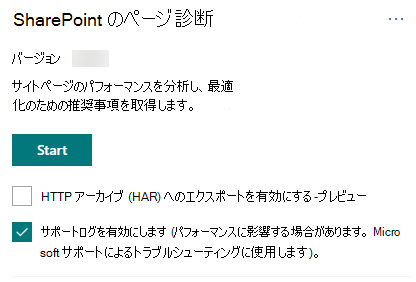

# SharePoint ツールのページ診断を使用する

この記事では、**SharePoint 用ページ診断ツール** を使用して、定義済みの一連のパフォーマンス条件に対して、SharePoint Online のモダン サイト ページとクラシック サイト ページを分析する方法について説明します。

SharePoint ツールのページ診断は、次の目的でインストールできます。

- **Microsoft Edge** [(Edge 拡張機能)](https://microsoftedge.microsoft.com/addons/detail/ocemkolpnamjcacndljdfmhlpcaoipji)
- **Chrome** [(Chrome 拡張機能)](https://chrome.google.com/webstore/detail/inahogkhlkbkjkkaleonemeijihmfagi)

>[!TIP]
>バージョン **2.0.0** 以降には、クラシック サイト ページに加えて、モダン ページのサポートが含まれています。 使用しているツールのバージョンがわからない場合は、[ **バージョン情報** ] リンクまたは省略記号 (...) を選択して、バージョンを確認できます。 ツール **を使用する場合は、常に最新バージョンに更新** してください。

SharePoint 用ページ診断ツールは、新しい Microsoft Edge (https://www.microsoft.com/edge) と Chrome のブラウザー拡張機能であり、SharePoint Online の最新ポータルと従来の発行サイト ページの両方を分析します。 このツールは、SharePoint Online でのみ機能し、SharePoint システム ページでは使用できません。

このツールは、定義済みのルール セットに対してページがどのように実行されるかを示す分析済みページごとにレポートを生成し、テストの結果が基準値から外れたときに詳細情報を表示します。 SharePoint Online の管理者とデザイナーは、このツールを使用してパフォーマンスの問題をトラブルシューティングし、発行前に新しいページが最適化されるようにすることができます。

ページ診断ツールは、*allitems.aspx* や *sharepoint.aspx* などのシステム ページではなく、SharePoint サイト ページのみを分析するように設計されています。 システム ページまたはその他のサイト以外のページでツールを実行しようとすると、その種類のページに対してツールを実行できないことを示すエラー メッセージが表示されます。

> [!div class="mx-imgBorder"]
> 

これは、ライブラリまたはシステム ページの評価に値がないため、ツールのエラーではありません。 ツールを使用するには、SharePoint サイト ページに移動してください。 SharePoint ページでこのエラーが発生した場合は、マスター ページを確認して、SharePointメタタグが削除されていないことを確認してください。

ツールに関するフィードバックを提供するには、ツールの右上隅にある省略記号を選択し、[ [フィードバックの提供](https://go.microsoft.com/fwlink/?linkid=874109)] を選択します。

> [!div class="mx-imgBorder"]
> 
  
## SharePoint ツールのページ診断をインストールする

このセクションのインストール手順は、Chrome ブラウザーとMicrosoft Edge ブラウザーの両方で機能します。

> [!IMPORTANT]
> Microsoft は、SharePoint 用ページ診断ツールによって分析されたデータまたはページ コンテンツを読み取りません。また、個人情報、Web サイト、またはダウンロード情報をキャプチャすることはありません。 ツールによって Microsoft に記録される唯一の識別可能な情報は、テナント名、失敗したルールの数、およびツールが実行された日時です。 この情報は、最新のポータルと発行サイトの使用状況の傾向と一般的なパフォーマンスの問題をよりよく理解するために Microsoft によって使用されます。

1. Microsoft Edge [(Edge 拡張機能)](https://microsoftedge.microsoft.com/addons/detail/ocemkolpnamjcacndljdfmhlpcaoipji) または **Chrome** [(Chrome](https://chrome.google.com/webstore/detail/inahogkhlkbkjkkaleonemeijihmfagi) 拡張機能) 用 **の SharePoint** 用ページ診断ツールをインストールします。 ストアの説明ページで提供されているユーザー プライバシー ポリシーを確認してください。 ブラウザーにツールを追加すると、次のアクセス許可に関する通知が表示されます。

    > [!div class="mx-imgBorder"]
    > 

    この通知は、ページの Web パーツやカスタマイズによっては、SharePointの外部の場所からのコンテンツがページに含まれる可能性があるためです。 つまり、ツールは、スタート ボタンがクリックされたときに要求と応答を読み取り、ツールが実行されているアクティブなSharePoint タブに対してのみ読み取られます。 この情報は Web ブラウザーによってローカルにキャプチャされ、ツールの _[ネットワーク トレース_] タブの [**JSON にエクスポート**] または [**HAR にエクスポート**] ボタンを使用して使用できます。**情報は Microsoft に送信またはキャプチャされません。** (このツールは、ここでアクセスできる Microsoft のプライバシー ポリシーを尊重 [します](https://go.microsoft.com/fwlink/p/?linkid=857875)。

    _ダウンロードの管理_ アクセス許可には、ツールの **JSON へのエクスポート** 機能の使用が含まれます。 組織外で JSON ファイルを共有する前に、会社独自のプライバシー ガイドラインに従ってください。結果には URL が含まれており、PII (個人を特定できる情報) として分類できます。
1. Incognito または InPrivate モードでツールを使用する場合は、ブラウザーの手順に従います。
    1. Microsoft Edgeで、[**拡張機能]** に移動するか、URL バー _に「edge://extensions_」と入力し、拡張機能の **[詳細**] を選択します。 拡張機能の設定で、 **InPrivate で許可** のチェック ボックスをオンにします。
    1. Chrome で、[ **拡張機能]** に移動するか、URL バー _に「chrome://extensions_ 」と入力し、拡張機能の **[詳細** ] を選択します。 拡張機能の設定 **で、Incognito で許可** のスライダーを選択します。
1. 確認するオンラインSharePoint SharePoint サイト ページに移動します。 ページ上の項目の "読み込み遅延" を許可しました。そのため、ツールは自動的には停止しません (これは、すべてのページ読み込みシナリオに対応するように設計されています)。 コレクションを停止するには、[ **停止**] を選択します。 データ収集を停止する前に、ページの読み込みが完了しているか、部分的なトレースのみをキャプチャすることを確認します。
1. 拡張機能のツール バー ボタンをクリックする  ツールを読み込むには、次の拡張機能ポップアップ ウィンドウが表示されます。

    

[ **開始]** を選択して、分析用のデータの収集を開始します。

## SharePoint ツールのページ診断に表示される内容

1. ツールの右上隅にある省略記号 (...) をクリックすると、次のリンクが表示されます。
   1. **[その他のリソース]** リンクには、この記事へのリンクを含むツールに関する一般的なガイダンスと詳細が記載されています。
   1. **フィードバックの提供** リンクには、_SharePoint サイトとコラボレーション ユーザー音声_ サイトへのリンクが用意されています。
   1. **[バージョン情報]** リンクには、現在インストールされているツールのバージョンと、ツールのサード パーティの通知への直接リンクが含まれます。  
1. **関連付け ID、SPRequestDuration、SPIISLatency**、**ページ読み込み時間**、**URL** の詳細は情報であり、いくつかの目的で使用できます。

    > [!div class="mx-imgBorder"]
    > 

   - **CorrelationID** は、特定のページの追加の診断データを収集できるため、Microsoft サポートを操作するときに重要な要素です。
   - **SPRequestDuration** は、SharePointがページを処理するのにかかった時間です。 構造ナビゲーション、大きな画像、多くの API 呼び出しは、すべて、より長い期間に寄与する可能性があります。
   - **SPIISLatency** は、SharePoint Online がページの読み込みを開始するまでの時間 (ミリ秒単位) です。 この値には、Web アプリケーションが応答するまでの時間は含まれません。
   - **ページ読み込み時間** は、要求の時刻からブラウザーで応答が受信およびレンダリングされた時刻までのページによって記録された合計時間です。 この値は、ネットワーク待機時間、コンピューターのパフォーマンス、ブラウザーがページを読み込むのにかかる時間など、さまざまな要因の影響を受けます。
   - **ページ URL** (Uniform Resource Locator) は、現在のページの Web アドレスです。

1. [ [**診断テスト**](#how-to-use-the-diagnostic-tests-tab) ] タブには、分析結果が 3 つのカテゴリに表示されます。 **アクションは必要ありません**。 **改善の機会** と **注意が必要です**。 各テスト結果は、次の表に示すように、これらのカテゴリの 1 つの項目によって表されます。

    |カテゴリ  |色  |説明  |
    |---------|---------|---------|
    |**注意が必要** |赤 |テスト結果が基準値を下回り、ページのパフォーマンスに影響を与えています。 修復ガイダンスに従います。|
    |**改善の機会** |黄 |テスト結果が基準値を下回り、パフォーマンスの問題に貢献している可能性があります。 テスト固有の条件が適用される場合があります。|
    |**操作は不要** |緑 |テスト結果は、テストの基準値に含まれます。|

    > [!div class="mx-imgBorder"]
    > 

1. [**[ネットワーク トレース**](#how-to-use-the-network-trace-tab-and-how-to-export-a-har-file)] タブには、ページ ビルドの要求と応答に関する詳細が表示されます。

## [診断テスト] タブを使用する方法

SharePoint用ページ診断ツールを使用してSharePointモダン ポータル ページまたはクラシック発行サイト ページを分析すると、結果がベースライン値と比較され、[**診断テスト**] タブに表示される定義済みのルールを使用して分析されます。特定のテストのルールでは、特定のパフォーマンスに応じて、最新のポータルサイトとクラシック発行サイトで異なる基準値が使用される場合があります 特性は 2 つの特性で異なります。

**改善の機会** または **注意が必要な** カテゴリに表示されるテスト結果は、推奨されるプラクティスに対してレビューする必要がある領域を示し、結果に関する追加情報を表示するために選択できます。 各項目の詳細には、テストに関連する適切なガイダンスに直接アクセスする _詳細情報_ のリンクが含まれています。 **[アクションが必要ありません**] カテゴリに表示されるテスト結果は、関連するルールに準拠していることを示し、選択した場合は追加の詳細を表示しません。

[診断テスト] タブの情報では、ページを設計する方法は示されませんが、ページのパフォーマンスに影響を与える可能性のある要因が強調表示されます。 一部のページの機能とカスタマイズは、ページのパフォーマンスに避けられない影響を与えます。影響が大きい場合は、ページからの潜在的な修復または省略について確認する必要があります。

赤または黄色の結果は、データを更新する頻度が高すぎる Web パーツを示す場合もあります。 たとえば、企業ニュースは 1 秒ごとに更新されるわけではありませんが、ユーザー エクスペリエンス全体を向上させる可能性のあるキャッシュ要素を実装する代わりに、1 秒ごとに最新のニュースをフェッチするようにカスタム Web パーツが構築されることがよくあります。 ページに Web パーツを含める場合は、使用可能な各パラメーターの値を評価して、目的に合わせて適切に設定することで、パフォーマンスへの影響を軽減する簡単な方法が多い点に注意してください。

>[!NOTE]
>発行機能が有効になっていないクラシック チーム サイトでは、CDN を使用できません。 これらのサイトでツールを実行すると、CDN テストは失敗することが予想され、無視できますが、残りのテストはすべて該当します。 SharePoint発行機能の追加機能により、ページの読み込み時間が長くなる可能性があるため、CDN機能を許可するだけでは有効にしないでください。

>[!IMPORTANT]
>テスト ルールは定期的に追加および更新されるため、現在のルールとテスト結果に含まれる特定の情報の詳細については、ツールの最新バージョンを参照してください。 拡張機能を管理することでバージョンを確認できます。拡張機能は更新プログラムが利用可能かどうかを示します。

## [ネットワーク トレース] タブを使用する方法と、HAR ファイルをエクスポートする方法

[**ネットワーク トレース**] タブには、ページをビルドするための要求と、SharePointから受信した応答の両方に関する詳細情報が表示されます。

1. **赤のフラグが設定されたアイテムの読み込み時間を探します**。 各要求と応答は、次の待機時間メトリックを使用して、ページ全体のパフォーマンスに与える影響を示すために色分けされています。
    - 緑: \< 500 ミリ秒
    - 黄色: 500 ~ 1000 ミリ秒
    - 赤: \> 1000 ミリ秒

    > [!div class="mx-imgBorder"]
    > 

    上の図では、赤い項目が既定のページに関連しています。 ページが 1000 ミリ秒 (1 秒未満) で \< 読み込まれない限り、常に赤で表示されます。

2. **テスト 項目の読み込み時間**。 場合によっては、アイテムがブラウザーによって既にキャッシュされているため、時間インジケーターや色インジケーターが表示されない場合があります。 これを正しくテストするには、ページを開き、ブラウザー キャッシュをクリアし、[ **開始]** をクリックすると"コールド" ページが強制的に読み込まれ、最初のページ読み込みが正しく反映されます。 これは、ページにキャッシュされている項目を決定するのに役立つため、"ウォーム" ページの読み込みと比較する必要があります。

3. **問題の調査に役立つ他のユーザーと関連する詳細を共有** します。 ツールで提供される詳細または情報を開発者またはテクニカル サポート担当者と共有するには、 **HTTP アーカイブ (HAR) へのエクスポートを有効にする** 方法をお勧めします。 

   > [!div class="mx-imgBorder"]
   > 

これは、[スタート] をクリックする前に有効にする必要があります。これにより、ブラウザーでデバッグ モードが有効になります。 HTTP アーカイブ ファイル (HAR) が生成され、"ネットワーク トレース" タブからアクセスできます。[HAR にエクスポート] をクリックすると、ファイルがコンピューターにダウンロードされ、それに応じて共有できます。 このファイルは、F12 Developer Tools や Fiddler など、さまざまなデバッグ ツールで開くことができます。

> [!div class="mx-imgBorder"]
> 

> [!IMPORTANT]
> これらの結果には URL が含まれており、PII (個人を特定できる情報) として分類できます。 その情報を配布する前に、必ず組織のガイドラインに従ってください。

## Microsoft サポートと連携する

サポート ケースで直接作業する場合にのみ使用する必要がある **、Microsoft サポート レベルの機能** が含まれています。 この機能を使用すると、サポート チームの関与なしに使用してもメリットは得られないので、ページのパフォーマンスが大幅に低下する可能性があります。 この機能をツールで使用する場合、サービスのログに追加情報が追加されるため、追加情報はありません。

変更は表示されませんが、有効にした場合にページのパフォーマンスが 2 ~ 3 倍低下し、パフォーマンスが大幅に低下します。 これは、特定のページとそのアクティブなセッションにのみ関連します。 このため、これは慎重に使用し、積極的にサポートに従事している場合にのみ使用する必要があります。

### Microsoft サポート レベル機能を有効にするには

1. SharePoint ツールのページ診断を開きます。
2. キーボードで **Alt キーを押しながら Shift キーを押しながら L キーを押します**。 [ **サポート ログを有効にする** ] チェック ボックスが表示されます。
3. チェック ボックスをオンにし、[ **開始** ] をクリックしてページを再読み込みし、詳細ログを生成します。

   > [!div class="mx-imgBorder"]
   > 
  
    (ツールの上部に表示される) CorrelationID をメモし、サポート担当者に提供して、診断セッションに関する追加情報を収集できるようにする必要があります。

## 関連項目

[SharePoint Online のパフォーマンスをチューニングする](tune-sharepoint-online-performance.md)

[Office 365 のパフォーマンスをチューニングする](tune-microsoft-365-performance.md)

[SharePoint のモダン エクスペリエンスにおけるパフォーマンス](/sharepoint/modern-experience-performance)

[コンテンツ配信ネットワーク](content-delivery-networks.md)

[SharePoint Online での Office 365 コンテンツ配信ネットワーク (CDN) の使用](use-microsoft-365-cdn-with-spo.md)