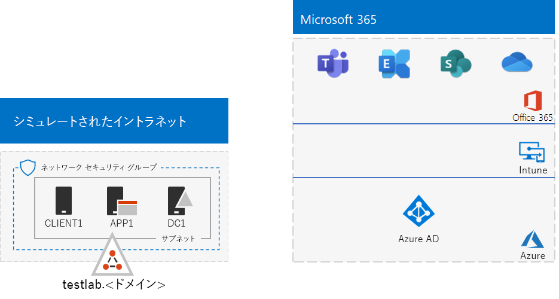

# <a name="password-hash-synchronization-for-your-microsoft-365-test-environment"></a>Microsoft 365 テスト環境のパスワード ハッシュ同期

*このテスト ラボ ガイドは、エンタープライズ環境とテスト環境Microsoft 365両方Office 365 Enterprise使用できます。*

多くの組織では、Azure AD Connect とパスワード ハッシュ同期を使用して、オンプレミスの Active Directory Domain Services (AD DS) フォレスト内のアカウント セットを、Microsoft 365 サブスクリプションの Azure AD テナント内のアカウント セットに同期します。 

この記事では、テスト環境にパスワード ハッシュ同期を追加する方法Microsoft 365説明します。この構成になります。
  

  
このテスト環境のセットアップには、次の 3 つのフェーズがあります。
- [フェーズ 1: Microsoft 365 のシミュレートされたエンタープライズ テスト環境を作成する](#phase-1-create-the-microsoft-365-simulated-enterprise-test-environment)
- [フェーズ 2: testlab ドメインを作成および登録する](#phase-2-create-and-register-the-testlab-domain)
- [フェーズ 3: APP1 に Azure AD Connect をインストールする](#phase-3-install-azure-ad-connect-on-app1)
    
> [!TIP]
> エンタープライズ テスト ラボ ガイド スタックの Microsoft 365 内のすべての記事への視覚的なマップについては、「Microsoft 365 テスト ラボ ガイド スタック」[を参照してください](../downloads/Microsoft365EnterpriseTLGStack.pdf)。
  
## <a name="phase-1-create-the-microsoft-365-simulated-enterprise-test-environment"></a>フェーズ 1: Microsoft 365 のシミュレートされたエンタープライズ テスト環境を作成する

シミュレーションされたエンタープライズ ベース構成[の手順に](simulated-ent-base-configuration-microsoft-365-enterprise.md)従って、Microsoft 365。 結果の構成は次のように表示されます。
  

  
この構成は、次の内容で成立します。
  
- Microsoft 365 E5 の試用版または有料サブスクリプション。
- Azure 仮想ネットワーク内の DC1、APP1、および CLIENT1 仮想マシンで構成される、インターネットに接続された簡略化された組織イントラネット。 DC1 は、パブリック ドメイン名を DS ドメイン< testlab.> ADコントローラーです。

## <a name="phase-2-create-and-register-the-testlab-domain"></a>フェーズ 2: testlab ドメインを作成および登録する

このフェーズでは、パブリック DNS ドメインを追加し、サブスクリプションに追加します。

まず、パブリック DNS 登録プロバイダーと一緒に、現在のドメイン名に基DNS ドメイン新しいパブリック ドメイン名を作成し、サブスクリプションに追加します。 パブリック ドメインに **testlab.<*を使用することをお勧めします* >**。 たとえば、パブリック ドメイン名が **<span>contoso</span>.com** の場合は、パブリック ドメイン名 **<span>testlab</span>.contoso.com を追加します**。
  
次に、ドメイン登録プロセスを<して、パブリック ドメイン ドメインの **testlab.Microsoft 365 >** 試用版または有料サブスクリプションに追加します。 これは、パブリック ドメイン ドメインの **testlab.<DNS レコードを追加 *することで構成* >** されます。 詳細については、「Add [a domain to Microsoft 365」 を参照してください](../admin/setup/add-domain.md)。

結果の構成は次のように表示されます。
  

  
この構成は、次の内容で成立します。

- testlab.Microsoft 365 E5の試用版または有料サブスクリプションDNS ドメイン、<ドメイン名が>されます。 
- Azure 仮想ネットワークのサブネット上の DC1、APP1、および CLIENT1 仮想マシンで構成される、インターネットに接続された簡略化された組織イントラネット。

testlab.<*パブリック* ドメイン>に注意してください。

- パブリック DNS レコードによるサポート。
- Microsoft 365 サブスクリプションに登録済み。
- シミュレートされたイントラネット上の AD DS ドメイン。
     
## <a name="phase-3-install-azure-ad-connect-on-app1"></a>フェーズ 3: APP1 に Azure AD Connect をインストールする

このフェーズでは、APP1 に Azure AD Connectツールをインストールして構成し、動作を確認します。
  
最初に、APP1 に Azure AD Connectをインストールして構成します。

1. [Azure portal](https://portal.azure.com) から、全体管理者アカウントでサインインします。その後、TESTLAB\\User1 アカウントで APP1 に接続します。
    
2. APP1 のデスクトップから、管理者レベルの Windows PowerShell コマンド プロンプトを起動して、次に示すコマンドを実行して Internet Explorer セキュリティ強化を無効にします。
    
   ```powershell
   Set-ItemProperty -Path "HKLM:\SOFTWARE\Microsoft\Active Setup\Installed Components\{A509B1A7-37EF-4b3f-8CFC-4F3A74704073}" -Name "IsInstalled" -Value 0
   Set-ItemProperty -Path "HKLM:\SOFTWARE\Microsoft\Active Setup\Installed Components\{A509B1A8-37EF-4b3f-8CFC-4F3A74704073}" -Name "IsInstalled" -Value 0
   Stop-Process -Name Explorer -Force
   ```

3. タスク バーで 、[タスク バー] **をInternet Explorer** に移動します [https://aka.ms/aadconnect](https://aka.ms/aadconnect) 。
    
4. [ファイルのMicrosoft Azure Active Directory Connect] ページで、[**ダウンロード] を選択し**、[実行] を **選択します**。
    
5. [Azure **へのようこそ] ページAD Connect** 同意する] を選択し、[続行] を **選択します**。
    
6. [Express 設定]**ページで、[** 高速設定を **使用する] を選択します**。
    
7. [Azure **ConnectにAD]** ページで、[ユーザー名] にグローバル管理者アカウント名を入力し、[パスワード]にパスワードを入力し、[次へ] を選択 **します**。
    
8. [DS の **ConnectするADで**、[ユーザー名] に **「TESTLAB \\ User1」** と入力し、[パスワード] にパスワードを入力し、[次へ] を選択 **します**。 
    
9. [構成の **準備完了] ページで、[** インストール] を **選択します**。
    
10. [構成の **完了] ページで** 、[終了] を **選択します**。
    
11. Internet Explorer で Microsoft 365 管理センター ([https://portal.microsoft.com](https://portal.microsoft.com)) に移動します。
    
12. 左側のナビゲーション ウィンドウで、[アクティブ ユーザー] **を選択>選択します**。
    
    **User1** という名前のアカウントを記録します。 これは TESTLAB AD DS ドメインからのアカウントであり、ディレクトリ同期が機能していることを証明します。
    
13. **[User1] アカウントを選択** し、[ライセンスとアプリ **] を選択します**。
    
14. [**製品ライセンス]** で、場所 (必要に応じて) を選択し、Office 365 E5ライセンスを無効にしてから、Microsoft 365 E5 **します。** 

15. ページ **の下部** にある [保存] を選択し、[閉じる] を **選択します**。
    
次に、User1 アカウントのドメイン名ユーザー名 **user1@testlab.< > を** 使用してサブスクリプションにサインインする機能をテストします。

1. APP1 からサインアウトし、その後サインインし直しますが、そのときに別のアカウントを指定します。

2. ユーザー名とパスワードの入力を求めるメッセージが表示されたら、ドメイン **user1@testlab.< >** User1 パスワードを指定します。 User1 として正常にサインインできるはずです。
 
User1 は、TESTLAB AD DS ドメインのドメイン管理者のアクセス許可を持っていますが、グローバル管理者ではないことをご注意ください。 そのため、**[管理者]** アイコンはオプションとして表示されません。 

結果の構成は次のように表示されます。


この構成は、次の内容で成立します。 
  
- Microsoft 365 E5、Office 365 E5 TESTLAB.DNS ドメインを使用して試用版または有料サブスクリプション<登録 *>* します。
- Azure 仮想ネットワークのサブネット上の DC1、APP1、および CLIENT1 仮想マシンで構成される、インターネットに接続された簡略化された組織イントラネット。 AZURE AD Connect APP1 で実行され、TESTLAB AD DS ドメインを、ADサブスクリプションの Azure ADテナントにMicrosoft 365します。
- TESTLAB AD DS ドメインの User1 アカウントは、Azure AD テナントと同期されています。

## <a name="next-step"></a>次の手順

テスト環境の追加の [ID](m365-enterprise-test-lab-guides.md#identity) 機能について調べます。

## <a name="see-also"></a>関連項目

[Microsoft 365 Enterprise のテスト ラボ ガイド](m365-enterprise-test-lab-guides.md)

[Microsoft 365 for Enterprise の概要](microsoft-365-overview.md)

[Microsoft 365 for enterprise のドキュメント](/microsoft-365-enterprise/)