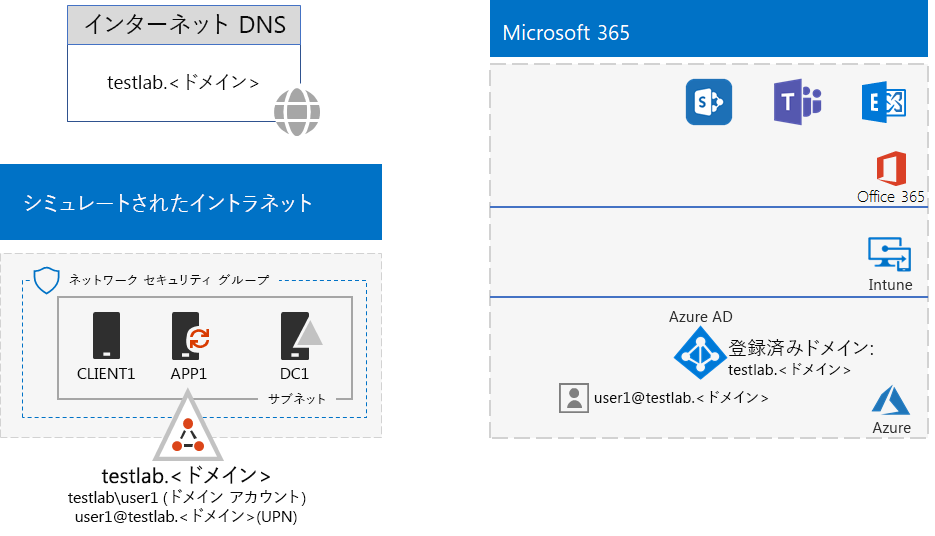
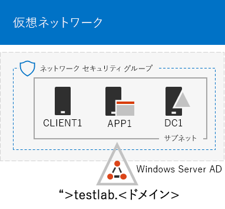
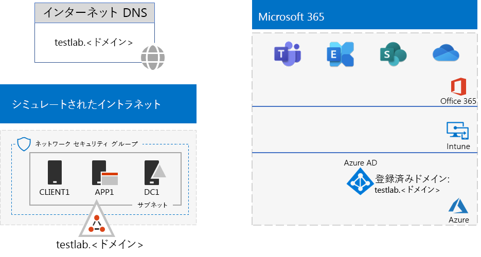

# <a name="password-hash-synchronization-for-your-microsoft-365-test-environment"></a><span data-ttu-id="253a8-103">Microsoft 365 テスト環境のパスワード ハッシュ同期</span><span class="sxs-lookup"><span data-stu-id="253a8-103">Password hash synchronization for your Microsoft 365 test environment</span></span>

<span data-ttu-id="253a8-p101">多くの組織は、Azure AD Connect とパスワード ハッシュ同期を使用して、オンプレミスの Windows Server Active Directory (AD) フォレスト内のアカウントのセットを Office 365 と EMS E5 サブスクリプションの Azure AD テナント内のアカウントのセットに同期しています。この記事では、Microsoft 365 テスト環境にパスワード ハッシュ同期を追加する方法について説明します。最終的な構成は、次のとおりになります。</span><span class="sxs-lookup"><span data-stu-id="253a8-p101">Many organizations use Azure AD Connect and password hash synchronization to synchronize the set of accounts in their on-premises Windows Server Active Directory (AD) forest to the set of accounts in the Azure AD tenant of their Office 365 and EMS E5 subscriptions. This article describes how you can add password hash synchronization to your Microsoft 365 test environment, resulting in the following configuration:</span></span>
  

  
<span data-ttu-id="253a8-107">このテスト環境は、次に示す 2 つのフェーズで設定します。</span><span class="sxs-lookup"><span data-stu-id="253a8-107">There are two phases to setting up this test environment:</span></span>
  
1. <span data-ttu-id="253a8-108">Microsoft 365 のシミュレートされたエンタープライズ テスト環境を作成する。</span><span class="sxs-lookup"><span data-stu-id="253a8-108">Create the Microsoft 365 simulated enterprise test environment.</span></span>
2. <span data-ttu-id="253a8-109">APP1 に Azure AD Connect をインストールして構成する。</span><span class="sxs-lookup"><span data-stu-id="253a8-109">Install and configure Azure AD Connect on APP1.</span></span>
    
> [!TIP]
> <span data-ttu-id="253a8-110">[ここ](https://aka.ms/m365etlgstack)をクリックして、Microsoft 365 Enterprise のテスト ラボ ガイド スタックに含まれるすべての記事のビジュアル マップを確認してください。</span><span class="sxs-lookup"><span data-stu-id="253a8-110">Click [here](https://aka.ms/m365etlgstack) for a visual map to all the articles in the Microsoft 365 Enterprise Test Lab Guide stack.</span></span>
  
## <a name="phase-1-create-the-microsoft-365-simulated-enterprise-test-environment"></a><span data-ttu-id="253a8-111">フェーズ 1: Microsoft 365 のシミュレートされたエンタープライズ テスト環境を作成する</span><span class="sxs-lookup"><span data-stu-id="253a8-111">Phase 1: Create the Microsoft 365 simulated enterprise test environment</span></span>

<span data-ttu-id="253a8-p102">「[Microsoft 365 用のシミュレートされたエンタープライズ基本構成](simulated-ent-base-configuration-microsoft-365-enterprise.md)」の手順を実行します。次に、最終的な構成を示します。</span><span class="sxs-lookup"><span data-stu-id="253a8-p102">Follow the instructions in [simulated enterprise base configuration for Microsoft 365](simulated-ent-base-configuration-microsoft-365-enterprise.md). Here is your resulting configuration.</span></span>
  

  
<span data-ttu-id="253a8-115">この構成は、次の内容で構成されます:</span><span class="sxs-lookup"><span data-stu-id="253a8-115">This configuration consists of:</span></span> 
  
- <span data-ttu-id="253a8-116">Office 365 E5 および EMS E5 試用版または永続的なサブスクリプション。</span><span class="sxs-lookup"><span data-stu-id="253a8-116">Office 365 E5 and EMS E5 trial or permanent subscriptions.</span></span>
- <span data-ttu-id="253a8-p103">インターネットに接続している組織の簡易型イントラネット。Azure 仮想ネットワーク内の 3 つの仮想マシン (DC1、APP1、および CLIENT1) で構成されます。DC1 は、testlab.\<パブリック ドメイン名> Windows Server AD のドメイン コントローラーです。</span><span class="sxs-lookup"><span data-stu-id="253a8-p103">A simplified organization intranet connected to the Internet, consisting of the DC1, APP1, and CLIENT1 virtual machines in an Azure virtual network. DC1 is a domain controller for the testlab.\<your public domain name> Windows Server AD domain.</span></span>

## <a name="phase-2-create-and-register-the-testlab-domain"></a><span data-ttu-id="253a8-119">フェーズ 2: testlab ドメインを作成および登録する</span><span class="sxs-lookup"><span data-stu-id="253a8-119">Phase 2: Create and register the testlab domain</span></span>

<span data-ttu-id="253a8-120">このフェーズでは、パブリック DNS ドメインを追加して、そのドメインをサブスクリプションに追加します。</span><span class="sxs-lookup"><span data-stu-id="253a8-120">In this phase you add a public DNS domain and add it to your subscription.</span></span>

<span data-ttu-id="253a8-p104">まず、パブリック DNS 登録プロバイダーと協力して、現在のドメイン名に基づいた新しいパブリック DNS ドメイン名を作成し、Office 365 サブスクリプションに追加します。**testlab.**\<パブリック ドメイン> という名前を使用することをお勧めします。たとえば、パブリック ドメイン名が <span>**contoso</span>.com** である場合は、パブリック ドメイン名 **<span>testlab</span>.contoso.com** を追加します。</span><span class="sxs-lookup"><span data-stu-id="253a8-p104">First, work with your public DNS registration provider to create a new public DNS domain name based on your current domain name and add it to your Office 365 subscription. We recommend using the name **testlab.**\<your public domain>. For example, if your public domain name is <span>**contoso</span>.com**, add the public domain name **<span>testlab</span>.contoso.com**.</span></span>
  
<span data-ttu-id="253a8-p105">次に、ドメイン登録プロセスを通じて **testlab.**\<パブリック ドメイン> ドメインを Office 365 の試用版サブスクリプションまたは永続サブスクリプションに追加します。この内容は、**testlab.**\<パブリック ドメイン> ドメインに、さらに DNS レコードを追加することです。詳細については、「[ユーザーとドメインを Office 365 に追加する](https://support.office.com/article/Add-users-and-domain-to-Office-365-6383f56d-3d09-4dcb-9b41-b5f5a5efd611)」を参照してください。</span><span class="sxs-lookup"><span data-stu-id="253a8-p105">Next, you add the **testlab.**\<your public domain> domain to your Office 365 trial or permanent subscription by going through the domain registration process. This consists of adding additional DNS records to the **testlab.**\<your public domain> domain. For more information, see [Add users and domain to Office 365](https://support.office.com/article/Add-users-and-domain-to-Office-365-6383f56d-3d09-4dcb-9b41-b5f5a5efd611).</span></span> 

<span data-ttu-id="253a8-127">最終的な構成をここに示します。</span><span class="sxs-lookup"><span data-stu-id="253a8-127">Here is your resulting configuration.</span></span>
  

  
<span data-ttu-id="253a8-129">この構成は、次の内容で構成されます:</span><span class="sxs-lookup"><span data-stu-id="253a8-129">This configuration consists of:</span></span>

- <span data-ttu-id="253a8-130">DNS ドメイン testlab.\<パブリック ドメイン名> が登録されている Office 365 E5 および EMS E5 試用版サブスクリプションまたは永続サブスクリプション。</span><span class="sxs-lookup"><span data-stu-id="253a8-130">Office 365 E5 and EMS E5 trial or permanent subscriptions with the DNS domain testlab.\<your public domain name> registered.</span></span>
- <span data-ttu-id="253a8-131">インターネットに接続する組織の簡易型イントラネット。Azure 仮想ネットワークのサブネット上に配置された仮想マシン DC1、APP1、および CLIENT1 で構成されます。</span><span class="sxs-lookup"><span data-stu-id="253a8-131">A simplified organization intranet connected to the Internet, consisting of the DC1, APP1, and CLIENT1 virtual machines on a subnet of an Azure virtual network.</span></span>

<span data-ttu-id="253a8-132">この時点での testlab.\<パブリック ドメイン名> の状態に注目してください。</span><span class="sxs-lookup"><span data-stu-id="253a8-132">Notice how the testlab.\<your public domain name> is now:</span></span>

- <span data-ttu-id="253a8-133">パブリック DNS レコードによるサポート。</span><span class="sxs-lookup"><span data-stu-id="253a8-133">Supported by public DNS records.</span></span>
- <span data-ttu-id="253a8-134">Office 365 および EMS サブスクリプションでの登録。</span><span class="sxs-lookup"><span data-stu-id="253a8-134">Registered in your Office 365 and EMS subscriptions.</span></span>
- <span data-ttu-id="253a8-135">シミュレートされたイントラネット上の Windows Server AD ドメイン。</span><span class="sxs-lookup"><span data-stu-id="253a8-135">The Windows Server AD domain on your simulated intranet.</span></span>
     
## <a name="phase-3-install-azure-ad-connect-on-app1"></a><span data-ttu-id="253a8-136">フェーズ 3: APP1 に Azure AD Connect をインストールする</span><span class="sxs-lookup"><span data-stu-id="253a8-136">Phase 3: Install Azure AD Connect on APP1</span></span>

<span data-ttu-id="253a8-137">このフェーズでは、Azure AD Connect を APP1 にインストールして構成します。その後で、動作を確認します。</span><span class="sxs-lookup"><span data-stu-id="253a8-137">In this phase, you install and configure the Azure AD Connect tool on APP1, and then verify that it works.</span></span>
  
<span data-ttu-id="253a8-138">まず、APP1 上に Azure AD Connect をインストールして構成します。</span><span class="sxs-lookup"><span data-stu-id="253a8-138">First, you install and configure Azure AD Connect on APP1.</span></span>

1. <span data-ttu-id="253a8-139">[Azure portal](https://portal.azure.com) から、全体管理者アカウントでサインインします。その後、TESTLAB\\User1 アカウントで APP1 に接続します。</span><span class="sxs-lookup"><span data-stu-id="253a8-139">From the [Azure portal](https://portal.azure.com), sign in with your global administrator account, and then connect to APP1 with the TESTLAB\\User1 account.</span></span>
    
2. <span data-ttu-id="253a8-140">APP1 のデスクトップから、管理者レベルの Windows PowerShell コマンド プロンプトを起動して、次に示すコマンドを実行します。</span><span class="sxs-lookup"><span data-stu-id="253a8-140">From the desktop of APP1, open an administrator-level Windows PowerShell command prompt, and then run these commands:</span></span>
    
   ```
   Set-ItemProperty -Path "HKLM:\SOFTWARE\Microsoft\Active Setup\Installed Components\{A509B1A7-37EF-4b3f-8CFC-4F3A74704073}" -Name "IsInstalled" -Value 0
   Set-ItemProperty -Path "HKLM:\SOFTWARE\Microsoft\Active Setup\Installed Components\{A509B1A8-37EF-4b3f-8CFC-4F3A74704073}" -Name "IsInstalled" -Value 0
   Stop-Process -Name Explorer -Force
   ```

3. <span data-ttu-id="253a8-141">タスク バーで **[Internet Explorer]** をクリックし、[https://aka.ms/aadconnect](https://aka.ms/aadconnect)に移動します。</span><span class="sxs-lookup"><span data-stu-id="253a8-141">From the task bar, click **Internet Explorer** and go to [https://aka.ms/aadconnect](https://aka.ms/aadconnect).</span></span>
    
4. <span data-ttu-id="253a8-142">[Microsoft Azure Active Directory Connect] ページで、**[ダウンロード]** をクリックして、**[実行]** をクリックします。</span><span class="sxs-lookup"><span data-stu-id="253a8-142">On the Microsoft Azure Active Directory Connect page, click **Download**, and then click **Run**.</span></span>
    
5. <span data-ttu-id="253a8-143">**[Azure AD Connect へようこそ]** ページで、**[同意する]** をクリックして、**[続行]** をクリックします。</span><span class="sxs-lookup"><span data-stu-id="253a8-143">On the **Welcome to Azure AD Connect** page, click **I agree**, and then click **Continue**.</span></span>
    
6. <span data-ttu-id="253a8-144">**[簡単設定]** ページで、**[簡単設定を使う]** をクリックします。</span><span class="sxs-lookup"><span data-stu-id="253a8-144">On the **Express Settings** page, click **Use express settings**.</span></span>
    
7. <span data-ttu-id="253a8-145">**[Azure AD に接続]** ページで、**[ユーザー名]** に Office 365 全体管理者のアカウント名、**[パスワード]** にそのパスワードを入力して、**[次へ]** をクリックします。</span><span class="sxs-lookup"><span data-stu-id="253a8-145">On the **Connect to Azure AD** page, type your Office 365 global administrator account name in **Username,** type its password in **Password**, and then click **Next**.</span></span>
    
8. <span data-ttu-id="253a8-146">**[AD DS に接続]** ページで、**[ユーザー名]** に「**TESTLAB\\User1**」と入力し、**[パスワード]** にそのパスワードを入力して、**[次へ]** をクリックします。</span><span class="sxs-lookup"><span data-stu-id="253a8-146">On the **Connect to AD DS** page, type **TESTLAB\\User1** in **Username,** type its password in **Password**, and then click **Next**.</span></span>
    
9. <span data-ttu-id="253a8-147">**[構成の準備完了]** ページで、**[インストール]** をクリックします。</span><span class="sxs-lookup"><span data-stu-id="253a8-147">On the **Ready to configure** page, click **Install**.</span></span>
    
10. <span data-ttu-id="253a8-148">**[構成が完了しました]** ページで、**[終了]** をクリックします。</span><span class="sxs-lookup"><span data-stu-id="253a8-148">On the **Configuration complete** page, click **Exit**.</span></span>
    
11. <span data-ttu-id="253a8-149">Internet Explorer で、Office 365 ポータルに移動します ([https://portal.office.com](https://portal.office.com))。</span><span class="sxs-lookup"><span data-stu-id="253a8-149">In Internet Explorer, go to the Office 365 portal ([https://portal.office.com](https://portal.office.com)).</span></span>
    
12. <span data-ttu-id="253a8-150">ポータルのメイン ページで、**[管理]** をクリックします。</span><span class="sxs-lookup"><span data-stu-id="253a8-150">From the main portal page, click **Admin**.</span></span>
    
13. <span data-ttu-id="253a8-151">左側のナビゲーションで、**[ユーザー] > [アクティブなユーザー]** をクリックします。</span><span class="sxs-lookup"><span data-stu-id="253a8-151">In the left navigation, click **Users > Active users**.</span></span>
    
    <span data-ttu-id="253a8-p106">**User1** という名前のアカウントを記録します。これは TESTLAB Windows Server AD ドメインからのアカウントであり、ディレクトリ同期が機能していることを証明します。</span><span class="sxs-lookup"><span data-stu-id="253a8-p106">Note the account named **User1**. This account is from the TESTLAB Windows Server AD domain and is proof that directory synchronization has worked.</span></span>
    
14. <span data-ttu-id="253a8-p107">**[User1]** アカウントをクリックします。製品ライセンスの **[編集]** をクリックします。</span><span class="sxs-lookup"><span data-stu-id="253a8-p107">Click the **User1** account. For product licenses, click **Edit**.</span></span>
    
15. <span data-ttu-id="253a8-p108">**[製品ライセンス]** で、国を選択してから、**[Office 365 Enterprise E5]** の **[オフ]** コントロールをクリックします (**[オン]** に切り替わります)。**[Enterprise Mobility + Security E5]** ライセンスに対しても同じ操作を実行します。</span><span class="sxs-lookup"><span data-stu-id="253a8-p108">In **Product licenses**, select your scountry, and then click the **Off** control for **Office 365 Enterprise E5** (switching it to **On**). Do the same for the **Enterprise Mobility + Security E5** license.</span></span> 

16. <span data-ttu-id="253a8-158">ページの下側にある **[保存]** をクリックしてから **[閉じる]** をクリックします。</span><span class="sxs-lookup"><span data-stu-id="253a8-158">Click **Save** at the bottom of the page, and then click **Close**.</span></span>
    
<span data-ttu-id="253a8-159">次に、User1 アカウントのユーザー名である <strong>user1@testlab.</strong>\<お客様のドメイン名> で Office 365 サブスクリプションにサインインできることをテストします。</span><span class="sxs-lookup"><span data-stu-id="253a8-159">Next, you test the ability to sign in to your Office 365 subscription with the <strong>user1@testlab.</strong>\<your domain name> user name of the User1 account.</span></span>

1. <span data-ttu-id="253a8-160">APP1 から、Office 365 のサインアウトを実行します。その後で、別のアカウントを指定して再度サインインします。</span><span class="sxs-lookup"><span data-stu-id="253a8-160">From APP1, sign out of Office 365, and then sign in again, this time specifying a different account.</span></span>

2. <span data-ttu-id="253a8-p109">ユーザー名とパスワードの入力を求めるダイアログが表示されたら、<strong>user1@testlab.</strong>\<お客様のドメイン名> と User1 のパスワードを指定します。User1 として正常にサインインできるはずです。</span><span class="sxs-lookup"><span data-stu-id="253a8-p109">When prompted for a user name and password, specify <strong>user1@testlab.</strong>\<your domain name> and the User1 password. You should successfully sign in as User1.</span></span> 
 
<span data-ttu-id="253a8-p110">User1 には、TESTLAB Windows Server AD ドメインに対するドメイン管理者アクセス許可がありますが、Office 365 全体管理者ではない点に注意してください。そのため、[**管理者**] アイコンがオプションとして表示されません。</span><span class="sxs-lookup"><span data-stu-id="253a8-p110">Notice that although User1 has domain administrator permissions for the TESTLAB Windows Server AD domain, it is not an Office 365 global administrator. Therefore, you will not see the **Admin** icon as an option.</span></span> 

<span data-ttu-id="253a8-165">最終的な構成をここに示します。</span><span class="sxs-lookup"><span data-stu-id="253a8-165">Here is your resulting configuration.</span></span>


<span data-ttu-id="253a8-167">この構成は、次の内容で成立します。</span><span class="sxs-lookup"><span data-stu-id="253a8-167">This configuration consists of:</span></span> 
  
- <span data-ttu-id="253a8-168">DNS ドメイン TESTLAB.\<ドメイン名> が登録されている Office 365 E5 および EMS E5 試用版サブスクリプションまたは永続サブスクリプション。</span><span class="sxs-lookup"><span data-stu-id="253a8-168">Office 365 E5 and EMS E5 trial or permanent subscriptions with the DNS domain TESTLAB.\<your domain name> registered.</span></span>
- <span data-ttu-id="253a8-p111">インターネットに接続している組織の簡易型イントラネット。Azure 仮想ネットワークのサブネット上に配置された仮想マシン DC1、APP1、および CLIENT1 で構成されます。Azure AD Connect は APP1 上で実行され、TESTLAB Windows Server AD ドメインを定期的に Office 365 および EMS E5 サブスクリプションの Azure AD テナントに同期します。</span><span class="sxs-lookup"><span data-stu-id="253a8-p111">A simplified organization intranet connected to the Internet, consisting of the DC1, APP1, and CLIENT1 virtual machines on a subnet of an Azure virtual network. Azure AD Connect runs on APP1 to synchronize the TESTLAB Windows Server AD domain to the Azure AD tenant of your Office 365 and EMS E5 subscriptions periodically.</span></span>
- <span data-ttu-id="253a8-171">TESTLAB Windows Server AD ドメインの User1 アカウントは、Azure AD テナントと同期されています。</span><span class="sxs-lookup"><span data-stu-id="253a8-171">The User1 account in the TESTLAB  Windows Server AD domain has been synchronized with the Azure AD tenant.</span></span>

## <a name="next-step"></a><span data-ttu-id="253a8-172">次の手順</span><span class="sxs-lookup"><span data-stu-id="253a8-172">Next step</span></span>

<span data-ttu-id="253a8-173">テスト環境の追加の [ID](m365-enterprise-test-lab-guides.md#identity) 機能について調べます。</span><span class="sxs-lookup"><span data-stu-id="253a8-173">Explore additional [identity](m365-enterprise-test-lab-guides.md#identity) features and capabilities in your test environment.</span></span>

## <a name="see-also"></a><span data-ttu-id="253a8-174">関連項目</span><span class="sxs-lookup"><span data-stu-id="253a8-174">See also</span></span>

[<span data-ttu-id="253a8-175">Microsoft 365 Enterprise のテスト ラボ ガイド</span><span class="sxs-lookup"><span data-stu-id="253a8-175">Microsoft 365 Enterprise Test Lab Guides</span></span>](m365-enterprise-test-lab-guides.md)

[<span data-ttu-id="253a8-176">Microsoft 365 Enterprise を展開する</span><span class="sxs-lookup"><span data-stu-id="253a8-176">Deploy Microsoft 365 Enterprise</span></span>](deploy-microsoft-365-enterprise.md)

[<span data-ttu-id="253a8-177">Microsoft 365 Enterprise のドキュメントとリソース</span><span class="sxs-lookup"><span data-stu-id="253a8-177">Microsoft 365 Enterprise documentation</span></span>](https://docs.microsoft.com/microsoft-365-enterprise/)


