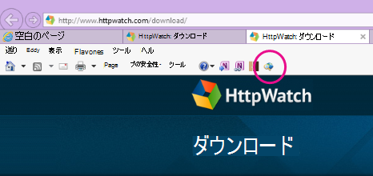
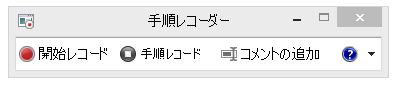
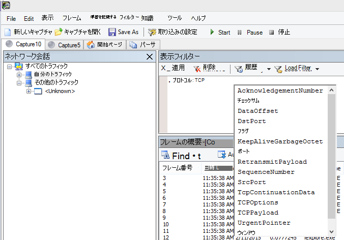
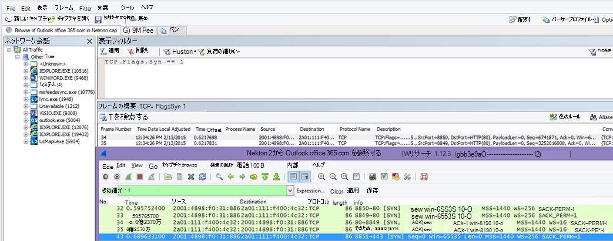
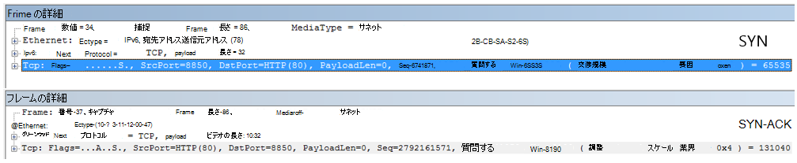
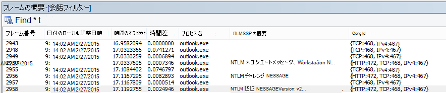
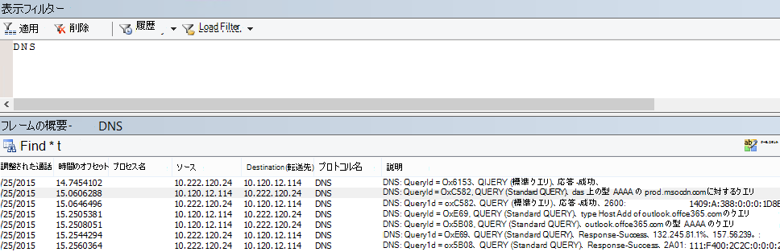
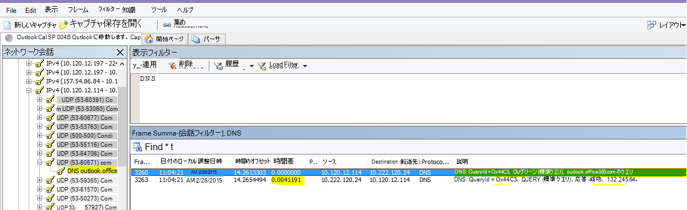
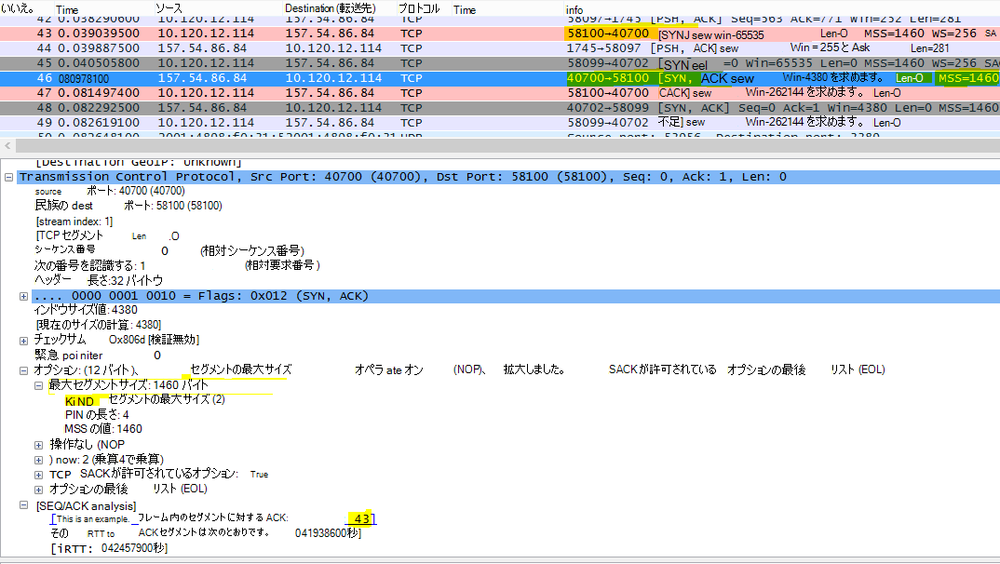

# <a name="performance-troubleshooting-plan-for-office-365"></a>Office 365 のパフォーマンス トラブルシューティング計画

SharePoint Online、OneDrive for Business、Exchange Online、またはSkype for Business Online とクライアント コンピューターの間のラグ、ハング、パフォーマンス低下を特定して修正するための手順を理解しておく必要がありますか? サポートを呼び出す前に、この記事はOffice 365パフォーマンスの問題のトラブルシューティングに役立ち、最も一般的な問題の一部を修正するのに役立ちます。

この記事は実際には、パフォーマンスの問題に関する貴重なデータをキャプチャするために使用できるサンプル アクション プランです。 この記事には、いくつかの主な問題も含まれています。

ネットワーク パフォーマンスを初めて使用していて、クライアント マシンとOffice 365間のパフォーマンスを監視する長期的な計画を立てる場合は、[パフォーマンスのチューニングとトラブルシューティング (管理者と IT Pro) Office 365](performance-tuning-using-baselines-and-history.md)見てみましょう。

## <a name="sample-performance-troubleshooting-action-plan"></a>パフォーマンスのトラブルシューティングアクション プランのサンプル

このアクション プランには 2 つの部分があります。準備フェーズとログ記録フェーズ。 パフォーマンスに問題があり、データ収集を行う必要がある場合は、すぐにこのプランの使用を開始できます。

### <a name="prepare-the-client-computer"></a>クライアント コンピューターを準備する

- パフォーマンスの問題を再現できるクライアント コンピューターを見つけます。 このコンピューターは、トラブルシューティングの過程で使用されます。
- パフォーマンスの問題の原因となる手順を書き留めて、テストの準備を整えます。
- 情報を収集および記録するためのツールをインストールします。
  - [Netmon 3.4](https://www.microsoft.com/download/details.aspx?id=4865) をインストールします (または、同等のネットワーク トレース ツールを使用します)。
  - 無料の Basic Edition of [HTTPWatch](https://www.httpwatch.com/download/) をインストールします (または、同等のネットワーク トレース ツールを使用します)。
  - テスト中に実行した手順の記録を保持するために、スクリーン レコーダーを使用するか、Windows Vista 以降に付属するステップ レコーダー (PSR.exe) を実行します。

### <a name="log-the-performance-issue"></a>パフォーマンスの問題をログに記録する

- 余分なインターネット ブラウザーをすべて閉じます。
- ステップ レコーダーまたは別のスクリーン レコーダーを起動します。
- Netmon キャプチャ (またはネットワーク トレース ツール) を開始します。
- ipconfig /flushdns と入力して、コマンド ラインからクライアント コンピューター上の DNS キャッシュをクリアします。
- 新しいブラウザー セッションを開始し、HTTPWatch を有効にします。
- 省略可能: Exchange Onlineをテストする場合は、Office 365管理コンソールからExchangeクライアント パフォーマンス アナライザー ツールを実行します。
- パフォーマンスの問題の原因となる正確な手順を再現します。
- Netmon またはその他のツールのトレースを停止します。
- コマンド ラインで、次のコマンドを入力し、Enter キーを押して、Office 365 サブスクリプションへのトレース ルートを実行します。

  ``` cmd
  tracert <subscriptionname>.onmicrosoft.com
  ```

- ステップ レコーダーを停止し、ビデオを保存します。 キャプチャの日時と、良好なパフォーマンスと悪いパフォーマンスのどちらを示すかを必ず含めておきます。
- トレース ファイルを保存します。 繰り返しになりますが、キャプチャの日時と、良好なパフォーマンスと悪いパフォーマンスのどちらが示されているかを必ず含めておきます。

この記事で説明したツールの実行に慣れていない場合は、次にこれらの手順を提供するので心配しないでください。 この種のネットワーク キャプチャに慣れている場合は、「 [ベースラインを収集する方法」に](performance-tuning-using-baselines-and-history.md#how-to-collect-baselines)進むことができます。これには、フィルター処理とログの読み取りについて説明されています。

### <a name="flush-the-dns-cache-first"></a>最初に DNS キャッシュをフラッシュする

どうしてでしょうか? DNS キャッシュをフラッシュすることで、クリーン なスレートでテストを開始します。 キャッシュをクリアすることで、DNS リゾルバーの内容を最新のエントリにリセットします。 フラッシュでは HOST ファイル エントリは削除されないことに注意してください。 HOST ファイル エントリを広範に使用する場合は、それらのエントリを別のディレクトリのファイルにコピーし、HOST ファイルを空にする必要があります。

#### <a name="flush-your-dns-resolver-cache"></a>DNS リゾルバー キャッシュをフラッシュする

1. コマンド プロンプト ( \> Start **Run** \> **cmd** または **Windows key** \> **cmd**) を開きます。
2. 次のコマンドを入力し、Enter キーを押します。

    ``` cmd
    ipconfig /flushdns
    ```

## <a name="netmon"></a>Netmon

Microsoft のネットワーク監視ツール ([Netmon](https://www.microsoft.com/download/details.aspx?id=4865)) は、ネットワーク上のコンピューター間を通過するパケット (トラフィック) を分析します。 Netmon を使用してOffice 365を使用してトラフィックをトレースすることで、パケット ヘッダーをキャプチャ、表示、読み取り、介入するデバイスの識別、ネットワーク ハードウェアの重要な設定の確認、ドロップされたパケットの検索、企業ネットワーク上のコンピューターとOffice 365の間のトラフィックのフローに従うことができます。 トラフィックの実際の本文は暗号化されているため、つまり(SSL/TLS を介してポート 443 で移動するため、送信されるファイルを読み取ることはできません)。 代わりに、パケットが受け取るパスのフィルター処理されていないトレースを取得し、問題の動作を追跡するのに役立ちます。

現時点ではフィルターを適用しないでください。 代わりに、手順を実行し、トレースを停止して保存する前に問題を示します。

Netmon 3.4 をインストールした後、ツールを開き、次の手順を実行します。

### <a name="take-a-netmon-trace-and-reproduce-the-issue"></a>Netmon トレースを取得し、問題を再現する

1. Netmon 3.4 を起動します。
**[スタート]** ページには、[**最近使用したキャプチャ**]、[**ネットワークの選択]**、[**Microsoft Network Monitor 3.4 のはじめに] の 3 つのウィンドウがあります。注意してください**。 [ネットワークの選択] パネルには、キャプチャできる既定のネットワークの一覧も表示されます。 ここでネットワーク カードが選択されていることを確認します。

2. スタート ページの上部にある [**新しいキャプチャ****]** をクリックします。 これにより、**キャプチャ 1** という名前の **[スタート**] ページ タブの横に新しいタブが追加されます。
![[新しいキャプチャ]、[開始]、[停止] のボタンが強調表示された Netmon のユーザー インターフェイス。](../media/d4527d84-62ec-4301-82d5-e0166ff71f20.PNG)

3. 簡単なキャプチャを実行するには、ツール バーの **[開始]** をクリックします。

4. パフォーマンスの問題を示す手順を再現します。

5. [**ファイルの****名前を付けて保存****を**\>停止\>] をクリックします。 タイム ゾーンで日付と時刻を指定し、パフォーマンスが悪い場合や良好なパフォーマンスを示す場合は、必ず言及してください。

## <a name="httpwatch"></a>HTTPWatch

[HTTPWatch](https://www.httpwatch.com/download/) には有料と無料版が含まれます。 無料の Basic Edition には、このテストに必要なすべてのものが含まれます。 HTTPWatch は、ブラウザー ウィンドウからすぐにネットワーク トラフィックとページ読み込み時間を監視します。 HTTPWatch は、パフォーマンスをグラフィカルに記述する Internet Explorer へのプラグインです。 分析は HTTPWatch Studio に保存して表示できます。

> [!NOTE]
> Firefox、Google Chrome などの別のブラウザーを使用している場合、または Internet Explorer で HTTPWatch をインストールできない場合は、新しいブラウザー ウィンドウを開き、キーボードの F12 キーを押します。 ブラウザーの下部に開発者ツールがポップアップ表示されます。 Opera を使用する場合は、Ctrl + Shift + I for Web Inspector キーを押し、[ **ネットワーク** ] タブをクリックして、以下に示すテストを完了します。 情報は若干異なりますが、読み込み時間はミリ秒単位で表示されます。 > HTTPWatch は、SharePoint Online ページの読み込み時間に関する問題にも非常に役立ちます。

### <a name="run-httpwatch-and-reproduce-the-issue"></a>HTTPWatch を実行し、問題を再現する

HTTPWatch はブラウザー プラグインであるため、ブラウザーでのツールの公開は Internet Explorer のバージョンごとに若干異なります。 通常、Internet Explorer ブラウザーの [コマンド] バーの下に HTTPWatch があります。 ブラウザー ウィンドウに HTTPWatch プラグインが表示されない場合は、[**ヘルプ**\>情報] をクリックしてブラウザーのバージョンを確認 **するか、それ** 以降のバージョンの Internet Explorer で、歯車記号と **[インターネット エクスプローラーについて**] をクリックします。 **コマンド** バーを起動するには、Internet Explorer でメニュー バーを右クリックし、[**コマンド バー**] をクリックします。

以前は、HTTPWatch がコマンドバーとエクスプローラー バーの両方に関連付けられているため、インストールすると、アイコンがすぐに表示されない場合 (再起動後も) **ツール** とツール バーにアイコンが表示されます。 ツール バーはカスタマイズでき、オプションを追加できることに注意してください。



1. Internet Explorer ブラウザー ウィンドウで HTTPWatch を起動します。 ウィンドウの下部にあるブラウザーにドッキングされて表示されます。 [ **レコード**] をクリックします。

2. パフォーマンスの問題に関連する正確な手順を再現します。 HTTPWatch で **[停止** ] ボタンをクリックします。

3. HTTPWatch または **Send by Email** **を保存** します。 必ずファイルに名前を付けて、日付と時刻の情報と、ウォッチにパフォーマンスの良いデモと悪いパフォーマンスのデモンストレーションが含まれているかどうかを示す名前を付けます。

![Office 365 ホームページのページ読み込み用の [ネットワーク] タブを示す HTTPWatch。](../media/021a2c64-d581-49fd-adf4-4c364f589d75.PNG)

このスクリーン ショットは、Professional バージョンの HTTPWatch から提供されています。 基本バージョンで取得したトレースは、Professional バージョンのコンピューターで開き、そこで読み取ることができます。 トレースからそのメソッドを介して追加情報を入手できる場合があります。

## <a name="problem-steps-recorder"></a>問題ステップ レコーダー

ステップ レコーダー (PSR.exe) を使用すると、発生した問題を記録できます。 これは非常に便利なツールであり、非常に簡単に実行できます。

### <a name="run-problem-steps-recorder-psrexe-to-record-your-work"></a>問題ステップ レコーダー (PSR.exe) を実行して作業を記録する

1. **Start** \> **Run** \> type **PSR.exe** \> **OK を** 使用するか、**Windowsキー**\>の種類 **PSR.exe** \>をクリックして Enter キーを押します。

2. 小さな [PSR.exe] ウィンドウが表示されたら、[レコードの **開始** ] をクリックし、パフォーマンスの問題を再現する手順を再現します。 [コメントの追加] をクリックすると、必要に応じて **コメントを追加** できます。

3. 手順を完了したら、[ **レコードの停止** ] をクリックします。 パフォーマンスの問題がページ レンダリングの場合は、記録を停止する前にページがレンダリングされるのを待ちます。

4. [**保存**] をクリックします。



日付と時刻が記録されます。 これにより、PSR が Netmon トレースと HTTPWatch に時間内にリンクされ、正確なトラブルシューティングに役立ちます。 PSR レコードの日付と時刻は、ログインと URL の参照と管理者サイトの部分的なレンダリングの間に 1 分間渡されたことを示すことができます。

## <a name="read-your-traces"></a>トレースを読み取る

誰かが記事を通じて知る必要があるネットワークとパフォーマンスのトラブルシューティングについてすべてを教えることはできません。 パフォーマンスを向上させるには、ネットワークのしくみと通常のパフォーマンスに関する経験と知識が必要です。 ただし、最も一般的な問題の一覧を切り上げて、ツールを使用して最も一般的な問題を簡単に排除する方法を示すことができます。

Office 365 サイトのネットワーク トレースを読み取るスキルを習得する場合は、定期的にページ読み込みのトレースを作成し、それらを読み取る経験を得るよりも優れた教師はいません。 たとえば、機会がある場合は、Office 365 サービスを読み込み、プロセスをトレースします。 DNS トラフィックのトレースをフィルター処理するか、参照したサービスの名前を FrameData で検索します。 トレースをスキャンして、サービスの読み込み時に発生する手順を把握します。 これにより、通常のページ読み込みのようになります。特にパフォーマンスに関するトラブルシューティングの場合、良好なトレースと悪いトレースを比較すると、多くのことを教えることができます。

Netmon では、表示フィルター フィールドで Microsoft Intellisense が使用されます。 Intellisense (インテリジェント なコード補完) は、ピリオドを入力し、使用可能なすべてのオプションがドロップダウン選択ボックスに表示される場合に便利です。 たとえば、TCP ウィンドウのスケーリングが心配な場合は、この方法でフィルター (など  `.protocol.tcp.window < 100`) への道を見つけることができます。



Netmon トレースには多くのトラフィックが含まれる可能性があります。 それらを読み取った経験がない場合は、最初にトレースを開く際に圧倒される可能性があります。 最初に行う操作は、トレース内のバックグラウンド ノイズから信号を分離することです。 Office 365に対してテストしました。これは、確認するトラフィックです。 トレース内の移動に慣れている場合は、この一覧は必要ない場合があります。

クライアントとOffice 365間のトラフィックは TLS 経由で移動します。つまり、トラフィックの本文は暗号化され、汎用 Netmon トレースでは読み取りできません。 パフォーマンス分析では、パケット内の情報の詳細を把握する必要はありません。 ただし、パケット ヘッダーと、パケット ヘッダーに含まれる情報に非常に関心があります。

### <a name="tips-to-get-a-good-trace"></a>良好なトレースを取得するためのヒント

- クライアント コンピューターの IPv4 または IPv6 アドレスの値を把握します。 これをコマンド プロンプトから取得するには、「 **IPConfig** 」と入力し、Enter キーを押します。 このアドレスを知ることで、トレース内のトラフィックがクライアント コンピューターに直接関係しているかどうかをひとめで確認できます。 既知のプロキシがある場合は、ping を実行し、その IP アドレスも取得します。

- DNS リゾルバー キャッシュをフラッシュし、可能であれば、テストを実行しているブラウザーを除くすべてのブラウザーを閉じます。 これを行えない場合は、たとえば、サポートがブラウザー ベースのツールを使用してクライアント コンピューターのデスクトップを表示している場合は、トレースをフィルター処理するように準備してください。

- ビジー状態のトレースで、使用しているOffice 365 サービスを見つけます。 これまでにトラフィックを見たことがないか、ほとんど見たことがない場合は、パフォーマンスの問題を他のネットワーク ノイズから分離するのに役立つ手順です。 これを行うには、いくつかの方法があります。 テストの直前に、特定のサービスの URL (`ping outlook.office365.com`たとえば) に対して _ping_ または `psping -4 microsoft-my.sharepoint.com:443`_PsPing_ を使用できます。 また、(プロセス名によって) Netmon トレースで ping または PsPing を簡単に見つけることができます。 これで、探し始める場所が提供されます。

問題の時点で Netmon トレースのみを使用している場合は、それも問題ありません。 自分の方向を設定するには、次のような `ContainsBin(FrameData, ASCII, "office")` フィルターを使用します `ContainsBin(FrameData, ASCII, "outlook")`。 トレース ファイルからフレーム番号を記録できます。 [ _フレームの概要_ ] ウィンドウを右までスクロールし、[会話 ID] 列を探すこともできます。 この特定の会話の ID には、後で分離して記録および参照できる番号が示されています。 他のフィルター処理を適用する前に、必ずこのフィルターを削除してください。

> [!TIP]
> Netmon には、多くの便利な組み込みフィルターがあります。 _表示_ フィルター ウィンドウの上部にある [**フィルターの読み込み**] ボタンを試します。


トラフィックについて理解し、必要な情報を見つける方法について学習します。 たとえば、トレース内のどのパケットが、使用しているOffice 365 サービスへの最初の参照を持つ ("Outlook" など) かを判断する方法について説明します。

Office 365 Outlook Online を例にとると、トラフィックは次のように開始されます。

- 一致する QueryID を持つ outlook.office365.com の DNS 標準クエリと DNS 応答。 このターンアロールの時間オフセットと、Office 365 グローバル DNS が名前解決の要求を世界中で送信する場所に注意することが重要です。 理想的には、可能な限りローカルで、世界中の半分ではなく。

- 状態レポートが永続的に移動された HTTP GET 要求 (301)

- RWS Connect要求とConnect応答を含む RWS トラフィック。 (これは、接続を行うリモート Winsock です。

- TCP SYN と TCP SYN/ACK の会話。 この会話の設定の多くは、パフォーマンスに影響します。

- 次に、TLS ハンドシェイクと TLS 証明書の会話が行われる一連の TLS:TLS トラフィック。 (データは SSL/TLS 経由で暗号化されていることを忘れないでください)。)

トラフィックのすべての部分は重要で接続されていますが、トレースのごく一部にはパフォーマンスのトラブルシューティングの点で特に重要な情報が含まれているため、これらの領域に重点を置きます。 また、Microsoft では、一般的な問題の上位 10 個のリストをコンパイルするのに十分なOffice 365パフォーマンスのトラブルシューティングを行ったので、これらの問題と、それらを次にルート化する必要があるツールの使用方法に焦点を当てます。

すべての準備が完了していない場合は、次のマトリックスで複数のツールを使用します。 可能であれば。 インストール ポイントへのリンクが提供されます。 この一覧には [、Netmon](https://www.microsoft.com/download/details.aspx?id=4865) や [Wireshark](https://www.wireshark.org/) などの一般的なネットワーク トレース ツールが含まれていますが、使い慣れたトレース ツールを使用し、ネットワーク トラフィックのフィルター処理に慣れているツールを使用します。 テストするときは、次の点に注意してください。

- *ブラウザーを閉じて、1 つのブラウザーのみを実行してテスト*  します。これにより、キャプチャする全体的なトラフィックが減ります。 これにより、ビジー状態のトレースが少なくなります。
- *クライアント コンピューター上の DNS リゾルバー キャッシュをフラッシュ*  します。これにより、キャプチャを開始するとスレートがクリーンになり、よりクリーンなトレースが得られます。

## <a name="common-issues"></a>一般的な問題

直面する可能性のある一般的な問題と、それらをネットワーク トレースで見つける方法について説明します。

### <a name="tcp-windows-scaling"></a>TCP Windows スケーリング

SYN - SYN/ACK にあります。 従来のハードウェアや古いハードウェアでは、TCP ウィンドウのスケーリングが利用されない場合があります。  適切な TCP ウィンドウ スケーリング設定がない場合、TCP ヘッダーの既定の 16 ビット バッファーはミリ秒単位で入力されます。  クライアントが元のデータが受信されたことを確認するまでトラフィックを送信し続けることができないため、遅延が発生します。

#### <a name="tools"></a>ツール

- Netmon
- Wireshark

#### <a name="what-to-look-for"></a>探す内容

ネットワーク トレースで SYN - SYN/ACK トラフィックを探します。  Netmon では、次のような  `tcp.flags.syn == 1`フィルターを使用します。 このフィルターは Wireshark でも同じです。



SYN ごとに、関連する受信確認 (SYN/ACK) の宛先ポート (DstPort) で一致する送信元ポート (SrcPort) 番号があることに注意してください。

ネットワーク接続で使用されるWindowsスケーリング値を表示するには、最初に SYN を展開し、次に関連する SYN/ACK を展開します。



### <a name="tcp-idle-time-settings"></a>TCP アイドル時間設定

従来、ほとんどの境界ネットワークは一時的な接続用に構成されています。つまり、アイドル状態の接続は一般に終了されます。 アイドル状態の TCP セッションは、プロキシとファイアウォールによって 100 秒から 300 秒を超えて終了できます。 Outlook Online では、アイドル状態かどうかにかかわらず、長期的な接続が作成され、使用されるため、これは問題になります。

接続がプロキシデバイスまたはファイアウォール デバイスによって終了されると、クライアントに通知されず、Outlook Online を使用しようとすると、クライアント コンピューターが新しいデバイスを作成する前に接続を再度有効にしようとします。 ページの読み込み時に、製品のハング、プロンプト、またはパフォーマンスの低下が表示される場合があります。

#### <a name="tools"></a>ツール

- Netmon
- Wireshark

#### <a name="what-to-look-for"></a>探す内容

Netmon で、ラウンドトリップの [タイム オフセット] フィールドを確認します。 ラウンドトリップとは、クライアントがサーバーに要求を送信してから応答を受信するまでの時間です。 クライアントとエグレス ポイントの間を確認します (例: クライアント --\> プロキシ)、またはOffice 365するクライアント (クライアント --\> Office 365)。 これは、さまざまな種類のパケットで確認できます。

たとえば、Netmon のフィルターは、Wireshark `ip.addr == 10.102.14.112 &amp;&amp; ip.addr == 10.201.114.12`では次のようになります`.Protocol.IPv4.Address == 10.102.14.112 AND .Protocol.IPv4.Address == 10.201.114.12`。

> [!TIP]
> トレース内の IP アドレスが DNS サーバーに属しているかどうかを確認してください。 コマンド ラインで検索してみてください。 [**実行** \> **の開始]** \> をクリックして **「cmd」** と入力するか、**Windowsキー**\>を押して **「cmd」** と入力します。 プロンプト  `nslookup <the IP address from the network trace>`に「. テストするには、自分のコンピューターの IP アドレスに対して nslookup を使用します。 > Microsoft の IP 範囲の一覧については、「[Office 365 URL と IP アドレス範囲」を](./urls-and-ip-address-ranges.md)参照してください。

問題が発生した場合は、長い時間オフセットが表示されることを想定します。この場合 (オンラインOutlook)、特にアプリケーション データの通過を示す TLS:TLS パケット (Netmon では、アプリケーション データ パケットを使用して`.Protocol.TLS AND Description == "TLS:TLS Rec Layer-1 SSL Application Data"`検索できます)。 セッション全体でスムーズな進行が見られます。 Outlook Online の更新時に長い遅延が発生する場合は、高度なリセットが送信されたことが原因である可能性があります。

### <a name="latencyround-trip-time"></a>待機時間/ラウンド トリップ時間

待機時間は、古いデバイスのアップグレード、ネットワークへの多数のユーザーの追加、ネットワーク接続上の他のタスクで消費される全体的な帯域幅の割合など、多くの変数に応じて大きく変化する可能性があるメジャーです。

Office 365ページの[ネットワーク計画とパフォーマンスのチューニング](network-planning-and-performance.md)には、Office 365用の帯域幅計算ツールがあります。

接続の速度、または ISP 接続の帯域幅を測定する必要がありますか? このサイト (またはそのようなサイト): [Speedtest 公式サイト](https://www.speedtest.net/)を試すか、お気に入りの検索エンジンにフレーズ **速度テスト** のクエリを実行します。

#### <a name="tools"></a>ツール

- ping
- PsPing
- Netmon
- Wireshark

#### <a name="what-to-look-for"></a>探す内容

トレース内の待機時間を追跡するには、クライアント コンピューターの IP アドレスと DNS サーバーの IP アドレスをOffice 365に記録した方がメリットがあります。 これは、トレース フィルター処理を簡単に行うための目的です。 プロキシ経由で接続する場合は、作業を簡単にするために、クライアント コンピューターの IP アドレス、プロキシ/エグレス IP アドレス、Office 365 DNS IP アドレスが必要です。

outlook.office365.com に送信された ping 要求は、ping が商標の連続した ICMP パケットを送信するために接続できない  *場合*  でも、要求を受信するデータセンターの名前を示します。 PsPing (ダウンロード用の無料ツール) を使用し、ポート (443) を特定し、おそらく IPv4 (-4) を使用する場合は、送信されたパケットの平均ラウンドトリップ時間が得られます。 これは、Office 365 サービス内の他の URL (.`psping -4 yourSite.sharepoint.com:443` 実際には、いくつかの ping を指定して平均より大きなサンプルを取得し、次のように `psping -4 -n 20 yourSite-my.sharepoint.com:443`試すことができます。

> [!NOTE]
> PsPing は ICMP パケットを送信しません。 特定のポートを介して TCP パケットで ping を実行するため、開いていることがわかっているポートを使用できます。 SSL/TLS を使用するOffice 365で、PsPing にポート :443 を接続してみてください。


ネットワーク トレースの実行中にパフォーマンスの低下したOffice 365 ページを読み込んだ場合は、Netmon または Wireshark トレース`DNS`をフィルター処理して 、 . これは、探している IP の 1 つです。

IP アドレスを取得するために Netmon をフィルター処理する手順を次に示します (DNS 待機時間を確認してください)。 この例では outlook.office365.com を使用しますが、SharePoint Online テナント (hithere.sharepoint.com など) の URL も使用できます。

1. URL に ping を `ping outlook.office365.com` 実行し、結果に ping 要求の送信先の DNS サーバーの名前と IP アドレスを記録します。
2. ネットワーク トレースがページを開くか、パフォーマンスの問題を引き起こすアクションを実行するか、ping 自体で待機時間が長い場合はネットワーク トレースします。
3. Netmon でトレースを開き、DNS のフィルターを適用します (このフィルターは Wireshark でも機能しますが、大文字と小文字 `-- dns`は区別されます)。 ping から DNS サーバーの名前を知っているので、次のように Netmon でより迅速にフィルター処理することもできます。これは Wireshark DNS では次のようになります `DNS AND ContainsBin(FrameData, ASCII, "namnorthwest")`。フレームには "namnorthwest" が含まれています。<br/>応答パケットを開き、[Netmon フレームの **詳細** ] ウィンドウで [ **DNS** ] をクリックして展開し、詳細を確認します。 DNS 情報には、要求がOffice 365で行った DNS サーバーの IP アドレスが表示されます。 次の手順 (PsPing ツール) には、この IP アドレスが必要です。 フィルターを削除し、Netmon の DNS 応答を右クリックして (**フレームの**\>概要 **で会話**\>を検索 **する DNS**) DNS クエリと応答を並べて表示します。
4. Netmon では、DNS 要求と応答の間のタイム オフセット列にも注意してください。 次の手順では、ICMP がファイアウォールでブロックされることが多く、PsPing が待機時間をミリ秒単位でエレガントに追跡するため、 [PsPing](/sysinternals/downloads/psping) ツールのインストールと使用が簡単です。 PsPing は、アドレスとポート (ここではポート 443 を開く) への TCP 接続を完了します。
5. PsPing をインストールします。
6. コマンド プロンプト (\>Start Run \> type cmd、または Windows Key \> type cmd) を開き、PsPing コマンドを実行するために PsPing をインストールしたディレクトリにディレクトリを変更します。 私の例では、C のルートに "Perf" フォルダーを作成したことがわかります。クイック アクセスでも同じ操作を実行できます。
7. ポート番号など`psping -n 20 132.245.24.82:445`、以前の Netmon トレースからOffice 365 DNS サーバーの IP アドレスに対して PsPing を実行するようにコマンドを入力します。 これにより、20 ping のサンプリングが行われ、PsPing が停止したときの待機時間が平均されます。

プロキシ サーバーを使用してOffice 365する場合、手順は少し異なります。 まず、プロキシ サーバーに PsPing を使用して、プロキシ/エグレスとバックまでの平均待機時間の値をミリ秒単位で取得し、プロキシで PsPing を実行するか、またはインターネットに直接接続されているコンピューターで PsPing を実行して、不足している値 (Office 365および戻る値) を取得します。

プロキシから PsPing を実行することを選択した場合は、クライアント コンピューターからプロキシ サーバーまたはエグレス ポイント、およびプロキシ サーバーからOffice 365の 2 ミリ秒の値があります。 これで完了です。 いずれにせよ、値を記録します。

インターネットに直接接続されている別のクライアント コンピューターで PsPing を実行する場合、つまりプロキシなしでは、クライアント コンピューターからプロキシ サーバーまたはエグレス ポイント、およびクライアント コンピューターからOffice 365までの 2 ミリ秒の値が使用されます。 この場合、クライアント コンピューターからプロキシ サーバーまたはエグレス ポイントの値をクライアント コンピューターの値からOffice 365に減算します。クライアント コンピューターからプロキシ サーバーまたはエグレス ポイント、プロキシ サーバーまたはエグレス ポイントからOffice 365までの RTT 番号が表示されます。

ただし、影響を受ける場所に直接接続されているクライアント コンピューターを見つけたり、プロキシをバイパスしたりする場合は、最初に問題が再現されているかどうかを確認し、その後それを使用してテストすることもできます。

Netmon トレースに示されているように、特定のセッションに十分な待機時間がある場合、それらの余分なミリ秒が加算される可能性があります。

![フレームの概要に Netmon の既定の [時間差] 列が追加された、Netmon の一般的な待ち時間。](../media/7ad17380-8527-4bc2-9b9b-6310cf19ba6b.PNG)

> [!NOTE]
> IP アドレスは、次に示す IP アドレスとは異なる場合があります。たとえば、ping によって 157.56.0.0/16 などの範囲が返される場合があります。 Office 365で使用される範囲の一覧については、[OFFICE 365 URL と IP アドレス範囲](./urls-and-ip-address-ranges.md)を確認してください。

132.245 など、検索する場合は、必ずすべてのノード (上部にボタンがあります) を展開してください。

### <a name="proxy-authentication"></a>プロキシ認証

これは、プロキシ サーバーを経由する場合にのみ適用されます。 そうでない場合は、これらの手順をスキップできます。 正しく動作する場合、プロキシ認証はミリ秒単位で一貫して行われる必要があります。 ピーク時のパフォーマンスが断続的に低下することはありません (たとえば)。

プロキシ認証がオンの場合、情報を取得するためにOffice 365に新しい TCP 接続を行うたびに、バックグラウンドで認証プロセスを通過する必要があります。 そのため、たとえば、Outlook Online で予定表からメールに切り替えると、認証が行われます。 SharePoint Online では、ページに複数のサイトまたは場所のメディアまたはデータが表示される場合、データをレンダリングするために必要な異なる TCP 接続ごとに認証されます。

Outlook Online では、予定表とメールボックスを切り替えるたびに読み込み時間が遅くなったり、SharePoint Online でページの読み込みが遅くなったりすることがあります。 ただし、ここには表示されない他の現象があります。

プロキシ認証は、エグレス プロキシ サーバーの設定です。 Office 365でパフォーマンスの問題が発生している場合は、ネットワーク チームに問い合わせてください。

#### <a name="tools"></a>ツール

- Netmon
- Wireshark

#### <a name="what-to-look-for"></a>探す内容

プロキシ認証は、通常、サーバーからファイルや情報を要求したり、情報を提供したりするために、新しい TCP セッションをスピンアップする必要がある場合に行われます。 たとえば、HTTP GET または HTTP POST 要求に関するプロキシ認証が表示される場合があります。 トレースで要求を認証しているフレームを表示する場合は、Netmon に 'NTLMSSP Summary' 列を追加し  `.property.NTLMSSPSummary`、. 認証にかかる時間を確認するには、Time Delta 列を追加します。

Netmon に列を追加するには:

1. **[説明**] などの列を右クリックします。
2. [ **列の選択] をクリックします**。
3. 一覧で _NTLMSSP の概要_ と _時間の差分_ を見つけて、[ **追加**] をクリックします。
4. 新しい列を _[説明_ ] 列の前後に移動して、それらを並べて読み上げます。
5. **[OK]** をクリックします。

列を追加しない場合でも、Netmon フィルターは機能します。 ただし、どの段階の認証を行っているかを確認できる場合は、トラブルシューティングがはるかに簡単になります。

プロキシ認証のインスタンスを探す場合は、NTLM チャレンジがあるすべてのフレーム、または認証メッセージが存在するフレームをすべて調査してください。 必要に応じて、特定のトラフィック部分を右クリックし、会話 \> TCP を検索します。 これらの会話の Time Delta 値に注意してください。



Wireshark に示されているように、プロキシ認証の 4 秒の遅延。 **前に表示されたフレーム列からの Time delta** は、フレームの詳細で同じ名前のフィールドを右クリックし、[列として追加] を選択することで行われました。  <br/> ![Wireshark では、フレームの詳細で同じ名前のフィールドを右クリックし、[列として追加] を選択することで、[前に表示されたフレームからのタイム デルタ] 列を作成できます。](../media/f5b7bde4-8067-4ee0-bc7f-e9062ce1ba6f.PNG)

### <a name="dns-performance"></a>DNS パフォーマンス

名前解決は、可能な限りクライアントの国に近い場所で行われると、最適かつ最も迅速に機能します。

DNS 名解決が外部で行われている場合は、ページの読み込みに秒を追加できます。 名前解決は 100 ミリ秒未満で行うのが理想的です。 そうでない場合は、詳細な調査を行う必要があります。

> [!TIP]
> Office 365でのクライアント接続のしくみがわからない場合 ここでは、クライアント接続リファレンスのドキュメントを参照 [してください](/previous-versions//dn741250(v=technet.10))。

#### <a name="tools"></a>ツール

- Netmon
- Wireshark
- PsPing

#### <a name="what-to-look-for"></a>探す内容

DNS パフォーマンスの分析は、通常、ネットワーク トレースの別のジョブです。 ただし、PsPing は、考えられる原因の決定または除外にも役立ちます。

DNS トラフィックは TCP 要求と UDP 要求に基づいており、応答には特定の要求とその特定の応答を照合するのに役立つ ID が明確にマークされます。 たとえば、SharePoint Online が Web ページでネットワーク名または URL を使用すると、DNS トラフィックが表示されます。 一般的に、ゾーンを転送する場合を除き、このトラフィックのほとんどは UDP 経由で実行されます。

Netmon と Wireshark の両方で、DNS トラフィックを確認できる最も基本的なフィルターは単純です `dns`。 フィルターを指定するときは、必ず小文字を使用してください。 クライアント コンピューターで問題の再現を開始する前に、必ず DNS リゾルバー キャッシュをフラッシュしてください。 たとえば、ホーム ページのSharePointオンライン ページの読み込みが遅い場合は、すべてのブラウザーを閉じて、新しいブラウザーを開き、トレースを開始し、DNS リゾルバー キャッシュをフラッシュし、SharePoint Online サイトを参照する必要があります。 ページ全体が解決したら、トレースを停止して保存する必要があります。



ここで時間オフセットを確認します。 また、次の手順を実行して実行できる **Time Delta** 列を Netmon に追加すると便利な場合があります。

1. **[説明**] などの列を右クリックします。
2. [ **列の選択] をクリックします**。
3. 一覧で _Time Delta_ を見つけて、[ **追加**] をクリックします。
4. 新しい列を _[説明_ ] 列の前後に移動して、それらを並べて読み上げます。
5. **[OK]** をクリックします。

目的のクエリが見つかる場合は、フレームの詳細パネルでそのクエリを右クリックし、[ **会話** \> **の DNS** の検索] を選択して、クエリを分離することを検討してください。 [ネットワーク会話] パネルは、UDP トラフィックのログ内の特定の会話に直接ジャンプすることに注意してください。



Wireshark では、DNS 時間の列を作成できます。 Wireshark でトレースを取得 (またはトレースを開く) し、フィルター処理 `dns`するか、より便利に  `dns.time`. 任意の DNS クエリをクリックし、詳細を示すパネルで詳細を  `Domain Name System (response)` 展開します。 時間のフィールドが表示されます (たとえば、 `[Time: 0.001111100 seconds]`. 今回右クリックし、[ **列として適用]** を選択します。 これにより、トレースの並べ替えを迅速に行うための **[時間** ] 列が表示されます。 新しい列をクリックして降順の値で並べ替え、解決に最も時間がかかった DNS 呼び出しを確認します。

[Wireshark で (小文字の) dns.time でフィルター処理し、詳細からの時間を列にして昇順で並べ替えた、SharePoint Online の参照。](../media/1439dcc2-12ff-4ee2-9ef3-1484cf79c384.PNG)

DNS 解決時間の詳細な調査を行う場合は、TCP で使用される DNS ポートに対して PsPing を試してください (例:  `psping <IP address of DNS server>:53`) 。 パフォーマンスの問題は引き続き発生しますか? その場合、解決に当たっている特定の DNS アプリケーションの問題よりも、問題がより広範なネットワークの問題になる可能性が高くなります。 また、outlook.office365.com への ping によって、Outlook Online の DNS 名解決が行われている場所 (outlook-namnorthwest.office365.com など) が示されることにも言及する価値があります。

問題が DNS 固有の場合は、IT 部門に問い合わせて DNS 構成と DNS フォワーダーを調べて、この問題をさらに調査することが必要になる場合があります。

### <a name="proxy-scalability"></a>プロキシのスケーラビリティ

Office 365のOutlook Online などのサービスは、クライアントに複数の長期的な接続を付与します。 そのため、各ユーザーは、より長い有効期間を必要とするより多くの接続を使用できます。

#### <a name="tools"></a>ツール

数学

#### <a name="what-to-look-for"></a>探す内容

これに固有のネットワーク トレースまたはトラブルシューティング ツールはありません。 代わりに、制限やその他の変数が与えられた帯域幅の計算に基づいています。

### <a name="tcp-max-segment-size"></a>TCP 最大セグメント サイズ

SYN - SYN/ACK にあります。  実行したパフォーマンス ネットワーク トレースを確認して、可能な限り最大量のデータを伝送するように TCP パケットが構成されていることを確認します。

目標は、データの送信に 1460 バイトの MSS を表示することです。 プロキシの背後にいる場合、または NAT を使用している場合は、クライアントからプロキシ/エグレス/NAT、プロキシ/エグレス/NAT からOffice 365にこのテストを実行して、最良の結果を得られます。 これらは異なる TCP セッションです。

#### <a name="tools"></a>ツール

Netmon

#### <a name="what-to-look-for"></a>探す内容

TCP 最大セグメント サイズ (MSS) は、ネットワーク トレース内の 3 方向ハンドシェイクのもう 1 つのパラメーターです。つまり、SYN - SYN/ACK パケットに必要なデータが見つかります。 MSS は実際には見た目が非常に簡単です。

使用しているパフォーマンス ネットワーク トレースを開き、興味のある接続を見つけるか、パフォーマンスの問題を示します。

> [!NOTE]
> トレースを見て、会話に関連するトラフィックを見つける必要がある場合は、クライアントの IP またはプロキシ サーバーまたはエグレス ポイントの IP、またはその両方でフィルター処理します。 直接実行するには、トレース内のOffice 365の IP アドレスをテストしている URL に ping を実行し、それをフィルター処理する必要があります。

トレースの中古を見ていますか? フィルターを使用して自分の方向を設定してみてください。 Netmon で、フレーム番号をメモするなど `Containsbin(framedata, ascii, "sphybridExample")`、URL に基づいて検索を実行します。

Wireshark では、次のようなもの  `frame contains "sphybridExample"`を使用します。 リモート Winsock (RWS) トラフィック (Wireshark で [PSH, ACK] として表示される可能性がある) が見つかった場合は、前述のように、関連する SYN - SYN/ACK の直前に RWS 接続が表示される可能性があることに注意してください。

この時点で、フレーム番号を記録し、フィルターを削除し、Netmon の [ネットワーク会話] ウィンドウで **[すべてのトラフィック** ] をクリックして、最も近い SYN を確認できます。

重要なのは、トレースの時点で IP アドレス情報を受け取っていない場合は、トレース内の URL (たとえば、その一部 `sphybridExample-my.sharepoint.com`) を見つけると、フィルター処理する IP アドレスが提供されます。

表示する必要があるトレース内の接続を見つけます。 これを行うには、トレースをスキャンするか、IP アドレスでフィルター処理するか、Netmon の [ネットワーク会話] ウィンドウを使用して特定の会話 ID を選択します。 SYN パケットが見つかったら、フレームの詳細パネルで TCP (Netmon で) または伝送制御プロトコル (Wireshark 内) を展開します。 [TCP オプション] と [MaxSegmentSize] を展開します。 関連する SYN-ACK フレームを見つけ、TCP オプションと MaxSegmentSize を展開します。 2 つの値のうち小さい方が最大セグメント サイズになります。 この図では、TCP トラブルシューティングと呼ばれる Netmon の組み込みの列を使用しています。


組み込みの列は、[ **フレームの詳細** ] パネルの上部にあります。 (通常のビューに切り替えるには、もう一度 **[列]** をクリックし、[ **タイム ゾーン**] を選択します)。

![TCP トラブルシューティング オプション (フレームの概要の最上部) の [列] ドロップダウンの場所。](../media/64fd4baa-a872-4f07-b959-752d7d37fd62.PNG)

Wireshark でフィルター処理されたトレースを次に示します。 MSS 値 (`tcp.options.mss`) に固有のフィルターがあります。 SYN、SYN/ACK、ACK ハンドシェイクのフレームは、フレームの詳細に相当する Wireshark の下部にリンクされます (そのため、フレーム 47 ACK、46 SYN/ACK へのリンク、43 SYN へのリンク) この種の作業を簡単にします。



**選択的受信確認** (このマトリックスの次のトピック) を確認する必要がある場合は、トレースを閉じないでください。

### <a name="selective-acknowledgment"></a>選択的受信確認

SYN - SYN/ACK にあります。 SYN と SYN/ACK の両方で許可されているとして報告する必要があります。 選択的受信確認 (SACK) を使用すると、パケットまたはパケットが見つからない場合に、データの再送信をスムーズに行うことができます。 デバイスではこの機能を無効にできるため、パフォーマンスの問題が発生する可能性があります。

プロキシの背後にいる場合、または NAT を使用している場合は、クライアントからプロキシ/エグレス/NAT、プロキシ/エグレス/NAT からOffice 365にこのテストを実行して、最良の結果を得られます。 これらは異なる TCP セッションです。

#### <a name="tools"></a>ツール

Netmon

#### <a name="what-to-look-for"></a>探す内容

選択的受信確認 (SACK) は、SYN-SYN/ACK ハンドシェイクのもう 1 つのパラメーターです。 SYN - SYN/ACK のトレースは、さまざまな方法でフィルター処理できます。

トレースをスキャンするか、IP アドレスでフィルター処理するか、Netmon の [ネットワーク会話] ウィンドウを使用して [会話 ID] をクリックして、表示するトレース内の接続を見つけます。 SYN パケットが見つかったら、[フレームの詳細] セクションの [Netmon で TCP] を展開するか、[Wireshark] の [伝送制御プロトコル] を展開します。 [TCP オプション] を展開し、[SACK] を展開します。 関連する SYN-ACK フレームを見つけ、TCP オプションとその SACK フィールドを展開します。 SYN と SYN/ACK の両方で特定の SACK が許可されていることを確認します。 Netmon と Wireshark の両方に表示される SACK 値を次に示します。


### <a name="dns-geolocation"></a>DNS 位置情報

世界でOffice 365が DNS 呼び出しの解決を試みると、接続速度が影響します。

Outlook Online では、最初の DNS 参照が完了すると、その DNS の場所が最も近いデータセンターへの接続に使用されます。 Outlook Online CAS サーバーに接続されます。これはバックボーン ネットワークを使用して、データが格納されているデータセンター (dC) に接続します。 これは高速です。

SharePoint Online にアクセスすると、出張中のユーザーはアクティブなデータセンターに移動します。これは、SPO テナントのホームベース (つまり、米国ベースの場合は米国の dC) に基づく場所である dC です。

Lync Online には、一度に複数の dC にアクティブなノードがあります。 Lync オンライン インスタンスに対して要求が送信されると、Microsoft の DNS によって、要求の送信先が世界で決定され、Lync Online がアクティブな最も近いリージョン dC から IP アドレスが返されます。

> [!TIP]
> クライアントがOffice 365に接続する方法について詳しく知る必要がありますか? [クライアント接続](/previous-versions//dn741250(v=technet.10))のリファレンス記事 (およびその便利なグラフィックス) を見てみましょう。

#### <a name="tools"></a>ツール

- ping
- PsPing

#### <a name="what-to-look-for"></a>探す内容

クライアントの DNS サーバーから Microsoft の DNS サーバーへの名前解決を要求すると、ほとんどの場合、Microsoft DNS はリージョン データセンター (dC) の IP アドレスを返す必要があります。 これはどういう意味ですか? 本社がインドのバンガルールにあるが、米国を旅行している場合、ブラウザーが Outlook Online を要求すると、Microsoft の DNS サーバーは、米国のデータセンター (地域データセンター) に IP アドレスを渡す必要があります。 Outlookからメールが必要な場合、そのデータはデータセンター間で Microsoft のクイック バックボーン ネットワークを経由します。

DNS は、名前解決が可能な限りユーザーの場所に近い場合に最も速く機能します。 ヨーロッパにいる場合は、ヨーロッパの Microsoft DNS にアクセスし、(理想的には) ヨーロッパのデータセンターを処理します。 ヨーロッパのクライアントから DNS に移行し、アメリカのデータセンターのパフォーマンスが低下します。

outlook.office365.com に対して Ping ツールを実行して、DNS 要求がルーティングされている世界の場所を決定します。 ヨーロッパにいる場合は、outlook-emeawest.office365.com などの返信が表示されます。 アメリカでは、outlook-namnorthwest.office365.com のようなものを期待してください。

クライアント コンピューターでコマンド プロンプトを開きます (Start Run \> cmd または Windows キー\>の種類 cmd を使用\>)。 ping outlook.office365.com と入力し、Enter キーを押します。 IPv4 経由で ping を指定する場合は、-4 を指定することを忘れないでください。 ICMP パケットから応答を取得できない場合がありますが、要求がルーティングされた DNS の名前が表示されます。 この接続の待機時間を確認する場合は、ping によって返されるサーバーの IP アドレスに PsPing を試します。


### <a name="office-365-application-troubleshooting"></a>Office 365 アプリケーションのトラブルシューティング

#### <a name="tools"></a>ツール

- Netmon
- HTTPWatch
- ブラウザーの F12 コンソール

このネットワーク固有の記事では、アプリケーション固有のトラブルシューティングで使用されるツールについては説明しません。 ただし、[このページには](https://support.office.com/article/Network-planning-and-performance-tuning-for-Office-365-e5f1228c-da3c-4654-bf16-d163daee8848)使用 *できる* リソースがあります。

## <a name="related-topics"></a>関連項目

[Office 365 エンドポイントの管理](https://support.office.com/article/99cab9d4-ef59-4207-9f2b-3728eb46bf9a)

[Office 365 エンドポイントの FAQ](https://support.office.com/article/d4088321-1c89-4b96-9c99-54c75cae2e6d)