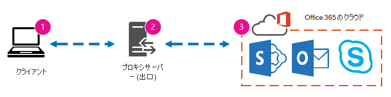
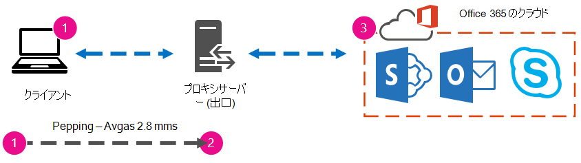
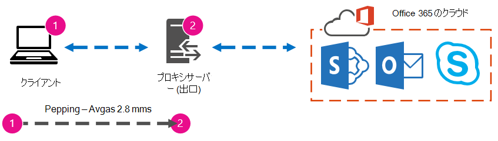

# ベースラインとパフォーマンス履歴を使用して、Office 365 のパフォーマンスをチューニングする

接続の大まかな基準を確立できる、Office 365ビジネス間の接続パフォーマンスを確認する簡単な方法があります。 クライアント コンピューター接続のパフォーマンス履歴を知ることにより、新しい問題を早期に検出し、問題を特定し、予測することができます。
  
パフォーマンスの問題に取り組むのに慣していない場合、この記事は一般的な質問の検討に役立つ記事です。 表示される問題がパフォーマンスの問題であり、サービス インシデントではなく、Office 365しますか? パフォーマンスの良い長期的な計画を立てませんか? パフォーマンスを見守る方法 チームまたはクライアントがデータ の使用中にパフォーマンスが低下している場合Office 365、これらの質問について疑問に思う場合は、次の記事を参照してください。
  
> [!IMPORTANT]
> **クライアントとクライアントの間でパフォーマンスの問題が発生Office 365今すぐ?** 「パフォーマンスのトラブルシューティング計画」で説明[されている](performance-troubleshooting-plan.md)手順に従Office 365。 
    
## パフォーマンスに関するOffice 365

Office 365、オートメーションと実際のユーザーによって監視される、大容量の専用 Microsoft ネットワーク内に住んでいます。 クラウドのパフォーマンスを維持Office 365、可能な限りパフォーマンスの調整と合理化を行います。 Office 365クラウドのクライアントはインターネットを越えて接続する必要があるから、サービス全体でパフォーマンスを微調整Office 365があります。

パフォーマンスの向上はクラウドで実際に停止しないので、クラウドを正常かつ迅速に維持する経験も得てこない。 場所からユーザーに接続するパフォーマンスの問題がある場合Office 365サポート ケースで開始または待機しない方が最善です。 代わりに、'inside out' から問題の調査を開始する必要があります。 つまり、ネットワークの内部から開始し、ネットワークにアクセスOffice 365。 サポートでケースを開く前に、データを収集し、問題を探索して解決する可能性のあるアクションを実行できます。
  
> [!IMPORTANT]
> 容量の計画と制限に注意Office 365。 この情報は、パフォーマンスの問題を解決しようとするときに、先手を行います。 次に、サービスの説明とサービス[Microsoft 365 Office 365リンクを示します](/office365/servicedescriptions/office-365-service-descriptions-technet-library)。 これは中央ハブであり、ユーザーが提供するOffice 365は、ここから独自のサービスの説明にリンクされます。 つまり、SharePoint Online の標準制限を確認する必要がある場合は、たとえば[、[SharePoint](/office365/servicedescriptions/sharepoint-online-service-description/sharepoint-online-service-description) Online サービスの説明] をクリックして、[SharePoint Online の制限] セクション[を探します](/office365/servicedescriptions/sharepoint-online-service-description/sharepoint-online-limits)。
  
パフォーマンスがスライディング スケールであるという理解を得て、トラブルシューティングに進む必要があります。 理想化された値を達成し、永続的に維持する方法ではありません。 大量のユーザーをオンボーディングしたり、大量のデータ移行を行うなど、帯域幅の高いタスクが発生する場合はストレスが大きいので、パフォーマンスへの影響を計画します。 パフォーマンスの目標を大まかに考える必要がありますが、多くの変数がパフォーマンスに影響を受け、パフォーマンスは異なります。
  
パフォーマンスのトラブルシューティングは、特定の目標を達成し、それらの数値を無期限に維持する方法ではなく、すべての変数を考えると、既存のアクティビティを改善する方法です。 
  
## さて、パフォーマンスの問題は次のように見えますか?

まず、発生している問題が実際にパフォーマンスの問題であり、サービス インシデントではないことを確認する必要があります。 パフォーマンスの問題は、サービス インシデントと異なるOffice 365。 それらを分け合う方法を次に示します。
  
サービス インシデントは、サービスOffice 365問題が発生した場合に発生します。 [現在の正常性] の下に赤または黄色のアイコンが表示Microsoft 365 管理センター。 クライアント コンピューターに接続しているクライアント コンピューターのパフォーマンスが低下Office 365があります。 たとえば、[現在の正常性] に赤いアイコンが表示され、Exchange の横に [調査中] と表示されている場合は、Exchange Online を使用しているクライアント メールボックスの速度が低下すると不平を言う組織内のユーザーからの呼び出しを受け取る場合があります。 その場合、パフォーマンスがサービスの問題のExchange Onlineだと考えるのが妥当です。
  
![[Office 365正常性] ダッシュボードには、サービスの復元を示すExchangeを除く、すべてのワークロードが緑色で表示されます。](../media/ec7f0325-9e61-4e1a-bec0-64b87f4469be.PNG)
  
この時点で、Office 365管理者は、[現在の正常性] をチェックし、[詳細と履歴の表示] をオンにし、多くの場合、システムのメンテナンスを最新の状態に保つ必要があります。 現在 **の正常性ダッシュボード** は、サービスの変更と問題について更新するために行いました。 正常性履歴、管理者から管理者に書き込まれたメモと説明は、測定に役立ち、継続的な作業について投稿し続けるために役立ちます。
  

  
インシデントによってパフォーマンスが低下する可能性がある場合でも、パフォーマンスの問題はサービス インシデントではありません。 パフォーマンスの問題は次のように表示されます。
  
- パフォーマンスの問題は、管理センターの現在の正常性が **サービスに対** して報告している場合に関係なく発生します。
    
-  フローに使用される動作は、完了するのに長い時間がかかるか、完了しないかです。
    
- 問題を再現したり、適切な一連の手順を実行した場合に問題が発生する可能性があります。
    
-  問題が断続的に発生した場合でも、パターンが存在する可能性があります。 たとえば、午前 10:00 には、常にアクセスできないユーザーからの呼び出しOffice 365。 呼び出しは正午ごろに終了します。
    
このリストは、おそらくよく知られているように聞こえます。使い慣れすぎかもしれません。 パフォーマンスの問題を認識すると、"次に何をしますか" という質問が表示されます。 この記事の残りの部分は、正確に判断するのに役立ちます。
  
## パフォーマンスの問題を定義してテストする方法

パフォーマンスの問題は時間の間に発生する場合が多いので、実際の問題を定義するには困難な場合があります。 問題コンテキストの良いアイデアを持つ問題ステートメントを作成し、繰り返し可能なテスト手順を実行する必要があります。 十分な情報を提供しない問題ステートメントの例を次に示します。
  
- 受信トレイから予定表に切り替えるのは、以前は気付かなかったもので、今はコーヒーブレークです。 以前のように機能できますか?
    
- オンラインにファイルをアップロードSharePointは永遠に続きます。 午後は遅い理由ですが、それ以外の時間は速いのでしょうか? 速くできないのですか?
    
上記の問題に関する記述には、いくつかの大きな課題があります。 具体的には、扱い方があいまいすぎます。 例:
  
- 受信トレイと予定表を切り替えてラップトップでどのように動作したのかは不明です。
    
- ユーザーが 「高速にできない」と言った場合、"高速" とは何ですか?
    
- "永遠" の期間はどのくらいですか? 数秒ですか? または何分か? または、ユーザーが昼食を取り、アクションが戻って 10 分後に終了する可能性がありますか?
    
管理者とトラブルシューティングツールは、このような一般的なステートメントから問題の詳細を認識できない。 たとえば、問題がいつ発生したのかはわかりません。 トラブルシューティングツールは、ユーザーが自宅から動作し、ホーム ネットワーク上で低速の切り替えしか見ない場合があります。 または、ユーザーがローカル クライアント上で他の RAM 負荷の高いアプリケーションを実行する場合。 管理者は、ユーザーが古いオペレーティング システムを実行している、または最近の更新プログラムを実行していない場合があります。
  
ユーザーがパフォーマンスの問題を報告すると、収集する情報が多く含されます。 情報の取得と記録は、問題のスコープと呼ばれる。 パフォーマンスの問題に関する情報を収集するために使用できる基本的なスコープリストを次に示します。 このリストは網羅的ではありません。ただし、開始する場所は次の場所です。
  
- 問題が発生した日付と、昼と夜の何時に発生しましたか?
    
- 使用していたクライアント コンピューターの種類と、ビジネス ネットワーク (VPN、有線、ワイヤレス) への接続方法
    
- リモートで作業していたか、オフィスにいたか。
    
- 別のコンピューターで同じ操作を試して、同じ動作を確認しましたか?
    
- 操作を書き込むのに苦労する手順について説明します。
    
- パフォーマンスは数秒または数分でどのくらい遅くなりますか?
    
- 世界のどこにお住みですか?
    
これらの質問のいくつかは、他の質問よりも明らかです。 ほとんどの人は、トラブルシューティングツールが問題を再現するための正確な手順を必要とします。 結局のところ、他に何が間違っているのかを記録する方法と、問題が修正された場合のテスト方法は何ですか? あまり明らかではないのは、「問題が発生した日時」や、タンデムで使用できる情報である「世界のどこにいるか」などです。 ユーザーがいつ作業を行っていたかによって、数時間の時間差は、会社のネットワークの一部で既にメンテナンスが進行中である可能性があります。 たとえば、会社にハイブリッド SharePoint Search のようなハイブリッド実装がある場合、SharePoint Online とオンプレミス SharePoint Server 2013 インスタンスの両方で検索インデックスを照会できる場合、オンプレミス ファームで更新が進行中である可能性があります。 会社がクラウドに含まれる場合、システムメンテナンスには、ネットワーク ハードウェアの追加または削除、会社全体の更新プログラムの展開、DNS などのコア インフラストラクチャの変更が含まれる場合があります。
  
パフォーマンスの問題をトラブルシューティングする場合は、犯罪現場に少し似ていて、証拠から結論を導き出す正確かつ観察的である必要があります。 これを行うには、証拠を収集して問題の声明を取得する必要があります。 コンピューターのコンテキスト、ユーザーのコンテキスト、問題が発生した場合、パフォーマンスの問題を公開した正確な手順を含める必要があります。 この問題に関するステートメントは、メモの一番上のページである必要があります。 解決に取り組む後に問題ステートメントを再度実行することで、実行するアクションが問題を解決したかどうかをテストして証明するための手順を実行します。 これは、作業がいつ完了したのかを知る上で重要です。
  
## パフォーマンスが良かったときにどのように見えるのか知っていますか?

運が悪い場合は、誰も知りません。 誰も番号を持ってはいなかった。 つまり、誰も「Office 365 で受信トレイを立ち上げに何秒かかっていたか」、または「役員が Lync Online 会議を開催した時にどれくらいの時間がかかっていたか」という簡単な質問に答えきれないということです。これは多くの企業にとって一般的なシナリオです。
  
ここで不足しているのは、パフォーマンス基準です。
  
ベースラインは、パフォーマンスのコンテキストを提供します。 会社のニーズに応じて、ベースラインを頻繁に実行する必要があります。 大規模な企業の場合、運用チームは既にオンプレミス環境のベースラインを取る可能性があります。 たとえば、月の第 1 月曜日にすべての Exchange サーバーにパッチを適用し、第 3 月曜日にすべての SharePoint サーバーにパッチを適用した場合、重要な機能が運用可能であることを証明するために、運用チームにはパッチ適用後に実行されるタスクとシナリオのリストが含まれます。 たとえば、受信トレイを開き、[送受信] をクリックし、フォルダーが更新されるのを確認するか、SharePoint でサイトのメイン ページを参照し、エンタープライズ検索ページに移動し、結果を返す検索を実行します。
  
アプリケーションが Office 365 にある場合は、ネットワーク内のクライアント コンピューターから出力ポイント、またはネットワークを離れて Office 365 に移動するポイントまで時間 (ミリ秒単位) を測定できる最も基本的な基準の一部です。 調査および記録できる役立つベースラインを次に示します。
  
- クライアント コンピューターと出力ポイントの間のデバイス (プロキシ サーバーなど) を識別します。
    
  - 発生するパフォーマンスの問題に関するコンテキスト (IP アドレス、デバイスの種類、および cetera) を持つデバイスを知る必要があります。
    
  - プロキシ サーバーは一般的な出力ポイントなので、Web ブラウザーを確認して、使用するプロキシ サーバーが設定されている場合は確認できます。
    
  - ネットワークを検出してマップできるサード パーティ製のツールがありますが、デバイスを知る最も安全な方法は、ネットワーク チームのメンバーに問い合わせください。
    
- インターネット サービス プロバイダー (ISP) を特定し、連絡先情報を書き込み、回線の帯域幅を確認します。
    
- 会社内で、クライアントと出力ポイントの間のデバイスのリソースを特定するか、ネットワークの問題について話す緊急連絡先を特定します。
    
ツールを使用した簡単なテストで計算できるベースラインを次に示します。
  
- クライアント コンピューターから出力ポイントへの時間 (ミリ秒単位)
    
- 出力ポイントから出力ポイントOffice 365ミリ秒単位
    
- 参照時の URLS を解決するサーバーのOffice 365場所
    
- ISP の DNS 解決の速度 (ミリ秒単位)、パケット到着の不整合 (ネットワーク ジッター)、アップロードおよびダウンロード時間 (ミリ秒単位)
    
これらの手順を実行する方法に慣れていない場合は、この記事で詳しく説明します。 
  
## ベースラインとは

問題が発生した場合の影響は分かっていますが、過去のパフォーマンス データを知らない場合は、それがどれだけ悪くなるか、いつになったかというコンテキストを持つ必要はありません。 したがって、ベースラインなしでは、パズルを解決するための重要な手がかり(パズル ボックスの画像)が不足しています。 パフォーマンスのトラブルシューティングでは、比較ポイントが必要  *です*  。 単純なパフォーマンス基準は、取り入れにくいものではありません。 運用チームは、スケジュールに従ってこれらのタスクを実行できます。 たとえば、接続が次のように見えるとします。 
  

  
つまり、ネットワーク チームに確認を行い、プロキシ サーバーを介して会社を離れ、クライアント コンピューターがクラウドに送信する要求をプロキシが処理します。 この場合は、すべての介入デバイスを一覧表示する簡略化されたバージョンの接続を描画する必要があります。 次に、クライアント、出力ポイント (インターネット用のネットワークを離れる場所)、およびクラウド間のパフォーマンスをテストするために使用できるツールOffice 365します。
  

  
パフォーマンス データを見つけるために必要な専門知識の量により、オプションは単純と高度と一覧表示されます。 PsPing や TraceTCP のようなコマンド ライン ツールの実行に比べて、ネットワーク トレースには多くの時間が必要です。 これらの 2 つのコマンド ライン ツールは、ICMP パケットを使用しない (Office 365 によってブロックされる) ため、クライアント コンピューターまたはプロキシ サーバー (アクセス権がある場合) を離れ、Office 365 に到着するまでの時間をミリ秒単位で与えるので選択されました。 あるコンピューターから別のコンピューターへの個々のホップは、時間の値で終わるので、ベースラインに最適です。 同様に重要なことに、これらのコマンド ライン ツールを使用すると、コマンドにポート番号を追加できます。これは、Office 365 が Secure Sockets Layer とトランスポート層セキュリティ (SSL および TLS) で使用するポート 443 を介して通信する場合に便利です。 ただし、他のサード パーティ製ツールは、状況に合った優れたソリューションになる場合があります。 Microsoft はこれらすべてのツールをサポートしているのではないので、何らかの理由で PsPing と TraceTCP を動作できない場合は、Netmon のようなツールを使用してネットワーク トレースに進む必要があります。 
  
業務時間前、使用時間の多い場合は再びベースラインを取り、その後数時間後に再度実行できます。 つまり、最後に次のようなフォルダー構造が作成される可能性があります。
  

  
ファイルの命名規則も選択する必要があります。 次に、いくつかの例を示します:
  
- Feb_09_2015_9amPST_PerfBaseline_Netmon_ClientToEgress_Normal
    
- Jan_10_2015_3pmCST_PerfBaseline_PsPing_ClientToO365_bypassProxy_SLOW
    
- Feb_08_2015_2pmEST_PerfBaseline_BADPerf
    
- Feb_08_2015_8-30amEST_PerfBaseline_GoodPerf
    
これを行う方法は多数ありますが、形式を使うのは開始 **\<dateTime\>\<what's happening in the test\>** する良い場所です。 後で問題のトラブルシューティングを行う場合は、この問題について詳しい情報を得る必要があります。 後で、「2 月 8 日に 2 つのトレースを取ったが、1 つはパフォーマンスが良く、1 つは悪い結果を示したので、比較できる」と言えるでしょう。 これはトラブルシューティングに非常に役立ちます。 
  
履歴基準を維持するには、整理された方法が必要です。 この例では、単純なメソッドは 3 つのコマンド ライン出力を生成し、結果はスクリーン ショットとして収集されましたが、代わりにネットワーク キャプチャ ファイルが含まれる場合があります。 最適な方法を使用します。 履歴ベースラインを保存し、オンライン サービスの動作の変化に気づくポイントで参照します。 
  
## パイロットの間にパフォーマンス データを収集する理由

このサービスのパイロットの間に比して、ベースラインの作成を開始するOffice 365はありません。 オフィスには数千人のユーザー、数十万人、または 5 人のユーザーが含む場合がありますが、ユーザー数が少なくても、パフォーマンスの変動を測定するためのテストを実行できます。 大規模な企業の場合、Office 365 をパイロットしている数百人のユーザーの代表的なサンプルを数千人に投影して、問題が発生する前に発生する可能性のある場所を知る場合があります。
  
小さな会社の場合、オンボーディングは、すべてのユーザーが同時にサービスにアクセスし、パイロットがいないので、パフォーマンス対策を維持して、パフォーマンスの悪い操作をトラブルシューティングする必要がある可能性があるユーザーにデータを表示します。 たとえば、急に建物の周りを歩き回って、以前は非常に迅速に発生した中規模のグラフィックをアップロードするのに要する時間に気付いた場合です。
  
## 基準計画を収集する方法

すべてのトラブルシューティング 計画では、少なくとも次の情報を識別する必要があります。
  
- 使用しているクライアント コンピューター (コンピューターまたはデバイスの種類、IP アドレス、および問題の原因となるアクション)
    
- クライアント コンピューターが世界中にある場所 (たとえば、このユーザーがネットワークへの VPN 上にあるか、リモートで作業するか、会社のイントラネット上にあるかなど)
    
- クライアント コンピューターがネットワークから使用する出力ポイント (ISP またはインターネットのトラフィックがビジネスから離れるポイント)
    
 ネットワーク管理者からネットワークのレイアウトを確認できます。 小規模なネットワークを使用している場合は、インターネットに接続しているデバイスを確認し、レイアウトに関する質問がある場合は ISP に電話してください。 参照用の最終レイアウトのグラフィックを作成します。 
  
このセクションでは、簡単なコマンド ライン ツールとメソッド、さらに高度なツール オプションについて説明します。 最初に簡単なメソッドについて説明します。 ただし、パフォーマンスに問題がある場合は、高度な方法にジャンプして、パフォーマンストラブルシューティングのアクション プランのサンプルを試してください。
  
### 単純なメソッド

これらの単純な方法の目的は、単純なパフォーマンス 基準を時間の間に取り、理解し、適切に保存し、パフォーマンスに関する情報を得Office 365です。 前に説明した簡単な図を次に示します。
  

  
> [!NOTE]
> TraceTCP はこのスクリーン ショットに含まれています。これは、要求が処理に要する時間と、あるコンピューターから次のコンピューターへの接続の数と、要求が宛先に到達するまでに要するネットワーク ホップの数をミリ秒単位で表示するのに役立つツールなのでです。 TraceTCP では、ホップ中に使用されるサーバーの名前を指定することもできます。これは、サポートのトラブルシューティング ツールMicrosoft Office 365役立ちます。 > TraceTCP コマンドは、次のような非常に単純な場合があります。>>にポート番号を含める必要  `tracetcp.exe outlook.office365.com:443` があります。 > [TraceTCP](https://simulatedsimian.github.io/tracetcp_download.html) は無料ダウンロードですが、Wincap に依存しています。 Wincap は、Netmon によっても使用およびインストールされるツールです。 また、[高度なメソッド] セクションで Netmon を使用します。 
  
 複数のオフィスがある場合は、クライアントのデータセットをそれらの各場所に保持する必要があります。 このテストは待機時間を測定します。この場合、クライアントが Office 365 に要求を送信し、Office 365 が要求に応答する時間を表す数値です。 テストはクライアント コンピューター上のドメイン内で発生し、ネットワーク内から出力ポイントを経由して、インターネット経由で Office 365 に戻るラウンド トリップを測定します。 
  
この場合、プロキシ サーバーの出力ポイントに対処するには、いくつかの方法があります。 1 ~ 2、次に 2 ~ 3 をトレースし、ミリ秒単位で数値を追加して、ネットワークの端に最終的な合計を取得できます。 または、ネットワーク アドレスのプロキシをバイパスする接続Office 365できます。 ファイアウォール、リバース プロキシ、または 2 つの組み合わせがある大規模なネットワークでは、多くの URL に対してトラフィックを渡すプロキシ サーバーで例外を作成する必要がある場合があります。 ユーザーが使用するエンドポイントの一覧Office 365 URL[と IP Office 365を参照してください](https://support.office.com/article/8548a211-3fe7-47cb-abb1-355ea5aa88a2)。 認証プロキシがある場合は、まず次の例外をテストします。
  
- ポート 80 および 443
    
- TCP と HTTP
    
- 次の URL に送信される接続。
    
- \*.microsoftonline.com
    
- \*.microsoftonline-p.com
    
- \*.sharepoint.com
    
- \*.outlook.com
    
- \*.lync.com
    
- osub.microsoft.com
    
プロキシの干渉や認証を行わずに、すべてのユーザーがこれらのアドレスにアクセスできる必要があります。 小規模なネットワークでは、これらを Web ブラウザーのプロキシ バイパス リストに追加する必要があります。 
  
プロキシ バイパス リストにこれらを追加するには、Internet Explorer ツール インターネットオプション接続 LAN の設定 [詳細設定] \>  \>  \> **に** \> **移動します**。 [詳細設定] タブには、プロキシ サーバーとプロキシ サーバー ポートも表示されます。 [詳細設定] ボタンにアクセスするには **、[LAN に** プロキシ サーバーを使用する] チェック ボックスをオンにする **必要があります** 。 ローカル アドレスのプロキシ サーバーを **バイパスするがチェックされている必要** があります。 [詳細設定] **をクリック** すると、例外を入力できるテキスト ボックスが表示されます。 上記のワイルドカード URL は、次のようにセミコロンで区切ります。
  
\*.microsoftonline.com; \*.sharepoint.com
  
プロキシをバイパスすると、ping または PsPing をリモート URL で直接Office 365があります。 次の手順では、ping ファイルをテスト **outlook.office365.com。** または、PsPing またはコマンドにポート番号を指定できる別のツールを使用している場合は、portal.microsoftonline.com:443 に対して **PsPing** を実行して、平均ラウンド トリップ時間をミリ秒単位で表示します。 
  
ラウンド トリップ時間 (RTT) は、outlook.office365.com のようなサーバーに HTTP 要求を送信し、それを行ったことをサーバーが認識している応答を返す時間を測定する数値です。 この省略形は RTT と表示される場合があります。 これは比較的短い時間である必要があります。
  
このテストを実行するには[、PSPing](/sysinternals/downloads/psping)または他のツールを使用する必要があります。このテストを実行するには、ユーザーがブロックOffice 365 ICMP パケットを使用しない必要があります。 
  
 **PsPing を使用して、ページ URL から直接ミリ秒単位で全体のラウンド トリップ時間を取得Office 365する方法**
  
1. 次の手順を実行して、管理者特権のコマンド プロンプトを実行します。
    
1. **[開始]** をクリックします。
    
2. [検索 **の開始] ボックス** に「cmd」と入力し、Ctrl キーを押しながら Shift キーを押しながら Enter キーを押します。
    
3. **[ユーザー アカウント制御]** ダイアログ ボックスが表示された場合、このボックスに希望する動作が表示されていることを確認し、**[継続]** をクリックします。
    
2. ツール (この場合は PsPing) がインストールされているフォルダーに移動し、次の URL をOffice 365します。
    
  - psping admin.microsoft.com:443
    
  - psping microsoft-my.sharepoint.com:443
    
  - psping outlook.office365.com:443
    
  - psping www.yammer.com:443
    
    
  
ポート番号 443 を必ず含める必要があります。 暗号化されたOffice 365で動作する場合に注意してください。 ポート番号を指定せずに PsPing を実行すると、要求は失敗します。 短いリストに ping を実行したら、平均時間 (ミリ秒) を探します。 それが記録する必要があります。
  

  
プロキシ バイパスに慣れておかしくない場合は、まずプロキシ サーバーの名前を確認する必要があります。 [Internet Explorerツール インターネット オプション **接続** LAN の \>  \> **設定** \> **[詳細設定] に** \> **移動します**。 [ **詳細設定]** タブには、プロキシ サーバーが一覧表示されます。 このタスクを完了して、コマンド プロンプトでプロキシ サーバーに ping を実行します。 
  
 **プロキシ サーバーに ping を実行し、ステージ 1 ~ 2 のラウンド トリップ値をミリ秒単位で取得するには**
  
1. 次の手順を実行して、管理者特権のコマンド プロンプトを実行します。
    
1. **[開始]** をクリックします。
    
2. [検索 **の開始] ボックス** に「cmd」と入力し、Ctrl キーを押しながら Shift キーを押しながら Enter キーを押します。
    
3. **[ユーザー アカウント制御]** ダイアログ ボックスが表示された場合、このボックスに希望する動作が表示されていることを確認し、**[継続]** をクリックします。
    
2. 「ping」 \<the name of the proxy server your browser uses, or the IP address of the proxy server\> と入力し、Enter キーを押します。 PsPing などの他のツールがインストールされている場合は、代わりにそのツールを使用できます。 
    
    コマンドは、次の例のようになります。 
    
  - ping ourproxy.ourdomain.industry.business.com
    
  - ping 155.55.121.55
    
  - ping ourproxy
    
  - psping ourproxy.ourdomain.industry.business.com:80
    
  - psping 155.55.121.55:80
    
  - psping ourproxy:80
    
3. トレースがテスト パケットの送信を停止すると、平均をミリ秒単位で示す小さな概要が表示され、その後の値が示されます。 プロンプトのスクリーン ショットを実行し、名前付け規則を使用して保存します。 この時点で、図に値を入力する場合にも役立ちます。
    
早朝にトレースを実行した可能性があります。クライアントはプロキシ (またはインターネットに出るすべての出力サーバー) にすばやくアクセスできます。 この場合、数値は次のように表示されます。
  

  
クライアント コンピューターがプロキシ (または出力) サーバーへのアクセス権を持つ少数の選択済みコンピューターの場合は、そのコンピューターにリモートで接続し、そこから Office 365 URL に PsPing コマンド プロンプトを実行して、テストの次のセクションを実行できます。 そのコンピューターにアクセスできない場合は、ネットワーク リソースに問い合わせ、次の脚に関するヘルプを受け取り、その方法で正確な番号を取得できます。 それができない場合は、問題の Office 365 URL に対して PsPing を実行し、プロキシ サーバーに対して PsPing または Ping の時間と比較します。 
  
たとえば、クライアントから Office 365 URL まで 51.84 ミリ秒で、クライアントからプロキシ (または出力ポイント) まで 2.8 ミリ秒の場合、出力から Office 365 まで 49.04 ミリ秒です。 同様に、1 日の高さの間にクライアントからプロキシに 12.25 ミリ秒、クライアントから Office 365 URL まで 62.01 ミリ秒の PsPing がある場合、Office 365 URL へのプロキシ出力の平均値は 49.76 ミリ秒です。
  

  
トラブルシューティングの点では、これらのベースラインを維持するだけで興味深いものが見つからかもしれません。 たとえば、通常、プロキシまたは出力ポイントから Office 365 URL に約 40 ~ 59 ミリ秒の待機時間があり、クライアントがプロキシまたは出力ポイントの待機時間が約 3 ~ 7 ミリ秒である場合 (その期間中に表示されるネットワーク トラフィックの量に応じて)、最後の 3 つのクライアントがプロキシまたは出力ベースラインに 45 ミリ秒の待機時間を示している場合は、問題が発生します。
  
### 高度なメソッド

インターネット要求で何が起こっているのかを知りたい場合は、Office 365トレースに慣れ親しむ必要があります。 これらのトレース、HTTPWatch、Netmon、Message Analyzer、Wireshark、Fiddler、Developer Dashboard ツール、その他のツールがネットワーク トラフィックをキャプチャしてフィルター処理できる限り、どのツールを使用するかは関係ありません。 このセクションでは、これらのツールの 1 つ以上を実行して問題の詳細な画像を取得すると便利です。 テストを行う場合、これらのツールの一部は独自の権限でプロキシとして機能します。 コンパニオン記事で使用される[ツール、パフォーマンス](performance-troubleshooting-plan.md)のトラブルシューティング 計画 Office 365、Netmon [3.4、HTTPWatch、](https://www.microsoft.com/download/details.aspx?id=4865)または[WireShark が含まれます](https://www.wireshark.org/)。 
  
パフォーマンス基準を設定する方法は、この方法の簡単な部分であり、多くの手順は、パフォーマンスの問題をトラブルシューティングする場合と同じです。 パフォーマンスの基準計画を作成する高度な方法では、ネットワーク トレースを実行して保存する必要があります。 この記事のほとんどの例では SharePoint Online を使用していますが、テストおよび記録をサブスクライブする Office 365 サービス全体で一般的なアクションの一覧を開発する必要があります。 ベースラインの例を次に示します。
  
- SPO の基準計画一覧 - ** 手順 1: ** SPO Web サイトのホーム ページを参照し、ネットワーク トレースを実行します。 トレースを保存します。 
    
- SPO の基準計画一覧 -**手順 2:** [検索] を使用して用語 (会社名など) を検索Enterpriseネットワーク トレースを実行します。 トレースを保存します。 
    
- SPO のベースライン リスト - 手順 **3: アップロード** をオンライン ドキュメント ライブラリにSharePointし、ネットワーク トレースを実行します。 トレースを保存します。 
    
- SPO の基準計画一覧 -**手順 4:** Web サイトのホーム OneDriveを参照し、ネットワーク トレースを実行します。 トレースを保存します。 
    
この一覧には、ユーザーがオンラインに対して実行する最も重要な一般的SharePointがあります。 OneDrive for Business に行くトレースの最後の手順では、SharePoint Online ホーム ページ (企業によってカスタマイズされる場合が多い) と OneDrive for Business ホーム ページの負荷の比較をビルドインします。これは、ほとんどカスタマイズできません。 これは、オンライン サイトの読み込みが遅い場合の非常に基本的SharePointです。 この違いのレコードをテストに組み込む場合があります。
  
パフォーマンスの問題の最中である場合、多くの手順はベースラインを実行する場合と同じです。 ネットワーク トレースは重要になるため、次に重要な  *トレースを実行*  する方法を処理します。 
  
パフォーマンスの問題に取り組むには、現在、パフォーマンスの問題が発生した時点でトレースを実行する必要があります。 ログを収集するには、適切なツールを使用できる必要があります。また、可能な最善の情報を収集するために実行するトラブルシューティング アクションの一覧というアクション プランが必要です。 最初に行うのは、テストの日時を記録して、タイミングを反映するフォルダーにファイルを保存する方法です。 次に、問題の手順自体を絞り込みます。 これらは、テストに使用する正確な手順です。 基本を忘れないでください。問題が Outlook でのみ発生する場合は、問題の動作が 1 つの Office 365 サービスでのみ発生することをOffice 365してください。 この問題の範囲を絞り込むと、解決できる何かに集中できます。 
  
## 関連項目

[Office 365 エンドポイントの管理](https://support.office.com/article/99cab9d4-ef59-4207-9f2b-3728eb46bf9a)