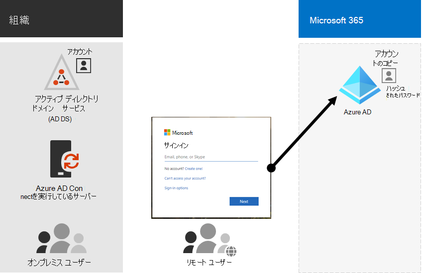
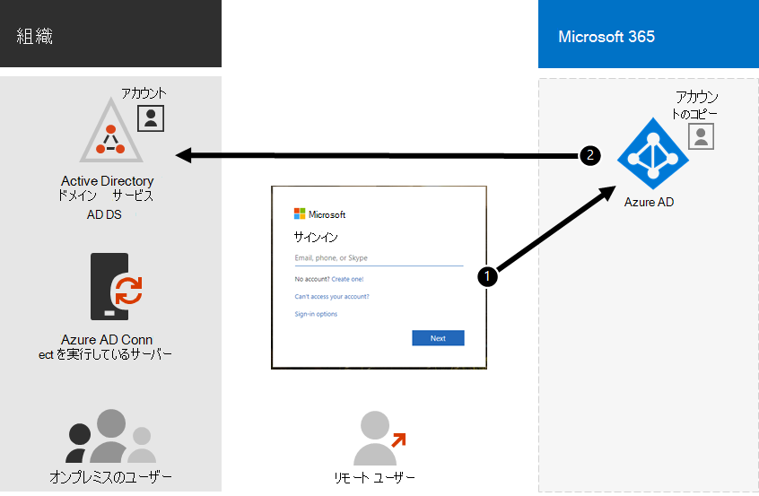

# ハイブリッド ID とディレクトリ同期によるMicrosoft 365

*この記事は、Microsoft 365 Enterprise と Office 365 Enterprise の両方に適用されます。*

ビジネス ニーズと技術的要件に応じて、ハイブリッド ID モデルとディレクトリ同期は、ハイブリッド ID モデルとディレクトリ同期を採用している企業のお客様にとって最も一般的な選択肢Microsoft 365。 ディレクトリ同期を使用すると、Active Directory ドメイン サービス (AD DS) 内の ID を管理し、ユーザー アカウント、グループ、連絡先に対する更新はすべて、Microsoft 365 サブスクリプションの Azure Active Directory (Azure AD) テナントに同期されます。

>[!Note]
>DS ADアカウントが初めて同期された場合、ds ユーザー アカウントには Microsoft 365 ライセンスが自動的に割り当てられるのではなく、電子メールなどの Microsoft 365 サービスにアクセスできません。 最初に使用場所を割り当てる必要があります。 次に、グループ メンバーシップを使用して、個別または動的にこれらのユーザー アカウントにライセンスを割り当てる。
>

## ハイブリッド ID の認証

ハイブリッド ID モデルを使用する場合、認証には次の 2 種類があります。

- 管理された認証

  Azure ADは、ローカルに保存されたハッシュ バージョンのパスワードを使用して認証プロセスを処理するか、オンプレミスのソフトウェア エージェントに資格情報を送信して、オンプレミスの AD DS によって認証されます。

- フェデレーション認証

  Azure AD認証を要求するクライアント コンピューターを別の ID プロバイダーにリダイレクトします。

### 管理された認証

管理認証には、次の 2 種類があります。

- パスワード ハッシュ同期 (PHS)

  Azure AD認証自体を実行します。

- パススルー認証 (PTA)

  Azure AD DS AD認証を実行しています。

#### パスワード ハッシュ同期 (PHS)

PHS を使用すると、DS ユーザー ADと同期し、Microsoft 365をオンプレミスで管理できます。 ユーザー パスワードのハッシュは、AD DS から Azure AD に同期され、ユーザーはオンプレミスとクラウドで同じパスワードを使用できます。 これは、Azure ADで DS ID の認証を有効にする最も簡単なAD。 

オンプレミスでパスワードを変更またはリセットすると、新しいパスワード ハッシュが Azure AD に同期され、ユーザーはクラウド リソースとオンプレミス リソースに対して常に同じパスワードを使用できます。 ユーザー のパスワードは、Azure サーバーに送信AD、クリア テキストで azure AD保存されません。 Id Protection など、Azure ADの一部のプレミアム機能では、どの認証方法が選択されているに関係なく PHS が必要です。
  
詳細 [については、「適切な認証方法の選択](/azure/active-directory/hybrid/choose-ad-authn) 」を参照してください。
  
#### パススルー認証 (PTA)

PTA は、1 つ以上のオンプレミス サーバーで実行されているソフトウェア エージェントを使用して Azure AD 認証サービスの簡単なパスワード検証を提供し、AD DS を使用してユーザーを直接検証します。 PTA を使用すると、DS ADアカウントとMicrosoft 365を同期し、オンプレミスのユーザーを管理します。 

PTA を使用すると、ユーザーはオンプレミスのアカウントとパスワードを使用して、Microsoft 365とアプリケーションの両方にサインインできます。 この構成では、Azure サーバーにパスワード ハッシュを格納せずに、AD DS に対してユーザーのパスワードを直接検証AD。 

PTA は、セキュリティ要件を持つ組織でも、オンプレミスのユーザー アカウントの状態、パスワード ポリシー、ログオン時間を直ちに適用します。 
  
詳細 [については、「適切な認証方法の選択](/azure/active-directory/hybrid/choose-ad-authn) 」を参照してください。
  
### フェデレーション認証

フェデレーション認証は、主に、より複雑な認証要件を持つ大規模なエンタープライズ組織向けです。 AD DS ID は、Microsoft 365と同期され、ユーザー アカウントはオンプレミスで管理されます。 フェデレーション認証を使用すると、ユーザーはオンプレミスとクラウドで同じパスワードを持ち、ユーザーはパスワードを使用するために再びサインインする必要Microsoft 365。 

フェデレーション認証は、スマートカードベース認証やサードパーティの多要素認証などの追加の認証要件をサポートできます。通常、組織が Azure AD でネイティブにサポートされていない認証要件を持っている場合に必要です。
 
詳細 [については、「適切な認証方法の選択](/azure/active-directory/hybrid/choose-ad-authn) 」を参照してください。
  
#### サード パーティ認証と ID プロバイダー

オンプレミスのディレクトリ オブジェクトは、Microsoft 365に同期され、クラウド リソース アクセスは主にサード パーティ ID プロバイダー (IdP) によって管理されます。 組織でサードパーティのフェデレーション ソリューションを使用している場合は、サード パーティのフェデレーション ソリューションが Azure AD と互換性がある場合は、Microsoft 365 用にそのソリューションを使用してサインオンを構成できます。
  
詳細については [、「Azure ADフェデレーション互換性リスト](/azure/active-directory/connect/active-directory-aadconnect-federation-compatibility) 」を参照してください。
  
## AD DS の準備

同期を使用して、Microsoft 365へのシームレスな移行を実現するには、AD Microsoft 365ディレクトリ同期の展開を開始する前に、AD DS フォレストを準備する必要があります。
  
ディレクトリの準備では、次のタスクに重点を置く必要があります。

- 重複する **proxyAddress 属性と** **userPrincipalName 属性を削除** します。
- 有効な **userPrincipalName 属性を使用して、空の userPrincipalName** 属性と無効な **userPrincipalName 属性を更新** します。
- **givenName**、 surname ( **sn** ) 、 **sAMAccountName**、 **displayName**、 **mail**、 **proxyAddresses**、 **mailNickname**、 **userPrincipalName** 属性の無効で疑いがある文字を削除します。 属性の準備の詳細については、「同期ツールで同期される属性の一覧[」Azure Active Directory参照してください](https://go.microsoft.com/fwlink/p/?LinkId=396719)。

    > [!NOTE]
    > これらは、Azure が同期する属性とAD Connectです。 
  
## 複数フォレストの展開に関する考慮事項

複数のフォレストと SSO オプションの場合は[、Azure サーバーのカスタム インストールを使用AD Connect。](/azure/active-directory/hybrid/how-to-connect-install-custom)
  
組織に認証用の複数のフォレスト (ログオン フォレスト) がある場合は、次の情報を強くお勧めします。
  
- **フォレストの統合を検討してください。** 一般に、複数のフォレストを維持するために必要なオーバーヘッドが大きくなります。 組織に個別のフォレストの必要性を指示するセキュリティ上の制約がない限り、オンプレミス環境の簡素化を検討してください。
- **プライマリ ログオン フォレストでのみ使用します。** 最初のロールアウトMicrosoft 365、プライマリ ログオン フォレストにのみ展開Microsoft 365。 

マルチフォレスト AD DS 展開を統合できない場合、または他のディレクトリ サービスを使用して ID を管理できない場合は、Microsoft またはパートナーの助けを借りてこれらを同期できます。
  
詳細[については、「トポロジ for Azure AD Connect」](/azure/active-directory/hybrid/plan-connect-topologies)を参照してください。
  
## ディレクトリ同期に依存する機能
  
ディレクトリ同期は、次の機能に必要です。
  
- Azure AD シームレス シングル Sign-On (SSO)
- Skype共存
- Exchangeハイブリッド展開には、次の機能があります。
  - オンプレミスの環境とユーザーの間で完全に共有されたグローバル アドレス一Exchange (GAL) Microsoft 365。
  - 異なるメール システムからの GAL 情報の同期。
  - ユーザーをサービスサービスに追加したり、ユーザーを削除Microsoft 365する機能。 これには、次の情報が必要です。
  - ディレクトリ同期のセットアップ中に、2 つの方法で同期を構成する必要があります。 既定では、ディレクトリ同期ツールはディレクトリ情報のみをクラウドに書き込む。 2 者間同期を構成する場合は、限られた数のオブジェクト属性がクラウドからコピーされ、ローカルの AD DS に書き戻されるように、書き戻し機能を有効にします。 書き戻しは、ハイブリッド モードExchange呼ばれます。 
  - オンプレミスのハイブリッドExchange展開
  - 他のユーザー メールボックスをオンプレミスにMicrosoft 365一部のユーザー メールボックスをユーザー メールボックスに移動する機能。
  - セーフ送信者とブロックされた送信者は、オンプレミスにレプリケートMicrosoft 365。
  - 基本的な委任と電子メールの代理送信機能。
  - 統合されたオンプレミスのスマート カードまたは多要素認証ソリューションがあります。
- 写真、サムネイル、会議室、セキュリティ グループの同期

## 次の手順

ハイブリッド ID を展開する準備ができたら、「ディレクトリ同期の準備 [」を参照してください](prepare-for-directory-synchronization.md)。
