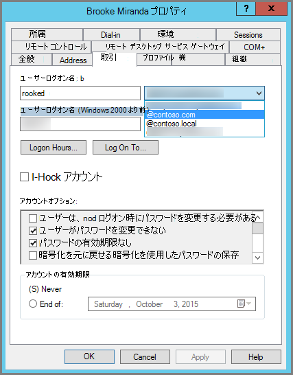

# <a name="prepare-a-non-routable-domain-for-directory-synchronization"></a>ディレクトリ同期のために非ルーティング ドメインの準備を整える

Microsoft 365 とオンプレミス ディレクトリとの同期時には、Azure Active Directory (Azure AD) 内に確認済みのドメインを用意する必要があります。オンプレミス Active Directory Domain Services (AD DS) ドメインに関連付けられたユーザー プリンシパル名 (UPN) のみが同期されます。ただし、".local" などの非ルーティング ドメインが含まれている UPN (例: billa@contoso.local) は、.onmicrosoft.com ドメイン (例: billa@contoso.onmicrosoft.com) と同期されるようになります。 

現在、AD DS 内のユーザー アカウントに ".local" ドメインを使用している場合は、Microsoft 365 ドメインとの正しい同期のために、確認済みのドメイン (例: billa@contoso.com) を使用するようにユーザー アカウントを変更することをお勧めします。
  
## <a name="what-if-i-only-have-a-local-on-premises-domain"></a>オンプレミス ドメインが ".local" のみの場合について

AD DS を Microsoft 365 テナント の Azure AD テナントに同期するために、Azure AD Connect を使用します。 詳細については、[オンプレミスの ID と Azure AD の統合](/azure/architecture/reference-architectures/identity/azure-ad)に関する記事を参照してください。
  
Azure AD Connect では、ユーザーがオンプレミスで使用している資格情報と同じものを使用してサインイン可能になるように、ユーザーの UPN とパスワードを同期します。ただし、Azure AD Connect によるユーザーの同期は、Microsoft 365 で確認済みのドメインのみを対象としています。Microsoft 365 の ID は Azure AD によって管理されるため、ドメインも Azure AD によって確認されていることになります。つまり、ドメインは有効なインターネット ドメイン (com、.org、.net、.us など) であることが必要になります。内部の AD DS が非ルーティング ドメイン (例: ".local") のみを使用している場合は、そのドメインが Microsoft 365 テナントの確認済みドメインと一致する可能性はありません。この問題は、オンプレミスの AD DS のプライマリ ドメインを変更するか、1 つ以上の UPN サフィックスを追加することで解決できます。
  
### <a name="change-your-primary-domain"></a>プライマリ ドメインを変更する

プライマリ ドメインを、contoso.com など、Microsoft 365 で確認したドメインに変更します。これで、ドメイン contoso.local を使用しているすべてのユーザーが contoso.com に更新されます。ただし、これは非常に複雑なプロセスです。それよりも簡単な解決策として、次のセクションで説明されています。
  
### <a name="add-upn-suffixes-and-update-your-users-to-them"></a>UPN サフィックスを追加してユーザーをそのサフィックスに更新する

Microsoft 365 で確認したドメイン (複数の場合あり) と一致するように、AD DS で新しい UPN サフィックス (複数の場合あり) を登録すると、".local" の問題を解決できます。新しいサフィックスを登録した後、ユーザーの UPN を更新して、".local" を新しいドメイン名で置き換えます。その結果、ユーザー アカウントは billa@contoso.com のようになります。
  
確認済みドメインを使用するように UPN を更新すると、オンプレミス AD DS と Microsoft 365 を同期する準備が完了します。
  
#### <a name="step-1-add-the-new-upn-suffix"></a>手順 1: 新しい UPN サフィックスを追加する**
  
1. AD DS ドメイン コントローラーのサーバー マネージャーで、**[ツール]** \> **[Active Directory ドメインと信頼関係]** の順に選びます。
    
    **または (Windows Server 2012 を所有していない場合)**
    
    **Windows キー + R** を押して **[実行]** ダイアログ開き、「Domain.msc」と入力してから **[OK]** を選択します。
    
    ![[Active Directory ドメインと信頼関係] を選択します。](../media/46b6e007-9741-44af-8517-6f682e0ac974.png)
  
2. **[Active Directory ドメインと信頼関係]** ウィンドウで、**[Active Directory ドメインと信頼関係]** を右クリックして **[プロパティ]** を選択します。
    
    ![[Active Directory ドメインと信頼関係] を右クリックして [プロパティ] を選択します。](../media/39d20812-ffb5-4ba9-8d7b-477377ac360d.png)
  
3. **[UPN サフィックス]** タブの **[代替の UPN サフィックス]** ボックスに、新しいサフィックスを入力して **[追加]** \> **[適用]** を選択します。
    
    
  
    サフィックスの追加が完了したら、**[OK]** を選択します。 
    
 #### <a name="step-2-change-the-upn-suffix-for-existing-users"></a>手順 2: 既存ユーザーの UPN サフィックスを変更する
  
1. AD DS ドメイン コントローラーのサーバー マネージャーで、**[ツール]** \> **[Active Directory ユーザーとコンピューター]** の順に選びます。
    
    **または (Windows Server 2012 を所有していない場合)**
    
    **Windows キー + R** を押して **[実行]** ダイアログ開き、「Dsa.msc」と入力してから **[OK]** を選択します。
    
2. ユーザーを選択し、右クリックして **[プロパティ]** を選択します。
    
3. **[アカウント]** タブの UPN サフィックス ドロップダウン リストで、新しい UPN サフィックスを選択してから **[OK]** をクリックします。
    
    
  
4. すべてのユーザに対して、ここまでの手順を実行します。
    
   
### <a name="use-powershell-to-change-the-upn-suffix-for-all-of-your-users"></a>すべてのユーザーの UPN サフィックスを変更するために PowerShell を使用する

更新するユーザー アカウントが大量になる場合は、Windows PowerShell を使用すると作業が簡単になります。次の例では、コマンドレット [Get-ADUser](/previous-versions/windows/it-pro/windows-server-2008-R2-and-2008/ee617241(v=technet.10)) と [Set-ADUser](/previous-versions/windows/it-pro/windows-server-2008-R2-and-2008/ee617215(v=technet.10)) を使用して、すべての contoso.local サフィックスを AD DS で contoso.com に変更します。 

たとえば、次の PowerShell コマンドを実行すると、すべての contoso.local サフィックスが contoso.com に更新されます。
    
  ```powershell
  $LocalUsers = Get-ADUser -Filter "UserPrincipalName -like '*contoso.local'" -Properties userPrincipalName -ResultSetSize $null
  $LocalUsers | foreach {$newUpn = $_.UserPrincipalName.Replace("@contoso.local","@contoso.com"); $_ | Set-ADUser -UserPrincipalName $newUpn}
  ```

AD DS の Windows PowerShell を使用する方法の詳細については、「[Active Directory Windows PowerShell モジュール](/previous-versions/windows/it-pro/windows-server-2008-R2-and-2008/ee617195(v=technet.10))」を参照してください。