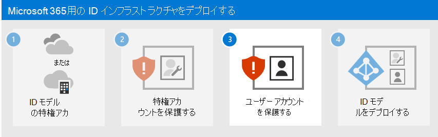

# 手順 2. Microsoft 365特権アカウントを保護する

*この記事は、Microsoft 365 Enterprise および Office 365 Enterprise の両方に適用されます。*

通常、情報の収集やフィッシング攻撃など、Microsoft 365 テナントのセキュリティ侵害は、Microsoft 365特権アカウントの資格情報を侵害することによって行われます。 クラウドのセキュリティは、お客様と Microsoft 間のパートナーシップに基づくものです。
  
- Microsoft クラウド サービスは信頼とセキュリティの基盤の上に構築されます。 Microsoft が提供するセキュリティ制御と機能は、お客様のデータとアプリケーションの保護に役立ちます。
    
- お客様はご自分のデータと ID を所有しており、それらとオンプレミス リソースのセキュリティ、およびご自分が制御しているクラウド コンポーネントのセキュリティを保護する責任を担っています。
    
Microsoft は、組織を保護するための機能を提供していますが、それらの機能を使用する場合にのみ有効です。 使用しないと、攻撃に対して脆弱になる可能性があります。 特権アカウントを保護するために、Microsoft は以下の詳細な手順を支援します。
  
1. 専用の特権を持つクラウドベースのアカウントを作成し、必要な場合にのみ使用します。
    
2. 専用のMicrosoft 365特権アカウントに対して多要素認証 (MFA) を構成し、最も強力な形式のセカンダリ認証を使用します。

3. ゼロ トラスト ID とデバイス アクセスに関する推奨事項を使用して特権アカウントを保護します。

## 1. 専用の特権を持つクラウドベースのユーザー アカウントを作成し、必要な場合にのみ使用する

管理者ロールが割り当てられている日常的なユーザー アカウントを使用する代わりに、Azure ADに管理者ロールを持つ専用のユーザー アカウントを作成します。 

この時点から、管理者特権を必要とするタスクに対してのみ、専用の特権アカウントでサインインします。 他のすべての Microsoft 365 の管理は、他の管理ロールをユーザー アカウントに割り当てて行う必要があります。
  
> [!NOTE]
> これには、日常のユーザー アカウントとしてサインアウトし、専用の管理者アカウントでサインインするための追加の手順が必要です。 ただし、これは管理者の操作に対してのみ行う必要があります。 管理者アカウントの侵害後にMicrosoft 365サブスクリプションを回復するには、さらに多くの手順が必要であると考えてください。

また、[緊急アクセス アカウント](/azure/active-directory/roles/security-emergency-access)を作成して、誤ってAzure ADからロックアウトされないようにする必要もあります。

管理者ロールのオンデマンドの Just-In-Time 割り当てのために、Azure AD Privileged Identity Management (PIM) を使用して特権アカウントをさらに保護できます。 
 
## 2. 専用のMicrosoft 365特権アカウントの多要素認証を構成する

多要素認証 (MFA) には、アカウント名とパスワード以外の追加情報が必要です。 Microsoft 365 は、次の追加の検証方法をサポートしています。
  
- Microsoft Authenticator アプリ
- 電話
- テキスト メッセージを介して送信されるランダムに生成された確認コード
- スマート カード (仮想または物理) (フェデレーション認証が必要)
- 生体認証デバイス
- Oauth トークン
- 
    
>[!Note]
>アメリカ国立標準技術研究所 (NIST) の標準に準拠する必要がある組織では、電話またはテキスト メッセージベースの追加の検証方法の使用が制限されています。 詳細については、[ここ](https://pages.nist.gov/800-63-FAQ/#q-b01)をクリックしてください。
>

クラウドにのみ格納されているユーザー アカウント (クラウド専用 ID モデル) を使用している小規模企業の場合は、専用の特権アカウントごとにスマートフォンに送信された電話またはテキスト メッセージ検証コードを使用して MFA を構成するように [MFA を設定](/office365/admin/security-and-compliance/set-up-multi-factor-authentication) します。
    
Microsoft 365 ハイブリッド ID モデルを使用している大規模な組織の場合は、より多くの検証オプションがあります。 より強力なセカンダリ認証方法用にセキュリティ インフラストラクチャが既に用意されている場合は、 [MFA を設定](../admin/security-and-compliance/set-up-multi-factor-authentication.md) し、適切な検証方法に対して専用の特権アカウントを構成します。
  
必要な強力な検証方法のセキュリティ インフラストラクチャが、Microsoft 365 MFA に対して機能していない場合は、中間セキュリティ対策として、Microsoft Authenticator アプリ、電話、またはテキスト メッセージ検証コードをスマート フォンに送信するテキスト メッセージ検証コードを使用して、MFA を使用して専用の特権アカウントを構成することを強くお勧めします。 MFA によって提供される追加の保護なしで、専用の特権アカウントを残さないでください。
  
詳細については、「[Microsoft 365 の MFA](../admin/security-and-compliance/multi-factor-authentication-microsoft-365.md)」を参照してください。
  
## 3. ゼロ トラスト ID とデバイス アクセスに関する推奨事項を使用して管理者アカウントを保護する

セキュリティで保護された生産性の高い従業員を確保するために、Microsoft は [ID とデバイスへのアクセス](../security/office-365-security/microsoft-365-policies-configurations.md)に関する一連の推奨事項を提供します。 ID については、次の記事の推奨事項と設定を使用します。

- [前提条件](../security/office-365-security/identity-access-prerequisites.md)
- [共通 ID とデバイスのアクセス ポリシー](../security/office-365-security/identity-access-policies.md)

## 企業組織のための追加の保護

これらの追加の方法を使用して、特権アカウントと、それを使用して実行する構成が可能な限り安全であることを確認します。
  
### 特権アクセス ワークステーション (PAW)

高い権限を持つタスクの実行が、可能な限りセキュリティで保護されるようにするには、特権アクセス ワークステーション (PAW) を使用します。 PAW は、特権アカウントを必要とするMicrosoft 365構成など、機密性の高い構成タスクにのみ使用される専用コンピューターです。 このコンピューターではインターネットの閲覧やメールを日常行わないので、インターネットの攻撃や脅威から適切に保護されます。
  
PAWの設定方法については、[https://aka.ms/cyberpaw](/security/compass/privileged-access-devices)を参照してください。

Azure AD テナントと管理者アカウントに対して Azure PIM を有効にする場合は、[PIM の構成手順](/azure/active-directory/active-directory-privileged-identity-management-configure)を参照してください。

サイバー攻撃者から特権アクセスをセキュリティで保護する包括的なロードマップを作成する場合は、「[Azure AD でのハイブリッドおよびクラウド デプロイ用の特権アクセスをセキュリティで保護する](/azure/active-directory/admin-roles-best-practices)」を参照してください。

### Azure AD Privileged Identity Management

特権アカウントに管理者ロールを永続的に割り当てるのではなく、Azure AD PIM を使用して、必要に応じて管理者ロールのオンデマンドの Just-In-Time 割り当てを有効にすることができます。
  
管理者アカウントは、永続的な管理者から適格な管理者に移動します。 管理者ロールは、誰かが必要とするまで非アクティブとなります。 次に、アクティブ化プロセスを完了して、事前に決められた時間、特権アカウントに管理者ロールを追加します。 期限が切れると、PIM は特権アカウントから管理者ロールを削除します。
  
PIM とこのプロセスを使用すると、特権アカウントが悪意のあるユーザーによる攻撃や使用に対して脆弱になる時間が大幅に短縮されます。

PIM は、Microsoft 365 E5 に含まれている Azure Active Directory Premium P2 で使用できます。 または、管理者アカウントの Azure Active Directory Premium P2 ライセンスを個別に購入できます。
  
詳細については、以下を参照してください。

- [Azure AD Privileged Identity Management](/azure/active-directory/active-directory-privileged-identity-management-configure)。
- [Azure AD でのハイブリッドおよびクラウド デプロイ用の特権アクセスをセキュリティで保護する](/azure/active-directory/roles/security-planning)
  

### 特権アクセス管理

特権アクセス管理は、テナントでのタスクベースのアクティビティに対して Just-In-Time アクセスを指定するポリシーを構成することで有効になります。これは、機密性の高いデータへの継続的なアクセスや重要な構成設定へのアクセスに、既存の特権管理者アカウントが使用される可能性のある侵害から組織を保護するために役立ちます。たとえば、テナント内の組織のメールボックス設定にアクセスして変更する際には、明示的な承認が必要になる特権アクセス管理ポリシーを構成できます。

この手順では、テナントの特権アクセス管理を有効にして、組織のデータおよび構成設定へのタスクベースのアクセスに対するセキュリティを強化する特権アクセスポリシーを構成します。組織の特権アクセスは、次の 3 つの基本的な手順で開始します。

- 承認者のグループを作成する
- 特権アクセスを有効にする
- 承認ポリシーを作成する

特権アクセス管理により、組織は永続的な特権なしで運用でき、そのような永続的な管理アクセスによって発生する脆弱性に対する防御レイヤーを提供できます。 特権アクセスには、関連する承認ポリシーが定義されているタスクを実行するための承認が必要です。 承認ポリシーに含まれるタスクを実行する必要があるユーザーは、アクセス承認を要求して許可する必要があります。

特権アクセス管理を有効にするには、「[特権アクセス管理を構成する](/office365/securitycompliance/privileged-access-management-configuration)」を参照してください。

詳細については、「[特権アクセス管理](/office365/securitycompliance/privileged-access-management-overview)」を参照してください。

### Microsoft 365 ログ記録用のセキュリティ情報とイベント管理 (SIEM)

サーバー上で実行される SIEM ソフトウェアは、アプリケーションとネットワーク ハードウェアによって作成されたセキュリティ アラートとイベントのリアルタイム分析を実行します。 SIEM サーバーが Microsoft 365 のセキュリティ アラートとイベントを分析およびレポート機能に含めることができるようにするには、Azure AD を SEIM に統合します。 「[Azure Log Integration の概要](/azure/security/security-azure-log-integration-overview)」を参照してください。

## 次の手順

[手順 3](microsoft-365-secure-sign-in.md) に進み、ユーザー アカウントをセキュリティで保護します。
