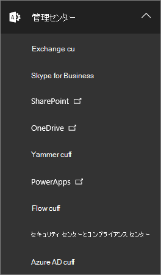
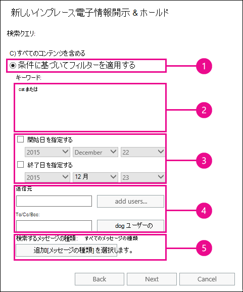
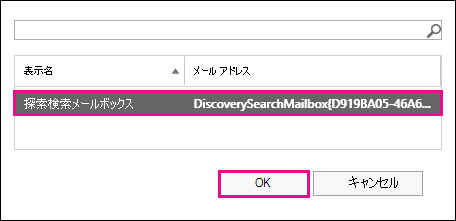
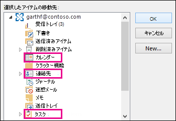

# ユーザーのメールボックスで削除されたアイテムを復元するRecover deleted items in a user mailbox

**この記事は、管理者を対象としています。自分のメールボックス内の削除済みアイテムを復元しようとしていますか?****This article is for administrators. Are you trying to recover deleted items in your own mailbox?** 次のどちらかの操作を試します。 Try one of the following:
- [Windows 版 Outlook で削除済みのアイテムを復元するRecover deleted items in Outlook for Windows](https://support.office.com/article/49e81f3c-c8f4-4426-a0b9-c0fd751d48ce)
- [Outlook Web App で削除済みのアイテムやメールを復元するRecover deleted items or email in Outlook Web App](https://support.office.com/article/c3d8fc15-eeef-4f1c-81df-e27964b7edd4)
- [Outlook on the web で削除されたメールメッセージを復元するRestore deleted email messages in Outlook on the web](https://support.office.com/article/a8ca78ac-4721-4066-95dd-571842e9fb11)
- [Outlook.comOutlook.com](https://go.microsoft.com/fwlink/p/?LinkID=623435)
   
ユーザーが Outlook メールボックスからアイテムを完全に削除したかどうか。Did a user permanently delete items from their Outlook mailbox? ユーザーはそれらを回復することはできません。The user wants them back but can't recover them. 削除されたアイテムがユーザーのメールボックスから完全に削除されていない場合は、それらを回復できることがあります。You may be able recover the purged items if they haven't been permanently removed from the user's mailbox. これを行うには、Exchange Online のインプレース電子情報開示ツールを使用して、ユーザーのメールボックスで、削除されたメールやその他のアイテム (連絡先、予定表の予定、タスクなど) を検索します。You do this by using the In-Place eDiscovery tool in Exchange Online to search for deleted email and other items—and such as contacts, calendar appointments, and tasks—in a user's mailbox. 削除済みアイテムが見つかった場合は、そのアイテムを PST ファイル (Outlook データファイルとも呼ばれます) にエクスポートし、ユーザーがそのアイテムをメールボックスに復元するために使用できます。If you find the deleted items, you can export them to a PST file (also called an Outlook Data File), which the user can then use to restore the items back to their mailbox.
  
ユーザーのメールボックス内の削除済みアイテムを復元する手順を次に示します。Here are the steps for recovering deleted items in a user's mailbox. これにはどのくらい時間がかかりますか?How long will this take? 最初に、回復しようとしているアイテムの数に応じて、すべての手順を完了するのに20分または30分かかる場合があります。The first time might take 20 or 30 minutes to complete all the steps, depending on how many items you're trying to recover.
  
> [!NOTE]
> この記事の手順を実行するには、Microsoft 365 の **exchange 管理** 者または **全体管理者** であるか、または Exchange Online の Organization Management 役割グループのメンバーである必要があります。You have to be an **Exchange administrator** or **Global administrator** in Microsoft 365 or be a member of the Organization Management role group in Exchange Online to perform the steps in this article. 詳細については、「[Microsoft 365 の管理者の役割](https://support.office.com/article/da585eea-f576-4f55-a1e0-87090b6aaa9d)」を参照してください。For more information, see [About Microsoft 365 admin roles](https://support.office.com/article/da585eea-f576-4f55-a1e0-87090b6aaa9d). 
  
## 手順 1: 自分自身に電子情報開示のアクセス許可を割り当てるStep 1: Assign yourself eDiscovery permissions

最初の手順として、インプレース電子情報開示ツールを使用してユーザーのメールボックスを検索できるように、Exchange Online で必要なアクセス許可を自分自身に割り当てます。The first step is to assign yourself the necessary permissions in Exchange Online so you can use the In-Place eDiscovery tool to search a user's mailbox. これを行う必要があるのは 1 回だけです。You only have to do this once. 今後、別のメールボックスを検索する必要がある場合は、この手順を省略できます。If you have to search another mailbox in the future, you can skip this step.
  
1. 職場または学校のアカウントで[Microsoft 365 for business にサインインする場所](https://support.microsoft.com/office/where-to-sign-into-microsoft-365-for-business-e9eb7d51-5430-4929-91ab-6157c5a050b4)。[Where to sign in to Microsoft 365 for business](https://support.microsoft.com/office/where-to-sign-into-microsoft-365-for-business-e9eb7d51-5430-4929-91ab-6157c5a050b4) with your work or school account. 
    
2. 左上のアプリ起動ツールのアイコンをクリックして、Microsoft 365 のアプリ起動ツールのアイコンを選択し、  [ **管理者**] をクリックします。Select the app launcher icon  in the upper-left and click **Admin**.
    
3. Microsoft 365 管理センターの左側のナビゲーションで、[ **管理センター**] を展開し、[ **Exchange**] をクリックします。In the left navigation in the Microsoft 365 admin center, expand **Admin centers**, and then click **Exchange**.
    
    
  
4. Exchange 管理センターで、[ **アクセス許可**] をクリックし、[ **管理役割**] をクリックします。In the Exchange admin center, click **Permissions**, and then click **Admin roles**.
    
5. リストビューで、[**探索管理**] を選択し、[編集アイコンの**編集**] をクリックし  ます。In the list view, select **Discovery Management**, and then click **Edit**.
    
    
  
6. [**役割グループ**] の [**メンバー**] で、[追加] アイコン**をクリックし**  ます。In **Role Group**, under **Members**, click **Add**.
    
7. [ **メンバーの選択**] で、名前のリストから [自分自身] を選択し、[ **追加**] をクリックして、[ **OK**] をクリックします。In **Select Members**, select yourself from the list of names, click **Add**, and then click **OK**.
    
    > [!NOTE]
    > また、組織の管理や TenantAdmins など、メンバーとなっているグループを追加することもできます。You can also add a group that you are a member of, such as Organization Management or TenantAdmins. グループを追加すると、そのグループの他のメンバーに、インプレース電子情報開示ツールを実行するために必要なアクセス許可が割り当てられます。If you add a group, other members of the group will be assigned the necessary permissions to run the In-Place eDiscovery tool. 
  
8. [ **役割グループ**] で、[ **保存**] をクリックします。In **Role Group**, click **Save**.
    
9. Microsoft 365 からサインアウトします。Sign out of Microsoft 365.
    
    新しいアクセス許可が有効になるように、次の手順を開始する前に、サインアウトする必要があります。You have to sign out before you start the next step so the new permissions will take effect.
    
> [!CAUTION]
> Discovery Management 役割グループのメンバーは、機密メッセージ コンテンツにアクセスすることができます。Members of the Discovery Management role group can access sensitive message content. これには、組織内のすべてのメールボックスの検索、検索結果 (およびその他のメールボックスアイテム) のプレビュー、探索メールボックスへの結果のコピー、および検索結果を PST ファイルにエクスポートすることが含まれます。This includes searching all mailboxes in your organization, previewing the search results (and other mailbox items), copying the results to a discovery mailbox, and exporting the search results to a PST file. 
  
[Return to topReturn to top](recover-deleted-items-in-a-mailbox.md)
  
## 手順 2: ユーザーのメールボックスで削除済みアイテムを検索するStep 2: Search the user's mailbox for deleted items

インプレース電子情報開示検索を実行すると、検索するメールボックス内の [回復可能なアイテム] フォルダーが自動的に検索に含められます。When you run an In-Place eDiscovery search, the Recoverable Items folder in the mailbox that you search is automatically included in the search. 回復可能なアイテムフォルダーは、完全に削除されたアイテムがメールボックスから削除 (完全に削除) されるまで保存されます。The Recoverable Items folder is where permanently deleted items are stored until they're purged (permanently removed) from the mailbox. そのため、アイテムが削除されていない場合は、インプレース電子情報開示ツールを使用して見つけることができます。So, if an item hasn't been purged, you should be able to find it by using the In-Place eDiscovery tool.
  
1. 職場または学校のアカウントで[Microsoft 365 for business にサインインする場所](https://support.microsoft.com/office/where-to-sign-into-microsoft-365-for-business-e9eb7d51-5430-4929-91ab-6157c5a050b4)。[Where to sign in to Microsoft 365 for business](https://support.microsoft.com/office/where-to-sign-into-microsoft-365-for-business-e9eb7d51-5430-4929-91ab-6157c5a050b4) with your work or school account. 
    
2. 左上のアプリ起動ツールのアイコンをクリックして、Microsoft 365 のアプリ起動ツールのアイコンを選択し、  [ **管理者**] をクリックします。Select the app launcher icon  in the upper-left and click **Admin**.
    
3. Microsoft 365 管理センターの左側のナビゲーションで、[ **管理者**] を展開し、[ **Exchange**] をクリックします。In the left navigation in the Microsoft 365 admin center, expand **Admin**, and then click **Exchange**.
    
4. Exchange 管理センターで、[**コンプライアンス管理**] をクリックし、[**インプレース電子情報開示の &amp; 保持**] をクリックして、[**新規** ![ 追加] アイコンをクリックし ](../media/8ee52980-254b-440b-99a2-18d068de62d3.gif) ます。In the Exchange admin center, click **Compliance management**, click **In-Place eDiscovery &amp; Hold**, and then click **New**.
    
    ![EAC の [コンプライアンス管理] ページで、[インプレースの電子情報開示と保持] をクリックします。](../media/9d9ff0f5-b9be-45b8-8b5e-6037a856b0a8.png)
  
5. [ **名前と説明** ] ページで、検索の名前 (電子メールを回復するユーザーの名前など) を入力し、オプションの説明を入力して、[ **次へ**] をクリックします。On the **Name and description** page, type a name for the search (such as the name of the user you're recovering email for), an optional description, and then click **Next**.
    
6. [**メールボックス**] ページで、[**検索するメールボックスを指定する**] をクリックし、[追加] アイコン**をクリックし**  ます。On the **Mailboxes** page, click **Specify mailboxes to search**, and then click **Add**.
    
    ![[検索するメールボックスを指定する] をクリックして表面化メールボックスを検索する](../media/83879a40-5e5c-49a8-be3b-c0023d197588.png)
  
7. 削除されたメールを回復するユーザーの名前を検索して選択し、[ **追加**] をクリックして、[ **OK]** をクリックします。Find and select the name of the user that you're recovering the deleted email for, click **Add**, and then click **OK**.
    
8. [**次へ**] をクリックします。Click **Next**.
    
    [ **検索クエリ** ] ページが表示されます。The **Search query** page is displayed. ここでは、ユーザーのメールボックス内の不足しているアイテムを検索するために使用できる検索条件を定義します。This is where you define the search criteria that will help you find the missing items in user's mailbox. 
    
9. **[検索クエリ]** ページで、以下のフィールドに入力します。On the **Search query** page, complete the following fields: 
    
  - **すべてのコンテンツを含める** ユーザーのメールボックス内のすべてのコンテンツを検索結果に含めるには、このオプションを選択します。**Include all content** Select this option to include all content in the user's mailbox in the search results. このオプションを選択する場合、追加の検索条件は指定できません。If you select this option, you can't specify additional search criteria. 
    
  - **条件に基づいてフィルターを** 適用するこのオプションを選択すると、キーワード、開始日と終了日、送信者および受信者のアドレス、メッセージの種類などの検索条件を指定できます。**Filter based on criteria** Select this option to specify the search criteria, including keywords, start and end dates, sender and recipient addresses, and message types. 
    
    
  
|**Field****Field**|**使用する方法...****Use this to...**|
|:-----|:-----|
|             |キーワード、日付の範囲、受信者、メッセージの種類を指定します。Specify keywords, date range, recipients, and message types.    |
|             |キーワードまたは語句を含むメッセージを検索し、 **and** や **or**などの論理演算子を使用します。Search for messages with keywords or phrases, and use logical operators such as **AND** or **OR**.    |
|             |日付範囲内で送受信されたメッセージを検索します。Search for messages sent or received within a date range.    |
|             |特定のユーザーとの間で受信または送信されたメッセージを検索します。Search for messages received from or sent to specific people.    |
|             |すべてのメッセージの種類を検索するか、特定の種類を選択します。Search for all message types or select specific ones.    |
   
   > [!TIP]
   >  不足しているアイテムを検索する検索クエリを作成する方法については、以下のヒントを参照してください。Here are a few tips about how to build a search query to find missing items. 検索クエリの作成に役立つ情報をユーザーから入手して、探しているものを見つけてください。Try to get as much information from the user to help you create a search query so you can find what you're looking for. 不足しているメッセージを見つける方法がわからない場合は、[ **すべてのコンテンツを含める** ] オプションの使用を検討してください。If you are not sure how to find a missing message, consider using the **Include all content** option. 検索結果には、ユーザーによって削除されたアイテムを含む隠しフォルダー (パージフォルダーと呼ばれます) を含む、ユーザーの回復可能なアイテムフォルダー内のすべてのアイテムが含まれます。The search results will include all items in the user's Recoverable Items folder, including the hidden folder (called the Purges folder) that contain items that have been purged by the user. その後、手順3に進み、結果を探索メールボックスにコピーして、非表示フォルダー内のメッセージを確認します。Then you can go to Step 3, copy the results to a discovery mailbox, and look at the message in the hidden folder. ユーザーが最初に失われたメッセージを送信または受信したおおよその時期がわかっている場合は、[ **開始日を指定** し、 **終了日を指定** する] オプションを使用して日付範囲を指定します。If you know approximately when the missing message was originally sent or received by the user, use the **Specify start date** and **Specify end date** options to provide a date range. これにより、ユーザーがその日付範囲内で送受信したすべてのメッセージが返されます。This will return all messages sent or received by the user within that date range. 日付の範囲を指定することは、検索結果を絞り込むための最適な方法です。Specifying a date range is a really good way to narrow the search results. 不足しているメールを送信したユーザーがわかっている場合は、 **[差出人] ボックスを** 使用して、この送信者を指定します。If you know who sent the missing email, use the **From** box to specify this sender. さまざまな種類のメールボックスアイテムに対して検索結果を絞り込む場合は、[ **メッセージの種類の選択**] をクリックし、 **検索するメッセージ**の種類を選択してから、検索する特定のメッセージの種類を選択します。If you want to narrow the search results to different types of mailbox items, click **Select message types**, click **Select the message types to search**, and then choose a specific message type to search for. たとえば、予定表アイテムまたは連絡先のみを検索できます。For example, you can search only for calendar items or contacts. 検索できるさまざまなメッセージの種類のスクリーンショットを次に示します。既定では、すべてのメッセージの種類が検索されます。Here's a screenshot of the different message types you can search for; the default is to search for all message types. 
  
   [**検索クエリ**] ページが完了したら、[**次へ**] をクリックします。Click **Next** when you've completed the **Search query** page. 
    
10. [ **インプレース保持の設定** ] ページで、[ **完了** ] をクリックして検索を開始します。On the **In-Place Hold settings** page, click **Finish** to start the search. 削除されたメールを回復するために、ユーザーのメールボックスを保留にする理由はありません。To recover deleted email, there's no reason to place the user's mailbox on hold. 
    
    検索を開始すると、指定した条件に基づいて検索によって返されるアイテムの合計サイズと数の推定値が Exchange に表示されます。After you start the search, Exchange will display an estimate of the total size and number of items that will be returned by the search based on the criteria you specified.
    
11. 作成したばかりの検索を選択し、[更新の更新] を**クリックし**て、  詳細ウィンドウに表示される情報を更新します。Select the search you just created and click **Refresh** to update the information displayed in the details pane. **推定**の状態は、検索が完了したことを示します。The status of **Estimate Succeeded** indicates that the search has finished. また、Exchange には、手順9で指定した検索条件に基づいて、検索によって検出されたアイテムの総数 (およびそのサイズ) の推定値が表示されます。Exchange also displays an estimate of the total number of items (and their size) found by the search based on the search criteria you specified in step 9. 
    
12. 詳細ウィンドウで、[ **検索結果のプレビュー** ] をクリックして、見つかったアイテムを表示します。In the details pane, click **Preview search results** to view the items that were found. これは、探しているアイテムを特定するのに役立つことがあります。This might help you identify the item(s) that you're looking for. 回復しようとしているアイテムが見つかった場合は、手順4に進み、検索結果を PST ファイルにエクスポートします。If you find the item(s) you're trying to recover, go to step 4 to export the search results to a PST file. 
    
    ![[検索結果のプレビュー] をクリックして、回復しようとしているアイテムを表示します。](../media/a2cea921-dafa-45d6-97d4-ae45a226b8d3.png)
  
13. 探している内容が見つからない場合は、検索を選択し、 **Edit** ![ [編集] 編集アイコンをクリックして、 ](../media/ebd260e4-3556-4fb0-b0bb-cc489773042c.gif) [**検索クエリ**] をクリックすると、検索条件を変更できます。If you don't find what you're looking for, you can revise your search criteria by selecting the search, clicking **Edit**, and then clicking **Search query**. 検索条件を変更してから、検索を再実行してください。Change the search criteria and then rerun the search.
    
[Return to topReturn to top](recover-deleted-items-in-a-mailbox.md)
  
## オプション手順 3: 検索結果を探索メールボックスにコピーする(Optional) Step 3: Copy the search results to a discovery mailbox

検索結果をプレビューしてアイテムが見つからない場合や、ユーザーの回復可能なアイテムフォルダーにあるアイテムを確認する場合は、検索結果を特別なメールボックス (探索メールボックスと呼ばれます) にコピーして、そのメールボックスを web 上の Outlook で開いて実際のアイテムを表示することができます。If you can't find an items by previewing the search results or if you want to see which items are in the user's Recoverable Items folder, then you can copy the search results to a special mailbox (called a discovery mailbox) and then open that mailbox in Outlook on the web to view the actual items. 検索結果をコピーする最善の理由は、ユーザーの回復可能なアイテムフォルダー内のアイテムを表示できるようにするためです。The best reason to copy the search results is so you can view the items in the user's Recoverable Items folder. 多くの場合、回復しようとしているアイテムがパージサブフォルダーにあります。More than likely, the item you're trying to recover is located in the Purges subfolder. 
  
1. Exchange 管理センターで、[ **コンプライアンス管理**] \> **の [インプレース電子情報開示の &amp; 保持**] に移動します。In the Exchange admin center, go to **Compliance management** \> **In-Place eDiscovery &amp; Hold**.
    
2. 検索の一覧で、手順2で作成した検索を選択します。In the list of searches, select the search that you created in Step 2.
    
3. [**検索検索**] をクリックし、  ドロップダウンリストから [**検索結果のコピー** ] をクリックします。Click **Search**, and then click **Copy search results** from the drop-down list. 
    
    ![[検索] をクリックし、[検索結果のコピー] をクリックします。](../media/7888df82-94b4-4e44-8a53-f66854dc7c86.png)
  
4. [ **検索結果のコピー** ] ページで、[ **参照**] をクリックします。On the **Copy Search Results** page, click **Browse**.
    
    
  
5. [ **表示名**] で [ **探索検索メールボックス**] をクリックし、[ **OK**] をクリックします。Under **Display Name**, click **Discovery Search Mailbox**, and then click **OK**.
    
    
  
    > [!NOTE]
    > 探索検索メールボックスは、Microsoft 365 組織で自動的に作成される既定の証拠開示用メールボックスです。The Discovery Search Mailbox is a default discovery mailbox that is automatically created in your Microsoft 365 organization. 
  
6. [ **検索結果のコピー** ] ページに戻り、[ **コピー** ] をクリックして、検索結果を探索検索メールボックスにコピーするプロセスを開始します。Back on the **Copy Search Results** page, click **Copy** to start the process to copy the search results to the Discovery Search Mailbox. 
    
    ![検索結果を探索検索メールボックスにコピーするには、[コピー] をクリックします。](../media/71307a9d-f7a1-4e01-ae37-1d49040cc3fd.png)
  
7. [更新**の更新] をクリックし**て、  詳細ウィンドウに表示されるコピー状態に関する情報を更新します。Click **Refresh** to update the information about the copying status that is displayed in the details pane. 
    
8. コピーが完了したら、[ **開く** ] をクリックして探索検索メールボックスを開き、検索結果を表示します。When the copying is complete, click **Open** to open the Discovery Search Mailbox to view the search results. 
    
    ![[開く] をクリックして探索検索メールボックスに移動し、検索結果を表示します。](../media/6cc81e0f-ceed-4464-9040-79b6f920de35.png)
  
    探索検索メールボックスにコピーされた検索結果は、インプレース電子情報開示検索と同じ名前のフォルダーに配置されます。The search results copied to the Discovery Search Mailbox are placed in a folder that has the same name as the In-Place eDiscovery search. フォルダーをクリックすると、そのフォルダー内のアイテムを表示できます。You can click a folder to display the items in that folder.
    
    
  
    検索を実行すると、ユーザーの回復可能なアイテムフォルダーも検索されます。When you run a search, the user's Recoverable Items folder is also searched. つまり、回復可能なアイテムフォルダーのアイテムが検索条件を満たしていれば、それらは検索結果に含まれます。That means if items in the Recoverable Items folder meet the search criteria, they are included in the search results. 削除フォルダー内のアイテムは、削除済みアイテムフォルダーからアイテムを削除するか、またはそれを選択して Shift キーを押し **ながら del**キーを押すことによって、ユーザーが完全に削除したアイテムです。Items in the Deletions folder are items that the user permanently deleted (by deleting an item from the Deleted Items folder or by selecting it and pressing **Shift+Delete**. ユーザーは、Outlook または web 上の Outlook の削除済みアイテムの回復ツールを使用して、削除フォルダー内のアイテムを復元できます。A user can use the Recover Deleted Items tool in Outlook or Outlook on the web to recover items in the Deletions folder. 削除フォルダー内のアイテムは、削除済みアイテムの復元ツールまたはメールボックスに適用されたポリシーによって自動的に削除されたアイテムを使用してユーザーが削除したアイテムです。Items in the Purges folder are items that the user purged by using the Recover Deleted Items tool or items they were automatically purged by a policy applied to the mailbox. どちらの場合も、管理者のみが [削除] フォルダー内のアイテムを復元できます。In either case, only an admin can recover items in the Purges folder. 
    
    > [!TIP]
    > 回復可能なアイテムツールを使用して削除されたアイテムをユーザーが見つけられない場合でも、そのアイテムはまだ回復可能である (メールボックスから完全に削除されていないことを意味します) ので、パージフォルダーに配置される可能性が高くなります。If a user can't find a deleted item using the Recoverable Items tool, but that item is still recoverable (meaning that it hasn't been permanently removed from the mailbox), it's more than likely located in the Purges folder. そのため、ユーザーに対して回復しようとしている削除済みのアイテムの [削除] フォルダーを確認してください。So, be sure to look in the Purges folder for the deleted item you're trying to recover for a user. 
  
[Return to topReturn to top](recover-deleted-items-in-a-mailbox.md)
  
## 手順 4: 検索結果を PST ファイルにエクスポートするStep 4: Export the search results to a PST file

ユーザーの回復を試行しているアイテムが見つかったら、次の手順では、手順2で実行した検索結果を PST ファイルにエクスポートします。After you find the item you're trying to recover for a user, the next step is to export the results from the search you ran in Step 2 to a PST file. ユーザーは、次の手順でこの PST ファイルを使用して、削除されたアイテムをメールボックスに復元します。The user will use this PST file in the next step to restore the deleted item to their mailbox.
  
1. Exchange 管理センターで、[ **コンプライアンス管理**] \> **の [インプレース電子情報開示の &amp; 保持**] に移動します。In the Exchange admin center, go to **Compliance management** \> **In-Place eDiscovery &amp; Hold**.
    
2. 検索の一覧で、手順2で作成した検索を選択します。In the list of searches, select the search that you created in Step 2.
    
3. [ **PST ファイルへのエクスポート] を**クリックします。Click **Export to a PST file**.
    
    ![[PST ファイルへのエクスポート] をクリックします。](../media/4e59ae17-4541-43f4-a6d1-1f8b9ba9404b.png)
  
4. 電子情報開示エクスポートツールをインストールするように求めるメッセージが表示されたら、[ **実行**] をクリックします。If you're prompted to install the eDiscovery Export Tool, click **Run**.
    
5. 電子情報開示の PST エクスポートツールで、[ **参照** ] をクリックして、PST ファイルをダウンロードする場所を指定します。In the eDiscovery PST Export Tool, click **Browse** to specify the location where you want to download the PST file. 
    
    
  
    重複除去を有効にし、検索不能アイテムを含めるには、オプションを無視します。You can ignore the options to enable deduplication and include unsearchable items.
    
6. [ **スタート** ] をクリックして、PST ファイルをコンピューターにダウンロードします。Click **Start** to download the PST file to your computer. 
    
    **電子情報開示 PST エクスポートツール**は、エクスポート処理に関する状態情報を表示します。The **eDiscovery PST Export Tool** displays status information about the export process. エクスポートが完了すると、ファイルはダウンロードされた場所でアクセスできます。When the export is complete, you can access the file in the location where it was downloaded. 
    
[Return to topReturn to top](recover-deleted-items-in-a-mailbox.md)
  
## 手順 5: 回復されたアイテムをユーザーのメールボックスに復元するStep 5: Restore the recovered items to the user's mailbox

最後の手順では、手順4でエクスポートした PST ファイルを使用して、回復されたアイテムをユーザーのメールボックスに復元します。The final step is to use the PST file that was exported in step 4 to restore the recovered items to the user's mailbox. PST ファイルをユーザーに送信した後、この手順の残りの部分は、ユーザーが PST ファイルを開き、回復されたアイテムを自分のメールボックス内の別のフォルダーに移動することによって実行されます。After you send the PST file to the user, the remainder of this step is performed by the user to open the PST file and then move the recovered items to another folder in their mailbox. 詳細な手順については、このトピック「 [Outlook データファイル (.pst) を開いて閉じる](https://support.office.com/article/381b776d-7511-45a0-953a-0935c79d24f2)」のリンクをユーザーに送信することもできます。For step-by-step instructions, you can also send the user a link to this topic: [Open and close Outlook Data Files (.pst)](https://support.office.com/article/381b776d-7511-45a0-953a-0935c79d24f2). または、以下の「PST ファイル」セクションを [使用して、削除済みアイテムをメールボックスに復元](recover-deleted-items-in-a-mailbox.md#restoredeleteditems) するためのリンクをユーザーに送信し、これらの手順を実行するように依頼することもできます。Or you can send the user a link to the [Restore deleted items to a mailbox using a PST file](recover-deleted-items-in-a-mailbox.md#restoredeleteditems) section below and ask them to perform these steps. 
  
 **ユーザーに PST ファイルを送信する****Send the PST file to the user**
  
最後の手順として、手順4でエクスポートした PST ファイルをユーザーに送信する必要があります。The final step that you need to perform is sending the PST file that was exported in step 4 to the user. これを行うには、いくつかの方法があります。There are a few ways to do this:
  
- PST ファイルを電子メールメッセージに添付します。Attach the PST file to an email message. Outlook が PST ファイルをブロックするように構成されている場合は、ファイルを圧縮してからメッセージに添付する必要があります。If Outlook is configured to block PST files, then you will have to zip the file and then attach it to the message. 次の操作を実行してください。Here's how:
    
1. エクスプローラーまたはエクスプローラーで、PST ファイルを参照します。In Windows Explorer or File Explorer, browse to the PST file.
    
2. ファイルを右クリックし、[ **Send to** \> **圧縮 (zip 形式) フォルダー**に送信] を選択します。Right-click the file, and then select **Send to** \> **Compressed (zipped) folder**. Windows によって新しい zip ファイルが作成され、PST ファイルと同じ名前が付けられます。Windows creates a new zip file and gives it an identical name as the PST file.
    
3. 圧縮された PST ファイルを電子メールメッセージに添付し、ユーザーに送信します。その後、ファイルをクリックするだけでそのファイルを展開できます。Attach the compressed PST file to an email message and send it to the user, who can then decompress the file just by clicking it.
    
- ユーザーがアクセスして取得できる共有フォルダーに PST ファイルをコピーします。Copy the PST file to a shared folder that the user can access and retrieve it.
    
次のセクションの手順は、削除されたアイテムをメールボックスに復元するためにユーザーによって実行されます。The steps in the next section are performed by the user to restore the deleted items to their mailbox.
  
 
**PST ファイルを使用して削除済みアイテムをメールボックスに復元する****Restore deleted items to a mailbox using a PST file**
  
PST ファイルを使用して削除済みのアイテムを復元するには、Outlook デスクトップアプリを使用する必要があります。You have to use the Outlook desktop app to restore a deleted item by using a PST file. Outlook Web App または Outlook on the web を使用して PST ファイルを開くことはできません。You can't use Outlook Web App or Outlook on the web to open a PST file.
  
1. Outlook 2013 または Outlook 2016 で、[ **ファイル** ] タブをクリックします。In Outlook 2013 or Outlook 2016, click the **File** tab. 
    
2. [ \*\* &amp; エクスポートを開く\*\*] をクリックし、[ **Outlook データファイルを開く**] をクリックします。Click **Open &amp; Export**, and then click **Open Outlook Data File**.
    
3. 管理者が送信した PST ファイルを保存した場所を参照します。Browse to the location where you saved the PST file that your administrator sent.
    
4. PST を選択し、[ **開く**] をクリックします。Select the PST and then click **Open**.
    
    PST ファイルは、Outlook の左側のナビゲーションバーに表示されます。The PST file appears in the left-nav bar in Outlook.
    
    
  
5. 矢印をクリックして、PST ファイルとその下のフォルダーを展開し、復元するアイテムを見つけます。Click the arrows to expand the PST file and the folders under it to locate the item you want to recover.
    
    ![回復するアイテムの [削除] フォルダーを確認する](../media/d4e372d9-ac23-4e95-8639-d8da690fefa7.png)
  
    > [!TIP]
    > 復元するアイテムの [削除] フォルダーを調べます。Look in the Purges folder for the item you want to recover. これは、削除されたアイテムの移動先となる隠しフォルダーです。This is a hidden folder that purged items are moved to. 管理者が復元したアイテムは、このフォルダーにある可能性があります。It's likely the item that your administrator recovered is in this folder. 
  
6. 回復する項目を右クリックし、[ **Move** \> **他のフォルダーの**移動] をクリックします。Right-click the item you want to recover and then click **Move** \> **Other Folder**.
    
    ![[移動] をクリックし、[その他のフォルダー] を選択します。](../media/090063df-2aa0-444a-8e47-abd6fe6cf7a8.png)
  
7. アイテムを受信トレイに移動するには、[ **受信トレイ**] をクリックし、[ **OK**] をクリックします。To move the item to your inbox, click **Inbox**, and then click **OK**.
    
    **ヒント:** その他の種類のアイテムを復元するには、次のいずれかの操作を行います。**Tip:** To recover other types of items, do one of the following: 
    
  - 予定表アイテムを回復するには、そのアイテムを右クリック**Move**して、[ \> **その他のフォルダーの** \> **予定表**を移動] をクリックします。To recover a calendar item, right-click it, and then click **Move** \> **Other Folder** \> **Calendar**.
    
  - 連絡先を回復するには、連絡先を右クリックして**Move** 、[ \> **その他のフォルダーの** \> **連絡先**を移動する] をクリックします。To recover a contact, right-click it, and then click **Move** \> **Other Folder** \> **Contacts**.
    
  - タスクを回復するには、タスクを右クリックして**Move** 、[ \> **その他のフォルダー** \> **タスク**を移動] をクリックします。To recover a task, right-click it, and then click **Move** \> **Other Folder** \> **Tasks**.
    

  
   > [!NOTE]
   > 予定表アイテム、連絡先、およびタスクは、[削除] フォルダーに直接配置され、予定表、連絡先、または仕事のサブフォルダーには含まれません。Calendar items, contacts, and tasks are located directly in the Purges folder, and not in a Calendar, Contacts, or Tasks subfolder. ただし、同じ種類のアイテムをグループ化するために、 **種類** で並べ替えることができます。However, you can sort by **Type** to group similar types of items. 
    
8. 削除済みアイテムの復元が終了したら、左側のナビゲーションバーで PST ファイルを右クリックし、[ **pst ファイルの名前を閉じる**] を選択します。When you're finished recovering deleted items, right-click the PST file in the left-nav bar and select **Close "name of PST file"**.
    
[Return to topReturn to top](recover-deleted-items-in-a-mailbox.md)
  
## 詳細情報More information

- アイテムの削除済みアイテムの保存期間の期限が切れていない場合、ユーザーは完全に削除されたアイテムを回復できる可能性があります。It might be possible for a user to recover a permanently deleted item if the deleted item retention period for the item hasn't expired. 管理者として、回復可能なアイテムフォルダー内のアイテムを回復に使用できる期間を指定している可能性があります。As an admin you may have specified how long items in the Recoverable Items folder are available for recovery. たとえば、ユーザーの削除済みアイテムフォルダーに含まれていたものを30日間削除するポリシーがあり、さらにユーザーが回復可能なアイテムフォルダー内のアイテムを別の14日まで復元できるようにするポリシーがあるとします。For example, there might be a policy that deletes anything that's been in a user's Deleted Items folder for 30 days, and another policy that lets users recover items in the Recoverable Items folder for up to another 14 days. ただし、この14日を過ぎると、このトピックの手順を使用して、ユーザーのメールボックス内のアイテムを復元することができます。However, after this 14 days, you may still be able to recover an item in a user's mailbox by using the procedures in this topic.
    
- 削除済みアイテムが完全には削除されておらず、そのアイテムの削除済みアイテム保持期間を過ぎていなければ、ユーザーは削除済みのそのアイテムを回復できます。Users can recover a deleted item if it hasn't been purged and if the deleted item retention period for that item hasn't expired. ユーザーが自分のメールボックス内の削除済みアイテムを復元できるようにするには、次のいずれかのトピックを参照してください。To help users recover deleted items in their mailbox, point them to one of the following topics:
    
  - [Windows 版 Outlook で削除済みのアイテムを復元するRecover deleted items in Outlook for Windows](https://support.office.com/article/49e81f3c-c8f4-4426-a0b9-c0fd751d48ce)
    
  - [Outlook 2010 で削除済みのアイテムを復元するRecover deleted items in Outlook 2010](https://support.office.com/article/cd9dfe12-8e8c-4a21-bbbf-4bd103a3f1fe)
    
  - [Outlook Web App で削除済みのアイテムやメールを復元するRecover deleted items or email in Outlook Web App](https://support.office.com/article/c3d8fc15-eeef-4f1c-81df-e27964b7edd4)
    
  - [Outlook on the web で削除されたメールメッセージを復元するRestore deleted email messages in Outlook on the web](https://support.office.com/article/a8ca78ac-4721-4066-95dd-571842e9fb11)
    
  - [Outlook で削除された連絡先を復元するRecover a deleted contact in Outlook](https://support.office.com/article/51c83288-6888-4dcd-8c99-4932daabf643)
    
  - [Outlook.com で削除されたメールメッセージを復元するRestore deleted email messages in Outlook.com](https://go.microsoft.com/fwlink/p/?LinkID=623435)
    
[Return to topReturn to top](recover-deleted-items-in-a-mailbox.md)
  

