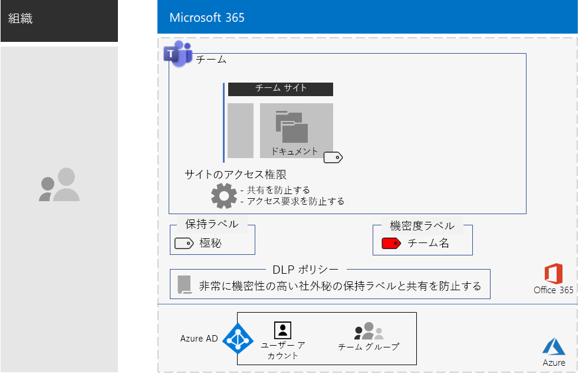
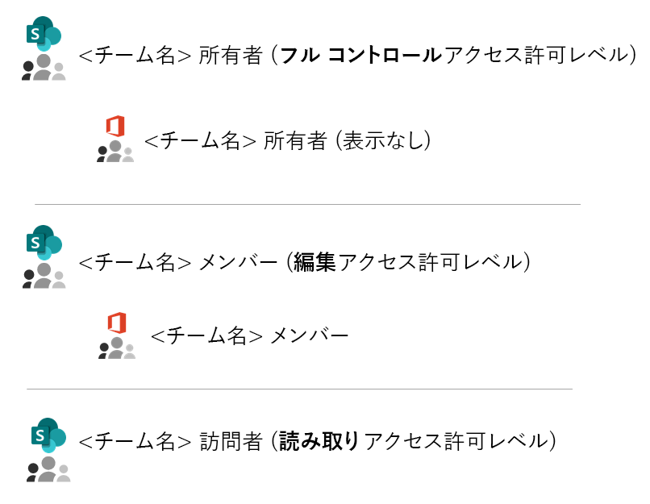
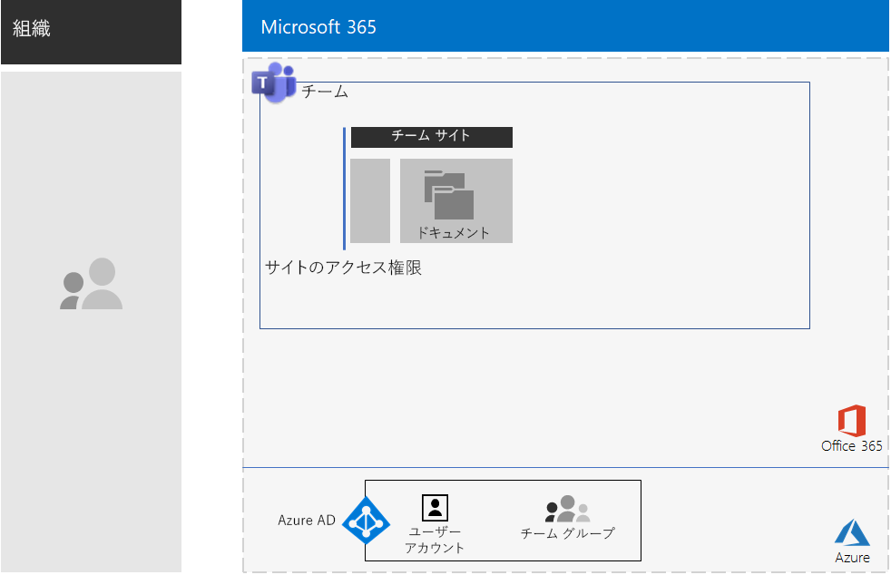
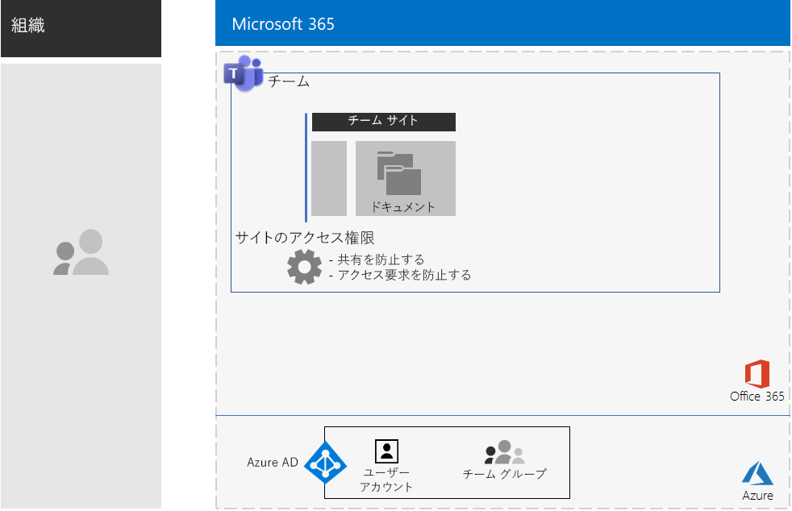
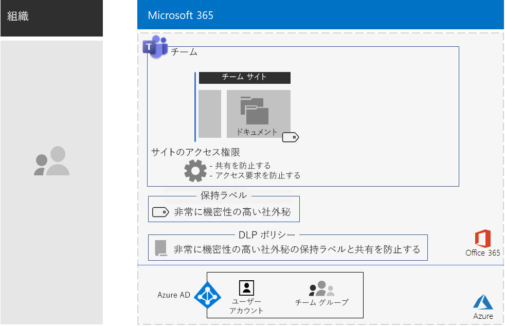
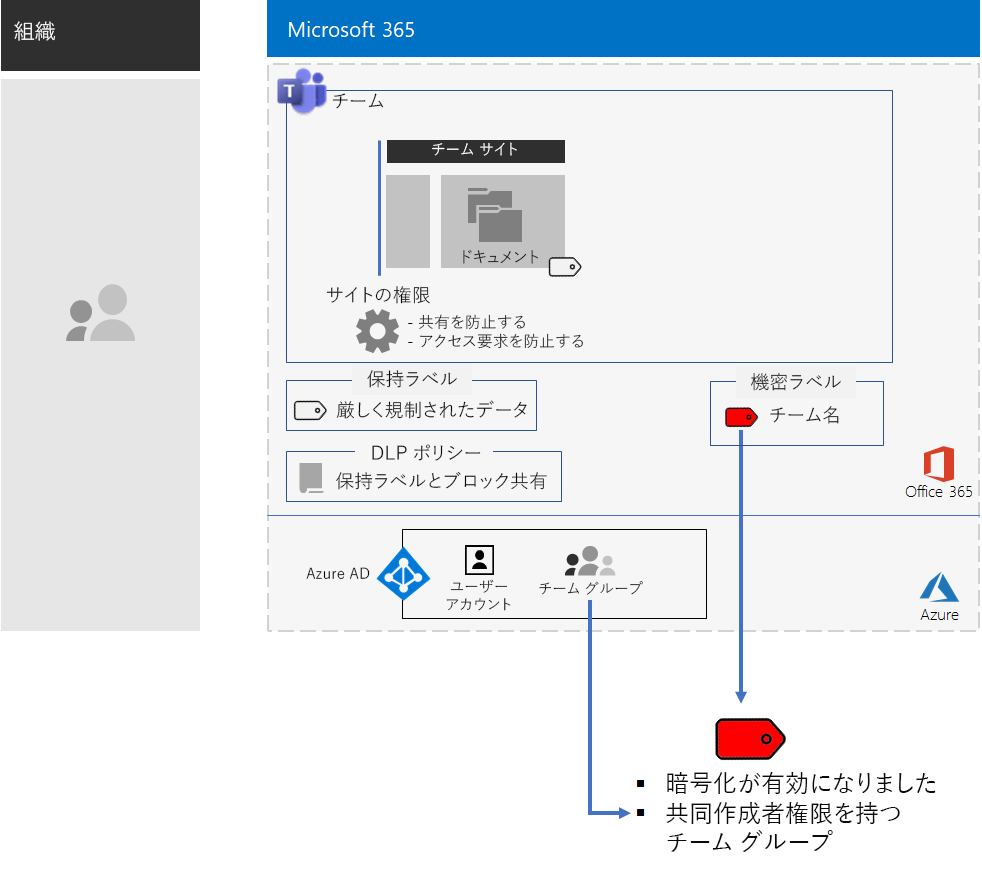
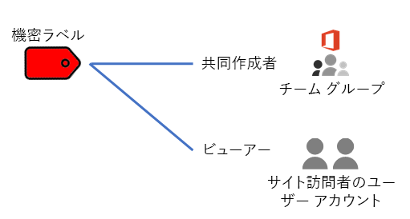
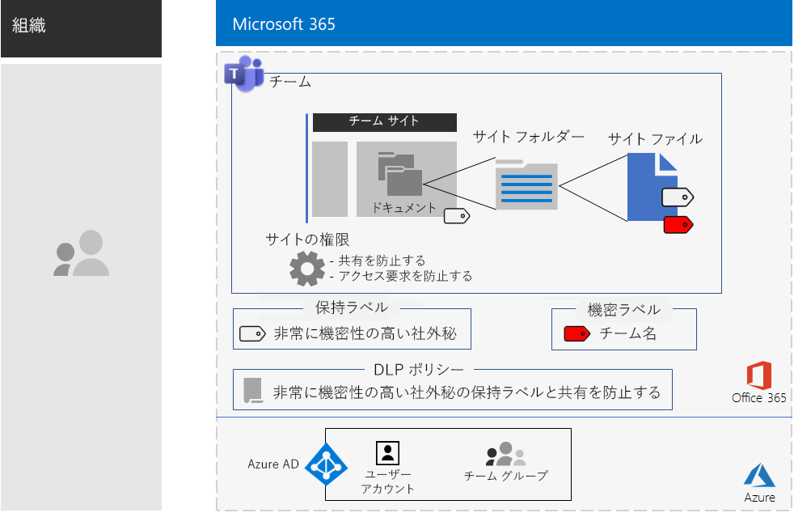

# 厳しく規制されたデータに Teams で対応する

この記事では、Microsoft Teams 内のプライベート チームを構成して、チャット、会議、ファイルなどの Teams の機能へのアクセスをチームの Office 365 グループのメンバーおよび所有者のみに制限するための推奨事項および手順を説明します。 

この記事では、Office 365 グループに基づくプライベート アクセスの他にも、それの基となっている、チーム チャネルの [**ファイル**] セクションからアクセスできるプライベート SharePoint チーム サイトを構成して厳しく規制されたデータの保存で必要な追加のセキュリティを提供する方法について説明します。 この SharePoint チーム サイトでは、ファイル、ページ、共有予定表、タスク、ノートブック、およびリストを保存して共同作業を行えます。

規制の厳しいデータ用にチームを構成する場合の要素は次のとおりです。

- プライベート チームおよびそれに対応する、所有者とメンバーのユーザー アカウントを持つ Office 365 グループ。
- チームの基になっている SharePoint サイトでの以下の追加のセキュリティ:
  - サイト メンバーが他のユーザーへアクセス許可を付与することの防止。
  - サイトのメンバーではないユーザーがサイトへのアクセス権を要求することの防止。
- アイテム保持ポリシーを定義する既定の方法として、サイト上の新しいファイルに自動的に適用される、基となっている SharePoint サイトの Office 365 保持ラベル。
- ユーザーがファイルを組織外と共有または組織外へ送信することを保持ラベルを使用してブロックする、データ損失防止 (DLP) ポリシー。
- 暗号化が有効になっている、規制の厳しいラベルの Office 365 秘密度ラベルまたはサブラベルおよびチームの Office 365 グループに対する共同作成者アクセス許可。 ユーザーは Word、Excel、PowerPoint の [秘密度] メニュー バーのオプションから、チームの [**ファイル**] セクションに保存されているファイルにラベルまたはサブラベルを適用します。

この結果、秘密度ラベルが適用された構成は次のようになります。

 
## フェーズ 1: 厳しく規制されたデータ用のチームを構成する

エンド ツー エンド構成には次の手順が含まれます。

1. ID と デバイス アクセスを構成する。
2. プライベート チームを作成する。
3. 基となる SharePoint サイトを構成してセキュリティを強化する。
4. 保持ラベルおよび DLP ポリシーを作成する。
5. 厳しく規制されたラベル用のラベルまたはサブラベルを作成する。

### 手順 1: ID と デバイス アクセスを構成する

チームおよびその基となっている SharePoint サイトへのアクセスを保護するには、[ID とデバイスのアクセス ポリシー](https://docs.microsoft.com/microsoft-365/enterprise/identity-access-policies)と[推奨される SharePoint Online アクセス ポリシー](https://docs.microsoft.com/microsoft-365/enterprise/sharepoint-file-access-policies)が構成されていることを確認します。

### 手順 2: プライベート チームを作成する

[こちらの手順](https://support.office.com/article/create-a-team-from-scratch-174adf5f-846b-4780-b765-de1a0a737e2b)を使用して、プライベート チームを作成します。

プライベート チームを作成するときの既定のアクセス許可は次のとおりです。

- チームの Office 365 グループ (チーム グループ) には、グループの所有者とグループ メンバーがあります。
- チームの基になっている SharePoint サイト (チーム サイト) の場合:
  - サイト コレクション管理者がチーム グループ所有者に対して構成されます
  - チーム サイトの場合: 
    - フル コントロールの権限レベルを持つチーム サイト所有者 SharePoint グループがチーム グループ所有者に設定されます。
    - 編集権限レベルを持つチーム サイト メンバー SharePoint グループがチーム グループ メンバーに設定されます。
    - 読み取り権限レベルを持つチーム サイト閲覧者 SharePoint グループには、グループまたはユーザー アカウントはありません。

チーム サイトの既定のアクセス許可は次のとおりです。

 
>[!Note]
>編集権限レベルの \<チーム名> 所有者 SharePoint グループを表示しても、\<チーム名> 所有者は表示されません。
>

この結果、アクセス許可では次の操作が許可されます。

- チーム グループの所有者がサイトを管理し、サイト コンテンツに対してフル コントロールを持つこと。
- チーム グループ メンバーがサイト上でファイルを作成および編集すること。 

アクセス許可の保守は、チーム メンバーおよび所有者の保守と同じです。

この結果、構成は現時点では次のようになります。

 
### 手順 3: 基となる SharePoint サイトを構成してセキュリティを強化する

チーム サイトから、次のアクセス許可の設定を構成します。

1. ツール バーで、設定アイコンをクリックし、[**サイトの権限**] をクリックします。
2. [**サイトの権限**] ウィンドウで、[**共有の設定**] の [**共有設定を変更します**] をクリックします。
3. [**共有アクセス許可**] で、[**ファイル、フォルダー、およびサイトを共有できるのはサイトの所有者だけです**] を選択します。
4. [**アクセス要求の許可**] をオフにし、[**保存**] をクリックします。

このように設定することで、チーム グループのメンバーがチーム サイトを他のメンバーと共有したり、メンバー以外のユーザーがチーム サイトへのアクセスを要求したりすることができなくなります。

この結果、構成は現時点では次のようになります。

 
### 手順 4: 保持ラベルおよび DLP ポリシーを作成する

[こちらの手順](https://docs.microsoft.com/microsoft-365/compliance/protect-sharepoint-online-files-with-office-365-labels-and-dlp)を使用して、次のことを行います。

1. (必要な場合は) 厳しく規制されたデータの保持ラベルを作成して公開します。
2. 手順 1 で作成した保持ラベル用にチーム サイトを構成します。
3. 手順 2 で作成した保持ラベルを使用する厳しく規制されたデータ用の DLP ポリシーを作成し、ユーザーが組織外にファイルを送信するのをブロックします。 [DLP ポリシー テンプレート ](https://docs.microsoft.com/microsoft-365/compliance/data-loss-prevention-policies#dlp-policy-templates) に基づいて、追加の要件 (例: 医療業界や金融業界の規制のための要件) のためのポリシーを構成することもできます。

この結果、構成は現時点では次のようになります。

 
### 手順 5: 厳しく規制されたラベル用のラベルまたはサブラベルを作成する

すべてのユーザーが任意のファイルに適用できる、厳しく規制されたデータの秘密度ラベルとは異なり、セキュリティで保護されたチーム サイトでは独自のラベルまたはサブラベルが必要です。ラベルまたはサブラベルが割り当てられたファイルは次のようになります。

- 暗号化され、暗号化はファイルと共に移動します。
- チーム グループのメンバーのみがファイルを開けるようにするよう、カスタムのアクセス許可が含まれます。

チーム サイトに保存されているファイルに対してこの追加レベルのセキュリティ保護を行うには、サイト独自の新しい秘密度ラベルまたは厳しく規制されたファイルの一般的なラベルのサブラベルのいずれかを構成する必要があります。 ラベルの一覧にこれが表示されるのは、チーム グループのメンバーのみです。

全体での使用と個別のプライベート チームの両方に対して少ない数のラベルが必要な場合は、秘密度ラベルを使用します。 ラベルを多数使用している場合、またはプライベート チーム用のラベルを厳しく規制されたラベルの下でまとめる場合は、秘密度サブラベルを使用します。

[こちらの手順を使用して](https://docs.microsoft.com/microsoft-365/compliance/encryption-sensitivity-labels)、別のラベルまたはサブラベルを次の設定で構成します。

- ラベルの名前に、チームの名前が含まれている。
- 暗号化が有効になっている。
- サイト グループに、共同作成者のアクセス許可がある。

この結果、新しいラベルが適用された構成は次のようになります。

秘密度ラベルとチーム グループの関係は次のとおりです。

>[!Note]
>秘密度ラベルまたはサブラベルをユーザー定義のアクセス許可用に構成した場合、または有効期限を付けて構成した場合は、ファイルは Teams または SharePoint から開くことはできません。 Office アプリを使用する必要があります。
>

### カスタムのアクセス許可

チーム サイト用に SharePoint サイトのカスタムアクセス許可および (必要な場合は) 対応する秘密度ラベルを構成することもできます。 2 つの例を次に示します。

#### 例 1: SharePoint サイトの管理を委任する

チームの所有者が SharePoint 管理者の経験がない場合、またはチーム サイトの管理を委任する場合は、チーム所有者のリストに SharePoint 管理者のユーザー アカウントを追加できます。 ただし、SharePoint 管理者は、チームとそのすべてのリソースへのフル アクセスを持ち、秘密度ラベルが適用されているファイルを開くことができます。 

このような、権限の過剰付与を防ぐには、高度なアクセス許可の設定で、SharePoint 管理者のユーザー アカウントをチーム サイト所有者 SharePoint グループに追加します。 SharePoint 管理者はサイトを管理することはできますが、チームおよびそのリソースにアクセスすることも、秘密度ラベルが割り当てられているファイルを開くこともできません。

#### 例 2: ラベル付きファイルへの表示線用アクセスを許可する

一部の社員が必要とするのはチーム サイトのラベル付きファイルの内容の表示のみである場合は、そうした社員の個人のユーザー アカウントを次に追加します。

- \<チーム名> 閲覧者 SharePoint グループ。既定では、このグループは読み取り権限レベルを持ちます。 
- 閲覧者権限付きの秘密度ラベル。

この結果、ラベルのアクセス許可は次のようになります。

 
サイトの訪問者はチーム サイトに直接アクセスして、サブラベルが適用されているファイルの内容を表示できます。 ただし、訪問者はチーム グループのメンバーではないため、チームまたはチームのリソースにアクセスすることはできません。

## フェーズ 2: チーム メンバーのユーザーによる導入を促す

チームを設置したら、このチームの導入とチーム メンバーへの追加のセキュリティを促します。

### 手順 1: ユーザーをトレーニングする

チーム グループのメンバーは、チームおよびそのすべてのリソース (チャット、会議、およびその他のアプリなど) にアクセスできます。 チャネルの [**ファイル**] セクションにあるファイルで作業をする場合、チーム グループのメンバーは、セキュリティで保護されたチーム用に作成されたファイルに秘密度ラベルまたはサブラベルを割り当てる必要があります。 例を次に示します。

 
ラベルがファイルに適用されると、ファイルはセキュリティで保護されます。 チーム グループのメンバーは、ファイルを Teams で開いてリアルタイムで共同作業を行えます。 ファイルは暗号化され、チーム グループのメンバーには共同作成者アクセス許可が設定されます。 ファイルがサイトを離れて悪意のあるユーザーに転送された場合、そのようなユーザーがファイルを開いて内容を表示するには、チーム グループ メンバーのユーザー アカウントの資格情報を入力する必要があります。 

チーム メンバーをトレーニングする:

- チーム サイトのチャット、会議、ファイル、その他のリソースに新しいチームを使用することの重要性と、厳しく規制されたデータのリークによって生じる事態 (法的影響、規制上の罰金、ランサムウェア、競争力の低下など)。
- チームにアクセスする方法
- サイトに新しいファイルを作成し、ローカルに保存された新しいファイルをアップロードする方法。
- DLP ポリシーを使用して、外部からのファイルの共有をできないようにする方法。
- チームのカスタム ラベルまたはサブラベルでファイルにラベルを付ける方法。
- ファイルがサイトからリークされてもラベルまたはサブラベルによって保護されるしくみ。

このトレーニングには、チーム メンバーが上記の機能とその結果を体感できるように、実践的な演習を組み込む必要があります。

### 手順 2: 使用状況を定期的にレビューし、チーム メンバーのフィードバックに対処する

トレーニング後の数週間、次のことを行います。

- チーム メンバーのフィードバックに迅速に対応し、ポリシーと構成を微調整します。
- チームの使用状況を分析し、それが期待された使用法と一致しているかを比較する。
- 厳しく規制されたファイルがカスタムの秘密度ラベルまたはサブラベルを使用して正しくラベル付けされていることを確認する。

  ラベルが割り当てられているファイルがわかるようにするには、SharePoint のフォルダーを表示し、[**列の追加**] で [**列の表示/非表示**] オプションを使用して [**秘密度**] 列を追加します。

必要に応じて、ユーザーの再トレーニングを行います。

## 関連項目

[厳しく規制されたデータ用の SharePoint サイト](teams-sharepoint-online-sites-highly-regulated-data.md)

[Microsoft 365 Enterprise のワークロードとシナリオ](deploy-workloads.md)

[Microsoft 365 生産性向上ライブラリ](https://aka.ms/productivitylibrary) (https://aka.ms/productivitylibrary)

[展開ガイド](deploy-microsoft-365-enterprise.md)
