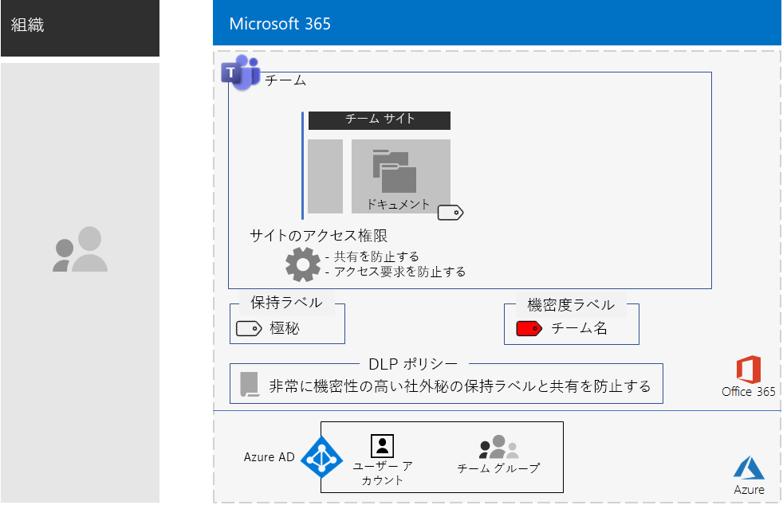
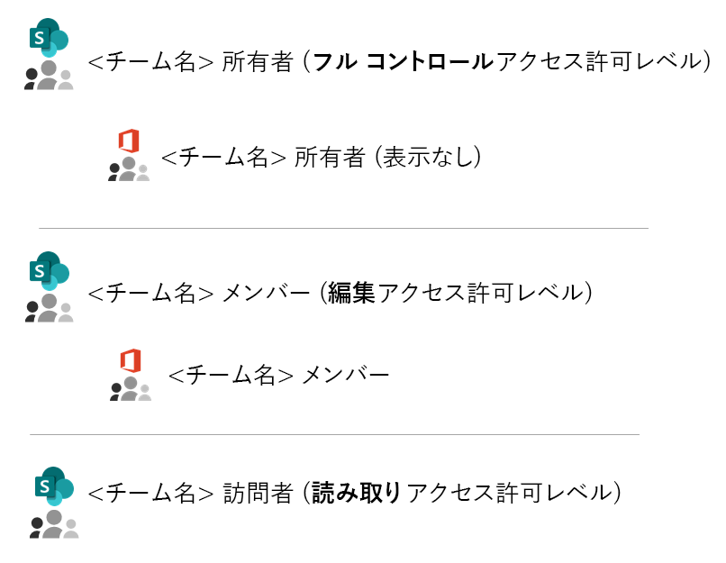
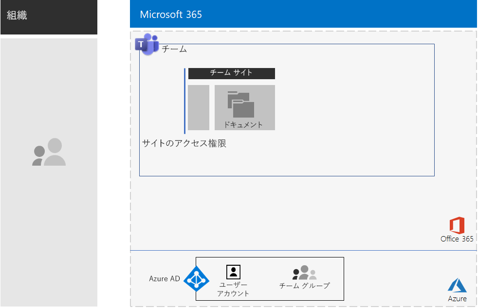
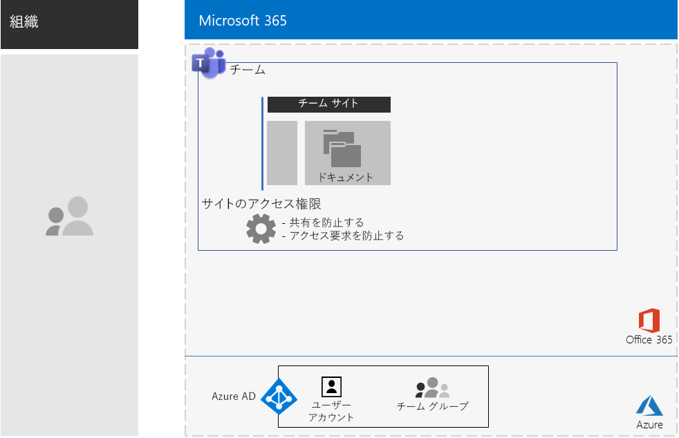
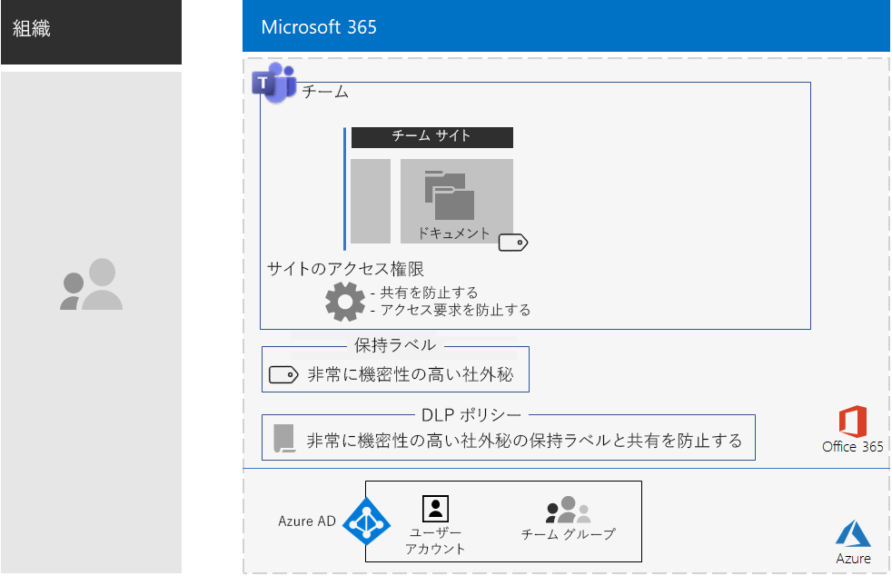
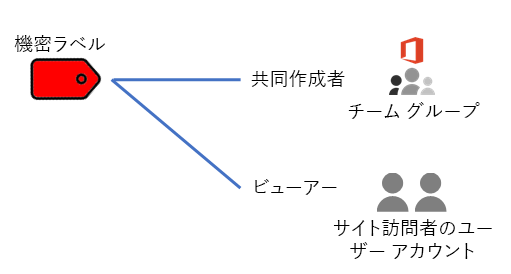
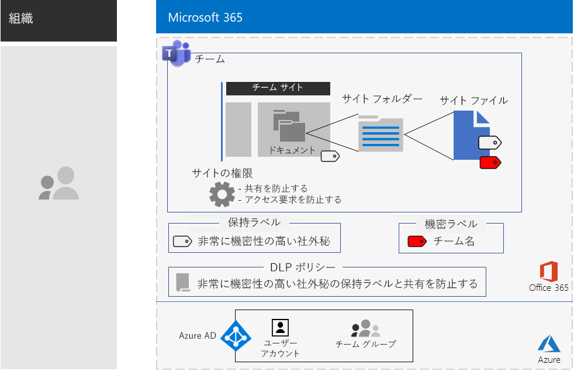

# 厳しく規制されたデータに Teams で対応するTeams for highly regulated data

この記事では、Microsoft Teams 内のプライベート チームを構成して、チャット、会議、ファイルなどの Teams の機能へのアクセスをチームの Office 365 グループのメンバーおよび所有者のみに制限するための推奨事項および手順を説明します。This article provides you with recommendations and steps to configure a private team in Microsoft Teams that locks down access to Teams features—such as chats, meetings, and files—to only members and owners of the Office 365 group for the team. 

この記事では、Office 365 グループに基づくプライベート アクセスの他にも、それの基となっている、チーム チャネルの [**ファイル**] セクションからアクセスできるプライベート SharePoint チーム サイトを構成して厳しく規制されたデータの保存で必要な追加のセキュリティを提供する方法について説明します。Beyond the private access based on the Office 365 group, this article describes how to configure the underlying private SharePoint team site, which you can access from the **Files** section of a team channel, for the additional security needed to store highly regulated data. この SharePoint チーム サイトでは、ファイル、ページ、共有予定表、タスク、ノートブック、およびリストを保存して共同作業を行えます。On this SharePoint team site, you can store and collaborate on files, pages, a shared calendar, tasks, a notebook, and lists.

>[!Note]
> SharePoint を使用する場合の類似のシナリオが[こちら](teams-sharepoint-online-sites-highly-regulated-data.md)にあります。A similar scenario using SharePoint is [here](teams-sharepoint-online-sites-highly-regulated-data.md).
>

規制の厳しいデータ用にチームを構成する場合の要素は次のとおりです。The elements of configuration for a team for highly regulated data are:

- プライベート チームおよびそれに対応する、所有者とメンバーのユーザー アカウントを持つ Office 365 グループ。A private team with a corresponding Office 365 group that has owner and member user accounts.
- チームの基になっている SharePoint サイトでの以下の追加のセキュリティ:Additional security on the underlying SharePoint site for the team that:
  - サイト メンバーが他のユーザーへアクセス許可を付与することの防止。Prevents members of the site from granting access to others.
  - サイトのメンバーではないユーザーがサイトへのアクセス権を要求することの防止。Prevents non-members of the site from requesting access to the site.
- アイテム保持ポリシーを定義する既定の方法として、サイト上の新しいファイルに自動的に適用される、基となっている SharePoint サイトの Office 365 保持ラベル。An Office 365 retention label for the underlying SharePoint site that is automatically applied to new files on the site as a default way to define retention policies.
- ユーザーがファイルを組織外と共有または組織外へ送信することを保持ラベルを使用してブロックする、データ損失防止 (DLP) ポリシー。A Data Loss Prevention (DLP) policy that uses the retention label and blocks users from sharing or sending files outside the organization.
- 暗号化が有効になっている、規制の厳しいラベルの Office 365 秘密度ラベルまたはサブラベルおよびチームの Office 365 グループに対する共同作成者アクセス許可。An Office 365 sensitivity label or a sublabel of a highly regulated label that has encryption enabled and Co-Author permissions for the Office 365 group of the team. ユーザーはチームの [**ファイル**] セクションに保存されているファイルにラベルまたはサブラベルを Word、Excel、PowerPoint の [**秘密度**] メニュー バーのオプションから適用します。Users apply the label or sublabel to files stored in **Files** section of the team from the **Sensitivity** menu bar option in Word, Excel, and PowerPoint.

この結果、秘密度ラベルが適用された構成は次のようになります。Here is the resulting configuration with a sensitivity label.

概要については、この短いビデオをご覧ください。For a quick overview, watch this short video.

> [!VIDEO https://www.microsoft.com/videoplayer/embed/RE4mGHf]

 このシナリオを 1 ページにまとめた概要については、「[厳しく規制されたデータ用の Teams のポスター](../media/secure-teams-highly-regulated-data-scenario/TeamsHighlyRegulatedData.pdf)」を参照してください。For a 1-page summary of this scenario, see the [Teams for highly regulated data poster](../media/secure-teams-highly-regulated-data-scenario/TeamsHighlyRegulatedData.pdf).

このポスターを [PDF](https://github.com/MicrosoftDocs/microsoft-365-docs/raw/public/microsoft-365/media/secure-teams-highly-regulated-data-scenario/TeamsHighlyRegulatedData.pdf) または [PowerPoint](https://github.com/MicrosoftDocs/microsoft-365-docs/raw/public/microsoft-365/media/secure-teams-highly-regulated-data-scenario/Teams-Highly-Regulated-Data-Poster.pptx) 形式でダウンロードして、レター、リーガル、タブロイド (11 x 17) のサイズの紙に印刷することもできます。You can also download this poster in [PDF](https://github.com/MicrosoftDocs/microsoft-365-docs/raw/public/microsoft-365/media/secure-teams-highly-regulated-data-scenario/TeamsHighlyRegulatedData.pdf) or [PowerPoint](https://github.com/MicrosoftDocs/microsoft-365-docs/raw/public/microsoft-365/media/secure-teams-highly-regulated-data-scenario/Teams-Highly-Regulated-Data-Poster.pptx) formats and print it on letter, legal, or tabloid (11 x 17)-sized paper.

## フェーズ 1: 厳しく規制されたデータ用のチームを構成するPhase 1: Configure a team for highly regulated data

エンド ツー エンド構成には次の手順が含まれます。The end-to-end configuration consists of these steps:

1. ID と デバイス アクセスを構成する。Configure identity and device access.
2. プライベート チームを作成する。Create a private team.
3. 基となる SharePoint サイトを構成してセキュリティを強化する。Configure the underlying SharePoint site for additional security.
4. 保持ラベルおよび DLP ポリシーを作成する。Create a retention label and DLP policy.
5. 厳しく規制されたラベル用のラベルまたはサブラベルを作成する。Create the label or sublabel of the highly regulated label.

### 手順 1: ID と デバイス アクセスを構成するStep 1: Configure identity and device access

チームおよびその基となっている SharePoint サイトへのアクセスを保護するには、[ID とデバイスのアクセス ポリシー](https://docs.microsoft.com/microsoft-365/enterprise/identity-access-policies)と[推奨される SharePoint Online アクセス ポリシー](https://docs.microsoft.com/microsoft-365/enterprise/sharepoint-file-access-policies)が構成されていることを確認します。To protect access to the team and its underlying SharePoint site, ensure that you have configured [identity and device access policies](https://docs.microsoft.com/microsoft-365/enterprise/identity-access-policies) and the recommended [SharePoint Online access policies](https://docs.microsoft.com/microsoft-365/enterprise/sharepoint-file-access-policies).

### 手順 2: プライベート チームを作成するStep 2: Create a private team

[こちらの手順](https://support.office.com/article/create-a-team-from-scratch-174adf5f-846b-4780-b765-de1a0a737e2b)を使用して、プライベート チームを作成します。Use [these instructions](https://support.office.com/article/create-a-team-from-scratch-174adf5f-846b-4780-b765-de1a0a737e2b) to create a private team.

プライベート チームを作成するときの既定のアクセス許可は次のとおりです。When you create a private team, here are the default permissions:

- チームの Office 365 グループ (チーム グループ) には、グループの所有者とグループ メンバーがあります。The Office 365 group for the team (the Team Group) has group owners and group members
- チームの基になっている SharePoint サイト (チーム サイト) の場合:For the underlying SharePoint site for the team (the Team Site):
  - サイト コレクション管理者がチーム グループ所有者に対して構成されますThe Site Collection Administrators is configured for the Team Group owners
  - チーム サイトの場合:For the Team Site: 
    - フル コントロールの権限レベルを持つチーム サイト所有者 SharePoint グループがチーム グループ所有者に設定されます。The Team Site Owners SharePoint group—with the Full Control permission level—is set to the Team Group owners
    - 編集権限レベルを持つチーム サイト メンバー SharePoint グループがチーム グループ メンバーに設定されます。The Team Site Members SharePoint group—with the Edit permission level—is set to the Team Group members
    - 読み取り権限レベルを持つチーム サイト閲覧者 SharePoint グループには、グループまたはユーザー アカウントはありません。The Team Site Visitors SharePoint group—with the Read permission level—has no groups or user accounts

チーム サイトの既定のアクセス許可は次のとおりです。Here are the default permissions for the Team Site.

 
>[!Note]
>編集権限レベルの \<チーム名> 所有者 SharePoint グループを表示しても、\<チーム名> 所有者は表示されません。If you view the \<team name> Owners SharePoint group for the Edit permission level, it does not display \<team name> Owners.
>

この結果、アクセス許可では次の操作が許可されます。The resulting permissions allow:

- チーム グループの所有者がサイトを管理し、サイト コンテンツに対してフル コントロールを持つこと。Team Group owners to administer the site and have full control over the site contents.
- チーム グループ メンバーがサイト上でファイルを作成および編集すること。Team Group members to create and edit files on the site. 

アクセス許可の保守は、チーム メンバーおよび所有者の保守と同じです。Permissions maintenance is the same as team member and owner maintenance.

この結果、構成は現時点では次のようになります。Here’s the resulting configuration so far.

 
### 手順 3: 基となる SharePoint サイトを構成してセキュリティを強化するStep 3: Configure the underlying SharePoint site for additional security

チーム サイトから、次のアクセス許可の設定を構成します。From the Team Site, configure these permission settings.

1. ツール バーで、設定アイコンをクリックし、[**サイトの権限**] をクリックします。In the tool bar, click the settings icon, and then click **Site permissions**.
2. [**サイトの権限**] ウィンドウで、[**共有の設定**] の [**共有設定を変更します**] をクリックします。In the **Site permissions** pane, under **Sharing Settings**, click **Change sharing settings**.
3. [**共有アクセス許可**] で、[**ファイル、フォルダー、およびサイトを共有できるのはサイトの所有者だけです**] を選択します。Under **Sharing permissions**, choose **Only site owners can share files, folders, and the site**.
4. [**アクセス要求の許可**] をオフにし、[**保存**] をクリックします。Turn off **Allow access requests**, and then click **Save**.

このように設定することで、チーム グループのメンバーがチーム サイトを他のメンバーと共有したり、メンバー以外のユーザーがチーム サイトへのアクセスを要求したりすることができなくなります。With these settings, the ability for Team Group members to share the Team Site with other members or for non-members to request access to the Team Site is disabled.

この結果、構成は現時点では次のようになります。Here’s the resulting configuration so far.

 
### 手順 4: 保持ラベルおよび DLP ポリシーを作成するStep 4: Create a retention label and DLP policy

[こちらの手順](https://docs.microsoft.com/microsoft-365/security/office-365-security/deploy-teams-retention-dlp)を使用して、次のことを行います。Use [these instructions](https://docs.microsoft.com/microsoft-365/security/office-365-security/deploy-teams-retention-dlp) to:

1. (必要な場合は) 厳しく規制されたデータの保持ラベルを作成して公開します。Create and publish a retention label for highly regulated data (if needed).
2. 手順 1 で作成した保持ラベル用にチーム サイトを構成します。Configure the Team Site for the retention label created in step 1.
3. 手順 2 で作成した保持ラベルを使用する厳しく規制されたデータ用の DLP ポリシーを作成し、ユーザーが組織外にファイルを送信するのをブロックします。Create a DLP policy for highly regulated data that uses the retention label created in step 2 and blocks users from sending files outside the organization. [DLP ポリシー テンプレート ](https://docs.microsoft.com/microsoft-365/compliance/data-loss-prevention-policies#dlp-policy-templates) に基づいて、追加の要件 (例: 医療業界や金融業界の規制のための要件) のためのポリシーを構成することもできます。You can also configure the policy for additional requirements, such as those for health and financial industry regulations, based on [DLP policy templates](https://docs.microsoft.com/microsoft-365/compliance/data-loss-prevention-policies#dlp-policy-templates).

この結果、構成は現時点では次のようになります。Here’s the resulting configuration so far.

 
### 手順 5: 厳しく規制された機密度ラベル用の機密度ラベルまたはサブラベルを作成するStep 5: Create a sensitivity label or a sublabel of the highly regulated sensitivity label

すべてのユーザーが任意のファイルに適用できる、厳しく規制されたデータの秘密度ラベルとは異なり、セキュリティで保護されたチーム サイトでは独自のラベルまたはサブラベルが必要です。ラベルまたはサブラベルが割り当てられたファイルは次のようになります。Unlike a sensitivity label for highly regulated data that anyone can apply to any file, a secure team needs its own label or sublabel so that assigned files:

- 暗号化され、暗号化はファイルと共に移動します。Are encrypted and the encryption travels with the file.
- チーム グループのメンバーのみがファイルを開けるようにするよう、カスタムのアクセス許可が含まれます。Contain custom permissions so that only members of the Team Group can open it.

チーム サイトに保存されているファイルに対してこの追加レベルのセキュリティ保護を行うには、サイト独自の新しい秘密度ラベルまたは厳しく規制されたファイルの一般的なラベルのサブラベルのいずれかを構成する必要があります。To accomplish this additional level of security for files stored in the Team Site, you must configure a new sensitivity label that is either its own label a sublabel of the general label for highly regulated files. ラベルの一覧にこれが表示されるのは、チーム グループのメンバーのみです。Only Team Group members will see it in their list of labels.

全体での使用と個別のプライベート チームの両方に対して少ない数のラベルが必要な場合は、秘密度ラベルを使用します。Use a sensitivity label when you need a small number of labels for both global use and individual private teams. ラベルを多数使用している場合、またはプライベート チーム用のラベルを厳しく規制されたラベルの下でまとめる場合は、秘密度サブラベルを使用します。Use a sensitivity sublabel when you have a large number of labels or want to organize labels for private teams under the highly regulated label.

[こちらの手順を使用して](https://docs.microsoft.com/microsoft-365/compliance/encryption-sensitivity-labels)、別のラベルまたはサブラベルを次の設定で構成します。[Use these instructions](https://docs.microsoft.com/microsoft-365/compliance/encryption-sensitivity-labels) to configure a separate label or a sublabel with the following settings:

- ラベルの名前に、チームの名前が含まれている。The name of the label contains the name of the team
- 暗号化が有効になっている。Encryption is enabled
- サイト グループに、共同作成者のアクセス許可がある。The Team Group has Co-Author permissions

この結果、新しいラベルが適用された構成は次のようになります。Here’s the resulting configuration with the new label.

秘密度ラベルとチーム グループの関係は次のとおりです。Here’s the relationship between the sensitivity label and the Team Group.

>[!Note]
>秘密度ラベルまたはサブラベルをユーザー定義のアクセス許可用に構成した場合、または有効期限を付けて構成した場合は、ファイルは Teams または SharePoint から開くことはできません。If you configure the sensitivity label or sublabel for user-defined permissions or with an expiration date, you cannot open the file from Teams or SharePoint. Office アプリを使用する必要があります。You must use an Office app.
>

### カスタムのアクセス許可Custom permissions

チーム サイト用に SharePoint サイトのカスタムアクセス許可および (必要な場合は) 対応する秘密度ラベルを構成することもできます。You can also configure custom SharePoint site permissions for the Team Site and, if needed, its corresponding sensitivity label. 2 つの例を次に示します。Here are two examples.

#### 例 1: SharePoint サイトの管理を委任するExample 1: Delegating SharePoint site administration

チームの所有者が SharePoint 管理者の経験がない場合、またはチーム サイトの管理を委任する場合は、チーム所有者のリストに SharePoint 管理者のユーザー アカウントを追加できます。If the team owner does not have SharePoint administration experience or wants to delegate administration of the Team Site, they could add the user account of a SharePoint administrator to the list of team owners. ただし、SharePoint 管理者は、チームとそのすべてのリソースへのフル アクセスを持ち、秘密度ラベルが適用されているファイルを開くことができます。But then the SharePoint administrator would have full access to the team and all its resources and would be able to open a file with the sensitivity label applied. 

このような、権限の過剰付与を防ぐには、高度なアクセス許可の設定で、SharePoint 管理者のユーザー アカウントをチーム サイト所有者 SharePoint グループに追加します。To prevent this over-granting of privileges, add the user account of the SharePoint administrator to the Team Site Owners SharePoint group in the advanced permissions settings of the site. SharePoint 管理者はサイトを管理することはできますが、チームおよびそのリソースにアクセスすることも、秘密度ラベルが割り当てられているファイルを開くこともできません。The SharePoint administrator can administer the site but will not be able to access the team and any of its resources or open the files with the sensitivity label assigned.

#### 例 2: ラベル付きファイルへの表示線用アクセスを許可するExample 2: Allowing view-only access to labeled files

一部の社員が必要とするのはチーム サイトのラベル付きファイルの内容の表示のみである場合は、そうした社員の個人のユーザー アカウントを次に追加します。If some staff only need to view the contents of labeled files in the Team Site, add their individual user accounts to the:

- \<チーム名> 閲覧者 SharePoint グループ。既定では、このグループは読み取り権限レベルを持ちます。\<team name> Visitors SharePoint group, which by default has the Read permission level. 
- 閲覧者権限付きの秘密度ラベル。The sensitivity label with the Viewer permissions.

この結果、ラベルのアクセス許可は次のようになります。Here are the resulting permissions on the label.

 
サイトの訪問者はチーム サイトに直接アクセスして、サブラベルが適用されているファイルの内容を表示できます。The site visitors will be able to access the Team Site directly and view the contents of files that have the sublabel applied. ただし、訪問者はチーム グループのメンバーではないため、チームまたはチームのリソースにアクセスすることはできません。But because they are not members of the Team Group, they will not be able to access the team or any of its resources.

## フェーズ 2: チーム メンバーのユーザーによる導入を促すPhase 2: Drive user adoption for team members

チームを設置したら、このチームの導入とチーム メンバーへの追加のセキュリティを促します。With the team in place, it’s time to drive the adoption of this team and its additional security to team members.

### 手順 1: ユーザーをトレーニングするStep 1: Train your users

チーム グループのメンバーは、チームおよびそのすべてのリソース (チャット、会議、およびその他のアプリなど) にアクセスできます。Members of the Team Group can access the team and all of its resources, including chats, meetings, and other apps. チャネルの [**ファイル**] セクションにあるファイルで作業をする場合、チーム グループのメンバーは、セキュリティで保護されたチーム用に作成されたファイルに秘密度ラベルまたはサブラベルを割り当てる必要があります。When working with files from the **Files** section of a channel, members of the Team Group must assign the sensitivity label or sublabel to files created for the secure team. 例を次に示します。Here’s an example.

 
ラベルがファイルに適用されると、ファイルはセキュリティで保護されます。When the label gets applied to the file it is secured. チーム グループのメンバーは、ファイルを Teams で開いてリアルタイムで共同作業を行えます。Members of the Team Group can open it in Teams and collaborate in real time. ファイルは暗号化され、チーム グループのメンバーには共同作成者アクセス許可が設定されます。It is encrypted and includes the Co-Author permissions set to the Team Group members. ファイルがサイトを離れて悪意のあるユーザーに転送された場合、そのようなユーザーがファイルを開いて内容を表示するには、チーム グループ メンバーのユーザー アカウントの資格情報を入力する必要があります。If the file leaves the site and gets forwarded to a malicious user, they will have to supply credentials of a user account that is member of the Team Group to open the file and view its contents. 

チーム メンバーをトレーニングする:Train your team members:

- チーム サイトのチャット、会議、ファイル、その他のリソースに新しいチームを使用することの重要性と、厳しく規制されたデータのリークによって生じる事態 (法的影響、規制上の罰金、ランサムウェア、競争力の低下など)。On the importance of using the new team for chats, meetings, files, and the other resources of the Team Site and the consequences of a highly regulated data leak, such as legal ramifications, regulatory fines, ransomware, or loss of competitive advantage.
- チームにアクセスする方法How to access the team.
- サイトに新しいファイルを作成し、ローカルに保存された新しいファイルをアップロードする方法。How to create new files on the site and upload new files stored locally.
- DLP ポリシーを使用して、外部からのファイルの共有をできないようにする方法。How the DLP policy blocks them from sharing files externally.
- チームのカスタム ラベルまたはサブラベルでファイルにラベルを付ける方法。How to label files with the custom label or sublabel for the team.
- ファイルがサイトからリークされてもラベルまたはサブラベルによって保護されるしくみ。How the label or sublabel protects files even when they are leaked off the site.

このトレーニングには、チーム メンバーが上記の機能とその結果を体感できるように、実践的な演習を組み込む必要があります。This training should include hands-on exercises so that your team members can experience these capabilities and their results.

### 手順 2: 使用状況を定期的にレビューし、チーム メンバーのフィードバックに対処するStep 2: Conduct periodic reviews of usage and address team member feedback

トレーニング後の数週間、次のことを行います。In the weeks after training:

- チーム メンバーのフィードバックに迅速に対応し、ポリシーと構成を微調整します。Quickly address team member feedback and fine tune polices and configurations.
- チームの使用状況を分析し、それが期待された使用法と一致しているかを比較する。Analyze usage for the team and compare it with usage expectations.
- 厳しく規制されたファイルがカスタムの秘密度ラベルまたはサブラベルを使用して正しくラベル付けされていることを確認する。Verify that highly regulated files have been properly labeled with the custom sensitivity label or sublabel.

  ラベルが割り当てられているファイルがわかるようにするには、SharePoint のフォルダーを表示し、[**列の追加**] で [**列の表示/非表示**] オプションを使用して [**秘密度**] 列を追加します。You can see which files have a label assigned by viewing a folder in SharePoint and adding the **Sensitivity** column through the **Show/hide columns** option of **Add column**.

必要に応じて、ユーザーの再トレーニングを行います。Retrain your users as needed.

## テスト環境でこれを実証するDemonstrate this in a test environment

機密ファイルおよび非常に機密性の高いファイルに適したチームのテストを行う独自のテスト環境を構築するには、[これらの手順](https://docs.microsoft.com/microsoft-365/security/office-365-security/secure-team-for-files-in-a-dev-test-environment) を参照してください。To build out your own test environment to test teams for sensitive and highly confidential files, see [these instructions](https://docs.microsoft.com/microsoft-365/security/office-365-security/secure-team-for-files-in-a-dev-test-environment). 

## Contoso Corporation が極秘プロジェクトでどのように安全なチームを運用したかHow the Contoso Corporation used a secure team for a top-secret project

架空の企業、Contoso Corporation は、代表的な世界規模の製造業の複合企業です。The Contoso Corporation is a fictional but representative global manufacturing conglomerate. 極秘プロジェクトを開発、市場に投入し、新しい製品とサービスを提供するために、Contoso がどのように[セキュリティが強化されたチーム](contoso-team-for-top-secret-project.md)を構成し、採用を推進したかついて説明します。See how Contoso configured and drove the adoption of a [secure team](contoso-team-for-top-secret-project.md) for a top secret project to develop and bring to market a new set of products and services. 

## 関連項目See also

[厳しく規制されたデータ用の SharePoint サイトSharePoint sites for highly regulated data](teams-sharepoint-online-sites-highly-regulated-data.md)

[Microsoft 365 Enterprise のワークロードとシナリオMicrosoft 365 Enterprise workloads and scenarios](deploy-workloads.md)

[Microsoft 365 生産性向上ライブラリ](https://aka.ms/productivitylibrary) (https://aka.ms/productivitylibrary)[Microsoft 365 Productivity Library](https://aka.ms/productivitylibrary) (https://aka.ms/productivitylibrary)

[展開ガイドDeployment guide](deploy-microsoft-365-enterprise.md)
