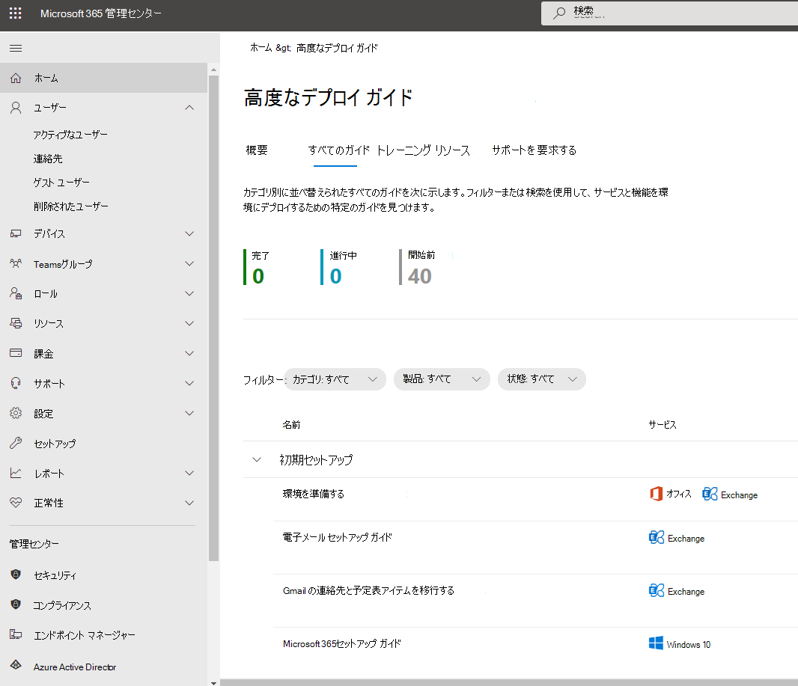

# Microsoft 365 および Office 365 サービスのセットアップ ガイド

Microsoft 365およびOffice 365セットアップ ガイドを使用すると、テナント、アプリ、サービスを計画およびデプロイするためのカスタマイズされたガイダンスとリソースが提供されます。 これらのガイドは、オンボードスペシャリストが個々の対話で共有するのと同じベスト プラクティス[Microsoft 365 FastTrack](https://www.microsoft.com/fasttrack/microsoft-365)使用して作成され、Microsoft 365 管理センター内のすべての管理者が利用できます。 製品のセットアップ、セキュリティ機能の有効化、コラボレーション ツールのデプロイに関する情報を提供し、高度なデプロイを高速化するためのスクリプトを提供します。

> [!NOTE]
> Microsoft 365セットアップ ガイドにアクセスするには、グローバル リーダーなどの管理者ロールを割り当てる必要があります。 このガイドを使用してテナントの設定を変更できるのは、グローバル管理者ロールを持つ管理者のみです。

## Microsoft 365 管理センターのセットアップ ガイドにアクセスする方法

セットアップ ガイドには、Microsoft 365 管理センターの[セットアップ ガイダンス](https://aka.ms/setupguidance) ページからアクセスできます。 進捗状況を追跡し、いつでも戻ってガイドを完成させることができます。 **セットアップ ガイダンス** ページにアクセスするには:

1. [Microsoft 365 管理センター](https://admin.microsoft.com/)で、**ホーム** ページに移動します。

2. **トレーニング & ガイド カードを** 見つけます。

   

3. **[高度なデプロイ ガイド]** を選択し、[**すべてのガイド**] を選択します。

   

## 初期セットアップのガイド

### 環境を準備する

[環境の準備](https://aka.ms/prepareyourenvironment)ガイドは、Microsoft 365サービスとOffice 365 サービス用に組織の環境を準備するのに役立ちます。 目標が何であれ、デプロイを成功させるために完了する必要があるタスクがあります。 環境の準備中にエラーが発生しないようにするために、ドメインの接続、ユーザーの追加、ライセンスの割り当て、Exchange Onlineを使用した電子メールの設定、Office アプリのインストールまたは展開に関する詳細な手順が示されています。

### 電子メール セットアップ ガイド

[電子メール セットアップ ガイド](https://aka.ms/office365setup)では、組織のExchange Onlineを構成するために必要な詳細なガイダンスを提供します。 このガイダンスには、新しいメール アカウントの設定、電子メールの移行、電子メール保護の構成が含まれます。 メールのセットアップを正常に行うには、このアドバイザーを使用すると、組織の現在のメール システム、移行するメールボックスの数、ユーザーとそのアクセスを管理する方法に基づいて推奨される移行方法が表示されます。

### Gmail の連絡先と予定表アイテムを移行する

Gmail ユーザーのメールボックスをMicrosoft 365に移行すると、メール メッセージは移行されますが、連絡先や予定表アイテムは移行されません。 [Gmail の連絡先と予定表アドバイザー](https://aka.ms/gmailcontactscalendar)は、Outlook.com、Outlook クライアント、または PowerShell でインポートおよびエクスポート方法を使用して、Google 連絡先と Google 予定表アイテムをMicrosoft 365にインポートする手順を提供します。

### Microsoft 365 セットアップ ガイド

[Microsoft 365セットアップ ガイド](https://aka.ms/microsoft365setupguide)では、生産性ツール、セキュリティ ポリシー、およびデバイス管理機能を設定する際のガイダンスを提供します。 Microsoft 365 Business Premium またはエンタープライズ サブスクリプション版 Microsoft 365 があれば、このアドバイザーを使用して組織のデバイスをセットアップし、構成できます。

クラウド サービスを有効にしたり、サポートされている最新バージョンのWindows 10にデバイスを更新したり、デバイスを 1 か所で Azure Active Directory (Azure AD) に参加したりするためのガイダンスとリソースへのアクセスを受け取ります。

### リモート ワーク セットアップ ガイド

[リモート作業セットアップ ガイド](https://aka.ms/remoteworksetup)では、ユーザーがリモートで正常に動作し、データがセキュリティで保護され、ユーザーの資格情報が保護されるようにするために必要なヒントとリソースが組織に提供されます。

クラウド内のMicrosoft 365 リソースと組織のネットワークの両方に対するリモート ワーカーのデバイス トラフィックを最適化するためのガイダンスを受け取ります。これにより、リモート アクセス VPN インフラストラクチャの負担が軽減されます。

### Microsoft Edgeセットアップ ガイド

Microsoft Edgeは、世界レベルの互換性とパフォーマンス、お客様に適したセキュリティとプライバシー、および Web のベストを実現するように設計された新機能を実現するために、ゼロから再構築されています。

[Microsoft Edgeセットアップ ガイド](https://aka.ms/edgeadvisoradmin)を使用すると、組織でアクセスされるサイトEnterpriseを構成して、IE モードを使用し、重要なセキュリティ機能の確認と構成、組織の要件を満たすプライバシー ポリシーとコンプライアンス ポリシーの構成、デバイスでの Web アクセスの管理を行う必要があるサイト探索を構成できます。 Microsoft Edgeを個々のデバイスにダウンロードすることも、グループ ポリシー、Configuration Manager、またはMicrosoft Intuneを使用して組織内の複数のユーザーに展開する方法について説明します。

### Microsoft Edgeの IE モードを構成する

Microsoft Edgeを既に展開していて、IE モードのみを構成する場合は、「[Microsoft Edge用の IE モードを構成する」ガイド](https://aka.ms/configureiemodeadmin)では、Enterprise サイト検出の構成を自動化するためのスクリプトが提供されます。 また、ユーザーに展開するEnterprise モード サイト一覧を作成するのに役立つ、クラウドベースのツールから IE モードの推奨事項も取得します。

### Microsoft Search セットアップ ガイド

Microsoft Searchは、組織が作業している作業を完了するために必要なものを見つけるのに役立ちます。 ユーザー、ファイル、組織図、サイト、または一般的な質問に対する回答を検索する場合でも、組織はMicrosoft Searchを使用して回答を得ることができます。

[Microsoft Searchセットアップ ガイド](https://aka.ms/MicrosoftSearchSetup)は、ユーザーのグループにパイロットを適用するか、組織内のすべてのユーザーにロールアウトするかをMicrosoft Search構成するのに役立ちます。検索管理者と検索エディターを割り当て、回答やその他のオプションを使用してユーザーの検索エクスペリエンスをカスタマイズします。たとえば、Chrome にBing拡張機能を追加したり、既定の検索エンジンとしてBingを設定したりします。

## 認証とアクセスのガイド

### 多要素認証 (MFA) を構成する

[多要素認証の構成 (MFA) ガイド](https://admin.microsoft.com/Adminportal/Home?source=applauncher#/featureexplorer/security/ConditionalAccess)では、資格情報の紛失や盗難による侵害から組織を保護するための情報を提供します。 MFA は、ユーザーがアプリまたは他の会社のリソースにサインインするときにユーザーの ID を証明するために、複数の形式の検証を求めることで、アカウントのセキュリティを直ちに強化します。 このプロンプトは、ユーザーのモバイル デバイスにコードを入力するか、フィンガープリント スキャンを提供することです。 MFA は、条件付きアクセス、セキュリティの既定値、またはユーザーごとの MFA によって有効になります。 このガイドでは、ライセンスと既存の構成に基づいて、組織に推奨される MFA オプションを提供します。

### Teamsの ID セキュリティ

[チームの ID セキュリティ ガイド](https://admin.microsoft.com/Adminportal/Home?source=applauncher#/teamsidentity)は、ユーザーが安全で、**Teams** を使用して最も生産性の高い時間を過ごすために実行できるいくつかの基本的なセキュリティ手順に役立ちます。

### Microsoft 365にユーザーを追加または同期する

[このガイド](https://admin.microsoft.com/Adminportal/Home?source=applauncher#/modernonboarding/identitywizard)は、**Microsoft 365** でユーザー アカウントを設定するプロセスを効率化するのに役立ちます。 環境とニーズに基づいて、ユーザーを個別に追加するか、Azure AD クラウド同期または Azure AD Connectを使用してオンプレミス ディレクトリを移行するか、必要に応じて既存の同期の問題をトラブルシューティングするかを選択できます。

### Azure AD セットアップ ガイド

[Azure AD セットアップ ガイド](https://aka.ms/aadpguidance)には、組織の強固なセキュリティ基盤を確保するための情報が記載されています。 このガイドでは、管理者向けの Azure ロールベースのアクセス制御 (Azure RBAC)、オンプレミス ディレクトリの Azure AD Connect、Azure AD Connect Health などの初期機能を設定して、自動同期中にハイブリッド ID の正常性を監視できるようにします。

また、オプションの高度な ID 保護とユーザー プロビジョニングの自動化を含む、セルフサービス パスワード リセット、条件付きアクセス、統合されたサード パーティのサインオンを有効にするための重要な情報も含まれています。

### Windows Server Active Directory のユーザーを同期させる

[「Windows Server Active Directoryからユーザーを同期](https://aka.ms/directorysyncsetup)する」ガイドでは、ディレクトリ同期を有効にする手順について説明します。 ディレクトリ同期により、オンプレミス ID とクラウド ID がまとめられ、アクセスが容易になり、管理が簡素化されます。 シングル サインオン、セルフサービス オプション、自動アカウント プロビジョニング、条件付きアクセス制御、コンプライアンス ポリシーなどの新機能のロックを解除します。 これらの機能により、ユーザーはどこからでも必要なリソースにアクセスできるようになります。

### パスワードレス展開の計画

ユーザーが次のいずれかのパスワードレス認証方法でデバイスに安全にアクセスできるようにする別のサインイン アプローチにアップグレードします。

- Windows Hello for Business
- Microsoft Authenticator アプリ
- セキュリティ キー

[パスワードレス展開を計画](https://aka.ms/passwordlesssetup)するガイドを使用して、パスワードレス認証方法を使用してデプロイする方法に関するガイダンスを受け取る方法を見つけます。

### サード パーティのクラウド アプリと Azure AD を統合する

[このガイドは](https://admin.microsoft.com/Adminportal/Home?source=applauncher#/azureadappintegration) 、IT 管理者がアプリを選択して構成するのに役立ちます。

### セルフサービス パスワード リセット (SSPR) デプロイを計画する

アカウントがロックされている場合や、ヘルプデスク エンジニアに連絡しなくてもパスワードを忘れた場合は、ユーザーにパスワードを個別に変更またはリセットする機能を提供します。

環境に SSPR を展開するために役立つ適切なAzure portal オプションを構成するための関連記事と手順を受け取るには、[セルフサービスパスワード リセットの展開を計画](https://aka.ms/SSPRSetupGuide)するガイドを使用します。

### Active Directory フェデレーション サービス (AD FS) (AD FS) デプロイ アドバイザー

[AD FS 展開アドバイザー](https://aka.ms/adfsguidance)は、Microsoft 365 および Office 365 サービスのユーザーを認証するオンプレミス AD FS インフラストラクチャの展開に関する段階的なガイダンスを提供します。 このガイドを使用すると、組織は AD FS コンポーネントと要件を確認し、展開に必要な SSL 証明書を取得してインストールし、必要な Web アプリケーション プロキシ サーバーをインストールできます。

## セキュリティとコンプライアンスに関するガイド

### セキュリティ アナライザー

[セキュリティ アナライザー](https://aka.ms/securityanalyzer)は、セキュリティ アプローチを分析し、セキュリティ体制を改善できる Microsoft 統合セキュリティおよびコンプライアンス ソリューションを紹介します。 ID の管理や、最新の攻撃から保護する支援など、高度な機能について説明します。 その後、試用版サブスクリプションにサインアップし、各ソリューションの対応するセットアップ ガイダンスを参照できます。

### Microsoft Intuneセットアップ ガイド

組織内のデバイスを管理するMicrosoft Intuneを設定します。 企業デバイスを完全に制御するには、Intuneのモバイル デバイス管理 (MDM) 機能を使用します。 共有デバイスと個人用デバイスで組織のデータを管理するには、Intuneのモバイル アプリケーション管理 (MAM) 機能を使用できます。

[Microsoft Intuneセットアップ ガイド](https://aka.ms/intunesetupguide)では、デバイスとアプリのコンプライアンス ポリシーを設定し、アプリ保護ポリシーを割り当て、デバイスとアプリの保護の状態を監視します。

### Microsoft Defender for Endpointセットアップ ガイド

[Microsoft Defender for Endpointセットアップ ガイド](https://aka.ms/mdatpsetup)には、エンタープライズ ネットワークが高度な脅威を防止、検出、調査、および対応するのに役立つ手順が記載されています。 組織の脆弱性について十分な情報に基づいて評価し、どの展開パッケージと構成方法が最適かを判断します。

> [!NOTE]
> Microsoft Defender for Endpointには Microsoft ボリューム ライセンスが必要です。

### Exchange Online Protectionセットアップ ガイド

Microsoft Exchange Online Protection (EOP) は、スパムやマルウェアから保護するためのクラウドベースのメール フィルタリング サービスであり、メッセージング ポリシー違反から組織を保護する機能を備えています。

[Exchange Online Protectionセットアップ ガイド](https://aka.ms/EOPguidance)を使用して、オンプレミス メールボックス、ハイブリッド (オンプレミスとクラウドの組み合わせ) メールボックス、またはすべてのクラウド&mdash;メールボックスが組織に適合する 3 つの展開シナリオ&mdash;のいずれかを選択して、EOP を設定します。 このガイドでは、セキュリティ & コンプライアンス センターで、ユーザーのライセンスの設定と確認、Microsoft 365 管理センターでのアクセス許可の割り当て、組織のマルウェア対策ポリシーとスパム ポリシーの構成に関する情報とリソースを提供します。

### Microsoft Defender for Office 365 のセットアップ ガイド

[Microsoft Defender for Office 365セットアップ ガイド](https://aka.ms/oatpsetup)は、環境が電子メール メッセージ、リンク、サード パーティのコラボレーション ツールを通じて検出される可能性がある悪意のある脅威から組織を保護します。 このガイドでは、組織のニーズに合ったDefender for Office 365計画の準備と特定に役立つリソースと情報を提供します。

### Microsoft Defender for Identityセットアップ ガイド

[Microsoft Defender for Identityセットアップ ガイド](https://aka.ms/DefenderforIdentitysetup)では、ユーザー ID を侵害する可能性がある高度な脅威を特定、検出、調査するためのセキュリティ ソリューションのセットアップ ガイダンスを提供します。 これには、疑わしいユーザー アクティビティの検出や、組織に向けられた悪意のあるインサイダー アクションが含まれます。 Defender for Identity インスタンスを作成し、組織の Active Directory に接続し、センサー、アラート、通知を設定し、独自のポータル設定を構成します。

### Insider リスク ソリューションのセットアップ ガイド

[Insider リスク ソリューションのセットアップ ガイド](https://aka.ms/Insiderrisksetup)は、特定が困難で軽減が困難なインサイダー リスクから組織を保護するのに役立ちます。 インサイダー リスクはさまざまな分野で発生し、知的財産の損失から職場での嫌がらせなど、組織に大きな問題を引き起こす可能性があります。

このガイドのソリューションは、組織全体のネイティブシグナルとエンリッチメントを使用して、ユーザーアクティビティ、アクション、および通信を可視化するのに役立ちます。

* コミュニケーション コンプライアンス ソリューションを使用すると、職場での暴力、インサイダー取引、嫌がらせ、行動規範、規制コンプライアンス違反などの項目に対するコミュニケーション リスクを特定して対処できます。
* インサイダー リスク管理ソリューションは、知的財産の盗難、機密データ漏えい、セキュリティ違反、データ流出、機密性違反のリスクを特定、調査、および実行するのに役立ちます。

### Microsoft Purview Information Protection セットアップ ガイド

機密情報が確実に保護されるように、情報保護戦略に適用できる機能の概要を確認します。 機密情報を発見、分類、保護、および監視する 4 段階のライフサイクル アプローチを使用します。 [Microsoft Purview Information Protection のセットアップ ガイド](https://aka.ms/microsoftpurviewinformationprotectionsetupguide)には、これらの各段階を完了するためのガイダンスが記載されています。

### Microsoft Purview データ ライフサイクル管理のセットアップ ガイド

[Microsoft Purview データ ライフサイクル管理の設定ガイド](https://aka.ms/migsetupguide)では、組織のガバナンス戦略を設定および管理し、設定した特定のライフサイクルのガイドラインに従って、データを確実に分類および管理するために必要な情報を提供します。 このガイドでは、組織のコンテンツとコンプライアンス レコードに適用される保持ラベル、アイテム保持ラベル ポリシー、およびアイテム保持ポリシーを作成、自動適用、または公開する方法について説明します。 また、一括処理のシナリオ、または個々のドキュメントに手動で適用するために、ファイル計画を使用した CSV ファイルのインポートに関する情報を入手できます。

### Microsoft Defender for Cloud Appsセットアップ ガイド

[Microsoft Defender for Cloud Appsセットアップ ガイド](https://aka.ms/cloudappsecuritysetup)では、デプロイと管理のガイダンスに従って Cloud Discovery ソリューションを簡単に設定できます。 Cloud Discovery を使用すると、サポートされているセキュリティ アプリを統合し、トラフィック ログを使用して、組織が使用するクラウド アプリを動的に検出して分析します。 また、リスクの高い使用を特定するための脅威検出ポリシー、アクセスを定義するための情報保護ポリシー、アクティビティを監視するためのリアルタイムセッション制御など、Defender for Cloud Apps ソリューションを通じて利用できる機能も設定します。 これらの機能により、環境は可視性の強化、データ移動の制御、分析を行い、Microsoft およびサード パーティのすべてのクラウド サービス全体のサイバー脅威を特定して対処します。

## コラボレーションのガイド

### 従業員エクスペリエンスを構築する

従業員 [エクスペリエンス ダッシュボード](https://aka.ms/EmployeeExperienceDashboard)と従業員の連携方法を変革します。 シームレスなチームワークを実現するには、Microsoft 365を使用して生産性の高い一致したチームを作成し、従業員がリーダーシップと組織の他の部分と関わりを持ち続けます。 従業員がすべての作業アクティビティで有効になるのを支援します。 これらのガイドでは、SharePoint、Teams、Yammerを使用して組織全体でコラボレーションを構築し、生産性を向上させる方法について説明します。

### Microsoft 365 Appsセットアップ ガイド

[Microsoft 365 Appsセットアップ ガイド](https://aka.ms/OPPquickstartguide)は、Word、Excel、PowerPoint、OneNoteなどの最新バージョンのOffice製品をユーザーのデバイスで実行するのに役立ちます。 管理ツールを使用したエンタープライズ展開への簡単な自己インストール オプションを含む、さまざまな展開方法に関するガイダンスを提供します。 この手順ではユーザーの環境評価、特定の展開要件の把握、必要なサポート ツールの実装を行うことができ、インストールを正常に完了できます。

### モバイル アプリのセットアップ ガイド

[モバイル アプリのセットアップ ガイド](https://aka.ms/officeappguidance)では、Windows、iOS、およびモバイル デバイスへのOffice アプリのダウンロードとインストールAndroid手順について説明します。 このガイドでは、Microsoft 365アプリとOffice 365 アプリをスマートフォンおよびTablet PC デバイスにダウンロードしてインストールするための詳細な情報を提供します。

### Microsoft Teamsセットアップ ガイド

[Microsoft Teamsセットアップ ガイド](https://aka.ms/teamsguidance)では、チームとプライベートの両方のコミュニケーションのために、メッセージング、通話、音声またはビデオ会議を通じてリアルタイムの会話をホストするチーム ワークスペースを設定するためのガイダンスを組織に提供します。 このガイドのツールを使用して、PowerShell セッションを開く必要なく、ゲスト アクセスを構成したり、チームを作成できるユーザーを設定したり、.csv ファイルからチーム メンバーを追加したりできます。 また、組織のネットワーク要件を決定し、Teams展開を成功させるためのベスト プラクティスも得られます。

### Teams 電話セットアップ ガイド

[Teams 電話セットアップ ガイド](https://aka.ms/teamsphonesetupguide)は、最新の通話ソリューションの使用に常に接続するのに役立ちます。 Teamsのテレフォニー ワークロードをサポートするクラウドベースの呼び出し制御システムを使用して、主要な機能を適用します。 使用可能な公衆交換電話網 (PSTN) 接続オプションから機能を選択して展開できます。 自動応答、通話キュー、電話会議、発信者番号、ライブ イベントなど、他の機能のサポートも提供されています。

### SharePointセットアップ ガイド

[SharePoint セットアップ ガイド](https://aka.ms/spoguidance)を使用して、SharePoint ドキュメント ストレージとコンテンツ管理のセットアップ、サイトの作成、外部共有の構成、データの移行と詳細設定の構成、および組織内でのユーザー エンゲージメントとコミュニケーションを促進することができます。 コンテンツ共有アクセス許可ポリシーを構成し、移行同期ツールを選択し、SharePoint環境のセキュリティ設定を有効にする手順に従います。

### OneDriveセットアップ ガイド

[OneDriveセットアップ ガイド](https://aka.ms/ODfBquickstartguide)を使用して、OneDriveファイル ストレージ、共有、コラボレーション、および同期機能を開始します。 OneDriveは、ユーザーがMicrosoft 365 Apps ファイルを同期し、外部共有を構成し、ユーザー データを移行し、高度なセキュリティとデバイス アクセス設定を構成できる中央の場所を提供します。 OneDriveセットアップ ガイドは、OneDrive サブスクリプションまたはスタンドアロン OneDrive プランを使用してデプロイできます。

### Yammer デプロイ アドバイザー

Yammerを使用して組織全体でConnectし、関与します。 [Yammer デプロイ アドバイザー](https://aka.ms/yammerdeploymentguide)は、ドメインの追加、管理者の定義、Yammer ネットワークの組み合わせによって、Yammer ネットワークを準備します。 Yammerを展開し、外観をカスタマイズし、セキュリティとコンプライアンスを構成し、設定を絞り込むためのガイダンスが表示されます。

## 高度なガイド

### Configuration Managerを使用したインプレース アップグレード

Windows 7 と Windows 8.1 デバイスを最新バージョンの Windows 10 にアップグレードする場合は、[Configuration Manager を使用した一括アップグレードに関するガイド](https://aka.ms/win10upgradedemo)を使用します。 必要条件を確認して一括アップグレードを自動的に構成するために提供されるスクリプトを使用します。

### Office をユーザーに展開する

Office 展開ツールを使用して、インストールをカスタマイズできる機能を備えた Office アプリをクラウドから展開します。 [ユーザーにOfficeを展開するガイド](https://aka.ms/proplusodt)は、高度な設定でカスタマイズされたOffice構成を作成したり、事前に構築された推奨構成を使用したりするのに役立ちます。 ユーザーが自己インストールを行っている場合でも、ユーザーに個別に展開する場合でも、一括で展開する場合でも、この高度なガイドでは、ユーザーに組織に合わせたOfficeインストールを提供するための詳細な手順を説明します。

### リモート ユーザーに Office を展開する

リモートで作業することが当たり前になったので、ユーザーは組織のOffice設定を受け取る必要があります。これは、内部ネットワークに接続されていない場合や、独自のデバイスを使用している場合です。

[リモート ユーザーにOfficeを展開するガイド](https://aka.ms/officeremoteinstall)を使用して、カスタマイズされたOfficeインストールを作成し、生成された PowerShell スクリプトをユーザーに送信します。このスクリプトを使用すると、構成と共にOfficeがシームレスにインストールされます。

### Configuration Managerを使用してMicrosoft 365 Appsをデプロイおよび更新する

Configuration Manager を使用している組織では、「[Configuration Manager アドバイザーを使用して、Microsoft 365 Apps の展開と更新を行う](https://aka.ms/oppinstall)」に沿って、FastTrack エンジニアが推奨するベスト プラクティスを使用して、Microsoft 365 Apps の展開を自動的に構成するスクリプトを生成することができます。 このガイドを使用して、展開グループを作成し、Office のアプリと機能をカスタマイズし、動的またはリーン インストールを構成します。その後、スクリプトを実行して、展開を対象にする必要があるアプリケーション、自動展開ルール、デバイス コレクションを作成します。

### Intune Configuration Manager共同管理セットアップ ガイド

[Intune Configuration Manager共同管理セットアップ ガイド](https://aka.ms/comanagementsetup)を使用して、組織がMicrosoft Intuneと両方で共同管理する既存のConfiguration Manager クライアント デバイスと新しいインターネット ベースのデバイスを設定します。Configuration Manager。 共同管理を使用すると、Windows 10 デバイスを管理し、組織のデバイスに新機能を追加しながら、両方のソリューションの利点を受けることができます。

#### 学校データ同期 ロールオーバーセットアップ ガイド

[SDS ロールオーバーセットアップ ガイド](https://aka.ms/sdsrolloversetupguide)では、組織が学生情報データをAzure Active DirectoryとOffice 365に同期するのに役立つ手順について説明します。 このガイドでは、Exchange OnlineとSharePoint Online のOffice 365 グループ、Microsoft TeamsとOneNoteのクラス チーム、Intuneを作成することで、ライフサイクル管理プロセスという用語を効率化します。 教育機関向け、およびサード パーティ製アプリの名簿とシングル サインオンの統合。 年末のクローズアウト、テナントのクリーンアップとアーカイブ、新しい学年の準備、新しい学年の起動を実行します。 次に、組織に合った同期展開方法を使用して、新しいプロファイルを作成できます。
