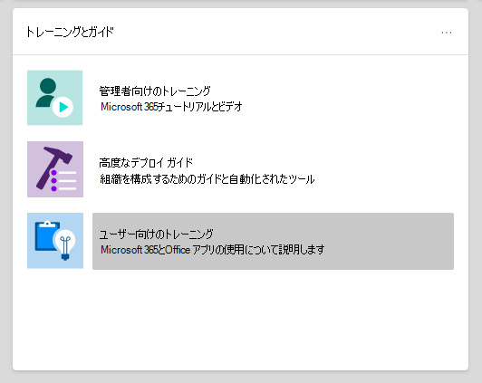

# Microsoft 365 および Office 365 サービスのセットアップ ガイド

Microsoft 365およびOffice 365セットアップ ガイドでは、テナント、アプリ、およびサービスを計画および展開するために、カスタマイズされたガイダンスとリソースを提供します。 これらのガイドは、オンボーディング スペシャリストが個々のやり取[り](https://www.microsoft.com/fasttrack/microsoft-365)でMicrosoft 365 FastTrack共有するのと同じベスト プラクティスを使用して作成され、Microsoft 365 管理センター 内のすべての管理者が利用できます。 製品のセットアップ、セキュリティ機能の有効化、コラボレーション ツールの展開に関する情報を提供し、高度な展開を高速化するためのスクリプトを提供します。

> [!NOTE]
> グローバル リーダーのような管理者ロールを割り当てる必要があります。この設定ガイドMicrosoft 365アクセスします。 グローバル管理者の役割を持つ管理者だけが、ガイドを使用してテナントの設定を変更できます。

## ウィザードのセットアップ ガイドにアクセスするMicrosoft 365 管理センター

セットアップ ガイドは、このページの[[セットアップ ガイダンス](https://aka.ms/setupguidance)] ページからMicrosoft 365 管理センター。 進捗状況を追跡し、いつでも戻ってガイドを完成できます。 [セットアップ ガイダンス] **ページにアクセスするには、次の手順を実行** します。

1. [ホーム [] Microsoft 365 管理センター](https://admin.microsoft.com/)ホーム ページに **移動** します。

2. トレーニング ガイド **カード&見** つける。

   

3. [ **ステップ バイ ステップ ガイド] を選択します**。

   ![ページの [セットアップ ガイダンス] ページのスクリーンショットMicrosoft 365 管理センター](../media/setup-guides-for-microsoft-365/adminportal-setupguidance.png)

## 初期セットアップのガイド

### 環境を準備する

「[環境を準備する」](https://aka.ms/prepareyourenvironment)ガイドは、組織の環境をサービスやサービスMicrosoft 365準備Office 365役立ちます。 目標が何であれ、展開を成功するために完了する必要があるタスクがあります。 環境の準備中にエラーが発生しないようにするには、ドメインの接続、ユーザーの追加、ライセンスの割り当て、Exchange Online による電子メールのセットアップ、Office アプリのインストールまたは展開を行う手順が記載されています。

### メールのセットアップ ガイド

電子[メールのセットアップ ガイド](https://aka.ms/office365setup)では、組織のユーザー設定を構成するために必要Exchange Online手順を示します。 このガイダンスには、新しいメール アカウントの設定、メールの移行、および電子メール保護の構成が含まれます。 メールのセットアップを成功するには、このアドバイザーを使用して、組織の現在のメール システム、移行するメールボックスの数、およびユーザーとそのアクセスを管理する方法に基づいて、推奨される移行方法を受け取る必要があります。

### Gmail の連絡先と予定表アイテムを移行する

Gmail ユーザーのメールボックスをユーザーのメールボックスに移行Microsoft 365メール メッセージは移行されますが、連絡先と予定表アイテムは移行されません。 Gmail の[連絡先](https://aka.ms/gmailcontactscalendar)と予定表アドバイザーは、Outlook.com、Outlook クライアント、または PowerShell を使用して、google 連絡先と Google 予定表アイテムを Microsoft 365 にインポートする手順を提供します。

### Microsoft 365展開アドバイザー

この[Microsoft 365展開アドバイザーは](https://aka.ms/microsoft365setupguide)、生産性ツール、セキュリティ ポリシー、およびデバイス管理機能をセットアップする際のガイダンスを提供します。 Microsoft 365 Business Premium またはエンタープライズ サブスクリプション版 Microsoft 365 があれば、このアドバイザーを使用して組織のデバイスをセットアップし、構成できます。

クラウド サービスを有効にし、デバイスを最新のサポートされているバージョンの Windows 10 に更新し、デバイスを Azure Active Directory (Azure AD) に参加する、すべてのリソースへのガイダンスとアクセスを 1 つの中央の場所で受け取る。

### リモート ワーク セットアップ ガイド

リモート [作業セットアップ ガイド](https://aka.ms/remoteworksetup) では、ユーザーがリモートで正常に作業し、データが安全で、ユーザーの資格情報を保護するために必要なヒントとリソースを組織に提供します。

クラウド内の Microsoft 365 リソースと組織のネットワークの両方へのリモート ワーカーのデバイス トラフィックを最適化するためのガイダンスを受け取り、リモート アクセス VPN インフラストラクチャの負荷を軽減します。

### Windowsデスクトップセットアップ ガイド

Windows Virtual Desktop は、クラウドで実行されている包括的なデスクトップおよびアプリの仮想化サービスです。 これは、管理の簡素化、マルチセッション Windows 10、Microsoft 365 Apps の最適化、およびリモート デスクトップ サービス (RDS) 環境のサポートを提供する唯一の仮想デスクトップ インフラストラクチャ (VDI) です。 Azure に Windows デスクトップとアプリを数分で展開および拡張し、組み込みのセキュリティとコンプライアンス機能を利用できます。

仮想[Windowsセットアップ](https://aka.ms/wvdsetupguide)ガイドでは、管理者に計画リソースと、展開、セットアップ ガイダンス、その他のリソースの前提条件を提供します。

### Microsoft Edgeセットアップ ガイド

Microsoft Edgeは、世界クラスの互換性とパフォーマンス、セキュリティとプライバシー、および最高の Web を提供するように設計された新機能を提供するために、一から再構築されました。

[Microsoft Edge](https://aka.ms/edgeadvisoradmin)セットアップ ガイドは、組織でアクセスするサイトが IE モードを使用する必要がある場合を確認し、重要なセキュリティ機能を確認および構成し、組織の要件を満たしてプライバシー ポリシーとコンプライアンス ポリシーを構成し、デバイス上の Web アクセスを管理するために、Enterprise Site Discovery を構成するのに役立ちます。 個々のデバイスMicrosoft Edgeダウンロードするか、グループ ポリシー、Configuration Manager、またはグループ ポリシーを使用して組織の複数のユーザーに展開する方法をMicrosoft Intune。

### IE モードを構成Microsoft Edge

Microsoft Edge を既に展開し、IE モードのみを構成する場合は、[Microsoft Edge 用[の IE](https://aka.ms/configureiemodeadmin)モードの構成] ガイドでは、Enterprise Site Discovery の構成を自動化するためのスクリプトを提供します。 また、クラウド ベースのツールから IE モードの推奨事項を取得し、ユーザーに展開する Enterprise モード サイト 一覧を作成するのに役立ちます。

### Microsoft Search セットアップ ガイド

Microsoft Search作業を完了するために必要な情報を組織が見つけるのに役立ちます。 ユーザー、ファイル、組織のグラフ、サイト、または一般的な質問に対する回答を検索する場合でも、組織は、Microsoft Search を使用して回答を取得できます。

この[Microsoft Searchガイド](https://aka.ms/MicrosoftSearchSetup)は、Microsoft Searchにパイロットするか、組織のすべてのユーザーに展開するかの設定を構成するのに役立ちます。検索管理者と検索エディターを割り当て、Bing 拡張機能を Chrome に追加したり、既定の検索エンジンとして Bing を設定したりなど、回答などのオプションを使用してユーザーの検索エクスペリエンスをカスタマイズします。

### Intune Configuration Manager の共同管理セットアップ ガイド

組織が Microsoft Intune と Configuration Manager の両方と共同管理する必要がある既存の Configuration Manager クライアント デバイスと新しいインターネット ベースのデバイスについては[、Intune](https://aka.ms/comanagementsetup) Configuration Manager 共同管理セットアップ ガイドを使用します。 この共同管理展開ガイドでは、両方のソリューションの利点を受け取Windows 10デバイスを管理し、組織のデバイスに新しい機能を追加できます。

## 認証とアクセスのガイド

### Azure ADセットアップ ガイド

[Azure AD セットアップ ガイド](https://aka.ms/aadpguidance)には、組織の強固なセキュリティ基盤を確保するための情報が記載されています。 このガイドでは、管理者向け Azure Role ベースのアクセス制御 (Azure RBAC)、オンプレミス ディレクトリの Azure AD Connect、Azure AD Connect Health など、初期機能をセットアップして、自動同期中にハイブリッド ID の正常性を監視できます。

また、セルフサービス パスワードのリセット、条件付きアクセス、オプションの高度な ID 保護、ユーザー プロビジョニングの自動化を含む統合サード パーティ製サインオンの有効化に関する重要な情報も含まれています。

### ユーザーを自分のアカウントから同期Windows Server Active Directory

[[ユーザーの同期] ガイドWindows Server Active Directory、](https://aka.ms/directorysyncsetup)ディレクトリ同期を有効にする方法を示します。 ディレクトリ同期により、オンプレミス ID とクラウド ID が一緒になり、アクセスが容易になり、管理が簡素化されます。 シングル サインオン、セルフサービス オプション、自動アカウント プロビジョニング、条件付きアクセス制御、コンプライアンス ポリシーなど、新しい機能のロックを解除します。 これらの機能により、ユーザーはどこからでも必要なリソースにアクセスできます。

### パスワードレス展開の計画

次のいずれかのパスワードレス認証方法を使用して、ユーザーがデバイスに安全にアクセスできる別のサインイン 方法にアップグレードします。

- Windows Hello for Business
- Microsoft Authenticator アプリ
- セキュリティ キー

「パスワード [レス展開を](https://aka.ms/passwordlesssetup) 計画する」ガイドを使用して、それらを展開する方法に関するガイダンスを使用して受け取る最適なパスワードレス認証方法を確認します。

### セルフサービス パスワード リセット (SSPR) の展開を計画する

ユーザーが自分のアカウントがロックされている場合、またはヘルプデスク のエンジニアに問い合わせることなくパスワードを忘れた場合は、ユーザーが自分のパスワードを個別に変更またはリセットできます。

環境での SSPR の展開に役立つ適切な Azure ポータル オプションを構成するための関連記事と手順を受け取る場合は、「セルフサービス のパスワード リセット展開の計画」の展開ガイドを使用します。

### Active Directory フェデレーション サービス (AD FS) 展開アドバイザー

[AD FS 展開アドバイザー](https://aka.ms/adfsguidance)は、Microsoft 365 および Office 365 サービスのユーザーを認証するオンプレミス AD FS インフラストラクチャの展開に関する段階的なガイダンスを提供します。 このガイドを使用すると、組織は AD FS コンポーネントと要件を確認し、展開に必要な SSL 証明書を取得してインストールし、必要な Web アプリケーション プロキシ サーバーをインストールできます。

## セキュリティとコンプライアンスのガイド

### Microsoft Intuneセットアップ ガイド

組織のMicrosoft Intune管理するデバイスを設定します。 企業のデバイスを完全に制御するには、Intune のモバイル デバイス管理 (MDM) 機能を使用します。 共有デバイスと個人用デバイスで組織のデータを管理するには、Intune のモバイル アプリケーション管理 (MAM) 機能を使用できます。

[Microsoft Intune[セットアップ](https://aka.ms/intunesetupguide)ガイドを使用して、デバイスとアプリのコンプライアンス ポリシーを設定し、アプリ保護ポリシーを割り当て、デバイスとアプリ保護の状態を監視します。

### Microsoft Defender for Endpoint セットアップ ガイド

[Microsoft Defender for Endpoint セットアップ ガイドには](https://aka.ms/mdatpsetup)、高度な脅威を防止、検出、調査、および対応するためのエンタープライズ ネットワークに役立つ手順が記載されています。 組織の脆弱性について十分な情報に基づいて評価し、どの展開パッケージと構成方法が最適かを判断します。

> [!NOTE]
> Microsoft Defender for Endpoint には、Microsoft ボリューム ライセンスが必要です。

### Exchange Online Protectionセットアップ ガイド

Microsoft Exchange Online Protection (EOP) は、スパムやマルウェアから保護するためのクラウドベースのメール フィルタリング サービスであり、メッセージング ポリシー違反から組織を保護する機能を備えています。

Exchange Online Protection セットアップ[ガイド](https://aka.ms/EOPguidance)を使用して、3 つの展開シナリオのオンプレミス メールボックス、ハイブリッド (オンプレミスとクラウドの組み合わせ) メールボックス、またはすべてのクラウド メールボックスが組織に適合するかを選択して、EOP を &mdash; 設定します。 &mdash; このガイドでは、ユーザーのライセンスの設定と確認、Microsoft 365 管理センター でのアクセス許可の割り当て、セキュリティ & コンプライアンス センターでの組織のマルウェア対策ポリシーとスパム ポリシーの構成に関する情報とリソースを提供します。

### Microsoft Defender for Office 365 のセットアップ ガイド

[Microsoft Defender for Office 365セットアップ](https://aka.ms/oatpsetup)ガイドは、電子メール メッセージ、リンク、およびサード パーティ製のコラボレーション ツールを通じて、環境が直面する可能性のある悪意のある脅威から組織を保護します。 このガイドでは、組織のニーズに合わせて計画を立てOffice 365 Defender の準備と識別に役立つリソースと情報を提供します。

### Microsoft Defender for Identity セットアップ ガイド

[Microsoft Defender for Identity セットアップ ガイド](https://aka.ms/DefenderforIdentitysetup)には、ユーザー ID を侵害する可能性のある高度な脅威を特定、検出、および調査するためのセキュリティ ソリューションセットアップ ガイダンスが提供されています。 これには、不審なユーザーアクティビティの検出や、組織に向けられた悪意のあるインサイダーアクションが含まれます。 Defender for Identity インスタンスを作成し、組織の Active Directory に接続し、センサー、アラート、通知を設定し、独自のポータルの基本設定を構成します。

### Microsoft Information Protection セットアップ ガイド

機密情報が保護されたと確信できるよう、情報保護戦略に適用できる機能の概要を確認します。 機密情報を発見、分類、保護、および監視する 4 段階のライフサイクル アプローチを使用します。 [Microsoft の情報保護のセットアップ ガイド](https://aka.ms/mipsetupguide) には、これらの各段階を完了するためのガイダンスが記載されています。

### Microsoft 情報ガバナンスのセットアップ ガイド

[Microsoft 情報ガバナンスの設定ガイド](https://aka.ms/migsetupguide)には、設定した特定のライフサイクルのガイドラインに従ってデータを分類および管理するため、組織のガバナンス戦略の設定と管理に必要な情報が提供されています。 このガイドでは、組織の再利用可能なコンテンツおよびコンプライアンス レコードに適用されるラベル、ラベル ポリシー、アイテム保持ポリシーを作成、自動適用、公開する方法について説明します。 また、一括処理のシナリオ、または個々のドキュメントに手動で適用するために、ファイル計画を使用した CSV ファイルのインポートに関する情報を入手できます。

### Microsoft Defender for Cloud Apps セットアップ ガイド

[Microsoft Defender for Cloud Apps セットアップ ガイドでは](https://aka.ms/cloudappsecuritysetup)、展開と管理のガイダンスに従ってクラウド探索ソリューションをセットアップできます。 Cloud Discovery を使用すると、サポートされているセキュリティ アプリを統合し、トラフィック ログを使用して組織が使用するクラウド アプリを動的に検出および分析します。 また、危険度の高い使用を識別するための脅威検出ポリシー、アクセスを定義する情報保護ポリシー、アクティビティを監視するためのリアルタイム セッション制御など、Defender for Cloud Apps ソリューションで利用できる機能を設定します。 これらの機能を使用すると、環境の可視性が強化され、データの移動を制御し、分析を行って、Microsoft およびサード パーティのクラウド サービス全体でサイバー脅威を特定して対処できます。

## コラボレーションのガイド

### 従業員エクスペリエンスの構築

従業員が従業員エクスペリエンス ダッシュボードと一緒に作業 [する方法を変革します](https://aka.ms/EmployeeExperienceDashboard)。 シームレスなチームワークを実現するには、Microsoft 365を使用して生産性の高いチームを作成し、従業員がリーダーシップと組織の残りの部分に従事し続ける必要があります。 すべての作業活動で従業員が効果的に働く。 これらのガイドでは、SharePoint、Teams、Yammerを使用して組織全体のコラボレーションを構築して生産性を向上させる方法について説明します。

### Microsoft 365 Apps展開アドバイザー

[Microsoft 365 Apps 展開アドバイザー](https://aka.ms/OPPquickstartguide) を利用すると、Word、Excel、PowerPoint、OneNote などの Office 製品の最新バージョンをユーザーのデバイスで実行することができます。 管理ツールを使用してエンタープライズ展開に対する簡単な自己インストール オプションを含むさまざまな展開方法に関するガイダンスを取得します。 この手順ではユーザーの環境評価、特定の展開要件の把握、必要なサポート ツールの実装を行うことができ、インストールを正常に完了できます。

### モバイル アプリのセットアップ ガイド

モバイル[アプリのセットアップ ガイドには](https://aka.ms/officeappguidance)、Office、iOS、および Android モバイル デバイス上の Windowsアプリのダウンロードとインストールの手順が記載されています。 このガイドでは、スマートフォンやタブレット デバイスにアプリをダウンロードしてインストールMicrosoft 365 Office 365詳細な情報を提供します。

### Microsoft Teamsセットアップ ガイド

Microsoft Teams[セットアップ](https://aka.ms/teamsguidance)ガイドでは、メッセージング、通話、およびチームとプライベートの両方の通信のための音声会議またはビデオ会議を通じてリアルタイムの会話をホストするチーム ワークスペースをセットアップするガイダンスを組織に提供します。 このガイドのツールを使用して、PowerShell セッションを開く必要なく、ゲスト アクセスを構成し、チームを作成できるユーザーを設定し、.csv ファイルからチーム メンバーを追加します。 また、組織のネットワーク要件を決定し、組織のネットワーク展開を成功にTeamsします。

### Microsoft Teams for Educationセットアップ ガイド

この[Microsoft Teams for Educationセットアップ](https://aka.ms/teamsedusetup)ガイドでは、学校に、共同作業の教室、会話、会議、ファイル、アプリを 1 か所にまとめるガイダンスを提供します。 また、このガイドでは、学校の準備、計画、および構成Teams説明します。 展開が完了したら、組み込みのツールを使用してチームを作成できるユーザーを構成し、必要に応じてチームを作成し、必要に応じてメンバーにファイルを設定.csvします。

### Microsoft LTI アプリを LMS と統合する

教師が効果的に働き、学生が組織化を行うには、すべての学習教材、課題、およびアプリケーションと簡単に共同作業を行う 1 つの場所へのシングル サインオンが必要です。 Microsoft ラーニング ツール相互運用性 (LTI) アプリは、学習管理システム (LMS) に Microsoft ツールのベストを直接取り入れ、学生と教師は、ファイルを見つけたり、ツールを構築したりではなく、学習に集中できます。

LMS の管理者であり、LMS 内から Microsoft ツールに直接アクセスする場合は、MICROSOFT LTI アプリを LMS に統合する [LMS](https://aka.ms/lmsintegrationguide) との統合ガイドを使用して、作業を開始します。 これらのツールには、現在、Microsoft Teamsおよび会議Microsoft Teams含まれています。

### SharePointセットアップ ガイド

[SharePoint セットアップ ガイド](https://aka.ms/spoguidance)を使用して、SharePoint ドキュメント ストレージとコンテンツ管理のセットアップ、サイトの作成、外部共有の構成、データの移行と詳細設定の構成、および組織内でのユーザー エンゲージメントとコミュニケーションを促進することができます。 コンテンツ共有アクセス許可ポリシーを構成し、移行同期ツールを選択し、移行環境のセキュリティ設定を有効にする手順にSharePointします。

### OneDriveセットアップ ガイド

ファイル ストレージ[OneDrive共有](https://aka.ms/ODfBquickstartguide)、コラボレーション、同期機能のOneDriveを開始するには、次のセットアップ ガイドを使用します。 OneDriveは、ユーザーが Microsoft 365 Apps ファイルを同期し、外部共有を構成し、ユーザー データを移行し、高度なセキュリティとデバイス アクセス設定を構成できる中央の場所を提供します。 このOneDriveのセットアップ ガイドは、サブスクリプションまたはスタンドアロン OneDriveプランを使用してOneDriveできます。

### Yammer展開アドバイザー

Connectを使用して組織全体をYammer。 この[Yammer展開](https://aka.ms/yammerdeploymentguide)アドバイザーは、ドメインYammer、管理者の定義、およびネットワークの組み合わせによって、Yammer準備します。 ユーザー設定を展開し、外観Yammer、セキュリティとコンプライアンスを構成し、設定を絞り込むガイダンスを取得します。

## 高度なガイド

### Configuration Manager を使用した一時アップグレード

Windows 7 と Windows 8.1 デバイスを最新バージョンの Windows 10 にアップグレードする場合は、[Configuration Manager を使用した一括アップグレードに関するガイド](https://aka.ms/win10upgradedemo)を使用します。 必要条件を確認して一括アップグレードを自動的に構成するために提供されるスクリプトを使用します。

### Office をユーザーに展開する

Office 展開ツールを使用して、インストールをカスタマイズできる機能を備えた Office アプリをクラウドから展開します。 [[ユーザーにOffice](https://aka.ms/proplusodt)を展開する] ガイドでは、高度な設定を使用してカスタマイズOffice構成を作成したり、事前に構築された推奨構成を使用できます。 ユーザーが自己インストールを行う場合でも、ユーザーに対して個別または一括で展開する場合でも、この高度なガイドでは、組織に合わせてカスタマイズされた Office インストールをユーザーに提供する手順を詳細に説明します。

### リモート ユーザーに Office を展開する

リモートでの作業が標準になったので、ユーザーが内部ネットワークに接続されていない場合や、自分のデバイスを使用している場合は、組織の Office 設定を受け取る必要があります。

[リモートユーザー Officeに展開する] ガイドを使用して、カスタマイズされた Office インストールを作成し、構成に合わせてユーザーをシームレスにインストールする生成された PowerShell スクリプトOffice送信します。

### Configuration Manager を使用してMicrosoft 365 Appsを展開および更新する

Configuration Manager を使用している組織では、「[Configuration Manager アドバイザーを使用して、Microsoft 365 Apps の展開と更新を行う](https://aka.ms/oppinstall)」に沿って、FastTrack エンジニアが推奨するベスト プラクティスを使用して、Microsoft 365 Apps の展開を自動的に構成するスクリプトを生成することができます。 このガイドを使用して、展開グループを作成し、Office のアプリと機能をカスタマイズし、動的またはリーン インストールを構成します。その後、スクリプトを実行して、展開を対象にする必要があるアプリケーション、自動展開ルール、デバイス コレクションを作成します。

### Intune Configuration Manager の共同管理セットアップ ガイド

Intune [Configuration Manager](https://aka.ms/comanagementsetup)共同管理セットアップ ガイドを使用して、組織が Microsoft Intune と Configuration Manager の両方と共同管理する既存の Configuration Manager クライアント デバイスと新しいインターネット ベースのデバイスをセットアップします。 共同管理を使用すると、Windows 10デバイスを管理し、組織のデバイスに新しい機能を追加しながら、両方のソリューションのメリットを受けることができます。
