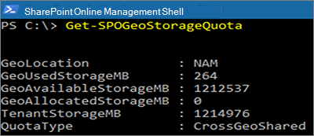

# <a name="sharepoint-storage-quotas-in-multi-geo-environments"></a>複数地域環境における SharePoint ストレージ クォータ

既定では、複数地域環境のすべての地域の場所では、使用できるテナントのストレージ クォータを共有します。

SharePoint 地域ストレージ クォータ設定では、地域の場所ごとにストレージ クォータを管理することができます。 地域の場所のストレージ クォータを割り当てると、それがその地域の場所に使用可能な最大ストレージ容量になり、使用可能なテナント ストレージ クォータから差し引かれます。 残りの利用可能なテナント ストレージ クォータは、特定のストレージ クォータが割り当てられていない構成済みの地域の場所間で共有されます。

地域の場所に対する SharePoint ストレージ クォータは、SharePoint Online 管理者が中央の場所に接続することによって割り当てることができます。 サテライトの場所の地域管理者は、ストレージ クォータを表示できますが、割り当てることはできません。

## <a name="configure-a-storage-quota-for-a-geo-location"></a>地域の場所のストレージ クォータを構成する

地域の場所にストレージ クォータを割り当てるには、[Microsoft Office SharePoint Online モジュール](https://www.microsoft.com/download/details.aspx?id=35588)を使用して、中央の場所に接続します。

場所にストレージ クォータを割り当てるには、次のコマンドレットを実行します。

```powershell
Set-SPOGeoStorageQuota -GeoLocation <geolocationcode> -StorageQuotaMB <value>
```

現在の地域の場所に対するストレージ クォータを表示するには、次を実行します。

```powershell
Get-SPOGeoStorageQuota
```



すべての地域の場所に対するストレージ クォータを表示するには、次を実行します。

```powershell
Get-SPOGeoStorageQuota -AllLocations
```

地域の場所の割り当てられたストレージ クォータを削除するには、`StorageQuota value = 0` を設定します。

```powershell
Set-SPOGeoStorageQuota -GeoLocation <geolocationcode> -StorageQuotaMB 0
```
