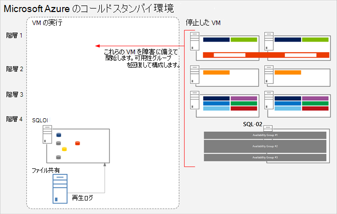
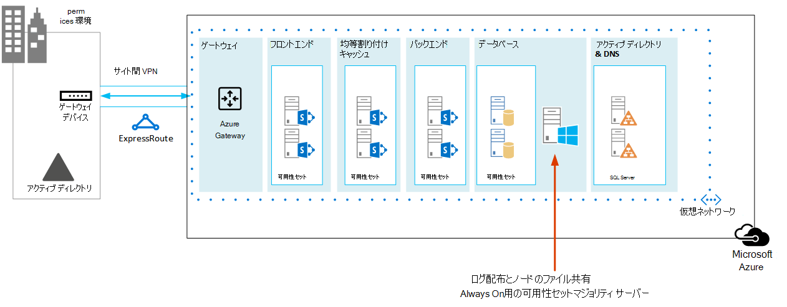

# <a name="sharepoint-server-2013-disaster-recovery-in-microsoft-azure"></a>Microsoft Azure での SharePoint Server 2013 の障害復旧

 Azure を使用すると、オンプレミス SharePoint ファーム用の障害復旧環境を作成できます。 この記事では、このソリューションの設計と実装の方法を取り上げます。

 **SharePoint Server 2013 障害復旧の概要ビデオをご覧ください**
> [!VIDEO https://www.microsoft.com/videoplayer/embed/1b73ec8f-29bd-44eb-aa3a-f7932784bfd9?autoplay=false]
  
 SharePoint オンプレミス環境に障害が発生する場合、最も優先すべきことは、システムを稼働状態に迅速に戻すことです。Microsoft Azure でバックアップ環境が既に稼働している場合には、SharePoint の障害復旧は迅速かつ簡単に行えます。このビデオは、SharePoint ウォーム フェールオーバー環境の主要な概念について取り上げ、この記事に記されている詳細情報を補完するものとなっています。
  
この記事では、ソリューション モデル「 **Microsoft Azure における SharePoint 障害復旧** 」を使用します。
  
[](https://go.microsoft.com/fwlink/p/?LinkId=392555)
  
 [PDF](https://go.microsoft.com/fwlink/p/?LinkId=392555) |  [Visio](https://go.microsoft.com/fwlink/p/?LinkId=392554)
  
## <a name="use-azure-infrastructure-services-for-disaster-recovery"></a>障害復旧のための Azure インフラストラクチャ サービスの使用

多くの組織には、SharePoint 用の障害復旧環境はありません。この環境を内部設置型として構築して保守するには費用が高額になる可能性があります。Azure インフラストラクチャ サービス が提供する魅力的な障害復旧環境は、内部設置型の代替方法よりも柔軟性があり、費用が少なくて済みます。
  
Azure インフラストラクチャ サービス を使用する利点には、以下が含まれます。
  
- **リソースの費用を抑えられる** 内部設置型の障害復旧環境に比べて、保守するリソースが少なく、費用も抑えられます。リソースの数は、障害復旧環境として、コールド スタンバイ、ウォーム スタンバイ、ホット スタンバイのどれを選択するかによって異なります。
    
- **リソースの柔軟性の向上** 障害発生時、負荷要件を満たすためにご使用の復旧 SharePoint ファームを簡単にスケールアウトできます。リソースが不要になる場合にはスケールインします。
    
- **低額なデータセンターのコミットメント** 別の地域にあるセカンダリ データセンターに投資するのではなく、Azure インフラストラクチャ サービス を使用します。
    
障害復旧に取り組み始めたばかりの組織が活用できる簡単なオプションと、高い信頼性が要件となっている組織が活用できる拡張オプションがあります。コールド、ウォーム、ホット スタンバイの各環境の定義は、環境がクラウド プラットフォームでホストされると若干異なります。以下の表に、Azure で SharePoint 復旧ファームを構築するためのこれらの環境について取り上げます。
  
**表: 復旧環境**

|**復旧環境の種類**|**説明**|
|:-----|:-----|
|ホット  <br/> |フルサイズのファームが、スタンバイ状態で準備、更新、実行されています。  <br/> |
|ウォーム  <br/> |ファームが構築され、仮想マシンが実行状態で、更新されています。  <br/> 復旧には、コンテンツ データベースの接続、サービス アプリケーションの準備、コンテンツのクロールが含まれます。  <br/> このファームは、運用ファームよりも小規模にでき、フルサイズのユーザー ベースに対応するためにスケールアウトできます。  <br/> |
|コールド  <br/> |ファームは完全に構築されますが、仮想マシンは停止状態です。  <br/> 環境の保守には、仮想マシンを時折始動すること、環境への修正プログラムの適用、更新、検証が含まれます。  <br/> 障害発生時に、環境全体を開始します。  <br/> |
   
組織の目標回復時間 (RTO) と目標復旧時点 (RRO) を評価することは重要です。これらの要件によって、どの環境が、ご自分の組織に最も適切な投資となるかを判別します。
  
この記事のガイダンスでは、ウォーム スタンバイ環境の実装方法を取り上げます。この方法はコールド スタンバイ環境にも適用できます。ただし、この種類の環境をサポートするには追加手順が必要です。この記事では、ホット スタンバイ環境の実装方法については取り上げません。
  
障害復旧ソリューションの詳細については、「[High availability and disaster recovery concepts in SharePoint 2013](/SharePoint/administration/high-availability-and-disaster-recovery-concepts)」および「[Choose a disaster recovery strategy for SharePoint 2013](/SharePoint/administration/plan-for-disaster-recovery)」をご覧ください。
  
## <a name="solution-description"></a>ソリューションの説明

ウォーム スタンバイ障害復旧ソリューションには、以下の環境が必要です。
  
- オンプレミスの SharePoint 運用ファーム
    
- Azure の SharePoint 復旧ファーム
    
- 2 つの環境間のサイト間 VPN 接続
    
次の図に、これら 3 つの要素を示します。
  
**図: Azure におけるウォーム スタンバイ ソリューションの要素**


  
分散ファイル システム レプリケーション (DFSR) を使用した SQL Server ログ配布により、データベース バックアップとトランザクション ログを Azure 内の復旧ファームにコピーします。 
  
- DFSR は、運用環境のログを復旧環境に転送します。WAN シナリオの場合、ログを Azure 内のセカンダリ サーバーに直接配布するよりも、DFSR の方が効率的です。
    
- ログは、Azure の復旧環境で SQL Server に再生されます。
    
- 復旧手順が実行されるまでは、復旧環境にあるログ配布対象の SharePoint コンテンツ データベースには接続しません。
    
次のステップを実行してファームを復旧します。
  
1. ログ配布を停止します。
    
2. プライマリ ファームへのトラフィックの受け入れを停止します。
    
3. 最後のトランザクション ログを再生します。
    
4. コンテンツ データベースをファームに接続します。
    
5. レプリケートされたサービス データベースに基づいてサービス アプリケーションを復元します。
    
6. 復旧ファームを指すように、ドメイン ネーム システム (DNS) レコードを更新します。
    
7. フル クロールを開始します。
    
実際の復旧動作が円滑に進むようにするため、これらのステップに関して定期的にリハーサルを行い、文書化しておくことをお勧めします。コンテンツ データベースへの接続とサービス アプリケーションの復元には時間がかかる可能性があり、通常は手動構成が若干必要となります。
  
復旧が実行されると、このソリューションにより次の表に示すアイテムが提供されます。
  
**表: ソリューションによる復旧対象**

|**アイテム**|**説明**|
|:-----|:-----|
|サイトおよびコンテンツ  <br/> |復旧環境で、サイトとコンテンツを利用できます。  <br/> |
|検索の新しいインスタンス  <br/> |このウォーム スタンバイ ソリューションの場合、検索は検索データベースから復元されません。復旧ファームにある検索コンポーネントは、可能な限り運用ファームと同様に構成されます。サイトとコンテンツが復元された後、フル クロールが開始され、検索インデックスが再作成されます。クロールが完了するまで待たなくても、サイトとコンテンツは利用できます。  <br/> |
|サービス  <br/> | データベースにデータを格納するサービスは、ログ配布先データベースから復元されます。データベースにデータを格納しないサービスは、単に開始されるだけです。 <br/>  データベースを使用するサービスすべてを、必ずしも復元する必要はありません。以下のサービスの場合、データベースからの復元は不要で、フェールオーバー後に単に開始するだけで済みます。 <br/>  Usage and Health Data Collection <br/>  State Service <br/>  Word Automation <br/>  データベースを使用しないその他のサービス <br/> |
   
より複雑な復旧対象に対応するために、Microsoft Consulting Services (MCS) またはパートナーと一緒に作業できます。それらについては、次の表でまとめています。
  
**表: MCS またはパートナーが対応できるその他のアイテム**

|**アイテム**|**説明**|
|:-----|:-----|
|カスタム ファーム ソリューションの同期  <br/> |復旧ファーム構成と運用ファームが同じであることが理想的です。コンサルタントやパートナーと共に作業し、カスタム ファーム ソリューションのレプリケートを行うかどうか、2 つの環境を同期された状態に保つためのプロセスが適切かどうかを評価できます。  <br/> |
|オンプレミスのデータ ソースへの接続  <br/> |バックアップ ドメイン コントローラー (BDC) 接続などのバックエンド データ システムへの接続のレプリケート、およびコンテンツ ソースの検索は実際的ではない場合があります。  <br/> |
|検索の復元シナリオ  <br/> |企業における検索の展開は固有でかなり複雑になる傾向があるため、データベースから検索を復元する操作には大きな投資が必要になります。コンサルタントやパートナーと共に作業し、ご自分の組織で必要となる可能性がある検索の復元シナリオを特定して実装できます。  <br/> |
   
この記事で示されているガイダンスでは、オンプレミス ファームの設計と展開が既に行われていると想定しています。
  
## <a name="detailed-architecture"></a>詳細なアーキテクチャ

Azure の復旧ファーム構成は、以下を含め、オンプレミスの運用ファームと同じであることが理想的です。
  
- 同じ表記のサーバー ロール
    
- 同じカスタマイズ構成
    
- 同じ検索コンポーネント構成
    
Azure の環境は、運用ファームよりも小規模にできます。フェールオーバー後に復旧ファームをスケールアウトする予定の場合には、それぞれの種類のサーバー ロールを最初に表記しておくことが重要です。
  
一部の構成については、フェールオーバー環境でレプリケートすることが実際的ではない場合があります。必ずフェールオーバー手順と環境をテストし、フェールオーバー ファームが予想どおりのサービス レベルを提供することを確認してください。
  
このソリューションでは、SharePoint ファームの特定のトポロジを規定していません。このソリューションでは、フェールオーバー ファームに対する Azure の使用と、2 つの環境間でのログ配布と DFSR の実装に焦点を当てています。
  
### <a name="warm-standby-environments"></a>ウォーム スタンバイ環境

ウォーム スタンバイ環境では、Azure 環境内のすべての仮想マシンが稼働状態にあります。この環境では、テストと実際の場合を問わず、フェールオーバーの準備が整っています。
  
次の図は、オンプレミス SharePoint ファームから、ウォーム スタンバイ環境として構成されている Azure ベースの SharePoint ファームに対する障害復旧ソリューションを示しています。
  
**図: 運用ファームとウォーム スタンバイ復旧ファームのトポロジと主な要素**


  
この図では次のようになっています。
  
- オンプレミス SharePoint ファームと Azure 内のウォーム スタンバイ ファームの 2 つの環境が並べて示されています。
    
- それぞれの環境には、ファイル共有が含まれます。
    
- それぞれのファームには 4 つの層があります。高可用性を実現するため、各層には、フロント エンド サービス、分散キャッシュ、バック エンド サービス、データベースなど特定のロールに関して同じに構成されている 2 つのサーバーまたは仮想マシンが含まれています。この図では特定のコンポーネントの呼び出しが重要になるわけではありません。2 つのファームは同一に構成されています。
    
- 4 番目の層は、データベース層です。ログ配布を使用して、オンプレミス環境にあるセカンダリ データベース サーバーのログを、同じ環境内のファイル共有にコピーします。
    
- DFSR が、オンプレミス環境にあるファイル共有のファイルを、Azure 環境のファイル共有にコピーします。
    
- ログ配布により、Azure 環境のファイル共有のログが、復旧環境の SQL Server AlwaysOn 可用性グループのプライマリ レプリカに再生されます。
    
### <a name="cold-standby-environments"></a>コールド スタンバイ環境

コールド スタンバイ環境の場合、ほとんどの SharePoint ファームの仮想マシンはシャットダウンされている可能性があります (2 週間に一度や月に一度など定期的に仮想マシンを始動し、それぞれの仮想マシンが対象ドメインと同期できるようにすることをお勧めします)。Azure 復旧環境にある次の仮想マシンに関しては、ログ配布と DFSR が継続的に動作できるようにするため常に稼働状態にする必要があります。
  
- ファイル共有
    
- プライマリ データベース サーバー
    
- Windows Server Active Directory ドメイン サービスと DNS を実行している少なくとも 1 つの仮想マシン
    
次の図は、ファイル共有仮想マシンとプライマリ SharePoint データベース仮想マシンが稼働している Azure フェールオーバー環境を示しています。他のすべての SharePoint 仮想マシンは停止しています。Windows Server Active Directory と DNS を実行している仮想マシンは示されていません。
  
**図: 稼働中の仮想マシンが含まれるコールド スタンバイ復旧ファーム**


  
コールド スタンバイ環境にフェールオーバーした後、すべての仮想マシンが始動されます。SQL Server AlwaysOn 可用性グループなど、データベース サーバーの高可用性を実現するための方式が構成されていなければなりません。
  
複数のストレージ グループが実装されている場合 (複数のデータベースが複数の SQL Server 高可用性セットに分散されている場合)、そのストレージ グループに関連付けられているログを受け入れるために、各ストレージ グループのプライマリ データベースが実行中でなければなりません。
  
### <a name="skills-and-experience"></a>スキルと経験

この障害復旧ソリューションでは、多くのテクノロジが使用されています。こうしたテクノロジが期待どおりに相互に作用するためには、オンプレミス環境と Azure 環境にあるそれぞれのコンポーネントが、適切にインストールされて構成されている必要があります。以下の記事で説明されているテクノロジに関して十分な実務上の知識と実践スキルを持つ担当者またはチームが、このソリューションを設定することをお勧めします。
  
- [DFS (Distributed File System) レプリケーション サービス](/previous-versions/windows/it-pro/windows-server-2012-R2-and-2012/jj127250(v=ws.11))
    
- [Windows Server フェールオーバー クラスタリング (WSFC) と SQL Server](/sql/sql-server/failover-clusters/windows/windows-server-failover-clustering-wsfc-with-sql-server)
    
- [AlwaysOn 可用性グループ (SQL Server)](/sql/database-engine/availability-groups/windows/always-on-availability-groups-sql-server)
    
- [SQL Server データベースのバックアップと復元](/sql/relational-databases/backup-restore/back-up-and-restore-of-sql-server-databases)
    
- [SharePoint Server 2013 のインストールとファーム展開](/SharePoint/install/installation-and-configuration-overview)
    
- [Microsoft Azure](/azure/)
    
最後に、これらのテクノロジに関連するタスクを自動化できる、スクリプト作成のスキルをお勧めします。ユーザー インターフェイスを使用して、このソリューションで取り上げられているすべてのタスクを完了できます。ただし、手動で行うと時間がかかり、エラーが発生しやすく、一貫性のない結果が生じる恐れがあります。
  
Windows PowerShell の他にも、SQL Server、SharePoint Server、Azure 用の Windows PowerShell ライブラリがあります。T-SQL も忘れないでください。これは、障害復旧環境の構成と保守に費やす時間の節約に役立ちます。
  
## <a name="disaster-recovery-roadmap"></a>障害復旧のロードマップ


  
このロードマップでは、SharePoint Server 2013 ファームが既に運用環境に展開されていることが前提となります。
  
**表: 障害復旧のロードマップ**

|**フェーズ**|**説明**|
|:-----|:-----|
|フェーズ 1  <br/> |障害回復環境を設計します。  <br/> |
|フェーズ 2  <br/> |Azure Virtual Network と VPN 接続を作成します。  <br/> |
|フェーズ 3  <br/> |Windows Active Directory とドメイン ネーム サービスを Azure Virtual Network に展開します。  <br/> |
|フェーズ 4  <br/> |Azure に SharePoint 復旧ファームを展開します。  <br/> |
|フェーズ 5  <br/> |ファーム間の DFSR を設定します。  <br/> |
|フェーズ 6  <br/> |復旧ファームに対するログ配布を設定します。  <br/> |
|フェーズ 7  <br/> | フェールオーバーと復旧のソリューションを検証します。これには、以下の手順とテクノロジが関係します。 <br/>  ログ配布を停止します。 <br/>  バックアップを復元します。 <br/>  コンテンツをクロールします。 <br/>  サービスを復元します。 <br/>  DNS レコードを管理します。 <br/> |
   
## <a name="phase-1-design-the-disaster-recovery-environment"></a>フェーズ 1: 障害復旧環境の設計

「[SharePoint 2013 用の Microsoft Azure アーキテクチャ](microsoft-azure-architectures-for-sharepoint-2013.md)」に記されているガイダンスに従って、SharePoint 復旧ファームを含む、障害復旧環境を設計します。 Azure の障害復旧ソリューションの[](https://go.microsoft.com/fwlink/p/?LinkId=392554)SharePointを使用して、Visioプロセスを開始できます。 環境全体を設計してから、Azure 環境で作業を開始することをお勧めします。
  
「[SharePoint 2013 用の Microsoft Azure アーキテクチャ](microsoft-azure-architectures-for-sharepoint-2013.md)」に記されている仮想ネットワーク、VPN 接続、Active Directory、および SharePoint ファームを設計するためのガイダンスに加え、Azure 環境にファイル共有ロールを追加してください。
  
障害復旧ソリューションでのログ配布をサポートするため、ファイル共有仮想マシンが、データベース ロールが存在するサブネットに追加されます。またファイル共有は、SQL Server AlwaysOn 可用性グループのノード マジョリティの 3 番目のノードとしても機能します。これは、SQL Server AlwaysOn 可用性グループを使用する標準の SharePoint ファームにおいてお勧めされる構成です。 
  
> [!NOTE]
> SQL Server AlwaysOn 可用性グループに参加するデータベースの前提条件を確認することは重要です。詳しくは、「[AlwaysOn 可用性グループの前提条件、制限事項、および推奨事項](/sql/database-engine/availability-groups/windows/prereqs-restrictions-recommendations-always-on-availability)」をご覧ください。 
  
**図: 障害復旧ソリューションに使用するファイル サーバーの配置**


  
この図では、ファイル共有仮想マシンは、Azure においてデータベース サーバー ロールが含まれる同じサブネットに追加されています。ファイル共有仮想マシンは、SQL Server ロールなどの他のサーバー ロールが含まれる可用性セットには追加しないでください。
  
ログの高可用性を確保する場合には、「[Azure BLOB ストレージ サービスを使用した SQL Server のバックアップと復元](/sql/relational-databases/backup-restore/sql-server-backup-and-restore-with-microsoft-azure-blob-storage-service)」を使用した別の方法をご考慮ください。これは Azure の新機能で、BLOB ストレージ URL にログを直接保存します。このソリューションには、この機能の使用についてのガイダンスは含まれていません。
  
復旧ファームを設計するときには、正常な障害復旧環境は、復元する運用ファームを正確に反映するという点に留意してください。復旧ファームの設計、展開、テストにおいては、復旧ファームのサイズは重要ではありません。ファームのサイズは、ビジネス要件に基づいて組織によって異なります。短期間の停止状態の間、またはパフォーマンスとキャパシティの要件によりファームのサイズを拡張する必要が生じるまでの間、ファームをスケールダウンすることもできます。
  
復旧ファームを可能な限り運用ファームと同じように構成し、サービス レベル アグリーメント (SLA) 要件を満たして、ビジネスをサポートするために必要な機能を提供できるようにします。障害復旧環境を設計する場合、運用環境の変更管理プロセスも考慮してください。復旧環境を運用環境と同じ間隔で更新して、変更管理プロセスを復旧環境に拡張することをお勧めします。変更管理プロセスの一環として、ファーム構成、アプリケーション、およびユーザーを詳細に調査することをお勧めします。 
  
## <a name="phase-2-create-the-azure-virtual-network-and-vpn-connection"></a>フェーズ 2: Azure Virtual Network と VPN 接続の作成

「[オンプレミス ネットワークを Microsoft Azure 仮想ネットワークに接続する](connect-an-on-premises-network-to-a-microsoft-azure-virtual-network.md)」には、Azure における仮想ネットワークの計画と展開の方法、および VPN 接続の作成方法が示されています。このトピックに記されているガイダンスに従い、以下の手順を実行してください。
  
- 仮想ネットワーク のプライベート IP アドレス空間を計画します。
    
- 仮想ネットワーク のルーティング インフラストラクチャの変更を計画します。
    
- オンプレミス VPN デバイスとの間のトラフィックのファイアウォール規則を計画します。
    
- Azure でクロスプレミスの仮想ネットワークを作成します。
    
- オンプレミス ネットワークと 仮想ネットワーク 間のルーティングを構成します。
    
## <a name="phase-3-deploy-active-directory-and-domain-name-services-to-the-azure-virtual-network"></a>フェーズ 3: Active Directory とドメイン ネーム サービスの Azure Virtual Network への展開

このフェーズでは、「[SharePoint 2013 用の Microsoft Azure アーキテクチャ](microsoft-azure-architectures-for-sharepoint-2013.md)」で説明されているハイブリッド シナリオを使用して、次の図に示されているように、Windows Server Active Directory と DNS の両方を 仮想ネットワーク に展開します。
  
**図: Active Directory ドメインのハイブリッド構成**


  
この図には、同じサブネットに対して 2 つの仮想マシンが展開されています。これらの仮想マシンは、Active Directory と DNS という 2 つのロールをそれぞれホストしています。
  
Azure に Active Directory を展開する前に、「[Azure の仮想マシンでの Windows Server Active Directory のデプロイ ガイドライン](/windows-server/identity/ad-ds/introduction-to-active-directory-domain-services-ad-ds-virtualization-level-100)」をご覧ください。そこに記されているガイドラインは、ご使用のソリューションで別のアーキテクチャまたは構成設定が必要かどうかを判断するのに役立ちます。
  
Azure におけるドメイン コントローラーの設定に関する詳しいガイドラインは、「[Azure の仮想ネットワークでのレプリカ Active Directory ドメイン コントローラーのインストール](/windows-server/identity/ad-ds/introduction-to-active-directory-domain-services-ad-ds-virtualization-level-100)」をご覧ください。
  
このフェーズの前には、仮想ネットワーク に仮想マシンは展開していません。Active Directory と DNS をホストする仮想マシンは、ソリューションで必要な最大の仮想マシンではない可能性が高いです。こうした仮想マシンを展開する前に、まず 仮想ネットワーク で使用する予定の最大の仮想マシンを作成します。これにより、ご使用のソリューションが、必要とする最大サイズを Azure において確実に確保できます。この仮想マシンをこの時点で構成する必要はありません。単に作成し、後で設定します。作成を行わないと、後で大きな仮想マシンを作成しようとするときに限界に達する可能性があります。これは、この記事の作成時点における問題です。 
  
## <a name="phase-4-deploy-the-sharepoint-recovery-farm-in-azure"></a>フェーズ 4: Azure における SharePoint 復旧ファームの展開

設計計画に基づいて、SharePoint ファームを 仮想ネットワーク に展開します。Azure に SharePoint ロールを展開する前に、「[Azure インフラストラクチャ サービスでの SharePoint 2013 の計画](/previous-versions/azure/dn275958(v=azure.100))」を確認すると役立ちます。
  
概念実証環境の構築を介して学んだ以下の点を考慮に入れてください。
  
- Azure ポータルまたは PowerShell を使用して仮想マシンを作成します。
    
- Azure と Hyper-V は、動的メモリはサポートしていません。これは、必ずパフォーマンスとキャパシティの計画で考慮要素となります。
    
- 仮想マシンのログオン自体ではなく、Azure インターフェイスを使用して仮想マシンを再起動します。Azure インターフェイスを使用する方がより良い動作が得られ、予測も容易です。
    
- コスト削減のために仮想マシンをシャットダウンする場合には、Azure インターフェイスを使用してください。仮想マシンのログオンからシャットダウンすると、課金状態が続きます。
    
- 仮想マシンの命名規則を使用します。
    
- 仮想マシンの展開先のデータセンターの場所に注意します。
    
- Azure の自動スケール機能は、SharePoint ロールに関してはサポートされていません。
    
- サイト コレクションなど、ファーム内にある復元対象のアイテムは構成できません。 
    
## <a name="phase-5-set-up-dfsr-between-the-farms"></a>フェーズ 5: ファーム間の DFSR の設定

DFSR によるファイル レプリケーションを設定するには、DNS 管理スナップインを使用します。ただし、DFSR 設定の前に、オンプレミス ファイル サーバーと Azure ファイル サーバーにログオンし、Windows でサービスを有効にします。
  
サーバー マネージャーのダッシュボードから、以下のステップを実行します。
  
- ローカル サーバーを構成します。
    
- [ **役割と機能の追加ウィザード**] を起動します。
    
- [ **ファイル サービスと記憶域サービス**] ノードを開きます。
    
- [ **DFS 名前空間**] および [ **DFS レプリケーション**] を選択します。
    
- [ **次へ**] をクリックして、ウィザードのステップを完了します。
    
次の表に、DFSR リファレンスの記事とブログ投稿へのリンクを示します。
  
**表: DFSR のリファレンス記事**

|**タイトル**|**説明**|
|:-----|:-----|
|[レプリケーション](/previous-versions/windows/it-pro/windows-server-2008-R2-and-2008/cc770278(v=ws.11)) <br/> |レプリケーションに関するリンクが含まれる DFS 管理のための TechNet トピック  <br/> |
|[DFS レプリケーション: サバイバル ガイド](https://go.microsoft.com/fwlink/p/?LinkId=392737) <br/> |DFS 情報へのリンクが含まれる Wiki  <br/> |
|[DFS レプリケーション: よく寄せられる質問 (FAQ)](/previous-versions/windows/it-pro/windows-server-2003/cc773238(v=ws.10)) <br/> |DFS レプリケーションに関する TechNet トピック  <br/> |
|[Jose Barreto のブログ](/archive/blogs/josebda/) <br/> |Microsoft のファイル サーバー チームのプリンシパル プログラム マネージャーが書き込んだブログ  <br/> |
|[Microsoft のストレージ チーム - ファイル キャビネット ブログ](https://go.microsoft.com/fwlink/p/?LinkId=392740) <br/> |Windows Server のファイル サービスとストレージ機能に関するブログ  <br/> |
   
## <a name="phase-6-set-up-log-shipping-to-the-recovery-farm"></a>フェーズ 6: 復旧ファームに対するログ配布の設定

ログ配布は、この環境で障害復旧を設定するための重要なコンポーネントです。ログ配布を使用すると、データベースのトランザクション ログ ファイルをプライマリ データベース サーバー インスタンスからセカンダリ データベース サーバー インスタンスに自動的に送信できます。ログ配布を設定するには、「[Configure log shipping in SharePoint 2013](/sharepoint/administration/configure-log-shipping)」をご覧ください。 
  
> [!IMPORTANT]
> SharePoint Server におけるログ配布サポートは、特定のデータベースに限定されています。詳しくは、「[サポートされている SharePoint データベース用の高可用性と障害復旧のオプション (SharePoint 2013)](/SharePoint/administration/supported-high-availability-and-disaster-recovery-options-for-sharepoint-databas)」をご覧ください。 
  
## <a name="phase-7-validate-failover-and-recovery"></a>フェーズ 7: フェールオーバーと復旧の検証

この最後のフェーズの目標は、障害復旧ソリューションが計画どおりに作動しているかどうかを検証することです。そのためには、運用ファームをシャットダウンするフェールオーバー イベントを作成し、代替として復旧ファームを開始します。フェールオーバー シナリオの開始は、手動で行うこともスクリプトを使用して行うこともできます。
  
最初のステップとして、ファーム サービスまたはコンテンツに対する着信ユーザー要求を停止します。このためには、DNS エントリを無効にするか、フロントエンドの Web サーバーをシャットダウンできます。ファームの「停止」後、復旧ファームにフェールオーバーできます。
  
### <a name="stop-log-shipping"></a>ログ配布の停止

ファーム復旧の前にログ配布を停止する必要があります。最初に、Azure のセカンダリ サーバーでログ配布を停止し、次にオンプレミスのプライマリ サーバーで停止します。以下のスクリプトを使用して、まずセカンダリ サーバーのログ配布を停止し、次にプライマリ サーバーで停止します。スクリプト内のデータベース名は、環境によっては異なる場合があります。
  
```
-- This script removes log shipping from the server.
-- Commands must be executed on the secondary server first and then on the primary server.

SET NOCOUNT ON
DECLARE  @PriDB nvarchar(max)
,@SecDB nvarchar(250)
,@PriSrv nvarchar(250)
,@SecSrv nvarchar(250)

Set @PriDB= ''
SET @PriDB = UPPER(@PriDB)
SET @PriDB = REPLACE(@PriDB, ' ', '')
SET @PriDB = '''' + REPLACE(@PriDB, ',', ''', ''') + ''''

Set @SecDB = @PriDB

Exec ( 'Select  ''exec master..sp_delete_log_shipping_secondary_database '' + '''''''' + prm.primary_database +  ''''''''   
from msdb.dbo.log_shipping_monitor_primary prm INNER JOIN msdb.dbo.log_shipping_primary_secondaries sec  ON  prm.primary_database=sec.secondary_database
where prm.primary_database in ( ' + @PriDB + ' )')

Exec ( 'Select  ''exec master..sp_delete_log_shipping_primary_secondary '' + '''''''' + prm.Primary_Database + '''''', '''''' + sec.Secondary_Server + '''''', '''''' + sec.Secondary_database + ''''''''   
from msdb.dbo.log_shipping_monitor_primary prm INNER JOIN msdb.dbo.log_shipping_primary_secondaries sec  ON  prm.primary_database=sec.secondary_database
where prm.primary_database in ( ' + @PriDB + ' )')

Exec ( 'Select  ''exec master..sp_delete_log_shipping_primary_database '' + '''''''' + prm.primary_database +  ''''''''   
from msdb.dbo.log_shipping_monitor_primary prm INNER JOIN msdb.dbo.log_shipping_primary_secondaries sec  ON  prm.primary_database=sec.secondary_database
where prm.primary_database in ( ' + @PriDB + ' )')

Exec ( 'Select  ''exec master..sp_delete_log_shipping_secondary_primary '' + '''''''' + prm.primary_server + '''''', '''''' + prm.primary_database +  ''''''''   
from msdb.dbo.log_shipping_monitor_primary prm INNER JOIN msdb.dbo.log_shipping_primary_secondaries sec  ON  prm.primary_database=sec.secondary_database
where prm.primary_database in ( ' + @PriDB + ' )')

```

### <a name="restore-the-backups"></a>バックアップの復元

バックアップは、作成された順序で復元する必要があります。特定のトランザクション ログ バックアップを復元するには、その前に、コミットされていないトランザクションをロールバックせずに、以下に示す以前のバックアップをまず復元する必要があります （つまり、 `WITH NORECOVERY` を使用します)。
  
- 完全データベース バックアップと最後の差分バックアップ - 特定のトランザクション ログ バックアップの前にこうしたバックアップが行われて存在する場合にはそれを復元します。最新の完全バックアップまたは差分データベース バックアップが作成される前に、データベースでは、完全復旧モデルまたは一括ログ復旧モデルが使用されました。
    
- すべてのトランザクション ログ バックアップ - 完全データベース バックアップまたは差分バックアップ (復元する場合) の後で、なおかつ特定のトランザクション ログ バックアップの前に行われたトランザクション ログ バックアップを復元します。ログ バックアップは、ログ チェーン内でギャップなしで、作成された順序どおりに適用しなければなりません。
    
セカンダリ サーバー上のコンテンツ データベースを復元してサイトを表示するには、復元の前にすべてのデータベース接続を削除してください。データベースを復元するには、以下の SQL ステートメントを実行します。
  
```
restore database WSS_Content with recovery

```

> [!IMPORTANT]
> T-SQL を明示的に使用する場合、 **WITH NORECOVERY** または **WITH RECOVERY** のどちらかを、すべての RESTORE ステートメントで指定してあいまいさを排除してください。スクリプトを記述する場合にはこれは非常に重要です。完全バックアップと差分バックアップの復元後、トランザクション ログは SQL Server Management Studio で復元できます。また、ログ配布は既に停止しているため、コンテンツ データベースはスタンバイ状態なので、状態をフル アクセスに変更する必要があります。
  
SQL Server Management Studio で、 **[WSS_Content]** データベースを右クリックし、 **[タスク]** > **[復元]** の順にポイントして、 **[トランザクション ログ]** をクリックします (完全バックアップを復元していない場合、使用できません)。詳しくは、「[トランザクション ログ バックアップの復元 (SQL Server)](/sql/relational-databases/backup-restore/restore-a-transaction-log-backup-sql-server)」をご覧ください。
  
### <a name="crawl-the-content-source"></a>コンテンツ ソースのクロール

Search Service を復元するには、各コンテンツ ソースのフル クロールを開始する必要があります。検索のおすすめ候補など、オンプレミス ファームからの一部の分析情報が消失することに注意してください。フル クロールを開始する前に、Windows PowerShell コマンドレット **Restore-SPEnterpriseSearchServiceApplication** を使用して、ログ配布先のレプリケートされた検索管理データベース **Search_Service__DB_<GUID>** を指定します。このコマンドレットにより、検索構成、スキーマ、管理プロパティ、規則、ソースが提供され、既定の他のコンポーネント セットが作成されます。
  
フル クロールを開始するには、以下のステップを実行します。
  
1. SharePoint 2013 サーバーの全体管理で、**[アプリケーション管理]** > **[サービス アプリケーション]** > **[サービス アプリケーションの管理]** と移動し、クロールする Search Service アプリケーションをクリックします。
    
2. [ **検索管理**] ページで、[ **コンテンツ ソース**] をクリックし、必要なコンテンツ ソースをポイントしてから矢印をクリックし、[ **フル クロールの開始**] をクリックします。
    
### <a name="recover-farm-services"></a>ファーム サービスの復旧

次の表に、ログ配布先データベースが含まれるサービスの復元方法、データベースが含まれるもののログ配布を使用して復元することが推奨されないサービス、およびデータベースが含まれないサービスについて示します。
  
> [!IMPORTANT]
> オンプレミス SharePoint データベースを Azure 環境に復元しても、Azure に手動でまだインストールされていない SharePoint サービスに関しては復元されません。 
  
**表: サービス アプリケーション データベースのリファレンス**

|**ログ配布先データベースから復元するサービス**|**データベースが含まれるものの、データベースを復元しないでサービスを開始することが推奨されているサービス**|**データベースにデータを格納しないサービス (フェールオーバー後にサービスを開始します)。**|
|:-----|:-----|:-----|
| Machine Translation Service <br/>  Managed Metadata Service <br/>  Secure Store Service <br/>  User Profile (プロファイル データベースとソーシャル タグ データベースのみがサポートされています。同期データベースはサポートされていません)。 <br/>  Microsoft SharePoint Foundation Subscription Settings Service <br/> | Usage and Health Data Collection <br/>  State Service <br/>  Word Automation <br/> | Excel Services <br/>  PerformancePoint Service <br/>  PowerPoint Conversion <br/>  Visio Graphics Service <br/>  Work Management <br/> |
   
次の例は、データベースから Managed Metadata Service を復元する方法を示しています。
  
この場合、既存のManaged_Metadata_DBデータベースを使用します。このデータベースにログ配布が行われますが、セカンダリ ファームにアクティブなサービス アプリケーションがないため、サービス アプリケーションが適切に配置された後に接続する必要があります。
  
最初に、 `New-SPMetadataServiceApplication` を使用して、復元対象のデータベース名を使用して `DatabaseName` スイッチを指定します。
  
次に、以下のようにしてセカンダリ サーバーで新しい Managed Metadata Service アプリケーションを構成します。
  
- 名前: Managed Metadata Service
    
- データベース サーバー: 配布されたトランザクション ログに基づくデータベース名
    
- データベース名:Managed_Metadata_DB
    
- アプリケーション プール: SharePoint サービス アプリケーション 
    
### <a name="manage-dns-records"></a>DNS レコードの管理

ご使用の SharePoint ファームを指す DNS レコードを手動で作成しなければなりません。
  
フロントエンドの Web サーバーが複数あるというほとんどの環境の場合には、Windows Server 2012 またはロード バランサー機器のネットワーク負荷分散機能を活用して、ファーム内の Web フロントエンド サーバー間で要求を分散できます。また、ネットワーク負荷分散によって、いずれかの Web フロントエンド サーバーで障害が発生した場合に他のサーバーに要求を分散することによってリスクを軽減できます。 
  
通常、ネットワーク負荷分散を設定する場合、クラスターが単一の IP アドレスに割り当てられます。その後、そのクラスターを指すネットワーク用に、DNS プロバイダーで DNS ホスト レコードを作成します (このプロジェクトでは、オンプレミス データセンターで障害が発生した場合の回復性を確保するために Azure に DNS サーバーを配置しています)。たとえば、負荷分散クラスターの IP アドレスを指す  `https://sharepoint.contoso.com` という DNS レコードを、Active Directory の DNS マネージャーで作成できます。
  
SharePoint ファームへの外部アクセスでは、ファイアウォール内の外部 IP アドレスをポイントするクライアントがイントラネットで使用するのと同じ URL を持つホスト レコードを外部 DNS サーバーに作成 `https://sharepoint.contoso.com` できます。 (この例を使用するベスト プラクティスは、内部 DNS サーバーが権限を持ち、外部 DNS サーバーに DNS 要求をルーティングするのではなく、SharePoint ファーム クラスターに直接要求をルーティングするために分割 DNS を設定する方法 `contoso.com` です。その後、外部 IP アドレスをオンプレミス クラスターの内部 IP アドレスにマップして、クライアントが探しているリソースを見つけ出します。
  
以下に、考えられるいくつかの異なる障害復旧シナリオを記します。
  
 **シナリオ例: オンプレミス SharePoint ファームでハードウェア障害が発生したためオンプレミス SharePoint ファームが利用できなくなりました。** この場合、Azure SharePoint ファームに対するフェールオーバーのステップが完了したら、オンプレミス ファームで行ったのと同じ方法で、SharePoint 復旧ファームの Web フロントエンド サーバーにネットワーク負荷分散を構成できます。その後、復旧ファームのクラスター IP アドレスを指すように、内部 DNS プロバイダーのホスト レコードをリダイレクトできます。クライアント上でキャッシュされている DNS レコードが更新されて復旧フォームを指すようになるまでには若干時間がかかる可能性があることに注意してください。
  
 **シナリオ例: オンプレミス データセンターが完全に消失しました。** このシナリオは、火災や洪水などの自然災害によって生じる恐れがあります。その場合、企業であれば、別の地域にセカンダリ データセンターがあったり、独自のディレクトリ サービスと DNS を持つ Azure サブネットがあったりする可能性があります。前述の障害シナリオと同様、内部と外部の DNS レコードを、Azure SharePoint ファームを指すようにリダイレクトできます。この場合も、DNS レコードの伝達には若干時間がかかる可能性があります。
  
ホスト名付きサイト コレクションのアーキテクチャと展開[(SharePoint 2013)](/SharePoint/administration/host-named-site-collection-architecture-and-deployment)で推奨されるホスト名付きサイト コレクションを使用している場合は、SharePoint ファーム内で同じ Web アプリケーションによってホストされる複数のサイト コレクションが、一意の DNS 名 (たとえば、および `https://sales.contoso.com` など) を持つ場合があります。 `https://marketing.contoso.com` その場合、使用しているクラスター IP アドレスを指すサイト コレクションごとに、DNS レコードを作成できます。 SharePoint Web フロントエンド サーバーに要求が到着すると、適切なサイト コレクションにそれぞれの要求がルーティングされます。
  
## <a name="microsoft-proof-of-concept-environment"></a>Microsoft の概念実証環境

このソリューションの概念実証環境に関して、既に設計とテストが行われてきました。テスト環境の設計目標は、お客様の環境に存在する可能性がある SharePoint ファームを展開して復旧することでした。いくつかの前提条件を設けましたが、ファームはカスタマイズを行わないですぐにすべての機能を使用できる状態で提供される必要があることが分かりました。このトポロジは、フィールドと製品のグループに基づくベスト プラクティス ガイダンスを使用して高可用性を確保するために設計されました。
  
次の表に、オンプレミス テスト環境用に作成して構成した Hyper-V 仮想マシンについて取り上げます。
  
**表: オンプレミス テストの仮想マシン**

|**サーバー名**|**ロール**|**構成**|
|:-----|:-----|:-----|
|DC1  <br/> |Active Directory を使用したドメイン コントローラー。  <br/> |2 つのプロセッサ  <br/> 512 MB ～ 4 GB の RAM  <br/> 1 x 127 GB のハードディスク  <br/> |
|RRAS  <br/> |ルーティングとリモート アクセス サービス (RRAS) ロールで構成されたサーバー。  <br/> |2 つのプロセッサ  <br/> 2 ～ 8 GB の RAM  <br/> 1 x 127 GB のハードディスク  <br/> |
|FS1  <br/> |バックアップと DFSR 用のエンドポイントのための共有ファイルが含まれるファイル サーバー。  <br/> |4 つのプロセッサ  <br/> 2 から 12 GB の RAM  <br/> 1 x 127 GB のハードディスク  <br/> 1 x 1 TB のハードディスク (SAN)  <br/> 1 x 750 GB のハードディスク  <br/> |
|SP-WFE1、SP-WFE2  <br/> |フロントエンド Web サーバー。  <br/> |4 つのプロセッサ  <br/> 16 GB の RAM  <br/> |
|SP-APP1、SP-APP2、SP-APP3  <br/> |アプリケーション サーバー。  <br/> |4 つのプロセッサ  <br/> 2 ～16 GB の RAM  <br/> |
|SP-SQL-HA1、SP-SQL-HA2  <br/> |高可用性を確保する SQL Server 2012 AlwaysOn 可用性グループを使用して構成されたデータベース サーバー。この構成は、プライマリ レプリカおよびセカンダリ レプリカとして SP-SQL-HA1 と SP-SQL-HA2 を使用します。  <br/> |4 つのプロセッサ  <br/> 2 ～16 GB の RAM  <br/> |
   
以下の表に、オンプレミス テスト環境のフロントエンド Web サーバーおよびアプリケーション サーバー用に作成して構成した Hyper-V 仮想マシンのドライブ構成について取り上げます。
  
**表: オンプレミス テストのフロントエンド Web サーバーおよびアプリケーション サーバー用の仮想マシンのドライブ要件**

|**ドライブ文字**|**サイズ**|**ディレクトリ名**|**パス**|
|:-----|:-----|:-----|:-----|
|C  <br/> |80  <br/> |システム ドライブ  <br/> |<DriveLetter>:\\Program Files\\Microsoft SQL Server\\  <br/> |
|E  <br/> |80  <br/> |ログ ドライブ (40 GB)  <br/> |<DriveLetter>:\\Program Files\\Microsoft SQL Server\\MSSQL10_50.MSSQLSERVER\\MSSQL\\DATA  <br/> |
|F  <br/> |80  <br/> |ページ (36 GB)  <br/> |<DriveLetter>:\\Program Files\\Microsoft SQL Server\\MSSQL\\DATA  <br/> |
   
次の表に、オンプレミス データベース サーバーとして機能するように作成して構成した Hyper-V 仮想マシンのドライブ構成について説明します。[ **データベース エンジンの構成**] ページにある [ **データ ディレクトリ**] タブを利用して、以下の表に示されている設定を行い、確認してください。
  
**表: オンプレミス テスト用データベース サーバーの仮想マシンのドライブ要件**

|**ドライブ文字**|**サイズ**|**ディレクトリ名**|**パス**|
|:-----|:-----|:-----|:-----|
|C  <br/> |80  <br/> |データのルート ディレクトリ  <br/> |<DriveLetter>:\\Program Files\\Microsoft SQL Server\\  <br/> |
|E  <br/> |500  <br/> |ユーザーのデータベース ディレクトリ  <br/> |<DriveLetter>:\\Program Files\\Microsoft SQL Server\\MSSQL10_50.MSSQLSERVER\\MSSQL\\DATA  <br/> |
|F  <br/> |500  <br/> |ユーザーのデータベース ログ ディレクトリ  <br/> |<DriveLetter>:\\Program Files\\Microsoft SQL Server\\MSSQL10_50.MSSQLSERVER\\MSSQL\\DATA  <br/> |
|G  <br/> |500  <br/> |Temp DB ディレクトリ  <br/> |<DriveLetter>:\\Program Files\\Microsoft SQL Server\\MSSQL10_50.MSSQLSERVER\\MSSQL\\DATA  <br/> |
|H  <br/> |500  <br/> |Temp DB ログ ディレクトリ  <br/> |<DriveLetter>:\\Program Files\\Microsoft SQL Server\\MSSQL10_50.MSSQLSERVER\\MSSQL\\DATA  <br/> |
   
### <a name="setting-up-the-test-environment"></a>テスト環境の設定

通常、テスト チームは、各種の展開フェーズにおいて最初にオンプレミス アーキテクチャを処理し、次に対応する Azure 環境を扱います。これは、社内の運用ファームが既に実行されている一般の実世界を反映しています。現在の運用環境のワークロード、キャパシティ、標準的なパフォーマンスを把握することも重要です。ビジネス要件に対応できる障害復旧モデルを構築することに加えて、復旧ファーム サーバーのサイズを最小レベルのサービスを実現する規模にしなければなりません。コールド スタンバイとウォーム スタンバイ環境の場合には、復旧ファームは通常、運用ファームよりもサイズが小さくなります。復旧ファームが安定して運用状態になる場合、ファームをワークロード要件に応じてスケールアウトおよびスケールアップできます。
  
以下の 3 つのフェーズで、テスト環境を展開しました。
  
- ハイブリッド インフラストラクチャの設定
    
- サーバーの準備
    
- SharePoint ファームの展開
    
#### <a name="set-up-the-hybrid-infrastructure"></a>ハイブリッド インフラストラクチャの設定

このフェーズには、オンプレミス ファームと、Azure の復旧ファームのドメイン環境の設定が関係しています。Active Directory の構成に関連した通常のタスクに加え、テスト チームはルーティング ソリューションと、2　つの環境間の VPN 接続を実装しました。
  
#### <a name="provision-the-servers"></a>サーバーの準備

ファーム サーバーだけでなく、ドメイン コントローラー用のサーバーを準備し、RRAS とサイト間 VPN を処理するようにサーバーを構成する必要がありました。DFSR サービス用に 2 つのファイル サーバーが準備され、いくつかのクライアント コンピューターがテスト担当者用に準備されました。
  
#### <a name="deploy-the-sharepoint-farms"></a>SharePoint ファームの展開

SharePoint ファームは、必要な場合に環境の安定化とトラブルシューティングを簡単に行えるようにするため、2 つのステージで展開されました。最初のステージでは、各ファームは必要な機能をサポートするためにトポロジのそれぞれの層に関して最小限の数のサーバーに展開しました。
  
SQL Server がインストールされたデータベース サーバーを作成してから、SharePoint 2013 サーバーを作成しました。これは新しい展開であったため、SharePoint を展開する前に可用性グループを作成しました。MCS ベスト プラクティス ガイダンスに基づいて、3 つのグループを作成しました。 
  
> [!NOTE]
> プレースホルダー データベースを作成し、SharePoint をインストールする前に可用性グループを作成できるようにします。詳しくは、「[SQL Server 2012 の AlwaysOn 可用性グループを SharePoint 2013 用に構成する](/SharePoint/administration/configure-an-alwayson-availability-group)」をご覧ください。
  
ファームと、関係する他のサーバーを次の順序で作成しました。
  
- SP-SQL-HA1 と SP-SQL-HA2 を準備します。
    
- AlwaysOn を構成し、ファームの 3 つの可用性グループを作成します。 
    
- サーバーの全体管理をホストするための SP-APP1 を準備します。
    
- 分散キャッシュをホストするための SP-WFE1 と SP-WFE2 を準備します。 
    
コマンド ラインで _psconfig.exe_ を実行する際、 **skipRegisterAsDistributedCachehost** パラメーターを使用しました。 詳細については、「[SharePoint Server 2013 でフィードおよび Distributed Cache service を計画する](/sharepoint/administration/plan-for-feeds-and-the-distributed-cache-service)」を参照してください。 
  
復旧環境で次のステップを繰り返しました。
  
- AZ-SQL-HA1 と AZ-SQL-HA2 を準備します。
    
- AlwaysOn を構成し、ファームの 3 つの可用性グループを作成します。
    
- サーバーの全体管理をホストするための AZ-APP1 を準備します。
    
- 分散キャッシュをホストするための AZ-WFE1 と AZ-WFE2 を準備します。
    
分散キャッシュを構成し、テスト ユーザーとテスト コンテンツを追加した後、展開の 2 番目のステージを開始しました。これには、ファーム アーキテクチャで記述されている高可用性 トポロジをサポートするために、層をスケールアウトしてファーム サーバーを構成することが必要です。
  
次の表に、復旧ファームで設定した仮想マシン、サブネット、可用性セットを取り上げます。
  
**表: 復旧ファーム インフラストラクチャ**

|**サーバー名**|**ロール**|**構成**|**サブネット**|**可用性セット**|
|:-----|:-----|:-----|:-----|:-----|
|spDRAD  <br/> |Active Directory を使用したドメイン コントローラー  <br/> |2 つのプロセッサ  <br/> 512 MB ～ 4 GB の RAM  <br/> 1 x 127 GB のハードディスク  <br/> |sp-ADservers  <br/> ||
|AZ-SP-FS  <br/> |>バックアップと DFSR 用のエンドポイントのための共有ファイルが含まれるファイル サーバー  <br/> | A5 構成: <br/>  2 つのプロセッサ <br/>  14 GB の RAM <br/>  1 x 127 GB のハードディスク <br/>  1 x 135 GB のハードディスク <br/>  1 x 127 GB のハードディスク <br/>  1 x 150 GB のハードディスク <br/> |sp-databaseservers  <br/> |DATA_SET  <br/> |
|AZ-WFE1、AZ -WFE2  <br/> |フロントエンド Web サーバー  <br/> | A5 構成: <br/>  2 つのプロセッサ <br/>  14 GB の RAM <br/>  1 x 127 GB のハードディスク <br/> |sp-webservers  <br/> |WFE_SET  <br/> |
|AZ -APP1、AZ -APP2、AZ -APP3  <br/> |アプリケーション サーバー  <br/> | A5 構成: <br/>  2 つのプロセッサ <br/>  14 GB の RAM <br/>  1 x 127 GB のハードディスク <br/> |sp-applicationservers  <br/> |APP_SET  <br/> |
|AZ -SQL-HA1、AZ -SQL-HA2  <br/> |データベース サーバー、および AlwaysOn 可用性グループのプライマリおよびセカンダリのレプリカ  <br/> | A5 構成: <br/>  2 つのプロセッサ <br/>  14 GB の RAM <br/> |sp-databaseservers  <br/> |DATA_SET  <br/> |
   
### <a name="operations"></a>運用

テスト チームがファーム環境を安定化させ、機能テストを完了した後、オンプレミス復旧環境を構成するために必要な以下の運用タスクを開始しました。
  
- 完全バックアップと差分バックアップの構成。
    
- オンプレミス環境と Azure 環境間でトランザクション ログを転送する、ファイル サーバー上における DFSR の構成。
    
- プライマリ データベース サーバーにおけるログ配布の構成。
    
- 必要に応じた、ログ配布の安定化、検証、トラブルシューティング。これには、ログ配布や DFSR ファイル同期が失敗する原因となり得るネットワーク待ち時間などの問題を引き起こす恐れがあるすべての動作の特定と文書化が含まれました。
    
### <a name="databases"></a>データベース

実行したフェールオーバー テストには、以下のデータベースが関係しました。 
  
- WSS_Content
    
- ManagedMetadata
    
- プロファイル データベース
    
- 同期データベース
    
- ソーシャル データベース
    
- コンテンツ タイプ ハブ (専用のコンテンツ タイプ シンジケート ハブ用データベース)
    
## <a name="troubleshooting-tips"></a>トラブルシューティングのヒント

このセクションでは、テスト中に生じた問題とその解決方法について説明します。 
  
### <a name="using-the-term-store-management-tool-caused-the-error-the-managed-metadata-store-or-connection-is-currently-not-available"></a>用語ストアの管理ツールを使用すると、「Managed Metadata Store または接続を現在利用できません」というエラーが生じる

Web アプリケーションで使用されるアプリケーション プール アカウントに、用語ストアのアクセス許可への読み取りアクセスが設定されていることを確認します。
  
### <a name="custom-term-sets-are-not-available-in-the-site-collection"></a>サイト コレクションでカスタム用語セットが使用できない

コンテンツ サイト コレクションとコンテンツ タイプ ハブ間でサービス アプリケーションの関連付けが不足していないか確認します。また、**[管理されたメタデータ] - <site collection name>[接続]** プロパティ画面で、次のオプションが有効になっていることを確認します: **[このサービス アプリケーションは、列固有の用語セットの既定の保存場所です]**。
  
### <a name="the-get-adforest-windows-powershell-command-generates-the-error-the-term-get-adforest-is-not-recognized-as-the-name-of-a-cmdlet-function-script-file-or-operable-program"></a>Get-ADForest Windows PowerShell コマンドによって、「用語 'Get-ADForest' は、コマンドレット、関数、スクリプト ファイル、操作可能なプログラムのいずれの名前としても認識されません。」というエラーが生成される

ユーザー プロファイルを設定する場合、Active Directory フォレスト名が必要になります。[役割と機能の追加]　ウィザードで、Windows PowerShell 用の Active Directory モジュールが有効であることを確認します ([ **リモート サーバー管理ツール] > [役割管理ツール] > [AD DS および AD LDS ツール]** セクション)。また、 **Get-ADForest** を使用する前に以下のコマンドを実行して、ソフトウェアの依存関係が確実に読み込まれるようにします。
  
```
Import-module servermanager
Import-module activedirectory

```

### <a name="availability-group-creation-fails-at-starting-the-alwayson_health-xevent-session-on-server-name"></a>'<サーバー名>'の 'AlwaysOn_health' XEvent セッションを開始すると可用性グループの作成が失敗する

フェールオーバー クラスターの両方のノードの状態が「実行中」で、「一時停止」または「停止」になっていないことを確認してください。 
  
### <a name="sql-server-log-shipping-job-fails-with-access-denied-error-trying-to-connect-to-the-file-share"></a>SQL Server ログ配布ジョブがファイル共有に接続しようとすると、「アクセスが拒否されました」というエラーで失敗する

SQL Server エージェントが、既定の資格情報ではなく、ネットワーク資格情報で実行されていることを確認してください。
  
### <a name="sql-server-log-shipping-job-indicates-success-but-no-files-are-copied"></a>SQL Server ログ配布ジョブは成功したことを示すが、ファイルがコピーされない

これは可用性グループの既定のバックアップ設定が ［ **セカンダリ優先**］ になっていることが原因です。ログ配布ジョブが、可用性グループのプライマリ サーバーではなくセカンダリ サーバーから実行されるようにしてください。そうしないと、このジョブは警告なしに失敗します。 
  
### <a name="managed-metadata-service-or-other-sharepoint-service-fails-to-start-automatically-after-installation"></a>Managed Metadata Service (または他の SharePoint サービス) がインストール後に自動的に開始されない

サービスは、SharePoint Server のパフォーマンスとその時点における負荷によっては開始するまでに数分かかる場合があります。 **[開始]** をクリックしてサービスを手動で開始し、[サーバーのサービス] 画面をときどき更新して状態を監視しながら、サービスが開始されるまで適切な時間を取ります。 サービスが依然として停止状態の場合には、SharePoint 診断ログを有効にしてからサービスの開始をもう一度試みて、ログでエラーを確認します。 詳細については、「Configure [diagnostic logging in SharePoint 2013」を参照してください。](/sharepoint/administration/configure-diagnostic-logging)
  
### <a name="after-changing-dns-to-the-azure-failover-environment-client-browsers-continue-to-use-the-old-ip-address-for-the-sharepoint-site"></a>DNS を Azure フェールオーバー環境に変更した後も、SharePoint サイトに関して従来の IP アドレスをクライアント ブラウザーが使用し続ける

DNS の変更は、必ずしもすべてのクライアントにすぐに表示されるわけではありません。テスト クライアントで、管理者特権のコマンド プロンプトから次のコマンドを実行し、サイトに再びアクセスを試みてください。
  
```
Ipconfig /flushdns
```

## <a name="additional-resources"></a>その他の技術情報

[サポートされている SharePoint データベース用の高可用性のオプションと障害復旧のオプション](/sharepoint/administration/supported-high-availability-and-disaster-recovery-options-for-sharepoint-databas)
  
[SQL Server 2012 の AlwaysOn 可用性グループを SharePoint 2013 用に構成する](/SharePoint/administration/configure-an-alwayson-availability-group)
  
## <a name="see-also"></a>関連項目

[Microsoft 365 ソリューションおよびアーキテクチャ センター](../solutions/index.yml)