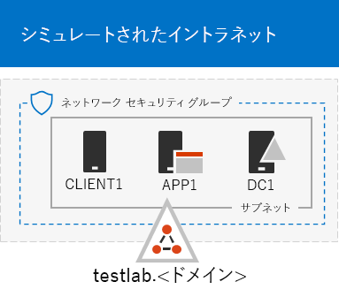
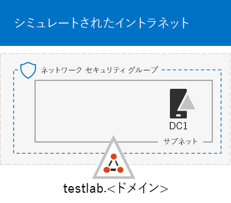
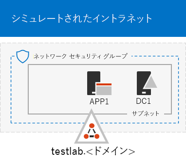

# <a name="the-simulated-enterprise-base-configuration"></a>シミュレートされたエンタープライズ基本構成

*このテスト ラボ ガイドは、エンタープライズ環境とテスト環境Microsoft 365両方Office 365 Enterprise使用できます。*

この記事では、以下を含むエンタープライズ向けMicrosoft 365環境を作成する方法について説明します。

- Microsoft 365 E5 の試用版または有料サブスクリプション。
- Azure 仮想ネットワーク上の 3 つの仮想マシン (DC1、APP1、および CLIENT1) で構成される、インターネットに接続された簡略化された組織イントラネット。
 


簡略化されたテスト環境の作成には、次の 2 つのフェーズがあります。
- [フェーズ 1: シミュレートされたイントラネットを作成する](#phase-1-create-a-simulated-intranet)
- [フェーズ 2: Microsoft 365 E5 サブスクリプションを作成する](#phase-2-create-your-microsoft-365-e5-subscription)

結果の環境を使用して、追加のテスト ラボ ガイド[を](https://www.microsoft.com/microsoft-365/enterprise)使用して、Microsoft 365の機能を[](m365-enterprise-test-lab-guides.md)テストできます。


> [!TIP]
> エンタープライズ テスト ラボ ガイド スタックの Microsoft 365 内のすべての記事への視覚的なマップについては、「Microsoft 365 テスト ラボ ガイド スタック」[を参照してください](../downloads/Microsoft365EnterpriseTLGStack.pdf)。

## <a name="phase-1-create-a-simulated-intranet"></a>フェーズ 1: シミュレートされたイントラネットを作成する

このフェーズでは、Active Directory ドメイン サービス (AD DS) ドメイン コントローラー、アプリケーション サーバー、およびクライアント コンピューターを含むシミュレートされたイントラネットを Azure インフラストラクチャ サービスに構築します。

これらのコンピューターは、エンタープライズ テスト[](m365-enterprise-test-lab-guides.md)ラボ ガイドのMicrosoft 365で使用して、ハイブリッド ID などの機能を構成およびデモンストレーションします。

### <a name="method-1-build-your-simulated-intranet-with-an-azure-resource-manager-template"></a>方法 1: Azure Resource Manager テンプレートを使用して、シミュレートされたイントラネットを構築する

このメソッドでは、Azure Resource Manager テンプレートを使用してシミュレートされたイントラネットを構築します。 Azure Resource Manager テンプレートには、Azure ネットワーク インフラストラクチャ、仮想マシン、およびそれらの構成を作成する手順すべてが含まれている。

テンプレートを展開する前に、テンプレート [の README ページ](https://github.com/maxskunkworks/TLG/tree/master/tlg-base-config_3-vm.m365-ems) を読んで、次の情報を準備してください。

- テスト環境DNS ドメイン一般ユーザー名 (testlab. \<*your public domain*> )。 この名前は、[カスタム展開] ページ **の [ドメイン名** ] **フィールドに入力** します。
- 仮想マシンのパブリック IP アドレスの URL の DNS ラベル プレフィックス。[**カスタム デプロイ**] ページの [**DNS ラベル プレフィックス**] フィールドにこのラベルを入力する必要があります。

手順を読んだら、テンプレートの [README](https://github.com/maxskunkworks/TLG/tree/master/tlg-base-config_3-vm.m365-ems)ページで **[Azure** に展開する] を選択して開始します。

>[!Note]
>Azure Resource Manager テンプレートによって構築されたシミュレートされたイントラネットには、有料の Azure サブスクリプションが必要です。

テンプレートが完了すると、構成は次のように表示されます。



### <a name="method-2-build-your-simulated-intranet-with-azure-powershell"></a>方法 2: Azure PowerShell を使用してシミュレートされたイントラネットを構築する

この方法では、Windows PowerShell と Azure PowerShell モジュールを使用してネットワーク インフラストラクチャ、仮想マシン、およびその構成を構築します。

Azure インフラストラクチャの要素を作成する作業を、PowerShell を使って 1 つずつ手順を進める方法で経験してみたいという場合は、この方法をお使いください。その後、Azure で他の仮想マシンを展開するために PowerShell コマンドのブロックをカスタマイズできます。

#### <a name="step-1-create-dc1"></a>ステップ 1: DC1 を作成する

この手順では、Azure 仮想ネットワークを作成し、DS ドメインのドメイン コントローラーである DC1 をADします。

最初に、ローカル コンピューターで Windows PowerShell コマンド プロンプトを起動します。
  
> [!NOTE]
> 次のコマンド セットは、Azure PowerShell の最新版を使用します。「[Azure の PowerShell コマンドレットを使う](/powershell/azureps-cmdlets-docs/)」を参照してください。 
  
次のコマンドを使用して Azure アカウントにログインします。
  
```powershell
Connect-AzAccount
```

次のコマンドを使用して、サブスクリプションの名前を取得します。
  
```powershell
Get-AzSubscription | Sort Name | Select Name
```

Azure サブスクリプションを設定します。 角かっこ ("<" と ">" を含む引用符内のすべてを正しい名前に置き換えてください。
  
```powershell
$subscr="<subscription name>"
Get-AzSubscription -SubscriptionName $subscr | Select-AzSubscription
```

次に、シミュレートされたエンタープライズ テスト ラボ用の新しいリソース グループを作成します。一意のリソース グループ名を決定するには、このコマンドを使用して既存のリソース グループの一覧を表示します。
  
```powershell
Get-AzResourceGroup | Sort ResourceGroupName | Select ResourceGroupName
```

これらのコマンドを使用して、新しいリソース グループを作成します。 角かっこを含む引用符内のすべてを正しい名前に置き換える。
  
```powershell
$rgName="<resource group name>"
$locName="<location name, such as West US>"
New-AzResourceGroup -Name $rgName -Location $locName
```

次に、シミュレートされたエンタープライズ環境の企業ネットワーク サブネットをホストする TestLab 仮想ネットワークを作成し、ネットワーク セキュリティ グループで保護します。 リソース グループの名前を入力し、ローカル コンピューターの PowerShell コマンド プロンプトでこれらのコマンドを実行します。
  
```powershell
$rgName="<name of your new resource group>"
$locName=(Get-AzResourceGroup -Name $rgName).Location
$corpnetSubnet=New-AzVirtualNetworkSubnetConfig -Name Corpnet -AddressPrefix 10.0.0.0/24
New-AzVirtualNetwork -Name TestLab -ResourceGroupName $rgName -Location $locName -AddressPrefix 10.0.0.0/8 -Subnet $corpnetSubnet -DNSServer 10.0.0.4
$rule1=New-AzNetworkSecurityRuleConfig -Name "RDPTraffic" -Description "Allow RDP to all VMs on the subnet" -Access Allow -Protocol Tcp -Direction Inbound -Priority 100 -SourceAddressPrefix Internet -SourcePortRange * -DestinationAddressPrefix * -DestinationPortRange 3389
New-AzNetworkSecurityGroup -Name Corpnet -ResourceGroupName $rgName -Location $locName -SecurityRules $rule1
$vnet=Get-AzVirtualNetwork -ResourceGroupName $rgName -Name TestLab
$nsg=Get-AzNetworkSecurityGroup -Name Corpnet -ResourceGroupName $rgName
Set-AzVirtualNetworkSubnetConfig -VirtualNetwork $vnet -Name Corpnet -AddressPrefix "10.0.0.0/24" -NetworkSecurityGroup $nsg
$vnet | Set-AzVirtualNetwork
```

次に、DC1 仮想マシンを作成し、Testlab 仮想ネットワークの仮想マシン用の **testlab.**\<your public domain> AD DS ドメインと DNS サーバーのドメイン コントローラーとして構成します。たとえば、パブリック ドメイン名が **<span>contoso</span>.com** の場合、DC1 仮想マシンは **<span>testlab</span>.contoso.com** ドメインのドメイン コントローラーになります。
  
DC1 用の Azure 仮想マシンを作成するには、リソース グループの名前を入力して、次に示すコマンドをローカル コンピューターの PowerShell コマンド プロンプトから実行します。
  
```powershell
$rgName="<resource group name>"
$locName=(Get-AzResourceGroup -Name $rgName).Location
$vnet=Get-AzVirtualNetwork -Name TestLab -ResourceGroupName $rgName
$pip=New-AzPublicIpAddress -Name DC1-PIP -ResourceGroupName $rgName -Location $locName -AllocationMethod Dynamic
$nic=New-AzNetworkInterface -Name DC1-NIC -ResourceGroupName $rgName -Location $locName -SubnetId $vnet.Subnets[0].Id -PublicIpAddressId $pip.Id -PrivateIpAddress 10.0.0.4
$vm=New-AzVMConfig -VMName DC1 -VMSize Standard_A2_V2
$cred=Get-Credential -Message "Type the name and password of the local administrator account for DC1."
$vm=Set-AzVMOperatingSystem -VM $vm -Windows -ComputerName DC1 -Credential $cred -ProvisionVMAgent -EnableAutoUpdate
$vm=Set-AzVMSourceImage -VM $vm -PublisherName MicrosoftWindowsServer -Offer WindowsServer -Skus 2016-Datacenter -Version "latest"
$vm=Add-AzVMNetworkInterface -VM $vm -Id $nic.Id
$vm=Set-AzVMOSDisk -VM $vm -Name "DC1-OS" -DiskSizeInGB 128 -CreateOption FromImage
$diskConfig=New-AzDiskConfig -AccountType "Standard_LRS" -Location $locName -CreateOption Empty -DiskSizeGB 20
$dataDisk1=New-AzDisk -DiskName "DC1-DataDisk1" -Disk $diskConfig -ResourceGroupName $rgName
$vm=Add-AzVMDataDisk -VM $vm -Name "DC1-DataDisk1" -CreateOption Attach -ManagedDiskId $dataDisk1.Id -Lun 1
New-AzVM -ResourceGroupName $rgName -Location $locName -VM $vm
```

DC1 のローカル管理者アカウントのユーザー名とパスワードを入力するようダイアログが表示されます。強力なパスワードを使用して、安全な場所に名前とパスワードの両方を記録します。
  
次に、DC1 仮想マシンに接続します。
  
1. Azure portal [で、[リソース](https://portal.azure.com)グループ] を **選択 > <新** しいリソース グループ ***の名前 _> > _* DC1 Connect。**  >  
    
2. 開いているウィンドウで、[RDP ファイルのダウンロード **] を選択します**。 ダウンロードされた DC1.rdp ファイルを開き、[ファイル] を **Connect。**
    
3. DC1 のローカル管理者アカウント名を指定します。
    
   - Windows 7 の場合:
    
     [別の **アカウントWindows セキュリティ]** ダイアログ ボックスで、[別のアカウント **を使用する] を選択します**。 [**ユーザー名] に****、「DC1 \\** ローカル管理者アカウント名」と < *入力>。*
    
   - Windows 8 または Windows 10 の場合:
    
     [別の **Windows セキュリティ]** ダイアログ ボックスで、[その他の選択肢]**を選択し**、[別のアカウントを使用 **する] を選択します**。 [**ユーザー名] に****、「DC1 \\** ローカル管理者アカウント名」と < *入力>。*
    
4. [ **パスワード]** で、ローカル管理者アカウントのパスワードを入力し **、[OK] を選択します**。
    
5. プロンプトが表示されたら、[はい] **を選択します**。
    
次に、DC1 の管理者レベルの Windows PowerShell コマンド プロンプトで次のコマンドを使用して、新しいボリュームとして別のデータ ディスク (ドライブ文字 F:) を追加します。
  
```powershell
Get-Disk | Where PartitionStyle -eq "RAW" | Initialize-Disk -PartitionStyle MBR -PassThru | New-Partition -AssignDriveLetter -UseMaximumSize | Format-Volume -FileSystem NTFS -NewFileSystemLabel "WSAD Data"
```

次に **testlab.**\<*your public domain*> ドメインのドメイン コントローラーおよび DNS サーバーとして DC1 を構成します。 パブリック ドメイン名を指定し、角かっこを削除してから、DC1 の管理者レベルのコマンド プロンプトでWindows PowerShell実行します。
  
```powershell
$yourDomain="<your public domain>"
Install-WindowsFeature AD-Domain-Services -IncludeManagementTools
Install-ADDSForest -DomainName testlab.$yourDomain -DatabasePath "F:\NTDS" -SysvolPath "F:\SYSVOL" -LogPath "F:\Logs"
```
セーフ モードの管理者パスワードを指定する必要があります。このパスワードは安全な場所に保管してください。
  
これらのコマンドの完了には数分かかることがあります。
  
DC1 の再起動後に、DC1 仮想マシンに再接続します。
  
1. Azure portal [で、[リソース](https://portal.azure.com)グループ]を **選択 > <** DC1 のリソース グループ> > **をConnect。**  >  
    
2. ダウンロードした DC1.rdp ファイルを実行し、[ファイル] を選択 **Connect。**
    
3. [アカウント **Windows セキュリティ]** で、[別の **アカウントを使用する] を選択します**。 [**ユーザー名] に****、「TESTLAB \\** ローカル管理者アカウント < *名」と入力>。*
    
4. [パスワード **] ボックス** に、ローカル管理者アカウントのパスワードを入力し **、[OK] を選択します**。
    
5. プロンプトが表示されたら、[はい] **を選択します**。
    
次に、TESTLAB ドメイン メンバー コンピューターにサインインするときに使用するユーザー アカウントを Active Directory に作成します。 管理者レベルの Windows PowerShell コマンド プロンプトで、次のコマンドを実行します。
  
```powershell
New-ADUser -SamAccountName User1 -AccountPassword (read-host "Set user password" -assecurestring) -name "User1" -enabled $true -PasswordNeverExpires $true -ChangePasswordAtLogon $false
```

このコマンドでは、User1 アカウントのパスワードを入力するよう求められることに注意してください。 このアカウントは、すべての TESTLAB ドメイン メンバー コンピューターのリモート デスクトップ接続に使用されます。そのため、強力なパスワードを選択します。 User1 アカウントのパスワードを記録し、セキュリティで保護された場所に保管します。
  
次に、ドメイン、エンタープライズ、およびスキーマ管理者として新しい User1 のアカウントを構成します。管理者レベルの Windows PowerShell コマンド プロンプトで、次のコマンドを実行します。
  
```powershell
$yourDomain="<your public domain>"
$domainName = "testlab."+$yourDomain
$userName="user1@" + $domainName
$userSID=(New-Object System.Security.Principal.NTAccount($userName)).Translate([System.Security.Principal.SecurityIdentifier]).Value
$groupNames=@("Domain Admins","Enterprise Admins","Schema Admins")
ForEach ($name in $groupNames) {Add-ADPrincipalGroupMembership -Identity $userSID -MemberOf (Get-ADGroup -Identity $name).SID.Value}
```

DC1 とのリモート デスクトップ セッションを終了し、TESTLAB\\User1 のアカウントを使用して再接続します。
  
次に、Ping ツールのトラフィックを許可するため、管理者レベルの Windows PowerShell コマンド プロンプトで、次のコマンドを実行します。
  
```powershell
Set-NetFirewallRule -DisplayName "File and Printer Sharing (Echo Request - ICMPv4-In)" -enabled True
```

現在の構成は次のように表示されます。
  

  
#### <a name="step-2-configure-app1"></a>ステップ 2: APP1 を構成する

このステップでは、最初にWeb およびファイル共有サービスを提供するアプリケーション サーバーである APP1 を作成して構成します。

APP1 用の Azure 仮想マシンを作成するには、リソース グループの名前を入力して、次に示すコマンドをローカル コンピューターのコマンド プロンプトから実行します。
  
```powershell
$rgName="<resource group name>"
$locName=(Get-AzResourceGroup -Name $rgName).Location
$vnet=Get-AzVirtualNetwork -Name TestLab -ResourceGroupName $rgName
$pip=New-AzPublicIpAddress -Name APP1-PIP -ResourceGroupName $rgName -Location $locName -AllocationMethod Dynamic
$nic=New-AzNetworkInterface -Name APP1-NIC -ResourceGroupName $rgName -Location $locName -SubnetId $vnet.Subnets[0].Id -PublicIpAddressId $pip.Id
$vm=New-AzVMConfig -VMName APP1 -VMSize Standard_A2_V2
$cred=Get-Credential -Message "Type the name and password of the local administrator account for APP1."
$vm=Set-AzVMOperatingSystem -VM $vm -Windows -ComputerName APP1 -Credential $cred -ProvisionVMAgent -EnableAutoUpdate
$vm=Set-AzVMSourceImage -VM $vm -PublisherName MicrosoftWindowsServer -Offer WindowsServer -Skus 2016-Datacenter -Version "latest"
$vm=Add-AzVMNetworkInterface -VM $vm -Id $nic.Id
$vm=Set-AzVMOSDisk -VM $vm -Name "APP1-OS" -DiskSizeInGB 128 -CreateOption FromImage
New-AzVM -ResourceGroupName $rgName -Location $locName -VM $vm
```

次に、APP1 のローカル管理者アカウント名とパスワードを使用して APP1 仮想マシンに接続し、Windows PowerShell コマンド プロンプトを開きます。
  
APP1 と DC1 間の名前解決とネットワーク通信を確認するには、**ping dc1.testlab.**\<*your public domain name*> コマンドを実行し、返信が 4 つあることを確認します。
  
次に、Windows PowerShell プロンプトでこれらのコマンドを使用して、APP1 仮想マシンを TESTLAB ドメインに参加させます。
  
```powershell
$yourDomain="<your public domain name>"
Add-Computer -DomainName ("testlab." + $yourDomain)
Restart-Computer
```

**Add-Computer** コマンドを実行した後で、TESTLAB User1 ドメイン アカウント資格情報 \\ を指定する必要があります。
  
APP1 の再起動後に、TESTLAB\\User1 のアカウントを使用して接続し、管理者レベルの Windows PowerShell コマンド プロンプトを開きます。
  
次に、このコマンドを APP1 の管理者レベルの Windows PowerShell コマンド プロンプトで使用して、APP1 を Web サーバーにします。
  
```powershell
Install-WindowsFeature Web-WebServer -IncludeManagementTools
```

次に、以下の PowerShell コマンドを使用して APP1 で共有フォルダーを作成し、そのフォルダー内にテキスト ファイルを作成します。
  
```powershell
New-Item -path c:\files -type directory
Write-Output "This is a shared file." | out-file c:\files\example.txt
New-SmbShare -name files -path c:\files -changeaccess TESTLAB\User1
```

現在の構成は次のように表示されます。
  

  
#### <a name="step-3-configure-client1"></a>ステップ 3: CLIENT1 を構成する

このステップでは、イントラネット上の一般的なラップトップ、タブレット、またはデスクトップ コンピューターとして機能する CLIENT1 を作成して構成します。

> [!NOTE]  
> 次のコマンド セットでは、Windows Server 2016 Datacenter を実行する CLIENT1 を作成します。これは、すべての Azure サブスクリプションのタイプに対して実行できます。Visual Studio ベースの Azure サブスクリプションがある場合は、[Azure portal](https://portal.azure.com) で、Windows 10 を実行する CLIENT1 を作成できます。
  
CLIENT1 用の Azure Virtual Machine を作成するには、リソース グループの名前を入力し、ローカル コンピューターのコマンド プロンプトでこれらのコマンドを実行します。
  
```powershell
$rgName="<resource group name>"
$locName=(Get-AzResourceGroup -Name $rgName).Location
$vnet=Get-AzVirtualNetwork -Name TestLab -ResourceGroupName $rgName
$pip=New-AzPublicIpAddress -Name CLIENT1-PIP -ResourceGroupName $rgName -Location $locName -AllocationMethod Dynamic
$nic=New-AzNetworkInterface -Name CLIENT1-NIC -ResourceGroupName $rgName -Location $locName -SubnetId $vnet.Subnets[0].Id -PublicIpAddressId $pip.Id
$vm=New-AzVMConfig -VMName CLIENT1 -VMSize Standard_A2_V2
$cred=Get-Credential -Message "Type the name and password of the local administrator account for CLIENT1."
$vm=Set-AzVMOperatingSystem -VM $vm -Windows -ComputerName CLIENT1 -Credential $cred -ProvisionVMAgent -EnableAutoUpdate
$vm=Set-AzVMSourceImage -VM $vm -PublisherName MicrosoftWindowsServer -Offer WindowsServer -Skus 2016-Datacenter -Version "latest"
$vm=Add-AzVMNetworkInterface -VM $vm -Id $nic.Id
$vm=Set-AzVMOSDisk -VM $vm -Name "CLIENT1-OS" -DiskSizeInGB 128 -CreateOption FromImage
New-AzVM -ResourceGroupName $rgName -Location $locName -VM $vm
```

次に、CLIENT1 のローカル管理者アカウント名とパスワードを使用して、CLIENT1 仮想マシンに接続し、管理者レベルの Windows PowerShell コマンド プロンプトを開きます。
  
CLIENT1 と DC1 間の名前解決とネットワーク通信を確認するには、**ping dc1.testlab.**\<*your public domain name*> コマンドを Windows PowerShell コマンド プロンプトで実行し、返信が 4 つあることを確認します。
  
次に、Windows PowerShell プロンプトでこれらのコマンドを使用して、CLIENT1 仮想マシンを TESTLAB ドメインに参加させます。
  
```powershell
$yourDomain="<your public domain name>"
Add-Computer -DomainName ("testlab." + $yourDomain)
Restart-Computer
```

**Add-Computer** コマンドの実行後に、TESTLAB\\User1 ドメイン アカウントの資格情報を入力する必要がある点に注意してください。
  
CLIENT1 の再起動後に、TESTLAB\\User1 のアカウント名とパスワードを使用して接続し、管理者レベルの Windows PowerShell コマンド プロンプトを開きます。
  
次に、CLIENT1 から APP1 の Web リソースおよびファイル共有リソースにアクセスできることを確認します。
  
1. サーバー マネージャーのツリー ウィンドウで、[ローカル サーバー] **を選択します**。
    
2. [ **クライアント 1 のプロパティ] で**、[IE **拡張** セキュリティ構成] の横にある **[オン] を選択します**。
    
3. [**セキュリティInternet Explorer構成] で**、[管理者とユーザー]で[**オフ**] を選択し **、[OK] を選択します**。
    
4. [スタート] 画面で、[設定] **をInternet Explorer** し **、[OK] を選択します**。
    
5. アドレス バーに http **<span>://</span>app1.testab と入力** し \<*your public domain name*> **/** **、Enter** キーを押します。 APP1 の既定のインターネット インフォメーション サービスの Web ページが表示されます。
    
6. デスクトップ タスク バーで、[エクスプローラー] アイコンを選択します。
    
7. アドレス バーに **\\ \\ app1 \\ Files** と入力し **、Enter** キーを押します。 フォルダー ウィンドウにファイルの共有フォルダーのコンテンツが表示されます。
    
8. **[ファイル]** の共有フォルダー ウィンドウで、**[Example.txt]** ファイルをダブルクリックします。Example.txt ファイルのコンテンツが表示されます。
    
9. **[example.txt - メモ帳]** と **[ファイル]** の共有フォルダーのウィンドウを閉じます。
    
現在の構成は次のように表示されます。
  


## <a name="phase-2-create-your-microsoft-365-e5-subscription"></a>フェーズ 2: Microsoft 365 E5 サブスクリプションを作成する

このフェーズでは、新しい Azure AD テナントを使用する Microsoft 365 E5 サブスクリプション (運用サブスクリプションとは別のもの) を作成します。これは、次の 2 つの方法で作成できます。

- Microsoft 365 E5 の試用版サブスクリプションを使用する。

  Microsoft 365 E5 の試用版サブスクリプションは 30 日間有効です。この有効期間は、簡単に 60 日間延長できます。試用版サブスクリプションの有効期限が切れたときには、有料版のサブスクリプションに切り替えるか、新しい試用版サブスクリプションを作成する必要があります。新しい試用版サブスクリプションを作成すると、複雑なシナリオが含まれていることもある構成を放置することになります。  

- ライセンス数の少ない Microsoft 365 E5 の個別の運用サブスクリプションを使用する。

  これは追加のコストですが、有効期限が切れない作業テスト環境が確保されます。その中で、機能、構成、シナリオを試してみてください。 概念実証、ピアと管理へのデモンストレーション、アプリケーションの開発とテストには、長期的に同じテスト環境を使用できます。 これは推奨される方法です。

### <a name="sign-up-for-an-office-365-e5-trial-subscription"></a>Office 365 E5 試用版サブスクリプションにサインアップする

Azure portal から、CORP\User1 アカウントを使用して CLIENT1 に接続します。

新しい Office 365 E5 試用版のサブスクリプションを作成するには、「軽量な基本構成」のテスト ラボ ガイドの [フェーズ 1](lightweight-base-configuration-microsoft-365-enterprise.md#phase-1-create-your-microsoft-365-e5-subscription) にある手順を実行します。

新しい Office 365 E5 試用版のサブスクリプションを構成するには、「軽量な基本構成」のテスト ラボ ガイドの [フェーズ 2](lightweight-base-configuration-microsoft-365-enterprise.md#phase-2-configure-your-office-365-trial-subscription) にある手順を実行します。

#### <a name="using-an-office-365-e5-test-environment"></a>Office 365 E5 のテスト環境を使用する

テスト環境のOffice 365場合は、この記事の残りの部分を読む必要があります。

テスト ラボ ガイドとテスト ラボ ガイドの両方に適用Microsoft 365 Office 365、エンタープライズ テスト ラボ ガイドのMicrosoft 365[を参照してください](m365-enterprise-test-lab-guides.md)。

### <a name="add-a-microsoft-365-e5-trial-subscription"></a>Microsoft 365 E5 の試用版サブスクリプションを追加する

試用版サブスクリプションMicrosoft 365 E5し、ライセンスを使用してユーザー アカウントを構成するには、「軽量基本構成テスト ラボ ガイド」のフェーズ[3](lightweight-base-configuration-microsoft-365-enterprise.md#phase-3-add-a-microsoft-365-e5-trial-subscription)の手順を実行します。

  
## <a name="results"></a>結果

テスト環境は、次のようになっています。
  
- Microsoft 365 E5 の試用版サブスクリプション。
- すべての適切なユーザー アカウントが Microsoft 365 E5 を使用できるようになります。
- シミュレートおよび簡略化されたイントラネット。
    
最終的な構成は次のように表示されます。
  

  
これで、エンタープライズ向けアプリケーションの追加機能をMicrosoft 365[準備ができました](https://www.microsoft.com/microsoft-365/enterprise)。
  
## <a name="next-steps"></a>次の手順

こうした追加のテスト ラボ ガイドについて説明します。
  
- [ID](m365-enterprise-test-lab-guides.md#identity)
- [モバイル デバイス管理](m365-enterprise-test-lab-guides.md#mobile-device-management)
- [情報保護](m365-enterprise-test-lab-guides.md#information-protection)

## <a name="see-also"></a>関連項目

[Microsoft 365 Enterprise のテスト ラボ ガイド](m365-enterprise-test-lab-guides.md)

[Microsoft 365 for Enterprise の概要](microsoft-365-overview.md)

[Microsoft 365 for enterprise のドキュメント](/microsoft-365-enterprise/)