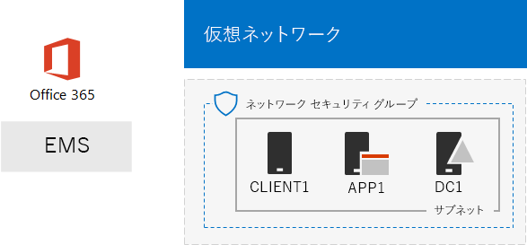
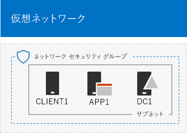
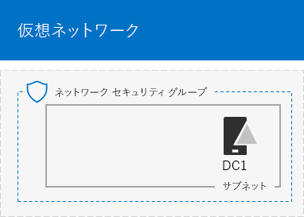
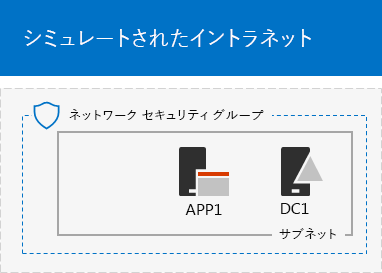

# <a name="the-simulated-enterprise-base-configuration"></a>シミュレートされたエンタープライズ基本構成

この記事では、次のものを含む Microsoft 365 Enterprise のシンプルな環境を作成するための詳しい手順について説明します。

- Office 365 E5 および EMS E5 試用版サブスクリプションまたは永続サブスクリプション。
- インターネットに接続している組織の簡易型イントラネット。Azure 仮想ネットワーク上に配置された 3 つの仮想マシン (DC1、APP1、および CLIENT1) で構成されます。
 


完成した環境は、その他の [テスト ラボ ガイド](m365-enterprise-test-lab-guides.md)や各自の実験で、[Microsoft 365 Enterprise](https://www.microsoft.com/microsoft-365/enterprise) の機能をテストするために使用できます。


> [!TIP]
> [ここ](https://aka.ms/m365etlgstack)をクリックして、Microsoft 365 Enterprise のテスト ラボ ガイド スタックに含まれるすべての記事のビジュアル マップを確認してください。

## <a name="phase-1-create-a-simulated-intranet"></a>フェーズ 1: シミュレートされたイントラネットを作成する

このフェーズでは、Windows Server Active Directory ドメイン コントローラー、アプリケーション サーバー、およびクライアント コンピューターを含むシミュレートされたイントラネットを Azure インフラストラクチャ サービスに作成します。 

こうしたコンピューターは、他の [Microsoft 365 Enterprise のテスト ラボ ガイド](m365-enterprise-test-lab-guides.md)でハイブリッド ID およびその他の機能の構成とデモンストレーションのために使用します。

### <a name="method-1-build-your-simulated-intranet-with-an-azure-resource-manager-template"></a>方法 1: Azure Resource Manager テンプレートを使用して、シミュレートされたイントラネットを構築する

この方法では、Azure Resource Manager (ARM) テンプレートを使用してシミュレートされたイントラネットを構築します。ARM テンプレートには、Azure ネットワーク インフラストラクチャおよび仮想マシンを作成するためのすべての手順およびそれらの構成が含まれています。

テンプレートを展開する前に「[テンプレートのReadme ページ](https://github.com/maxskunkworks/TLG/tree/master/tlg-base-config_3-vm.m365-ems)」を確認し、次の情報をご用意ください。

- テスト環境のパブリック DNS ドメイン名 (testlab.\<your public domain>)。[**カスタム デプロイ**] ページの [**ドメイン名**] フィールドにこの名前を入力する必要があります。
- 仮想マシンのパブリック IP アドレスの URL の DNS ラベル プレフィックス。[**カスタム デプロイ**] ページの [**DNS ラベル プレフィックス**] フィールドにこのラベルを入力する必要があります。

手順をすべて確認したら、[[テンプレートの Readme ページ](https://github.com/maxskunkworks/TLG/tree/master/tlg-base-config_3-vm.m365-ems)] で [**Azure に展開**] をクリックして展開を開始します。

>[!Note]
>ARM テンプレートで作成されたシミュレートされたイントラネットでは、Azure の有料サブスクリプションが必要です。
>

こちらがテンプレート完了後の構成です。



### <a name="method-2-build-your-simulated-intranet-with-azure-powershell"></a>方法 2: Azure PowerShell を使用してシミュレートされたイントラネットを構築する

この方法では、Windows PowerShell と Azure PowerShell モジュールを使用してネットワーク インフラストラクチャ、仮想マシン、およびその構成を構築します。

Azure インフラストラクチャの要素を作成する作業を、PowerShell を使って 1 つずつ手順を進める方法で経験してみたいという場合は、この方法をお使いください。その後、Azure で他の仮想マシンを展開するために PowerShell コマンドのブロックをカスタマイズできます。

#### <a name="step-1-create-dc1"></a>ステップ 1: DC1 を作成する

このステップでは、Azure 仮想ネットワークを作成し、DC1 (Windows Server Active Directory (AD) ドメインのドメイン コントローラーである仮想マシン) を追加します。

最初に、ローカル コンピューターで Windows PowerShell コマンド プロンプトを起動します。
  
> [!NOTE]
> 次のコマンド セットは、Azure PowerShell の最新版を使用します。「[Azure の PowerShell コマンドレットを使う](https://docs.microsoft.com/powershell/azureps-cmdlets-docs/)」を参照してください。 
  
次のコマンドを使用して Azure アカウントにログインします。
  
```
Login-AzureRMAccount
```

次のコマンドを使用して、サブスクリプションの名前を取得します。
  
```
Get-AzureRMSubscription | Sort Name | Select Name
```

Azure サブスクリプションを設定します。二重引用符内のすべて (「<」と「>」の文字を含む) を正しい名前に置き換えます。
  
```
$subscr="<subscription name>"
Get-AzureRmSubscription -SubscriptionName $subscr | Select-AzureRmSubscription
```

次に、シミュレートされたエンタープライズ テスト ラボ用の新しいリソース グループを作成します。一意のリソース グループ名を決定するには、このコマンドを使用して既存のリソース グループの一覧を表示します。
  
```
Get-AzureRMResourceGroup | Sort ResourceGroupName | Select ResourceGroupName
```

これらのコマンドを使用して、新しいリソース グループを作成します。二重引用符内のすべて (< 文字と > 文字を含む) を正しい名前に置き換えます。
  
```
$rgName="<resource group name>"
$locName="<location name, such as West US>"
New-AzureRMResourceGroup -Name $rgName -Location $locName
```

次に、シミュレートされたエンタープライズ環境の Corpnet サブネットをホストする TestLab 仮想ネットワークを作成し、ネットワーク セキュリティ グループで保護します。リソース グループの名前を入力し、これらのコマンドをローカル コンピューターの PowerShell コマンド プロンプトで実行します。
  
```
$rgName="<name of your new resource group>"
$locName=(Get-AzureRmResourceGroup -Name $rgName).Location
$corpnetSubnet=New-AzureRMVirtualNetworkSubnetConfig -Name Corpnet -AddressPrefix 10.0.0.0/24
New-AzureRMVirtualNetwork -Name TestLab -ResourceGroupName $rgName -Location $locName -AddressPrefix 10.0.0.0/8 -Subnet $corpnetSubnet -DNSServer 10.0.0.4
$rule1=New-AzureRMNetworkSecurityRuleConfig -Name "RDPTraffic" -Description "Allow RDP to all VMs on the subnet" -Access Allow -Protocol Tcp -Direction Inbound -Priority 100 -SourceAddressPrefix Internet -SourcePortRange * -DestinationAddressPrefix * -DestinationPortRange 3389
New-AzureRMNetworkSecurityGroup -Name Corpnet -ResourceGroupName $rgName -Location $locName -SecurityRules $rule1
$vnet=Get-AzureRMVirtualNetwork -ResourceGroupName $rgName -Name TestLab
$nsg=Get-AzureRMNetworkSecurityGroup -Name Corpnet -ResourceGroupName $rgName
Set-AzureRMVirtualNetworkSubnetConfig -VirtualNetwork $vnet -Name Corpnet -AddressPrefix "10.0.0.0/24" -NetworkSecurityGroup $nsg
```

次に、DC1 仮想マシンを作成し、Testlab 仮想ネットワークの仮想マシン用の **testlab.**\<パブリック ドメイン> Windows Server AD ドメインと DNS サーバーのドメイン コントローラーとして構成します。たとえば、パブリック ドメイン名が **<span>contoso</span>.com** の場合、DC1 仮想マシンは **<span>testlab</span>.contoso.com** ドメインのドメイン コントローラーになります。
  
DC1 用の Azure 仮想マシンを作成するには、リソース グループの名前を入力して、次に示すコマンドをローカル コンピューターの PowerShell コマンド プロンプトから実行します。
  
```
$rgName="<resource group name>"
$locName=(Get-AzureRmResourceGroup -Name $rgName).Location
$vnet=Get-AzureRMVirtualNetwork -Name TestLab -ResourceGroupName $rgName
$pip=New-AzureRMPublicIpAddress -Name DC1-PIP -ResourceGroupName $rgName -Location $locName -AllocationMethod Dynamic
$nic=New-AzureRMNetworkInterface -Name DC1-NIC -ResourceGroupName $rgName -Location $locName -SubnetId $vnet.Subnets[0].Id -PublicIpAddressId $pip.Id -PrivateIpAddress 10.0.0.4
$vm=New-AzureRMVMConfig -VMName DC1 -VMSize Standard_A1
$cred=Get-Credential -Message "Type the name and password of the local administrator account for DC1."
$vm=Set-AzureRMVMOperatingSystem -VM $vm -Windows -ComputerName DC1 -Credential $cred -ProvisionVMAgent -EnableAutoUpdate
$vm=Set-AzureRMVMSourceImage -VM $vm -PublisherName MicrosoftWindowsServer -Offer WindowsServer -Skus 2016-Datacenter -Version "latest"
$vm=Add-AzureRMVMNetworkInterface -VM $vm -Id $nic.Id
$vm=Set-AzureRmVMOSDisk -VM $vm -Name "DC1-OS" -DiskSizeInGB 128 -CreateOption FromImage -StorageAccountType "Standard_LRS"
$diskConfig=New-AzureRmDiskConfig -AccountType "Standard_LRS" -Location $locName -CreateOption Empty -DiskSizeGB 20
$dataDisk1=New-AzureRmDisk -DiskName "DC1-DataDisk1" -Disk $diskConfig -ResourceGroupName $rgName
$vm=Add-AzureRmVMDataDisk -VM $vm -Name "DC1-DataDisk1" -CreateOption Attach -ManagedDiskId $dataDisk1.Id -Lun 1
New-AzureRMVM -ResourceGroupName $rgName -Location $locName -VM $vm
```

DC1 のローカル管理者アカウントのユーザー名とパスワードを入力するようダイアログが表示されます。強力なパスワードを使用して、安全な場所に名前とパスワードの両方を記録します。
  
次に、DC1 仮想マシンに接続します。
  
1. [Azure portal](https://portal.azure.com) で、**[リソース グループ] > **「新しいリソース グループの名前」** > [DC1] > [接続]** の順にクリックします。
    
2. 起動ウィンドウで **[RDP ファイルのダウンロード]** をクリックします。ダウンロードされる DC1.rdp ファイルを開いてから、**[接続]** をクリックします。
    
3. DC1 のローカル管理者アカウント名を指定します。
    
   - Windows 7 の場合:
    
     **[Windows セキュリティ]** ダイアログ ボックスで、**[別のアカウントを使用]** をクリックします。**[ユーザー名]** に「**DC1\\**[ローカル管理者アカウント名]」を入力します。
    
   - Windows 8 または Windows 10 の場合:
    
     **[Windows セキュリティ]** ダイアログ ボックスで、**[その他]** をクリックし、**[別のアカウントを使用する]** をクリックします。**[ユーザー名]** に、「**DC1\\**[ローカル管理者アカウント名]」を入力します。
    
4. **[パスワード]** にローカル管理者アカウントのパスワードを入力して、**[OK]** をクリックします。
    
5. ダイアログが表示されたら、**[はい]** をクリックします。
    
次に、DC1 の管理者レベルの Windows PowerShell コマンド プロンプトで次のコマンドを使用して、新しいボリュームとして別のデータ ディスク (ドライブ文字 F:) を追加します。
  
```
Get-Disk | Where PartitionStyle -eq "RAW" | Initialize-Disk -PartitionStyle MBR -PassThru | New-Partition -AssignDriveLetter -UseMaximumSize | Format-Volume -FileSystem NTFS -NewFileSystemLabel "WSAD Data"
```

次に、DC1 を **testlab.**\<パブリック ドメイン> ドメインのドメイン コントローラーと DNS サーバーとして構成します。パブリック ドメイン名を指定し、\< および > 文字を削除します。DC1 の管理者レベルの Windows PowerShell コマンド プロンプトで、これらのコマンドを実行します。
  
```
$yourDomain="<your public domain>"
Install-WindowsFeature AD-Domain-Services -IncludeManagementTools
Install-ADDSForest -DomainName testlab.$yourDomain -DatabasePath "F:\NTDS" -SysvolPath "F:\SYSVOL" -LogPath "F:\Logs"
```
セーフ モードの管理者パスワードを指定する必要があります。このパスワードは安全な場所に保管してください。
  
これらのコマンドの完了には数分かかることがあります。
  
DC1 の再起動後に、DC1 仮想マシンに再接続します。
  
1. [Azure portal](https://portal.azure.com) で、**[リソース グループ] > **「リソース グループ名」** > [DC1] > [接続]** をクリックします。
    
2. ダウンロードされる DC1.rdp ファイルを実行して、**[接続]** をクリックします。
    
3. **[Windows セキュリティ]** で **[別のアカウントを使用]** をクリックします。**[ユーザー名]** に「**TESTLAB\\**[ローカル管理者アカウント名]」を入力します。
    
4. **[パスワード]** にローカル管理者アカウントのパスワードを入力して、**[OK]** をクリックします。
    
5. ダイアログが表示されたら、**[はい]** をクリックします。
    
次に、TESTLAB ドメイン メンバー コンピューターにログインするときに使用する、Active Directory のユーザー アカウントを作成します。管理者レベルの Windows PowerShell コマンド プロンプトで、次のコマンドを実行します。
  
```
New-ADUser -SamAccountName User1 -AccountPassword (read-host "Set user password" -assecurestring) -name "User1" -enabled $true -PasswordNeverExpires $true -ChangePasswordAtLogon $false
```

このコマンドでは、User1 アカウントのパスワードを入力するよう求められることに注意してください。このアカウントは、すべての TESTLAB ドメイン メンバー コンピューターのリモート デスクトップ接続に使用するため、強力なパスワードを選択してください。User1 アカウントのパスワードを記録し、セキュリティで保護された場所に保管します。
  
次に、ドメイン、エンタープライズ、およびスキーマ管理者として新しい User1 のアカウントを構成します。管理者レベルの Windows PowerShell コマンド プロンプトで、次のコマンドを実行します。
  
```
$yourDomain="<your public domain>"
$domainName = "testlab"+$yourDomain
$userName="user1@" + $domainName
$userSID=(New-Object System.Security.Principal.NTAccount($userName)).Translate([System.Security.Principal.SecurityIdentifier]).Value
$groupNames=@("Domain Admins","Enterprise Admins","Schema Admins")
ForEach ($name in $groupNames) {Add-ADPrincipalGroupMembership -Identity $userSID -MemberOf (Get-ADGroup -Identity $name).SID.Value}
```

DC1 とのリモート デスクトップ セッションを終了し、TESTLAB\\User1 のアカウントを使用して再接続します。
  
次に、Ping ツールのトラフィックを許可するため、管理者レベルの Windows PowerShell コマンド プロンプトで、次のコマンドを実行します。
  
```
Set-NetFirewallRule -DisplayName "File and Printer Sharing (Echo Request - ICMPv4-In)" -enabled True
```

こちらが現在の構成です。
  

  
#### <a name="step-2-configure-app1"></a>ステップ 2: APP1 を構成する

このステップでは、最初にWeb およびファイル共有サービスを提供するアプリケーション サーバーである APP1 を作成して構成します。

APP1 用の Azure 仮想マシンを作成するには、リソース グループの名前を入力して、次に示すコマンドをローカル コンピューターのコマンド プロンプトから実行します。
  
```
$rgName="<resource group name>"
$locName=(Get-AzureRmResourceGroup -Name $rgName).Location
$vnet=Get-AzureRMVirtualNetwork -Name TestLab -ResourceGroupName $rgName
$pip=New-AzureRMPublicIpAddress -Name APP1-PIP -ResourceGroupName $rgName -Location $locName -AllocationMethod Dynamic
$nic=New-AzureRMNetworkInterface -Name APP1-NIC -ResourceGroupName $rgName -Location $locName -SubnetId $vnet.Subnets[0].Id -PublicIpAddressId $pip.Id
$vm=New-AzureRMVMConfig -VMName APP1 -VMSize Standard_A1
$cred=Get-Credential -Message "Type the name and password of the local administrator account for APP1."
$vm=Set-AzureRMVMOperatingSystem -VM $vm -Windows -ComputerName APP1 -Credential $cred -ProvisionVMAgent -EnableAutoUpdate
$vm=Set-AzureRMVMSourceImage -VM $vm -PublisherName MicrosoftWindowsServer -Offer WindowsServer -Skus 2016-Datacenter -Version "latest"
$vm=Add-AzureRMVMNetworkInterface -VM $vm -Id $nic.Id
$vm=Set-AzureRmVMOSDisk -VM $vm -Name "APP1-OS" -DiskSizeInGB 128 -CreateOption FromImage -StorageAccountType "Standard_LRS"
New-AzureRMVM -ResourceGroupName $rgName -Location $locName -VM $vm
```

次に、APP1 のローカル管理者アカウント名とパスワードを使用して APP1 仮想マシンに接続し、Windows PowerShell コマンド プロンプトを開きます。
  
APP1 と DC1 の間の名前の解決とネットワーク通信を確認するには、**ping dc1.testlab.**\<パブリック ドメイン名> コマンドを実行し、4 つの応答があることを確認します。
  
次に、Windows PowerShell プロンプトでこれらのコマンドを使用して、APP1 仮想マシンを TESTLAB ドメインに参加させます。
  
```
$yourDomain="<your public domain name>"
Add-Computer -DomainName ("testlab" + $yourDomain)
Restart-Computer
```

**Add-Computer** コマンドの実行後には、TESTLAB\\User1 ドメイン アカウントの資格情報を入力する必要がある点に注意してください。
  
APP1 の再起動後に、TESTLAB\\User1 のアカウントを使用して接続し、管理者レベルの Windows PowerShell コマンド プロンプトを開きます。
  
次に、このコマンドを APP1 の管理者レベルの Windows PowerShell コマンド プロンプトで使用して、APP1 を Web サーバーにします。
  
```
Install-WindowsFeature Web-WebServer -IncludeManagementTools
```

次に、以下の PowerShell コマンドを使用して APP1 で共有フォルダーを作成し、そのフォルダー内にテキスト ファイルを作成します。
  
```
New-Item -path c:\files -type directory
Write-Output "This is a shared file." | out-file c:\files\example.txt
New-SmbShare -name files -path c:\files -changeaccess TESTLAB\User1
```

こちらが現在の構成です。
  

  
#### <a name="step-3-configure-client1"></a>ステップ 3: CLIENT1 を構成する

このステップでは、イントラネット上の一般的なラップトップ、タブレット、またはデスクトップ コンピューターとして機能する CLIENT1 を作成して構成します。

> [!NOTE]  
> 次のコマンド セットでは、Windows Server 2016 Datacenter を実行する CLIENT1 を作成します。これは、すべての Azure サブスクリプションのタイプに対して実行できます。Visual Studio ベースの Azure サブスクリプションがある場合は、[Azure portal](https://portal.azure.com) で、Windows 10 を実行する CLIENT1 を作成できます。 
  
CLIENT1 用の Azure 仮想マシンを作成するには、リソース グループの名前を入力して、次に示すコマンドをローカル コンピューターのコマンド プロンプトから実行します。
  
```
$rgName="<resource group name>"
$locName=(Get-AzureRmResourceGroup -Name $rgName).Location
$vnet=Get-AzureRMVirtualNetwork -Name TestLab -ResourceGroupName $rgName
$pip=New-AzureRMPublicIpAddress -Name CLIENT1-PIP -ResourceGroupName $rgName -Location $locName -AllocationMethod Dynamic
$nic=New-AzureRMNetworkInterface -Name CLIENT1-NIC -ResourceGroupName $rgName -Location $locName -SubnetId $vnet.Subnets[0].Id -PublicIpAddressId $pip.Id
$vm=New-AzureRMVMConfig -VMName CLIENT1 -VMSize Standard_A1
$cred=Get-Credential -Message "Type the name and password of the local administrator account for CLIENT1."
$vm=Set-AzureRMVMOperatingSystem -VM $vm -Windows -ComputerName CLIENT1 -Credential $cred -ProvisionVMAgent -EnableAutoUpdate
$vm=Set-AzureRMVMSourceImage -VM $vm -PublisherName MicrosoftWindowsServer -Offer WindowsServer -Skus 2016-Datacenter -Version "latest"
$vm=Add-AzureRMVMNetworkInterface -VM $vm -Id $nic.Id
$vm=Set-AzureRmVMOSDisk -VM $vm -Name "CLIENT1-OS" -DiskSizeInGB 128 -CreateOption FromImage -StorageAccountType "Standard_LRS"
New-AzureRMVM -ResourceGroupName $rgName -Location $locName -VM $vm
```

次に、CLIENT1 のローカル管理者アカウント名とパスワードを使用して、CLIENT1 仮想マシンに接続し、管理者レベルの Windows PowerShell コマンド プロンプトを開きます。
  
CLIENT1 と DC1 の間の名前の解決とネットワーク通信を確認するには、Windows PowerShell コマンド プロンプトで **ping dc1.testlab.**\<パブリック ドメイン名> コマンドを実行し、4 つの応答があることを確認します。
  
次に、Windows PowerShell プロンプトでこれらのコマンドを使用して、CLIENT1 仮想マシンを TESTLAB ドメインに参加させます。
  
```
$yourDomain="<your public domain name>"
Add-Computer -DomainName ("testlab" + $yourDomain)
Restart-Computer
```

**Add-Computer** コマンドの実行後に、TESTLAB\\User1 ドメイン アカウントの資格情報を入力する必要がある点に注意してください。
  
CLIENT1 の再起動後に、TESTLAB\\User1 のアカウント名とパスワードを使用して接続し、管理者レベルの Windows PowerShell コマンド プロンプトを開きます。
  
次に、CLIENT1 から APP1 の Web リソースおよびファイル共有リソースにアクセスできることを確認します。
  
1. サーバー マネージャーのツリー ウィンドウで、**[ローカル サーバー]** をクリックします。
    
2. **[CLIENT1 のプロパティ]** で、**[IE セキュリティ強化の構成]** の横にある **[オン]** をクリックします。
    
3. **[Internet Explorer セキュリティ強化の構成]** で、**[管理者]** と **[ユーザー]** の **[オフ]** をクリックしてから、**[OK]** をクリックします。
    
4. スタート画面で、**[Internet Explorer]** をクリックし、**[OK]** をクリックします。
    
5. アドレス バーに「**http<span>://</span>app1.testab.**\<パブリック ドメイン名>**/**」と入力し、ENTER キーを押します。APP1 の既定のインターネット インフォメーション サービスの Web ページが表示されます。
    
6. デスクトップのタスクバーで、[エクスプローラー] アイコンをクリックします。
    
7. アドレス バーに「**\\\\app1\\Files**」と入力して、ENTER キーを押します。フォルダー ウィンドウにファイルの共有フォルダーのコンテンツが表示されます。
    
8. **[ファイル]** の共有フォルダー ウィンドウで、**[Example.txt]** ファイルをダブルクリックします。Example.txt ファイルのコンテンツが表示されます。
    
9. **[example.txt - メモ帳]** と **[ファイル]** の共有フォルダーのウィンドウを閉じます。
    
こちらが現在の構成です。
  


## <a name="phase-2-create-your-office-365-e5-and-ems-e5-subscriptions"></a>フェーズ 2: Office 365 E5 および EMS E5 のサブスクリプションを作成する

このフェーズでは、新しい共通の Azure AD テナントを使用する Office 365 E5 および EMS E5 サブスクリプション (運用サブスクリプションとは別のもの) を作成します。これは、次の 2 つの方法で作成できます。

- Office 365 E5 および EMS E5 の試用版サブスクリプションを使用する。 

  Office 365 E5 の試用版サブスクリプションは 30 日間有効です。この有効期間は、簡単に 60 日間延長できます。EMS E5 試用版サブスクリプションは 90 日間有効です。試用版サブスクリプションの有効期限が切れたときには、有料版のサブスクリプションに切り替えるか、新しい試用版サブスクリプションを作成する必要があります。新しい試用版サブスクリプションを作成すると、複雑なシナリオが含まれていることもある構成を放置することになります。  
- ライセンス数の少ない Microsoft 365 Enterprise の個別の運用サブスクリプションを使用する。

  これには追加のコストが発生しますが、機能、構成、およびシナリオをテストするための期限切れのない実働テスト環境を確実に保持できます。この 1 つのテスト環境は、概念実証、同僚や経営者に向けたデモンストレーション、およびアプリケーションの開発とテストのために長期にわたって使用できます。この方法をお勧めします。

### <a name="use-trial-subscriptions"></a>試用版サブスクリプションの使用

試用版サブスクリプションを使用する必要がある場合は、「[Office 365 開発/テスト環境](https://docs.microsoft.com/office365/enterprise/office-365-dev-test-environment)」のフェーズ 2 とフェーズ 3 の手順を実行します。
  
次に、EMS E5 試用版サブスクリプションにサインアップして、Office 365 E5 サブスクリプションと同じ組織に追加します。
  
最初に、EMS E5 試用版サブスクリプションを追加して、EMS ライセンスを全体管理者アカウントに割り当てます。
  
1. インターネット ブラウザーのプライベート インスタンスで、全体管理者アカウントの資格情報を使用して、Office 365 ポータルにサインインします。ヘルプについては、「[Office 365 にサインインする場所](https://support.office.com/Article/Where-to-sign-in-to-Office-365-e9eb7d51-5430-4929-91ab-6157c5a050b4)」を参照してください。
    
2. **[管理]** タイルをクリックします。
    
3. ブラウザーの **[Office 管理センター]** タブの左側のナビゲーションで **[請求] > [サービスを購入する]** の順にクリックします。
    
4. **[サービスを購入]** ページで、 **[Enterprise Mobility + Security E5]** 項目を探します。その項目の上にマウス ポインターを移動させ、 **[無料試用版を起動する]** をクリックします。
    
5. **[注文の確認]** ページで、 **[今すぐ実行]** をクリックします。
    
6. **[注文の受領書]** ページで、**[続行]** をクリックします。
    
7. ブラウザーの **[Office 365 管理センター]** タブの左側のナビゲーションで **[ユーザー] > [アクティブなユーザー]** の順にクリックします。
    
8. 全体管理者アカウントをクリックしてから、 **[製品ライセンス]** で **[編集]** をクリックします。
    
9. **[製品ライセンス]** ウィンドウで、 **Enterprise Mobility + Security E5** の製品ライセンスを **[オン]** にして、 **[保存]** をクリックしてから、 **[閉じる]** を 2 回クリックします。
    
> [!NOTE]
>  永続的なテスト環境では、少数のライセンスを使用して新しい永続的なサブスクリプションを作成します。 
  
次に、その他のすべてのアカウント (User 2、User 3、User 4、および User 5) に前述の手順 8 と手順 9 を繰り返します。
  
### <a name="results"></a>結果

テスト環境は、次のようになっています。
  
- Office 365 E5 Enterprise と EMS E5 の試用版サブスクリプションが、ユーザー アカウントの一覧と同じ Azure AD テナントを共有している。
- すべての適切なアカウント (全体管理者のみまたは 5 つすべてのユーザー アカウントのどちらか) が、Office 365 E5 と EMS E5 を使用できるようになっている。
    
これは、最終的な構成です。
  

  
これで、[Microsoft 365 Enterprise](https://www.microsoft.com/microsoft-365/enterprise) の追加機能を試せるようになりました。
  
## <a name="next-steps"></a>次の手順

こうした追加のテスト ラボ ガイドについて説明します。
  
- [ID](m365-enterprise-test-lab-guides.md#identity)
- [モバイル デバイス管理](m365-enterprise-test-lab-guides.md#mobile-device-management)
- [情報保護](m365-enterprise-test-lab-guides.md#information-protection)

## <a name="see-also"></a>関連項目

[Microsoft 365 Enterprise のテスト ラボ ガイド](m365-enterprise-test-lab-guides.md)

[Microsoft 365 Enterprise を展開する](deploy-microsoft-365-enterprise.md)

[Microsoft 365 Enterprise のドキュメントとリソース](https://docs.microsoft.com/microsoft-365-enterprise/)
