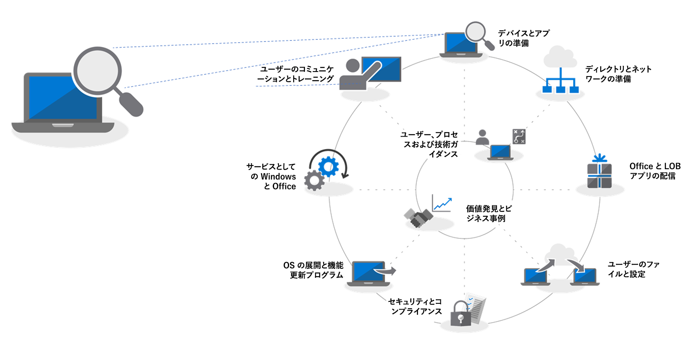
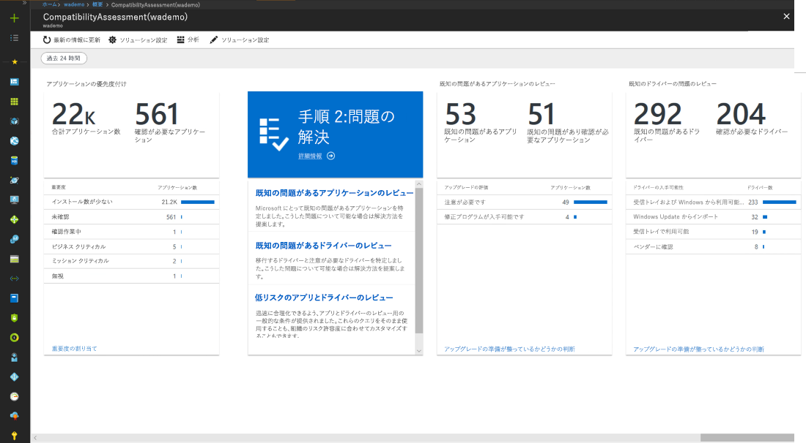
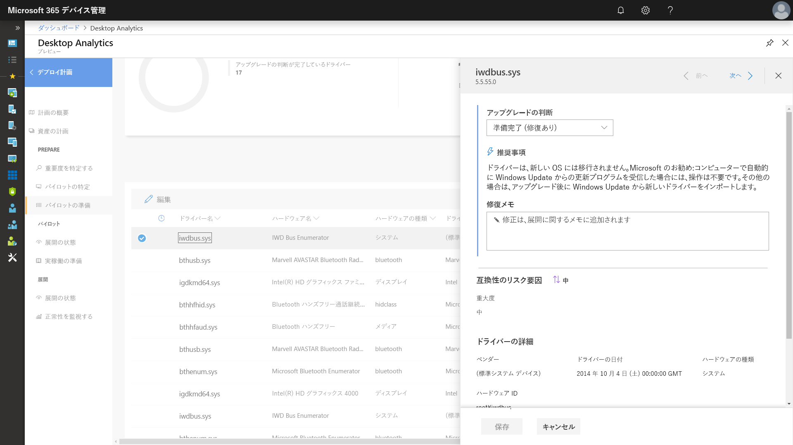
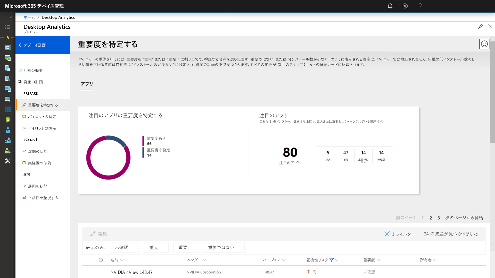
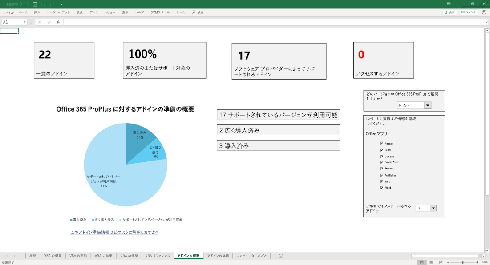
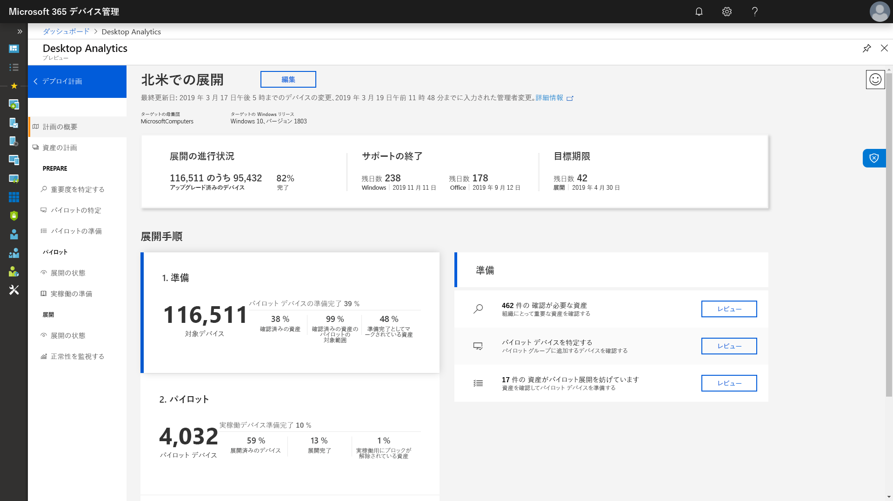

# 手順 1: デバイスとアプリの準備

<table>
<thead>
<td></td>
<td>
<strong>手順 1: デバイスとアプリの準備</strong>

デバイスとアプリのインベントリを使用してデスクトップ展開プロジェクトを開始し、転送する必要があるものに優先度を設定し、優先度が設定されたアプリとデバイスをテストし、展開の準備に必要なものを修復します。
</td>
<td></td>
</thead>
</table>

>[!NOTE]
>デバイスとアプリの準備は、推奨されている展開プロセスの輪における最初の手順であり、アプリケーションとハードウェアの互換性に関する包括的な側面をカバーします。 デスクトップ展開プロセス全体を確認するには、[デスクトップ展開センター](https://aka.ms/HowToShift)を参照してください。
>

これまで、ユーザーのデスクトップをアップグレードする際には、アプリケーションとハードウェアの互換性が大きなハードルになっていました。Windows 10 および Office 365 ProPlus への移行を計画しているときには、好都合なことに、過去 10 年間に作成されたアプリケーションのほとんどが Windows 10 で稼働するものであり、組織が Office 2010 以降の各バージョンで使用している COM アドインと VBA マクロは最新バージョンの Office でも変更なしで動作します。

そのため、組織の規模と歴史によっては、アプリケーションとハードウェアの互換性を検証することが、推奨される 8 フェーズの展開プロセスにおける重要な最初の手順になることがあります。

この記事では、最初のフェーズであるデバイスとアプリの準備に、新しい Desktop Analytics の Upgrade Readiness ツールなどの Microsoft の準備状況評価ツールを使用する方法について説明します。このツールは、インテリジェントなクラウド ベースのソリューションであり、Windows ライセンスで使用できます。

## Windows 10 互換性スキャン

Windows 10 を展開する前に、Windows 7、8、8.1 のいずれかを実行している既存のデバイスの準備状況を確認することをお勧めします。 Windows 10 インストール メディアでは、setup.exe でアップグレードを実行するためのコマンド ライン スイッチがサポートされていますが、互換性のチェックのみを行い、実際にアップグレードを実行することはできません。 ScanOnly は、スクリプト化されたバッチファイルとして実行するか、または System Center Configuration Manager のタスク シーケンスに統合できます。これには、ScanOnly をネットワークから直接実行して、Windows 10 インストールメディアをローカル デバイスにストリーミングしないようにする機能が含まれます。 ScanOnly が完了すると、Setup.EXE によって生成されたログファイルのリターン コードを介して結果が返されます。   

互換性スキャンをサイレントで完了する ScanOnly コマンド ラインの例を以下に示します。

    Setup.EXE /Auto Upgrade /Quiet /NoReboot /Compat ScanOnly

ScanOnly やその他の Windows セットアップ コマンド スイッチの詳細については、「[Windows セットアップ コマンドライン オプション](https://aka.ms/setupswitches)」を参照してください。

## 推奨されるツール: Desktop Analytics の Upgrade Readiness

Desktop Analytics の Upgrade Readiness は、従来のデスクトップ管理システムよりも利点が多く、お勧めのツールです。 エージェントレスであり、何億ものコンシューマー PC のアップグレードにより収集されたアプリケーションとドライバーの互換性情報を利用して、実行する必要がある手順をガイドします。 その情報を使用して詳細な評価を行い、アップグレードをブロックする可能性のある互換性の問題を特定し、Microsoft が把握している修正プログラムへのリンクを提供してサポートします。

Window Analytics の Upgrade Readiness を設定するには、まず Azure サブスクリプションを設定し、それに Azure Log Analytics ワークスペースを含める必要があります。 Desktop Analytics の Upgrade Readiness サービスが起動したことを確認したら、グループ ポリシー設定を使用してインターネットに接続された Windows 7 SP1 以降のデバイスを登録できます。とても簡単です。 エージェントを展開する必要はありません。Desktop Analytics の Upgrade Readiness の視覚的なワークフローにより、パイロットから運用環境への展開をガイドします。 必要に応じて、Desktop Analytics の Upgrade Readiness から System Center Configuration Manager (Current Branch) などのソフトウェア展開ツールにデータをエクスポートしたり、ターゲット PC に直接データをエクスポートしたりして、展開の準備が整い次第コレクションを作成できます。

現時点で目的の環境に Desktop Analytics をセットアップしていない場合や、試用のためにサインアップしようとしている場合は、Desktop Analytics ページ] (http://www.aka.ms/desktopanalytics) に移動して開始してください。

## デバイスとアプリの準備プロセス

デバイスとアプリの準備は 4 つの手順で構成されています。1. インベントリ、2. 優先度設定、3. テスト、4. 修復。 それぞれについて順番に確認しましょう。

### 1\. インベントリ

Desktop Analytics の Upgrade Readiness サービスは、エージェントレス型のプロセスを使用して、デスクトップ資産全体にわたるコンピューター、アプリケーションをインベントリに登録します。

さらに、頻繁にアクセスされるインターネット サイト、アプリおよびイントラネットの場所に関するレポートを示します。これは、この後の互換性テストの役に立ちます。

### 2\. 優先度設定

インベントリの作成により、Desktop Analytics の Upgrade Readiness は、優先度を設定するときに役立つ、組織で最も一般的に使用されているアプリとハードウェアを特定します。また、できるだけ多くの PC の展開のために排除する障害に注目するときにも役立ちます。

さらに、次の手順「テスト」で問題を解決するために必要な更新プログラムを評価するときに役立つガイダンスも提供します。

### 3\. テスト

インベントリに登録されたアプリケーション、ドライバー、アドインのほとんどは、そのままで動作することがわかります。 Desktop Analytics の Upgrade Readiness で問題ありと評価された項目については、互換性の問題を解決するためのバージョン更新の入手先など、既知の情報が提供されます。 わずかしか展開されていない重要性の低いアプリケーションや古いデバイスに関する複雑な問題を解決するために時間とリソースを割くのではなく、ユーザーと協力してこれらの項目をインベントリから削除し置き換えることができます。

Desktop Analytics の Upgrade Readiness を使用して、ユーザーがアクセスした Web サイトと Web アプリのうち Microsoft Edge ブラウザーでサポートされなくなったレガシ テクノロジ (ActiveX コントロール、ブラウザー ヘルパー オブジェクト、VBScript など) を依然として使用しているものを識別することで、ブラウザー ベースの互換性問題についても評価できます。ユーザーは、そうしたサイトに対して引き続き Internet Explorer 11 を使用する必要があるため、これに該当するサイトは Enterprise Mode Site List Manager を使用して[エンタープライズ モード サイト一覧](https://docs.microsoft.com/ja-JP/microsoft-edge/deploy/emie-to-improve-compatibility)に追加してください。

さらに、Office 365 ProPlus への移行を円滑に進めるために、[Readiness Toolkit for Office](https://docs.microsoft.com/ja-JP/deployoffice/use-the-readiness-toolkit-to-assess-application-compatibility-for-office-365-pro) を利用して、アドインと Microsoft Visual Basic for Applications (VBA) マクロの互換性をテストすることもできます。

### 4\. 修復

デバイスとアプリの準備の最終フェーズでは「修復」を実行します。 このフェーズでは、必要なソフトウェアまたはドライバーのパッケージを収集することになります。収集したパッケージは、展開プロセスの一環として前のバージョンを置き換えたり更新したりするために使用します。

問題を修復するリストに対する作業を進めるにつれて、さらに多くの PC が「展開準備完了」になることがわかります。つまり、PC 上のドライバーとアプリの両方が展開の対象としている Windows 10 のバージョンと互換性があることがわかるということです。

### アプリケーションの優先順位付けの Configuration Manager ソフトウェア インベントリ

Configuration Manager ソフトウェア インベントリは、クラウドベースの分析ソリューションを使ってデバイスとアプリの準備を整える方法に代わる手段です。 インストール数を使用したり、特定のコンピューターを詳細に調査したりして、互換性のテストと検証の優先順位を定め、パッケージ設定を使用してアプリケーション パッケージを Windows 10 互換として設定できます。 このオプションでは既知の互換性情報と Microsoft の分析サービスとを比較することはできませんが、優先度の高いアプリのより小さなセットを対象に手動テストを行うための効果的なソリューションになり得ます。 

詳細については、「[System Center Configuration Manager のソフトウェア インベントリの概要](https://docs.microsoft.com/ja-JP/sccm/core/clients/manage/inventory/introduction-to-software-inventory)」を参照してください。アプリケーション パッケージのプラットフォーム設定の要件については、「[System Center Configuration Manager のパッケージとプログラム](https://docs.microsoft.com/ja-JP/sccm/apps/deploy-use/packages-and-programs)」を参照してください。

## Desktop App Assure

Windows 10 と Office 365 ProPlus アプリの互換性を支援する別のツールは、FastTrack Center から入手できる、[Desktop App Assure](https://aka.ms/desktopappassure) プログラムです。 有効なアプリケーションの問題が発生した場合でも、Desktop App Assure を使用すれば、Microsoft のエンジニアと協力して、追加料金なしでアプリケーションの非互換性を修復できます。

## 診断データ ツールの継続的な使用

Desktop Analytics の Upgrade Readiness は、Windows 10 および Office 365 ProPlus への移行に役立つだけのツールではありません。デスクトップで Windows 10 と Office 365 を実行している場合、このツールは、半期ごとに機能の更新プログラムの展開と管理を維持して最新の状態に保つために利用できます。

## 次の手順 

## [手順 2: ディレクトリとネットワークの準備](https://aka.ms/mdd2)