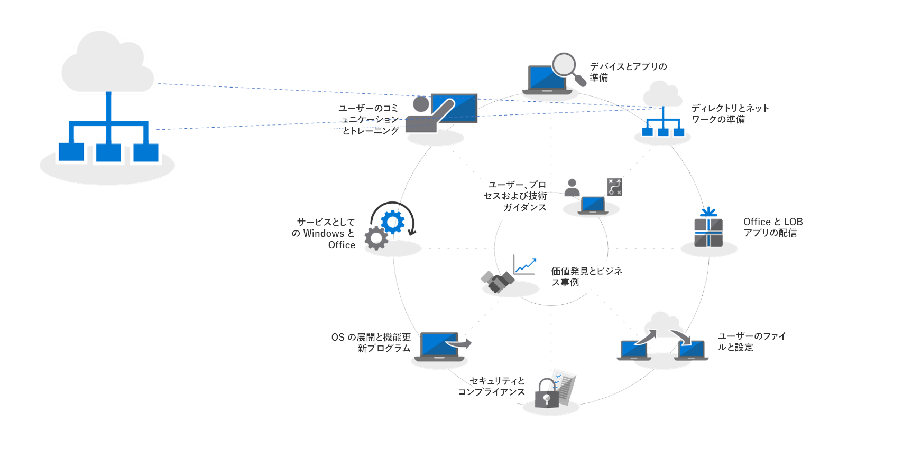
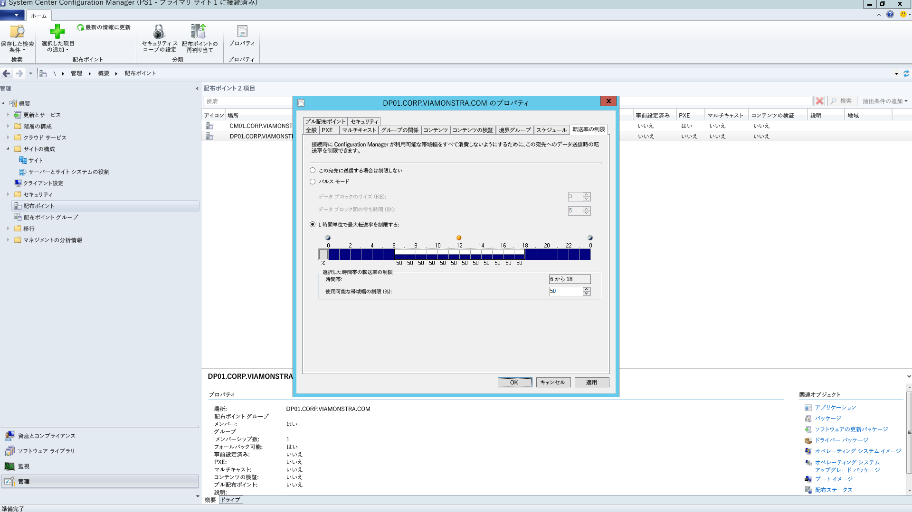
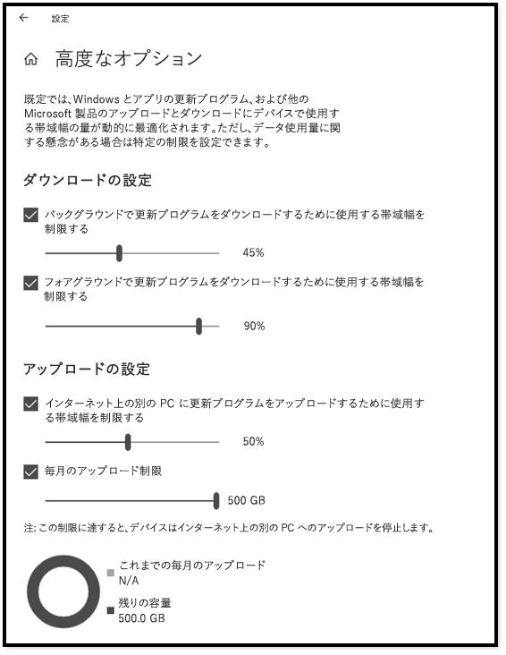
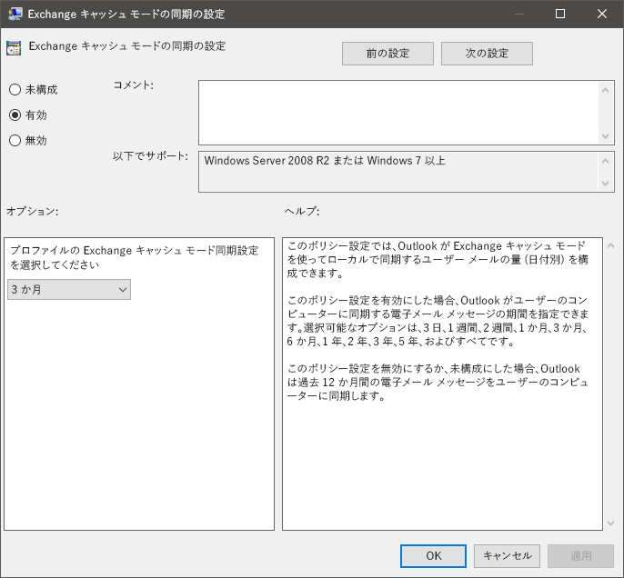
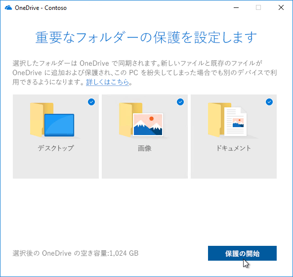

# 手順 2: ディレクトリとネットワークの準備Step 2: Directory and Network Readiness

ディレクトリとネットワークが構成され、Windows 10 と Office 365 ProPlus への移行をサポートする準備ができていることを確認します。そのためには、ユーザーが Azure Active Directory サービスを利用できるようにする必要があります。また、ネットワークには通常のトラフィックに加え、PC のアップグレード時やユーザーのファイル、設定、アプリケーションの復元時に発生する可能性のある大量のデータ移動を処理できる容量が必要です。Ensure your directory and the network are configured and ready to support to your shift to Windows 10 and Office 365 ProPlus. This will require Azure Active Directory Services to be in place for users, and your network must have the capacity to handle both its regular traffic and the movement of potentially vast amounts of data as PCs are upgraded, and users’ files, settings and applications are restored.

<table>
<thead>
<td></td>
<td>
<strong>手順 2: ディレクトリとネットワークの準備</strong><strong>Step 2: Directory and Network Readiness</strong>

Office 365 ProPlus のクラウド接続サービスと Windows Autopilot などの新しい展開オプションには、Azure Active Directory が必要です。ネットワークと接続性も、Windows の画像、アプリ、ドライバー、関連ファイルを PC に移動する場合に、計画すべき重要な分野です。新しいツールと展開オプションによって、ネットワーク トラフィックを削減および合理化する方法について説明します。Cloud connected services in Office 365 ProPlus and new deployment options like Windows Autopilot require Azure Active Directory. Your network and connectivity are also important areas to plan when moving Windows images, apps, drivers and related files to your PCs. Learn how new tools and deployment options reduce and streamline network traffic.
</td>
<td></td>
</thead>
</table>

>[!NOTE]
>ディレクトリとネットワークの準備は、推奨される展開プロセスの輪における 2 番目の手順であり、Azure Active Directory に焦点を当て、ネットワークを最適化します。Directory and Network Readiness is the second step in our recommended deployment process wheel focusing on Azure Active Directory and optimizing the network. デスクトップ展開プロセス全体を確認するには、[デスクトップ展開センター](https://aka.ms/HowToShift)を参照してください。To see the full desktop deployment process, visit the [Desktop Deployment Center](https://aka.ms/HowToShift).
>

ディレクトリとネットワークの準備は、スムーズな OS とデスクトップの展開を実現するために不可欠です。自動化された展開と同様、ファイル共有にアクセスできるようにする必要があります。また、お使いのネットワークで非常に大きなファイルの転送を (おそらく一度に数百または数千台の PC に対して) サポートできるようにする必要があります。Directory and Network readiness is fundamental to ensuring a smooth OS and desktop deployment. As with any automated deployment, it is important to ensure your file shares can be reached, and your network will need to be able to support the transfer of very large files, possibly to hundreds or even thousands of PCs at a time.

Windows 10 および Office 365 ProPlus への移行に伴い、クラウドベースの ID が Azure Active Directory で設定されていることを確認する必要も生じます。これにより、Office 365 ProPlus のライセンス認証を行うだけでなく、Windows Autopilot のような最新のプロビジョニング ソリューションも利用できるようになります。With your shift to Windows 10 and Office 365 ProPlus you also now need to make sure that cloud-based identity is set up with Azure Active Directory. This is key not only to activating Office 365 ProPlus, it also allows you to take advantage of modern provisioning solutions like Windows Autopilot.

この記事では、Windows 10 および Office 365 ProPlus への展開に向けて、ディレクトリ サービスや、ユーザーとデバイスのアクセス許可を準備するためのツールとオプションについて説明します。In this article we’ll explore the tools and options to prepare your directory services, and user and device permissions, ready for deployment to Windows 10 and Office 365 ProPlus.

## Azure Active Directory の追加Adding Azure Active Directory

組織が既に Office 365、Exchange Online、Microsoft Intune、またはその他の Microsoft オンライン サービスを使用している場合は、既に Azure Active Directory を使用しています。If your organization already uses Office 365, Exchange Online, Microsoft Intune, or other Microsoft Online services, the good news is you are already using Azure Active Directory. その場合に必要なことは、デスクトップ展開の対象としているユーザーが Azure Active Directory に存在していて、ライセンスが割り当てられていることを確認することだけです。If you are, you just need to ensure that the users you are targeting for desktop deployment are in your Azure Active Directory and that licenses have been assigned.

現在 Azure Active Directory を使用していない場合、セットアップに役立つ[多数のリソース](https://docs.microsoft.com/ja-JP/azure/active-directory/)を利用できます。If you are not currently using Azure Active Directory, there are [numerous resources](https://docs.microsoft.com/ja-JP/azure/active-directory/) to help you set it up. Office 365 ライセンスの一部として、Microsoft FastTrack 経由で個人向けのサポートも利用できる場合があります。You may well qualify for personalized assistance via Microsoft FastTrack, as part of your Office 365 license. Microsoft Fastrack の詳細は[こちら](https://fasttrack.microsoft.com)で確認できます。You can check out more about Microsoft Fastrack [here](https://fasttrack.microsoft.com).

Azure Active Directory を配置したら、対象ユーザーは Office 365 ProPlus アプリにサインインしてライセンス認証を行うことができます。また、Microsoft Intune や Windows AutoPilot Deployment を使用して、アプリとポリシーを自動展開できます。Once you have Azure Active Directory in place, your users can sign in to and activate their Office 365 ProPlus apps, and you can use Microsoft Intune or Windows Autopilot deployment for automated deployment of apps and policy.

## ネットワークの準備Network Readiness

展開を計画するときは帯域幅要件を考慮する必要があります。You must consider bandwidth requirements when planning your deployments. 展開でネットワークに影響を与える要因には主に、PC のイメージング、ソフトウェアの更新、ユーザーの個人用設定の 3 つがあります。There are three main components in a deployment that will have an impact on your network – PC imaging, software updates, and user personalization. とりわけ、最初の移行には PC 1 台あたり 20 GB 以上、最新の状態を保つには PC 1 台 1 か月あたり 1 GB 以上になることも少なくありません。Between them, this can mean in excess of 20 GB per PC for the initial migration, and often 1 GB or more per month per PC to stay up-to-date.

まず、これら 3 つの主要コンポーネントの要件を確認することから始めましょう。Let’s start by exploring the requirements of each of these three main components:

### PC のイメージングPC Imaging

カスタマイズを加えていない Windows イメージの場合、一般に PC 1 台あたり 3 GB を計画する必要があります。一方、アプリを含むカスタマイズがされたイメージの場合は 6 GB 以上必要となる場合があります。For Windows Images with no customization you should plan typically for 3GB per PC, while for customized images with apps you may need to allow 6GB, or more. ドライバー パッケージも考慮する必要があります。これは、PC 1 台あたり数百 MB になり、1 GB に及ぶ場合もあります。You may also need to consider Driver packages; these can be a few hundred megabytes per PC, sometimes up to 1GB.

### ソフトウェアの更新Software Updates

ソフトウェアの更新のためのネットワーク帯域幅を計画する必要があります。You’ll need to plan network bandwidth for software updates. Windows 10 と Office 365 ProPlus では、毎月、および半年ごとに更新プログラムを提供する新しいサービス モデルを採用しています。Windows 10 and Office 365 ProPlus use a new servicing model delivering monthly and semi-annual updates. このモデルを初めて利用する場合は、この機能の詳細を[こちら](https://docs.microsoft.com/ja-JP/windows/deployment/update/waas-overview)でご覧ください。If you are new to this model, you can learn more about how this works [here](https://docs.microsoft.com/ja-JP/windows/deployment/update/waas-overview).

新しいサービス モデルには、年 2 回の Windows 機能更新プログラム、Office の半期ごとのチャネル更新プログラム、毎月の品質更新プログラムが含まれています。機能更新プログラムのサイズは通常 2 - 4 GB で、Office の半期ごとのチャネル更新プログラムは更新ごとに 300 - 400 MB です。さらに、毎月の品質更新プログラムがあります。これらは数百 MB から 1 GB 以上になることがあります。毎月の更新は累積的で、Windows 10 の各バージョンのサービス有効期間にわたってサイズが増えていくためです。そうは言っても、更新を実装するためにネットワークを通過するデータ量を減らすのに役立つツールがあります。これについては、以下で詳しく説明します。The new servicing model includes Feature Updates for Windows twice a year, Office Semi-Annual Channel Updates, and monthly Quality Updates. Feature Updates are typically 2 – 4GB in size, and Office Semi-Annual Channel updates are 300 – 400 MB per update. Then there are the monthly Quality Updates. These may range from a few hundred megabytes to over a gigabyte. This is because monthly updates are cumulative, so these increase in size over the servicing lifetime for each Windows 10 version. That said, there are tools that can help reduce the amount of data that must pass over the network to implement updates. We will cover this in more detail below.

### ユーザーの個人用設定User Personalization

考慮すべき 3 番目のコンポーネントは、ユーザーの個人用設定です。ここでは、PC のリフレッシュまたは交換プロセスの一部として、ユーザーのファイル、設定、アプリケーションの復元に対応するために、ネットワーク帯域幅を計画する必要があります。これらのアイテムは合計で PC ごとに 20 GB を超えることがよくあります。ユーザーによっては、100 GB を超える場合もあります。The third component to consider is user personalization. Here you need to plan network bandwidth to accommodate the restoring of user files, their settings, and their applications as part of the PC refresh or replacement process. Together, these items often exceed 20 GB per PC; for some users these may exceed 100 GB.

## 帯域幅の制限Limiting Bandwidth

ネットワーク上の展開に関連するトラフィックの影響を制限する 1 つの方法は、クライアント上の BITS (バックグラウンド インテリジェント転送サービス) 設定を使用して調整することです。BITS は、アダプティブ ビット レート (ABR) を使用して、展開のために使用可能な帯域幅を調整します。これは、グループ ポリシーを使用してクライアント上で構成できます。One way to limit the impact of deployment-related traffic on the network is to throttle it using the BITS (Background Intelligent Transfer Service) setting on clients. BITS uses an Adaptive Bit Rate (ABR) to adjust bandwidth available for deployment purposes; it can be configured on clients using Group Policy.

[BITS についてAbout BITS](https://docs.microsoft.com/ja-JP/windows/desktop/bits/about-bits)

System Center Configuration Manager (Current Branch) を使用している場合は、BITS 対応の配布ポイントを構成することも、WDS でマルチキャストを有効にすることもできます。If you use System Center Configuration Manager, you can also configure BITS-enabled Distribution Points or enable multicast with WDS.

特定のトラフィックを調整すると、通常のネットワーク トラフィックは、更新プログラムやアプリケーションをダウンロードしている PC の影響を受けにくくなります。しかし、これらのタスクのために帯域幅の特定の割合を切り分けると、生産性は Windows または Office の展開による影響を受けず、プロセスが必要に応じて実行を続けるようになります。そのため、展開に関連するダウンタイムが悪化し、展開が実行される間、ユーザーが PC からロックアウトされる可能性があります。Throttling specific traffic means that normal network traffic is less impacted by PCs downloading updates and applications. But carving out a certain percentage of bandwidth for these tasks helps ensure productivity isn’t impacted by Windows or Office deployment and processes continue to run as needed, it can worsen deployment-related downtime, with users locked out of their PCs while a deployment runs.

幸い、大規模なデスクトップ展開のネットワークへの影響を簡単に管理できる新しいツールが用意されています。これには、利用可能な帯域幅の使用を最適化する LEDBAT、展開トラフィックをネットワークの中心から離して境界に移動させるピアツーピア (P2P) オプションが含まれます。Fortunately, there are new tools to make it easier for you to manage the network impact of a large-scale desktop deployment, including LEDBAT to optimize use of available bandwidth, and peer-to-peer (P2P) options to move deployment traffic away from the center of the network and out to the perimeter

## 帯域幅の清掃Scavenging Bandwidth

Windows Server 2019 および System Center Configuration Manager (Current Branch) でサポートされている Low Extra Delay Background Transport (LEDBAT) は、Windows クライアントへのネットワーク トラフィックを最適化するよう設計されています。Low Extra Delay Background Transport (LEDBAT), supported in Windows Server 2019 and System Center Configuration Manager version 1806, is designed to optimize network traffic to Windows clients.

[Windows Server 2019 のネットワーク機能のトップ テン: \#9 LEDBAT – 遅延に最適化されたバックグラウンド トランスポートTop 10 Networking Features in Windows Server 2019: \#9 LEDBAT – Latency Optimized Background Transport](https://blogs.technet.microsoft.com/networking/2018/07/25/ledbat/)

従来の調整とは異なり、LEDBAT はバックグラウンド タスクとして利用可能なすべてのネットワーク帯域幅を使用でき、他のトラフィックから要求された場合は即座に帯域幅を明け渡します。BITS とは異なり、遅延はありません。すべて自動化されているため、手動でのチューニングやスケジューリングは必要なく、サーバー側ですべてがセットアップされます。これにより、大幅なパフォーマンスの向上を実現します。Unlike traditional throttling, LEDBAT can use all available network bandwidth as a background task, instantly yielding bandwidth when other traffic requests it. Unlike BITS there is no delay; everything is automated – no manual tuning or scheduling required, and everything is setup server side. This affords potentially massive performance gains.

## ピアツーピア オプションPeer-to-Peer options

Windows 10 の移行では、PC イメージング、ソフトウェアの更新、ユーザーの個人用設定のために、ピアツーピア オプションがますます使用されるようになっています。それは、Windows 10 の初期展開後にビルド間のアップグレードを容易にするうえでも役に立ちます。ここでは、Windows 10 および Office 関連のトラフィックをネットワークの中心から離すためのいくつかの例を取り上げます。従来の調整方法の必要性を低減し、配布ポイントまたはインターネットからダウンロードするのではなく、ローカル ネットワークのピア上で必要な更新ファイルを PC から検索できるようにします。Peer-to-Peer options are increasingly being used in Windows 10 migrations, for PC imaging, software updates and user personalization. They are also valuable in facilitating build-to-build upgrades after your initial Windows 10 deployment. Here we will cover several examples to help move Windows 10 and Office-related traffic away from the center of the network, reducing the need for classic throttling approaches, and allowing PCs to find the update files they need on peers in their local network rather than downloading them from a distribution point or the internet.

**BranchCache** を使用すると、ネットワークを飽和させることなく、分散環境でコンテンツをダウンロードできます。これには次の 2 つのオプションがあります。コンテンツをキャッシュするためにローカル サーバーを使用できるホスト型キャッシュ モードと、クライアントが既にダウンロードしたコンテンツを互いに共有できる分散キャッシュ モード (System Center Configuration Manager でサポートされているモード) です。**BranchCache** can help you download content in distributed environments without saturating the network. It comes in two options: Hosted Cache Mode, which lets you use local servers to cache content, and Distributed Cache Mode (a mode supported in System Center Configuration Manager), which lets clients share already downloaded content with each other.

System Center Configuration Manager でサポートされている**ピア キャッシュ**クライアントではピア キャッシュも使用できます。**Peer Cache** Clients supported by System Center Configuration Manager can also make use of Peer Cache. これにより、ネットワーク上で信頼性の高い可用性を備えた PC はコンテンツ配信のソースをホストできます。This allows PCs that are reliably available on the network to host source for content distribution. これはすべての PC に対して有効にする機能ではありません。ホストとして信頼性の高いネットワーク接続を備えたデバイス (デスクトップ、ミニタワー、タワー PC など) のみを対象にします。You won’t want to enable this all of your PCs – only target devices with reliable network connections as hosts (e.g. desktop, mini-tower, or tower PCs). ピア キャッシュは、セットアップ時に Windows PE フェーズで実行される展開タスクの作業にも使用できます。Peer Cache can even work for deployment tasks running in Windows PE phases during setup.

注: BranchCache とピア キャッシュは補完的であり、同じ環境で一緒に作業できます。Note: BranchCache and Peer Cache are complementary and can work together in the same environment.

[BranchCache 対ピア キャッシュBranchCache vs. Peer Cache](https://blogs.technet.microsoft.com/swisspfe/2018/01/25/branch-cache-vs-peer-cache/)

**配信の最適化** 配信の最適化は、もう 1 つのピア ツー ピア キャッシング テクノロジであり、展開用のネットワークベースのコントロールを提供します。**Delivery Optimization** Delivery Optimization is another peer-to-peer caching technology, providing network-based controls for deployments. Windows 10 の配信の最適化は組み込み UWP アプリの更新、Microsoft Store からのアプリケーションのインストール、および高速インストール ファイルを使用したソフトウェア更新にも使用されます。Windows 10 Delivery Optimization to update built-in UWP apps, also to install applications from the Microsoft Store, and for software updates using Express Updates. これは初期のバージョンの Windows 10 から使用できましたが、System Center Configuration Manager (Current Branch) と統合されたのは最近のことです。It has been available since early versions of Windows 10, though it has only recently integrated with System Center Configuration Manager. Windows 10 バージョン 1803 以降の新しい構成オプションでは、バックグラウンド更新やフォアグラウンド ジョブ (Microsoft Store からのアプリのインストールなど) の帯域幅制限を個別に設定できるようになりました。Since Windows 10 version 1803 new configuration options mean you can now independently set bandwidth limits for background updates and foreground jobs such as an app install from the Store. Windows の配信の最適化はクライアント更新時の Office 365 ProPlus もサポートするようになりました。サポートされているすべての Office 365 クライアント更新チャネルで利用可能です。Windows Delivery Optimization now also supports Office 365 ProPlus during client updates, available in all supported Office 365 client update channels. Office 365 クライアント初期インストール時に対する Windows の配信の最適化のサポートは近日対応予定です。Support for Windows Delivery Optimization during Office 365 client initial installation will be coming soon.  

**Office 365 ProPlus のその他の考慮事項****Additional Considerations for Office 365 ProPlus**

配信の最適化の活用に加え、Office 365 ProPlus の展開によるネットワーク負荷を軽減する 3 つの項目を紹介します。In addition to leveraging Delivery Optimization, here are three items that will help reduce your network load due to Office 365 ProPlus deployments.

**バイナリ デルタ圧縮**: Office 365 ProPlus では、バイナリ デルタ圧縮を使用して、Office 365 ProPlus の最新リリースから次のリリースに更新するときにソフトウェアの更新によって消費される帯域幅を削減します。前のリリースからのバイナリ レベルの変更のみを引き出すことで、累積的な更新プログラムによる毎月のサイズ膨張の影響を最小限に抑えることができます。これにより、PC ごとに、毎月数百 MB のデータを節減できる可能性があります。ただし、この機能を使用する場合、リリースをスキップすることはできません。スキップしたい場合は、完全な累積的更新プログラムをダウンロードする必要があります。**Binary Delta Compression** Office 365 ProPlus uses Binary Delta Compression to reduce bandwidth consumed by software updates when updating from the most recent release of Office 365 ProPlus to the next release. By only pulling the binary level changes from the previous release, the impact from month-over-month growth of cumulative updates is minimized. This has the potential of saving several hundred megabytes of data, per PC, each month. In order to use this capability though, you cannot skip releases. If you do, then the full cumulative update must be downloaded.

[Office 365 ProPlus の更新プログラムをダウンロードするDownloading Updates for Office 365](https://docs.microsoft.com/ja-JP/deployoffice/overview-of-the-update-process-for-office-365-proplus#download-the-updates-for-office-365-proplus)

**Outlook データ ファイル** 多くの場合、Outlook はユーザーのメール ボックス全体をローカルにキャッシュし、オフラインで使用するように構成されています。**Outlook Data Files** Outlook is often configured to cache users’ entire mailbox locally for use offline. インプレース アップグレード以外の Windows の展開では、アップグレード後にユーザーの Outlook データ ファイルを再構築する必要があります。In any Windows deployment, except an in-place upgrade, that requires the users’ Outlook Data Files to rebuild themselves after the upgrade. これは自動化されたプロセスですが、Outlook メールボックスの制限値を通常どおり最大 100 GB に設定した場合、すべてのユーザーのローカルのメールボックス全体を再キャッシュすると大量のデータ転送が発生します。This is an automated process, but with Outlook mailbox limits typically set to up to 100GB, re-caching the entire mailbox locally for all users means a lot of data transfer. ネットワーク負荷を軽減するには、グループ ポリシーを使用して [オフラインにしておくメール] の設定値を小さくすることを検討してください。To reduce the network load you may want to consider using Group Policy to reduce the “Mail to keep offline” setting. Office 365 ProPlus または Outlook 2016 の Outlook では、既定値は 12 か月に設定されています。In Office 365 ProPlus or Office 2016 the default value for Outlook is set to 12 months. オフライン キャッシュを直近 1 ～ 6 か月の間に設定することを検討してください。In order to reduce network impact consider setting the offline cache to last between 1 to 6 months. この設定を変更してもオンライン メールボックスのサイズには影響しませんし、オンラインの時に Outlook 経由でメールボックス全体を検索することもできます。Changing this setting does not affect the size of the online mailbox, and the entire mailbox can still be searched via Outlook when online.

**OneDrive ファイル オンデマンドおよび既知のフォルダー移動** OneDrive は、PC や他のデバイスのユーザー ファイルをクラウドで同期して保護するための優れた手段です。**OneDrive Files on Demand and Known Folder Move** OneDrive is a great way to synchronize and protect user files from PCs and other devices in the cloud. 既知のフォルダー移動を使用すれば、ユーザーのデスクトップ、ドキュメント、画像のフォルダーから OneDrive へのファイルの同期を実行し、新しいデバイスや再イメージ化された PC にサインインしたときに、それらのファイルを使用可能にすることができます。With Known Folder Move, you can enforce file sync from a user’s Desktop, Documents, and Pictures folders to OneDrive making those files available when signing into a new device a or reimaged PC. ただし、デスクトップ、ドキュメント、画像の保存先に格納されるファイルの実際のサイズと数によっては、PC で OneDrive を有効にして適用するポリシーのロールアウトを計画的に行う必要があります。Remember though, due to the sheer size and number of files kept in Desktop, Documents, and Pictures locations, you’ll want to be planful with the rollout of policies enabling and enforcing OneDrive on your PCs. 1 つのオプションは、グループ ポリシーのネットワーク制御を使用して、OneDrive 同期サービスで使用される帯域幅を調整することです。One option is to use Group Policy Network controls to throttle bandwidth used by the OneDrive sync service.

[既知のフォルダー移動のセットアップSetup Known Folder Move](https://techcommunity.microsoft.com/t5/Microsoft-OneDrive-Blog/Migrate-Your-Files-to-OneDrive-Easily-with-Known-Folder-Move/ba-p/207076)

[OneDrive ファイル オンデマンドOneDrive Files on Demand](https://www.microsoft.com/ja-JP/microsoft-365/blog/2017/05/11/introducing-onedrive-files-on-demand-and-additional-features-making-it-easier-to-access-and-share-files/)

OneDrive をまだロールアウトしていない場合は、Windows 7 から Windows 10 への移行時が OneDrive を有効にする絶好の機会であり、そうすることにより Office 365 ProPlus をシームレスに統合できます。If you haven’t already rolled out OneDrive, the shift from Windows 7 to Windows 10 is a perfect opportunity to enable OneDrive and it integrates seamlessly Office 365 ProPlus. アプリとデバイスの準備作業中に、このロールアウトを開始することを検討してください。Consider starting this roll-out while working through your app and device readiness. これにより、Windows イメージを移動し、ネットワーク経由でアプリを展開する前に、ファイルの同期が開始されます。This will give file sync a head start before you start moving Windows images and deploying apps over your network.

## 次の手順Next Step 

## [手順 3: Office と LOB アプリの配信Step 3: Office and LOB App Delivery](https://aka.ms/mdd3)

## 前の手順Previous Step:

## [手順 1: デバイスとアプリの準備Step 1: Device and App Readiness](https://aka.ms/mdd1)

## フィードバックFeedback

お客様のご意見をお寄せください。お寄せいただく内容の種類を選択:We'd love to hear your thoughts. Choose the type you'd like to provide:

製品に関するフィードバック: サインインしてドキュメントに関するフィードバックを送るProduct feedback Sign in to give documentation feedback

この新しいフィードバック システムは、GitHub Issues を利用して構築されています。この変更については、こちらのブログ記事をご覧ください。Our new feedback system is built on GitHub Issues. Read about this change in our blog post.
