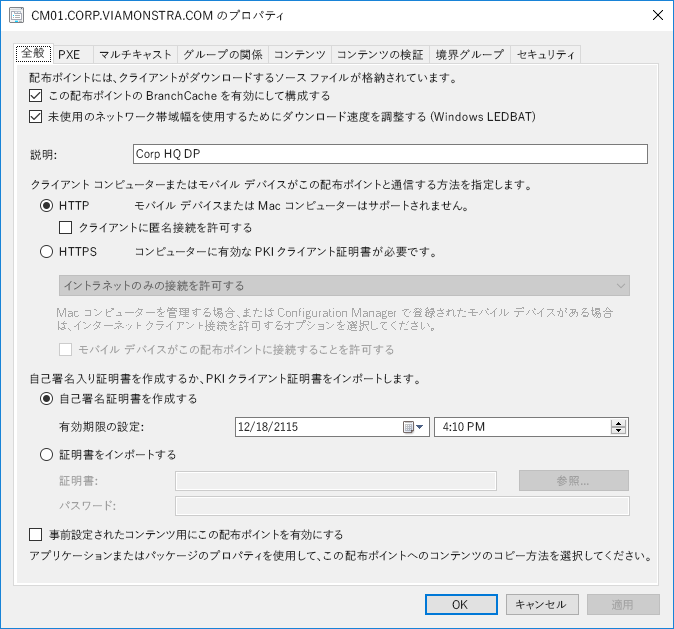
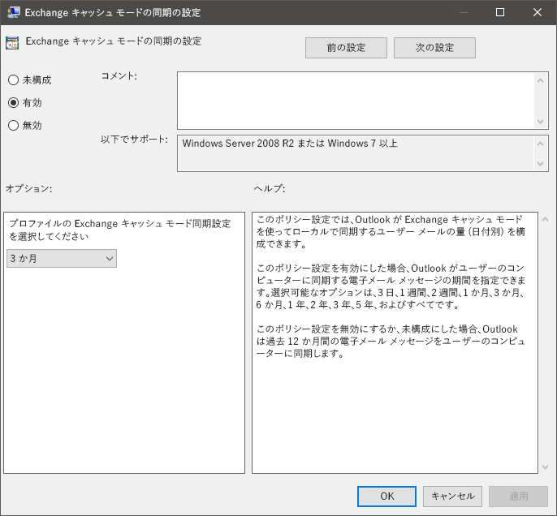
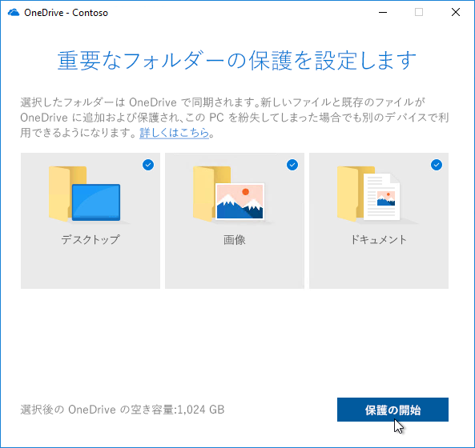

# 手順 2: ディレクトリとネットワークの準備

Ensure your directory and the network are configured and ready to support to your shift to Windows 10 and Microsoft 365 Apps for enterprise. This will require Azure Active Directory Services to be in place for users, and your network must have the capacity to handle both its regular traffic and the movement of potentially vast amounts of data as PCs are upgraded, and users’ files, settings and applications are restored.

<table>
<thead>
<td></td>
<td>
<strong>手順 2: ディレクトリとネットワークの準備</strong>

Cloud connected services in Microsoft 365 Apps for enterprise and new deployment options like Windows Autopilot require Azure Active Directory. Your network and connectivity are also important areas to plan when moving Windows images, apps, drivers and related files to your PCs. Learn how new tools and deployment options reduce and streamline network traffic.
</td>
<td></td>
</thead>
</table>

>[!NOTE]
>ディレクトリとネットワークの準備は、推奨される展開プロセスの輪における 2 番目の手順であり、Azure Active Directory に焦点を当て、ネットワークを最適化します。 デスクトップ展開プロセス全体を確認するには、[デスクトップ展開センター](https://aka.ms/HowToShift)を参照してください。
>

Directory and Network readiness is fundamental to ensuring a smooth OS and desktop deployment. As with any automated deployment, it is important to ensure your file shares can be reached, and your network will need to be able to support the transfer of very large files, possibly to hundreds or even thousands of PCs at a time.

With your shift to Windows 10 and Microsoft 365 Apps for enterprise you also now need to make sure that cloud-based identity is set up with Azure Active Directory. This is key not only to activating Microsoft 365 Apps for enterprise, it also allows you to take advantage of modern provisioning solutions like Windows Autopilot.

この記事では、Windows 10 および Microsoft 365 Apps for enterprise への展開に向けて、ディレクトリ サービスや、ユーザーとデバイスのアクセス許可を準備するためのツールとオプションについて説明します。

## Azure Active Directory の追加

組織が既に Office 365、Exchange Online、Microsoft Intune、またはその他の Microsoft オンライン サービスを使用している場合は、既に Azure Active Directory を使用しています。 その場合に必要なことは、デスクトップ展開の対象としているユーザーが Azure Active Directory に存在していて、ライセンスが割り当てられていることを確認することだけです。

現在 Azure Active Directory を使用していない場合、セットアップに役立つ[多数のリソース](https://docs.microsoft.com/azure/active-directory/)を利用できます。 ライセンスの一部として、Microsoft FastTrack 経由で個人向けのサポートも利用できる場合があります。 Microsoft FastTrack の詳細は[こちら](https://fasttrack.microsoft.com)で確認できます。

Azure Active Directory を配置したら、対象ユーザーは Microsoft 365 Apps for enterprise アプリにサインインしてライセンス認証を行うことができます。また、Microsoft Intune や Windows AutoPilot Deployment を使用して、アプリとポリシーを自動展開できます。

## ネットワークの準備

展開を計画するときは帯域幅要件を考慮する必要があります。 展開でネットワークに影響を与える要因には主に、PC のイメージング、ソフトウェアの更新、ユーザーの個人用設定の 3 つがあります。 とりわけ、最初の移行には PC 1 台あたり 20 GB 以上、最新の状態を保つには PC 1 台 1 か月あたり 1 GB 以上になることも少なくありません。

まず、これら 3 つの主要コンポーネントの要件を確認することから始めましょう。

### PC のイメージング

カスタマイズを加えていない Windows イメージの場合、一般に PC 1 台あたり 3 GB を計画する必要があります。一方、アプリを含むカスタマイズがされたイメージの場合は 6 GB 以上必要となる場合があります。 ドライバー パッケージも考慮する必要があります。これは、PC 1 台あたり数百 MB になり、1 GB に及ぶ場合もあります。

### ソフトウェアの更新

ソフトウェアの更新のためのネットワーク帯域幅を計画する必要があります。 Windows 10 と Microsoft 365 Apps for enterprise では、毎月および半年ごとに更新プログラムを提供する新しいサービス モデルを使用しています。 このモデルを初めて利用する場合は、この機能の詳細を[こちら](https://docs.microsoft.com/windows/deployment/update/waas-overview)でご覧ください。

The new servicing model includes Feature Updates for Windows twice a year, Office Semi-Annual Enterprise Channel Updates, and monthly Quality Updates. Feature Updates are typically 2 – 4GB in size, and Office Semi-Annual Enterprise Channel updates are 300 – 400 MB per update. Then there are the monthly Quality Updates. These may range from a few hundred megabytes to over a gigabyte. This is because monthly updates are cumulative, so these increase in size over the servicing lifetime for each Windows 10 version. That said, there are tools that can help reduce the amount of data that must pass over the network to implement updates. We will cover this in more detail below.

### ユーザーの個人用設定

The third component to consider is user personalization. Here you need to plan network bandwidth to accommodate the restoring of user files, their settings, and their applications as part of the PC refresh or replacement process. Together, these items often exceed 20 GB per PC; for some users these may exceed 100 GB.

## 帯域幅の制限

One way to limit the impact of deployment-related traffic on the network is to throttle it using the BITS (Background Intelligent Transfer Service) setting on clients. BITS uses an Adaptive Bit Rate (ABR) to adjust bandwidth available for deployment purposes; it can be configured on clients using Group Policy.

[BITS について](https://docs.microsoft.com/windows/desktop/bits/about-bits)

Microsoft Endpoint Configuration Manager (Current Branch) を使用している場合は、BITS 対応の配布ポイントを構成することも、WDS でマルチキャストを有効にすることもできます。

Throttling specific traffic means that normal network traffic is less impacted by PCs downloading updates and applications. But carving out a certain percentage of bandwidth for these tasks helps ensure productivity isn’t impacted by Windows or Office deployment and processes continue to run as needed, it can worsen deployment-related downtime, with users locked out of their PCs while a deployment runs.

幸い、大規模なデスクトップ展開のネットワークへの影響を簡単に管理できる新しいツールが用意されています。これには、利用可能な帯域幅の使用を最適化する LEDBAT、展開トラフィックをネットワークの中心から離して境界に移動させるピアツーピア (P2P) オプションが含まれます。

## 帯域幅の清掃

Windows Server 2019 および Microsoft Endpoint Configuration Manager (Current Branch) でサポートされている Low Extra Delay Background Transport (LEDBAT) は、Windows クライアントへのネットワーク トラフィックを最適化するよう設計されています。

[Windows Server 2019 のネットワーク機能のトップ テン: \#9 LEDBAT – 遅延に最適化されたバックグラウンド トランスポート](https://blogs.technet.microsoft.com/networking/2018/07/25/ledbat/)

Unlike traditional throttling, LEDBAT can use all available network bandwidth as a background task, instantly yielding bandwidth when other traffic requests it. Unlike BITS there is no delay; everything is automated – no manual tuning or scheduling required, and everything is setup server side. This affords potentially massive performance gains.

## ピアツーピア オプション

Peer-to-Peer options are increasingly being used in Windows 10 migrations, for PC imaging, software updates and user personalization. They are also valuable in facilitating build-to-build upgrades after your initial Windows 10 deployment. Here we will cover several examples to help move Windows 10 and Office-related traffic away from the center of the network, reducing the need for classic throttling approaches, and allowing PCs to find the update files they need on peers in their local network rather than downloading them from a distribution point or the internet.

**BranchCache** can help you download content in distributed environments without saturating the network. It comes in two options: Hosted Cache Mode, which lets you use local servers to cache content, and Distributed Cache Mode (a mode supported in Configuration Manager), which lets clients share already downloaded content with each other.

Configuration Manager でサポートされている**ピア キャッシュ**クライアントではピア キャッシュも使用できます。 これにより、ネットワーク上で信頼性の高い可用性を備えた PC はコンテンツ配信のソースをホストできます。 これはすべての PC に対して有効にする機能ではありません。ホストとして信頼性の高いネットワーク接続を備えたデバイス (デスクトップ、ミニタワー、タワー PC など) のみを対象にします。 ピア キャッシュは、セットアップ時に Windows PE フェーズで実行される展開タスクの作業にも使用できます。

注: BranchCache とピア キャッシュは補完的であり、同じ環境で一緒に作業できます。

[BranchCache 対ピア キャッシュ](https://blogs.technet.microsoft.com/swisspfe/2018/01/25/branch-cache-vs-peer-cache/)

**配信の最適化** 配信の最適化は、もう 1 つのピア ツー ピア キャッシング テクノロジであり、展開用のネットワークベースのコントロールを提供します。 Windows 10 の配信の最適化は組み込み UWP アプリの更新、Microsoft Store からのアプリケーションのインストール、および高速インストール ファイルを使用したソフトウェア更新にも使用されます。 これは初期のバージョンの Windows 10 から使用できましたが、Microsoft Endpoint Configuration Manager (Current Branch) と統合されたのは最近のことです。 Windows 10 バージョン 1803 以降の新しい構成オプションでは、バックグラウンド更新やフォアグラウンド ジョブ (Microsoft Store からのアプリのインストールなど) の帯域幅制限を個別に設定できるようになりました。 Windows の配信の最適化はクライアント更新時の Microsoft 365 Apps for enterprise もサポートするようになりました。サポートされているすべてのクライアント更新チャネルで利用可能です。 クライアント初期インストール時に対する Windows の配信の最適化のサポートは近日対応予定です。  

**Microsoft 365 Apps for enterprise のその他の考慮事項**

配信の最適化の活用に加え、Microsoft 365 Apps for enterprises の展開によるネットワーク負荷を軽減する 3 つの項目を紹介します。

**Binary Delta Compression** Microsoft 365 Apps for enterprise uses Binary Delta Compression to reduce bandwidth consumed by software updates when updating from the most recent release of Microsoft 365 Apps for enterprise to the next release. By only pulling the binary level changes from the previous release, the impact from month-over-month growth of cumulative updates is minimized. This has the potential of saving several hundred megabytes of data, per PC, each month. In order to use this capability though, you cannot skip releases. If you do, then the full cumulative update must be downloaded.

[Microsoft 365 アプリの更新プログラムのダウンロード](https://docs.microsoft.com/deployoffice/overview-update-process-microsoft-365-apps#download-the-updates-for-microsoft-365-apps)

**Outlook データ ファイル** 多くの場合、Outlook はユーザーのメール ボックス全体をローカルにキャッシュし、オフラインで使用するように構成されています。 インプレース アップグレード以外の Windows の展開では、アップグレード後にユーザーの Outlook データ ファイルを再構築する必要があります。 これは自動化されたプロセスですが、Outlook メールボックスの制限値を通常どおり最大 100 GB に設定した場合、すべてのユーザーのローカルのメールボックス全体を再キャッシュすると大量のデータ転送が発生します。 ネットワーク負荷を軽減するには、グループ ポリシーを使用して [オフラインにしておくメール] の設定値を小さくすることを検討してください。 Microsoft 365 Apps for enterprises または Outlook 2016 の Outlook では、既定値は 12 か月に設定されています。 オフライン キャッシュを直近 1 ～ 6 か月の間に設定することを検討してください。 この設定を変更してもオンライン メールボックスのサイズには影響しませんし、オンラインの時に Outlook 経由でメールボックス全体を検索することもできます。

**OneDrive ファイル オンデマンドおよび既知のフォルダー移動** OneDrive は、PC や他のデバイスのユーザー ファイルをクラウドで同期して保護するための優れた手段です。 既知のフォルダー移動を使用すれば、ユーザーのデスクトップ、ドキュメント、画像のフォルダーから OneDrive へのファイルの同期を実行し、新しいデバイスや再イメージ化された PC にサインインしたときに、それらのファイルを使用可能にすることができます。 ただし、デスクトップ、ドキュメント、画像の保存先に格納されるファイルの実際のサイズと数によっては、PC で OneDrive を有効にして適用するポリシーのロールアウトを計画的に行う必要があります。 1 つのオプションは、グループ ポリシーのネットワーク制御を使用して、OneDrive 同期サービスで使用される帯域幅を調整することです。

[既知のフォルダー移動のセットアップ](https://techcommunity.microsoft.com/t5/Microsoft-OneDrive-Blog/Migrate-Your-Files-to-OneDrive-Easily-with-Known-Folder-Move/ba-p/207076)

[OneDrive ファイル オンデマンド](https://www.microsoft.com/microsoft-365/blog/2017/05/11/introducing-onedrive-files-on-demand-and-additional-features-making-it-easier-to-access-and-share-files/)

OneDrive をまだロールアウトしていない場合は、Windows 7 から Windows 10 への移行時が OneDrive を有効にする絶好の機会であり、そうすることにより Microsoft 365 Apps for enterprise をシームレスに統合できます。 アプリとデバイスの準備作業中に、このロールアウトを開始することを検討してください。 これにより、Windows イメージを移動し、ネットワーク経由でアプリを展開する前に、ファイルの同期が開始されます。

## 次の手順 

## [手順 3: Office と LOB アプリの配信](https://aka.ms/mdd3)

## 前の手順

## [手順 1: デバイスとアプリの準備](https://aka.ms/mdd1)

## フィードバック

We'd love to hear your thoughts. Choose the type you'd like to provide:

製品に関するフィードバック: サインインしてドキュメントに関するフィードバックを送る

Our new feedback system is built on GitHub Issues. Read about this change in our blog post.
