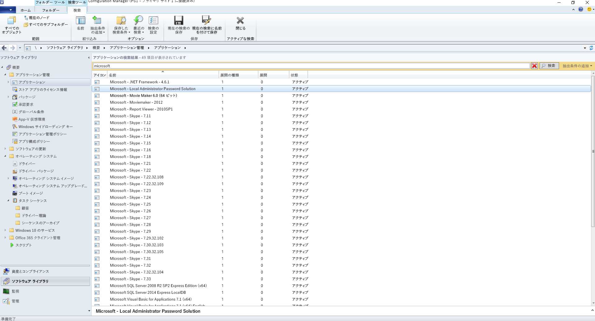
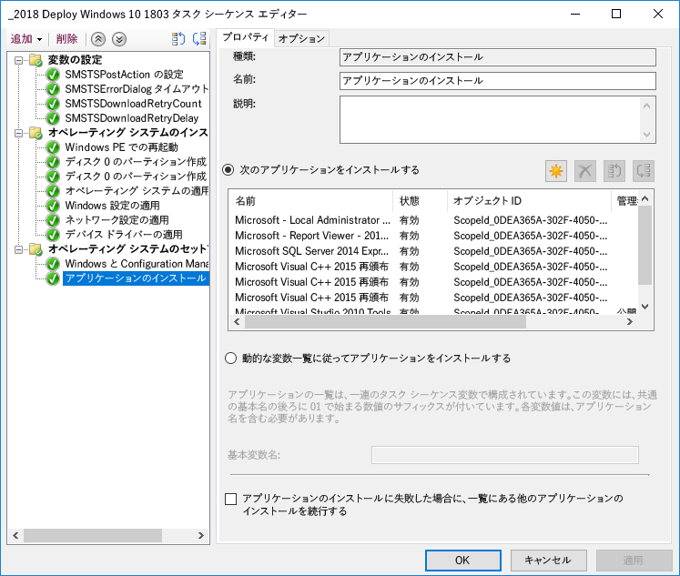
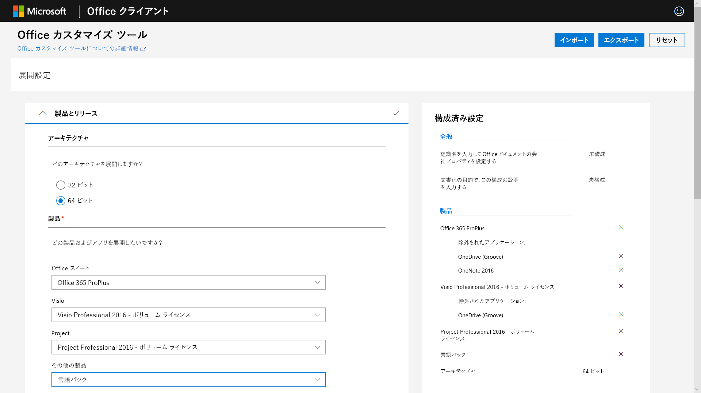

# 手順 3: Office および LOB アプリの配信

<table>
<thead>
<td></td>
<td>
<strong>手順 3: Office および LOB アプリの配信</strong>

目的のアプリがパッケージ化されていて、自動インストールの準備が整っていることを確認してください。Office 365 ProPlus のクイック実行パッケージが、Office アプリケーションの構成、配信および最新状態の維持のための新しいオプションをどのように提供するかについて説明します。
</td>
<td></td>
</thead>
</table>

>[!NOTE]
>Office および LOB アプリの配信は、推奨される展開プロセスの輪における 3 番目の手順であり、Office と LOB をインストールおよび管理するためのオプションもこの手順に含まれます。 展開を正常に行うために、最初の 2 つの手順は必ず実施する必要があります。  デスクトップ展開プロセス全体を確認するには、「[デスクトップ展開センター](https://aka.ms/HowToShift)」を参照してください。
>

この時点で、Office および基幹業務アプリを配信する準備は整っています。そのための方法はいくつかありますが、その中には優れた新しいオプションが含まれています。 一部のアプリケーションは 32 ビットまたは 64 ビットのどちらかでコンパイルされたバージョンとしてのみの使用となりますが、それ以外の Office 365 ProPlus などのアプリケーションは 32 ビットおよび 64 ビットでネイティブにコンパイル済みのコードとして使用できるため、展開するバージョンを決めることがとても重要になります。 新しいデバイスで追加の計算能力と RAM を活用するには、32 ビットの依存関係がない場合は 64 ビット バージョンを使用することをお勧めします。 アドインやファイルに関連する互換性の問題を特定するには、先に進む前に「手順 1: デバイスとアプリの準備」を再度確認するようにしてください。

障害になるものがない場合は、Microsoft Office を含めてすべてのアプリの 64 ビット バージョンを展開することをお勧めします。64 ビット ネイティブでコンパイルされたアプリは、最高のパフォーマンスを発揮する、最も将来性のある選択になります。

Windows にアプリをインストールするための方法とモデルは多数あります。次に、選択可能な配信のオプションについて説明します。

[Windows 10 アプリケーションの管理](https://docs.microsoft.com/windows/application-management/)

## MSI ベースの展開

基幹業務アプリについては、MSI ベースのパッケージまたは実行可能ファイルを使用して、OS 展開のタスク シーケンスの一部としてアプリをインストールすることになるでしょう。 そうしたパッケージは、Windows 10 でも引き続き動作します。

Microsoft Endpoint Configuration Manager や Microsoft Intune などのソフトウェア展開ツールも、MSI パッケージ型のアプリを配信するように最適化されています。Windows 10 でアプリを検証していれば、アプリの配信に Microsoft Endpoint Configuration Manager (Current Branch) を使用できます。Microsoft Intune の「ポータル サイト」を使用している場合は、IT 部門によって承認された組織が利用できるアプリの選択を拡張して、最新のアプリケーションを含めるようにすると、ユーザーは必要なものを自分で選択できます。

## PC のイメージング

もう 1 つの一般的なアプリの配信方法は、PC のイメージングです。 この場合、タスク シーケンスまたは手動のどちらかでサンプル PC にアプリケーションをインストールし、必要なアプリケーションがプレインストールされた状態のシステム イメージをキャプチャします。 ビルドとキャプチャのためのイメージングは、新しい PC のプロビジョニング時に時間を節約することができますが、そのイメージ内のオペレーティング システムとアプリはすぐに古いものになってしまいます。 Windows 10 および Office 365 ProPlus の累積的な更新プログラム モデルでこの問題に対処することはできますが、完全に解決することはできません。 そのため、展開時にアプリケーションをイメージの外側からインストールする thin イメージのアプローチをお勧めします。

イメージに Office 365 ProPlus を含める必要がある場合は、ユーザー ベースのライセンス認証を使用することになります。システム管理者が事前にライセンス認証することはできません。Office 展開ツールを使用して、イメージングするデバイスに Office をプレインストールして、ユーザー サインインをスキップします。 イメージが展開されれば、エンドユーザーは自分の Office 365 の資格情報でサインインし、Office 365 ProPlus をアクティブ化することができます。

[オペレーティング システムをインストールするタスク シーケンスの作成](https://docs.microsoft.com/configmgr/osd/deploy-use/create-a-task-sequence-to-install-an-operating-system)

[オペレーティング システム イメージの一部としての Office 365 ProPlus の展開](https://docs.microsoft.com/deployoffice/deploy-office-365-proplus-as-part-of-an-operating-system-image)

## Office クイック実行 

Office 365 ProPlus はクイック実行を使用してインストールします。今後リリースされる Windows の Office 2019 リリースのすべてのバージョンでは、MSI ベースのパッケージではなくクイック実行になります。 クイック実行には、より速いインストール、より速くて効率的な更新、アンインストールの円滑な実行などの多くの利点があります。 

クイック実行によって配信されたプログラムは、コンピューター上の仮想アプリケーション環境で実行されるため、競合することなく他のアプリケーションと共存することができます。使用するディスク領域は、MSI ベースのパッケージの約半分のみとなります。 Office アプリケーションの配信および管理は、Office アプリのダウンロード、構成、カスタマイズに必要な Office セットアップ エンジンである[Office 展開ツール](https://www.microsoft.com/download/details.aspx?id=49117)で行います。 Office 展開ツールは、Office インストールの構成およびカスタマイズの方法に関するメタデータの処理手順を提供する構成 XML ファイルを読み取ります。

Microsoft では、展開の設定をカスタマイズして構成 XML ファイルを作成するには、[Office カスタマイズ ツール](https://config.office.com/)を使用することをお勧めします。 Office カスタマイズ ツールを使用して、インストールするアプリケーションと言語、アプリケーションの更新方法、アプリケーションの設定、インストール操作を決めることができます。

Configuration Manager は、引き続き Office 365 ProPlus の広範囲の展開に使用できます。Configuration Manager (Current Branch) には、最新版 Office カスタマイズ ツールのネイティブ サポート、インストール時のクイック実行に対応するパッケージのカスタマイズ、およびインストール後のソフトウェア更新管理のネイティブ サポートがあります。

[Office 365 ProPlus の展開ガイド](https://docs.microsoft.com/deployoffice/deployment-guide-for-office-365-proplus)

[Office 365 ProPlus にアップグレードする際に Office の既存の MSI バージョンを削除する](https://docs.microsoft.com/deployoffice/upgrade-from-msi-version)

[Configuration Manager を使用した Office 365 ProPlus の管理](https://docs.microsoft.com/configmgr/sum/deploy-use/manage-office-365-proplus-updates)

[Microsoft Intune で Windows 10 デバイスに Office 365 アプリを割り当てる](https://docs.microsoft.com/intune/apps-add-office365)

## ブラウザー ベースのアプリ

ブラウザー ベースのアプリケーションが引き続き期待どおりに動作するようにするには、いくつかの考慮すべき事項があります。Microsoft Edge との互換性に問題がある特定の Web サイトとアプリがある場合は、エンタープライズ モード サイト一覧を使用することで、その Web サイトが自動的に Internet Explorer 11 で開かれるようになります。

さらに、イントラネット サイトが Microsoft Edge では正常に動作しなくなることがわかっている場合は、すべてのイントラネット サイトが自動的に Internet Explorer 11 で開かれるように設定することもできます。このプロセスでは、それぞれのサイトに IE11 を使用するかどうかを制御するために XML ファイルを使用します (設定の適用にはグループ ポリシーを使用します)。

[エンタープライズ モードとは](https://docs.microsoft.com/internet-explorer/ie11-deploy-guide/what-is-enterprise-mode#what-is-enterprise-mode)

ここまでは、よく知られている展開方法を見てきました。 これら以外にも、アプリの新しい展開方法が 2 つありますので、ぜひ検討してみてください。

## ビジネス向け Microsoft Store 

ビジネス向け Microsoft Store には、無料および有料アプリの検索、取得、管理、および Windows 10 デバイスへの配布に関する方法が幅広く用意されています。 IT 管理者は、必要に応じてライセンスを割り当てて再利用しながら、選択した Microsoft Store アプリを独自のカスタム アプリと共に自分のプライベート ストアに公開できます。 ユーザーはこのストアにのみアクセスすることができ、検索してインストールできるのは承認されたアプリのみとなります。

Store アプリは、UWP アプリとしてネイティブにビルドすることも、デスクトップ ブリッジを使用して Store の既存のアプリを再パッケージ化して、Windows 10 の最新のエクスペリエンスを追加することもできます。Windows 10 のエクスペリエンスを際立たせるために使用するコードを除いて、アプリは未変更のまま引き続き完全信頼のユーザー モードで実行されます。

## MSIX コンテナー化

アプリケーション パッケージの新しいオプションが MSIX です。 MSIX では、Windows で利用可能なコンテナー化のテクノロジが駆使されます。MSIX は、クイック実行、UWP、MSI パッケージの強みを持ち合わせています。 EXE、MSI、APPV、APPX などの既存のインストーラーを MSIX に直接移行するツールを使用すれば、MSIX コンテナー化が、今日使用されている多くのインストール手法が統合されたものであることが分かるはずです。 MSIX は、現在のバージョンの Windows でサポートされています。Windows 10 RS5 以降を実行しているデバイスには、MSIX パッケージ アプリのインストールと実行に必要なすべてのものが含まれています。 Windows 10 は、受け入れた MSIX コンテナーを動的に統合しますが、アプリケーションはオペレーティング システムから分離されたままの状態となります。

コンテナー化によって、パッケージのアンインストールと削除がクリーンなものになります。これは、システムにアイテムを残してしまうことがある、現在の多くの MSI および EXE ベースのパッケージとは異なります。また、アプリケーションのインストールには標準ユーザーの資格情報のみが必要になります。MSIX コンテナーのインストールには管理者の資格情報は必要ありません。MSIX コンテナーによって、更新も効率的になります。更新プログラムが公開されたときに、ブロック レベルの差分を使用することで、正味の新しいバイナリのみが適用されます。これにより、更新プログラムのペイロードが小さくなり、ネットワーク帯域幅の使用量が減って展開が高速化されます。

MSIX の詳細については、「[MSIX 技術コミュニティ サイト](https://techcommunity.microsoft.com/t5/MSIX/ct-p/MSIX)」を参照してください。

## 次の手順

## [手順 4: ユーザーのファイルと設定](https://aka.ms/mdd4)

## 前の手順

## [手順 2: ディレクトリとネットワークの準備](https://aka.ms/mdd2) 
